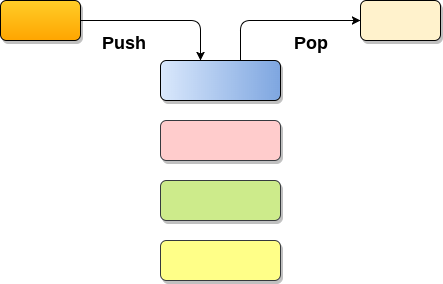
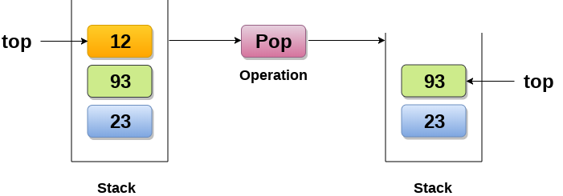

# 堆栈

## 1 简介

### 概念
* 堆栈（英语：stack）又称为栈或堆叠，是计算机科学中一种特殊的串列形式的抽象数据类型，
* 堆栈(Stack)是一个有序列表，它只能在顶端执行插入和删除。
* 堆栈(Stack)是一个递归数据结构，具有指向其顶部元素的指针。
* 堆栈为后进先出(LIFO)列表，即首先插入堆栈的元素将最后从堆栈中删除.



### 应用

* 回溯
* 递归
* 表达式评估和转换
* 解析
* 浏览器
* 编辑器
* 树遍历


### 特点

1. 先入后出，后入先出。
2. 除头尾节点之外，每个元素有一个前驱，一个后继。

### 操作

堆栈数据结构使用两种基本操作：推入（压栈，push）和弹出（弹栈，pop）：

- 推入 push
  - 将数据放入堆栈的顶端（数组形式或串列形式），堆栈顶端 top 指针加一。

- 弹出 pop
  - 将顶端数据数据输出（回传），堆栈顶端数据减一。

- 查看 top
  - 查看堆栈的所有元素而不删除它们。


> 以后有时间来实现这些数据结构

### 数组实现
```C++
```

### 链表实现

```C++
```