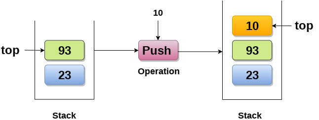

# 堆栈

## 1 简介

### 概念
* 堆栈（stack）又称为栈，是计算机科学中一种特殊的串列形式的抽象数据类型，
* 堆栈(Stack)是一个有序列表，它只能在顶端执行插入和删除。
* 堆栈(Stack)是一个递归数据结构，具有指向其顶部元素的指针。
* 堆栈为后进先出(LIFO)列表，即首先插入堆栈的元素将最后从堆栈中删除.


### 应用

* 深度优先搜索与回溯
* 递归
* 表达式评估和转换
* 解析
* 浏览器
* 编辑器
* 树遍历


### 特点

1. 先入后出，后入先出。
2. 除头尾节点之外，每个元素有一个前驱，一个后继。


## 2 栈的操作
### 基础操作

- 推入 push
  - 将数据放入堆栈的顶端（数组形式或串列形式），堆栈顶端 top 指针加一。

- 弹出 pop
  - 将顶端数据数据输出（回传），堆栈顶端数据减一。

- 查看 top
  - 查看栈顶的元素而不删除它们。


> 以后有时间来实现这些数据结构


## 3 栈的实现

### 数组实现
```C++
#include <stdio.h>   
int stack[100], i, j, choice = 0, n, top = -1;
void push();
void pop();
void show();
void main()
{

    printf("Enter the number of elements in the stack ");
    scanf("%d", &n);
    printf("*********Stack operations using array*********");
    printf("----------------------------------------------\n");
    while (choice != 4)
    {
        printf("Chose one from the below options...\n");
        printf("1.Push\n2.Pop\n3.Show\n4.Exit");
        printf("Enter your choice \n");
        scanf("%d", &choice);
        switch (choice)
        {
        case 1:
        {
            push();
            break;
        }
        case 2:
        {
            pop();
            break;
        }
        case 3:
        {
            show();
            break;
        }
        case 4:
        {
            printf("Exiting....");
            break;
        }
        default:
        {
            printf("Please Enter valid choice ");
        }
        };
    }
}

void push()
{
    int val;
    if (top == n)
        printf("Overflow");
    else
    {
        printf("Enter the value?");
        scanf("%d", &val);
        top = top + 1;
        stack[top] = val;
    }
}

void pop()
{
    if (top == -1)
        printf("Underflow");
    else
        top = top - 1;
}
void show()
{
    for (i = top;i >= 0;i--)
    {
        printf("%d\n", stack[i]);
    }
    if (top == -1)
    {
        printf("Stack is empty");
    }
}
```

### 链表实现

```C++
#include <stdio.h>  
#include <stdlib.h>  
void push();
void pop();
void display();
struct node
{
    int val;
    struct node *next;
};
struct node *head;

void main()
{
    int choice = 0;
    printf("*********Stack operations using linked list*********\n");
    printf("----------------------------------------------\n");
    while (choice != 4)
    {
        printf("Chose one from the below options...\n");
        printf("1.Push\n2.Pop\n3.Show\n4.Exit");
        printf("Enter your choice \n");
        scanf("%d", &choice);
        switch (choice)
        {
        case 1:
        {
            push();
            break;
        }
        case 2:
        {
            pop();
            break;
        }
        case 3:
        {
            display();
            break;
        }
        case 4:
        {
            printf("Exiting....");
            break;
        }
        default:
        {
            printf("Please Enter valid choice ");
        }
        };
    }
}
void push()
{
    int val;
    struct node *ptr = (struct node*)malloc(sizeof(struct node));
    if (ptr == NULL)
    {
        printf("not able to push the element");
    }
    else
    {
        printf("Enter the value");
        scanf("%d", &val);
        if (head == NULL)
        {
            ptr->val = val;
            ptr->next = NULL;
            head = ptr;
        }
        else
        {
            ptr->val = val;
            ptr->next = head;
            head = ptr;

        }
        printf("Item pushed");

    }
}

void pop()
{
    int item;
    struct node *ptr;
    if (head == NULL)
    {
        printf("Underflow");
    }
    else
    {
        item = head->val;
        ptr = head;
        head = head->next;
        free(ptr);
        printf("Item popped");

    }
}
void display()
{
    int i;
    struct node *ptr;
    ptr = head;
    if (ptr == NULL)
    {
        printf("Stack is empty\n");
    }
    else
    {
        printf("Printing Stack elements \n");
        while (ptr != NULL)
        {
            printf("%d\n", ptr->val);
            ptr = ptr->next;
        }
    }
}
```