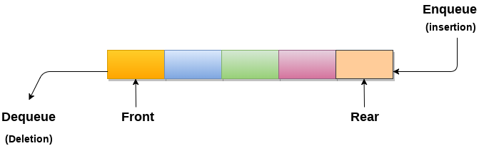

# 队列

## 1 简介

### 概念
* 队列可以定义为有序列表，它允许在一端执行插入操作，称为REAR，删除操作在另一端执行，称为FRONT。
* 队列被称为先进先出列表。



### 应用

* 队列被广泛用作单个共享资源(如打印机，磁盘，CPU)的等待列表。
* 队列用于异步数据传输(例如，数据不以两个进程之间的相同速率传输)。 管道，文件IO，套接字。
* 队列在大多数应用程序中用作缓冲区.
* 队列在操作系统中用于处理中断。

### 时间复杂度

| 时间复杂性 | 访问   | 搜索   | 插入   | 删除   |
|-------|------|------|------|------|
| 平均情况  | θ(n) | θ(n) | θ(1) | θ(1) |
| 最坏情况  | θ(n) | θ(n) | θ(1) | θ(1) |


### 基本操作
* 创建
* 遍历、搜索、查找（显示第一个元素）
* 插入
* 删除


### 队列的数组实现
```C++
```
### 队列的链表实现
```C++
```

## 2 循环队列

### 概念

* 在循环队列中，第一个索引紧跟在最后一个索引之后。 
* 当front = -1和rear = max-1时，循环队列将满。循环队列的实现类似于线性队列的实现。只有在插入和删除的情况下实现的逻辑部分与线性队列中的逻辑部分不同。


### 时间复杂度

| 操作        |      |
|-----------|------|
| Front     | O(1) |
| Rear      | O(1) |
| enQueue() | O(1) |
| deQueue() | O(1) |

### 基本操作
* 创建
* 遍历、搜索、查找（显示第一个元素）
* 插入
* 删除


### 实现
```
```


