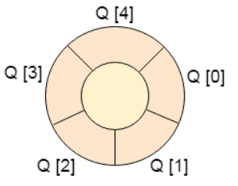

# 循环队列

## 1 简介
### 概念

* 在循环队列中，最后一个索引紧跟在第一个索引之后。 
* 当front = -1和rear = max-1时，循环队列将满。循环队列的实现类似于线性队列的实现。只有在插入和删除的情况下实现的逻辑部分与线性队列中的逻辑部分不同。



### 时间复杂度

| 操作        |      |
|-----------|------|
| Front     | O(1) |
| Rear      | O(1) |
| enQueue() | O(1) |
| deQueue() | O(1) |


## 2 循环队列的操作
### 基本操作
* 创建
* 遍历、搜索、查找（显示第一个元素）
* 插入
* 删除

## 3 循环队列的实现

### 数组实现
```
#include<stdio.h>   
#include<stdlib.h>  
#define maxsize 5  
void insert();
void delete();
void display();
int front = -1, rear = -1;
int queue[maxsize];
void main()
{
    int choice;
    while (choice != 4)
    {
        printf("*************************Main Menu*****************************\n");
        printf("=================================================================\n");
        printf("1.insert an element\n2.Delete an element\n3.Display the queue\n4.Exit\n");
        printf("Enter your choice ?");
        scanf("%d", &choice);
        switch (choice)
        {
        case 1:
            insert();
            break;
        case 2:
            delete();
            break;
        case 3:
            display();
            break;
        case 4:
            exit(0);
            break;
        default:
            printf("Enter valid choice??\n");
        }
    }
}
void insert()
{
    int item;
    printf("Enter the element\n");
    scanf("%d", &item);
    if ((rear + 1) % maxsize == front)
    {
        printf("OVERFLOW");
        return;
    }
    else if (front == -1 && rear == -1)
    {
        front = 0;
        rear = 0;
    }
    else if (rear == maxsize - 1 && front != 0)
    {
        rear = 0;
    }
    else
    {
        rear = (rear + 1) % maxsize;
    }
    queue[rear] = item;
    printf("Value inserted ");
}
void delete()
{
    int item;
    if (front == -1 & rear == -1)
    {
        printf("UNDERFLOW\n");
        return;
    }
    else if (front == rear)
    {
        front = -1;
        rear = -1;
    }
    else if (front == maxsize - 1)
    {
        front = 0;
    }
    else
        front = front + 1;
}

void display()
{
    int i;
    if (front == -1)
        printf("Circular Queue is Empty!!!\n");
    else
    {
        i = front;
        printf("Circular Queue Elements are : \n");
        if (front <= rear) {
            while (i <= rear)
                printf("%d %d %d\n", queue[i++], front, rear);
        }
        else {
            while (i <= maxsize - 1)
                printf("%d %d %d\n", queue[i++], front, rear);
            i = 0;
            while (i <= rear)
                printf("%d %d %d\n", queue[i++], front, rear);
        }
    }
}
```
### 循环链表实现
