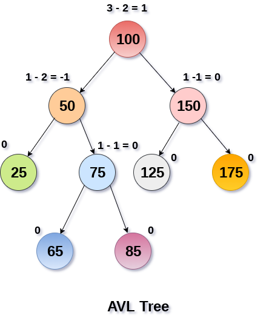

# 平衡二叉树
> 树>二叉树>二叉搜索树>二叉平衡树

## 1 简介

### 概念

* 如果每个节点的平衡因子在-1到1之间，则称树是平衡的，否则，树将是不平衡的并且需要平衡。
```
平衡系数(k)=高度(左(k)) - 高度(右(k))
```

* 如果任何节点的平衡因子为1，则意味着左子树比右子树高一级。
* 如果任何节点的平衡因子为0，则意味着左子树和右子树包含相等的高度。
* 如果任何节点的平衡因子是-1，则意味着左子树比右子树低一级。




### 复杂性

| 算法 | 平均情况     | 最坏情况     |
|----|----------|----------|
| 空间 | o(n)     | o(n)     |
| 搜索 | o(log n) | o(log n) |
| 插入 | o(log n) | o(log n) |
| 删除 | o(log n) | o(log n) |

### 优势

* AVL树通过不让它倾斜来控制二叉搜索树的高度。 高度为h的二叉搜索树中的所有操作所花费的时间是O(h)。 但是，如果二叉搜索树变得偏斜(即最坏的情况)，它可以扩展到O(n)。 
* 通过将该高度限制为log n，AVL树将每个操作的上限强加为O(log n)，其中n是节点的数量

## 2 操作


### 基本操作

* 创建
* 遍历、搜索、查找
* 插入
* 删除

```
```
### 遍历
* AVL树也是二叉搜索树，所有操作都以与在二叉搜索树中执行的相同方式执行。 搜索和遍历不会导致AVL树违反属性
### 插入
* AVL树中的插入的执行方式与在二叉搜索树中执行的方式相同。但是，它可能会导致违反AVL树属性，因此树可能需要平衡。可以通过应用旋转来平衡树。
### 删除
* 删除也可以按照在二叉搜索树中执行的相同方式执行。 删除也可能会扰乱树的平衡，因此，使用各种类型的旋转来重新平衡树。
