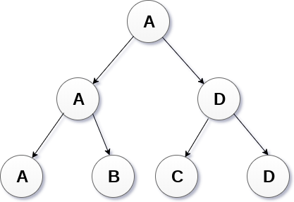

# 树

> 树

## 0 简介

### 定义
**树**是一种抽象数据类型或是实现这种抽象数据类型的数据结构，用来模拟具有树状结构性质的数据集合。它是由 n（n>0）个有限节点组成一个具有层次关系的集合。

* 树是一种递归数据结构，包含一个或多个数据节点的集合，其中一个节点被指定为树的根，而其余节点被称为根的子节点。
* 除根节点之外的节点被划分为非空集，其中每个节点将被称为子树。
* 树的节点要么保持它们之间的父子关系，要么它们是姐妹节点。
* 在通用树中，一个节点可以具有任意数量的子节点，但它只能有一个父节点。


### 特点

- 每个节点都只有有限个子节点或无子节点。
- 树有且仅有一个根节点。
- 根节点没有父节点；非根节点有且仅有一个父节点。
- 每个非根节点可以分为多个不相交的子树。
- 树里面没有环路。

### 术语
- **祖先节点**： 节点的祖先是从根到该节点的路径上的任何前节点。根节点没有祖先节点。
- **父节点**：若一个节点含有子节点，则这个节点称为其子节点的父节点；
- **子节点**：一个节点含有的子树的根节点称为该节点的子节点；
- **根节点**： 根节点是树层次结构中的最顶层节点。 换句话说，根节点是没有任何父节点的节点.
- **叶子节点**或**终端节点**：度为零的节点；
- **兄弟节点**：具有相同父节点的节点互称为兄弟节点；
- **非终端节点**或**分支节点**：度不为零的节点；
- **子孙**：以某节点为根的子树中任一节点都称为该节点的子孙。


- **节点的度**：一个节点含有的子树的个数称为该节点的度；
- **树的度**：一棵树中，最大的节点度称为树的度；
- 节点的**层次**：从根开始定义起，根为第 1 层，根的子节点为第 2 层，以此类推；
- **深度**：对于任意节点 n,n 的深度为从根到 n 的唯一路径长，**根节点的深度为0**；
- **高度**：对于任意节点 n,n 的高度为从 n 到一片树叶的最长路径长，所有**叶节点的高度为0**；
- **森林**：由 m（m>=0）棵互不相交的树的集合称为森林；
- **路径**： 连续边的序列称为路径。 在上图所示的树中，节点E的路径为A→B→E。
- **级别=水平**： 为树的每个节点分配一个级别编号，使得每个节点都存在于高于其父级的一个级别。**根节点级别0**
- **键**：节点总存储的值。
- **索引**：该节点子节点的个数。


### 性质

- 树中的节点数等于所有节点的度数加 1。
- 度为 m 的树中第 i 层上至多有  $m^{i-1}$  个节点（$i ≥ 1$）。
- 高度为 h 的 m 次树至多有 $(m^h-1)/(m-1)$ 个节点。
- 具有 n 个节点的 m 次树的最小高度为 $\log_m{(n(m-1)+1)}$ 。


## 2 树的种类
按节点有无顺序划分
* **有序树**：树中任意节点的子节点之间有顺序关系，这种树称为有序树；
* **无序树**：树中任意节点的子节点之间没有顺序关系，这种树称为无序树，也称为自由树。


按照结构划分
* 一般树(General Tree)按层次顺序存储元素，其中顶级元素始终以0级作为根元素。 除根节点之外的所有节点都以级别数存在。 存在于同一级别的节点称为兄弟节点，而存在于不同级别的节点表现出它们之间的父子关系。 节点可以包含任意数量的子树。 每个节点包含3个子树的树称为三元树。

* 二叉树：每个节点最多含有两个子树的树称为二叉树；
  - **严格二叉树**：对于一颗二叉树，假设其深度为 d（d>1）。除了第 d 层外，其它各层的节点数目均已达最大值，且第 d 层所有节点从左向右连续地紧密排列，这样的二叉树被称为完全二叉树；
  - 完全二叉树：所有叶节点都在最底层的完全二叉树；
  - 平衡二叉树（AVL 树）：当且仅当任何节点的两棵子树的高度差不大于 1 的二叉树；
  - 搜多二叉树（二叉查找树）：也称二叉搜索树、有序二叉树；
  - B 树：一种对读写操作进行优化的自平衡的二叉查找树，能够保持数据有序，拥有多于两个子树。
  - B+树：
* 多叉树


按应用场景划分
* 霍夫曼树:最短的二叉树称为哈夫曼树或最优二叉树；
* 表达式树:用于评估简单的算术表达式。表达式树基本上是二叉树，其中内部节点由运算符表示，而叶节点由操作数表示。表达式树被广泛用于解决代数表达式，如(a + b)*(a-b)

* 竞赛树:用于记录两名比赛者之间每轮比赛的胜者。 比赛树也可以称为选择树或获胜者树。 外部节点表示正在播放匹配的比赛者，而内部节点表示所播放的匹配的胜者。 在最顶层，比赛的获胜者作为树的根节点出现。


## 3 树的实现
### 数据实现
* 使用结构体和指针实现树
```C++
struct treenode
{
    int root;  
    struct treenode *father;//父节点
    struct treenode *son;//子节点
    struct treenode *next;//兄弟节点
}
```