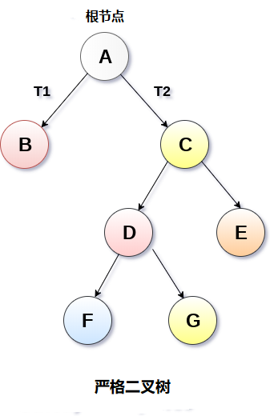
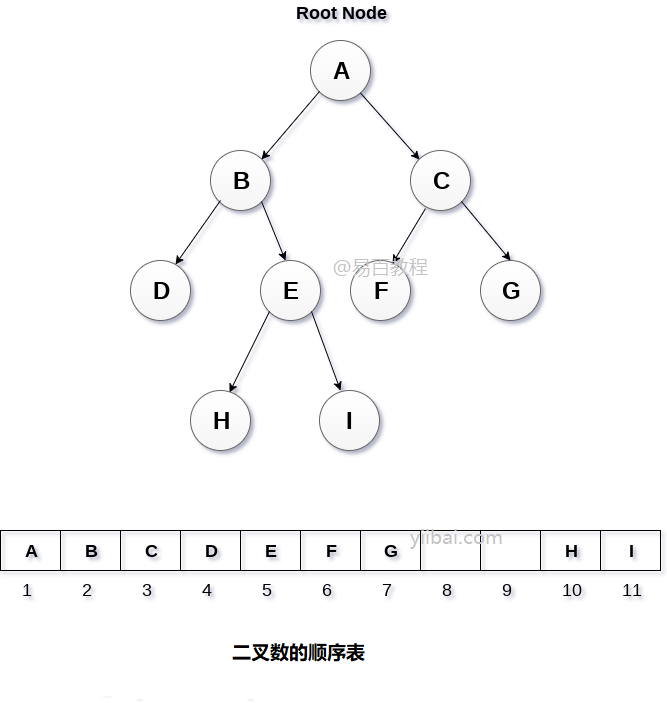

# 二叉树
> 树>二叉树

## 1 二叉树简介
### 概念

* 二叉树是一种特殊类型的通用树，它的每个节点最多可以有两个子节点。 二叉树通常被划分为三个不相交的子集。
  * 节点的根
  * 左二叉树
  * 右二叉树


### 性质

1. 二叉树第 i 层上的结点数目最多为 **2<sup>i-1</sup>** (i≥1)。
2. 深度为 k 的二叉树至多有 **2<sup>k</sup>-1** 个结点(k≥1)。
3. 包含 n 个结点的二叉树的高度至少为 **log<sub>2</sub>(n+1)**。
4. 在任意一棵二叉树中，若终端结点的个数为 n0，度为 2 的结点数为 n2，则 n0=n2+1。

## 2 二叉树分类

### 严格二叉树

* 在严格二叉树中，每个非叶节点包含非空的左和右子树。 换句话说，每个非叶节点的等级将始终为2。具有n个叶子的严格二叉树将具有(2n-1)个节点。



### 完全二叉树

* 如果所有叶子都位于相同的水平d，则称二元树是完全二叉树。完全二叉树是二叉树，在0级和d级之间的每个级别包含正好$2 ^d$个节点。 具有深度d的完全二叉树中的节点总数是$2^{(d+1)}-1$，其中叶节点是$2^d&,非叶节点是$2^d-1$。


## 3 二叉树的操作——遍历搜索

### 遍历搜索方法

* 深度优先搜索（DFS）

  * 在这个策略中，我们采用 深度 作为优先级，以便从跟开始一直到达某个确定的叶子，然后再返回到达另一个分支。深度优先搜索策略又可以根据根节点、左孩子和右孩子的相对顺序被细分为**先序遍历**，**中序遍历**和**后序遍历**。


* 广度优先搜索（BFS）

  * 我们按照高度顺序一层一层的访问整棵树，高层次的节点将会比低层次的节点先被访问到。又称为**层序遍历**。


| 遍历   | 描述  |
|----------|----------------------------------------|
| 前序遍历 | 首先遍历根，然后分别遍历左子树和右子树。 该过程将递归地应用于树的每个子树。 |
| 中序遍历 | 首先遍历左子树，然后分别遍历根和右子树。 该过程将递归地应用于树的每个子树。 |
| 后序遍历 | 遍历左子树，然后分别遍历右子树和根。 该过程将递归地应用于树的每个子树。  |
|层序遍历|按照层次的方法，依次遍历每一层的节点，一般使用队列实现|


### 前序遍历
* 第一个节点肯定是根节点。
```C++
   //前序遍历
    void pre_order(TreeNode*node){
        if(node == nullptr){
            return;
        }
        process(node);
        pre_order(node->left);
        pre_order(node->right);
        return;
    }
```
### 中序遍历
```C++
    //中序遍历
    void mid_order(TreeNode*node){
        if(node == nullptr){
            return;
        }
        mid_order(node->left);
        process(node);
        mid_order(node->right);
        return;
    }
```
### 后序遍历
* 最后一个节点肯定是根节点。
```C++
    //后续遍历
    void lst_order(TreeNode* node){
        if(node == nullptr){
            return;
        }
        lst_order(node->left);
        lst_order(node->right);
        process(node);
    }
```
### 层序遍历
```C++
    // 层序遍历
    void layer_order(TreeNode*node){
        queue<TreeNode*> que;
        que.push(node);
        while(!que.empty()){
            if(que.front()==nullptr){
                continue;
            }
            process(que.front());
            que.push(que.front()->left);
            que.push(que.front()->right);
            que.pop();
        }
    }
```
## 4 二叉树实现

### 链表实现

* 二叉树以链表的形式存储在存储器中，其节点的数量存储在非连续的存储器位置并通过像树一样继承父子关系而链接在一起。 每个节点包含三个部分：指向左节点的指针，数据元素和指向右节点的指针。 每个二叉树都有一个根指针，指向二叉树的根节点。 在空二进制树中，根指针将指向null。


```
```
### 数组实现

* 这是存储树元素的最简单的内存分配技术，但它是一种效率低下的技术，因为它需要大量空间来存储树元素。 下图显示了二叉树及其内存分配。


* 在这种表示方式中，数组用于存储树元素。 数组的大小将等于树中存在的节点数。 树的根节点将出现在数组的第一个索引处。 如果节点存储在第i个索引处，则其左右子节点将存储在2i和2i + 1位置。 如果数组的第一个索引，即tree[1]为0，则表示树为空。
```
```

## 重建二叉树问题

* 给定了二叉树的任何一种遍历序列，都无法唯一确定相应的二叉树。
* 如果知道了二叉树的中序遍历序列和任意的另一种遍历序列，就可以唯一地确定二叉树。

* 中序遍历能够分出子树的根节点的左右。中序和后序遍历能够区根节点。

## 5 二叉树相关的问题


- [二叉树的前序遍历](https://leetcode-cn.com/problems/binary-tree-preorder-traversal)
- [二叉树的中序遍历](https://leetcode-cn.com/problems/binary-tree-inorder-traversal)
- [二叉树的后序遍历](https://leetcode-cn.com/problems/binary-tree-postorder-traversal)
- [二叉树的层序遍历](https://leetcode-cn.com/problems/binary-tree-level-order-traversal)

#### 二叉树递归

- [二叉树的最大深度](https://leetcode-cn.com/problems/maximum-depth-of-binary-tree)
- [对称二叉树](https://leetcode-cn.com/problems/symmetric-tree)
- [路径总和](https://leetcode-cn.com/problems/path-sum)

#### 其他

- [ ] [maximum-depth-of-binary-tree](https://leetcode-cn.com/problems/maximum-depth-of-binary-tree/)
- [ ] [balanced-binary-tree](https://leetcode-cn.com/problems/balanced-binary-tree/)
- [ ] [binary-tree-maximum-path-sum](https://leetcode-cn.com/problems/binary-tree-maximum-path-sum/)
- [ ] [lowest-common-ancestor-of-a-binary-tree](https://leetcode-cn.com/problems/lowest-common-ancestor-of-a-binary-tree/)
- [ ] [binary-tree-level-order-traversal](https://leetcode-cn.com/problems/binary-tree-level-order-traversal/)
- [ ] [binary-tree-level-order-traversal-ii](https://leetcode-cn.com/problems/binary-tree-level-order-traversal-ii/)
- [ ] [binary-tree-zigzag-level-order-traversal](https://leetcode-cn.com/problems/binary-tree-zigzag-level-order-traversal/)
- [ ] [validate-binary-search-tree](https://leetcode-cn.com/problems/validate-binary-search-tree/)
- [ ] [insert-into-a-binary-search-tree](https://leetcode-cn.com/problems/insert-into-a-binary-search-tree/)

### 二叉搜索树经典题

- [ ] [validate-binary-search-tree](https://leetcode-cn.com/problems/validate-binary-search-tree/)
- [ ] [insert-into-a-binary-search-tree](https://leetcode-cn.com/problems/insert-into-a-binary-search-tree/)
- [ ] [delete-node-in-a-bst](https://leetcode-cn.com/problems/delete-node-in-a-bst/)
- [ ] [balanced-binary-tree](https://leetcode-cn.com/problems/balanced-binary-tree/)

## 参考资料

- [https://zh.wikipedia.org/wiki/树\_(数据结构)](<https://zh.wikipedia.org/wiki/树_(数据结构)>)
