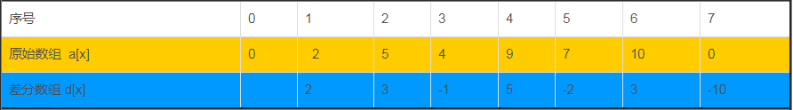
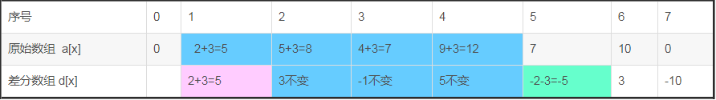

# 差分数组Sparse Array


## 1 定义

* 定义：原数组为a，差分数组为d，那么有
$$
d[i] = a[i] - a[i - 1]
$$



* 其实差分数组是一个**辅助数组**，从侧面来表示给定某一数组的变化，一般用来对数组进行区间修改的操作

## 2 性质
1. a[i]等于d[i]的前缀和

$$
a[i] = \sum_{0}^i d_i
$$

2. d[i]等于a[i]两个临近元素的差
$$
d[i] = a[i] - a[i - 1]
$$

## 3 应用
### 区间修改

* 当对一个区间进行增减某个值的时候，他的差分数组对应的区间左端点的值会同步变化，而他的右端点的后一个值则会相反地变化。他们的差分数组其实是不会变化的。

* 例如：将区间【1，4】的数值全部加上3



* [l,r]区间内的数加k可以表示为如下形式：

$$
d[l]+k\\
d[r+1]-k
$$

### 元素求值
* 既然我们要对区间进行修改，那么差分数组的作用一定就是求多次进行区间修改后的数组。
* 直接反过来即得
$$
a[i]=a[i-1]+d[i] 
$$

## 实例1 区间涂色


### 问题描述

* N个气球排成一排，从左到右依次编号为1,2,3....N.每次给定2个整数a b(a <= b),lele便为骑上他的“小飞鸽"牌电动车从气球a开始到气球b依次给每个气球涂一次颜色。但是N次以后lele已经忘记了第I个气球已经涂过几次颜色了，你能帮他算出每个气球被涂过几次颜色吗？

### 问题分析

* 多次区间修改后求数组的值。


### 算法实现

```C++
#include<iostream>
#include<cstdio>
#include<algorithm>
#include<cstring>
#include<string>
#include<cmath>
#define ll long long
#define mem(a,b) memset(a,b,sizeof(a))
using namespace std;
const int inf=0x3f3f3f3f;
const int mm=1e5+10;
 
int a[mm],b[mm];
int x,y;
int main()
{
    int n;
    while(scanf("%d",&n)&&n){
        mem(a,0);
        mem(b,0);
        for(int i=1;i<=n;i++){
            scanf("%d%d",&x,&y);
            b[x]++;
            b[y+1]--;
        }
        for(int i=1;i<=n;i++)
            a[i]=a[i-1]+b[i];
       
        for(int i=1;i<n;i++)
            printf("%d ",a[i]);
        printf("%d\n",a[n]);
    }
    return 0;
}
```

## 实例2 最多同时进行的会议

### 问题描述

给出会议的起始时间和截止时间。计算同一时间最多有多少场会议。

### 问题分析

会议持续一个时间段。该时间段都加1.可以通过查分数组来表示区间的增加。最后计算某一时刻具有的会议数量。

