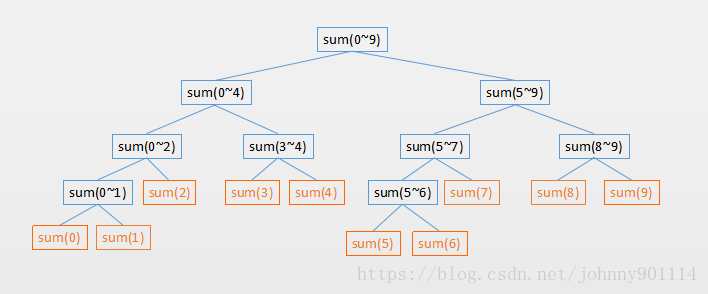
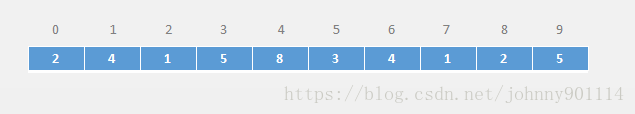
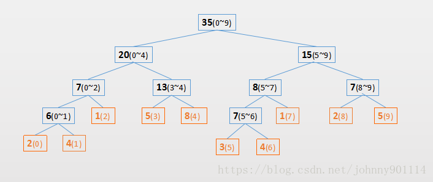
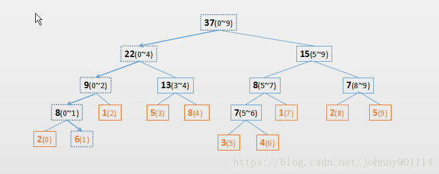

# 线段树Segment Tree

## 1 线段树的概念

### 概述
* 线段树(Segment Tree)也是一棵树，只不过元素的值代表一个区间。常用区间的 统计 操作，比如一个区间的 **最大值(max),最小值(min),和(sum)** 等等

* 如一个长度为10的数组，它对应的 求和 线段树，如下图所示(图中的数字表示索引)：



### 定义
* 线段树是一个平衡二叉树，但不一定是完全二叉树。
    * 根节点就是 0~lenght-1 的和
    * 根节点的左右子树平分根节点的区间
    * 然后依次类推，直到只有一个元素不能划分为止，该元素也就是二叉树的叶子节点。

### 复杂度
* 时间复杂度为O(log n)
* 空间复杂度为O(n)

## 2 线段树的基本操作
### 构建线段树

* 根据上面我们对线段树的描述，构建一个线段树就比较简单了，根节点就是整个区间，根节点的左右子树平分根节点的区间，直至区间内只剩下一个元素不能平分为止。如下面递归的伪代码：
```C++
private void buildSegmentTree(int treeIndex, int treeLeft, int treeRight) {
    //如果区间内只剩下一个元素
    if (treeLeft == treeRight) {
        tree[treeIndex] = data[treeLeft];
        return;
    }
    //当前节点左子树索引
    int leftTreeIndex = getLeft(treeIndex);
    //当前节点右子树索引
    int rightTreeIndex = getRight(treeIndex);
    //int mid = (left+right)/2;
    int mid = treeLeft + (treeRight - treeLeft) / 2;
    //构建左子树
    buildSegmentTree(leftTreeIndex, treeLeft, mid);
    //构建右子树
    buildSegmentTree(rightTreeIndex, mid + 1, treeRight);
    //当前节点存放的值，根据具体业务，如果求和就是两个值相加
    //如果是求最大值，那么就存放最大值
    tree[treeIndex] = tree[leftTreeIndex] + tree[rightTreeIndex]

}
```

* 对下面一个数组



* 就会构建成如下一个线段树(图中括号里数字表示索引区间)




### 修改线段树

* 针对上面的数组，把索引为 1 的值改成 6 如下图所示


* 那么线段树需要修改的节点有(虚线标明)：



### 线段树的查询
* 对于线段树的查询，主要有以下几种情况：
  * 要查询的区间在刚好就是当前节点的区间
  * 要查找的区间在当前节点的左子树区间
  * 要查找的区间在当前节点的右子树区间
  * 要查找的区间一部分在当前节点的左子树区间，一部分在右子树区间

## 3 实现一个线段树
* 下面实现的线段树，有三个功能：
  * 把数组构建成一颗线段树
  * 线段树的修改
  * 线段树的查询
```java
public class ArraySegmentTree<T> {

    private T tree[];
    private T data[];

    private Merger<T> merger;

    public interface Merger<T> {
        T merge(T a, T b);
    }

    public ArraySegmentTree(T[] arr, Merger<T> merger) {
        this.merger = merger;
        data = (T[]) new Object[arr.length];
        for (int i = 0; i < data.length; i++) {
            data[i] = arr[i];
        }

        this.tree = (T[]) new Object[data.length * 4];
        buildSegmentTree(0, 0, data.length - 1);

    }


    /**
     * 构建线段树
     *
     * @param treeIndex 当前需要添加节点的索引
     * @param treeLeft  treeIndex左边界
     * @param treeRight treeIndex右边界
     */
    private void buildSegmentTree(int treeIndex, int treeLeft, int treeRight) {
        if (treeLeft == treeRight) {
            tree[treeIndex] = data[treeLeft];
            return;
        }
        //当前节点左子树索引
        int leftTreeIndex = getLeft(treeIndex);
        //当前节点右子树索引
        int rightTreeIndex = getRight(treeIndex);
        //int mid = (left+right)/2; 如果left和right很大，可能会导致整型溢出
        int mid = treeLeft + (treeRight - treeLeft) / 2;
        //构建左子树
        buildSegmentTree(leftTreeIndex, treeLeft, mid);
        //构建右子树
        buildSegmentTree(rightTreeIndex, mid + 1, treeRight);
        //当前节点存放的值
        tree[treeIndex] = merger.merge(tree[leftTreeIndex], tree[rightTreeIndex]);

    }

    public T query(int start, int end) {
        return query(0, 0, data.length - 1, start, end);
    }

    /**
     * @param treeIndex 当前查找的节点
     * @param treeLeft  treeIndex的左边界
     * @param treeRight treeIndex的右边界
     * @param queryL    用户需要查找的左边界
     * @param queryR    用户需要查找的右边界
     * @return
     */
    private T query(int treeIndex, int treeLeft, int treeRight, int queryL, int queryR) {

        //1, 需要查找的范围完刚好在这个treeIndex节点的区间
        if (treeLeft == queryL && treeRight == queryR) {
            return tree[treeIndex];
        }

        //当前节点的区间的中间点
        int mid = treeLeft + (treeRight - treeLeft) / 2;
        //左子树索引
        int leftTreeIndex = getLeft(treeIndex);
        //右子树索引
        int rightTreeIndex = getRight(treeIndex);


        //2, 需要查找的范围完全在左子树的区间里
        if (queryR <= mid) {
            return query(leftTreeIndex, treeLeft, mid, queryL, queryR);
        }
        //3, 需要查找的范围完全在右子树区间里
        if (queryL >= mid + 1) {
            return query(rightTreeIndex, mid + 1, treeRight, queryL, queryR);
        }

        //需要查找的范围一部分在左子树里，一部分在右子树中
        T left = query(leftTreeIndex, treeLeft, mid, queryL, mid);
        T right = query(rightTreeIndex, mid + 1, treeRight, mid + 1, queryR);
        return merger.merge(left, right);
    }
    
    
    public void update(int index, T e) {
        data[index] = e;
        update(0, 0, data.length - 1, index, e);
    }


    private void update(int treeIndex, int treeLeft, int treeRight, int index, T e) {
        if (treeLeft == treeRight) {
            tree[treeIndex] = e;
            return;
        }

        int mid = treeLeft + (treeRight - treeLeft) / 2;
        int leftChildIndex = getLeft(treeIndex);
        int rightChildIndex = getRight(treeIndex);

        if (index <= mid) {
            update(leftChildIndex, treeLeft, mid, index, e);
        } else if (index >= mid + 1) {
            update(rightChildIndex, mid + 1, treeRight, index, e);
        }

        //更改完叶子节点后，还需要对他的所有祖辈节点更新
        tree[treeIndex] = merger.merge(tree[leftChildIndex], tree[rightChildIndex]);
    }

    public T get(int index) {
        return data[0];
    }

    public int size() {
        return data.length;
    }

    public int getLeft(int index) {
        return index * 2 + 1;
    }

    public int getRight(int index) {
        return index * 2 + 2;
    }

    @Override
    public String toString() {
        StringBuilder builder = new StringBuilder();
        builder.append("[");
        for (int i = 0; i < tree.length; i++) {
            if (tree[i] == null) {
                continue;
            }
            builder.append(tree[i]).append(',');
        }
        builder.deleteCharAt(builder.length() - 1);
        builder.append(']');
        return builder.toString();
    }
}
```