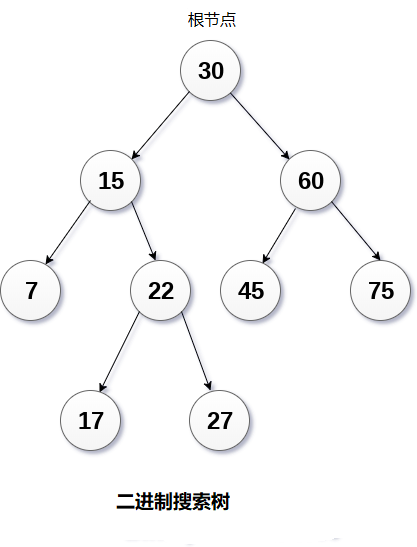

# 二叉搜索树
> 树>二叉树>二叉搜索树

## 1 简介

### 概念
* 二叉搜索树是二叉树，其节点按特定顺序排列。也称为称为有序二叉树。
  * 左子树中所有节点的值小于根的值。
  * 右子树中所有节点的值大于或等于根的值。
  * 此规则将递归地应用于根的所有左子树和右子树



### 优点

* 在搜索过程中，它会在每一步删除半个子树。
* 在二叉搜索树中搜索元素需要o(log2n)时间。
* 在最坏的情况下，搜索元素所花费的时间是0(n)。
* 与数组和链表中的操作相比，它还加快了插入和删除操作。

## 2 基本操作
### 基本操作

* 创建
* 遍历（同上）
* 插入
* 删除

### 遍历
* 二叉搜索树的前序遍历。
* 二叉搜索书的中序遍历。中序的输出结果其实就是二叉搜索树排序后的结果。
* 二叉搜索树的后续遍历。
### 插入
* 使用下列元素创建二叉树的过程
```
43, 10, 79, 90, 12, 54, 11, 9, 50
```


### 删除


## 3 二叉搜索树实现
```C++
#include <iostream>  
#include <stdlib.h>  
using namespace std;  
struct Node {  
    int data;  
    Node *left;  
    Node *right;  
};  
Node* create(int item)  
{  
    Node* node = new Node;  
    node->data = item;  
    node->left = node->right = NULL;  
    return node;  
}  

void inorder(Node *root)  
{  
    if (root == NULL)  
        return;  

    inorder(root->left);  
    cout<< root->data << "   ";  
    inorder(root->right);  
}  
Node* findMinimum(Node* cur)  
{  
    while(cur->left != NULL) {  
        cur = cur->left;  
    }  
    return cur;  
}  
Node* insertion(Node* root, int item)  
{  
    if (root == NULL)  
        return create(item);  
    if (item < root->data)  
        root->left = insertion(root->left, item);  
    else  
        root->right = insertion(root->right, item);  

    return root;  
}  

void search(Node* &cur, int item, Node* &parent)  
{  
    while (cur != NULL && cur->data != item)  
    {  
        parent = cur;  

        if (item < cur->data)  
            cur = cur->left;  
        else  
            cur = cur->right;  
    }  
}  

void deletion(Node*& root, int item)  
{  
    Node* parent = NULL;  
    Node* cur = root;  

    search(cur, item, parent);  
    if (cur == NULL)  
        return;  

    if (cur->left == NULL && cur->right == NULL)  
    {  
        if (cur != root)  
        {  
            if (parent->left == cur)  
                parent->left = NULL;  
            else  
                parent->right = NULL;  
        }  
        else  
            root = NULL;  

        free(cur);       
    }  
    else if (cur->left && cur->right)  
    {  
        Node* succ  = findMinimum(cur- >right);  

        int val = succ->data;  

        deletion(root, succ->data);  

        cur->data = val;  
    }  

    else  
    {  
        Node* child = (cur->left)? Cur- >left: cur->right;  

        if (cur != root)  
        {  
            if (cur == parent->left)  
                parent->left = child;  
            else  
                parent->right = child;  
        }  

        else  
            root = child;  
        free(cur);  
    }  
}  

int main()  
{  
   Node* root = NULL;  
   int keys[8];  
   for(int i=0;i<8;i++)  
    {  
    cout << "Enter value to be inserted";  
    cin>>keys[i];  
        root = insertion(root, keys[i]);  
    }  

    inorder(root);  
    cout<<"\n";  
    deletion(root, 10);  
    inorder(root);  
    return 0;  
}
```