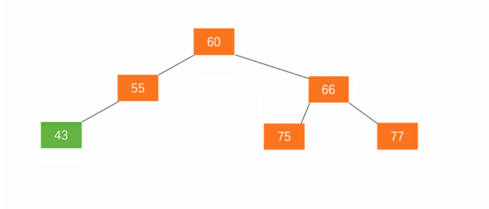
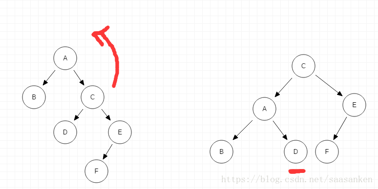
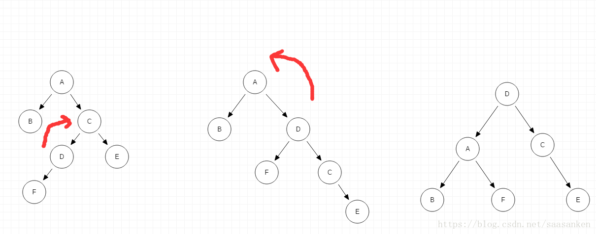

# 平衡二叉树
> 树>二叉树>二叉搜索树>二叉平衡树

> 参考文献
> * [AVL](https://zhuanlan.zhihu.com/p/56066942)
## 1 简介

### 概念
1. 满足二叉搜索树的定义
2. 所有结点的平衡因子的绝对值都不超过1，即平衡因子只能是1,0,-1三个值。
   * 如果任何节点的平衡因子为1，则意味着左子树比右子树高一级。
   * 如果任何节点的平衡因子为0，则意味着左子树和右子树包含相等的高度。
   * 如果任何节点的平衡因子是-1，则意味着左子树比右子树低一级。
```
平衡系数=左子树的高度 - 右子树的高度
```


### 复杂性

| 算法 | 平均情况     | 最坏情况     |
|----|----------|----------|
| 空间 | o(n)     | o(n)     |
| 搜索 | o(log n) | o(log n) |
| 插入 | o(log n) | o(log n) |
| 删除 | o(log n) | o(log n) |

### 优势

* AVL树能防止二叉树偏斜，控制二叉搜索树的高度。高度为h的二叉搜索树中的所有操作所花费的时间是O(h)。
* 如果普通二叉搜索树变得偏斜(即最坏的情况)，它可以扩展到O(n)。 
* 通过将该高度限制为log n，AVL树将每个操作的上限强加为O(log n)，其中n是节点的数量

## 2 操作

### 基本操作

* 创建
* 遍历（同上）
* 插入
* 删除
* 左旋
* 右旋


### 插入
* AVL树中的插入的执行方式与在二叉搜索树中执行的方式相同。
* 它可能会导致违反AVL树属性，因此树可能需要平衡。可以通过应用旋转来平衡树。

### 删除
* 删除也可以按照在二叉搜索树中执行的相同方式执行。
* 删除也可能会扰乱树的平衡，因此，使用各种类型的旋转来重新平衡树。
* 删除节点的步骤如下：
  1. 以前三种情况为基础尝试删除节点，并将访问节点入栈。
  2. 如果尝试删除成功，则依次检查栈顶节点的平衡状态，遇到非平衡节点，即进行旋转平衡，直到栈空。
  3. 如果尝试删除失败，证明是第四种情况。这时先找到被删除节点的右子树最小节点并删除它，将访问节点继续入栈。
  4. 再依次检查栈顶节点的平衡状态和修正直到栈空。
## 3 操作——平衡
### 左旋
> 为了使树平衡，使用的手段有 ： 左旋和右旋。右旋， 即是顺时针旋转。左旋，即是逆时针旋转。

* 左旋。加入新节点 99 后，节点 66 的左子树高度为 1，右子树高度为 3，此时平衡因子为 -2。为保证树的平衡，此时需要对节点 66 做出旋转，因为右子树高度高于左子树，对节点进行左旋操作，
  1. 节点的右孩子替代此节点位置
  2. 右孩子的左子树变为该节点的右子树
  3. 节点本身变为右孩子的左子树


### 右旋

* 右旋。
  1. 节点的左孩子代表此节点 
  2. 节点的左孩子的右子树变为节点的左子树 
  3. 将此节点作为左孩子节点的右子树。




### 插入过程的四种旋转

> 删除与插入节点的四种旋转方式类似

| 插入方式 | 描述 | 旋转方式 | 
| -------- | --- | ------------ |
 | LL | 在 A 的左子树的根节点的左子树上插入节点而破坏平衡 | 右旋转 | 
 | RR | 在 A 的右子树的根节点的右子树上插入节点而破坏平衡 | 左旋转 | 
 | LR | 在A的左子树的根节点的右子树上插入节点而破坏平衡 | 先左旋后右旋 |
  | RL | 在 A 的右子树的根节点的左子树上插入节点而破坏平衡 | 先右旋后左旋 |

### LL单次右旋
* 由于在**A的左子树的根结点的左子树**上插入结点F（LL），需进行一次的向右的顺时针旋转操作

```C++
//LL型调整函数
//返回:新父节点
Tree LL_rotate(Tree node){
    //node为离操作结点最近的失衡的结点
    Tree parent=NULL,son;
    //获取失衡结点的父节点
    parent=node->parent;
    //获取失衡结点的左孩子
    son=node->lchild;
    //设置son结点右孩子的父指针
    if (son->rchild!=NULL)  son->rchild->parent=node;
    //失衡结点的左孩子变更为son的右孩子
    node->lchild=son->rchild;
    //更新失衡结点的高度信息
    update_depth(node);
    //失衡结点变成son的右孩子
    son->rchild=node;
    //设置son的父结点为原失衡结点的父结点
    son->parent=parent;
    //如果失衡结点不是根结点，则开始更新父节点
    if (parent!=NULL){
        //如果父节点的左孩子是失衡结点，指向现在更新后的新孩子son
        if (parent->lchild==node){
            parent->lchild=son;
        }else{
             //父节点的右孩子是失衡结点
              parent->rchild=son;
        }
     }
    //设置失衡结点的父亲
    node->parent=son;
    //更新son结点的高度信息
    update_depth(son);
    return son;
}
```
### RR单次左旋
* 在 A 的右子树的根节点的右子树上插入节点而破坏平衡。需要进行一次左旋操作。


```C++
//RR型调整函数
//返回新父节点
Tree RR_rotate(Tree node){
    //node为离操作结点最近的失衡的结点
    Tree parent=NULL,son;
    //获取失衡结点的父节点
    parent=node->parent;
    //获取失衡结点的右孩子
    son=node->rchild;
    //设置son结点左孩子的父指针
    if (son->lchild!=NULL){
          son->lchild->parent=node;
    }
    //失衡结点的右孩子变更为son的左孩子
    node->rchild=son->lchild;
    //更新失衡结点的高度信息
    update_depth(node);
    //失衡结点变成son的左孩子
    son->lchild=node;
    //设置son的父结点为原失衡结点的父结点
    son->parent=parent;
    //如果失衡结点不是根结点，则开始更新父节点
    if (parent!=NULL){
        //如果父节点的左孩子是失衡结点，指向现在更新后的新孩子son
        if (parent->lchild==node){
            parent->lchild=son;
        }else{
            //父节点的右孩子是失衡结点
            parent->rchild=son;
        } 
    }
    //设置失衡结点的父亲
    node->parent=son;
    //更新son结点的高度信息
    update_depth(son);
    return son;
}
```
### LR先左旋后右旋
* 在A的左子树的根节点的右子树上插入节点F而破坏平衡。需要先进行子树的左旋再进行A节点的右旋。

```C++
//LR型，先左旋转，再右旋转
//返回：新父节点
Tree LR_rotate(Tree node){
    RR_rotate(node->lchild);
    return LL_rotate(node);
}
```
### RL先右旋后左旋
* 在 A 的右子树的根节点的左子树上插入节点F而破坏平衡。需要先进行子树右旋，然后进行A节点的左旋。

```C++
//RL型，先右旋转，再左旋转
//返回:新父节点
Tree RL_rotate(Tree node){
    LL_rotate(node->rchild);
    return RR_rotate(node);
}
```
## 4 实现
```C++
typedef int ElementType;

struct AVLNode{

    int depth; //深度，这里计算每个结点的深度，通过深度的比较可得出是否平衡

    Tree parent; //该结点的父节点

    ElementType val; //结点值

    Tree lchild;

    Tree rchild;

    AVLNode(int val=0) {
        parent = NULL;
        depth = 0;
        lchild = rchild = NULL;
        this->val=val;
    }
};
```