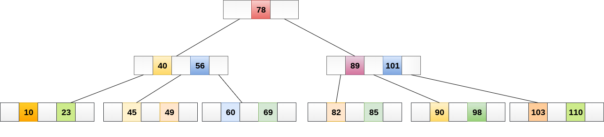
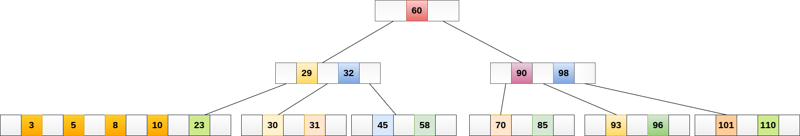
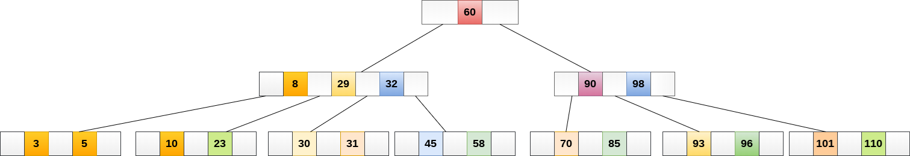
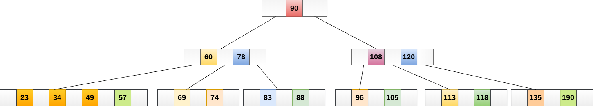

# B树

## 1 简介

### 概念

* B 树又叫平衡多路查找树。一棵m阶的B树定义如下：
  1. B树中的每个节点最多包含m个子节点。最多包含m-1个键。
  2. 除根节点和叶节点外，B树中的每个节点至少包含[m/2]（向上取整）个子节点。
  3. 根节点要么是空、要么是独自的根、要么必须至少有2个子节点。
  4. 有k个子节点的节点必有k-1个键。每个键按顺序升序排序。
  5. 所有叶节点必须处于同一层（水平）。
  

* 4阶B树如下


### 应用
* 大规模数据存储中，二叉树节点存储的元素数量是有限的（如果元素数量非常多的话，查找就退化成节点内部的线性查找了），这样导致二叉查找树结构由于树的深度过大而造成磁盘I/O读写过于频繁，进而导致查询效率低下
* 如何减少树的深度，一个基本的想法就是：采用多叉树结构（由于树节点元素数量是有限的，自然该节点的子树数量也就是有限的）。
* 多路查找树。根据平衡二叉树的启发，使用平衡多路查找树结构，也就是这篇文章所要阐述的第一个Btree。

### 分类

* B树
* B+树
* B*树

## 2 操作

### 基础操作

* 创建
* 遍历和搜索
* 插入
* 删除
* 分裂
* 合并


### 创建


### 搜索
> B树中搜索类似于二叉搜索树中的搜索
* 将数据项49与根节点78进行比较。
* 因为49 <78因此，移动到其左子树。
* 因为，40 <49 <56，遍历中间子树40。49> 45，向右移动。 
* 比较49。找到匹配，则返回。

> 在B树中搜索取决于树的高度。 搜索算法需要O(log n)时间来搜索B树中的任何元素。



### 插入


* 遍历B树以找到可插入节点的适当叶节点。
* 如果叶节点包含少于m-1个键，则按递增顺序插入元素。
* 否则，如果叶节点包含m-1个键，则按照以下步骤操作。
  * 按元素的递增顺序插入新元素。
  * 将节点从中间拆分为的两个节点。
  * 将中值元素推送到其父节点。
  * 如果父节点还包含m-1个键，则按照相同的步骤将其拆分。

> 实例
* 将节点8插入到下图所示的5阶B树中。

* 8将插入5的右侧，因此插入8。

* 该节点现在包含5个键，大于(5 -1 = 4)个键。 因此，将节点从中间分开，即8，并将其推到其父节点，如下所示。（图有问题）


### 删除

* 找到叶节点。
* 如果叶节点中有多于m/2个键，则从节点中删除所需的键。
* 如果叶节点不包含m/2个键，则通过从8个或左兄弟中获取元素来完成键。
  * 如果左侧兄弟包含多于m/2个元素，则将其最大元素推送到其父元素，并将插入元素向下移动到删除键的节点。
  * 如果右侧兄弟包含多于m/2个元素，则将其最小元素向上推送到父节点，并将插入元素向下移动到删除键的节点。
  * 如果兄弟节点都不包含多于m/2个元素，则通过连接两个叶节点和父节点的插入元素来创建新的叶节点。
  * 如果父节点的节点少于m/2，那么也应在父节点上应用上述过程。
* 如果要删除的节点是内部节点，则将节点替换为其有序后继或前一个节点。 由于后继或前任将始终位于叶节点上，因此该过程将类似于从叶节点中删除节点。

> 实例

* 从下图所示的5阶B树中删除节点：53。

* 元素49的右子节点中存在53，则删除它。

* 现在，57是唯一留在节点中的元素，在5阶B树中必须存在的最小元素数是2。它小于左边和右边子树中的元素 因此，也不足以将其与父母的左兄弟和干预元素合并，即49。最终的B树如下所示。


### 实现
```
```