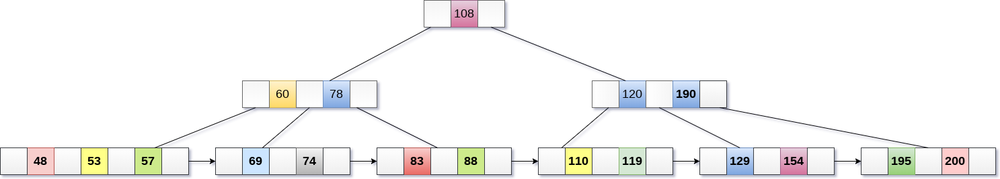
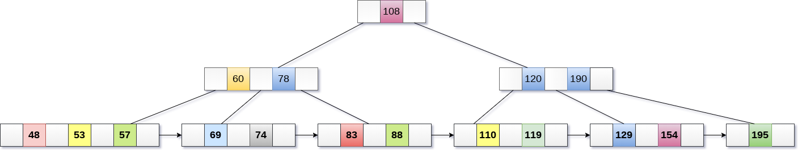
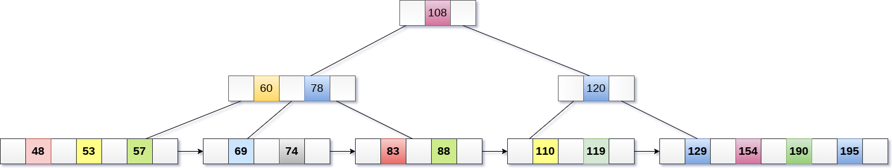

# B+树
> 参考文献
> * [B树B+树](https://www.cnblogs.com/lianzhilei/p/11250589.html)
## 1 简介
### 概念

> 像是在建立额外的索引

1. 有m个子树的中间节点包含有m个元素（B树中是k-1个元素），每个元素不保存数据，只用来索引；
2. 所有的叶子结点中包含了全部关键字的信息，及指向含有这些关键字记录的指针，且叶子结点本身依关键字的大小自小而大的顺序链接。 (而B 树的叶子节点并没有包括全部需要查找的信息)；
3. 所有的非终端结点可以看成是索引部分，结点中仅含有其子树根结点中最大（或最小）关键字。 (而B 树的非终节点也包含需要查找的有效信息)；

### 优点

* B+树的磁盘读写代价更低
  * B+树的内部结点并没有指向关键字具体信息的指针。因此其内部结点相对B 树更小。如果把所有同一内部结点的关键字存放在同一盘块中，那么盘块所能容纳的关键字数量也越多。一次性读入内存中的需要查找的关键字也就越多。相对来说IO读写次数也就降低了；

* B+树查询效率更加稳定
* 由于非终结点并不是最终指向文件内容的结点，而只是叶子结点中关键字的索引。所以任何关键字的查找必须走一条从根结点到叶子结点的路。所有关键字查询的路径长度相同，导致每一个数据的查询效率相当；

* B+树便于范围查询（最重要的原因，范围查找是数据库的常态）
  * B树在提高了IO性能的同时并没有解决元素遍历的我效率低下的问题，正是为了解决这个问题，B+树应用而生。B+树只需要去遍历叶子节点就可以实现整棵树的遍历。而且在数据库中基于范围的查询是非常频繁的，而B树不支持这样的操作或者说效率太低；不懂可以看看这篇解读-》范围查找

## 2 操作

### 基础操作

* 创建
* 遍历和搜索
* 插入
* 删除
* 分裂
* 合并

### 搜索
### 插入
* 第1步 ：将新节点作为叶节点插入。
* 第2步 ：如果叶子没有所需空间，则拆分节点并将中间节点复制到下一个索引节点。
* 第3步 ：如果索引节点没有所需空间，则拆分节点并将中间元素复制到下一个索引节点

> 实例

* 将值195插入到下图所示的5阶B+树中。

* 在190之后，将在右子树120中插入195。将其插入所需位置。

* 该节点包含大于最大的元素数量，即4，因此将其拆分并将中间节点放置到父节点。

* 现在，索引节点包含6个子节点和5个键，违反B+树属性，因此需要将其拆分，如下所示。将108提为根节点。60,78左子节点，120,190右子节点。

### 删除

* 第1步：从叶子中删除键和数据。
* 第2步：如果叶节点包含少于最小数量的元素，则将节点与其兄弟节点合并，并删除它们之间的键。
* 第3步：如果索引节点包含少于最小数量的元素，则将节点与兄弟节点合并，并在它们之间向下移动键。

> 示例
* 从下图所示的B+树中删除键为200。

* 在195之后的190的右子树中存在200，删除它。

* 使用195,190,154和129合并两个节点。

* 现在，元素120是节点中存在的违反B+树属性的单个元素。 因此，需要使用60,78,108和120来合并它。现在，B+树的高度将减1。

