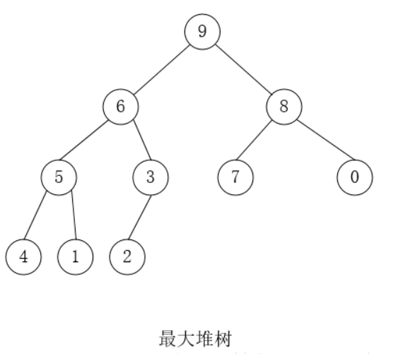
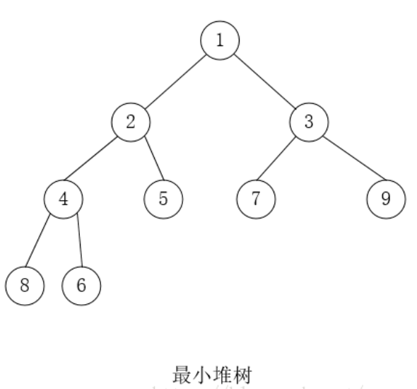
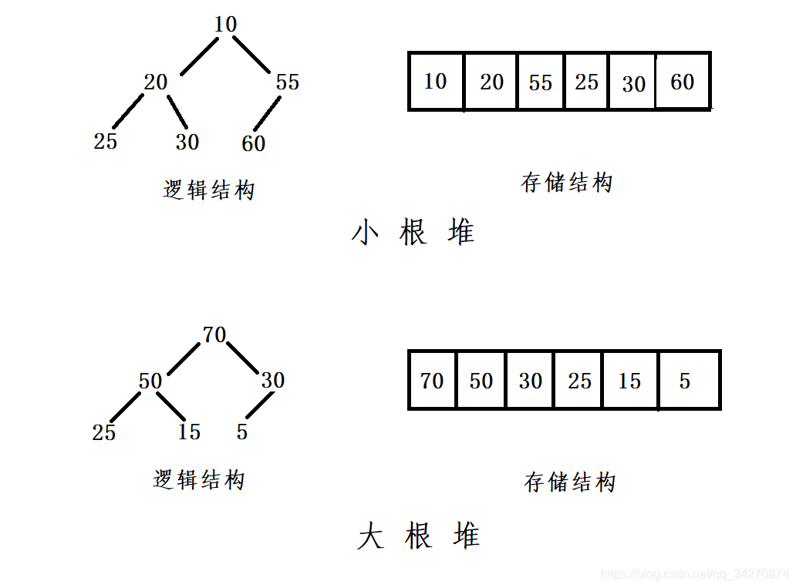
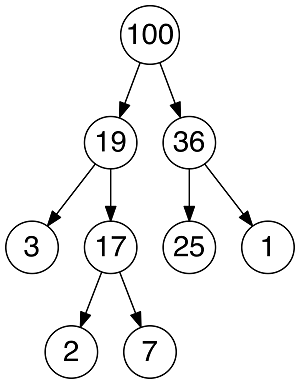
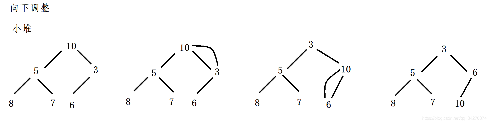
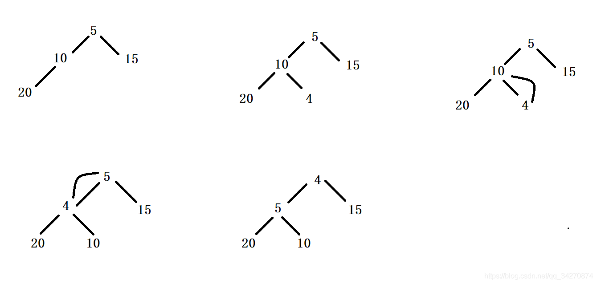
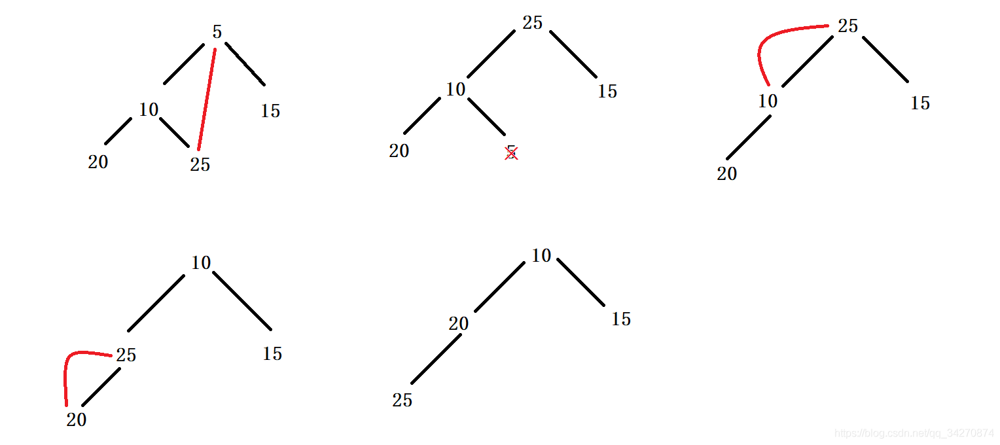

# 堆
> * 二叉搜索树、多路搜索树都是左小右大。堆树是上下大小不一样。
> * 二叉搜索树是从根节点向叶子节点构造。进行插入。堆树是从叶子节点，向根节点进行构造。

> 参考文献
> * [堆,但是有很严重的错误](https://blog.csdn.net/qq_34270874/article/details/113091364)


## 1 简介

1. 堆是一颗完全二叉树；
2. 堆中的某个结点的值总是大于等于（最大堆）或小于等于（最小堆）其孩子结点的值。
3. 堆中每个结点的子树都是堆树。

> 因为堆的第三条性质，堆的每一个子树，都是一个堆树。如果从叶节点开始进行一次向上调整。虽然能够保证最大值上浮到根节点。但是却无法保证它是一个堆树。因为进行一次向上调整。根节点的子树也许不是堆树。





* 使用数组表示的堆树


### 应用

* 堆结构的一个常见应用是建立优先队列（Priority Queue）。

* 普通树占用的内存空间比它们存储的数据要多。你必须为节点对象以及左/右子节点指针分配内存。堆仅仅使用一个数据来存储数组，且不使用指针。


## 2 操作
### 基本操作
* 上浮
* 下沉
* 取顶
* 创建：把一个乱序的数组变成堆结构的数组，时间复杂度为 $O(n)$
* 插入：把一个数值放进已经是堆结构的数组中，并保持堆结构，时间复杂度为 $O(log N)$
* 删除：从最大堆中取出最大值或从最小堆中取出最小值，并将剩余的数组保持堆结构，时间复杂度为 $O(log N)$。
* 堆排序：借由 HEAPFY 建堆和 HEAPPOP 堆数组进行排序，时间复杂度为$O(N log N)$，空间复杂度为 $O(1)$。

### 上浮-向上调整
> 最小堆为例

* 向上调整 是让调整的结点与其父亲结点进行比较。从**当前节点递归处理到根节点**。
    1. 先设定倒数的第一个叶子节点为当前节点(通过下标获取，标记为cur)，找出他的父亲节点，用parent来标记。
    2. 比较parent和cur的值，如果cur比parent小，则不满足小堆的规则，需要进行交换。
    3. 如果cur比parent大，满足小堆的规则，不需要交换，调整结束。
    4. 处理完一个节点之后，从当前的parent出发，循环之前的过程。

* 向上调整算法 小堆
* 向上调整算法 大堆
* **上浮能够保证路径上最好的值，上浮到根节点。**


### 下沉-向下调整
> 最小堆为例

* 向下调整 是让调整的结点与其孩子节点进行比较。从**当前节点递归处理到叶节点**。
  1. 先设定根节点为当前节点(通过下标获取，标记为cur)，比较左右子树的值，找出更小的值，用child来标记。
  2. 比较child和cur的值，如果child比cur小，则不满足小堆的规则，需要进行交换。
  3. 如果child比cur大，满足小堆的规则，不需要交换，调整结束。
  4. 处理完一个节点之后，从当前的child出发，循环之前的过程

* 向下调整（小堆）示例：



* 向下调整（大堆）示例：


* **下沉不能保证路径上最坏的值下放到叶节点。**


### 创建

> 类似于冒泡的思想，但是是一中更快的冒泡。保证最后能够建立最好的堆。

* 从根节点向叶节点开始，从前往后开始。进行多次上浮操作。
* 从叶节点向根节点开始，从后往前开始。进行多次下沉操作。


### 插入（堆尾的数据）

* 将数据插入到数组最后，再进行向上调整。




### 删除（堆顶的数据）

* 删除堆是删除堆顶的数据。将堆顶的数据和最后一个数据交换，然后删除数组最后一个数据，再进行向下调整算法



### 堆排序
* 堆排序
  1. 将待排序序列构造成一个大顶堆。
  2. 此时，整个序列的最大值就是堆顶的根节点。
  3. 将其与末尾元素进行交换，此时末尾就为最大值。
  4. 然后将剩余n-1个元素重新构造成一个堆（从根节点开始进行一次向下调整），这样会得到n-1个元素的次小值。如此反复执行，便能得到一个有序序列了。

## 3 堆的实现

```

struct MaxHeap
{
    EType *heap; //存放数据的空间，下标从1开始存储数据，下标为0的作为工作空间，存储临时数据。
    int MaxSize; //MaxSize是存放数据元素空间的大小
    int HeapSize; //HeapSize是数据元素的个数
};
MaxHeap H;
```

