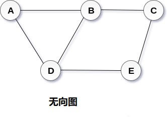
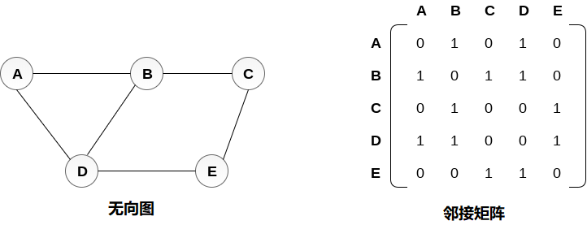
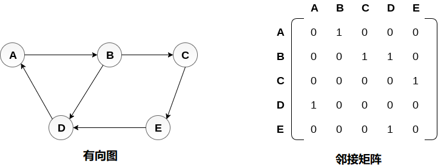
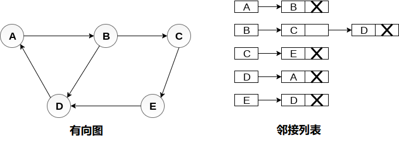
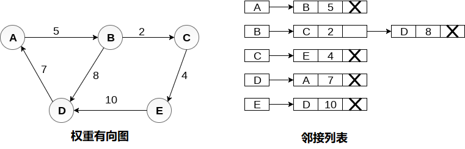
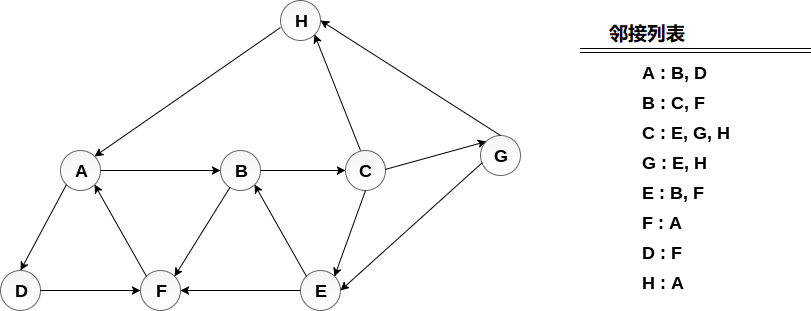

# 图

## 1 简介

### 概念

* 图可以定义为用于顶点和边的组合。 图可以看作是循环树，图中顶点(节点)维持它们之间的任何复杂关系，而不是简单的父子关系。
* 图G 可以定义为有序集G(V，E)，其中V(G)表示顶点集，E(G)表示用于连接这些顶点的边集。
* 图G(V，E)有5个顶点(A，B，C，D，E)和6个边((A，B)，(B，C)，(C，E)，(E，D)， (D，B)，(D，A))如下图所示。




### 术语

- **阶（Order）** - 图 G 中点集 V 的大小称作图 G 的阶。
- **子图（Sub-Graph）** - 当图 G'=(V',E')其中 V‘包含于 V，E’包含于 E，则 G'称作图 G=(V,E)的子图。每个图都是本身的子图。
- 生成子图（Spanning Sub-Graph） - 指满足条件 V(G') = V(G)的 G 的子图 G'。
- **导出子图**（Induced Subgraph） - 以图 G 的顶点集 V 的非空子集V1 为顶点集，以两端点均在 V1 中的全体边为边集的 G 的子图，称为 V1 导出的导出子图；以图 G 的边集 E 的非空子集 E1 为边集，以 E1 中边关联的顶点的全体为顶点集的 G 的子图，称为 E1 导出的导出子图。
- **度（Degree）** - 一个顶点的度是指与该顶点相关联的边的条数，顶点 v 的度记作 d(v)。
- **入度（In-degree）**和**出度（Out-degree）** - 对于有向图来说，一个顶点的度可细分为入度和出度。一个顶点的入度是指与其关联的各边之中，以其为终点的边数；出度则是相对的概念，指以该顶点为起点的边数。
- **自环（Loop）** - 若一条边的两个顶点为同一顶点，则此边称作自环。
- **路径**（Path） - 从 u 到 v 的一条路径是节点序列v0,e1,v1,e2,v2,...ek,vk，其中 ei 的顶点为 vi 及 vi - 1，k 称作路径的长度。如果它的起止顶点相同，该路径是“闭”的，反之，则称为“开”的。一条路径称为一简单路径(simple path)，如果路径中除起始与终止顶点可以重合外，所有顶点两两不等。
- **行迹（Trace）** - 如果路径 P(u,v)中的边各不相同，则该路径称为 u 到 v 的一条行迹。闭的行迹称作回路（Circuit）。
- **轨迹（Track）** - 如果路径 P(u,v)中的顶点各不相同，则该路径称为 u 到 v 的一条轨迹。闭的轨迹称作圈（Cycle）。
- **桥（Bridge）** - 若去掉一条边，便会使得整个图不连通，该边称为桥。
* 相邻节点如果两个节点u和v通过边e连接，则节点u和v被称为邻居或相邻节点。

### 分类

- **有向图** - 如果给图的每条边规定一个方向，那么得到的图称为有向图。
- **无向图** - 边没有方向的图称为无向图。
- 连通图连通图是在V中的每两个顶点(u，v)之间存在一些路径的图。连通图中没有孤立的节点。
-  **完整图**完整图是每个节点与所有其他节点连接的图。 完整图包含n(n-1/2个边，其中n是图中节点的数量。
-  **权重图**在权重图中，为每个边分配一些数据，例如长度或重量。 边e的权重可以给定为w(e)，其必须是指示穿过边缘的成本的正(+)值。

## 2 图的实现

### 邻接矩阵
* 在顺序表示中，使用邻接矩阵来存储由顶点和边表示的映射。在邻接矩阵中，行和列由图顶点表示。 具有n个顶点的图将具有尺寸n×n。
* 如果在Vi和Vj之间存在边缘，则无向图G的邻接矩阵表示中的项目Mij将为1。

* 无向图及其邻接矩阵表示如下图所示。

* 有向图及其邻接矩阵表示如下图所示。

* 权重有向图以及邻接矩阵表示如下图所示。


### 邻接链表

* 邻接列表用于将图存储到计算机的内存中。考虑下图中显示的无向图并检查邻接列表表示。要为图中存在的每个节点维护邻接列表，邻接列表将节点值和指向下一个相邻节点的指针存储到相应节点。 如果遍历所有相邻节点，则将NULL存储在列表的最后一个节点的指针字段中。 邻接列表的长度之和等于无向图中存在的边数的两倍。

* 有向图，并查看图的邻接列表表示。在有向图中，所有邻接列表的长度之和等于图中存在的边的数量。

* 加权有向图，每个节点包含一个额外的字段，称为节点的权重。 有向图的邻接列表表示如下图所示。



## 3 基本操作
### 基本操作


- 创建一个图结构 - CreateGraph(G)
- 检索给定顶点 - LocateVex(G,elem)
- 获取图中某个顶点 - GetVex(G,v)
- 为图中顶点赋值 - PutVex(G,v,value)
- 返回第一个邻接点 - FirstAdjVex(G,v)
- 返回下一个邻接点 - NextAdjVex(G,v,w)
- 插入一个顶点 - InsertVex(G,v)
- 删除一个顶点 - DeleteVex(G,v)
- 插入一条边 - InsertEdge(G,v,w)
- 删除一条边 - DeleteEdge(G,v,w)
- 遍历图 - Traverse(G,v)

### 创建

* 图的邻接链表实现方法

```C++
// 图的邻接链表实现方法
#include<iostream>
#include<vector>
#include<unordered_map>
using namespace std;

const int N = 1e5+1;
struct Edge
{
    int to;
    int w;
    Edge(int t = 0, int w_ = 0) : to(t), w(w_) {}
};
 
// edge向量的数组
vector<Edge> H1[N];

// edge向量的向量（查找需要遍历某个顶点所有边的集合）
vector<vector<Edge>> H2;

// edge映射的向量（查找会更快）
vector<unordered_map<int, int>> H3;
 
int main()
{
 
    H2.resize(N + 1);
    H3.resize(N + 1);
    for (int i = 1; i <= N; ++i)
    {
        int a, b, c;
        cin >> a >> b >> c;
        H1[a].push_back(Edge(b,c));
        H2[a].push_back(Edge(b, c));
        H3[a][b] = c;
    }
 
    getchar();
    return 0;
}
```

### 搜索——广度优先搜索

* 广度优先搜索是一种图遍历算法，它从根节点开始遍历图并探索所有相邻节点。 然后，它选择最近的节点并浏览所有未探测的节点。 对于每个最近的节点，该算法遵循相同的过程，直到找到目标为止。
* 下面给出了广度优先搜索的算法。算法从检查节点A及其所有邻居开始。在下一步中，搜索A的最近节点的邻居，并且在后续步骤中继续处理。 该算法探索所有节点的所有邻居，并确保每个节点只访问一次，并且没有访问任何节点两次。

* 算法
```
第1步：设置状态 = 1(就绪状态)
    对于G中的每个节点
第2步：将起始节点A排队
    并设置其状态 = 2
    (等待状态)
第3步：重复第4步和第5步，直到
    队列是空的
第4步：使节点N出列。处理它
    并设置其状态 = 3
    (处理状态)。
第5步：将所有邻居排队
      N处于就绪状态
 (其STATUS = 1)并设置它们状态 = 2
 (等待状态)
  [循环结束]
第6步：退出
```
> 实例
考虑下图中显示的图G，计算从节点A到节点E的最小路径p。给定每条边的长度为1。最小路径P可以通过应用广度优先搜索算法找到，该算法将从节点A开始并将以E结束。算法使用两个队列，即QUEUE1和QUEUE2。 QUEUE1保存要处理的所有节点，而QUEUE2保存从QUEUE1处理和删除的所有节点。


```
```


### 搜索——深度优先搜索

* 深度优先搜索(DFS)算法从图G的初始节点开始，然后越来越深，直到找到目标节点或没有子节点的节点。该算法然后从死角回溯到尚未完全未探索的最新节点。
* 在DFS中使用的数据结构是堆栈。该过程类似于BFS算法。 在DFS中，通向未访问节点的边称为发现边，而通向已访问节点的边称为块边。
* 算法

```
第1步：为G中的每个节点设置STATUS = 1(就绪状态)
第2步：将起始节点A推入堆栈并设置其STATUS = 2(等待状态)
第3步：重复第4步和第5步，直到STACK为空
第4步：弹出顶部节点N.处理它并设置其STATUS = 3(处理状态)
第5步：将处于就绪状态(其STATUS = 1)的N的所有邻居推入堆栈并设置它们
    STATUS = 2(等待状态)
    [循环结束]
第6步：退出
```
> 实例

考虑图G及其邻接列表，如下图所示。 通过使用深度优先搜索(DFS)算法计算从节点H开始打印图的所有节点的顺序。



```
```


