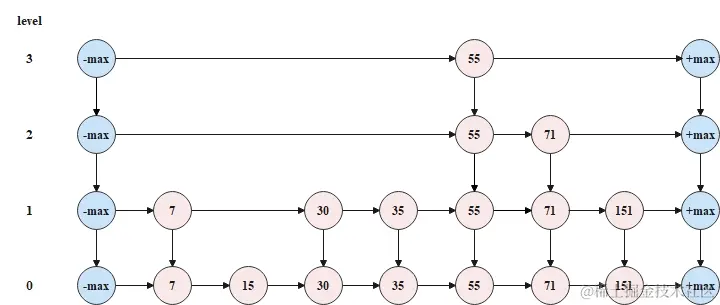
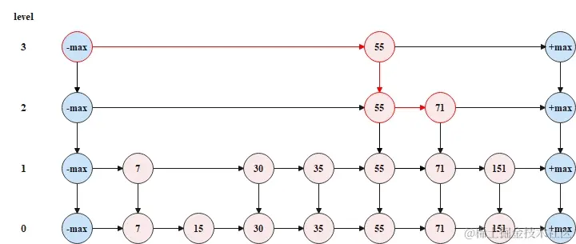
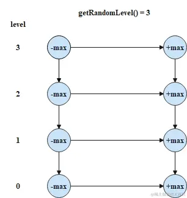
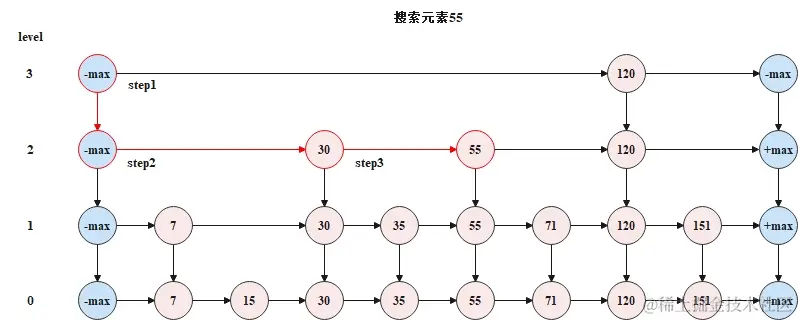
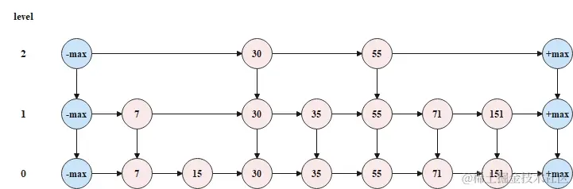
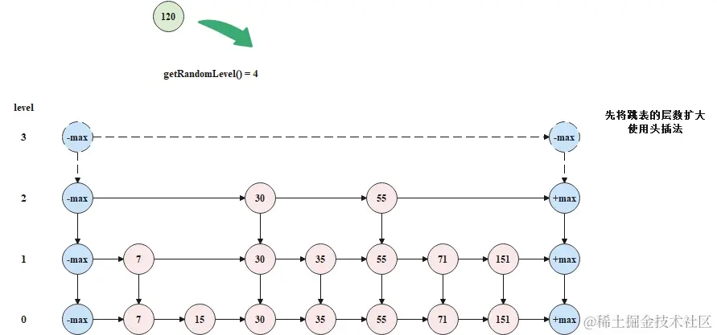
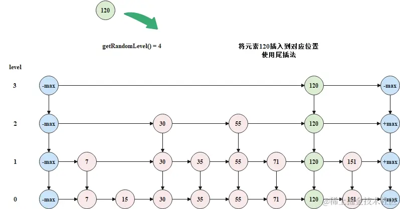
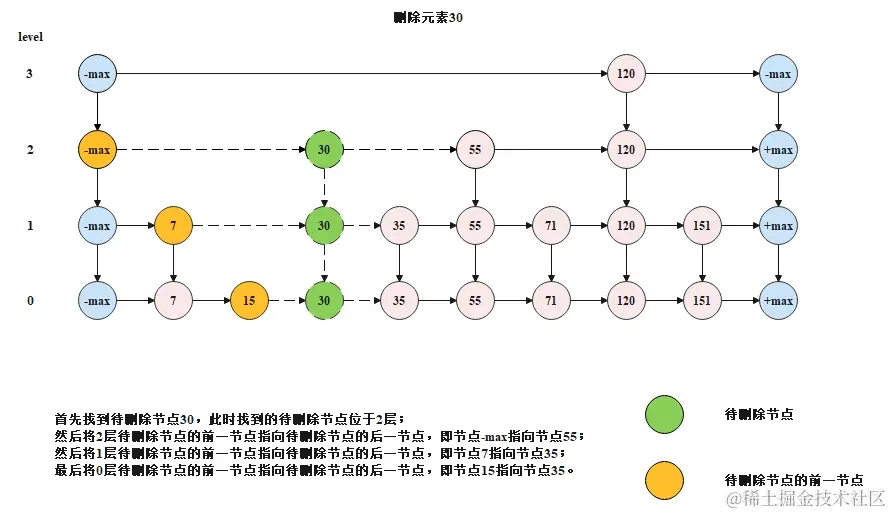

# 跳表


## 跳表的基本概念
> 经典实现：Redis 的 Sorted Set、JDK 的 ConcurrentSkipListMap 和 ConcurrentSkipListSet 都是基于跳表实现。

只需要对链表稍加改造，就可以支持类似“二分”的查找算法。我们把改造之后的数据结构叫作**跳表**（Skip list）。

跳表是一种各方面性能都比较优秀的**动态数据结构**，可以支持快速的插入、删除、查找操作，写起来也不复杂，甚至可以替代[红黑树](https://zh.wikipedia.org/wiki/红黑树)（Red-black tree）。

在一个单链表中查询某个数据的时间复杂度是 O(n)。

在一个具有多级索引的跳表中，第一级索引的结点个数大约就是 n/2，第二级索引的结点个数大约就是 n/4，第三级索引的结点个数大约就是 n/8，依次类推，也就是说，第 k 级索引的结点个数是第 k-1 级索引的结点个数的 1/2，那第 k 级索引结点的个数就是 $n/(2^k)$ 

## 跳表的原理


### 跳表的结构



跳表的特点，可以概括如下。根据以下原则构建跳表。

* 跳表是多层（level）链表结构；跳表中的每一层都是一个有序链表，并且按照元素升序（默认）排列；
* 跳表中的元素会在哪一层出现是随机决定的，但是只要元素出现在了第k层，那么k层以下的链表也会出现这个元素；
* 跳表的底层的链表包含所有元素；
* 跳表头节点和尾节点不存储元素，且头节点和尾节点的层数就是跳表的最大层数；
* 跳表中的节点包含两个指针，一个指针指向同层链表的后一节点，一个指针指向下层链表的同元素节点。


### 跳表中如何查找



从顶层链表的头节点开始查找，查找到元素71的节点时，一共遍历了4个节点，但是如果按照传统链表的方式（即从跳表的底层链表的头节点开始向后查找），那么就需要遍历7个节点，所以跳表以空间换时间，缩短了操作跳表所需要花费的时间。


## 构建一个跳表


### 跳表中的节点

已知跳表中的节点，需要有指向当前层链表后一节点的指针，和指向下层链表的同元素节点的指针，所以跳表中的节点，定义如下。


```java
class Node {
    public Integer value;
    public Node next;
    public Node down;

    public Node(int val) {
        this.value = val;
    }

    @Override
    public String toString() {
        return String.valueOf(this.value);
    }
}
```

跳表中的节点的最简单的定义方式，存储的元素data为整数，节点之间进行比较时直接比较元素data的大小。

### 跳表的初始化


跳表初始化时，将每一层链表的头尾节点创建出来并使用集合将头尾节点进行存储，头尾节点的层数随机指定，且头尾节点的层数就代表当前跳表的层数。初始化后，跳表结构如下所示。




```java
    public SkipList() {
        // 初始化节点，只有一层
        Node head = new Node(-1);
        Node end = new Node(Integer.MAX_VALUE);
        head.next = end;
        curHead = head;
    }
    // 网页中给的方案过于复杂，已经优化
```

直接使用最小值节点和最大值节点作为头尾节点，可以兼容比较操作中的逻辑，不需要判断是否为空节点。


### 跳表的查找方法

在跳表中搜索一个元素时，需要从顶层开始，逐层向下搜索。搜索时遵循如下规则。

1. 目标值大于后一节点值时，继续在本层向后搜索；
2. 目标值小于后一节点值时，向下移动一层，从下层链表的同节点位置向后搜索；
3. 目标值等于当前节点值，搜索结束。

下边是一个搜索示意图



搜索的代码如下

```java

    public Node find(int val) {
        Node point = curHead;
        while (point != null) {
            if (point.next.value == val) {
                return point.next;
            }
            if (point.next.value < val) {
                point = point.next;
            } else {
                point = point.down;
            }
        }
        // 没有找到节点
        return null;
    }

```


### 跳表的插入方法

每一个元素添加到跳表中时，首先需要随机指定这个元素在跳表中的层数，如果随机指定的层数大于了跳表的层数，则在将元素添加到跳表中之前，还需要扩大跳表的层数，而扩大跳表的层数就是将头尾节点的层数扩大。下面给出需要扩大跳表层数的一次添加的过程。

初始状态时，跳表的层数为2，如下图所示。


现在要往跳表中添加元素120，并且随机指定的层数为3，大于了当前跳表的层数2，此时需要先扩大跳表的层数，如下图所示。




将元素120插入到跳表中时，从顶层开始，逐层向下插入，如下图所示。



```java

    public void insert(int val) {
        int level = getLevel();
        expandLevel(level);
        Node point = curHead;
        // 定位要插入的level
        for (int i = 0; i < curLevel - level; i++) {
            point = curHead.down;
        }

        // 逐层插入
        Node upNode = null;
        while(point != null){
            // 创建节点
            Node newNode = new Node(val);
            // 定位要插入的元素
            while(point.next.value < val){
                point = point.next;
            }
            newNode.next = point.next;
            point.next = newNode;
            if (upNode !=null) {
                upNode.down = newNode;
            }
            upNode = newNode;
            point = point.down;
        }
    }

    public void expandLevel(int level) {
        while (curLevel < level) {
            Node newHead = new Node(-1);
            Node newEnd = new Node(Integer.MAX_VALUE);
            newHead.next = newEnd;
            Node curEnd = curHead.next;
            while (curEnd.next != null) {
                curEnd = curEnd.next;
            }
            newHead.down = curHead;
            newEnd.down = curEnd;
            curHead = newHead;
            curLevel += 1;
        }
    }

    private int getLevel() {
        int level = 0;
        while (random.nextDouble() < ratio && level <= MAX_LEVEL) {
            level += 1;
        }
        return level;
    }
```

### 跳表的删除

当在跳表中需要删除某一个元素时，则需要将这个元素在所有层的节点都删除，具体的删除规则如下所示。

* 首先按照跳表的搜索的方式，搜索待删除节点，如果能够搜索到，此时搜索到的待删除节点位于该节点层数的最高层；
* 从待删除节点的最高层往下，将每一层的待删除节点都删除掉，删除方式就是让待删除节点的前一节点直接指向待删除节点的后一节点。


下图是一个删除过程的示意图。



```java
    public void delete(int val) {
        // 查找元素节点
        Node point = curHead;
        while (point != null) {
            if (point.next.value == val) {
                break;
            }
            if (point.next.value < val) {
                point = point.next;
            } else {
                point = point.down;
            }
        }

        if (point == null) {
            return;
        }

        // 删除下一个元素
        while (point != null) {
            // 找到当前层的目标节点
            while (point.next.value < val) {
                point = point.next;
            }
            point.next = point.next.next;
            point = point.down;
        }
    }
```

### 总结


主要的优化点：
1. 提那家后置节点，存放最大值，省去大量的判空逻辑，依赖正常的比较逻辑即可判断是否应该结束，大大简化了代码
2. 延迟初始化跳表。只有用到某一层的时候才会进行初始化，优化了存储空间。
3. 一个节点如果层数较高，会冗余存储多分。当然在java中value本身也是个索引，不会占用大量的空间，可以优化一下，一个值仅创建一个Node，每个Node中存储每层的索引。应该会更节约空间一些[避免冗余创建Node的方案](https://zhuanlan.zhihu.com/p/68516038)