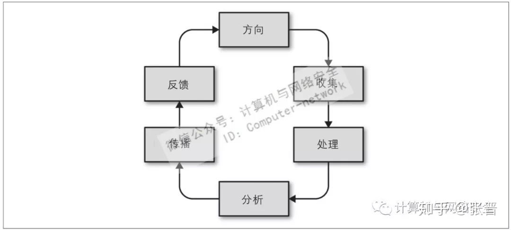

# 文献整理——威胁情报

> 文献阅读中的思考用这种注释的方式给出把。

## 1 李总的报告

### 情报自身的讨论

* 行为模式、行为指纹====>描绘潜在风险对象。黑客幻想。
* 静态情报识别：位置、函数、缓冲区等静态指纹。信息元之间不存在关联关系。
* 动态情报识别：行为日志、操作记录。信息元之间存在关联性，例如先后顺序，操作时间差等。
* 使用情报构件知识库。

### 情报共享方式的讨论

* 威胁情报共享，不是元数据层面的贡献，而是数据应用层面的共享。将共享的等级提升。
* 厂商之间共享数据存在隔阂，但是可以共享检测，在不共享数据的情况下，构建联合检测模型。
* 安全联盟，用来防御APT攻击。OCA（open cybersecurity alliance）联盟。MAPP（微软）anquan lianmeng 

### 情报利用方向的讨论
* 入侵检测（威胁感知系统）----基于机器学习，综合利用情报处理问题。
* 学习最先进的攻击技术（识别最新攻击行为，用于入侵检测）
* IOC信息，用来标识入侵对象。MD5文件等入侵留下的痕迹。预防和识别入侵。
* 将攻击行为与个体建立关联，《美国威胁报告》分析人的行为，追踪网络中国人的虚拟映像。

### 情报利用模型的讨论

* 钻石模型（通用模型，并没有什么特色。）

### 情报输入输出的讨论
* 情报系统的输入、情报分类：动态行为、静态属性
* 情报系统的输出：威胁报告。

> ### 对我来说的主要内容：
> * 情报利用方案。解决准确率问题
> * 分布式解决方案。解决数据共享问题

相关资料
* Yara规则
* GITHUB APT IOC（github有很多人分享技术）
* 火眼、猎鹰
* 思科发布公告称，其 IOS XR 软件 DVMRP 特征 中的一个新0day漏洞 CVE-2020-3566已遭在野利用，尚未推出补丁（CVSS评分8.6）。该漏洞主要影响运营商级和数据中心的路由器。https://tools.cisco.com/security/center/content/CiscoSecurityAdvisory/cisco-sa-iosxr-dvmrp-memexh-dSmpdvfz

## 2 网络安全之情报浅析
> 应该思考我们的主要工作是什么？
> * 是根据情报生成？（通过数据处理，分析异常数据，挖掘漏洞、APT入侵等信息）
> * 是实现情报利用？（通过已有的情报对新的情报样本进行分析，分析其危险性，给出其威胁评估）
> * 是实现情报共享？（通过共享系统，将情报在孤立的个体之间传递，提供基于情报的服务）

### 数据与情报

* 数据是一条信息、事实，或统计结果，数据是用来描述某些事情的。在网络安全领域，IP地址或域名是数据。如果没有任何额外的分析来提供上下文，它们只是一个事实。
* 当我们收集并关联分析各种数据后，具备了为某种需求提供洞察能力，这时它们便成了情报
> 关于情报利用的周期的理解
> * 当前的情报利用流程：情报生成-->情报传播-->情报利用
> * 我们的情报利用流程：情报生成-->情报利用-->情报传播

### IOC

攻陷指标，日志检测，发现被攻陷的指标。在系统或网络日志中寻找某类特征数据来发现已被入侵的目标，这类特征数据包括与C2服务器或恶意软件下载相关联的IP地址和域名、恶意文件的哈希值，以及其他可以表明入侵的基于网络或主机的特征。

### 情报收集方法

* 人工情报：人工搜集的情报
* 信号情报：从电子信号中获取的情报。
* 公开情报
* 图像情报
* 测量与特征情报
* 地理和空间信息情报

> NoSQL非关系型数据库：既然不同商家、不同类型的情报的字段存在巨大差异，那么是否可以考虑使用非关系型数据库存储情报内容。

### 情报来源

* 数据泄露和事件响应活动中调查收集。
* 蜜罐，虚拟的设备和网络，用来捕获攻击流量。
* 论坛和网站。受限的论坛和聊天室。
* 军事术语。

> 情报关联系统。攻击底特律----黑衣人组织。等等，将所有的情报进行切片，然后使用情报之间的关联来描述情报本身。从而找出关联度最高的的东西，形成一张错综复杂的高纬度关联图。与警方办案的关系图非常相似。然后通过分析图形，确定当前的热点事件，找出线索。  
> 受以上启发，突然想做一个连锁记忆的东西。建立连锁记忆知识库。使用百度或者谷歌作为连锁记忆引擎。

### 流程模型
* OODA模型：Observe、Orient、Decide、Act。攻防双方遵循的基本决策方法。
* 情报周期模型：方向、收集、处理、分析、传播、反馈。
  * 方向：确立情报打算解决的问题
  * 收集：收集回答问题所需要的数据。
  * 命名：避免对情报的命名冲突
  * 处理：对数据进行格式化处理。建立大量数据的索引。
  * 拓线：为一条信息提供额外的元数据。
  * 过滤：处理掉没有用的数据。
  * 优先级：已经收集到的数据需要进行排序。
  * 可视化：为了方便认知，需要人员进行可视化。
  * 分析：对数据进行特征化处理，分析其含义和影响。
  * 传播：情报以相关的受益者觉得有用的方式进行共享。果其目标是在技术系统（如IDS或防火墙）中实施，则可能需要符合特定供应商的程序化格式。
  * 反馈：对情报的价值进行评估，是否符合问题的方向。对情报做出成功或者失败的判定。

> 在文章中认为，通过自动化的方式对文本的操作，属于处理范畴，而不是分析过程。情报应该符合供应方的程序化格式。

### 有质量的情报

情报的质量主要包括：收集来源和分析手段。

* 收集日期：威胁情报具有时效性。
* 收集方法：收集方法越详细越好。
* 上下文：上下文内容有助于分析。
* 消除偏见：分析师带有个人偏见。

### 情报的级别

* 战术情报：战术情报的一个例子是与新发现的漏洞利用有关的IOC特征。这些战术级IOC包括执行漏洞扫描探测的IP地址、域名托管的恶意软件（漏洞攻击成功后植入），以及利用和安装恶意软件过程中生成的各种基于主机的组件。在网络威胁情报（CTI）中，这通常包括IOC特征以及观测报告，例如高细粒度的TTP，描述对手如何部署特定的能力。战术情报使防御者能够直接对威胁作出反应。
* 作业情报：在CTI中，通常包括行动相关信息和高阶TTP内容。它还可能包括有关指定威胁组织的特点、能力和意图等信息。
* 战略情报：在网络威胁情报（CTI）中，我们认为它可支持高级管理人员和董事会对风险评估、资源分配和组织战略做出正式决策。这些信息包括态势、威胁企业的动机和分类。比如需要制定新的安全策略或涉及安全架构的变动。
> * TTP说明：在APT等 高级威胁 研究的领域，时常可以在各组织发布的 APT 报告中看到一个专业术语 TTP ，TTP及其中的三要素，战术Tactics、技术Techniques和过程Procedures，是描述高级威胁组织及其攻击的重要指标。

### 置信级别
* 比如需要制定新的安全策略或涉及安全架构的变动。
* 源可靠性描述的一个常见方法是《FM 2-22.3》（美军人工情报收集操作手册）中记录的“Admiralty Code”或“NATO System”。这里包括两个维度。首先根据先前的信息来评估源的可靠性，范围从A（可靠）到E（不可靠）。第二个维度评估信息内容本身的可靠程度，从1（确认）到5（不可能）。

## 3 基于区块链的反Sybil网络威胁情报共享框架

### 场景描述
* 网络威胁情报（CTI）技术是一种基于证明的安全系统，可通过分析和共享与安全相关的数据来主动响应这些高级网络威胁。

* 提出了一种基于区块链的CTI框架，提高对数据源和内容的信心，并可以快速检测和消除不准确的数据以抵御Sybil攻击。

* 技术背景：5G、lot、数据分析技术
* 安全手段：防火墙、入侵检测/防御系统（IDS/IPS）、安全信息和事件管理（SIEM）系统

