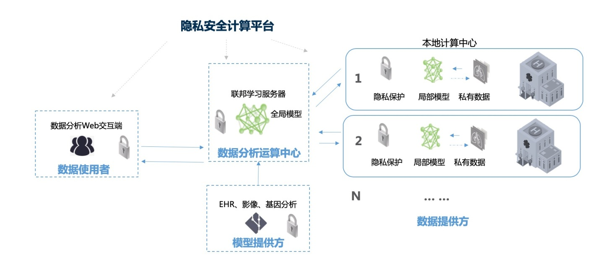
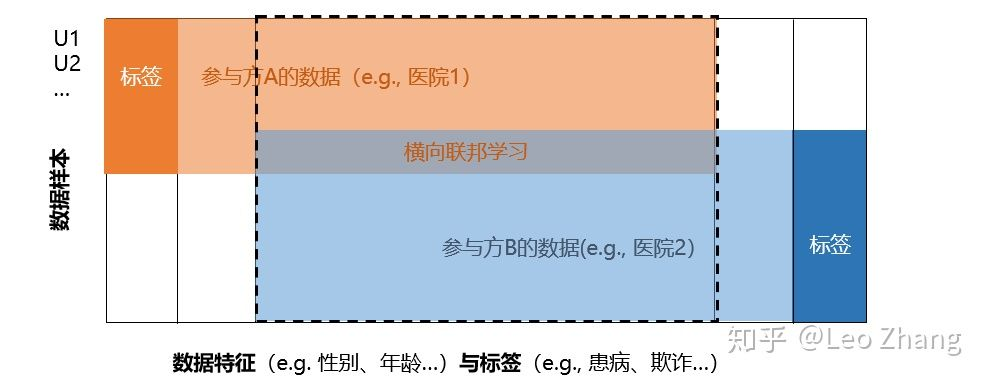
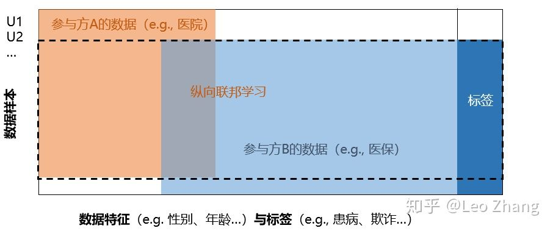
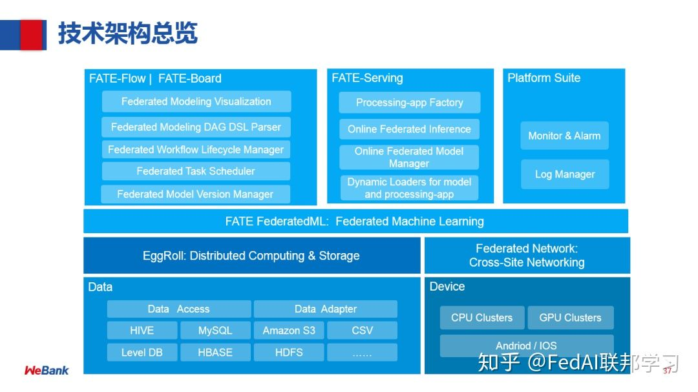
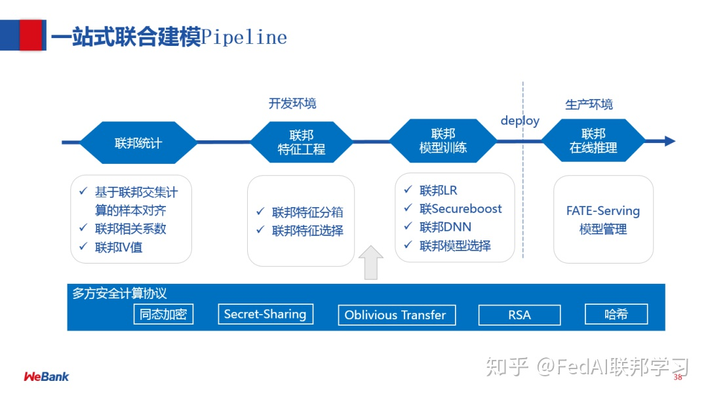
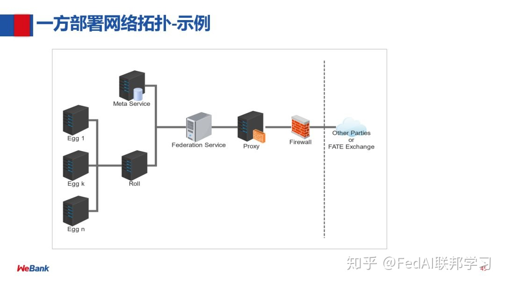

# 文献整理——联邦学习

## 1 联邦学习——破解智能医疗数据安全隐私难题

### 问题提出（背景）

* 医学领域存在的不可能三角，数据共享与隐私保护冲突。单一组织缺乏足够可用样本用于人工智能算法的训练。
* 法律对隐私保护的据他障碍。
  * HIPAA
  * GDPR
  * CCPA
  * 中华人民共和国网络安全法等
* 国内外公司数据泄露事件频发，受到处罚。

### 智能医疗数据训练平台

可以借鉴这个平台的架构 

### 联邦学习优势

* 多方参与、多方获益
* 数据不动、保护隐私
* 性能无损
* 数据量充足

### 联邦学习的分类

* 横向联邦学习：横向联邦学习适用于联邦学习的参与方的数据有重叠的数据特征，即数据特征在参与方之间是对齐的，参与方数据样本不同。

* 纵向联邦学习：纵向联邦学习 适用于联邦学习参与方的训练数据有重叠的数据样本，即参与方之间的数据样本对齐的，但数据特征上不同。

* 联邦迁移学习，通过联邦学习和迁移学习，解决两个数据集的用户 ( U1, U2, … ) 与用户特征重叠 ( X1, X2, … ) 部分都比较小的问题。

## 2 只看这一篇就够：快速了解联邦学习技术及应用实践
> 给出了联邦学习算法层面的研究，可以在日后详细了解一下。
### 问题提出（背景）

* AI落地存在的困哪
  * 数据质量差
  * 缺乏数据标签
  * 数据分散隔离

* 国内数据监管法律体系不断完善
    * 国家关于数据的法律条例是趋向于严格化的，同时趋向于全面化，每个细分领域都纷纷出台了相应的条例和条款。

* 基于联邦学习的技术生态
  * 数据隔离，不泄露到外部。
  * 参与者地位对等
  * 无损，效率接近集中式机器学习
  * 共同获益，参与者共同获益

### 相关技术
> 还需要深入探究机器学习部分的算法
* 联邦学习的应用场景
  * 满足用户隐私保护、数据安全和政府法规的前提下，进行跨组织的数据合作。
* 同态加密技术
  * 通过 RSA 和 Hash 的机制，保证双方最终只用到交集部分，且差集部分不向对方泄露。
  * 采用同态加密技术，这个过程中，各方的原始数据，以及数据加密态都没有被传输。交互部分，双方通过损失中间结果，用同态加密的机制进行交互，
* 基于隐私保护的动态ID匹配技术
* 同态加密技术在机器学习上的应用。对 loss function 和梯度进行多项式展开，来满足加法操作。这样就可以把同态加密的技术应用在 loss function 和梯度中。
* 联邦特征工程
* SecureBoost 

### 应用方案

* 保险个性化定价
* 小微企业信贷风险管理
* 联邦学习视觉应用
* 基于联邦学习的企业风控模型
* 互联网零售，联合客户价值建模
* 互联网监管，联合反洗钱建模

### 联邦学习开源平台Fate
* Fate的特点：
  * 支持多种主流算法：为机器学习、深度学习、迁移学习提供高性能联邦学习机制。
  * 支持多种多方安全计算协议：同态加密、秘密共享、哈希散列等。
  * 友好的跨域交互信息管理方案，解决了联邦学习信息安全审计难的问题。

* 面临的挑战
  * 一站式建模过程的联邦化
  * MPC 协议下分布式算法 ( on WAN ) 易理解和易维护
  * 跨站点数据传输安全性和可管理性，如何让交互部分是可以被管理和被审计的。
  * 异构基础架构自适应，联邦学习可能会运行在 CPU、GPU 和端上，如何让上层不受底层的变化而变化。

* FATE的架构
  * EggRoll：分布式计算和存储的抽象；
  * Federated Network：跨域跨站点通信的抽象；
  * FATE FederatedML：联邦学习算法模块，包含了目前联邦学习所有的算法功能；
  * FATE-Flow | FATE-Board：完成一站式联邦建模的管理和调度以及整个过程的可视化；
  * FATE-Serving：联邦学习在线推理模块。

* 建模流程
  * 从联邦统计->联邦特征工程->联邦模型训练，当上线部署的时候会有联邦在线推理模块，底层则会采用多方安全计算协议去支持上层各种联邦算法。

* 核心功能：
  * 联邦在线模型服务FATE-servering
  * 联邦建模pipeline和可视化Fate-flow和fate-board
  * 联邦学习算法的功能组件fate-federalML
  * 分布式计算和存储抽象egg-roll
  * 跨站点网络通信抽象federal-network

  egg-roll提供了底层的分布式的计算和存储算子。MPC-Protocol提供了网络通信的安全协议。Numerical-operator提供了数学算子。ML-operator提供了机器学习算子。Algorithm提供了机器学习算法。实现了从下到上的框架。用户可以重写扩展某一个层，来实现自己的算法。
> 这里的egg-roll提供的是单个参与者本地的分布式计算方案。并不是通过网络连接的多个参与者的共同计算方案。

* 部署架构
  * 每一方都是差不多的，是一个对称的结构，通过 EggRoll实现分布式计算和存储，通过 Federation Service 和外部交互。

### FATE 应用

### FATE 开发流程

1. 选择一个机器学习算法，设计多方安全计算协议。
2. 定义多方交互的数据变量
3. 构建算法执行工作流
4. 基于Egg-roll API和Federal API实现算法工作流中的各个组件。
> 给出的联邦学习最为关联的学科：
> 三个方向进一步学习：机器学习及统计学知识，密码学及其他安全领域知识，分布式计算及大数据处理知识。

> 对于联邦学习的框架，FATE为主，如果看懂了机器学习，也可以采用TesorflowFederal尝试一下。

## 3 联邦学习入门笔记

### 分类

* 横向联邦学习
* 纵向联邦学习
* 迁移联邦学习

### 典型过程

* 客户端选择。选择满足条件的客户端。
* 传播。下载模型权重和训练程序。
* 客户端计算。在本地计算对应的模型更新，完成本地训练。
* 聚合。服务器手机设备更新。包括多重技术应用：用于增强隐私的安全聚合技术、通信效率与数据压缩。
* 更新模型。在本地更新共享模型。

### 联邦学习的挑战

1. 非独立同分布的数据

2. 有限通信带宽

3. 不可靠和有限的设备

## 4 联邦学习的现状和开放性问题

> 本文明确的东西。联邦学习并不是一个技术，而是一组技术的合称，方便对一系列类似的目标进行定义。联邦学习面对很多挑战，也具有很多研究方向。
> * 定义（解决问题的手段）
> * 挑战（需要解决的问题）
> * 研究方向（需要处理的细节）
> * 相关领域（分布式优化，加密，安全性，差分隐私，公平性，压缩感知，系统，信息论，统计甚至更多）
### 定义和挑战
* 学习任务是通过由中央服务器协调的设备的松散联邦来解决的。
* 通信带宽有限
* 不平衡且非IID（独立同分布）的数据
* 分布式优化，加密，安全性，差分隐私，公平性，压缩感知，系统，信息论，统计甚至更多
### 分类
* cross-device着重于移动和边缘设备应用程序而引入联邦学习
* cross-silo只涉及少量相对可靠的客户端的应用程序，例如多个组织合作训练一个模型。

### 定义
联邦学习是一种由多个实体（客户端）在中央服务器或服务提供商的协调下协作解决机器学习问题的机器学习设置。每个客户的原始数据都存储在本地，并且不会交换或转移；取而代之的是使用旨在及时信息聚合的局部更新来实现学习目标。

### 工具和框架

* TensorFlow Federated[38]，Federated AI Technology Enabler[34]，PySyft [342]，Leaf [35]，PaddleFL [36]和Clara Training Framework [33]

> 应该描述清楚涉及到的主要内容。

## 5 综述：《联邦学习：概念与应用》

###  概念

精度损失维持在一定范围内的分布式机器学习模型。给出了数学上的定义。

### 隐私

* 安全多方计算（SMC），零知识传递，复杂的计算协议（可以自行设计计算协议）。
* 差分隐私，对数据模糊化，但仍旧会传递数据。
* 同态加密，交换模型参数，保护用户数据。
* 参数交换同样会泄露重要的数据信息，通过模型参数，还原数据特征。可能会允许插入后门来对模型进行攻击，导致数据中毒。协作学习的不同方会受到推理攻击。
* 研究人员还开始考虑将区块链作为促进联邦学习的平台。 在[34]中，研究人员考虑了区块链联邦学习（BlockFL）架构，该架构通过利用区块链来交换和验证移动设备的本地学习模型更新。 他们考虑了最佳的块生成，网络可扩展性和健壮性问题。

### 分类

* 水平
  * Step 1: 参与者在本地计算训练梯度，使用加密[51]，差分隐私[58]或秘密共享[9]技术掩盖梯度的选择，并将掩蔽的结果发送到服务器；
  * Step 2: 服务器执行安全聚合，而无需了解有关任何参与的信息；
  * Step 3: 服务器将汇总结果发回给参与者；
  * Step 4: 参与者使用解密的渐变更新各自的模型。
  * 安全分析：如果使用SMC [9]或同态加密[51]完成梯度聚合，则上述架构被证明可以保护数据免受半诚实服务器的泄漏。 但是它可能会受到恶意参与者在协作学习过程中训练生成对抗网络（GAN）的另一种安全模型的攻击[29]。
* 垂直
  * 步骤1：合作者C创建加密对，将公钥发送给A和B;
  * 步骤2：A和B加密并交换中间结果以进行梯度和损耗计算；
  * 步骤3：A和B分别计算加密的梯度并添加额外的掩码，B也计算加密的损失； A和B向C发送加密后的值；
  * 步骤4：C解密并将解密的梯度和损失发送回A和B； A和B取消遮盖渐变，相应地更新模型参数。
* 迁移

### 相关工作

* 隐私保护。
* 分布式机器学习
* 边缘计算
* 联合数据库

### 应用实例

* 智能零售
* 多方数据库查询——金融领域
* 智能医疗保健

### 数据联盟：Data alliance allocate benefit on the blockchain

* 联邦学习更像是企业合作的商业模式。
* 联邦学习可以借助区块链技术的共识机制制定公平的利润分配规则。

## 6 联邦学习 Federated Learning

## 7 联邦学习：从分布式机器学习说起

### 定义

联邦学习（Federated Learning）实际上是一种加密的分布式机器学习技术，参与各方可以在不披露底层数据和底层数据的加密（混淆）形态的前提下共建模型。它可以实现各个企业的自有数据不出本地，而是通过加密机制下的参数交换方式，即在不违反数据隐私法规的情况下，建立一个虚拟的共有模型。在这样一个机制下，参与各方的身份和地位相同，成功实现了“共同富裕”的目标。

### 问题

* 个人隐私保护
* 打破数据孤岛

### 线性回归与分布式机器学习

* 线性回归函数
* 损失函数定义
* 同步梯度下降
* 异步梯度下降

### 分布式机器学习与联邦学习比较

* 通信代价远高于计算代价
* 数据是NO-IID
* 数据不均衡性

