# 一、使用 Keras 入门高级深度学习

在第一章中，我们将介绍在本书中将使用的三个深度学习人工神经网络。 这些网络是 MLP，CNN 和 RNN（在第 2 节中定义和描述），它们是本书涵盖的所选高级深度学习主题的构建块，例如自回归网络（自编码器，GAN 和 VAE），深度强化学习 ，对象检测和分割以及使用互信息的无监督学习。

在本章中，我们将一起讨论如何使用 Keras 库实现基于 MLP，CNN 和 RNN 的模型。 更具体地说，我们将使用名为`tf.keras`的 TensorFlow Keras 库。 我们将首先探讨为什么`tf.keras`是我们的理想选择。 接下来，我们将深入研究三个深度学习网络中的实现细节。

本章将：

*   确定为什么`tf.keras`库是进行高级深度学习的绝佳选择
*   介绍 MLP，CNN 和 RNN –高级深度学习模型的核心构建模块，我们将在本书中使用它们
*   提供有关如何使用`tf.keras`实现基于 MLP，CNN 和 RNN 的模型的示例
*   在此过程中，开始引入重要的深度学习概念，包括优化，正则化和损失函数

在本章结束时，我们将使用`tf.keras`实现基本的深度学习网络。 在下一章中，我们将介绍基于这些基础的高级深度学习主题。 让我们通过讨论 Keras 及其作为深度学习库的功能来开始本章。

# 1\. Keras 为什么是完美的深度学习库？

Keras [1]是一个受欢迎的深度学习库，在撰写本文时有 370,000 个开发人员在使用它-这个数字每年以大约 35% 的速度增长。 超过 800 位贡献者积极维护它。 我们将在本书中使用的一些示例已添加到 Keras GitHub 官方存储库中。

谷歌的 TensorFlow 是一个流行的开源深度学习库，它使用 Keras 作为其库的高级 API。 通常称为`tf.keras`。 在本书中，我们将交替使用 Keras 和`tf.keras`一词。

`tf.keras`作为深度学习库是一种流行的选择，因为它已高度集成到 TensorFlow 中，TensorFlow 因其可靠性而在生产部署中广为人知。 TensorFlow 还提供了各种工具，用于生产部署和维护，调试和可视化以及在嵌入式设备和浏览器上运行模型。 在技​​术行业中，Google，Netflix，Uber 和 NVIDIA 使用 Keras。

我们选择`tf.keras`作为本书的首选工具，因为它是致力于加速深度学习模型实现的库。 这使得 Keras 非常适合我们想要实用且动手的时候，例如，当我们探索本书中的高级深度学习概念时。 由于 Keras 旨在加速深度学习模型的开发，训练和验证，因此在有人可以最大限度地利用库之前，必须学习该领域的关键概念。

[本书的所有示例都可以在 GitHub 的以下链接上找到](https://github.com/PacktPublishing/Advanced-Deep-Learning-with-Keras)。

在`tf.keras`库中，各层之间就像乐高积木一样相互连接，从而形成了一个干净且易于理解的模型。 模型训练非常简单，只需要数据，大量训练和监控指标即可。

最终结果是，与其他深度学习库（例如 PyTorch）相比，大多数深度学习模型可以用更少的代码行来实现。 通过使用 Keras，我们将通过节省代码实现时间来提高生产率，而这些时间可以用于执行更关键的任务，例如制定更好的深度学习算法。

同样，Keras 是快速实现深度学习模型的理想选择，就像我们将在本书中使用的那样。 使用**顺序模型 API**，只需几行代码即可构建典型模型。 但是，不要被它的简单性所误导。

Keras 还可以使用其函数式 API 以及用于动态图的`Model`和`Layer`类来构建更高级和复杂的模型，可以对其进行定制以满足独特的需求。 函数式 API 支持构建类似图的模型，层重用以及创建行为类似于 Python 函数的模型。 同时，`Model`和`Layer`类提供了用于实现罕见或实验性深度学习模型和层的框架。

## 安装 Keras 和 TensorFlow

Keras 不是独立的深度学习库。 如您在“图 1.1.1”中所看到的，它建立在另一个深度学习库或后端的之上。 这可能是 Google 的 TensorFlow，MILA 的 Theano，微软的 CNTK 或 Apache MXNet。 但是，与本书的上一版不同，我们将使用 TensorFlow 2.0（`tf2`或简称为`tf`）提供的 Keras（更好地称为`tf.keras`），以利用 tf2 所提供的有用工具。 `tf.keras`也被认为是 TensorFlow 的事实上的前端，它在生产环境中表现出了公认的可靠性。 此外，在不久的将来，将不再提供 Keras 对 TensorFlow 以外的后端的支持。

从 Keras 迁移到`tf.keras`通常就像更改一样简单：

```py
from keras... import ... 
```

至

```py
from tensorflow.keras... import ... 
```

本书中的代码示例全部以 **Python 3** 编写，以支持 **Python 2** 于 2020 年结束。

在硬件上，Keras 在 CPU，GPU 和 Google 的 TPU 上运行。 在本书中，我们将在 CPU 和 NVIDIA GPU（特别是 GTX 1060，GTX 1080Ti，RTX 2080Ti，V100 和 Quadro RTX 8000）上进行测试：


图 1.1.1：Keras 是位于其他深度学习框架之上的高级库。 CPU，GPU 和 TPU 支持 Keras。

在继续进行本书的其余部分之前，我们需要确保正确安装了`tf2`。 有多种执行安装的方法。 一个示例是通过使用`pip3`安装`tf2`：

```py
$ sudo pip3 install tensorflow 
```

如果我们具有支持已正确安装驱动的 NVIDIA GPU，以及 NVIDIA CUDA 工具包和 cuDNN 深度神经网络库，则强烈建议您安装启用 GPU 的版本，因为它可以加快训练和预测的速度：

```py
$ sudo pip3 install tensorflow-gpu 
```

无需安装 Keras，因为它已经是`tf2`中的包。 如果您不愿意在系统范围内安装库，强烈建议使用 [Anaconda](https://www.anaconda.com/distribution/) 之类的环境。 除了具有隔离环境之外，Anaconda 发行版还安装了用于数据科学的常用第三方包，这些包对于深度学习是必不可少的。

本书中提供的示例将需要其他包，例如`pydot`，`pydot_ng`，`vizgraph`，`python3-tk`和`matplotlib`。 在继续本章之前，我们需要安装这些包。

如果安装了`tf2`及其依赖项，则以下内容不会产生任何错误：

```py
$ python3
>>> import tensorflow as tf
>>> print(tf.__version__)
2.0.0
>>> from tensorflow.keras import backend as K
>>> print(K.epsilon())
1e-07 
```

本书没有涵盖完整的 Keras API。 我们将仅介绍解释本书中选定的高级深度学习主题所需的材料。 有关更多信息，请查阅 Keras 官方文档，该文档在[这里](https://keras.io)或[这里](https://www.tensorflow.org/guide/keras/overview)。

在随后的部分中，将讨论 MLP，CNN 和 RNN 的详细信息。 这些网络将用于使用`tf.keras`构建简单的分类器。

# 2\. MLP，CNN 和 RNN

我们已经提到，我们将使用三个深度学习网络，它们是：

*   **MLP**：多层感知器
*   **CNN**：卷积神经网络
*   **RNN**：循环神经网络

这些是我们将在本书中使用的三个网络。 稍后，您会发现它们经常结合在一起以利用每个网络的优势。

在本章中，我们将更详细地讨论这些构建块。 在以下各节中，将介绍 MLP 以及其他重要主题，例如损失函数，优化器和正则化器。 接下来，我们将介绍 CNN 和 RNN。

## MLP，CNN 和 RNN 之间的区别

MLP 是**全连接**（**FC**）网络。 在某些文献中，您经常会发现将该称为或深度前馈网络或前馈神经网络。 在本书中，我们将使用术语 MLP。 从已知目标应用的角度了解此网络将有助于我们深入了解高级深度学习模型设计的根本原因。

MLP 在简单的逻辑和线性回归问题中很常见。 但是，MLP 对于处理顺序和多维数据模式不是最佳的。 通过设计，MLP 难以记住顺序数据中的模式，并且需要大量参数来处理多维数据。

对于顺序数据输入，RNN 很受欢迎，因为内部设计允许网络发现数据历史记录中的依存关系，这对预测很有用。 对于诸如图像和视频之类的多维数据，CNN 擅长提取用于分类，分割，生成和其他下游任务的特征映射。 在某些情况下，一维卷积形式的 CNN 也用于具有顺序输入数据的网络。 但是，在大多数深度学习模型中，将 MLP 和 CNN 或 RNN 结合起来可以充分利用每个网络。

MLP，CNN 和 RNN 并不完整整个深度网络。 需要识别**目标**或**损失函数**，**优化器**，和**调节器**。 目标是减少训练期间的损失函数值，因为这样的减少是模型正在学习的一个很好的指标。

为了使值最小化，模型使用了优化器。 这是一种算法，它确定在每个训练步骤中应如何调整权重和偏差。 经过训练的模型不仅必须对训练数据起作用，而且还必须对训练环境之外的数据起作用。 正则化器的作用是确保训练后的模型能够推广到新数据。

现在，让我们进入这三个网络–我们将从谈论 MLP 网络开始。

# 3\. 多层感知器（MLP）

我们将要看的这三个网络中的第一个是 MLP 网络。 让我们假设目标是创建一个神经网络，用于基于手写数字识别数字。 例如，当网络的输入是手写数字 8 的图像时，相应的预测也必须是数字 8。这是分类器网络的经典工作，可以使用逻辑回归进行训练。 为了训练和验证分类器网络，必须有足够大的手写数字数据集。 *国家标准技术混合研究院*数据集，简称 MNIST [2]，通常被视为 **Hello World 深度学习数据集**。 它是用于手写数字分类的合适数据集。

在我们讨论 MLP 分类器模型之前，必须了解 MNIST 数据集。 本书中的大量示例都使用 MNIST 数据集。 MNIST 用于来解释并验证许多深度学习理论，因为它包含的 70,000 个样本很小，但是的信息足够丰富：

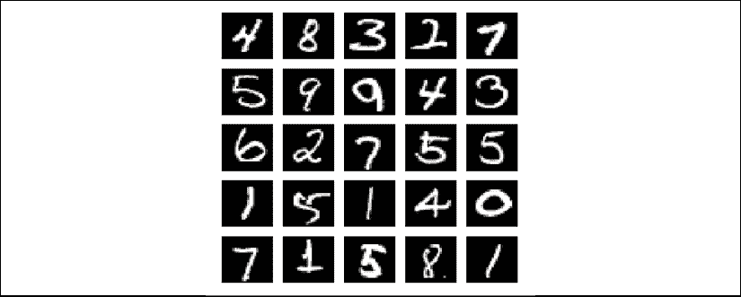

图 1.3.1：来自 MNIST 数据集的示例图像。 每个灰度图像为`28×28`像素。

在下面的中，我们将简要介绍 MNIST。

## MNIST 数据集

MNIST 是从 0 到 9 的手写数字的集合。它具有 60,000 张图像的训练集和 10,000 张测试图像，这些图像被分为相应的类别或标签。 在某些文献中，术语**目标**或**基本事实**也用于指**标签**。

在上图中，可以看到 MNIST 数字的样本图像，每个样本的大小为`28 x 28`像素（灰度）。 为了在 Keras 中使用 MNIST 数据集，提供了一个 API，用于下载并自动提取图像和标签。“列表 1.3.1”演示了如何仅在一行中加载 MNIST 数据集，从而使我们既可以计算训练和测试标签，又可以绘制 25 个随机数字图像。

“列表 1.3.1”：`mnist-sampler-1.3.1.py`

```py
import numpy as np
from tensorflow.keras.datasets import mnist
import matplotlib.pyplot as plt 
```

```py
# load dataset
(x_train, y_train), (x_test, y_test) = mnist.load_data() 
```

```py
# count the number of unique train labels
unique, counts = np.unique(y_train, return_counts=True)
print("Train labels: ", dict(zip(unique, counts))) 
```

```py
# count the number of unique test labels
unique, counts = np.unique(y_test, return_counts=True)
print("Test labels: ", dict(zip(unique, counts))) 
```

```py
# sample 25 mnist digits from train dataset
indexes = np.random.randint(0, x_train.shape[0], size=25)
images = x_train[indexes]
labels = y_train[indexes] 
```

```py
# plot the 25 mnist digits
plt.figure(figsize=(5,5))
for i in range(len(indexes)):
    plt.subplot(5, 5, i + 1)
    image = images[i]
    plt.imshow(image, cmap='gray')
    plt.axis('off') 
```

```py
plt.savefig("mnist-samples.png")
plt.show()
plt.close('all') 
```

`mnist.load_data()`方法很方便，因为不需要分别加载所有 70,000 张图像和标签并将它们存储在数组中。 执行以下命令：

```py
python3 mnist-sampler-1.3.1.py 
```

在命令行上，该代码示例打印训练和测试数据集中的标签分布：

```py
Train labels:{0: 5923, 1: 6742, 2: 5958, 3: 6131, 4: 5842, 5: 5421, 6: 5918, 7: 6265, 8: 5851, 9: 5949}
Test labels:{0: 980, 1: 1135, 2: 1032, 3: 1010, 4: 982, 5: 892, 6: 958, 7: 1028, 8: 974, 9: 1009} 
```

之后，代码将绘制 25 个随机数字，如先前在“图 1.3.1”中所示。

在讨论 MLP 分类器模型之前，必须记住，虽然 MNIST 数据由二维张量组成，但应根据输入层的类型对它进行重塑。 以下“图 1.3.2”显示了如何为 MLP，CNN 和 RNN 输入层重塑`3×3`灰度图像：

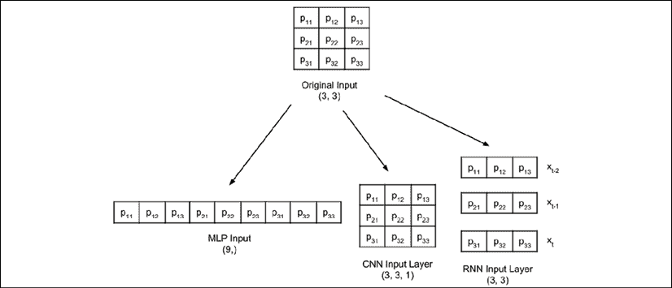

图 1.3.2：根据输入层的类型，对与 MNIST 数据相似的输入图像进行重塑。 为简单起见，显示了`3×3`灰度图像的重塑。

在以下各节中，将介绍 MNIST 的 MLP 分类器模型。 我们将演示如何使用`tf.keras`有效地构建，训练和验证模型。

## MNIST 数字分类器模型

“图 1.3.3”中显示的建议的 MLP 模型可用于 MNIST 数字分类。 当单元或感知器暴露在外时，MLP 模型是一个全连接网络，如图“图 1.3.4”所示。 我们还将展示如何根据第`n`个单元的权重`w[i]`和偏置`b[n]`的输入来计算感知器的输出。 相应的`tf.keras`实现在“列表 1.3.2”中进行了说明：

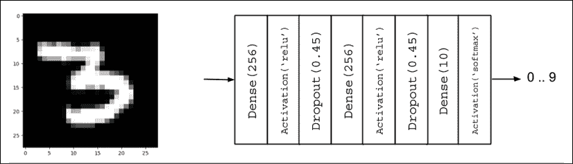

图 1.3.3：MLP MNIST 数字分类器模型

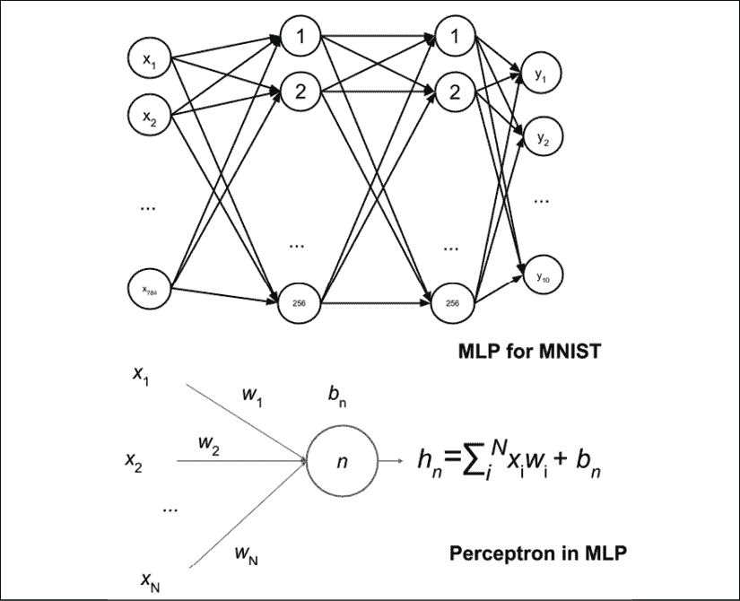

图 1.3.4：图 1.3.3 中的 MLP MNIST 数字分类器由全连接层组成。 为简单起见，未显示激活层和退出层。 还详细显示了一个单元或感知器。

“列表 1.3.2”：`mlp-mnist-1.3.2.py`

```py
import numpy as np
from tensorflow.keras.models import Sequential
from tensorflow.keras.layers import Dense, Activation, Dropout
from tensorflow.keras.utils import to_categorical, plot_model
from tensorflow.keras.datasets import mnist 
```

```py
# load mnist dataset
(x_train, y_train), (x_test, y_test) = mnist.load_data() 
```

```py
# compute the number of labels
num_labels = len(np.unique(y_train)) 
```

```py
# convert to one-hot vector
y_train = to_categorical(y_train)
y_test = to_categorical(y_test)

# image dimensions (assumed square)
image_size = x_train.shape[1]
input_size = image_size * image_size 
```

```py
# resize and normalize
x_train = np.reshape(x_train, [-1, input_size])
x_train = x_train.astype('float32') / 255
x_test = np.reshape(x_test, [-1, input_size])
x_test = x_test.astype('float32') / 255 
```

```py
# network parameters
batch_size = 128
hidden_units = 256
dropout = 0.45 
```

```py
# model is a 3-layer MLP with ReLU and dropout after each layer
model = Sequential()
model.add(Dense(hidden_units, input_dim=input_size))
model.add(Activation('relu'))
model.add(Dropout(dropout))
model.add(Dense(hidden_units))
model.add(Activation('relu'))
model.add(Dropout(dropout))
model.add(Dense(num_labels))
# this is the output for one-hot vector
model.add(Activation('softmax'))
model.summary()
plot_model(model, to_file='mlp-mnist.png', show_shapes=True) 
```

```py
# loss function for one-hot vector
# use of adam optimizer
# accuracy is good metric for classification tasks
model.compile(loss='categorical_crossentropy',
              optimizer='adam',
              metrics=['accuracy'])
# train the network
model.fit(x_train, y_train, epochs=20, batch_size=batch_size) 
```

```py
# validate the model on test dataset to determine generalization
_, acc = model.evaluate(x_test,
                        y_test,
                        batch_size=batch_size,
                        verbose=0)
print("\nTest accuracy: %.1f%%" % (100.0 * acc)) 
```

在讨论模型实现之前，数据必须具有正确的形状和格式。 加载 MNIST 数据集后，标签的数量计算为：

```py
# compute the number of labels
num_labels = len(np.unique(y_train)) 
```

硬编码`num_labels = 10`也可以选择。 但是，让计算机完成工作始终是一个好习惯。 该代码假定`y_train`的标签为 0 到 9。

此时，标签为数字格式，即从 0 到 9。标签的这种稀疏标量表示形式不适用于按类别输出概率的神经网络预测层。 一种更合适的格式称为`one-hot vector`，这是一个十维向量，除数字类的索引外，所有元素均为 0。 例如，如果标签为 2，则等效`one-hot vector`为[0,0,1,0,0,0,0,0,0,0]。 第一个标签的索引为 0。

以下各行将每个标签转换为`one-hot vector`：

```py
# convert to one-hot vector
y_train = to_categorical(y_train)
y_test = to_categorical(y_test) 
```

在深度学习中，数据存储在张量中。 张量一词适用于标量（0D 张量），向量（1D 张量），矩阵（二维张量）和多维张量。

从这一点出发，除非标量，向量或矩阵使解释更清楚，否则将使用术语张量。

如下所示的其余代码将计算图像尺寸，第一密集层的`input_size`值，并将每个像素值从 0 缩放到 255，范围从 0.0 缩放到 1.0。 尽管可以直接使用原始像素值，但最好对输入数据进行规范化，以避免产生可能会使训练变得困难的较大梯度值。 网络的输出也被标准化。 训练后，可以通过将输出张量乘以 255 来将所有内容恢复为整数像素值。

提出的模型基于 MLP 层。 因此，输入应为一维张量。 这样，将`x_train`和`x_test`分别重塑为`[60,000，28 * 28]`和`[10,000，28 * 28]`。 在 NumPy 中，大小为 -1 表示让库计算正确的尺寸。 在`x_train`的情况下为 60,000。

```py
# image dimensions (assumed square) 400
image_size = x_train.shape[1]
input_size = image_size * image_size 
```

```py
# resize and normalize
x_train = np.reshape(x_train, [-1, input_size])
x_train = x_train.astype('float32') / 255
x_test = np.reshape(x_test, [-1, input_size])
x_test = x_test.astype('float32') / 255 
```

在准备好数据集之后，以下内容将重点介绍使用 Keras 的顺序 API 构建 MLP 分类器模型。

## 使用 MLP 和 Keras 构建模型

数据准备之后，接下来是构建模型。 所提出的模型由三个 MLP 层组成。 在 Keras 中，将 MLP 层称为**密集**，它表示紧密连接的层。 第一和第二个 MLP 层本质上是相同的，每个都有 256 个单元，然后是**整流线性单元**（**ReLU**）激活和退出。 由于 128、512 和 1,024 个单元的表现指标较低，因此选择 256 个单元。 在 128 个单元的情况下，网络收敛迅速，但测试精度较低。 512 或 1,024 的额外单元数量不会显着提高测试精度。

单元数是超参数。 它控制网络的**容量**。 容量是网络可以近似的函数复杂性的度量。 例如，对于多项式，度是超参数。 随着程度的增加，函数的能力也随之增加。

如以下代码行所示，使用 Keras 的顺序 API 实现分类器模型。 如果模型需要一个输入和一个输出（由一系列层处理），这就足够了。 为了简单起见，我们现在将使用它。 但是，在“第 2 章”，“深度神经网络”中，将引入 Keras 的函数式 API 来实现高级深度学习模型，该模型需要更复杂的结构（例如多个输入和输出）。

```py
# model is a 3-layer MLP with ReLU and dropout after each layer model = Sequential()
model.add(Dense(hidden_units, input_dim=input_size))
model.add(Activation('relu'))
model.add(Dropout(dropout))
model.add(Dense(hidden_units))
model.add(Activation('relu'))
model.add(Dropout(dropout))
model.add(Dense(num_labels))
# this is the output for one-hot vector model.add(Activation('softmax')) 
```

由于`Dense`层是线性运算，因此`Dense`层的序列只能近似线性函数。 问题是 MNIST 数字分类本质上是非线性过程。 在`Dense`层之间插入`relu`激活将使 MLP 网络能够对非线性映射建模。 `relu`或 ReLU 是一个简单的非线性函数。 这很像一个过滤器，它允许正输入不变地通过，同时将其他所有值都钳位为零。 数学上，`relu`用以下公式表示，见“图 1.3.5”：

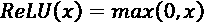

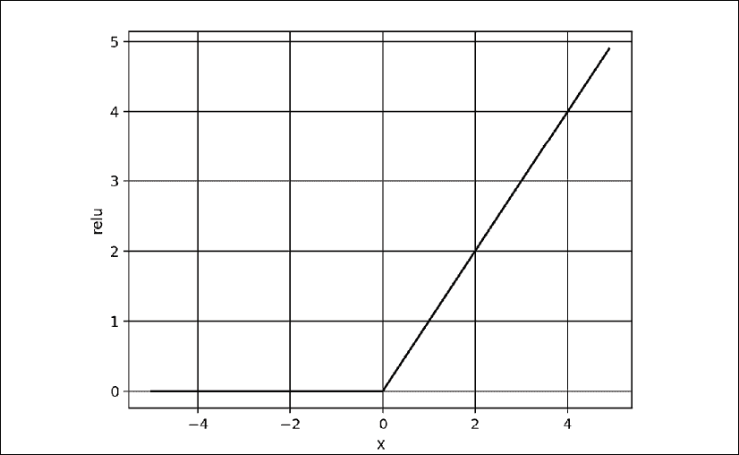

图 1.3.5：ReLU 函数图。 ReLU 函数在神经网络中引入了非线性。

还可以使用其他非线性函数，例如`elu`，`selu`，`softplus`，`sigmoid`和`tanh`。 但是，`relu`是最常用的函数，由于其简单性，在计算上是有效的。 Sigmoid 和 tanh 函数在输出层中用作激活函数，稍后将描述。“表 1.3.1”显示了每个激活函数的方程式：

| `relu` | `relu(x) = max(0, x)` | 1.3.1 |
| --- | --- | --- |
| `softplus` | `softplus(x) = log(1 + exp(x))` | 1.3.2 |
| `elu` | 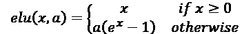 其中`a≥0`并且是可调超参数 | 1.3.3 |
| `selu` | `selu(x) = k×elu(x, a)`其中`k = 1.0507009873554804934193193349852946`和`a = 1.6732632423543772848170429916717` | 1.3.4 |
| `sigmoid` | 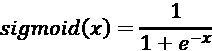 | 1.3.5 |
| `tanh` | 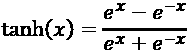 | 1.3.6 |

表 1.3.1：常见非线性激活函数的定义

尽管我们已完成 MLP 分类器模型的关键层，但我们尚未解决泛化问题或模型超出训练数据集的能力。 为了解决这个问题，我们将在下一节介绍正则化。

## 正则化

神经网络倾向于记住其训练数据，特别是如果它包含的容量超过。 在这种情况下，当经受测试数据时，网络将发生灾难性的故障。 这是网络无法推广的经典情况。 为了避免这种趋势，模型使用了正则化层或函数。 常见的正则化层是`Dropout`。

丢弃的想法很简单。 给定丢弃率（此处将其设置为`dropout = 0.45`），丢弃层会从参与下一层的单元中随机删除这一部分。 例如，如果第一层具有 256 个单元，则在应用`dropout = 0.45`之后，只有`(1-0.45) * 256`个单元，来自第 1 层的 140 个单元参与第 2 层。

丢弃层使神经网络对于无法预见的输入数据具有鲁棒性，因为即使缺少某些单元，训练后的神经网络也可以正确预测。 值得注意的是，输出层中没有使用丢弃，它仅在训练期间处于活动状态。 此外，在预测期间不存在丢弃现象。

除了诸如丢弃之类的正则化之外，还可以使用其他正则化器。 在 Keras 中，可以按层对偏置，权重和激活输出进行正则化。 `l1`和`l2`通过添加罚函数来支持较小的参数值。 `l1`和`l2`都使用绝对值（`l1`）或平方（`l2`）之和的分数来执行惩罚。 换句话说，惩罚函数迫使优化器找到较小的参数值。 参数值小的神经网络对来自输入数据的噪声的存在更加不敏感。

例如，带有`fraction=0.001`的`l2`权重正则器可以实现为：

```py
from tensorflow.keras.regularizers import l2
model.add(Dense(hidden_units,
                kernel_regularizer=l2(0.001),
                input_dim=input_size)) 
```

如果使用`l1`或`l2`正则化，则不添加任何附加层。 正则化在内部施加在`Dense`层中。 对于建议的模型，丢弃仍然具有比`l2`更好的表现。

我们的模型几乎已经完成。 下一节将重点介绍输出层和损失函数。

## 输出激活和损失函数

输出的层具有 10 个单元，其后是`softmax`激活层。 这 10 个单元对应于 10 个可能的标签，类或类别。 可以用数学方式表示`softmax`激活，如以下等式所示：

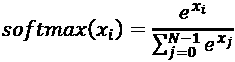 (Equation 1.3.7)

该方程适用于所有`N = 10`输出，`x[i]`对于`i = 0, 1, ..., 9`作最终预测。 `softmax`的概念非常简单。 通过对预测进行归一化，将输出压缩为概率。 在此，每个预测输出都是该索引是给定输入图像的正确标签的概率。 所有输出的所有概率之和为 1.0。 例如，当`softmax`层生成预测时，它将是一个 10 维一维张量，看起来像以下输出：

```py
[3.57351579e-11 7.08998016e-08   
 2.30154569e-07 6.35787558e-07 
 5.57471187e-11 4.15353840e-09 
 3.55973775e-16 9.99995947e-01
 1.29531730e-09 3.06023480e-06] 
```

预测输出张量建议输入图像的索引具有最高概率，因此将为 7。 `numpy.argmax()`方法可用于确定具有最高值的元素的索引。

输出激活层还有其他选择，例如`linear`，`sigmoid`或`tanh`。 `linear`激活是一种恒等函数。 它将其输入复制到其输出。 `sigmoid`函数更具体地是，称为**逻辑 Sigmoid**。 如果预测张量的元素将独立地映射在 0.0 和 1.0 之间，则将使用此方法。 与`softmax`中不同，预测张量的所有元素的总和不限于 1.0。 例如，`sigmoid`用作情感预测（从 0.0 到 1.0、0.0 不好，1.0 很好）或图像生成（0.0 映射到像素级别 0 和 1.0 映射到像素 255）的最后一层 。

`tanh`函数将其输入映射在 -1.0 到 1.0 的范围内。 如果输出可以同时以正值和负值摆幅，则这一点很重要。 `tanh`函数在循环神经网络的内部层中更普遍使用，但也已用作输出层激活。 如果在输出激活中使用 tanh 代替`sigmoid`，则必须适当缩放使用的数据。 例如，不是使用`x = x / 255`缩放`[0.0, 1.0]`范围内的每个灰度像素，而是使用`x = (x - 127.5) / 127.5`将其分配在`[-1.0, 1.0]`范围内。

下图“图 1.3.6”显示了`sigmoid`和`tanh`函数。 数学上，Sigmoid 可以用以下公式表示：

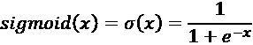 (Equation 1.3.5)

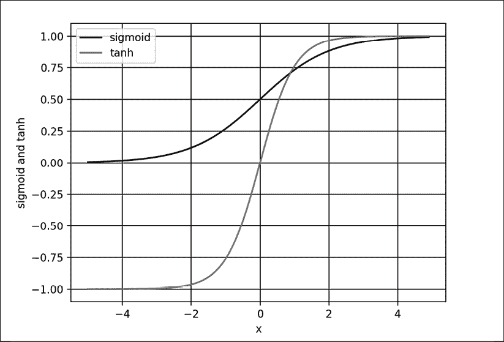

图 1.3.6：Sigmoid 和正切图

预测张量距单热地面真值向量有多远称为损失。 损失函数的一种类型是`mean_squared_error`（**MSE**），或者是目标或标签与预测之间差异的平方的平均值。 在当前示例中，我们使用`categorical_crossentropy`。 它是目标或标签乘积与每个类别的预测对数之和的负数。 Keras 中还有其他损失函数，例如`mean_absolute_error`和`binary_crossentropy`。“表 1.3.2”总结了的常见损失函数。

| **损失函数** | **公式** |
| --- | --- |
| `mean_squared_error` | 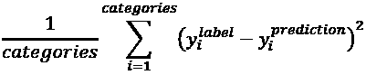 |
| `mean_absolute_error` | 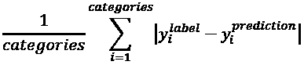 |
| `categorical_crossentropy` | 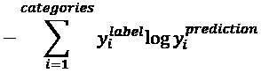 |
| `binary_crossentropy` | 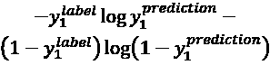 |

表 1.3.2：常见损失函数汇总。 类别是指标签和预测中的类别数（例如：MNIST 为 10）。 所示的损失方程式仅适用于一个输出。 平均损失值是整个批量的平均值。

损失函数的选择不是任意的，而应作为模型正在学习的标准。 对于按类别进行分类，在`softmax`激活层之后，`categorical_crossentropy`或`mean_squared_error`是一个不错的选择。 `binary_crossentropy`损失函数通常在`sigmoid`激活层之后使用，而`mean_squared_error`是`tanh`输出的选项。

在下一部分中，我们将讨论优化算法以最小化我们在此处讨论的损失函数。

## 优化

通过优化，目标是使损失函数最小化。 这个想法是，如果将损失减少到可接受的水平，则该模型将间接学习将输入映射到输出的函数。 表现指标用于确定模型是否了解了基础数据分布。 Keras 中的默认指标是**损失**。 在训练，验证和测试期间，还可以包括其他指标，例如**准确率**。 准确率是基于地面真实性的正确预测的百分比或分数。 在深度学习中，还有许多其他表现指标。 但是，它取决于模型的目标应用。 在文献中，报告了**测试数据集**上训练后的模型的表现指标，用于与其他深度学习模型进行比较。

在 Keras 中，优化器有个选择。 最常用的优化器是**随机梯度下降**（**SGD**），**自适应矩**（**Adam**）和**均方根传播**（**RMSprop**）。 每个优化器均具有可调参数，例如学习率，动量和衰减。 Adam 和 RMSprop 是具有自适应学习率的 SGD 的变体。 在提出的分类器网络中，使用了 Adam，因为它具有最高的测试精度。

SGD 被认为是最基本的优化程序。 它是演算中梯度下降的简单版本。 在**梯度下降**（**GD**）中，追踪下坡函数的曲线可找到最小值，就像在山谷中下坡直至到达底部一样。

GD 算法如图 1.3.7 所示。 假设`x`是被调整以找到`y`的最小值（例如，损失函数）的参数（例如，权重）。 从`x = -0.5`的任意点开始。 梯度`dy/dx = -2.0`。 GD 算法强加`x`然后更新为`x = -0.5 - ε(-2.0)`。 `x`的新值等于旧值，再加上`ε`缩放的梯度的相反值。 小数字`ε`是指学习率。 如果`ε = 0.01`，则`x`的新值为 -0.48。 GD 是迭代执行的。 在每一步，`y`都将接近其最小值。 在`x = 0.5`时，`dy/dx = 0`。 GD 已找到`y = -1.25`的绝对最小值。 梯度建议不要进一步改变`x`。

学习率的选择至关重要。 大的`ε`值可能找不到最小值，因为搜索只会在最小值附近来回摆动。 一方面，在找到最小值之前，较大的`ε`值可能需要进行大量迭代。 在有多个最小值的情况下，搜索可能会陷入局部最小值。

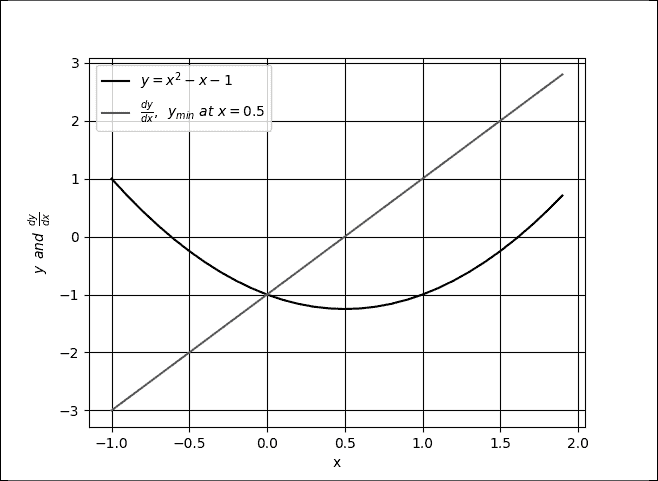

图 1.3.7：GD 类似于在函数曲线上向下走直到到达最低点。 在此图中，全局最小值为`x = 0.5`。

多个极小值的示例可以在“图 1.3.8”中看到。 如果由于某种原因从图的左侧开始搜索并且学习率很小，则 GD 很可能会发现`x = -1.51`是*最小值* 。 GD 无法在`x = 1.66`时找到全局最小值。 具有足够值的学习率将使 GD 可以克服`x = 0.0`的问题。

在深度学习实践中，通常建议从更高的学习率开始（例如，从 0.1 到 0.001），并随着损失接近最小值而逐渐降低学习率。

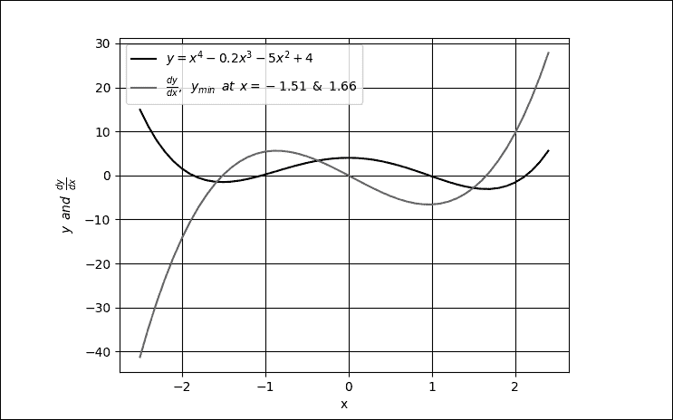

图 1.3.8：具有 2 个最小值的函数图，`x = -1.51`和`x = 1.66`。 还显示了该函数的导数。

GD 通常不用于深度神经网络，因为遇到数百万个要训练的参数很常见。 执行完整的 GD 在计算上效率低下。 而是使用 SGD。 在 SGD 中，选择一小批样本以计算下降的近似值。 参数（例如权重和偏差）可通过以下公式进行调整：

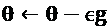

在该等式中，`θ`和`g = 1/m ᐁ[θ] ΣL`分别是损失函数的参数和梯度张量。`g`由损失函数的偏导数计算得出。 出于 GPU 优化的目的，建议最小批量大小为 2 的幂。 在建议的网络中，`batch_size = 128`。

“公式 1.3.8”计算最后一层参数更新。 那么，我们如何调整前几层的参数呢？ 在这种情况下，应用微分链规则将导数传播到较低层并相应地计算梯度。 该算法在深度学习中称为**反向传播**。 反向传播的详细信息超出了本书的范围。 但是，可以在[这里](http://neuralnetworksanddeeplearning.com)找到很好的在线参考。

由于优化是基于微分的，因此得出损失函数的重要标准是它必须平滑或可微。 当引入新的损失函数时，这是要牢记的重要约束。

给定训练数据集，损失函数的选择，优化器和正则化器，现在可以通过调用`fit()`函数来训练模型：

```py
# loss function for one-hot vector 
# use of adam optimizer
# accuracy is a good metric for classification tasks model.compile(loss='categorical_crossentropy',
optimizer='adam', metrics=['accuracy']) 
```

```py
# train the network
model.fit(x_train, y_train, epochs=20, batch_size=batch_size) 
```

这是 Keras 的另一个有用函数。 通过仅提供`x`和`y`数据，要训练的周期数和批量大小，`fit()`完成了其余工作。 在其他深度学习框架中，这转化为多项任务，例如以适当的格式准备输入和输出数据，加载，监视等等。 尽管所有这些都必须在`for`循环内完成，但在 Keras 中，一切都只需要一行即可完成。

在`fit()`函数中，一个周期是整个训练数据的完整采样。 `batch_size`参数是每个训练步骤要处理的输入数量的样本大小。 为了完成一个周期，`fit()`将处理等于训练数据集大小的步数除以批量大小再加上 1，以补偿任何小数部分。

训练模型后，我们现在可以评估其表现。

## 表现评估

至此，MNIST 数字分类器的模型现已完成。 表现评估将是的下一个关键步骤，以确定提议的训练模型是否已提出令人满意的解决方案。 将模型训练 20 个时间段就足以获得可比较的表现指标。

下表“表 1.3.3”列出了不同的网络配置和相应的表现指标。 在“层”下，显示第 1 到第 3 层的单元数。对于每个优化器，将使用`tf.keras`中的默认参数。 可以观察到改变正则化器，优化器和每层单元数的效果。“表 1.3.3”中的另一个重要观察结果是，更大的网络不一定会转化为更好的表现。

在训练和测试数据集的准确率方面，增加此网络的深度不会显示任何其他好处。 另一方面，较少的单元（例如 128）也可能会降低测试和训练的准确率。 删除正则器后，将在`99.93%`处获得最佳的训练精度，并且每层使用 256 个单元。 但是，由于网络过拟合，测试精度在`98.0%`时要低得多。

最高的测试精度是使用 Adam 优化器和`98.5%`处的`Dropout(0.45)`。 从技术上讲，鉴于其训练精度为`99.39%`，仍然存在某种程度的过拟合。 对于`256-512-256`，`Dropout(0.45)`和 SGD，在`98.2%`时，训练和测试精度均相同。 同时去除正则化和 ReLU 层会导致其表现最差。 通常，我们会发现`Dropout`层比`l2`具有更好的表现。

下表演示了调整期间典型的深度神经网络表现：

| **层** | **正则化函数** | **优化器** | **ReLU** | **训练准确率（%）** | **测试准确率（%）** |
| --- | --- | --- | --- | --- | --- |
| 256-256-256 | 没有 | SGD | 没有 | 93.65 | 92.5 |
| 256-256-256 | L2（0.001） | SGD | 是 | 99.35 | 98.0 |
| 256-256-256 | L2（0.01） | SGD | 是 | 96.90 | 96.7 |
| 256-256-256 | 没有 | SGD | 是 | 99.93 | 98.0 |
| 256-256-256 | 丢弃（0.4） | SGD | 是 | 98.23 | 98.1 |
| 256-256-256 | 丢弃（0.45） | SGD | 是 | 98.07 | 98.1 |
| 256-256-256 | 丢弃（0.5） | SGD | 是 | 97.68 | 98.1 |
| 256-256-256 | 丢弃（0.6） | SGD | 是 | 97.11 | 97.9 |
| 256-512-256 | 丢弃（0.45） | SGD | 是 | 98.21 | 98.2 |
| 512-512-512 | 丢弃（0.2） | SGD | 是 | 99.45 | 98.3 |
| 512-512-512 | 丢弃（0.4） | SGD | 是 | 98.95 | 98.3 |
| 512-1024-512 | 丢弃（0.45） | SGD | 是 | 98.90 | 98.2 |
| 1024-1024-1024 | 丢弃（0.4） | SGD | 是 | 99.37 | 98.3 |
| 256-256-256 | 丢弃（0.6） | Adam | 是 | 98.64 | 98.2 |
| 256-256-256 | 丢弃（0.55） | Adam | 是 | 99.02 | 98.3 |
| 256-256-256 | 丢弃（0.45） | Adam | 是 | 99.39 | 98.5 |
| 256-256-256 | 丢弃（0.45） | RMSprop | 是 | 98.75 | 98.1 |
| 128-128-128 | 丢弃（0.45） | Adam | 是 | 98.70 | 97.7 |

表 1.3.3 不同的 MLP 网络配置和表现指标

示例指示需要改进网络架构。 在下一节讨论了 MLP 分类器模型摘要之后，我们将介绍另一个 MNIST 分类器。 下一个模型基于 CNN，并证明了测试准确率的显着提高。

## 模型摘要

使用 Keras 库为我们提供了一种快速的机制，可以通过调用以下方法来仔细检查模型描述：

```py
model.summary() 
```

下面的“列表 1.3.3”显示了所建议网络的模型摘要。 它总共需要 269,322 个参数。 考虑到我们具有对 MNIST 数字进行分类的简单任务，这一点非常重要。 MLP 的参数效率不高。 可以通过关注如何计算感知器的输出，从“图 1.3.4”计算参数的数量。 从输入到密集层：`784 × 256 + 256 = 200,960`。 从第一密集层到第二密集层：`256 × 256 + 256 = 65,792`。 从第二个密集层到输出层：`10 × 256 + 10 = 2,570`。 总数是`269,322`。

“列表 1.3.3”：MLP MNIST 数字分类器模型的摘要：

```py
Layer (type)	               Output Shape	  Param #
=================================================================
dense_1 (Dense)                (None, 256)         200960
activation_1 (Activation)      (None, 256)            0
dropout_1 (Dropout)            (None, 256)            0
dense_2 (Dense)                (None, 256)         65792
activation_2 (Activation)      (None, 256)            0
dropout_2 (Dropout)            (None, 256)            0
dense_3 (Dense)                (None, 10)          2750
activation_3 (Activation)      (None, 10)             0
=================================================================
Total params: 269,322
Trainable params: 269,322
Non-trainable params: 0 
```

验证网络的另一种方法是通过调用：

```py
plot_model(model, to_file='mlp-mnist.png', show_shapes=True) 
```

“图 1.3.9”显示了该图。 您会发现这类似于`summary()`的结果，但是以图形方式显示了每个层的互连和 I/O。

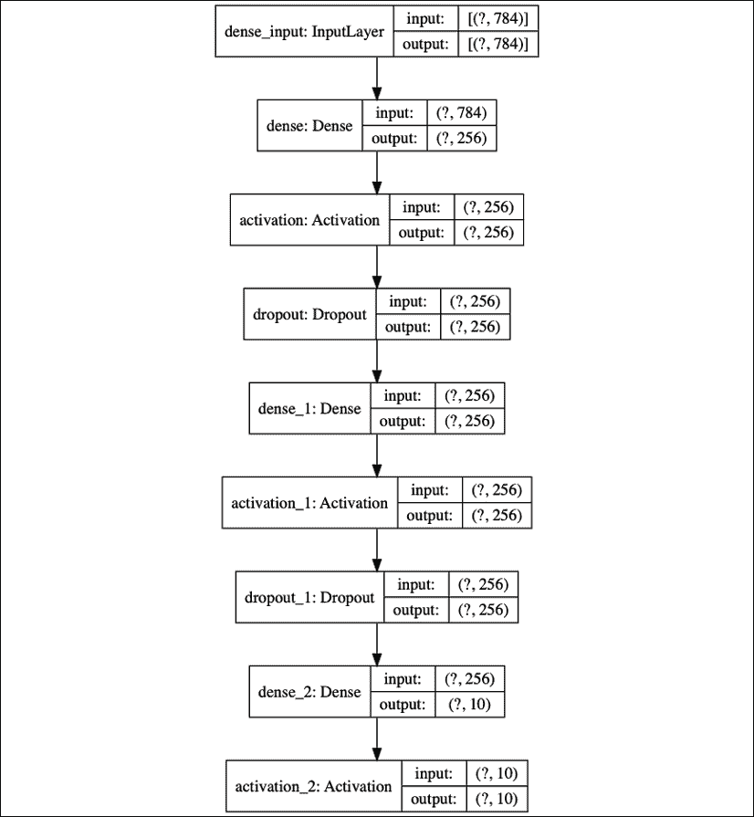

图 1.3.9：MLP MNIST 数字分类器的图形描述

在总结了我们模型的之后，到此结束了我们对 MLP 的讨论。 在下一部分中，我们将基于 CNN 构建 MNIST 数字分类器模型。

# 4\. 卷积神经网络（CNN）

现在，我们将进入第二个人工神经网络 CNN。 在本节中，我们将解决相同的 MNIST 数字分类问题，但这一次使用 CNN。

“图 1.4.1”显示了我们将用于 MNIST 数字分类的 CNN 模型，而其实现在“列表 1.4.1”中进行了说明。 实现 CNN 模型将需要对先前模型进行一些更改。 现在，输入张量不再具有输入向量，而具有新尺寸（`height`，`width`，`channels`）或（`image_size`，`image_size`，`1`）=（`28`，`28` ，`1`）用于 MNIST 灰度图像。 需要调整训练和测试图像的大小以符合此输入形状要求。

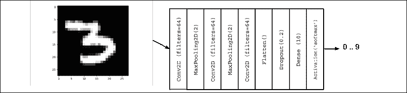

图 1.4.1：用于 MNIST 数字分类的 CNN 模型

实现上图：

“列表 1.4.1”：`cnn-mnist-1.4.1.py`

```py
import numpy as np
from tensorflow.keras.models import Sequential
from tensorflow.keras.layers import Activation, Dense, Dropout
from tensorflow.keras.layers import Conv2D, MaxPooling2D, Flatten
from tensorflow.keras.utils import to_categorical, plot_model
from tensorflow.keras.datasets import mnist 
```

```py
# load mnist dataset
(x_train, y_train), (x_test, y_test) = mnist.load_data() 
```

```py
# compute the number of labels
num_labels = len(np.unique(y_train)) 
```

```py
# convert to one-hot vector
y_train = to_categorical(y_train)
y_test = to_categorical(y_test) 
```

```py
# input image dimensions
image_size = x_train.shape[1]
# resize and normalize
x_train = np.reshape(x_train,[-1, image_size, image_size, 1])
x_test = np.reshape(x_test,[-1, image_size, image_size, 1])
x_train = x_train.astype('float32') / 255
x_test = x_test.astype('float32') / 255 
```

```py
# network parameters
# image is processed as is (square grayscale)
input_shape = (image_size, image_size, 1)
batch_size = 128
kernel_size = 3
pool_size = 2
filters = 64
dropout = 0.2 
```

```py
# model is a stack of CNN-ReLU-MaxPooling
model = Sequential()
model.add(Conv2D(filters=filters,
                 kernel_size=kernel_size,
                 activation='relu',
                 input_shape=input_shape))
model.add(MaxPooling2D(pool_size))
model.add(Conv2D(filters=filters,
                 kernel_size=kernel_size,
                 activation='relu'))
model.add(MaxPooling2D(pool_size))
model.add(Conv2D(filters=filters,
                 kernel_size=kernel_size,
                 activation='relu'))
model.add(Flatten())
# dropout added as regularizer
model.add(Dropout(dropout))
# output layer is 10-dim one-hot vector
model.add(Dense(num_labels))
model.add(Activation('softmax'))
model.summary()
plot_model(model, to_file='cnn-mnist.png', show_shapes=True) 
```

```py
# loss function for one-hot vector
# use of adam optimizer
# accuracy is good metric for classification tasks
model.compile(loss='categorical_crossentropy',
              optimizer='adam',
              metrics=['accuracy'])
# train the network
model.fit(x_train, y_train, epochs=10, batch_size=batch_size) 
```

```py
_, acc = model.evaluate(x_test,
                        y_test,
                        batch_size=batch_size,
                   verbose=0)
print("\nTest accuracy: %.1f%%" % (100.0 * acc)) 
```

的主要更改是`Conv2D`层的使用。 `ReLU`激活函数已经是`Conv2D`的参数。 当模型中包含`batch normalization`层时，可以将`ReLU`函数作为`Activation`层使用。 `Batch normalization`用于深层 CNN，因此可以利用较大的学习率而不会引起训练过程中的不稳定。

## 卷积

如果在 MLP 模型中，单元数量表示密集层，则核表示 CNN 操作。 如图“图 1.4.2”所示，可以将核可视化为矩形补丁或窗口，该补丁或窗口从左到右，从上到下在整个图像中滑动。 此操作称为卷积。 它将输入图像转换成特征映射，该特征映射表示核从输入图像中学到的内容。 然后将特征映射转换为后续层中的另一个特征映射，依此类推。 每个`Conv2D`生成的特征映射的数量由`filters`参数控制。

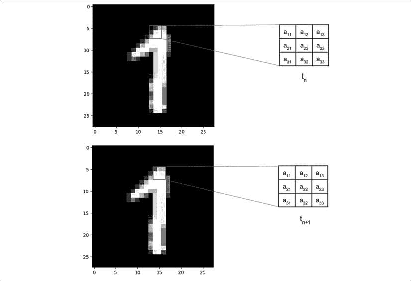

图 1.4.2：3×3 核与 MNIST 数字图像卷积。

在步骤`t[n]`和`t[n + 1]`中显示了卷积，其中核向右移动了 1 个像素 。

卷积中涉及的计算显示在“图 1.4.3”中：

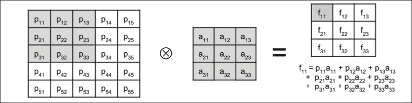

图 1.4.3：卷积运算显示如何计算特征映射的一个元素

为简单起见，显示了应用了`3×3`核的`3×3`输入图像（或输入特征映射）。 卷积后显示结果特征映射。 特征映射中一个元素的值被加阴影。 您会注意到，结果特征映射小于原始输入图像的，这是因为卷积仅在有效元素上执行。 核不能超出映像的边界。 如果输入的尺寸应与输出特征映射相同，则`Conv2D`接受选项`padding='same'`。 输入在其边界周围填充零，以在卷积后保持尺寸不变。

## 池化操作

最后的更改是添加了`MaxPooling2D`层以及参数`pool_size=2`。 `MaxPooling2D`压缩每个特征映射。 每个大小为`pool_size × pool_size`的补丁都减少为 1 个特征映射点。 该值等于补丁中的最大特征点值。 下图显示了`MaxPooling2D`的两个补丁：

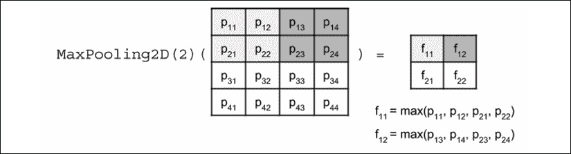

图 1.4.4：`MaxPooling2D`操作。 为简单起见，输入特征映射为`4×4`，结果为`2×2`特征映射。

`MaxPooling2D`的意义在于特征映射尺寸的减小，这转化为感受野尺寸的增加。 例如，在`MaxPooling2D(2)`之后，2×2 核现在大约与`4×4`补丁卷积。 CNN 学会了针对不同接收场大小的一组新的特征映射。

还有其他合并和压缩方式。 例如，要使`MaxPooling2D(2)`的尺寸减少 50%，`AveragePooling2D(2)`会取一个补丁的平均值而不是找到最大值。 交叉卷积`Conv2D(strides=2,…)`在卷积过程中将跳过每两个像素，并且仍具有相同的 50% 缩小效果。 每种还原技术的有效性都有细微的差异。

在`Conv2D`和`MaxPooling2D`中，`pool_size`和`kernel`都可以是非正方形的。 在这些情况下，必须同时指定行和列的大小。 例如，`pool_ size = (1, 2)`和`kernel = (3, 5)`。

最后一个`MaxPooling2D`操作的输出是一堆特征映射。 `Flatten`的作用是，将特征映射的栈转换为适用于`Dropout`或`Dense`层的向量格式，类似于 MLP 模型输出层。

在下一部分中，我们将评估经过训练的 MNIST CNN 分类器模型的表现。

## 表现评估和模型摘要

如“列表 1.4.2”中所示，“列表 1.4.1”中的 CNN 模型在 80,226 处需要较少数量的参数，而使用 MLP 层时需要 269,322 个参数。 `conv2d_1`层具有 640 个参数，因为每个核具有`3×3 = 9`个参数，并且 64 个特征映射中的每一个都有一个核，一个偏置参数。 其他卷积层的参数数量可以类似的方式计算。

“列表 1.4.2”：CNN MNIST 数字分类器的摘要

```py
Layer (type)	                 Output Shape	        Param #
=================================================================
conv2d_1 (Conv2D)                (None, 26, 26, 64)      640
max_pooling2d_1 (MaxPooiling2)   (None, 13, 13, 64)      0
conv2d_2 (Conv2D)                (None, 11, 11, 64)      36928
max_pooling2d_2 (MaxPooiling2)   (None, 5.5, 5, 64)      0
conv2d_3 (Conv2D)                (None, 3.3, 3, 64)      36928
flatten_1 (Flatten)              (None, 576)             0
dropout_1 (Dropout)              (None, 576)             0
dense_1 (Dense)                  (None, 10)              5770
activation_1 (Activation)        (None, 10)              0
===================================================================
Total params: 80,266
Trainable params: 80,266
Non-trainable params: 0 
```

“图 1.4.5”：显示了 CNN MNIST 数字分类器的图形表示形式。

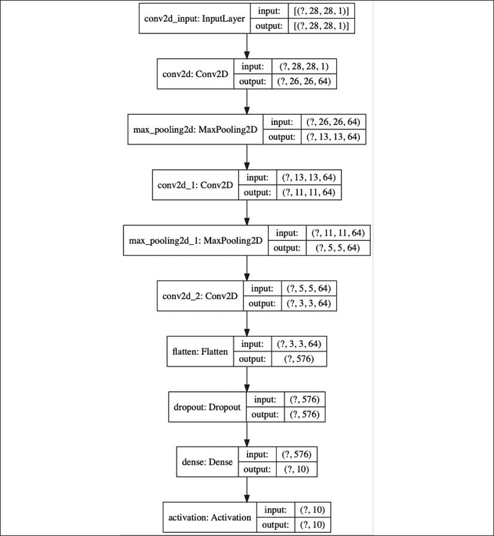

图 1.4.5：CNN MNIST 数字分类器的图形描述

“表 1.4.1”显示了 99.4% 的最大测试准确率，这对于使用带有`dropout=0.2`的 Adam 优化器的每层具有 64 个特征映射的 3 层网络可以实现。 CNN 比 MLP 具有更高的参数效率，并且具有更高的准确率。 同样，CNN 也适合从顺序数据，图像和视频中学习表示形式。

| **层** | **优化器** | **正则化函数** | **训练准确率（%）** | **测试准确率（%）** |
| --- | --- | --- | --- | --- | --- |
| 64-64-64 | SGD | 丢弃（0.2） | 97.76 | 98.50 |
| 64-64-64 | RMSprop | 丢弃（0.2） | 99.11 | 99.00 |
| 64-64-64 | Adam | 丢弃（0.2） | 99.75 | 99.40 |
| 64-64-64 | Adam | 丢弃（0.4） | 99.64 | 99.30 |

表 1.4.1：CNN MNIST 数字分类器的不同 CNN 网络配置和表现指标。

看了 CNN 并评估了训练好的模型之后，让我们看一下我们将在本章中讨论的最终核心网络：RNN。

# 5\. 循环神经网络（RNN）

现在，我们来看一下三个人工神经网络中的最后一个，即 RNN。

RNN 是网络的序列，适用于学习顺序数据的表示形式，例如**自然语言处理**（**NLP**）中的文本或仪器中的传感器数据流 。 尽管每个 MNIST 数据样本本质上都不是顺序的，但不难想象每个图像都可以解释为像素行或列的序列。 因此，基于 RNN 的模型可以将每个 MNIST 图像作为 28 个元素的输入向量序列进行处理，时间步长等于 28。下面的清单在“图 1.5.1”中显示了 RNN 模型的代码：

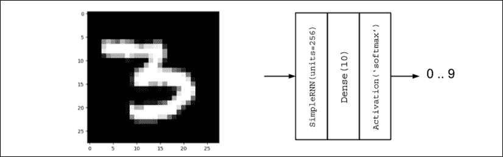

图 1.5.1：用于 MNIST 数字分类的 RNN 模型

“列表 1.5.1”：`rnn-mnist-1.5.1.py`

```py
import numpy as np
from tensorflow.keras.models import Sequential
from tensorflow.keras.layers import Dense, Activation, SimpleRNN
from tensorflow.keras.utils import to_categorical, plot_model
from tensorflow.keras.datasets import mnist 
```

```py
# load mnist dataset
(x_train, y_train), (x_test, y_test) = mnist.load_data() 
```

```py
# compute the number of labels
num_labels = len(np.unique(y_train)) 
```

```py
# convert to one-hot vector
y_train = to_categorical(y_train)
y_test = to_categorical(y_test) 
```

```py
# resize and normalize
image_size = x_train.shape[1]
x_train = np.reshape(x_train,[-1, image_size, image_size])
x_test = np.reshape(x_test,[-1, image_size, image_size])
x_train = x_train.astype('float32') / 255
x_test = x_test.astype('float32') / 255 
```

```py
# network parameters
input_shape = (image_size, image_size)
batch_size = 128
units = 256
dropout = 0.2 
```

```py
# model is RNN with 256 units, input is 28-dim vector 28 timesteps
model = Sequential()
model.add(SimpleRNN(units=units,
                    dropout=dropout,
                    input_shape=input_shape))
model.add(Dense(num_labels))
model.add(Activation('softmax'))
model.summary()
plot_model(model, to_file='rnn-mnist.png', show_shapes=True) 
```

```py
# loss function for one-hot vector
# use of sgd optimizer
# accuracy is good metric for classification tasks
model.compile(loss='categorical_crossentropy',
              optimizer='sgd',
              metrics=['accuracy'])
# train the network
model.fit(x_train, y_train, epochs=20, batch_size=batch_size) 
```

```py
_, acc = model.evaluate(x_test,
                        y_test,
                        batch_size=batch_size,
                        verbose=0)
print("\nTest accuracy: %.1f%%" % (100.0 * acc)) 
```

RNN 分类器与之前的两个模型之间有两个主要区别。 首先是`input_shape = (image_size, image_size)`，它实际上是`input_ shape = (timesteps, input_dim)`或时间步长的`input_dim`维向量序列。 其次是使用`SimpleRNN`层以`units=256`表示 RNN 单元。 `units`变量代表输出单元的数量。 如果 CNN 是通过输入特征映射上的核卷积来表征的，则 RNN 输出不仅是当前输入的函数，而且是先前输出或隐藏状态的函数。 由于前一个输出也是前一个输入的函数，因此当前输出也是前一个输出和输入的函数，依此类推。 Keras 中的`SimpleRNN`层是真实 RNN 的简化版本。 以下等式描述了`SimpleRNN`的输出：

 (Equation 1.5.1)

在此等式中，`b`是偏差，而`W`和`U`被称为循环核（先前输出的权重）和核（当前输入的权重） ）， 分别。 下标`t`用于指示序列中的位置。 对于具有`units=256`的`SimpleRNN`层，参数总数为`256 + 256×256 + 256×28 = 72,960`，对应于`b`，`W`和个贡献。

下图显示了用于分类任务的`SimpleRNN`和 RNN 的图。 使`SimpleRNN`比 RNN 更简单的是缺少输出值`o[t] = Vh[t] + c`在计算`softmax`函数之前：

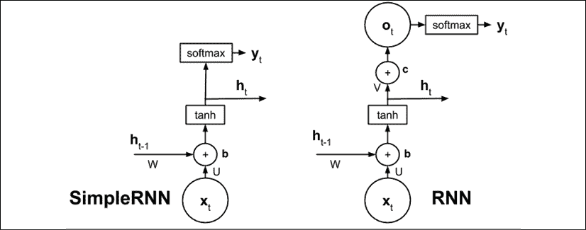

图 1.5.2：`SimpleRNN`和 RNN 图

与 MLP 或 CNN 相比，RNN 最初可能较难理解。 在 MLP 中，感知器是基本单元。 一旦了解了感知器的概念，MLP 就是感知器的网络。 在 CNN 中，核是一个补丁或窗口，可在特征映射中滑动以生成另一个特征映射。 在 RNN 中，最重要的是自环的概念。 实际上只有一个单元。

出现多个单元的错觉是因为每个时间步都有一个单元，但实际上，除非网络展开，否则它只是重复使用的同一单元。 RNN 的基础神经网络在单元之间共享。

“列表 1.5.2”中的摘要指示使用`SimpleRNN`需要较少数量的参数。

“列表 1.5.2”：RNN MNIST 数字分类器的摘要

```py
Layer (type)	               Output Shape	  Param #
=================================================================
simple_rnn_1 (SimpleRNN)       (None, 256)        72960
dense_1 (Dense)                (None, 10)         2570
activation_1 (Activation)      (None, 10)         36928
=================================================================
Total params: 75,530
Trainable params: 75,530
Non-trainable params: 0 
```

“图 1.5.3”显示了 RNN MNIST 数字分类器的图形描述。 该模型非常简洁：

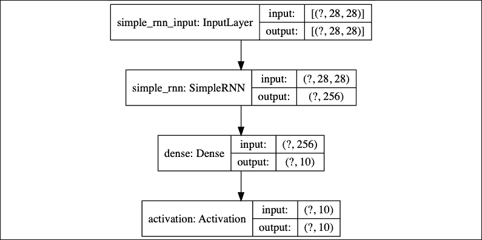

图 1.5.3：RNN MNIST 数字分类器图形说明

“表 1.5.1”显示 SimpleRNN 在所呈现的网络中具有最低的准确率：

| **层** | **优化器** | **正则化函数** | **训练准确率（%）** | **测试准确率（%）** |
| --- | --- | --- | --- | --- | --- |
| 256 | SGD | 丢弃（0.2） | 97.26 | 98.00 |
| 256 | RMSprop | 丢弃（0.2） | 96.72 | 97.60 |
| 256 | Adam | 丢弃（0.2） | 96.79 | 97.40 |
| 512 | SGD | 丢弃（0.2） | 97.88 | 98.30 |

表 1.5.1：不同的`SimpleRNN`网络配置和表现指标

在许多深度神经网络中，更常使用 RNN 家族的其他成员。 例如，机器翻译和问答问题都使用了**长短期记忆**（**LSTM**）。 LSTM 解决了长期依赖或记住与当前输出相关的过去信息的问题。

与 RNN 或`SimpleRNN`不同，LSTM 单元的内部结构更为复杂。“图 1.5.4”显示了 LSTM 的示意图。 LSTM 不仅使用当前输入和过去的输出或隐藏状态，还引入了一个单元状态`s[t]`，该状态将信息从一个单元传送到另一个单元。 单元状态之间的信息流由三个门控制`f[t]`，`i[t]`和`q[t]`。 这三个门的作用是确定应保留或替换哪些信息，以及过去对当前单元状态或输出有贡献的信息量以及过去和当前的输入。 我们不会在本书中讨论 LSTM 单元内部结构的细节。 但是，可以在[这个页面](http://colah.github.io/posts/2015-08-Understanding-LSTMs)上找到 LSTM 的直观指南。

`LSTM()`层可以用作`SimpleRNN()`的嵌入式替代。 如果 LSTM 对于手头的任务过于苛刻，则可以使用更简单的版本，称为**门控循环单元**（**GRU**）。 GRU 通过将单元状态和隐藏状态组合在一起来简化 LSTM。 GRU 还将门数量减少了一个。 `GRU()`函数也可以用作`SimpleRNN()`的直接替代品。

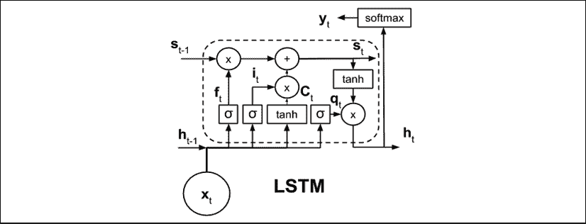

图 1.5.4：LSTM 图。为了清楚起见，未显示参数。

还有许多其他方法可以配置 RNN。 一种方法是制作双向 RNN 模型。 默认情况下，从当前输出仅受过去状态和当前输入影响的意义上讲，RNN 是单向的。

在双向 RNN 中，未来状态还可以通过允许信息向后流动来影响当前状态和过去状态。 根据收到的新信息，根据需要更新过去的输出。 可以通过调用包装器函数使 RNN 双向。 例如，双向 LSTM 的实现是`Bidirectional(LSTM())`。

对于所有类型的 RNN，增加单元数量也将增加容量。 但是，增加容量的另一种方法是堆叠 RNN 层。 尽管应注意，但作为一般经验法则，只有在需要时才应增加模型的容量。 容量过大可能会导致过拟合，结果可能导致训练时间延长和预测期间的表现降低。

# 6\. 总结

本章概述了三种深度学习模型（MLP，RNN，CNN），并介绍了 TensorFlow 2 `tf.keras`，这是一个用于快速开发，训练和测试适合于生产环境的深度学习模型的库。 还讨论了 Keras 的顺序 API。 在下一章中，将介绍函数式 API，这将使我们能够构建更复杂的模型，专门用于高级深度神经网络。

本章还回顾了深度学习的重要概念，例如优化，正则化和损失函数。 为了便于理解，这些概念是在 MNIST 数字分类的背景下提出的。

还讨论了使用人工神经网络（特别是 MLP，CNN 和 RNN）进行 MNIST 数字分类的不同解决方案，它们是深度神经网络的重要组成部分，并讨论了它们的表现指标。

了解了深度学习概念以及如何将 Keras 用作工具之后，我们现在可以分析高级深度学习模型。 在下一章讨论了函数式 API 之后，我们将继续执行流行的深度学习模型。 随后的章节将讨论选定的高级主题，例如自回归模型（自编码器，GAN，VAE），深度强化学习，对象检测和分段以及使用互信息的无监督学习。 随附的 Keras 代码实现将在理解这些主题方面发挥重要作用。

# 7\. 参考

1.  `Chollet, François. Keras (2015). https://github.com/keras-team/keras.`
2.  `LeCun, Yann, Corinna Cortes, and C. J. Burges. MNIST handwritten digit database. AT&T Labs [Online]. Available: http://yann.lecun.com/exdb/mnist2 (2010).`