# 二、深度神经网络

在本章中，我们将研究深度神经网络。 这些网络在更具挑战性的数据集，如 ImageNet，[CIFAR10](https://www.cs.toronto.edu/~kriz/learning-features-2009-TR.pdf) 和 CIFAR100。 为简洁起见，我们仅关注两个网络： **ResNet** [2] [4]和 **DenseNet** [5]。 尽管我们会更加详细，但重要的是花一点时间介绍这些网络。

ResNet 引入了残差学习的概念，使残障学习能够通过解决深度卷积网络中消失的梯度问题（在第 2 节中讨论）来构建非常深的网络。

DenseNet 允许每个卷积直接访问输入和较低层的特征映射，从而进一步改进了 ResNet。 通过利用**瓶颈**和**过渡层**，还可以在深层网络中将参数的数量保持为较低。

但是，为什么这些是两个模型，而不是其他？ 好吧，自从引入它们以来，已经有无数的模型，例如 **ResNeXt** [6]和 **WideResNet** [7]，它们受到这两个网络使用的技术的启发。 同样，在了解 ResNet 和 DenseNet 的情况下，我们将能够使用他们的设计指南来构建我们自己的模型。 通过使用迁移学习，这也将使我们能够将预训练的 ResNet 和 DenseNet 模型用于我们自己的目的，例如对象检测和分割。 仅出于这些原因，以及与 Keras 的兼容性，这两个模型非常适合探索和补充本书的高级深度学习范围。

尽管本章的重点是深度神经网络； 在本章中，我们将讨论 Keras 的重要功能，称为**函数式 API**。 该 API 充当在`tf.keras`中构建网络的替代方法，使我们能够构建更复杂的网络，而这是顺序模型 API 无法实现的。 我们之所以专注于此 API 的原因是，它将成为构建诸如本章重点介绍的两个之类的深度网络的非常有用的工具。 建议您先完成“第 1 章”，“Keras 的高级深度学习介绍”，然后再继续本章，因为我们将参考在本章中探讨的入门级代码和概念，我们将它们带入了更高的层次。

本章的目的是介绍：

*   Keras 中的函数式 API，以及探索运行该 API 的网络示例
*   `tf.keras`中的深度残差网络（ResNet 版本 1 和 2）实现
*   `tf.keras`中密集连接卷积网络（DenseNet）的实现
*   探索两种流行的深度学习模型，即 **ResNet** 和 **DenseNet**

让我们开始讨论函数式 API。

# 1\. 函数式 API

在我们首先在“第 1 章”，“Keras 高级深度学习入门”的顺序模型 API 中，一层堆叠在另一层之上。 通常，将通过其输入和输出层访问模型。 我们还了解到，如果我们发现自己想要在网络中间添加辅助输入，或者甚至想在最后一层之前提取辅助输出，则没有简单的机制。

这种模式也有缺点。 例如，它不支持类似图的模型或行为类似于 Python 函数的模型。 此外，在两个模型之间共享层也很困难。函数式 API 解决了这些局限性，这就是为什么它对于想要使用深度学习模型的任何人来说都是至关重要的工具的原因。

函数式 API 遵循以下两个概念：

*   层是接受张量作为参数的实例。 一层的输出是另一个张量。 为了构建模型，层实例是通过输入和输出张量彼此链接的对象。 这与在顺序模型中堆叠多个层有类似的最终结果。 但是，使用层实例会使模型更容易具有辅助或多个输入和输出，因为每个层的输入/输出将易于访问。
*   模型是一个或多个输入张量和输出张量之间的函数。 在模型输入和输出之间，张量是通过层输入和输出张量彼此链接的层实例。 因此，模型是一个或多个输入层和一个或多个输出层的函数。 该模型实例将数据从输入流到输出流的形式的计算图形式化。

在完成函数式 API 模型的构建之后，训练和评估将由顺序模型中使用的相同函数执行。 为了说明，在函数式 API 中，二维卷积层`Conv2D`带有 32 个过滤器，并且`x`作为层输入张量，`y`作为层输出张量可以写为：

```py
y = Conv2D(32)(x) 
```

我们也可以堆叠多层来构建模型。 例如，我们可以使用函数式 API 重写 MNIST `cnn-mnist-1.4.1.py`上的**卷积神经网络**（**CNN**），如下所示：

“列表 2.1.1”：`cnn-functional-2.1.1.py`

```py
import numpy as np
from tensorflow.keras.layers import Dense, Dropout, Input
from tensorflow.keras.layers import Conv2D, MaxPooling2D, Flatten
from tensorflow.keras.models import Model
from tensorflow.keras.datasets import mnist
from tensorflow.keras.utils import to_categorical 
```

```py
# load MNIST dataset
(x_train, y_train), (x_test, y_test) = mnist.load_data() 
```

```py
# from sparse label to categorical
num_labels = len(np.unique(y_train))
y_train = to_categorical(y_train)
y_test = to_categorical(y_test) 
```

```py
# reshape and normalize input images
image_size = x_train.shape[1]
x_train = np.reshape(x_train,[-1, image_size, image_size, 1])
x_test = np.reshape(x_test,[-1, image_size, image_size, 1])
x_train = x_train.astype('float32') / 255
x_test = x_test.astype('float32') / 255 
```

```py
# network parameters
input_shape = (image_size, image_size, 1)
batch_size = 128
kernel_size = 3
filters = 64
dropout = 0.3 
```

```py
# use functional API to build cnn layers
inputs = Input(shape=input_shape)
y = Conv2D(filters=filters,
           kernel_size=kernel_size,
           activation='relu')(inputs)
y = MaxPooling2D()(y)
y = Conv2D(filters=filters,
           kernel_size=kernel_size,
           activation='relu')(y)
y = MaxPooling2D()(y)
y = Conv2D(filters=filters,
           kernel_size=kernel_size,
           activation='relu')(y)
# image to vector before connecting to dense layer
y = Flatten()(y)
# dropout regularization
y = Dropout(dropout)(y)
outputs = Dense(num_labels, activation='softmax')(y) 
```

```py
# build the model by supplying inputs/outputs
model = Model(inputs=inputs, outputs=outputs)
# network model in text
model.summary()
# classifier loss, Adam optimizer, classifier accuracy
model.compile(loss='categorical_crossentropy',
              optimizer='adam',
              metrics=['accuracy']) 
```

```py
# train the model with input images and labels
model.fit(x_train,
          y_train,
          validation_data=(x_test, y_test),
          epochs=20,
          batch_size=batch_size) 
```

```py
# model accuracy on test dataset
score = model.evaluate(x_test,
                       y_test,
                       batch_size=batch_size,
                       verbose=0)
print("\nTest accuracy: %.1f%%" % (100.0 * score[1])) 
```

默认情况下，使用`pool_size=2`作为参数，因此`MaxPooling2D`已被删除。

在前面的清单中，每一层都是张量的函数。 每一层生成一个张量作为输出，该张量成为下一层的输入。 要创建此模型，我们可以调用`Model()`并提供`inputs`和`outputs`张量，或者提供张量列表。 其他一切保持不变。

类似于顺序模型，也可以使用`fit()`和`evaluate()`函数来训练和评估相同的列表。 实际上，`Sequential`类是`Model`类的子类。 我们需要记住，我们在`fit()`函数中插入了`validation_data`参数，以查看训练期间验证准确率的进度。 在 20 个周期内，准确率范围从 99.3% 到 99.4%。

## 创建两输入一输出模型

现在，我们将做一些令人兴奋的事情，创建一个具有两个输入和一个输出的高级模型。 在开始之前，重要的是要知道序列模型 API 是为仅构建 1 输入和 1 输出模型而设计的。

假设发明了一种用于 MNIST 数字分类的新模型，它称为 Y 网络，如图“图 2.1.1”所示。 Y 网络在左 CNN 分支和右 CNN 分支两次使用相同的输入。 网络使用`concatenate`层合并结果。 合并操作`concatenate`类似于沿连接轴堆叠两个相同形状的张量以形成一个张量。 例如，沿着最后一个轴连接两个形状为`(3, 3, 16)`的张量将导致一个形状为`(3, 3, 32)`的张量。

`concatenate`层之后的所有其他内容将与上一章的 CNN MNIST 分类器模型相同：`Flatten`，然后是`Dropout`，然后是`Dense`：

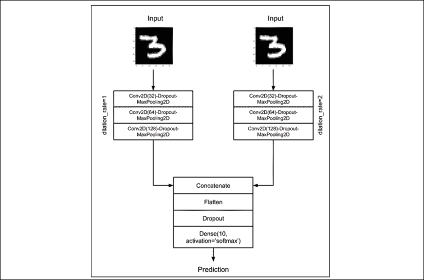

图 2.1.1：Y 网络接受两次相同的输入，但是在卷积网络的两个分支中处理输入。 分支的输出使用连接层进行合并。最后一层的预测将类似于上一章的 CNN MNIST 分类器模型。

为了提高“列表 2.1.1”中模型的表现，我们可以提出一些更改。 首先，Y 网络的分支将过滤器数量加倍，以补偿`MaxPooling2D()`之后特征映射尺寸的减半。 例如，如果第一个卷积的输出为`(28, 28, 32)`，则在最大池化之后，新形状为`(14, 14, 32)`。 下一个卷积的过滤器大小为 64，输出尺寸为`(14, 14, 64)`。

其次，尽管两个分支的核大小相同，但右分支使用 2 的扩展率。“图 2.1.2”显示了不同的扩展率对大小为 3 的核的影响。 这个想法是，通过使用扩张率增加核的有效接受域大小，CNN 将使正确的分支能够学习不同的特征映射。 使用大于 1 的扩张速率是一种计算有效的近似方法，可以增加接收场的大小。 这是近似值，因为该核实际上不是成熟的核。 这是有效的，因为我们使用与膨胀率等于 1 相同的操作数。

要了解接受域的概念，请注意，当核计算特征映射的每个点时，其输入是前一层特征映射中的补丁，该补丁也取决于其前一层特征映射。 如果我们继续将此依赖关系一直跟踪到输入图像，则核将依赖于称为接收场的图像补丁。

我们将使用选项`padding='same'`来确保使用扩张的 CNN 时不会出现负张量。 通过使用`padding='same'`，我们将使输入的尺寸与输出特征映射相同。 这是通过用零填充输入以确保输出的**大小**相同来实现的。

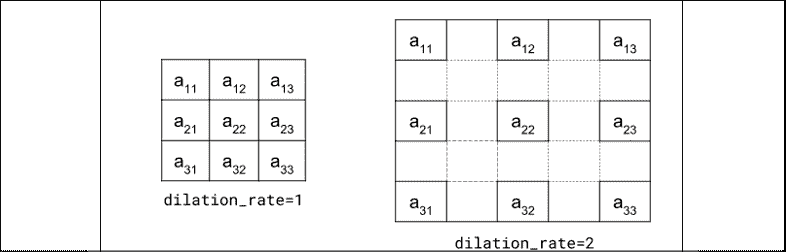

图 2.1.2：通过从 1 增加膨胀率，有效的核接受域大小也增加了

“列表 2.1.2”的`cnn-y-network-2.1.2.py`显示了使用函数式 API 的 Y 网络的实现。 两个分支由两个`for`循环创建。 两个分支期望输入形状相同。 两个`for`循环将创建两个`Conv2D-Dropout-MaxPooling2D`的三层栈。 虽然我们使用`concatenate`层组合了左右分支的输出，但我们还可以利用`tf.keras`的其他合并函数，例如`add`，`dot`和`multiply`。 合并函数的选择并非纯粹是任意的，而必须基于合理的模型设计决策。

在 Y 网络中，`concatenate`不会丢弃特征映射的任何部分。 取而代之的是，我们让`Dense`层确定如何处理连接的特征映射。

“列表 2.1.2”：`cnn-y-network-2.1.2.py`

```py
import numpy as np
from tensorflow.keras.layers import Dense, Dropout, Input
from tensorflow.keras.layers import Conv2D, MaxPooling2D
from tensorflow.keras.layers import Flatten, concatenate
from tensorflow.keras.models import Model
from tensorflow.keras.datasets import mnist
from tensorflow.keras.utils import to_categorical
from tensorflow.keras.utils import plot_model 
```

```py
# load MNIST dataset
(x_train, y_train), (x_test, y_test) = mnist.load_data() 
```

```py
# from sparse label to categorical
num_labels = len(np.unique(y_train))
y_train = to_categorical(y_train)
y_test = to_categorical(y_test) 
```

```py
# reshape and normalize input images
image_size = x_train.shape[1]
x_train = np.reshape(x_train,[-1, image_size, image_size, 1])
x_test = np.reshape(x_test,[-1, image_size, image_size, 1])
x_train = x_train.astype('float32') / 255
x_test = x_test.astype('float32') / 255 
```

```py
# network parameters
input_shape = (image_size, image_size, 1)
batch_size = 32
kernel_size = 3
dropout = 0.4
n_filters = 32 
```

```py
# left branch of Y network
left_inputs = Input(shape=input_shape)
x = left_inputs
filters = n_filters
# 3 layers of Conv2D-Dropout-MaxPooling2D
# number of filters doubles after each layer (32-64-128)
for i in range(3):
    x = Conv2D(filters=filters,
               kernel_size=kernel_size,
               padding='same',
               activation='relu')(x)
    x = Dropout(dropout)(x)
    x = MaxPooling2D()(x)
    filters *= 2 
```

```py
# right branch of Y network
right_inputs = Input(shape=input_shape)
y = right_inputs
filters = n_filters
# 3 layers of Conv2D-Dropout-MaxPooling2Do
# number of filters doubles after each layer (32-64-128)
for i in range(3):
    y = Conv2D(filters=filters,
               kernel_size=kernel_size,
               padding='same',
               activation='relu',
               dilation_rate=2)(y)
    y = Dropout(dropout)(y)
    y = MaxPooling2D()(y)
    filters *= 2 
```

```py
# merge left and right branches outputs
y = concatenate([x, y])
# feature maps to vector before connecting to Dense 
y = Flatten()(y)
y = Dropout(dropout)(y)
outputs = Dense(num_labels, activation='softmax')(y) 
```

```py
# build the model in functional API
model = Model([left_inputs, right_inputs], outputs)
# verify the model using graph
plot_model(model, to_file='cnn-y-network.png', show_shapes=True)
# verify the model using layer text description
model.summary() 
```

```py
# classifier loss, Adam optimizer, classifier accuracy
model.compile(loss='categorical_crossentropy',
              optimizer='adam',
              metrics=['accuracy']) 
```

```py
# train the model with input images and labels
model.fit([x_train, x_train],
          y_train,
          validation_data=([x_test, x_test], y_test),
          epochs=20,
          batch_size=batch_size) 
```

```py
# model accuracy on test dataset
score = model.evaluate([x_test, x_test],
                       y_test,
                       batch_size=batch_size,
                       verbose=0)
print("\nTest accuracy: %.1f%%" % (100.0 * score[1])) 
```

退后一步，我们可以注意到 Y 网络期望有两个输入用于训练和验证。 输入是相同的，因此提供了`[x_train, x_train]`。

在 20 个周期的过程中，Y 网络的准确率为 99.4% 至 99.5%。 与 3 叠 CNN 相比，这是一个微小的改进，CNN 的精度在 99.3% 到 99.4% 之间。 但是，这是以更高的复杂度和两倍以上的参数数量为代价的。

下图“图 2.1.3”显示了 Keras 理解并由`plot_model()`函数生成的 Y 网络的架构：

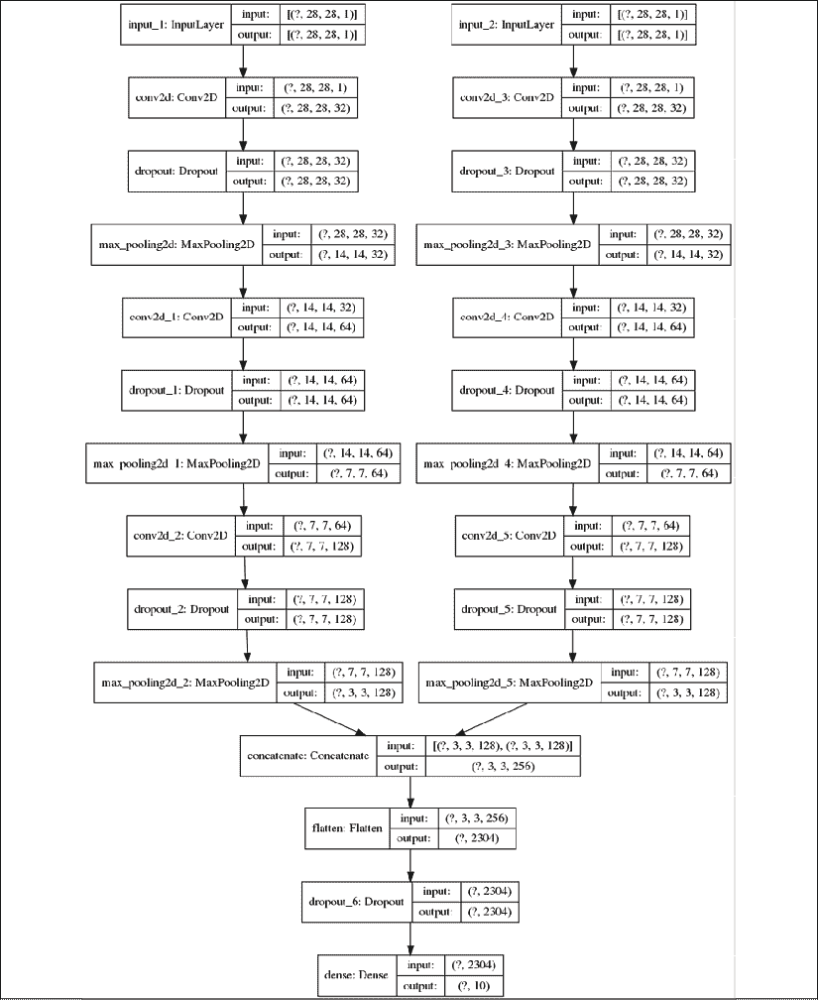

图 2.1.3：清单 2.1.2 中实现的 CNN Y 网络

总结我们对函数式 API 的了解。 我们应该花时间记住本章的重点是构建深度神经网络，特别是 ResNet 和 DenseNet。 因此，我们只讨论构建它们所需的函数式 API 材料，因为涵盖整个的 API 将超出本书的范围。 话虽如此，让我们继续讨论 ResNet。

有关函数式 API 的其他信息，请阅读[这里](https://keras.io/)。

# 2\. 深度残差网络（ResNet）

深度网络的一个主要优点是，它们具有从输入图和特征映射学习不同级别表示的能力。 在分类，分割，检测和许多其他计算机视觉问题中，学习不同的特征映射通常可以提高性能。

但是，您会发现训练深层网络并不容易，因为在反向传播过程中，梯度可能会随着浅层中的深度消失（或爆炸）。“图 2.2.1”说明了梯度消失的问题。 通过从输出层向所有先前层的反向传播来更新网络参数。 由于反向传播是基于链法则的，因此当梯度到达浅层时，梯度会逐渐减小。 这是由于小数的乘法，尤其是对于小损失函数和参数值。

乘法运算的数量将与网络深度成正比。 还要注意的是，如果梯度降低，则不会适当更新参数。

因此，网络将无法提高其表现。

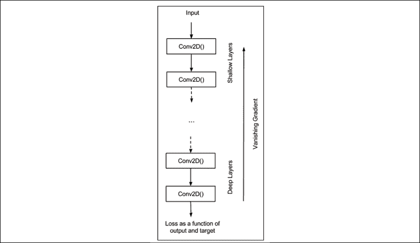

图 2.2.1：深层网络中的一个常见问题是，在反向传播过程中，梯度在到达浅层时会消失。

为了减轻深度网络中梯度的降级，ResNet 引入了深度残差学习框架的概念。 让我们分析一个块：深度网络的一小部分。

“图 2.2.2”显示了典型 CNN 块和 ResNet 残差块之间的比较。 ResNet 的想法是，为了防止梯度降级，我们将让信息通过快捷连接流到浅层。

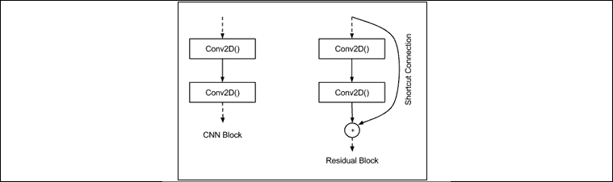

图 2.2.2：典型 CNN 中的块与 ResNet 中的块之间的比较。 为了防止反向传播期间梯度的降低，引入了快捷连接。

接下来，我们将在中讨论两个模块之间的差异，以了解更多详细信息。“图 2.2.3”显示了另一个常用的深层网络 **VGG** [3]和 ResNet 的 CNN 块的更多详细信息。 我们将层特征映射表示为`x`。 层`l`的特征映射为`x[l]`。 在 CNN 层中的操作是 **Conv2D 批量规范化（BN）- ReLU**。

假设我们以`H() = Conv2D-Batch Normalization(BN)-ReLU`的形式表示这组操作； 然后：

`x[l-1] = H(x[l-2])`（公式 2.2.1）

`x[l] = H(x[l-1])`（方程式 2.2.2）

换句话说，通过`H() =Conv2D-Batch Normalization(BN)-ReLU`将`l-2`层上的特征映射转换为`x[l-1]`。 应用相同的操作集将`x[l-1]`转换为`x[l]`。 换句话说，如果我们有一个 18 层的 VGG，则在将输入图像转换为第 18 个层特征映射之前，有 18 个`H()`操作。

一般而言，我们可以观察到`l`层输出特征映射仅直接受先前的特征映射影响。 同时，对于 ResNet：

`x[l-1] = H(x[l-2])`（公式 2.2.3）

`x[l] = ReLU(F(x[l-1]) + x[l-2])`（公式 2.2.4）

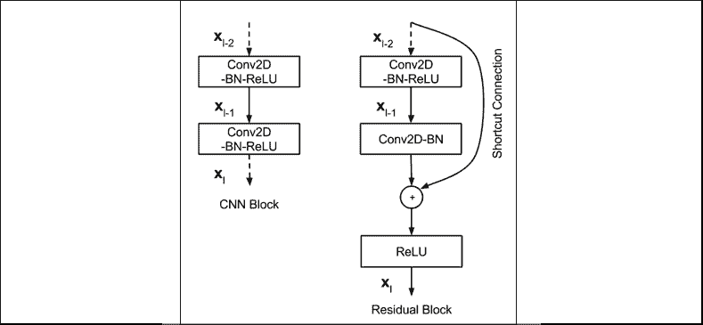

图 2.2.3：普通 CNN 块和残差块的详细层操作

`F(x[l-1])`由`Conv2D-BN`制成，这也被称为残差映射。 `+`符号是快捷方式连接和`F(x[l-1])`输出之间的张量元素加法。 快捷连接不会增加额外的参数，也不会增加计算复杂度。

可以通过`add()`合并函数在`tf.keras`中实现添加操作。 但是，`F(x[l-1])`和`x[l-2]`应该具有相同的尺寸。

如果尺寸不同，例如，当更改特征映射尺寸时，我们应该在`x[l-2]`上进行线性投影以匹配尺寸`F([l-1])`的含量。 在原始论文中，当特征映射的大小减半时，情况的线性投影是通过`Conv2D`和 1 `strides=2`核完成的。

在“第 1 章”，“Keras 高级深度学习”，我们讨论了`stride > 1`等效于在卷积期间跳过像素。 例如，如果`strides=2`，则在卷积过程中滑动核时，可以跳过其他每个像素。

前面的“公式 2.2.3”和“公式 2.2.4”都对 ResNet 残余块操作进行建模。 他们暗示，如果可以训练较深的层具有较少的误差，则没有理由为什么较浅的层应具有较高的误差。

知道 ResNet 的基本构建块后，我们就可以设计一个深度残差网络来进行图像分类。 但是，这一次，我们将处理更具挑战性的数据集。

在我们的示例中，我们将考虑 CIFAR10，它是原始论文所基于的数据集之一。 在此示例中，`tf.keras`提供了一个 API，可以方便地访问 CIFAR10 数据集，如下所示：

```py
from tensorflow.keras.datasets import cifar10
(x_train, y_train), (x_test, y_test) = cifar10.load_data() 
```

与 MNIST 一样，CIFAR10 数据集也有 10 个类别。 数据集是对应于飞机，汽车，鸟，猫，鹿，狗，青蛙，马，船和卡车的小型（`32×32`）RGB 真实世界图像的集合。 10 个类别中的每个类别。“图 2.2.4”显示了来自 CIFAR10 的示例图像。

在数据集中，有 50,000 个标记的训练图像和 10,000 个标记的测试图像用于验证：

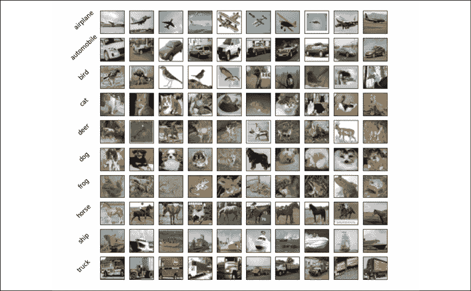

图 2.2.4：来自 CIFAR10 数据集的样本图像。 完整的数据集包含 50,000 张标签的训练图像和 10,000 张标签的测试图像以进行验证。

对于 CIFAR10 数据，可以使用“表 2.2.1”中所示的不同网络架构来构建 ResNet。“表 2.2.1”表示我们有三组残差块。 每组具有对应于`n`个残余块的`2n`层。`32×32`的额外层是输入图像的第一层。

| **层** | **输出大小** | **过滤器尺寸** | **操作** |
| --- | --- | --- | --- |
| 卷积 | `32 × 32` | 16 | `3 x 3 Conv2D` |
| 残差块（1） | `32 × 32` |  | 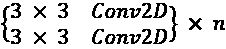 |
| 过渡层（1） | `32 × 32` |  | `{1 x 1 Conv2D, stride = 2}` |
| | `16 × 16` |  |
| 残差块（2） | `16 × 16` | 32 | 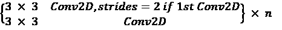 |
| 过渡层（2） | `16 × 16` |  |  |  | `{1 x 1 Conv2D, stride = 2}` |
| | `8 × 8` |  |
| 残差块（3） | `8 × 8` | 64 | 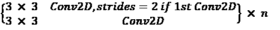 |
| 平均池化 | `1 × 1` |  |  | `8 x 8 AveragePooling2D` |

表 2.2.1：ResNet 网络架构配置

核大小为 3，不同大小的两个特征映射之间的过渡除外，该过渡实现了线性映射。 例如，核大小为 1 的`Conv2D`和`strides=2`。 为了与 DenseNet 保持一致，当我们连接两个大小不同的剩余块时，我们将使用项`Transition`层。

ResNet 使用`kernel_initializer='he_normal'`以便在进行反向传播时帮助收敛[1]。 最后一层由`AveragePooling2D-Flatten-Dense`制成。 在这一点上值得注意的是 ResNet 不使用丢弃。 似乎`add` 合并操作和`1 x 1`卷积具有自正则化效果。“图 2.2.5”显示了 CIFAR10 数据集的 ResNet 模型架构，如“表 2.2.1”中所述。

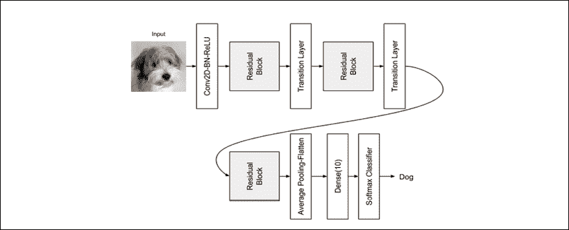

图 2.2.5：用于 CIFAR10 数据集分类的 ResNet 的模型架构

以下代码段显示了`tf.keras`中的部分 ResNet 实现。 该代码已添加到 Keras GitHub 存储库中。 从“表 2.2.2”（稍后显示）中，我们还可以看到，通过修改`n`的值，我们可以增加网络的深度。

例如，对于`n = 18`，我们已经拥有 ResNet110，这是一个具有 110 层的深度网络。 要构建 ResNet20，我们使用`n = 3`：

```py
n = 3 
```

```py
# model version
# orig paper: version = 1 (ResNet v1),
# improved ResNet: version = 2 (ResNet v2)
version = 1 
```

```py
# computed depth from supplied model parameter n
if version == 1:
    depth = n * 6 + 2
elif version == 2:
    depth = n * 9 + 2 
```

```py
 if version == 2:
    model = resnet_v2(input_shape=input_shape, depth=depth)
else:
    model = resnet_v1(input_shape=input_shape, depth=depth) 
```

`resnet_v1()`方法是 ResNet 的模型构建器。 它使用工具函数`resnet_layer(),`来帮助构建`Conv2D-BN-ReLU`的栈。

它将称为版本 1，正如我们将在下一节中看到的那样，提出了一种改进的 ResNet，该版本称为 ResNet 版本 2 或 v2。 通过 ResNet，ResNet v2 改进了残差块设计，从而提高了表现。

以下清单显示了`resnet-cifar10-2.2.1.py`的部分代码，它是 ResNet v1 的`tf.keras`模型实现。

“列表 2.2.1”：`resnet-cifar10-2.2.1.py`

```py
def resnet_v1(input_shape, depth, num_classes=10):
    """ResNet Version 1 Model builder [a] 
```

```py
 Stacks of 2 x (3 x 3) Conv2D-BN-ReLU
    Last ReLU is after the shortcut connection.
    At the beginning of each stage, the feature map size is halved
    (downsampled) by a convolutional layer with strides=2, while 
    the number of filters is doubled. Within each stage, 
    the layers have the same number filters and the
    same number of filters.
    Features maps sizes:
    stage 0: 32x32, 16
    stage 1: 16x16, 32
    stage 2:  8x8,  64
    The Number of parameters is approx the same as Table 6 of [a]:
    ResNet20 0.27M
    ResNet32 0.46M
    ResNet44 0.66M
    ResNet56 0.85M
    ResNet110 1.7M 
```

```py
 Arguments:
        input_shape (tensor): shape of input image tensor
        depth (int): number of core convolutional layers
        num_classes (int): number of classes (CIFAR10 has 10) 
```

```py
 Returns:
        model (Model): Keras model instance
    """
    if (depth - 2) % 6 != 0:
        raise ValueError('depth should be 6n+2 (eg 20, 32, in [a])')
    # Start model definition.
    num_filters = 16
    num_res_blocks = int((depth - 2) / 6) 
```

```py
 inputs = Input(shape=input_shape)
    x = resnet_layer(inputs=inputs)
    # instantiate the stack of residual units
    for stack in range(3):
        for res_block in range(num_res_blocks):
            strides = 1
            # first layer but not first stack
            if stack > 0 and res_block == 0:
                strides = 2  # downsample
            y = resnet_layer(inputs=x,
                             num_filters=num_filters,
                             strides=strides)
            y = resnet_layer(inputs=y,
                             num_filters=num_filters,
                             activation=None)
            # first layer but not first stack
            if stack > 0 and res_block == 0:
                # linear projection residual shortcut
                # connection to match changed dims
                x = resnet_layer(inputs=x,
                                 num_filters=num_filters,
                                 kernel_size=1,
                                 strides=strides,
                                 activation=None,
                                 batch_normalization=False)
            x = add([x, y])
            x = Activation('relu')(x)
        num_filters *= 2 
```

```py
 # add classifier on top.
    # v1 does not use BN after last shortcut connection-ReLU
    x = AveragePooling2D(pool_size=8)(x)
    y = Flatten()(x)
    outputs = Dense(num_classes,
                    activation='softmax',
                    kernel_initializer='he_normal')(y) 
```

```py
 # instantiate model.
    model = Model(inputs=inputs, outputs=outputs)
    return model 
```

ResNet 在`n`的各种值上的表现显示在“表 2.2.2”中。

| **层** | `n` | **CIFAR10 的准确率百分比（原始论文）** | **CIFAR10 的准确率百分比（本书）** |
| --- | --- | --- | --- |
| ResNet20 | 3 | 91.25 | 92.16 |
| ResNet32 | 5 | 92.49 | 92.46 |
| ResNet44 | 7 | 92.83 | 92.50 |
| ResNet56 | 9 | 93.03 | 92.71 |
| ResNet110 | 18 | 93.57 | 92.65 |

表 2.2.2：针对不同的 n 值，使用 CIFAR10 验证的 ResNet 架构

与 ResNet 的原始实现有一些细微的差异。 特别是，我们不使用 SGD，而是使用 Adam。 这是因为 ResNet 更容易与 Adam 融合。 我们还将使用学习率调度器`lr_schedule()`，以便将`lr`的减少量从默认的`1e-3`缩短为 80、120、160 和 180 个周期。 在训练期间的每个周期之后，都会将`lr_schedule()`函数作为回调变量的一部分进行调用。

每当验证准确率方面取得进展时，另一个回调将保存检查点。 训练深层网络时，保存模型或权重检查点是一个好习惯。 这是因为训练深度网络需要大量时间。

当您想使用网络时，您只需要做的就是重新加载检查点，然后恢复经过训练的模型。 这可以通过调用`tf.keras load_model()`来完成。 包含`lr_reducer()`函数。 如果指标在排定的减少之前已稳定在上，则如果在`patience = 5`周期之后验证损失没有改善，则此回调将以参数中提供的某个因子来降低学习率。

调用`model.fit()`方法时，会提供**回调**变量。 与原始论文相似，`tf.keras`实现使用数据扩充`ImageDataGenerator()`来提供其他训练数据作为正则化方案的一部分。 随着训练数据数量的增加，概括性将会提高。

例如，简单的数据扩充就是翻转一条狗的照片，如图“图 2.2.6”（`horizontal_flip = True`）所示。 如果它是狗的图像，则翻转的图像仍然是狗的图像。 您还可以执行其他变换，例如缩放，旋转，变白等等，并且标签将保持不变：

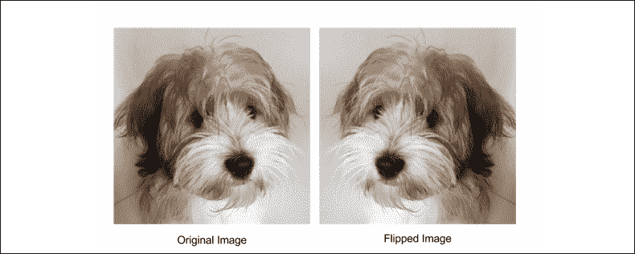

图 2.2.6：一个简单的数据扩充就是翻转原始图像

[完整的代码可在 GitHub 上获得](https://github.com/PacktPublishing/Advanced-Deep-Learning-with-Keras)。

准确复制原始论文的实现通常很困难。 在本书中，我们使用了不同的优化器和数据扩充。 这可能会导致本书中所实现的`tf.keras` ResNet 和原始模型中的表现略有不同。

在 **ResNet** [4]的第二篇论文发布之后，本节中介绍的原始模型为，称为 ResNet v1。 改进的 ResNet 通常称为 ResNet v2，我们将在下一部分讨论。

# 3\. ResNet v2

ResNet v2 的改进主要体现在残块中各层的排列中，如图“图 2.3.1”所示。

ResNet v2 的主要变化是：

*   使用`1 x 1 – 3 x 3 – 1 × 1`的栈`BN-ReLU-Conv2D`
*   批量标准化和 ReLU 激活先于二维卷积

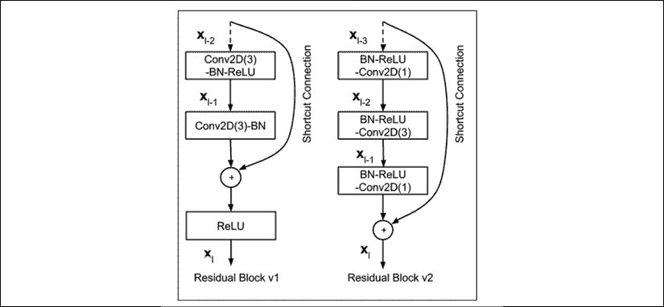

图 2.3.1：ResNet v1 和 ResNet v2 之间的剩余块比较

ResNet v2 也以与`resnet-cifar10-2.2.1.py`相同的代码实现，如“列表 2.2.1”所示：

“列表 2.2.1”：`resnet-cifar10-2.2.1.py`

```py
def resnet_v2(input_shape, depth, num_classes=10):
    """ResNet Version 2 Model builder [b] 
```

```py
 Stacks of (1 x 1)-(3 x 3)-(1 x 1) BN-ReLU-Conv2D or 
    also known as bottleneck layer.
    First shortcut connection per layer is 1 x 1 Conv2D.
    Second and onwards shortcut connection is identity.
    At the beginning of each stage, 
    the feature map size is halved (downsampled)
    by a convolutional layer with strides=2, 
    while the number of filter maps is
    doubled. Within each stage, the layers have 
    the same number filters and the same filter map sizes.
    Features maps sizes:
    conv1  : 32x32,  16
    stage 0: 32x32,  64
    stage 1: 16x16, 128
    stage 2:  8x8,  256 
```

```py
 Arguments:
        input_shape (tensor): shape of input image tensor
        depth (int): number of core convolutional layers
        num_classes (int): number of classes (CIFAR10 has 10) 
```

```py
 Returns:
        model (Model): Keras model instance
    """
    if (depth - 2) % 9 != 0:
        raise ValueError('depth should be 9n+2 (eg 110 in [b])')
    # start model definition.
    num_filters_in = 16
    num_res_blocks = int((depth - 2) / 9) 
```

```py
 inputs = Input(shape=input_shape)
    # v2 performs Conv2D with BN-ReLU
    # on input before splitting into 2 paths
    x = resnet_layer(inputs=inputs,
                     num_filters=num_filters_in,
                     conv_first=True) 
```

```py
 # instantiate the stack of residual units
    for stage in range(3):
        for res_block in range(num_res_blocks):
            activation = 'relu'
            batch_normalization = True
            strides = 1
            if stage == 0:
                num_filters_out = num_filters_in * 4
                # first layer and first stage
                if res_block == 0:
                    activation = None
                    batch_normalization = False
            else:
                num_filters_out = num_filters_in * 2
                # first layer but not first stage
                if res_block == 0:
                    # downsample
                    strides = 2 
```

```py
 # bottleneck residual unit
            y = resnet_layer(inputs=x,
                             num_filters=num_filters_in,
                             kernel_size=1,
                             strides=strides,
                             activation=activation,
                             batch_normalization=batch_normalization,
                             conv_first=False)
            y = resnet_layer(inputs=y,
                             num_filters=num_filters_in,
                             conv_first=False)
            y = resnet_layer(inputs=y,
                             num_filters=num_filters_out,
                             kernel_size=1,
                             conv_first=False)
            if res_block == 0:
                # linear projection residual shortcut connection
                # to match changed dims
                x = resnet_layer(inputs=x,
                                 num_filters=num_filters_out,
                                 kernel_size=1,
                                 strides=strides,
                                 activation=None,
                                 batch_normalization=False)
            x = add([x, y]) 
```

```py
 num_filters_in = num_filters_out 
```

```py
 # add classifier on top.
    # v2 has BN-ReLU before Pooling
    x = BatchNormalization()(x)
    x = Activation('relu')(x)
    x = AveragePooling2D(pool_size=8)(x)
    y = Flatten()(x)
    outputs = Dense(num_classes,
                    activation='softmax',
                    kernel_initializer='he_normal')(y) 
```

```py
 # instantiate model.
    model = Model(inputs=inputs, outputs=outputs)
    return model 
```

下面的代码显示了 ResNet v2 的模型构建器。 例如，要构建 ResNet110 v2，我们将使用`n = 12`和`version = 2`：

```py
n = 12
```

```py
# model version
# orig paper: version = 1 (ResNet v1), 
# improved ResNet: version = 2 (ResNet v2)
version = 2
```

```py
# computed depth from supplied model parameter n
if version == 1:
    depth = n * 6 + 2
elif version == 2:
    depth = n * 9 + 2 
```

```py
 if version == 2:
    model = resnet_v2(input_shape=input_shape, depth=depth)
else:
    model = resnet_v1(input_shape=input_shape, depth=depth) 
```

ResNet v2 的准确率显示在下面的“表 2.3.1”中：

| **层** | `n` | **CIFAR10 的准确率百分比（原始论文）** | **CIFAR10 的准确率百分比（本书）** |
| --- | --- | --- | --- |
| ResNet56 | 9 | 不适用 | 93.01 |
| ResNet110 | 18 | 93.63 | 93.15 |

表 2.3.1：在 CIFAR10 数据集上验证的 ResNet v2 架构

在 Keras 应用包中，已实现某些 ResNet v1 和 v2 模型（例如：50、101、152）。 这些是替代的实现方式，其中预训练的权重不清楚，可以轻松地重新用于迁移学习。 本书中使用的模型在层数方面提供了灵活性。

我们已经完成了对最常用的深度神经网络之一 ResNet v1 和 v2 的讨论。 在以下部分中，将介绍另一种流行的深度神经网络架构 DenseNet。

# 4\. 紧密连接的卷积网络（DenseNet）

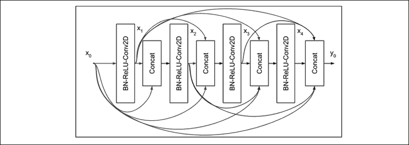

图 2.4.1：DenseNet 中的一个 4 层`Dense`块，每层的输入均由所有先前的特征映射组成。

DenseNet 使用另一种方法攻击梯度消失的问题。 代替使用快捷方式连接，所有先前的特征映射都将成为下一层的输入。 上图显示了一个`Dense`块中密集互连的示例。

为简单起见，在此图中，我们仅显示四层。 注意，层`l`的输入是所有先前特征映射的连接。 如果用操作`H`表示`BN-ReLU-Conv2D`（`x`），则层`l`的输出为：

`x[l] = H(x[0], x[1], x[2], x[l-1])`（公式 2.4.1）

`Conv2D`使用大小为 3 的核。每层生成的特征映射的数量称为增长率`k`。 通常，在 Huang 等人的论文“密集连接卷积网络”中，也使用`k = 12`，但是`k = 24` [5]。 因此，如果特征映射`x[0]`的数量为`k[0]`，则“图 2.4.1”中，4 层`Dense`块的末尾的特征映射总数为`4 x k + k[0]`。

DenseNet 建议在`Dense`块之前加上`BN-ReLU-Conv2D`，以及许多是增长率两倍的特征映射`k[0]`= 2 x`k`。 在`Dense`块的末尾，特征映射的总数将为`4 x 12 + 2 x 12 = 72`。

在输出层，DenseNet 建议我们在具有`softmax`层的`Dense()`之前执行平均池化。 如果未使用数据扩充，则必须在`Dense`块`Conv2D`之后跟随一个丢弃层。

随着网络的深入，将出现两个新问题。 首先，由于每一层都贡献了`k`特征映射，因此`l`层的输入数量为`(l – 1) x k + k[0]`。 特征映射可以在深层中快速增长，从而减慢了计算速度。 例如，对于 101 层网络，对于`k = 12`，这将是`1200 + 24 = 1224`。

其次，类似于 ResNet，随着网络的不断深入，特征映射的大小将减小，从而增加核的接收域大小。 如果 DenseNet 在合并操作中使用连接，则必须协调大小上的差异。

为了防止特征映射的数量增加到计算效率低的程度，DenseNet 引入了`Bottleneck`层，如图“图 2.4.2”所示。 这个想法是，在每次连接之后，现在应用`1 x 1`卷积，其过滤器大小等于`4k`。 这种降维技术阻止了`Conv2D(3)`处理的特征映射的数量快速增加。

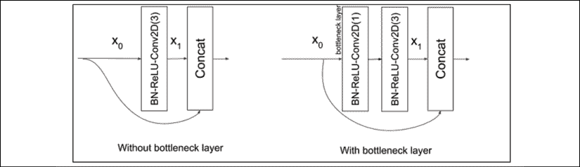

图 2.4.2：DenseNet 的 Dense 块中的一层，带有和不带有瓶颈层 BN-ReLU-Conv2D（1）。 为了清楚起见，我们将核大小作为 Conv2D 的参数。

然后`Bottleneck`层将 DenseNet 层修改为`BN-ReLU-Conv2D(1)-BN- ReLU-Conv2D(3)`，而不仅仅是`BN-ReLU-Conv2D(3)`。 为了清楚起见，我们将核大小作为`Conv2D`的参数。 在瓶颈层，每个`Conv2D(3)`仅处理 4 个`k`特征映射，而不是`(l – 1) x k + k[0]`的，对于层`l`。 例如，对于 101 层网络，最后一个`Conv2D(3)`的输入仍然是`k = 12`而不是先前计算的 1224 的 48 个特征映射。

为了解决特征映射大小不匹配的问题，DenseNet 将深度网络划分为多个 Dense 块，这些块通过过渡层连接在一起，如图“图 2.4.3”所示。 在每个`Dense`块中，特征映射的大小（即宽度和高度）将保持不变。

过渡层的作用是在两个`Dense`块之间从一个特征映射大小过渡到较小的特征映射大小。 尺寸通常减少一半。 这是通过平均池化层完成的。 例如，默认值为`pool_size=2`的`AveragePooling2D`会将大小从`(64, 64, 256)`减小为`(32, 32, 256)`。 过渡层的输入是前一个`Dense`块中最后一个连接层的输出。

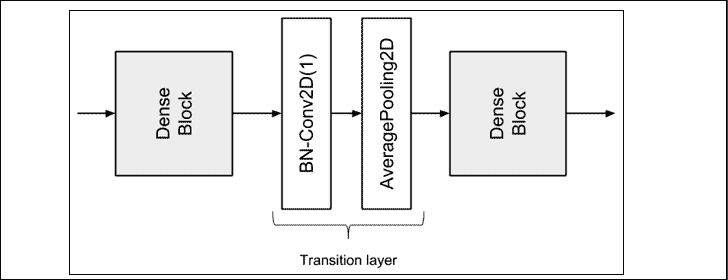

图 2.4.3：两个密集块之间的过渡层

但是，在将特征映射传递到平均池之前，使用`Conv2D(1)`将其数量减少某个压缩因子`0 < θ < 1`。DenseNet 在实验中使用`θ = 0.5`。 例如，如果先前`Dense`块的最后连接的输出是`(64, 64, 512)`，则在`Conv2D(1)`之后，特征映射的新尺寸将是`(64, 64, 256)`。 当压缩和降维放在一起时，过渡层由`BN-Conv2D(1)-AveragePooling2D`层组成。 实际上，批量归一化在卷积层之前。

现在，我们已经涵盖了 DenseNet 的重要概念。 接下来，我们将为`tf.keras`中的 CIFAR10 数据集构建并验证 DenseNet-BC。

## 为 CIFAR10 构建 100 层 DenseNet-BC

现在，我们将要为 CIFAR10 数据集构建一个具有 100 层的 **DenseNet-BC**（**瓶颈压缩**）， 我们在上面讨论过。

“表 2.4.1”显示了模型配置，而“图 2.4.4”显示了模型架构。 清单为我们展示了具有 100 层的 DenseNet-BC 的部分 Keras 实现。 我们需要注意的是，我们使用`RMSprop`，因为在使用 DenseNet 时，它的收敛性优于 SGD 或 Adam。

| **层** | **输出大小** | **DenseNet-100 BC** |
| --- | --- | --- |
| 卷积 | `32 x 32` | `3 x 3 Conv2D` |
| 密集块（1） | `32 x 32` | 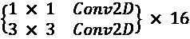 |
| 过渡层（1） | `32 x 32` | 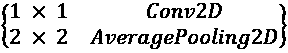 |
| `16 x 16` |
| 密集块（2） | `16 x 16` | 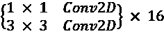 |
| 过渡层（2） | `16 x 16` |  |
| `8 x 8` |
| 密集块（3） | `8 x 8` |  |
| 平均池化 | `1 x 1` | `8 x 8 AveragePooling2D` |
| 分类层 |  | `Flatten-Dense(10)-softmax` |

表 2.4.1：100 层的 DenseNet-BC 用于 CIFAR10 分类

将从配置移至架构：

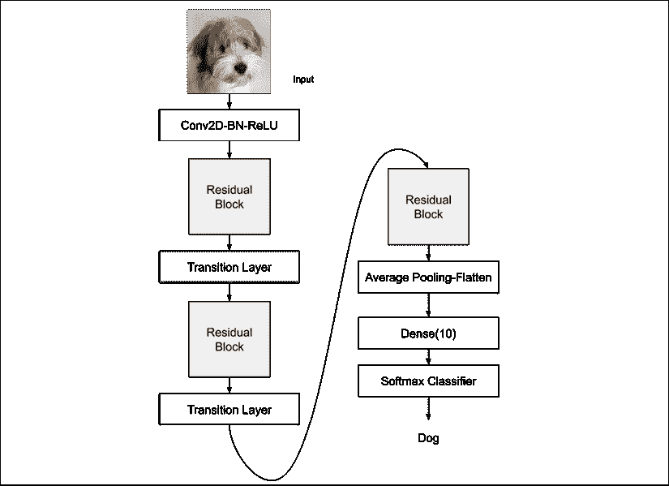

图 2.4.4：用于 CIFAR10 分类的 100 个层的 DenseNet-BC 模型架构

下面“列表 2.4.1”是具有 100 层的 DenseNet-BC 的部分 Keras 实现，如“表 2.4.1”所示。

“列表 2.4.1”：`densenet-cifar10-2.4.1.py`

```py
# start model definition
# densenet CNNs (composite function) are made of BN-ReLU-Conv2D
inputs = Input(shape=input_shape)
x = BatchNormalization()(inputs)
x = Activation('relu')(x)
x = Conv2D(num_filters_bef_dense_block,
           kernel_size=3,
           padding='same',
           kernel_initializer='he_normal')(x)
x = concatenate([inputs, x]) 
```

```py
# stack of dense blocks bridged by transition layers
for i in range(num_dense_blocks):
    # a dense block is a stack of bottleneck layers
    for j in range(num_bottleneck_layers):
        y = BatchNormalization()(x)
        y = Activation('relu')(y)
        y = Conv2D(4 * growth_rate,
                   kernel_size=1,
                   padding='same',
                   kernel_initializer='he_normal')(y)
        if not data_augmentation:
            y = Dropout(0.2)(y)
        y = BatchNormalization()(y)
        y = Activation('relu')(y)
        y = Conv2D(growth_rate,
                   kernel_size=3,
                   padding='same',
                   kernel_initializer='he_normal')(y)
        if not data_augmentation:
            y = Dropout(0.2)(y)
        x = concatenate([x, y]) 
```

```py
 # no transition layer after the last dense block
    if i == num_dense_blocks - 1:
        continue
    # transition layer compresses num of feature maps and # reduces the size by 2
    num_filters_bef_dense_block += num_bottleneck_layers * growth_rate
    num_filters_bef_dense_block = int(num_filters_bef_dense_block * compression_factor)
    y = BatchNormalization()(x)
    y = Conv2D(num_filters_bef_dense_block,
               kernel_size=1,
               padding='same',
               kernel_initializer='he_normal')(y)
    if not data_augmentation:
        y = Dropout(0.2)(y)
    x = AveragePooling2D()(y) 
```

```py
# add classifier on top
# after average pooling, size of feature map is 1 x 1
x = AveragePooling2D(pool_size=8)(x)
y = Flatten()(x)
outputs = Dense(num_classes,
                kernel_initializer='he_normal',
                activation='softmax')(y)
# instantiate and compile model
# orig paper uses SGD but RMSprop works better for DenseNet
model = Model(inputs=inputs, outputs=outputs)
model.compile(loss='categorical_crossentropy',
              optimizer=RMSprop(1e-3),
              metrics=['accuracy'])
model.summary() 
```

训练 DenseNet 的`tf.keras`实现 200 个周期，可以达到 93.74% 的准确率，而本文中报道的是 95.49%。 使用数据扩充。 我们在 ResNet v1 / v2 中为 DenseNet 使用了相同的回调函数。

对于更深的层，必须使用 Python 代码上的表来更改`growth_rate`和`depth`变量。 但是，如本文所述，以深度 190 或 250 训练网络将需要大量时间。 为了给我们一个训练时间的想法，每个周期在 1060Ti GPU 上运行大约一个小时。 与 ResNet 相似，Keras 应用包具有针对 DenseNet 121 及更高版本的预训练模型。

DenseNet 完成了我们对深度神经网络的讨论。 与 ResNet 一起，这两个网络已成为许多下游任务中不可或缺的特征提取器网络。

# 5\. 总结

在本章中，我们介绍了函数式 API 作为使用`tf.keras`构建复杂的深度神经网络模型的高级方法。 我们还演示了如何使用函数式 API 来构建多输入单输出 Y 网络。 与单分支 CNN 网络相比，该网络具有更高的准确率。 在本书的其余部分中，我们将发现在构建更复杂和更高级的模型时必不可少的函数式 API。 例如，在下一章中，函数式 API 将使我们能够构建模块化编码器，解码器和自编码器。

我们还花费了大量时间探索两个重要的深度网络 ResNet 和 DenseNet。 这两个网络不仅用于分类，而且还用于其他领域，例如分段，检测，跟踪，生成和视觉语义理解。 在“第 11 章”，“对象检测”和“第 12 章”，“语义分割”中，我们将使用 ResNet 进行对象检测和分割。 我们需要记住，与仅仅遵循原始实现相比，更仔细地了解 ResNet 和 DenseNet 中的模型设计决策至关重要。 这样，我们就可以将 ResNet 和 DenseNet 的关键概念用于我们的目的。

# 6\. 参考

1.  `Kaiming He et al. Delving Deep into Rectifiers: Surpassing Human-Level Performance on ImageNet Classification. Proceedings of the IEEE international conference on computer vision, 2015 (https://www.cv-foundation.org/openaccess/content_iccv_2015/papers/He_Delving_Deep_into_ICCV_2015_paper.pdfspm=5176.100239.blogcont55892.28.pm8zm1&file=He_Delving_Deep_into_ICCV_2015_paper.pdf).`
1.  `Kaiming He et al. Deep Residual Learning for Image Recognition. Proceedings of the IEEE conference on computer vision and pattern recognition, 2016a (http://openaccess.thecvf.com/content_cvpr_2016/papers/He_Deep_Residual_Learning_CVPR_2016_paper.pdf).`
1.  `Karen Simonyan and Andrew Zisserman. Very Deep Convolutional Networks for Large-Scale Image Recognition. ICLR, 2015 (https://arxiv.org/pdf/1409.1556/).`
1.  `Kaiming He et al. Identity Mappings in Deep Residual Networks. European Conference on Computer Vision. Springer International Publishing, 2016b (https://arxiv.org/pdf/1603.05027.pdf).`
1.  `Gao Huang et al. Densely Connected Convolutional Networks. Proceedings of the IEEE conference on computer vision and pattern recognition, 2017 (http://openaccess.thecvf.com/content_cvpr_2017/papers/Huang_Densely_Connected_Convolutional_CVPR_2017_paper.pdf).`
1.  `Saining Xie et al. Aggregated Residual Transformations for Deep Neural Networks. Computer Vision and Pattern Recognition (CVPR), 2017 IEEE Conference on. IEEE, 2017 (http://openaccess.thecvf.com/content_cvpr_2017/papers/Xie_Aggregated_Residual_Transformations_CVPR_2017_paper.pdf).`
1.  `Zagoruyko, Sergey, and Nikos Komodakis. "Wide residual networks." arXiv preprint arXiv:1605.07146 (2016).`