# 五、改进的 GAN

自 2014 年引入**生成对抗网络**（**GAN**）以来，其流行度迅速提高。 GAN 已被证明是有用的生成模型，可以合成看起来真实的新数据。 深度学习中的许多研究论文都遵循提出的措施来解决原始 GAN 的困难和局限性。

正如我们在前几章中讨论的那样，众所周知，GAN 很难训练，并且易于崩溃。 模式损失是一种情况，即使损失函数已经被优化，但生成器仍会产生看起来相同的输出。 在 MNIST 数字的情况下，模式折叠时，生成器可能只产生数字 4 和 9，因为看起来很相似。 **Wasserstein GAN**（**WGAN**）[2]解决了这些问题，认为只需替换基于 **Wasserstein** 的 GAN 损失函数就可以稳定的训练和避免模式崩溃，也称为**陆地移动距离**（**EMD**）。

但是，稳定性问题并不是 GAN 的唯一问题。 也越来越需要来提高所生成图像的感知质量。 **最小二乘 GAN**（**LSGAN**）[3]建议同时解决这两个问题。 基本前提是，在训练过程中，Sigmoid 交叉熵损失会导致梯度消失。 这导致较差的图像质量。 最小二乘损失不会导致梯度消失。 与原始 GAN 生成的图像相比，生成的生成图像具有更高的感知质量。

在上一章中，CGAN 介绍了一种调节生成器输出的方法。 例如，如果要获取数字 8，则可以在生成器的输入中包含条件标签。 受 CGAN 的启发，**辅助分类器 GAN**（**ACGAN**）[4]提出了一种改进的条件算法，可产生更好的感知质量和输出多样性。

总之，本章的目的是介绍：

*   WGAN 的理论描述
*   对 LSGAN 原理的理解
*   对 ACGAN 原理的理解
*   改进的 GAN 的`tf.keras`实现 – WGAN，LSGAN 和 ACGAN

让我们从讨论 WGAN 开始。

# 1\. Wasserstein GAN

如前所述，众所周知，GAN 很难训练。 判别器和生成器这两个网络的相反目标很容易导致训练不稳定。 判别器尝试从真实数据中正确分类伪造数据。 同时，生成器将尽最大努力欺骗判别器。 如果判别器的学习速度比生成器快，则生成器参数将无法优化。 另一方面，如果判别器学习较慢，则梯度可能会在到达生成器之前消失。 在最坏的情况下，如果判别器无法收敛，则生成器将无法获得任何有用的反馈。

WGAN 认为 GAN 固有的不稳定性是由于它的损失函数引起的，该函数基于 **Jensen-Shannon**（**JS**）距离。 在 GAN 中，生成器的目的是学习如何将一种源分布（例如噪声）从转换为估计的目标分布（例如 MNIST 数字）。 使用 GAN 的原始公式，损失函数实际上是使目标分布与其估计值之间的距离最小。 问题是，对于某些分布对，没有平滑的路径可以最小化此 JS 距离。 因此，训练将无法收敛。

在以下部分中，我们将研究三个距离函数，并分析什么可以替代更适合 GAN 优化的 JS 距离函数。

## 距离函数

可以通过检查其损失函数来了解训练 GAN 的稳定性。 为了更好地理解 GAN 损失函数，我们将回顾两个概率分布之间的公共距离或散度函数。

我们关注的是用于真实数据分配的`p_data`与用于生成器数据分配的`p_g`之间的距离。 GAN 的目标是制造`p_g -> p_data`。“表 5.1.1”显示了散度函数。

在大多数个最大似然任务中，我们将使用 **Kullback-Leibler**（**KL**）散度，或`D[KL]`损失函数可以衡量我们的神经网络模型预测与真实分布函数之间的距离。 如“公式 5.1.1”所示，由于`D[KL](p_data || p_g) ≠ D[KL](p_g || p_data)`，所以`D[KL]`不对称。

**JS** 或`D[JS]`是基于`D[KL]`的差异。 但是，与`D[KL]`不同，`D[JS]`是对称的并且是有限的。 在本节中，我们将演示优化 GAN 损失函数等同于优化`D[JS]`：

| **散度** | **表达式** |
| --- | --- |
| Kullback-Leibler（KL）“公式 5.1.1” | 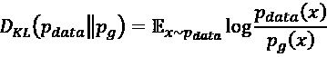 |
| | 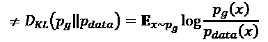 |
| *詹森·香农（JS）“公式 5.1.2” | 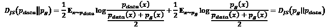 |
| 陆地移动距离（EMD）或 Wasserstein 1 “公式 5.1.3” | 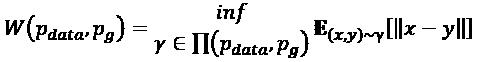 |
| | 其中`Π(p_data, p_g)`是所有联合分布`γ(x, y)`的集合，其边际为`p_data`和`p_g`。 |

表 5.1.1：两个概率分布函数`p_data`和`p_g`之间的散度函数

EMD 背后的想法是，它是`d = ||x - y||`传输多少质量`γ(x, y)`，为了让概率分布`p_data`匹配`p_g`的度量。 `γ(x, y)`是所有可能的联合分布`Π(p_data, p_g)`的空间中的联合分布。 `γ(x, y)`也被称为运输计划，以反映运输质量以匹配两个概率分布的策略。 给定两个概率分布，有许多可能的运输计划。 大致而言， `inf`表示成本最低的运输计划。

例如，“图 5.1.1”向我们展示了两个简单的离散分布`x`和`y`：

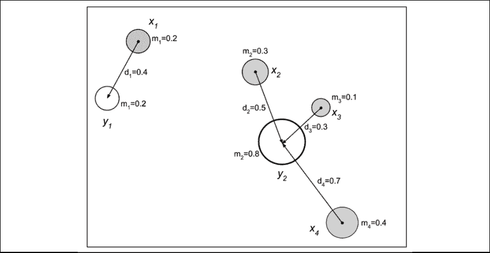

图 5.1.1：EMD 是从`x`传输以匹配目标分布`y`的质量的加权数量。

在位置`i = 1, 2, 3, 4`上，`x`在具有质量`m[i], i = 1, 2, 3, 4`。同时，位置`y[i], i = 1, 2`上，`y`的质量为`m[i], i = 1, 2`。为了匹配分布`y`，图中的箭头显示了将每个质量`x[i]`移动`d[i]`的最小运输计划。 EMD 计算如下：

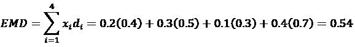 (Equation 5.1.4)

在“图 5.1.1”中，EMD 可解释为移动一堆污物`x`填充孔`y`所需的最少工作量。 尽管在此示例中，也可以从图中推导出`inf`，但在大多数情况下，尤其是在连续分布中，用尽所有可能的运输计划是很棘手的。 我们将在本章中稍后回到这个问题。 同时，我们将向您展示 GAN 损失函数的作用，实际上是如何使 **JS** 的差异最小化。

## GAN 中的距离函数

现在，在上一章的损失函数给定任何生成器的情况下，我们将计算最佳判别器。 我们将回顾上一章中的以下等式：

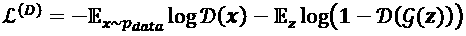 (Equation 4.1.1)

除了从噪声分布中采样外，前面的等式也可以表示为从生成器分布中采样：

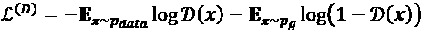 (Equation 5.1.5)

找出最小的`L^(D)`：

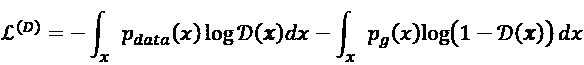 (Equation 5.1.6)

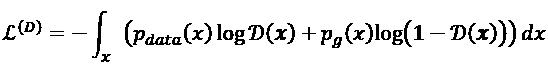 (Equation 5.1.7)

积分内部的项为`y -> a log(y) + b log(1 - y)`的形式，对于不包括`{0, 0}`的任何`a, b ∈ R^2`，在`y ∈ [0. 1]`的`a / (a + b)`处都有一个已知的最大值。 由于该积分不会更改此表达式的最大值（或`L^(D)`的最小值）的位置，因此最佳判别器为：

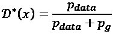 (Equation 5.1.8)

因此，给定最佳判别器的损失函数为：

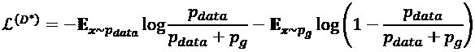 (Equation 5.1.9)

 (Equation 5.1.10)

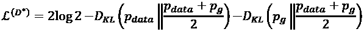 (Equation 5.1.11)

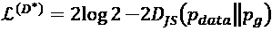 (Equation 5.1.12)

我们可以从“公式 5.1.12”观察到，最佳判别器的损失函数为常数减去真实分布`p_data`和任何生成器分布`p_g`之间的 JS 散度的两倍。 最小化`L^(D*)`意味着最大化`D[JS](p_data || p_g)`，否则判别器必须正确地将真实数据中的伪造物分类。

同时，我们可以放心地说，最佳生成器是当生成器分布等于真实数据分布时：

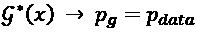 (Equation 5.1.13)

这是有道理的，因为生成器的目的是通过学习真实的数据分布来欺骗判别器。 有效地，我们可以通过最小化`D[JS]`或通过制作`p_g -> p_data`来获得最佳生成器。 给定最佳生成器，最佳判别器为`D*(x) = 1 / 2`和`L^(D*) = 2log2 = 0.60`。

问题在于，当两个分布没有重叠时，就没有平滑函数可以帮助缩小它们之间的差距。 训练 GAN 不会因梯度下降而收敛。 例如，假设：

`p_data = (x, y) where x = 0, y ~ U(0, 1)` (Equation 5.1.14)

`p_g = (x, y) where x = θ, y ~ U(0, 1)` (Equation 5.1.15)

这两个分布显示在“图 5.1.2”中：

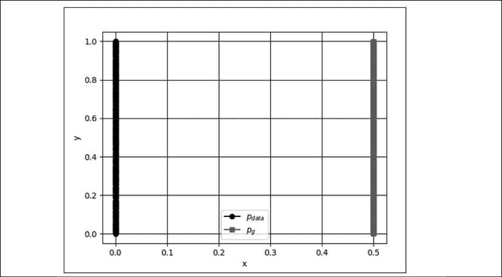

图 5.1.2：没有重叠的两个分布的示例。 对于`p_g`，`θ = 0.5`

是均匀分布。 每个距离函数的差异如下：

*   
*   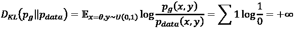
*   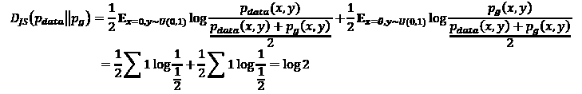
*   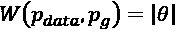

由于`D[JS]`是一个常数，因此 GAN 将没有足够的梯度来驱动`p_g -> p_data`。 我们还会发现`D[KL]`或反向`D[KL]`也不起作用。 但是，通过`W(p_data, p_g)`，我们可以拥有平滑函数，以便通过梯度下降获得`p_g -> p_data`。 为了优化 GAN，EMD 或 Wasserstein 1 似乎是一个更具逻辑性的损失函数，因为在两个分布具有极小或没有重叠的情况下，`D[JS]`会失败。

为了帮助进一步理解，可以在以下位置找到[有关距离函数的精彩讨论](https://lilianweng.github.io/lil-log/2017/08/20/from-GAN-to-WGAN.html)。

在下一节中，我们将重点介绍使用 EMD 或 Wasserstein 1 距离函数来开发替代损失函数，以鼓励稳定训练 GAN。

## 使用 Wasserstein 损失

在使用 EMD 或 Wasserstein 1 之前，还有一个要解决的问题。 耗尽`Π(p_data, p_g)`的空间来找到`γ ~ Π(p_data, p_g)`是很棘手的。 提出的解决方案是使用其 Kantorovich-Rubinstein 对偶：

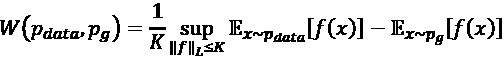 (Equation 5.1.16)

等效地，EMD `sup ||f||_L <= 1`是所有 K-Lipschitz 函数上的最高值（大约是最大值）：`f: x -> R`。 K-Lipschitz 函数满足以下约束：

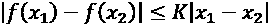 (Equation 5.1.17)

对于所有`x[1], x[2] ∈ R`。 K-Lipschitz 函数具有有界导数，并且几乎总是连续可微的（例如，`f(x) = |x|`具有有界导数并且是连续的，但在`x = 0`时不可微分）。

“公式 5.1.16”可以通过找到 K-Lipschitz 函数`{f[w]}, w ∈ W`的族来求解：

 (Equation 5.1.18)

在 GAN 中，可以通过从`z`-噪声分布采样并用`f[w]`替换“公式 5.1.18”来重写。 鉴别函数，`D[w]`：

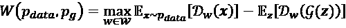 (Equation 5.1.19)

我们使用粗体字母突出显示多维样本的一般性。 最后一个问题是如何找到函数族`w ∈ W`。 所提出的解决方案是在每次梯度更新时进行的。 判别器`w`的权重被限制在上下限之间（例如，-0.01 和 0.01）：

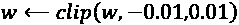 (Equation 5.1.20)

`w`的较小值将判别器约束到紧凑的参数空间，从而确保 Lipschitz 连续性。

我们可以使用“公式 5.1.19”作为我们新的 GAN 损失函数的基础。 EMD 或 Wasserstein 1 是生成器旨在最小化的损失函数，以及判别器试图最大化的损失函数（或最小化`-W(p_data, p_g)`：

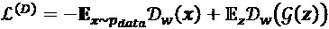 (Equation 5.1.21)

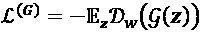 (Equation 5.1.22)

在生成器损失函数中，第一项消失了，因为它没有针对实际数据进行直接优化。

“表 5.1.2”显示了 GAN 和 WGAN 的损失函数之间的差异。 为简洁起见，我们简化了`L^(D)`和`L^(G)`的表示法：

| **网络** | **损失函数** | **公式** |
| --- | --- | --- |
| GAN | 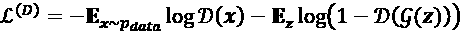 | 4.1.1 |
| | 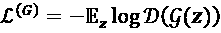 | 4.1.5 |
| WGAN | 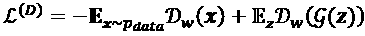 | 5.1.21 |
| | 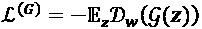 | 5.1.22 |
| | 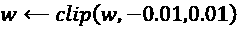 | 5.1.20 |

表 5.1.2：GAN 和 WGAN 的损失函数之间的比较

这些损失函数用于训练 WGAN，如“算法 5.1.1”中所示。

**算法 5.1.1 WGAN**。 参数的值为`α = 0.00005`，`c = 0.01`，`m = 64`和`n_critic = 5`。

要求：`α`，学习率。`c`是削波参数。`m`，批量大小。 `n_critic`，即每个生成器迭代的评论（鉴别）迭代次数。

要求：`w[D]`，初始判别器（discriminator）参数。 `θ[D]`，初始生成器参数：

1.  当`θ[D]`尚未收敛，执行：
2.  对于`t = 1, ..., n_critic`，执行：
3.  从真实数据中抽样一批`{x^(i)} ~ p_data, i = 1, ..., m`
4.  从均匀的噪声分布中采样一批`{z^(i)} ~ p_x, i = 1, ..., m`
5.  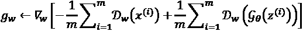

    计算判别器梯度
6.  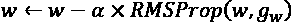

    更新判别器参数
7.  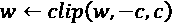

    剪辑判别器权重
8.  `end for`
9.  从均匀的噪声分布中采样一批`{z^(i)} ~ p_x, i = 1, ..., m`
10.  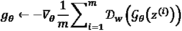

    计算生成器梯度
11.  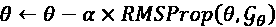

    更新生成器参数
12.  `end while`

“图 5.1.3”展示了 WGAN 模型实际上与 DCGAN 相同，除了伪造的/真实的数据标签和损失函数：

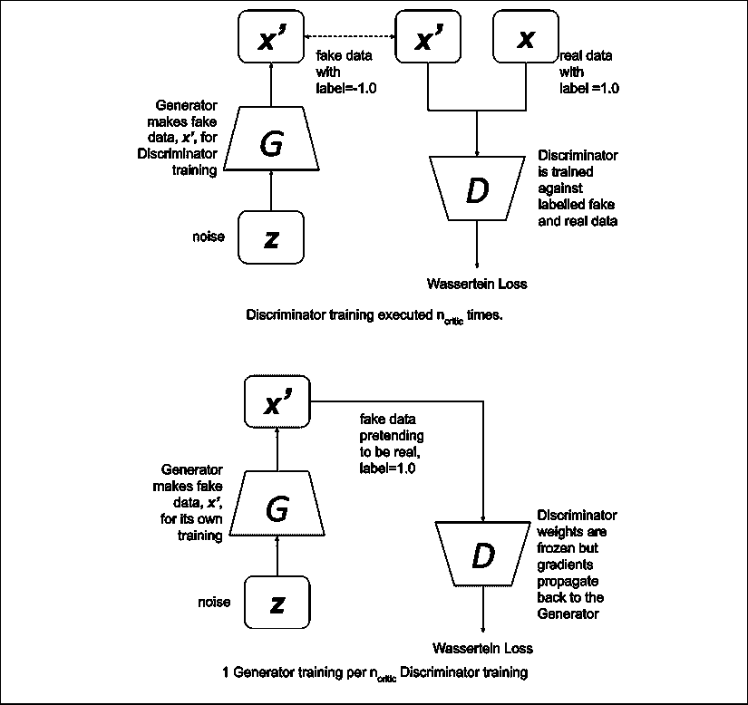

图 5.1.3：顶部：训练 WGAN 判别器需要来自生成器的虚假数据和来自真实分发的真实数据。 下：训练 WGAN 生成器要求生成器中假冒的真实数据是真实的

与 GAN 相似，WGAN 交替训练判别器和生成器（通过对抗）。 但是，在 WGAN 中，判别器（也称为评论者）在训练生成器进行一次迭代（第 9 至 11 行）之前，先训练`n_critic`迭代（第 2 至 8 行）。 这与对于判别器和生成器具有相同数量的训练迭代的 GAN 相反。 换句话说，在 GAN 中，`n_critic = 1`。

训练判别器意味着学习判别器的参数（权重和偏差）。 这需要从真实数据中采样一批（第 3 行），并从伪数据中采样一批（第 4 行），然后将采样数据馈送到判别器网络，然后计算判别器参数的梯度（第 5 行）。 判别器参数使用 RMSProp（第 6 行）进行了优化。 第 5 行和第 6 行都是“公式 5.1.21”的优化。

最后，EM 距离优化中的 Lipschitz 约束是通过裁剪判别器参数（第 7 行）来施加的。 第 7 行是“公式 5.1.20”的实现。 在`n_critic`迭代判别器训练之后，判别器参数被冻结。 生成器训练通过对一批伪造数据进行采样开始（第 9 行）。 采样的数据被标记为实数（1.0），以致愚弄判别器网络。 在第 10 行中计算生成器梯度，并在第 11 行中使用 RMSProp 对其进行优化。第 10 行和第 11 行执行梯度更新以优化“公式 5.1.22”。

训练生成器后，将解冻判别器参数，并开始另一个`n_critic`判别器训练迭代。 我们应该注意，在判别器训练期间不需要冻结生成器参数，因为生成器仅涉及数据的制造。 类似于 GAN，可以将判别器训练为一个单独的网络。 但是，训练生成器始终需要判别器通过对抗网络参与，因为损失是根据生成器网络的输出计算得出的。

与 GAN 不同，在 WGAN 中，将实际数据标记为 1.0，而将伪数据标记为 -1.0，作为计算第 5 行中的梯度的一种解决方法。第 5-6 和 10-11 行执行梯度更新以优化“公式 5.1.21”和“5.1.22”。 第 5 行和第 10 行中的每一项均建模为：

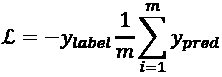 (Equation 5.1.23)

对于真实数据，其中`y_label = 1.0`，对于假数据，`y_label= -1.0`。 为了简化符号，我们删除了上标`(i)`。 对于判别器，当使用实际数据进行训练时，WGAN 增加`y_pred = D[w](x)`以最小化损失函数。

使用伪造数据进行训练时，WGAN 会降低`y_pred = D[w](g(z))`以最大程度地减少损失函数。 对于生成器，当在训练过程中将伪数据标记为真实数据时，WGAN 增加`y_pred = D[w](g(z))`以最小化损失函数。 请注意，`y_label`除了其符号外，对损失函数没有直接贡献。 在`tf.keras`中，“公式 5.1.23”实现为：

```py
def wasserstein_loss(y_label, y_pred):
    return -K.mean(y_label * y_pred) 
```

本节最重要的部分是用于稳定训练 GAN 的新损失函数。 它基于 EMD 或 Wasserstein1。“算法 5.1.1”形式化了 WGAN 的完整训练算法，包括损失函数。 在下一节中，将介绍`tf.keras`中训练算法的实现。

## 使用 Keras 的 WGAN 实现

为了在`tf.keras`中实现 WGAN，我们可以重用 GAN 的 DCGAN 实现，这是我们在上一一章中介绍的。 DCGAN 构建器和工具函数在`lib`文件夹的`gan.py`中作为模块实现。

函数包括：

*   `generator()`：生成器模型构建器
*   `discriminator()`：判别器模型构建器
*   `train()`：DCGAN 训练师
*   `plot_images()`：通用生成器输出绘图仪
*   `test_generator()`：通用的生成器测试工具

如“列表 5.1.1”所示，我们可以通过简单地调用以下命令来构建一个判别器：

```py
discriminator = gan.discriminator(inputs, activation='linear') 
```

WGAN 使用线性输出激活。 对于生成器，我们执行：

```py
generator = gan.generator(inputs, image_size) 
```

`tf.keras`中的整体网络模型类似于 DCGAN 的“图 4.2.1”中看到的模型。

“列表 5.1.1”突出显示了 RMSprop 优化器和 Wasserstein 损失函数的使用。 在训练期间使用“算法 5.1.1”中的超参数。

[完整的代码可在 GitHub 上获得](https://github.com/PacktPublishing/Advanced-Deep-Learning-with-Keras)。

“列表 5.1.1”：`wgan-mnist-5.1.2.py`

```py
def build_and_train_models():
    """Load the dataset, build WGAN discriminator,
    generator, and adversarial models.
    Call the WGAN train routine.
    """
    # load MNIST dataset
    (x_train, _), (_, _) = mnist.load_data() 
```

```py
 # reshape data for CNN as (28, 28, 1) and normalize
    image_size = x_train.shape[1]
    x_train = np.reshape(x_train, [-1, image_size, image_size, 1])
    x_train = x_train.astype('float32') / 255 
```

```py
 model_name = "wgan_mnist"
    # network parameters
    # the latent or z vector is 100-dim
    latent_size = 100
    # hyper parameters from WGAN paper [2]
    n_critic = 5
    clip_value = 0.01
    batch_size = 64
    lr = 5e-5
    train_steps = 40000
    input_shape = (image_size, image_size, 1) 
```

```py
 # build discriminator model
    inputs = Input(shape=input_shape, name='discriminator_input')
    # WGAN uses linear activation in paper [2]
    discriminator = gan.discriminator(inputs, activation='linear')
    optimizer = RMSprop(lr=lr)
    # WGAN discriminator uses wassertein loss
    discriminator.compile(loss=wasserstein_loss,
                          optimizer=optimizer,
                          metrics=['accuracy'])
    discriminator.summary() 
```

```py
 # build generator model
    input_shape = (latent_size, )
    inputs = Input(shape=input_shape, name='z_input')
    generator = gan.generator(inputs, image_size)
    generator.summary() 
```

```py
 # build adversarial model = generator + discriminator
    # freeze the weights of discriminator during adversarial training
    discriminator.trainable = False
    adversarial = Model(inputs,
                        discriminator(generator(inputs)),
                        name=model_name)
    adversarial.compile(loss=wasserstein_loss,
                        optimizer=optimizer,
                        metrics=['accuracy'])
    adversarial.summary() 
```

```py
 # train discriminator and adversarial networks
    models = (generator, discriminator, adversarial)
    params = (batch_size,
              latent_size,
              n_critic,
              clip_value,
              train_steps,
              model_name)
    train(models, x_train, params) 
```

“列表 5.1.2”是紧跟“算法 5.1.1”的训练函数。 但是，在判别器的训练中有一个小的调整。 与其在单个合并的真实数据和虚假数据中组合训练权重，不如先训练一批真实数据，然后再训练一批虚假数据。 这种调整将防止梯度消失，因为真实和伪造数据标签中的符号相反，并且由于裁剪而导致的权重较小。

“列表 5.1.2”：`wgan-mnist-5.1.2.py`

为 WGAN 训练算法：

```py
def train(models, x_train, params):
    """Train the Discriminator and Adversarial Networks 
```

```py
 Alternately train Discriminator and Adversarial
    networks by batch.
    Discriminator is trained first with properly labelled
    real and fake images for n_critic times.
    Discriminator weights are clipped as a requirement 
    of Lipschitz constraint.
    Generator is trained next (via Adversarial) with 
    fake images pretending to be real.
    Generate sample images per save_interval 
```

```py
 Arguments:
        models (list): Generator, Discriminator,
            Adversarial models
        x_train (tensor): Train images
        params (list) : Networks parameters 
```

```py
 """
    # the GAN models
    generator, discriminator, adversarial = models
    # network parameters
    (batch_size, latent_size, n_critic,
            clip_value, train_steps, model_name) = params
    # the generator image is saved every 500 steps
    save_interval = 500
    # noise vector to see how the 
    # generator output evolves during training
    noise_input = np.random.uniform(-1.0,
                                    1.0,
                                    size=[16, latent_size])
    # number of elements in train dataset
    train_size = x_train.shape[0]
    # labels for real data
    real_labels = np.ones((batch_size, 1))
    for i in range(train_steps):
        # train discriminator n_critic times
        loss = 0
        acc = 0
        for _ in range(n_critic):
            # train the discriminator for 1 batch
            # 1 batch of real (label=1.0) and 
            # fake images (label=-1.0)
            # randomly pick real images from dataset
            rand_indexes = np.random.randint(0,
                                             train_size,
                                             size=batch_size)
            real_images = x_train[rand_indexes]
            # generate fake images from noise using generator
            # generate noise using uniform distribution
            noise = np.random.uniform(-1.0,
                                      1.0,
                                      size=[batch_size, latent_size])
            fake_images = generator.predict(noise) 
```

```py
 # train the discriminator network
            # real data label=1, fake data label=-1
            # instead of 1 combined batch of real and fake images,
            # train with 1 batch of real data first, then 1 batch
            # of fake images.
            # this tweak prevents the gradient 
            # from vanishing due to opposite
            # signs of real and fake data labels (i.e. +1 and -1) and 
            # small magnitude of weights due to clipping.
            real_loss, real_acc = \
                discriminator.train_on_batch(real_images,
                                             real_labels)
            fake_loss, fake_acc = \
                discriminator.train_on_batch(fake_images,
                                             -real_labels)
            # accumulate average loss and accuracy
            loss += 0.5 * (real_loss + fake_loss)
            acc += 0.5 * (real_acc + fake_acc)
            # clip discriminator weights to satisfy Lipschitz constraint
            for layer in discriminator.layers:
                weights = layer.get_weights()
                weights = [np.clip(weight,
                                   -clip_value,
                                   clip_value) for weight in weights]
                layer.set_weights(weights) 
```

```py
 # average loss and accuracy per n_critic training iterations
        loss /= n_critic
        acc /= n_critic
        log = "%d: [discriminator loss: %f, acc: %f]" % (i, loss, acc) 
```

```py
 # train the adversarial network for 1 batch
        # 1 batch of fake images with label=1.0
        # since the discriminator weights are frozen in 
        # adversarial network only the generator is trained
        # generate noise using uniform distribution
        noise = np.random.uniform(-1.0,
                                  1.0,
                                  size=[batch_size, latent_size])
        # train the adversarial network
        # note that unlike in discriminator training,
        # we do not save the fake images in a variable
        # the fake images go to the discriminator 
        # input of the adversarial for classification
        # fake images are labelled as real
        # log the loss and accuracy
        loss, acc = adversarial.train_on_batch(noise, real_labels)
        log = "%s [adversarial loss: %f, acc: %f]" % (log, loss, acc)
        print(log)
        if (i + 1) % save_interval == 0:
            # plot generator images on a periodic basis
            gan.plot_images(generator,
                            noise_input=noise_input,
                            show=False,
                            step=(i + 1),
                            model_name=model_name) 
```

```py
 # save the model after training the generator
    # the trained generator can be reloaded 
    # for future MNIST digit generation
    generator.save(model_name + ".h5") 
```

“图 5.1.4”显示了 MNIST 数据集上 WGAN 输出的演变：


图 5.1.4：WGAN 与训练步骤的示例输出。 在训练和测试期间，WGAN 的任何输出均不会遭受模式崩溃

即使在网络配置更改的情况下，WGAN 也稳定。 例如，当在识别符网络的 ReLU 之前插入批量规范化时，已知 DCGAN 不稳定。 在 WGAN 中，相同的配置是稳定的。

下图“图 5.1.5”向我们展示了 DCGAN 和 WGAN 的输出，并在判别器网络上进行了批量归一化：

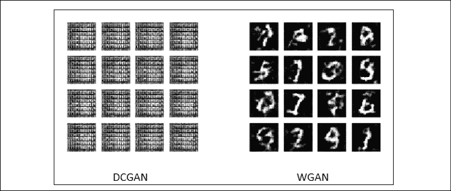

图 5.1.5：在判别器网络中的 ReLU 激活之前插入批量归一化时，DCGAN（左）和 WGAN（右）的输出比较

与上一章中的 GAN 训练相似，经过 40,000 个训练步骤，将训练后的模型保存在文件中。 使用训练有素的生成器模型，通过运行以下命令来生成新的合成 MNIST 数字图像：

```py
python3 wgan-mnist-5.1.2.py --generator=wgan_mnist.h5 
```

正如我们所讨论的，原始 GAN 很难训练。 当 GAN 优化的损失函数时，就会出现问题。 实际上是在优化 *JS* 差异，`D[JS]`。 当两个分布函数之间几乎没有重叠时，很难优化`D[JS]`。

WGAN 提出通过使用 EMD 或 Wasserstein 1 损失函数来解决该问题，该函数即使在两个分布之间很少或没有重叠时也具有平滑的微分函数。 但是，WGAN 与生成的图像质量无关。 除了稳定性问题之外，原始 GAN 生成的图像在感知质量方面还有很多改进的地方。 LSGAN 理论上可以同时解决两个问题。 在下一节中，我们将介绍 LSGAN。

# 2\. 最小二乘 GAN（LSGAN）

LSGAN 提出最小二乘损失。“图 5.2.1”演示了为什么在 GAN 中使用 Sigmoid 交叉熵损失会导致生成的数据质量较差：

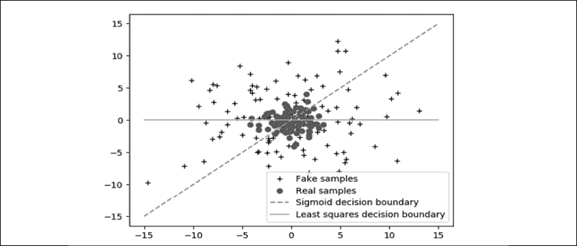

图 5.2.1：真实样本和虚假样本分布均除以各自的决策边界：Sigmoid 和最小二乘

理想情况下，假样本分布应尽可能接近真实样本的分布。 但是，对于 GAN，一旦伪样本已经位于决策边界的正确一侧，梯度就消失了。

这会阻止生成器具有足够的动机来提高生成的伪数据的质量。 远离决策边界的伪样本将不再试图靠近真实样本的分布。 使用最小二乘损失函数，只要假样本分布与真实样本的分布相距甚远，梯度就不会消失。 即使假样本已经位于决策边界的正确一侧，生成器也将努力改善其对实际密度分布的估计。

“表 5.2.1”显示了 GAN，WGAN 和 LSGAN 之间的损失函数的比较：

| **网络** | **损失函数** | **公式** |
| --- | --- | --- |
| GAN | 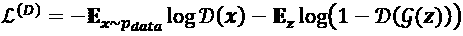 | 4.1.1 |
| | 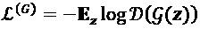 | 4.1.5 |
| WGAN | 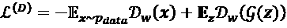 | 5.1.21 |
| | 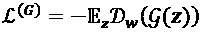 | 5.1.22 |
| | 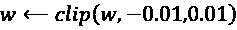 | 5.1.20 |
| LSGAN | 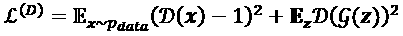 | 5.2.1 |
| | 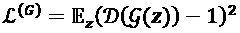 | 5.2.2 |

表 5.2.1：GAN，WGAN 和 LSGAN 损失函数之间的比较

最小化“公式 5.2.1”或判别器损失函数意味着实际数据分类与真实标签 1.0 之间的 MSE 应该接近零。 此外，假数据分类和真实标签 0.0 之间的 MSE 应该接近零。

与其他 GAN 相似，对 LSGAN 判别器进行了训练，可以从假数据样本中对真实数据进行分类。 最小化公式 5.2.2 意味着在标签 1.0 的帮助下，使判别器认为生成的假样本数据是真实的。

以上一章中的 DCGAN 代码为基础来实现 LSGAN 仅需进行一些更改。 如“列表 5.2.1”所示，删除了判别器 Sigmoid 激活。 判别器是通过调用以下命令构建的：

```py
discriminator = gan.discriminator(inputs, activation=None) 
```

生成器类似于原始的 DCGAN：

```py
generator = gan.generator(inputs, image_size) 
```

鉴别函数和对抗损失函数都被`mse`代替。 所有网络参数均与 DCGAN 中的相同。 `tf.keras`中 LSGAN 的网络模型类似于“图 4.2.1”，除了存在线性激活或无输出激活外。 训练过程类似于 DCGAN 中的训练过程，由工具函数提供：

```py
gan.train(models, x_train, params) 
```

“列表 5.2.1”：`lsgan-mnist-5.2.1.py`

```py
def build_and_train_models():
    """Load the dataset, build LSGAN discriminator,
    generator, and adversarial models.
    Call the LSGAN train routine.
    """
    # load MNIST dataset
    (x_train, _), (_, _) = mnist.load_data()
    # reshape data for CNN as (28, 28, 1) and normalize
    image_size = x_train.shape[1]
    x_train = np.reshape(x_train,
                         [-1, image_size, image_size, 1])
    x_train = x_train.astype('float32') / 255
    model_name = "lsgan_mnist"
    # network parameters
    # the latent or z vector is 100-dim
    latent_size = 100
    input_shape = (image_size, image_size, 1)
    batch_size = 64
    lr = 2e-4
    decay = 6e-8
    train_steps = 40000
    # build discriminator model
    inputs = Input(shape=input_shape, name='discriminator_input')
    discriminator = gan.discriminator(inputs, activation=None)
    # [1] uses Adam, but discriminator easily 
    # converges with RMSprop
    optimizer = RMSprop(lr=lr, decay=decay)
    # LSGAN uses MSE loss [2]
    discriminator.compile(loss='mse',
                          optimizer=optimizer,
                          metrics=['accuracy'])
    discriminator.summary()
    # build generator model
    input_shape = (latent_size, )
    inputs = Input(shape=input_shape, name='z_input')
    generator = gan.generator(inputs, image_size)
    generator.summary()
    # build adversarial model = generator + discriminator
    optimizer = RMSprop(lr=lr*0.5, decay=decay*0.5)
    # freeze the weights of discriminator 
    # during adversarial training
    discriminator.trainable = False
    adversarial = Model(inputs,
                        discriminator(generator(inputs)),
                        name=model_name)
    # LSGAN uses MSE loss [2]
    adversarial.compile(loss='mse',
                        optimizer=optimizer,
                        metrics=['accuracy'])
    adversarial.summary()
    # train discriminator and adversarial networks
    models = (generator, discriminator, adversarial)
    params = (batch_size, latent_size, train_steps, model_name)
    gan.train(models, x_train, params) 
```

“图 5.2.2”显示了使用 MNIST 数据集对 40,000 个训练步骤进行 LSGAN 训练后生成的样本：

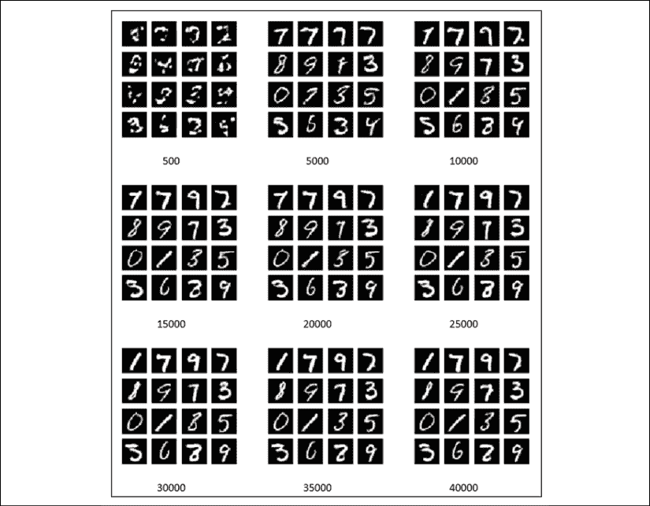

图 5.2.2：LSGAN 的示例输出与训练步骤

与上一章中 DCGAN 中的“图 4.2.1”相比，输出图像的感知质量更好。

使用训练有素的生成器模型，通过运行以下命令来生成新的合成 MNIST 数字图像：

```py
python3 lsgan-mnist-5.2.1.py --generator=lsgan_mnist.h5 
```

在本节中，我们讨论了损失函数的另一种改进。 通过使用 MSE 或 L2，我们解决了训练 GAN 的稳定性和感知质量的双重问题。 在下一节中，提出了相对于 CGAN 的另一项改进，这已在上一章中进行了讨论。

# 3\. 辅助分类器 GAN (ACGAN)

ACGAN 在原理上类似于我们在上一章中讨论的**条件 GAN**（**CGAN**）。 我们将比较 CGAN 和 ACGAN。 对于 CGAN 和 ACGAN，生成器输入均为噪声及其标签。 输出是属于输入类标签的伪图像。 对于 CGAN，判别器的输入是图像（假的或真实的）及其标签。 输出是图像真实的概率。 对于 ACGAN，判别器的输入是一幅图像，而输出是该图像是真实的且其类别是标签的概率。

“图 5.3.1”突出显示了生成器训练期间 CGAN 和 ACGAN 之间的区别：

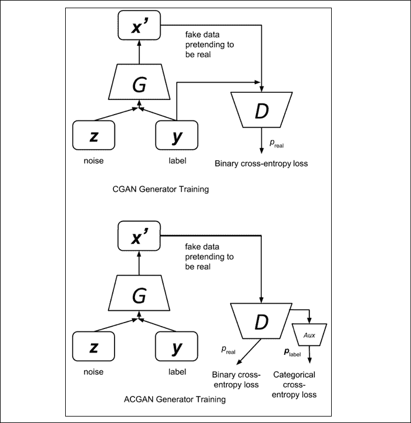

图 5.3.1：CGAN 与 ACGAN 生成器训练。 主要区别是判别器的输入和输出

本质上，在 CGAN 中，我们向网络提供了边信息（标签）。 在 ACGAN 中，我们尝试使用辅助类解码器网络重建辅助信息。 ACGAN 理论认为，强制网络执行其他任务可以提高原始任务的表现。 在这种情况下，附加任务是图像分类。 原始任务是生成伪造图像。

“表 5.3.1”显示了 ACGAN 损失函数与 CGAN 损失函数的比较：

| **网络** | **损失函数** | **编号** |
| --- | --- | --- |
| CGAN | 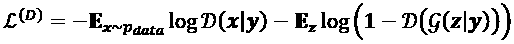 | 4.3.1 |
| |  | 4.3.2 |
| ACGAN |  | 5.3.1 |
| | 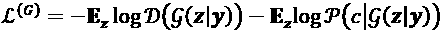 | 5.3.2 |

表 5.3.1：CGAN 和 ACGAN 损失函数之间的比较

ACGAN 损失函数与 CGAN 相同，除了附加的分类器损失函数。 除了从假图片中识别真实图像的原始任务之外，判别器的“公式 5.3.1”还具有对真假图像正确分类的附加任务。 生成器的“公式 5.3.2”意味着，除了尝试用伪造的图像来欺骗判别器（`-E[z] log D(g(z | y))`）之外，它还要求判别器正确地对那些伪造的图像进行分类（`-E[z] log P(c | g(z | y))`）。

从 CGAN 代码开始，仅修改判别器和训练函数以实现 ACGAN。 `gan.py`还提供了判别器和生成器构建器函数。 要查看判别器上所做的更改，清单 5.3.1 显示了构建器函数，其中突出显示了执行图像分类的辅助解码器网络和双输出。

“列表 5.3.1”：`gan.py`

```py
def discriminator(inputs,
                  activation='sigmoid',
                  num_labels=None,
                  num_codes=None):
    """Build a Discriminator Model 
```

```py
 Stack of LeakyReLU-Conv2D to discriminate real from fake
    The network does not converge with BN so it is not used here
    unlike in [1]
    Arguments:
        inputs (Layer): Input layer of the discriminator (the image)
        activation (string): Name of output activation layer
        num_labels (int): Dimension of one-hot labels for ACGAN & InfoGAN
        num_codes (int): num_codes-dim Q network as output 
                    if StackedGAN or 2 Q networks if InfoGAN

    Returns:
        Model: Discriminator Model
    """
    kernel_size = 5
    layer_filters = [32, 64, 128, 256] 
```

```py
 x = inputs
    for filters in layer_filters:
        # first 3 convolution layers use strides = 2
        # last one uses strides = 1
        if filters == layer_filters[-1]:
            strides = 1
        else:
            strides = 2
        x = LeakyReLU(alpha=0.2)(x)
        x = Conv2D(filters=filters,
                   kernel_size=kernel_size,
                   strides=strides,
                   padding='same')(x) 
```

```py
 x = Flatten()(x)
    # default output is probability that the image is real
    outputs = Dense(1)(x)
    if activation is not None:
        print(activation)
        outputs = Activation(activation)(outputs) 
```

```py
 if num_labels:
        # ACGAN and InfoGAN have 2nd output
        # 2nd output is 10-dim one-hot vector of label
        layer = Dense(layer_filters[-2])(x)
        labels = Dense(num_labels)(layer)
        labels = Activation('softmax', name='label')(labels)
        if num_codes is None:
            outputs = [outputs, labels]
        else:
            # InfoGAN have 3rd and 4th outputs
            # 3rd output is 1-dim continous Q of 1st c given x
            code1 = Dense(1)(layer)
            code1 = Activation('sigmoid', name='code1')(code1) 
```

```py
 # 4th output is 1-dim continuous Q of 2nd c given x
            code2 = Dense(1)(layer)
            code2 = Activation('sigmoid', name='code2')(code2) 
```

```py
 outputs = [outputs, labels, code1, code2]
    elif num_codes is not None:
        # StackedGAN Q0 output
        # z0_recon is reconstruction of z0 normal distribution
        z0_recon =  Dense(num_codes)(x)
        z0_recon = Activation('tanh', name='z0')(z0_recon)
        outputs = [outputs, z0_recon] 
```

```py
 return Model(inputs, outputs, name='discriminator') 
```

然后通过调用以下命令来构建判别器：

```py
discriminator = gan.discriminator(inputs, num_labels=num_labels) 
```

生成器与 WGAN 和 LSGAN 中的生成器相同。 回想一下，在以下“列表 5.3.2”中显示了生成器生成器。 我们应该注意，“列表 5.3.1”和“5.3.2”与上一节中 WGAN 和 LSGAN 使用的生成器函数相同。 重点介绍了适用于 LSGAN 的部件。

“列表 5.3.2”：`gan.py`

```py
def generator(inputs,
              image_size,
              activation='sigmoid',
              labels=None,
              codes=None):
    """Build a Generator Model 
```

```py
 Stack of BN-ReLU-Conv2DTranpose to generate fake images.
    Output activation is sigmoid instead of tanh in [1].
    Sigmoid converges easily. 
```

```py
 Arguments:
        inputs (Layer): Input layer of the generator (the z-vector)
        image_size (int): Target size of one side 
            (assuming square image)
        activation (string): Name of output activation layer
        labels (tensor): Input labels
        codes (list): 2-dim disentangled codes for InfoGAN 
```

```py
 Returns:
        Model: Generator Model
    """
    image_resize = image_size // 4
    # network parameters
    kernel_size = 5
    layer_filters = [128, 64, 32, 1] 
```

```py
 if labels is not None:
        if codes is None:
            # ACGAN labels
            # concatenate z noise vector and one-hot labels
            inputs = [inputs, labels]
        else:
            # infoGAN codes
            # concatenate z noise vector, 
            # one-hot labels and codes 1 & 2
            inputs = [inputs, labels] + codes
        x = concatenate(inputs, axis=1)
    elif codes is not None:
        # generator 0 of StackedGAN
        inputs = [inputs, codes]
        x = concatenate(inputs, axis=1)
    else:
        # default input is just 100-dim noise (z-code)
        x = inputs 
```

```py
 x = Dense(image_resize * image_resize * layer_filters[0])(x)
    x = Reshape((image_resize, image_resize, layer_filters[0]))(x) 
```

```py
 for filters in layer_filters:
        # first two convolution layers use strides = 2
        # the last two use strides = 1
        if filters > layer_filters[-2]:
            strides = 2
        else:
            strides = 1
        x = BatchNormalization()(x)
        x = Activation('relu')(x)
        x = Conv2DTranspose(filters=filters,
                            kernel_size=kernel_size,
                            strides=strides,
                            padding='same')(x) 
```

```py
 if activation is not None:
        x = Activation(activation)(x) 
```

```py
 # generator output is the synthesized image x
    return Model(inputs, x, name='generator') 
```

在 ACGAN 中，生成器实例化为：

```py
generator = gan.generator(inputs, image_size, labels=labels) 
```

“图 5.3.2”显示了`tf.keras`中 ACGAN 的网络模型：


图 5.3.2：ACGAN 的`tf.keras`模型

如“列表 5.3.3”所示，对判别器和对抗模型进行了修改，以适应判别器网络中的更改。 现在，我们有两个损失函数。 首先是原始的二进制交叉熵，用于训练判别器来估计输入图像为实的概率。

第二个是图像分类器，用于预测类别标签。 输出是一个 10 维的单热向量。

“列表 5.3.3”：`acgan-mnist-5.3.1.py`

重点介绍了在判别器和对抗网络中实现的更改：

```py
def build_and_train_models():
    """Load the dataset, build ACGAN discriminator,
    generator, and adversarial models.
    Call the ACGAN train routine.
    """
    # load MNIST dataset
    (x_train, y_train), (_, _) = mnist.load_data() 
```

```py
 # reshape data for CNN as (28, 28, 1) and normalize
    image_size = x_train.shape[1]
    x_train = np.reshape(x_train,
                         [-1, image_size, image_size, 1])
    x_train = x_train.astype('float32') / 255 
```

```py
 # train labels
    num_labels = len(np.unique(y_train))
    y_train = to_categorical(y_train) 
```

```py
 model_name = "acgan_mnist"
    # network parameters
    latent_size = 100
    batch_size = 64
    train_steps = 40000
    lr = 2e-4
    decay = 6e-8
    input_shape = (image_size, image_size, 1)
    label_shape = (num_labels, ) 
```

```py
 # build discriminator Model
    inputs = Input(shape=input_shape,
                   name='discriminator_input')
    # call discriminator builder 
    # with 2 outputs, pred source and labels
    discriminator = gan.discriminator(inputs,
                                      num_labels=num_labels) 
```

```py
 # [1] uses Adam, but discriminator 
    # easily converges with RMSprop
    optimizer = RMSprop(lr=lr, decay=decay)
    # 2 loss fuctions: 1) probability image is real
    # 2) class label of the image
    loss = ['binary_crossentropy', 'categorical_crossentropy']
    discriminator.compile(loss=loss,
                          optimizer=optimizer,
                          metrics=['accuracy'])
    discriminator.summary() 
```

```py
 # build generator model
    input_shape = (latent_size, )
    inputs = Input(shape=input_shape, name='z_input')
    labels = Input(shape=label_shape, name='labels')
    # call generator builder with input labels
    generator = gan.generator(inputs,
                              image_size,
                              labels=labels)
    generator.summary() 
```

```py
 # build adversarial model = generator + discriminator
    optimizer = RMSprop(lr=lr*0.5, decay=decay*0.5)
    # freeze the weights of discriminator 
    # during adversarial training
    discriminator.trainable = False
    adversarial = Model([inputs, labels],
                        discriminator(generator([inputs, labels])),
                        name=model_name)
    # same 2 loss fuctions: 1) probability image is real
    # 2) class label of the image
    adversarial.compile(loss=loss,
                        optimizer=optimizer,
                        metrics=['accuracy'])
    adversarial.summary() 
```

```py
 # train discriminator and adversarial networks
    models = (generator, discriminator, adversarial)
    data = (x_train, y_train)
    params = (batch_size, latent_size, \
             train_steps, num_labels, model_name)
    train(models, data, params) 
```

在“列表 5.3.4”中，我们重点介绍了训练例程中实现的更改。 将与 CGAN 代码进行比较的主要区别在于，必须在鉴别和对抗训练中提供输出标签。

“列表 5.3.4”：`acgan-mnist-5.3.1.py`

```py
def train(models, data, params):
    """Train the discriminator and adversarial Networks
    Alternately train discriminator and adversarial 
    networks by batch.
    Discriminator is trained first with real and fake 
    images and corresponding one-hot labels.
    Adversarial is trained next with fake images pretending 
    to be real and corresponding one-hot labels.
    Generate sample images per save_interval.
    # Arguments
        models (list): Generator, Discriminator,
            Adversarial models
        data (list): x_train, y_train data
        params (list): Network parameters
    """
    # the GAN models
    generator, discriminator, adversarial = models
    # images and their one-hot labels
    x_train, y_train = data
    # network parameters
    batch_size, latent_size, train_steps, num_labels, model_name \
            = params
    # the generator image is saved every 500 steps
    save_interval = 500
    # noise vector to see how the generator 
    # output evolves during training
    noise_input = np.random.uniform(-1.0,
                                    1.0,
                                    size=[16, latent_size])
    # class labels are 0, 1, 2, 3, 4, 5, 
    # 6, 7, 8, 9, 0, 1, 2, 3, 4, 5
    # the generator must produce these MNIST digits
    noise_label = np.eye(num_labels)[np.arange(0, 16) % num_labels]
    # number of elements in train dataset
    train_size = x_train.shape[0]
    print(model_name,
          "Labels for generated images: ",
          np.argmax(noise_label, axis=1)) 
```

```py
 for i in range(train_steps):
        # train the discriminator for 1 batch
        # 1 batch of real (label=1.0) and fake images (label=0.0)
        # randomly pick real images and 
        # corresponding labels from dataset 
        rand_indexes = np.random.randint(0,
                                         train_size,
                                         size=batch_size)
        real_images = x_train[rand_indexes]
        real_labels = y_train[rand_indexes]
        # generate fake images from noise using generator
        # generate noise using uniform distribution
        noise = np.random.uniform(-1.0,
                                  1.0,
                                  size=[batch_size, latent_size])
        # randomly pick one-hot labels
        fake_labels = np.eye(num_labels)[np.random.choice(num_labels,
                                                          batch_size)]
        # generate fake images
        fake_images = generator.predict([noise, fake_labels])
        # real + fake images = 1 batch of train data
        x = np.concatenate((real_images, fake_images))
        # real + fake labels = 1 batch of train data labels
        labels = np.concatenate((real_labels, fake_labels)) 
```

```py
 # label real and fake images
        # real images label is 1.0
        y = np.ones([2 * batch_size, 1])
        # fake images label is 0.0
        y[batch_size:, :] = 0
        # train discriminator network, log the loss and accuracy
        # ['loss', 'activation_1_loss', 
        # 'label_loss', 'activation_1_acc', 'label_acc']
        metrics  = discriminator.train_on_batch(x, [y, labels])
        fmt = "%d: [disc loss: %f, srcloss: %f,"
        fmt += "lblloss: %f, srcacc: %f, lblacc: %f]"
        log = fmt % (i, metrics[0], metrics[1], \
                metrics[2], metrics[3], metrics[4]) 
```

```py
 # train the adversarial network for 1 batch
        # 1 batch of fake images with label=1.0 and
        # corresponding one-hot label or class 
        # since the discriminator weights are frozen 
        # in adversarial network only the generator is trained
        # generate noise using uniform distribution
        noise = np.random.uniform(-1.0,
                                  1.0,
                                  size=[batch_size, latent_size])
        # randomly pick one-hot labels
        fake_labels = np.eye(num_labels)[np.random.choice(num_labels,
                                                          batch_size)]
        # label fake images as real
        y = np.ones([batch_size, 1])
        # train the adversarial network 
        # note that unlike in discriminator training, 
        # we do not save the fake images in a variable
        # the fake images go to the discriminator input 
        # of the adversarial for classification
        # log the loss and accuracy
        metrics  = adversarial.train_on_batch([noise, fake_labels],
                                              [y, fake_labels])
        fmt = "%s [advr loss: %f, srcloss: %f,"
        fmt += "lblloss: %f, srcacc: %f, lblacc: %f]"
        log = fmt % (log, metrics[0], metrics[1],\
                metrics[2], metrics[3], metrics[4])
        print(log)
        if (i + 1) % save_interval == 0:
            # plot generator images on a periodic basis
            gan.plot_images(generator,
                        noise_input=noise_input,
                        noise_label=noise_label,
                        show=False,
                        step=(i + 1),
                        model_name=model_name) 
```

```py
 # save the model after training the generator
    # the trained generator can be reloaded 
    # for future MNIST digit generation
    generator.save(model_name + ".h5") 
```

可以看出，与其他任务相比，与我们之前讨论的所有 GAN 相比，ACGAN 的表现显着提高。 ACGAN 训练是稳定的，如“图 5.3.3”的 ACGAN 示例输出的以下标签所示：

```py
[0    1    2    3
 4    5    6    7
 8    9    0    1
 2    3    4    5] 
```

与 CGAN 不同，样本输出的外观在训练过程中变化不大。 MNIST 数字图像的感知质量也更好。


图 5.3.3：ACGAN 根据标签的训练步骤生成的示例输出`[0 1 2 3 4 5 6 7 8 9 0 1 2 3 4 5]`

使用训练有素的生成器模型，通过运行以下命令来生成新的合成 MNIST 数字图像：

```py
python3 acgan-mnist-5.3.1.py --generator=acgan_mnist.h5 
```

或者，也可以请求生成要生成的特定数字（例如 3）：

```py
python3 acgan-mnist-5.3.1.py --generator=acgan_mnist.h5 --digit=3 
```

“图 5.3.4”显示了 CGAN 和 ACGAN 产生的每个 MNIST 数字的并排比较。 ACGAN 中的数字 2-6 比 CGAN 中的数字质量更好：


图 5.3.4：以数字 0 到 9 为条件的 CGAN 和 ACGAN 输出的并排比较

与 WGAN 和 LSGAN 相似，ACGAN 通过微调的损失函数，对现有 GAN CGAN 进行了改进。 在接下来的章节中，我们将发现新的损失函数，这些函数将使 GAN 能够执行新的有用任务。

# 4\. 总结

在本章中，我们介绍了对原始 GAN 算法的各种改进，这些改进在上一章中首次介绍。 WGAN 提出了一种通过使用 EMD 或 Wasserstein 1 损失来提高训练稳定性的算法。 LSGAN 认为，与最小二乘损失不同，GANs 的原始交叉熵函数倾向于消失梯度。 LSGAN 提出了一种实现稳定训练和高质量输出的算法。 ACGAN 通过要求判别器在确定输入图像是假的还是真实的基础上执行分类任务，来令人信服地提高了 MNIST 数字有条件生成的质量。

在下一章中，我们将研究如何控制生成器输出的属性。 尽管 CGAN 和 ACGAN 可以指示要生成的期望数字，但我们尚未分析可以指定输出属性的 GAN。 例如，我们可能想要控制 MNIST 数字的书写风格，例如圆度，倾斜角度和厚度。 因此，目标是引入具有纠缠表示的 GAN，以控制生成器输出的特定属性。

# 5\. 参考

1.  `Ian Goodfellow et al.: Generative Adversarial Nets. Advances in neural information processing systems, 2014 (http://papers.nips.cc/paper/5423-generative-adversarial-nets.pdf).`
1.  `Martin Arjovsky, Soumith Chintala, and Léon Bottou: Wasserstein GAN. arXiv preprint, 2017 (https://arxiv.org/pdf/1701.07875.pdf).`
1.  `Xudong Mao et al.: Least Squares Generative Adversarial Networks. 2017 IEEE International Conference on Computer Vision (ICCV). IEEE 2017 (http://openaccess.thecvf.com/content_ICCV_2017/papers/Mao_Least_Squares_Generative_ICCV_2017_paper.pdf).`
1.  `Augustus Odena, Christopher Olah, and Jonathon Shlens. Conditional Image Synthesis with Auxiliary Classifier GANs. ICML, 2017 (http://proceedings.mlr.press/v70/odena17a/odena17a.pdf).`