# 六、纠缠表示 GAN

正如我们已经探索的那样，GAN 可以通过学习数据分布来产生有意义的输出。 但是，无法控制所生成输出的属性。 GAN 的一些变体，例如**条件 GAN**（**CGAN**）和**辅助分类器 GAN**（**ACGAN**），如前两章所讨论的，都可以训练生成器，该生成器可以合成特定的输出。 例如，CGAN 和 ACGAN 都可以诱导生成器生成特定的 MNIST 数字。 这可以通过同时使用 100 维噪声代码和相应的一号热标签作为输入来实现。 但是，除了单热标签外，我们没有其他方法可以控制生成的输出的属性。

有关 CGAN 和 ACGAN 的评论，请参阅“第 4 章”，“生成对抗网络（GANs）”和“第 5 章”，“改进的 GANs”。

在本章中，我们将介绍使我们能够修改生成器输出的 GAN 的变体。 在 MNIST 数据集的上下文中，除了要生成的数字外，我们可能会发现我们想要控制书写样式。 这可能涉及所需数字的倾斜度或宽度。 换句话说，GAN 也可以学习纠缠的潜在代码或表示形式，我们可以使用它们来改变生成器输出的属性。 解开的代码或表示形式是张量，可以在不影响其他属性的情况下更改输出数据的特定特征或属性。

在本章的第一部分中，我们将讨论《InfoGAN：通过最大化生成对抗网络的信息进行可解释的表示学习》[1]，这是 GAN 的扩展。 InfoGAN 通过最大化输入代码和输出观察值之间的互信息来以无监督的方式学习解缠结的表示形式。 在 MNIST 数据集上，InfoGAN 从数字数据集中解开了写作风格。

在本章的以下部分中，我们还将讨论《栈式生成对抗网络或 StackedGAN》[2]，这是 GAN 的另一种扩展。

StackedGAN 使用预训练的编码器或分类器，以帮助解开潜在代码。 StackedGAN 可以看作是一堆模型，每个模型都由编码器和 GAN 组成。 通过使用相应编码器的输入和输出数据，以对抗性方式训练每个 GAN。

总之，本章的目的是介绍：

*   纠缠表示的概念
*   InfoGAN 和 StackedGAN 的原理
*   使用`tf.keras`实现 InfoGAN 和 StackedGAN

让我们从讨论纠缠的表示开始。

# 1\. 纠缠表示

最初的 GAN 能够产生有意义的输出，但是缺点是它的属性无法控制。 例如，如果我们训练 GAN 来学习名人面孔的分布，则生成器将产生名人形象的新图像。 但是，没有任何方法可以影响生成器有关所需脸部的特定属性。 例如，我们无法向生成器询问女性名人的脸，该女性名人是黑发，白皙的肤色，棕色的眼睛，微笑着。 这样做的根本原因是因为我们使用的 100 维噪声代码纠缠了生成器输出的所有显着属性。 我们可以回想一下，在`tf.keras`中，`100-dim`代码是由均匀噪声分布的随机采样生成的：

```py
 # generate fake images from noise using generator 
        # generate noise using uniform distribution
        noise = np.random.uniform(-1.0,
                                  1.0,
                                  size=[batch_size, latent_size])
        # generate fake images
        fake_images = generator.predict(noise) 
```

如果我们能够修改原始 GAN，以便将表示形式分为纠缠的和解缠的可解释的潜在代码向量，则我们将能够告诉生成器合成什么。

“图 6.1.1”向我们展示了一个带纠缠代码的 GAN，以及它的纠缠和解缠表示的混合形式。 在假设的名人脸生成的情况下，使用解开的代码，我们可以指出我们希望生成的脸的性别，发型，面部表情，肤色和肤色。 仍然需要`n–dim`纠缠代码来表示我们尚未纠缠的所有其他面部属性，例如面部形状，面部毛发，眼镜等，仅是三个示例。 纠缠和解纠缠的代码向量的连接用作生成器的新输入。 级联代码的总维不一定是 100：

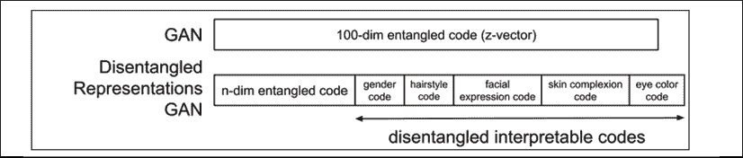

图 6.1.1：带有纠缠码的 GAN 及其随纠缠码和解缠码的变化。 此示例在名人脸生成的背景下显示

查看上图中的，似乎可以以与原始 GAN 相同的方式优化具有解缠表示的 GAN。 这是因为生成器的输出可以表示为：

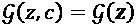 (Equation 6.1.1)

代码`z = (z, c)`包含两个元素：

*   类似于 GANs`z`或噪声向量的不可压缩纠缠噪声代码。
*   潜在代码`c[1]`，`c[2]`，…，`c[L]`， 代表数据分配的可解译的纠缠码。 所有潜在代码共同表示为`c`。

为简单起见，假定所有潜在代码都是独立的：

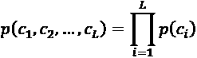 (Equation 6.1.2)

生成器函数`x = g(z, c) = g(z)`带有不可压缩的噪声代码和潜在代码。 从生成器的角度来看，优化`z = (z, c)`与优化`z`相同。

当提出解决方案时，生成器网络将仅忽略解纠结代码所施加的约束。

生成器学习分布`p_g(x | c) = p_g(x)`。 这实际上将打乱分散表示的目的。

InfoGAN 的关键思想是强制 GAN 不要忽略潜在代码`c`。 这是通过最大化`c`和`g(z, c)`之间的相互信息来完成的。 在下一节中，我们将公式化 InfoGAN 的损失函数。

# InfoGAN

为了加强对代码的纠缠，InfoGAN 提出了一种针对原始损失函数的正则化函数，该函数可最大化潜在代码`c`和`g(z, c)`之间的互信息：

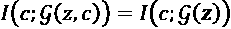 (Equation 6.1.3)

正则化器在生成用于合成伪图像的函数时，会强制生成器考虑潜在代码。 在信息论领域，潜码`c`和`g(z, c)`之间的互信息定义为：

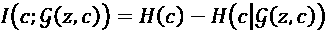 (Equation 6.1.4)

其中`H(c)`是潜码`c`的熵，`H(c | g(z | c))`是观察生成器的输出后`c`的条件熵， `g(z, c)`。 熵是对随机变量或事件的不确定性的度量。 例如，**在东方升起**之类的信息具有较低的熵，而**在彩票中赢得大奖**具有较高的熵。 可以在“第 13 章”，“使用互信息的无监督学习”中找到有关互信息的更详细讨论。

在“公式 6.1.4”中，最大化互信息意味着在观察生成的输出时，将`H(c | g(z | c))`最小化或减小潜码中的不确定性。 这是有道理的，因为例如在 MNIST 数据集中，如果 GAN 看到生成器 8 看到了数字 8，则生成器对合成数字 8 变得更有信心。

但是，`H(c | g(z | c))`很难估计，因为它需要后验`P(c | g(z | c)) = P(c | x)`的知识，这是我们无法获得的。 为简单起见，我们将使用常规字母`x`表示数据分布。

解决方法是通过使用辅助分布`Q(c | x)`估计后验来估计互信息的下界。 InfoGAN 估计相互信息的下限为：

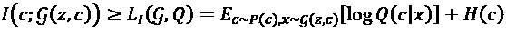 (Equation 6.1.5)

在 InfoGAN 中，`H(c)`被假定为常数。 因此，使相互信息最大化是使期望最大化的问题。 生成器必须确信已生成具有特定属性的输出。 我们应注意，此期望的最大值为零。 因此，相互信息的下限的最大值为`H(c)`。 在 InfoGAN 中，离散隐码的`Q(c | x)`可以由`softmax`非线性表示。 期望是`tf.keras`中的负`categorical_crossentropy`损失。

对于一维连续代码，期望是`c`和`x`的双整数。 这是由于期望从纠缠的代码分布和生成器分布中采样。 估计期望值的一种方法是通过假设样本是连续数据的良好度量。 因此，损失估计为`c log Q(c | x)`。 在“第 13 章”，“使用互信息的无监督学习”中，我们将提供对互信息的更精确估计。

为了完成 InfoGAN 的网络，我们应该有`Q(c | x)`的实现。 为了简单起见，网络 Q 是一个附加到判别器第二到最后一层的辅助网络。 因此，这对原始 GAN 的训练影响很小。

“图 6.1.2”显示了 InfoGAN 网络图：

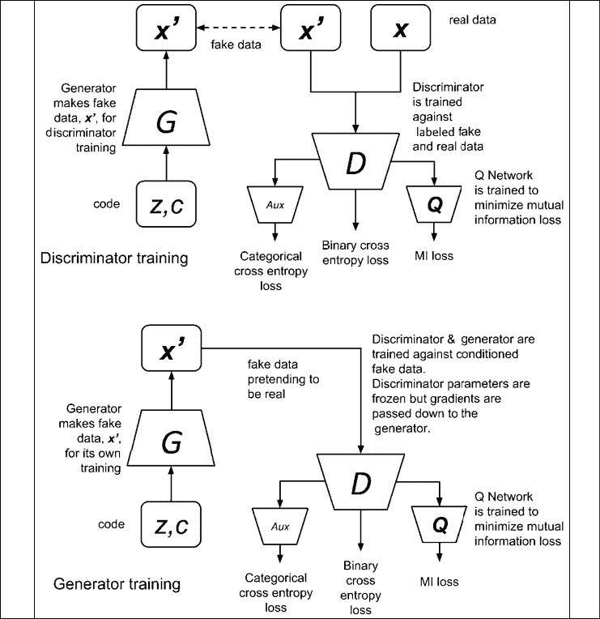

图 6.1.2 网络图显示 InfoGAN 中的判别器和生成器训练

“表 6.1.1”显示了与 GAN 相比 InfoGAN 的损失函数：

| **网络** | **损失函数** | **编号** |
| --- | --- | --- |
| GAN | 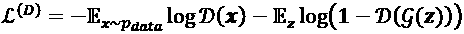 | 4.1.1 |
| | 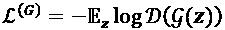 | 4.1.5 |
| InfoGAN | 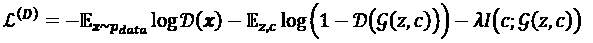 | 6.1.1 |
| | 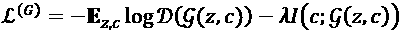 | 6.1.2 |
| | 对于连续代码，InfoGAN 建议使用`λ < 1`的值。 在我们的示例中，我们设置`λ = 0.5`。 对于离散代码，InfoGAN 建议使用`λ = 1`。 | |

表 6.1.1：GAN 和 InfoGAN 的损失函数之间的比较

InfoGAN 的损失函数与 GAN 的区别是附加项`-λI(c; g(z, c))`，其中`λ`是一个小的正常数。 最小化 InfoGAN 的损失函数可以将原始 GAN 的损失最小化，并将互信息最大化`I(c; g(z, c))`。

如果将其应用于 MNIST 数据集，InfoGAN 可以学习解开的离散码和连续码，以修改生成器输出属性。 例如，像 CGAN 和 ACGAN 一样，将使用`10-dim`一键标签形式的离散代码来指定要生成的数字。 但是，我们可以添加两个连续的代码，一个用于控制书写样式的角度，另一个用于调整笔划宽度。“图 6.1.3”显示了 InfoGAN 中 MNIST 数字的代码。 我们保留较小尺寸的纠缠代码以表示所有其他属性：

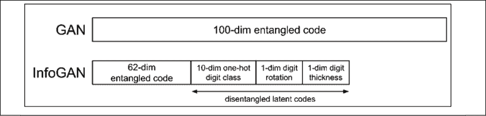

图 6.1.3：MNIST 数据集中 GAN 和 InfoGAN 的代码

在讨论了 InfoGAN 背后的一些概念之后，让我们看一下`tf.keras`中的 InfoGAN 实现。

## 在 Keras 中实现 InfoGAN

为了在 MNIST 数据集上实现 InfoGAN，需要对 ACGAN 的基本代码进行一些更改。 如“列表 6.1.1”中突出显示的那样，生成器将纠缠的（`z`噪声代码）和解纠结的代码（单标签和连续代码）连接起来作为输入：

```py
inputs = [inputs, labels] + codes 
```

`generator`和`discriminator`的构建器函数也在`lib`文件夹的`gan.py`中实现。

[完整的代码可在 GitHub 上获得](https://github.com/PacktPublishing/Advanced-Deep-Learning-with-Keras)。

“列表 6.1.1”：`infogan-mnist-6.1.1.py`

突出显示了特定于 InfoGAN 的行：

```py
def generator(inputs,
              image_size,
              activation='sigmoid',
              labels=None,
              codes=None):
    """Build a Generator Model 
```

```py
 Stack of BN-ReLU-Conv2DTranpose to generate fake images.
    Output activation is sigmoid instead of tanh in [1].
    Sigmoid converges easily. 
```

```py
 Arguments:
        inputs (Layer): Input layer of the generator (the z-vector)
        image_size (int): Target size of one side 
            (assuming square image)
        activation (string): Name of output activation layer
        labels (tensor): Input labels
        codes (list): 2-dim disentangled codes for InfoGAN 
```

```py
 Returns:
        Model: Generator Model
    """
    image_resize = image_size // 4
    # network parameters
    kernel_size = 5
    layer_filters = [128, 64, 32, 1] 
```

```py
 if labels is not None:
        if codes is None:
            # ACGAN labels
            # concatenate z noise vector and one-hot labels
            inputs = [inputs, labels]
        else:
            # infoGAN codes
            # concatenate z noise vector, 
            # one-hot labels and codes 1 & 2
            inputs = [inputs, labels] + codes
        x = concatenate(inputs, axis=1)
    elif codes is not None:
        # generator 0 of StackedGAN
        inputs = [inputs, codes]
        x = concatenate(inputs, axis=1)
    else:
        # default input is just 100-dim noise (z-code)
        x = inputs 
```

```py
 x = Dense(image_resize * image_resize * layer_filters[0])(x)
    x = Reshape((image_resize, image_resize, layer_filters[0]))(x) 
```

```py
 for filters in layer_filters:
        # first two convolution layers use strides = 2
        # the last two use strides = 1
        if filters > layer_filters[-2]:
            strides = 2
        else:
            strides = 1
        x = BatchNormalization()(x)
        x = Activation('relu')(x)
        x = Conv2DTranspose(filters=filters,
                            kernel_size=kernel_size,
                            strides=strides,
                            padding='same')(x) 
```

```py
 if activation is not None:
        x = Activation(activation)(x) 
```

```py
 # generator output is the synthesized image x
    return Model(inputs, x, name='generator') 
```

“列表 6.1.2”显示了具有原始默认 GAN 输出的判别器和 Q 网络。 高亮显示了三个辅助输出，它们对应于离散代码（用于单热标签）`softmax`预测的和给定输入 MNIST 数字图像的连续代码概率。

“列表 6.1.2”：`infogan-mnist-6.1.1.py`

突出显示了特定于 InfoGAN 的行：

```py
def discriminator(inputs,
                  activation='sigmoid',
                  num_labels=None,
                  num_codes=None):
    """Build a Discriminator Model 
```

```py
 Stack of LeakyReLU-Conv2D to discriminate real from fake
    The network does not converge with BN so it is not used here
    unlike in [1] 
```

```py
 Arguments:
        inputs (Layer): Input layer of the discriminator (the image)
        activation (string): Name of output activation layer
        num_labels (int): Dimension of one-hot labels for ACGAN & InfoGAN
        num_codes (int): num_codes-dim Q network as output 
                    if StackedGAN or 2 Q networks if InfoGAN 
```

```py
 Returns:
        Model: Discriminator Model
    """
    kernel_size = 5
    layer_filters = [32, 64, 128, 256] 
```

```py
 x = inputs
    for filters in layer_filters:
        # first 3 convolution layers use strides = 2
        # last one uses strides = 1
        if filters == layer_filters[-1]:
            strides = 1
        else:
            strides = 2
        x = LeakyReLU(alpha=0.2)(x)
        x = Conv2D(filters=filters,
                   kernel_size=kernel_size,
                   strides=strides,
                   padding='same')(x) 
```

```py
 x = Flatten()(x)
    # default output is probability that the image is real
    outputs = Dense(1)(x)
    if activation is not None:
        print(activation)
        outputs = Activation(activation)(outputs) 
```

```py
 if num_labels:
        # ACGAN and InfoGAN have 2nd output
        # 2nd output is 10-dim one-hot vector of label
        layer = Dense(layer_filters[-2])(x)
        labels = Dense(num_labels)(layer)
        labels = Activation('softmax', name='label')(labels)
        if num_codes is None:
            outputs = [outputs, labels]
        else:
            # InfoGAN have 3rd and 4th outputs
            # 3rd output is 1-dim continous Q of 1st c given x
            code1 = Dense(1)(layer)
            code1 = Activation('sigmoid', name='code1')(code1)
            # 4th output is 1-dim continuous Q of 2nd c given x
            code2 = Dense(1)(layer)
            code2 = Activation('sigmoid', name='code2')(code2) 
```

```py
 outputs = [outputs, labels, code1, code2]
    elif num_codes is not None:
        # StackedGAN Q0 output
        # z0_recon is reconstruction of z0 normal distribution
        z0_recon =  Dense(num_codes)(x)
        z0_recon = Activation('tanh', name='z0')(z0_recon)
        outputs = [outputs, z0_recon] 
```

```py
 return Model(inputs, outputs, name='discriminator') 
```

“图 6.1.4”显示了`tf.keras`中的 InfoGAN 模型：

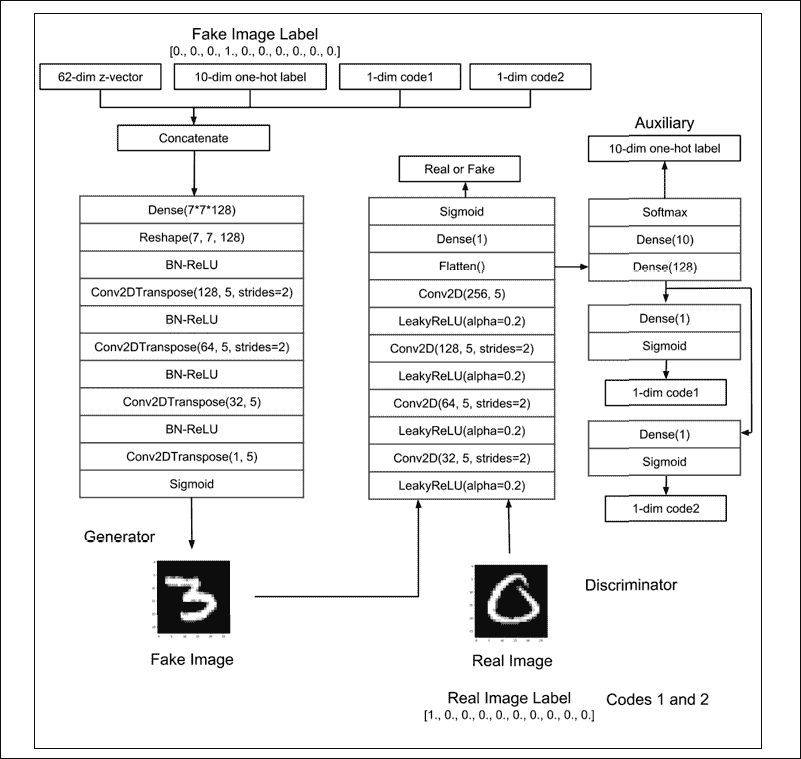

图 6.1.4：InfoGAN Keras 模型

建立判别器和对抗模型还需要进行许多更改。 更改取决于所使用的损失函数。 原始的判别器损失函数`binary_crossentropy`，用于离散码的`categorical_crossentropy`和每个连续码的`mi_loss`函数构成了整体损失函数。 除`mi_loss`函数的权重为 0.5（对应于连续代码的`λ = 0.5`）外，每个损失函数的权重均为 1.0。

“列表 6.1.3”突出显示了所做的更改。 但是，我们应该注意，通过使用构造器函数，判别器被实例化为：

```py
 # call discriminator builder with 4 outputs:
    # source, label, and 2 codes
    discriminator = gan.discriminator(inputs,
                                      num_labels=num_labels,
                                      num_codes=2) 
```

生成器通过以下方式创建：

```py
 # call generator with inputs, 
    # labels and codes as total inputs to generator
    generator = gan.generator(inputs,
                              image_size,
                              labels=labels,
                              codes=[code1, code2]) 
```

“列表 6.1.3”：`infogan-mnist-6.1.1.py`

以下代码演示了互信息损失函数以及建立和训练 InfoGAN 判别器和对抗网络的过程：

```py
def mi_loss(c, q_of_c_given_x):
    """ Mutual information, Equation 5 in [2],
        assuming H(c) is constant
    """
    # mi_loss = -c * log(Q(c|x))
    return K.mean(-K.sum(K.log(q_of_c_given_x + K.epsilon()) * c,
                               axis=1)) 
```

```py
def build_and_train_models(latent_size=100):
    """Load the dataset, build InfoGAN discriminator,
    generator, and adversarial models.
    Call the InfoGAN train routine.
    """ 
```

```py
 # load MNIST dataset
    (x_train, y_train), (_, _) = mnist.load_data() 
```

```py
 # reshape data for CNN as (28, 28, 1) and normalize
    image_size = x_train.shape[1]
    x_train = np.reshape(x_train, [-1, image_size, image_size, 1])
    x_train = x_train.astype('float32') / 255 
```

```py
 # train labels
    num_labels = len(np.unique(y_train))
    y_train = to_categorical(y_train) 
```

```py
 model_name = "infogan_mnist"
    # network parameters
    batch_size = 64
    train_steps = 40000
    lr = 2e-4
    decay = 6e-8
    input_shape = (image_size, image_size, 1)
    label_shape = (num_labels, )
    code_shape = (1, ) 
```

```py
 # build discriminator model
    inputs = Input(shape=input_shape, name='discriminator_input')
    # call discriminator builder with 4 outputs: 
    # source, label, and 2 codes
    discriminator = gan.discriminator(inputs,
                                      num_labels=num_labels,
                                      num_codes=2)
    # [1] uses Adam, but discriminator converges easily with RMSprop
    optimizer = RMSprop(lr=lr, decay=decay)
    # loss functions: 1) probability image is real
    # (binary crossentropy)
    # 2) categorical cross entropy image label,
    # 3) and 4) mutual information loss
    loss = ['binary_crossentropy',
            'categorical_crossentropy',
            mi_loss,
            mi_loss]
    # lamda or mi_loss weight is 0.5
    loss_weights = [1.0, 1.0, 0.5, 0.5]
    discriminator.compile(loss=loss,
                          loss_weights=loss_weights,
                          optimizer=optimizer,
                          metrics=['accuracy'])
    discriminator.summary() 
```

```py
 # build generator model
    input_shape = (latent_size, )
    inputs = Input(shape=input_shape, name='z_input')
    labels = Input(shape=label_shape, name='labels')
    code1 = Input(shape=code_shape, name="code1")
    code2 = Input(shape=code_shape, name="code2")
    # call generator with inputs, 
    # labels and codes as total inputs to generator
    generator = gan.generator(inputs,
                              image_size,
                              labels=labels,
                              codes=[code1, code2])
    generator.summary() 
```

```py
 # build adversarial model = generator + discriminator
    optimizer = RMSprop(lr=lr*0.5, decay=decay*0.5)
    discriminator.trainable = False
    # total inputs = noise code, labels, and codes
    inputs = [inputs, labels, code1, code2]
    adversarial = Model(inputs,
                        discriminator(generator(inputs)),
                        name=model_name)
    # same loss as discriminator
    adversarial.compile(loss=loss,
                        loss_weights=loss_weights,
                        optimizer=optimizer,
                        metrics=['accuracy'])
    adversarial.summary() 
```

```py
 # train discriminator and adversarial networks
    models = (generator, discriminator, adversarial)
    data = (x_train, y_train)
    params = (batch_size,
              latent_size,
              train_steps,
              num_labels,
              model_name)
    train(models, data, params) 
```

就训练而言，我们可以看到 InfoGAN 与 ACGAN 类似，除了我们需要为连续代码提供`c`。`c`是从正态分布中提取的，标准差为 0.5，平均值为 0.0。 我们将对伪数据使用随机采样的标签，对实际数据使用数据集的类标签来表示离散的潜在代码。

“列表 6.1.4”突出显示了对训练函数所做的更改。 与以前的所有 GAN 相似，判别器和生成器（通过对抗性训练）被交替训练。 在对抗训练期间，判别器的权重被冻结。

通过使用`gan.py plot_images()`函数，样本生成器输出图像每 500 个间隔步被保存一次。

“列表 6.1.4”：`infogan-mnist-6.1.1.py`

```py
def train(models, data, params):
    """Train the Discriminator and Adversarial networks 
```

```py
 Alternately train discriminator and adversarial networks by batch.
    Discriminator is trained first with real and fake images,
    corresponding one-hot labels and continuous codes.
    Adversarial is trained next with fake images pretending 
    to be real, corresponding one-hot labels and continous codes.
    Generate sample images per save_interval. 
```

```py
 # Arguments
        models (Models): Generator, Discriminator, Adversarial models
        data (tuple): x_train, y_train data
        params (tuple): Network parameters
    """
    # the GAN models
    generator, discriminator, adversarial = models
    # images and their one-hot labels
    x_train, y_train = data
    # network parameters
    batch_size, latent_size, train_steps, num_labels, model_name = \
            params
    # the generator image is saved every 500 steps
    save_interval = 500
    # noise vector to see how the generator output 
    # evolves during training
    noise_input = np.random.uniform(-1.0,
                                    1.0,
                                    size=[16, latent_size])
    # random class labels and codes
    noise_label = np.eye(num_labels)[np.arange(0, 16) % num_labels]
    noise_code1 = np.random.normal(scale=0.5, size=[16, 1])
    noise_code2 = np.random.normal(scale=0.5, size=[16, 1])
    # number of elements in train dataset
    train_size = x_train.shape[0]
    print(model_name,
          "Labels for generated images: ",
          np.argmax(noise_label, axis=1)) 
```

```py
 for i in range(train_steps):
        # train the discriminator for 1 batch
        # 1 batch of real (label=1.0) and fake images (label=0.0)
        # randomly pick real images and 
        # corresponding labels from dataset 
        rand_indexes = np.random.randint(0,
                                         train_size,
                                         size=batch_size)
        real_images = x_train[rand_indexes]
        real_labels = y_train[rand_indexes]
        # random codes for real images
        real_code1 = np.random.normal(scale=0.5,
                                      size=[batch_size, 1])
        real_code2 = np.random.normal(scale=0.5,
                                      size=[batch_size, 1])
        # generate fake images, labels and codes
        noise = np.random.uniform(-1.0,
                                  1.0,
                                  size=[batch_size, latent_size])
        fake_labels = np.eye(num_labels)[np.random.choice(num_labels,
                                                          batch_size)]
        fake_code1 = np.random.normal(scale=0.5,
                                      size=[batch_size, 1])
        fake_code2 = np.random.normal(scale=0.5,
                                      size=[batch_size, 1])
        inputs = [noise, fake_labels, fake_code1, fake_code2]
        fake_images = generator.predict(inputs)
        # real + fake images = 1 batch of train data
        x = np.concatenate((real_images, fake_images))
        labels = np.concatenate((real_labels, fake_labels))
        codes1 = np.concatenate((real_code1, fake_code1))
        codes2 = np.concatenate((real_code2, fake_code2))
        # label real and fake images
        # real images label is 1.0
        y = np.ones([2 * batch_size, 1])
        # fake images label is 0.0
        y[batch_size:, :] = 0
        # train discriminator network, 
        # log the loss and label accuracy
        outputs = [y, labels, codes1, codes2]
        # metrics = ['loss', 'activation_1_loss', 'label_loss',
        # 'code1_loss', 'code2_loss', 'activation_1_acc',
        # 'label_acc', 'code1_acc', 'code2_acc']
        # from discriminator.metrics_names
        metrics = discriminator.train_on_batch(x, outputs)
        fmt = "%d: [discriminator loss: %f, label_acc: %f]"
        log = fmt % (i, metrics[0], metrics[6])
        # train the adversarial network for 1 batch
        # 1 batch of fake images with label=1.0 and
        # corresponding one-hot label or class + random codes
        # since the discriminator weights are frozen 
        # in adversarial network only the generator is trained
        # generate fake images, labels and codes
        noise = np.random.uniform(-1.0,
                                  1.0,
                                  size=[batch_size, latent_size])
        fake_labels = np.eye(num_labels)[np.random.choice(num_labels,
                                                          batch_size)]
        fake_code1 = np.random.normal(scale=0.5,
                                      size=[batch_size, 1])
        fake_code2 = np.random.normal(scale=0.5,
                                      size=[batch_size, 1])
        # label fake images as real
        y = np.ones([batch_size, 1])
        # train the adversarial network 
        # note that unlike in discriminator training,
        # we do not save the fake images in a variable
        # the fake images go to the discriminator
        # input of the adversarial for classification
        # log the loss and label accuracy
        inputs = [noise, fake_labels, fake_code1, fake_code2]
        outputs = [y, fake_labels, fake_code1, fake_code2]
        metrics  = adversarial.train_on_batch(inputs, outputs)
        fmt = "%s [adversarial loss: %f, label_acc: %f]"
        log = fmt % (log, metrics[0], metrics[6])
        print(log)
        if (i + 1) % save_interval == 0:
            # plot generator images on a periodic basis
            gan.plot_images(generator,
                            noise_input=noise_input,
                            noise_label=noise_label,
                            noise_codes=[noise_code1, noise_code2],
                            show=False,
                            step=(i + 1),
                            model_name=model_name)
    # save the model after training the generator
    # the trained generator can be reloaded for
    # future MNIST digit generation
    generator.save(model_name + ".h5") 
```

给定 InfoGAN 的`tf.keras`实现，下一个部分介绍具有解缠结属性的生成器 MNIST 输出。

## InfoGAN 的生成器输出

与以前提供给我们的所有 GAN 相似，我们已经对 InfoGAN 进行了 40,000 步的训练。 训练完成后，我们可以运行 InfoGAN 生成器，以使用`infogan_mnist.h5`文件中保存的模型生成新输出。 进行以下验证：

1.  通过将离散标签从 0 更改为 9，可生成数字 0 至 9。 两个连续代码都设置为零。 结果显示在“图 6.1.5”中。 我们可以看到，InfoGAN 离散代码可以控制生成器产生的数字：

    ```py
    python3 infogan-mnist-6.1.1.py --generator=infogan_mnist.h5
    --digit=0 --code1=0 --code2=0 
    ```

    至

    ```py
    python3 infogan-mnist-6.1.1.py --generator=infogan_mnist.h5
    --digit=9 --code1=0 --code2=0 
    ```

    在“图 6.1.5”中，我们可以看到 InfoGAN 生成的图像：

    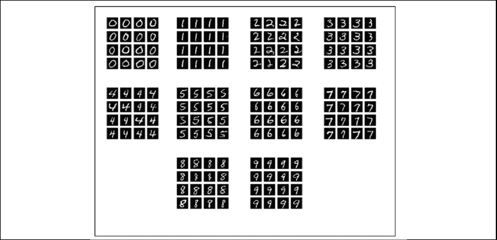

    图 6.1.5：当离散代码从 0 变为 9 时，InfoGAN 生成的图像都被设置为零。

2.  检查第一个连续代码的效果，以了解哪个属性已受到影响。 我们将 0 到 9 的第一个连续代码从 -2.0 更改为 2.0。 第二个连续代码设置为 0.0。 “图 6.1.6”显示了第一个连续代码控制数字的粗细：

    ```py
    python3 infogan-mnist-6.1.1.py --generator=infogan_mnist.h5
    --digit=0 --code1=0 --code2=0 --p1 
    ```

    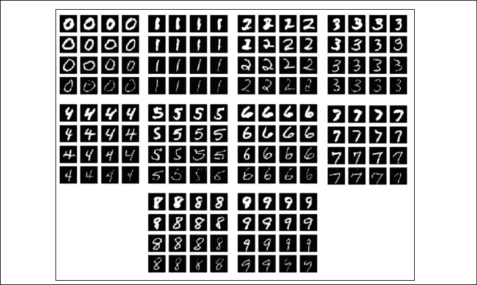

    图 6.1.6：InfoGAN 作为第一个连续代码将 0 到 9 的数字从-2.0 更改为 2.0。第二个连续代码设置为零。 第一个连续代码控制数字的粗细

3.  与上一步的类似，但更多地关注第二个连续代码。“图 6.1.7”显示第二个连续代码控制书写样式的旋转角度（倾斜）：

    ```py
    python3 infogan-mnist-6.1.1.py --generator=infogan_mnist.h5
    --digit=0 --code1=0 --code2=0 --p2 
    ```

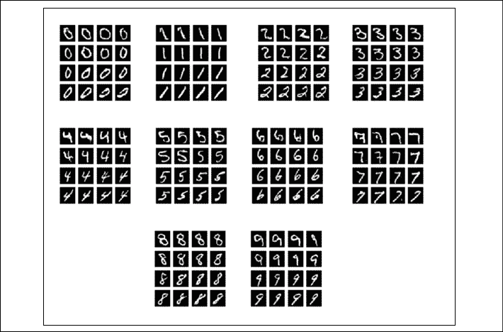

图 6.1.7：InfoGAN 生成的图像作为第二个连续代码从 0 到 9 的数字从 -2.0 变为 2.0。第一个连续代码设置为零。 第二个连续代码控制书写样式的旋转角度（倾斜）

从这些验证结果中，我们可以看到，除了生成 MNIST 外观数字的能力之外，InfoGAN 还扩展了条件 GAN（如 CGAN 和 ACGAN）的功能。 网络自动学习了两个可以控制生成器输出的特定属性的任意代码。 有趣的是，如果我们将连续代码的数量增加到 2 以上，可以控制哪些附加属性，可以通过将“列表 6.1.1”的突出显示行中的代码扩展到列表 6.1.4 来实现。

本节中的结果表明，可以通过最大化代码和数据分布之间的互信息来纠缠生成器输出的属性。 在以下部分中，介绍了一种不同的解缠结方法。 StackedGAN 的想法是在特征级别注入代码。

# 2\. StackedGAN

与 InfoGAN 一样，StackedGAN 提出了一种用于分解潜在表示的方法，以调节生成器输出。 但是，StackedGAN 使用不同的方法来解决此问题。 与其学习如何调节噪声以产生所需的输出，不如将 StackedGAN 分解为 GAN 栈。 每个 GAN 均以通常的区分对手的方式进行独立训练，并带有自己的潜在代码。

“图 6.2.1”向我们展示了 StackedGAN 在假设名人脸生成的背景下如何工作，假设已经训练了*编码器*网络对名人脸进行分类：


图 6.2.1：在名人脸生成的背景下 StackedGAN 的基本思想。 假设有一个假设的深层编码器网络可以对名人脸进行分类，那么 StackedGAN 可以简单地反转编码器的过程

*编码器*网络是由一堆简单的编码器组成的，`Encoder[i]`，其中`i = 0 … n-1`对应`n`个特征。 每个编码器都提取某些面部特征。 例如，`Encoder[0]`可能是发型特征的编码器，`Feature[1]`。 所有简单的编码器都有助于使整个*编码器*执行正确的预测。

StackedGAN 背后的想法是，如果我们想构建一个可生成假名人面孔的 GAN，则只需将*编码器*反转即可。 StackedGAN 由一堆更简单的 GAN 组成，`GAN[i]`，其中`i = 0 … n-1`与`n`个特征相对应。 每个`GAN[i]`学会反转其相应编码器`Encoder[i]`的过程。 例如，`GAN[0]`从假发型特征生成假名人脸，这是`Encoder[0]`处理的逆过程。

每个`GAN[i]`使用潜码`z[i]`，以调节其生成器输出。 例如，潜在代码`z[0]`可以将发型从卷曲更改为波浪形。 GAN 的栈也可以用作合成假名人面孔的对象，从而完成整个*编码器*的逆过程。 每个`GAN[i]`，`z[i]`的潜在代码都可以用来更改假名人面孔的特定属性。

有了 StackedGAN 的工作原理的关键思想，让我们继续下一节，看看如何在`tf.keras`中实现它。

## Keras 中 StackedGAN 的实现

StackedGAN 的详细网络模型可以在“图 6.2.2”中看到。 为简洁起见，每个栈仅显示两个编码器 GAN。 该图最初可能看起来很复杂，但这只是一个编码器 GAN 的重复，这意味着如果我们了解如何训练一个编码器 GAN，其余的将使用相同的概念。

在本节中，我们假设 StackedGAN 是为 MNIST 数字生成而设计的。

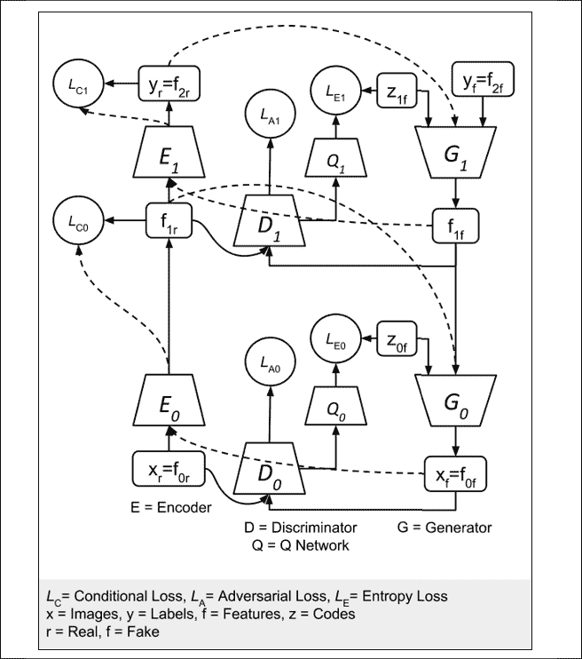

图 6.2.2：StackedGAN 包含编码器和 GAN 的栈。 对编码器进行预训练以执行分类。 `Generator[1]`，`G[1]`学会合成特征`f[1f]`，假标签`y[f]`和潜在代码`z[1f]`。 `Generator[0]`，`G[0]`均使用这两个伪特征`f[1f]`生成伪图像和潜在代码`z[0f]`。

StackedGAN 以*编码器*开头。 它可能是训练有素的分类器，可以预测正确的标签。 可以将中间特征向量`f[1r]`用于 GAN 训练。 对于 MNIST，我们可以使用基于 CNN 的分类器，类似于在“第 1 章”，“Keras 高级深度学习”中讨论的分类器。

“图 6.2.3”显示了*编码器*及其在`tf.keras`中的网络模型实现：


图 6.2.3：StackedGAN 中的编码器是一个基于 CNN 的简单分类器

“列表 6.2.1”显示了上图的`tf.keras`代码。 它与“第 1 章”，“Keras 高级深度学习”中的基于 CNN 的分类器相似，不同之处在于，我们使用`Dense`层来提取`256-dim` 特征。 有两个输出模型，`Encoder[0]`和`Encoder[1]`。 两者都将用于训练 StackedGAN。

“列表 6.2.1”：`stackedgan-mnist-6.2.1.py`

```py
def build_encoder(inputs, num_labels=10, feature1_dim=256):
    """ Build the Classifier (Encoder) Model sub networks 
```

```py
 Two sub networks: 
    1) Encoder0: Image to feature1 (intermediate latent feature)
    2) Encoder1: feature1 to labels 
```

```py
 # Arguments
        inputs (Layers): x - images, feature1 - 
            feature1 layer output
        num_labels (int): number of class labels
        feature1_dim (int): feature1 dimensionality 
```

```py
 # Returns
        enc0, enc1 (Models): Description below 
    """
    kernel_size = 3
    filters = 64 
```

```py
 x, feature1 = inputs
    # Encoder0 or enc0
    y = Conv2D(filters=filters,
               kernel_size=kernel_size,
               padding='same',
               activation='relu')(x)
    y = MaxPooling2D()(y)
    y = Conv2D(filters=filters,
               kernel_size=kernel_size,
               padding='same',
               activation='relu')(y)
    y = MaxPooling2D()(y)
    y = Flatten()(y)
    feature1_output = Dense(feature1_dim, activation='relu')(y) 
```

```py
 # Encoder0 or enc0: image (x or feature0) to feature1 
    enc0 = Model(inputs=x, outputs=feature1_output, name="encoder0") 
```

```py
 # Encoder1 or enc1
    y = Dense(num_labels)(feature1)
    labels = Activation('softmax')(y)
    # Encoder1 or enc1: feature1 to class labels (feature2)
    enc1 = Model(inputs=feature1, outputs=labels, name="encoder1") 
```

```py
 # return both enc0 and enc1
    return enc0, enc1 
```

`Encoder[0]`输出`f[1r]`是我们想要的`256`维特征向量*生成器* 1 学习合成。 可以将用作`Encoder[0]`，`E[0]`的辅助输出。 训练整个*编码器*以对 MNIST 数字进行分类，即`x[r]`。 正确的标签`y[r]`由`Encoder[1]`，`E[1]`。 在此过程中，学习了的中间特征集`f[1r]`，可用于`Generator[0]`训练。 当针对该编码器训练 GAN 时，下标`r`用于强调和区分真实数据与伪数据。

假设*编码器*输入（`x[r]`）中间特征（`f[1r]`）和标签（`y[r]`），每个 GAN 都采用通常的区分-对抗方式进行训练。 损失函数由“表 6.2.1”中的“公式 6.2.1”至“公式 6.2.5”给出。“公式 6.2.1”和“公式 6.2.2”是通用 GAN 的常见损失函数。 StackedGAN 具有两个附加损失函数，即**有条件**和**熵**。

| **网络** | **损失函数** | **编号** |
| --- | --- | --- |
| GAN | 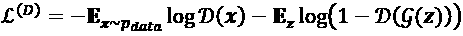 | 4.1.1 |
| | 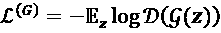 | 4.1.5 |
| 栈式 | 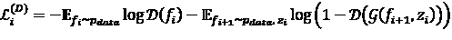 | 6.2.1 |
| | 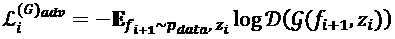 | 6.2.2 |
| | 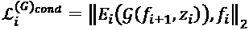 | 6.2.3 |
| | 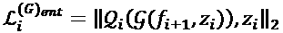 | 6.2.4 |
| | 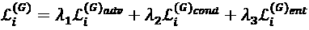 | 6.2.5 |
| | 其中`λ1, λ2, λ3`是权重，`i`是编码器和 GAN ID | |

表 6.2.1：GAN 和 StackedGAN 的损失函数之间的比较。 `~p_data`表示从相应的编码器数据（输入，特征或输出）采样

条件“公式 6.2.3”中的损失函数`L_i^(G_cond)`确保生成器不会忽略输入`f[i + 1]`， 当从输入噪声代码`z[i]`合成输出`f[i]`时。 编码器`Encoder[i]`必须能够通过反转生成器的过程`Generator[i]`来恢复生成器输入。 通过`L2`或欧几里德距离（**均方误差**（**MSE**））来测量生成器输入和使用编码器恢复的输入之间的差异。

“图 6.2.4”显示了`L_0^(G_cond)`计算所涉及的网络元素：

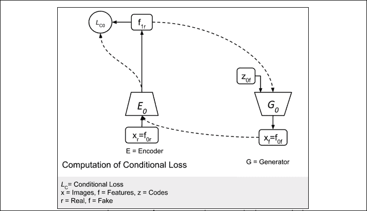

图 6.2.4：图 6.2.3 的简化版本，仅显示`L_0^(G_cond)`计算中涉及的网络元素

但是，条件损失函数引入了一个新问题。 生成器忽略输入噪声代码`z[i]`，仅依赖`f[i + 1]`。 熵损失函数“公式 6.2.4”中的`L_0^(G_ent)`确保生成器不会忽略噪声代码`z[i]`。 *Q 网络*从生成器的输出中恢复噪声代码。 恢复的噪声和输入噪声之间的差异也通过`L2`或欧几里德距离（MSE）进行测量。

“图 6.2.5”显示了`L_0^(G_ent)`计算中涉及的网络元素：

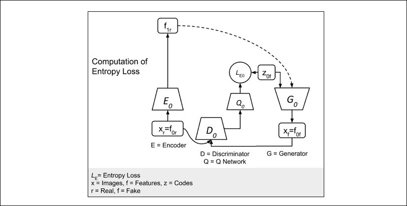

图 6.2.5：图 6.2.3 的简单版本仅向我们显示了`L_0^(G_ent)`计算中涉及的网络元素

最后的损失函数类似于通常的 GAN 损失。 它包括判别器损失`L_i^(D)`和生成器（通过对抗性）损失`L_i^(G_adv)`。“图 6.2.6”显示了 GAN 损失所涉及的元素。

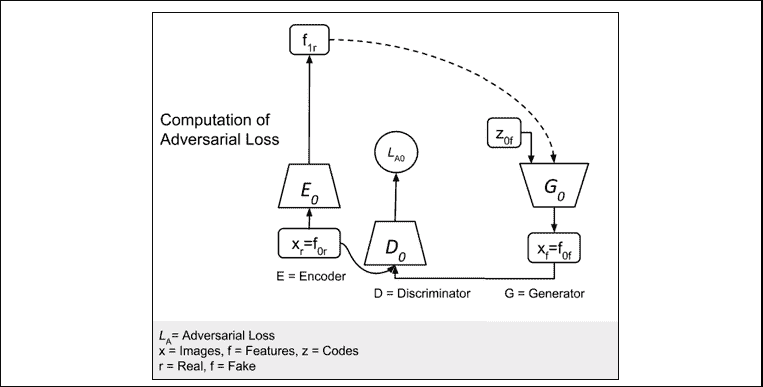

图 6.2.6：图 6.2.3 的简化版本，仅显示了`L_i^(D)`和`L_0^(G_adv)`计算中涉及的网络元素

在“公式 6.2.5”中，三个生成器损失函数的加权和为最终生成器损失函数。 在我们将要介绍的 Keras 代码中，除的熵损失设置为 10.0 之外，所有权重都设置为 1.0。 在“公式 6.2.1”至“公式 6.2.5”中，`i`是指编码器和 GAN 组 ID 或级别。 在原始论文中，首先对网络进行独立训练，然后进行联合训练。 在独立训练期间，编码器将首先进行训练。 在联合训练期间，将使用真实数据和虚假数据。

`tf.keras`中 StackedGAN 生成器和判别器的实现只需进行少量更改即可提供辅助点来访问中间特征。“图 6.2.7”显示了生成器`tf.keras`模型。

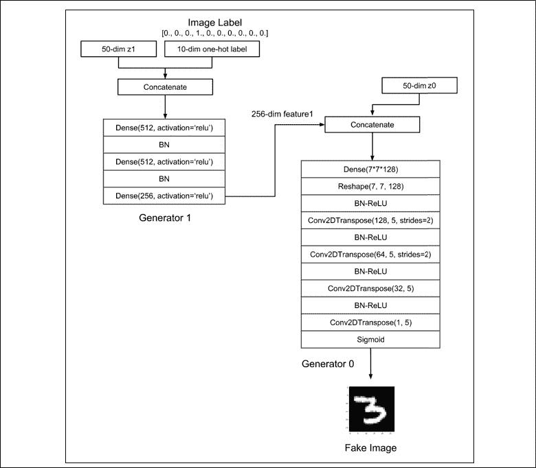

图 6.2.7：Keras 中的 StackedGAN 生成器模型

“列表 6.2.2”说明了构建与`Generator[0]`和`Generator[1]`相对应的两个生成器（`gen0`和`gen1`）的函数。 `gen1`生成器由三层`Dense`层组成，标签为和噪声代码`z[1f]`作为输入。 第三层生成伪造的`f[1f]`特征。 `gen0`生成器类似于我们介绍的其他 GAN 生成器，可以使用`gan.py`中的生成器生成器实例化：

```py
# gen0: feature1 + z0 to feature0 (image)
gen0 = gan.generator(feature1, image_size, codes=z0) 
```

`gen0`输入为`f[1]`特征，并且噪声代码为`z[0]`。 输出是生成的伪图像`x[f]`：

“列表 6.2.2”：`stackedgan-mnist-6.2.1.py`

```py
def build_generator(latent_codes, image_size, feature1_dim=256):
    """Build Generator Model sub networks 
```

```py
 Two sub networks: 1) Class and noise to feature1 
        (intermediate feature)
        2) feature1 to image 
```

```py
 # Arguments
        latent_codes (Layers): dicrete code (labels),
            noise and feature1 features
        image_size (int): Target size of one side
            (assuming square image)
        feature1_dim (int): feature1 dimensionality 
```

```py
 # Returns
        gen0, gen1 (Models): Description below
    """ 
```

```py
 # Latent codes and network parameters
    labels, z0, z1, feature1 = latent_codes
    # image_resize = image_size // 4
    # kernel_size = 5
    # layer_filters = [128, 64, 32, 1] 
```

```py
 # gen1 inputs
    inputs = [labels, z1]      # 10 + 50 = 62-dim
    x = concatenate(inputs, axis=1)
    x = Dense(512, activation='relu')(x)
    x = BatchNormalization()(x)
    x = Dense(512, activation='relu')(x)
    x = BatchNormalization()(x)
    fake_feature1 = Dense(feature1_dim, activation='relu')(x)
    # gen1: classes and noise (feature2 + z1) to feature1
    gen1 = Model(inputs, fake_feature1, name='gen1') 
```

```py
 # gen0: feature1 + z0 to feature0 (image)
    gen0 = gan.generator(feature1, image_size, codes=z0) 
```

```py
 return gen0, gen1 
```

“图 6.2.8”显示了判别器`tf.keras`模型：

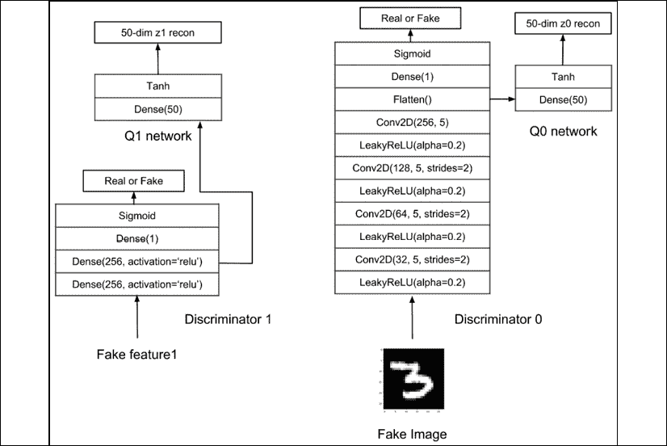

图 6.2.8：Keras 中的 StackedGAN 判别器模型

我们提供函数来构建`Discriminator[0]`和`Discriminator[1]`（`dis0`和`dis1`）。 `dis0`判别器类似于 GAN 判别器，除了特征向量输入和辅助网络`Q[0]`，其恢复`z[0]`。 `gan.py`中的构造器函数用于创建`dis0`：

```py
dis0 = gan.discriminator(inputs, num_codes=z_dim) 
```

`dis1`判别器由三层 MLP 组成，如清单 6.2.3 所示。 最后一层将区分为真假`f[1]`。`Q[1]`网络共享`dis1`的前两层。 其第三层回收`z[1]`。

“列表 6.2.3”：`stackedgan-mnist-6.2.1.py`

```py
def build_discriminator(inputs, z_dim=50):
    """Build Discriminator 1 Model 
```

```py
 Classifies feature1 (features) as real/fake image and recovers
    the input noise or latent code (by minimizing entropy loss) 
```

```py
 # Arguments
        inputs (Layer): feature1
        z_dim (int): noise dimensionality 
```

```py
 # Returns
        dis1 (Model): feature1 as real/fake and recovered latent code
    """ 
```

```py
 # input is 256-dim feature1
    x = Dense(256, activation='relu')(inputs)
    x = Dense(256, activation='relu')(x) 
```

```py
 # first output is probability that feature1 is real
    f1_source = Dense(1)(x)
    f1_source = Activation('sigmoid',
                           name='feature1_source')(f1_source) 
```

```py
 # z1 reonstruction (Q1 network)
    z1_recon = Dense(z_dim)(x)
    z1_recon = Activation('tanh', name='z1')(z1_recon) 
```

```py
 discriminator_outputs = [f1_source, z1_recon]
    dis1 = Model(inputs, discriminator_outputs, name='dis1')
    return dis1 
```

有了所有可用的构建器函数，StackedGAN 就会在“列表 6.2.4”中进行组装。 在训练 StackedGAN 之前，对编码器进行了预训练。 请注意，我们已经在对抗模型训练中纳入了三个生成器损失函数（对抗，条件和熵）。`Q`网络与判别器模型共享一些公共层。 因此，其损失函数也被纳入判别器模型训练中。

“列表 6.2.4”：`stackedgan-mnist-6.2.1.py`

```py
def build_and_train_models():
    """Load the dataset, build StackedGAN discriminator,
    generator, and adversarial models.
    Call the StackedGAN train routine.
    """
    # load MNIST dataset
    (x_train, y_train), (x_test, y_test) = mnist.load_data() 
```

```py
 # reshape and normalize images
    image_size = x_train.shape[1]
    x_train = np.reshape(x_train, [-1, image_size, image_size, 1])
    x_train = x_train.astype('float32') / 255 
```

```py
 x_test = np.reshape(x_test, [-1, image_size, image_size, 1])
    x_test = x_test.astype('float32') / 255 
```

```py
 # number of labels
    num_labels = len(np.unique(y_train))
    # to one-hot vector
    y_train = to_categorical(y_train)
    y_test = to_categorical(y_test) 
```

```py
 model_name = "stackedgan_mnist"
    # network parameters
    batch_size = 64
    train_steps = 10000
    lr = 2e-4
    decay = 6e-8
    input_shape = (image_size, image_size, 1)
    label_shape = (num_labels, )
    z_dim = 50
    z_shape = (z_dim, )
    feature1_dim = 256
    feature1_shape = (feature1_dim, ) 
```

```py
 # build discriminator 0 and Q network 0 models
    inputs = Input(shape=input_shape, name='discriminator0_input')
    dis0 = gan.discriminator(inputs, num_codes=z_dim)
    # [1] uses Adam, but discriminator converges easily with RMSprop
    optimizer = RMSprop(lr=lr, decay=decay)
    # loss fuctions: 1) probability image is real (adversarial0 loss)
    # 2) MSE z0 recon loss (Q0 network loss or entropy0 loss)
    loss = ['binary_crossentropy', 'mse']
    loss_weights = [1.0, 10.0]
    dis0.compile(loss=loss,
                 loss_weights=loss_weights,
                 optimizer=optimizer,
                 metrics=['accuracy'])
    dis0.summary() # image discriminator, z0 estimator 
```

```py
 # build discriminator 1 and Q network 1 models
    input_shape = (feature1_dim, )
    inputs = Input(shape=input_shape, name='discriminator1_input')
    dis1 = build_discriminator(inputs, z_dim=z_dim )
    # loss fuctions: 1) probability feature1 is real 
    # (adversarial1 loss)
    # 2) MSE z1 recon loss (Q1 network loss or entropy1 loss)
    loss = ['binary_crossentropy', 'mse']
    loss_weights = [1.0, 1.0]
    dis1.compile(loss=loss,
                 loss_weights=loss_weights,
                 optimizer=optimizer,
                 metrics=['accuracy'])
    dis1.summary() # feature1 discriminator, z1 estimator 
```

```py
 # build generator models
    feature1 = Input(shape=feature1_shape, name='feature1_input')
    labels = Input(shape=label_shape, name='labels')
    z1 = Input(shape=z_shape, name="z1_input")
    z0 = Input(shape=z_shape, name="z0_input")
    latent_codes = (labels, z0, z1, feature1)
    gen0, gen1 = build_generator(latent_codes, image_size)
    gen0.summary() # image generator
    gen1.summary() # feature1 generator 
```

```py
 # build encoder models
    input_shape = (image_size, image_size, 1)
    inputs = Input(shape=input_shape, name='encoder_input')
    enc0, enc1 = build_encoder((inputs, feature1), num_labels)
    enc0.summary() # image to feature1 encoder
    enc1.summary() # feature1 to labels encoder (classifier)
    encoder = Model(inputs, enc1(enc0(inputs)))
    encoder.summary() # image to labels encoder (classifier) 
```

```py
 data = (x_train, y_train), (x_test, y_test)
    train_encoder(encoder, data, model_name=model_name) 
```

```py
 # build adversarial0 model =
    # generator0 + discriminator0 + encoder0
    optimizer = RMSprop(lr=lr*0.5, decay=decay*0.5)
    # encoder0 weights frozen
    enc0.trainable = False
    # discriminator0 weights frozen
    dis0.trainable = False
    gen0_inputs = [feature1, z0]
    gen0_outputs = gen0(gen0_inputs)
    adv0_outputs = dis0(gen0_outputs) + [enc0(gen0_outputs)]
    # feature1 + z0 to prob feature1 is 
    # real + z0 recon + feature0/image recon
    adv0 = Model(gen0_inputs, adv0_outputs, name="adv0")
    # loss functions: 1) prob feature1 is real (adversarial0 loss)
    # 2) Q network 0 loss (entropy0 loss)
    # 3) conditional0 loss
    loss = ['binary_crossentropy', 'mse', 'mse']
    loss_weights = [1.0, 10.0, 1.0]
    adv0.compile(loss=loss,
                 loss_weights=loss_weights,
                 optimizer=optimizer,
                 metrics=['accuracy'])
    adv0.summary() 
```

```py
 # build adversarial1 model = 
    # generator1 + discriminator1 + encoder1
    # encoder1 weights frozen
    enc1.trainable = False
    # discriminator1 weights frozen
    dis1.trainable = False
    gen1_inputs = [labels, z1]
    gen1_outputs = gen1(gen1_inputs)
    adv1_outputs = dis1(gen1_outputs) + [enc1(gen1_outputs)]
    # labels + z1 to prob labels are real + z1 recon + feature1 recon
    adv1 = Model(gen1_inputs, adv1_outputs, name="adv1")
    # loss functions: 1) prob labels are real (adversarial1 loss)
    # 2) Q network 1 loss (entropy1 loss)
    # 3) conditional1 loss (classifier error)
    loss_weights = [1.0, 1.0, 1.0]
    loss = ['binary_crossentropy',
            'mse',
            'categorical_crossentropy']
    adv1.compile(loss=loss,
                 loss_weights=loss_weights,
                 optimizer=optimizer,
                 metrics=['accuracy'])
    adv1.summary() 
```

```py
 # train discriminator and adversarial networks
    models = (enc0, enc1, gen0, gen1, dis0, dis1, adv0, adv1)
    params = (batch_size, train_steps, num_labels, z_dim, model_name)
    train(models, data, params) 
```

最后，训练函数与典型的 GAN 训练相似，不同之处在于我们一次只训练一个 GAN（即`GAN[0]`然后是`GAN[0]`）。 代码显示在“列表 6.2.5”中。 值得注意的是，训练顺序为：

1.  `Discriminator[1]`和`Q[1]`网络通过最小化判别器和熵损失
2.  `Discriminator[0]`和`Q[0]`网络通过最小化判别器和熵损失
3.  `Adversarial[1]`网络通过最小化对抗性，熵和条件损失

1.  `Adversarial[0]`网络通过最小化对抗性，熵和条件损失

“列表 6.2.5”：`stackedgan-mnist-6.2.1.py`

```py
def train(models, data, params):
    """Train the discriminator and adversarial Networks 
```

```py
 Alternately train discriminator and adversarial networks by batch.
    Discriminator is trained first with real and fake images,
    corresponding one-hot labels and latent codes.
    Adversarial is trained next with fake images pretending
    to be real, corresponding one-hot labels and latent codes.
    Generate sample images per save_interval. 
```

```py
 # Arguments
        models (Models): Encoder, Generator, Discriminator,
            Adversarial models
        data (tuple): x_train, y_train data
        params (tuple): Network parameters 
```

```py
 """
    # the StackedGAN and Encoder models
    enc0, enc1, gen0, gen1, dis0, dis1, adv0, adv1 = models
    # network parameters
    batch_size, train_steps, num_labels, z_dim, model_name = params
    # train dataset
    (x_train, y_train), (_, _) = data
    # the generator image is saved every 500 steps
    save_interval = 500 
```

```py
 # label and noise codes for generator testing
    z0 = np.random.normal(scale=0.5, size=[16, z_dim])
    z1 = np.random.normal(scale=0.5, size=[16, z_dim])
    noise_class = np.eye(num_labels)[np.arange(0, 16) % num_labels]
    noise_params = [noise_class, z0, z1]
    # number of elements in train dataset
    train_size = x_train.shape[0]
    print(model_name,
          "Labels for generated images: ",
          np.argmax(noise_class, axis=1)) 
```

```py
 for i in range(train_steps):
        # train the discriminator1 for 1 batch
        # 1 batch of real (label=1.0) and fake feature1 (label=0.0)
        # randomly pick real images from dataset
        rand_indexes = np.random.randint(0,
                                         train_size,
                                         size=batch_size)
        real_images = x_train[rand_indexes]
        # real feature1 from encoder0 output
        real_feature1 = enc0.predict(real_images)
        # generate random 50-dim z1 latent code
        real_z1 = np.random.normal(scale=0.5,
                                   size=[batch_size, z_dim])
        # real labels from dataset
        real_labels = y_train[rand_indexes] 
```

```py
 # generate fake feature1 using generator1 from
        # real labels and 50-dim z1 latent code
        fake_z1 = np.random.normal(scale=0.5,
                                   size=[batch_size, z_dim])
        fake_feature1 = gen1.predict([real_labels, fake_z1]) 
```

```py
 # real + fake data
        feature1 = np.concatenate((real_feature1, fake_feature1))
        z1 = np.concatenate((fake_z1, fake_z1)) 
```

```py
 # label 1st half as real and 2nd half as fake
        y = np.ones([2 * batch_size, 1])
        y[batch_size:, :] = 0 
```

```py
 # train discriminator1 to classify feature1 as
        # real/fake and recover
        # latent code (z1). real = from encoder1,
        # fake = from genenerator1
        # joint training using discriminator part of
        # advserial1 loss and entropy1 loss
        metrics = dis1.train_on_batch(feature1, [y, z1])
        # log the overall loss only
        log = "%d: [dis1_loss: %f]" % (i, metrics[0]) 
```

```py
 # train the discriminator0 for 1 batch
        # 1 batch of real (label=1.0) and fake images (label=0.0)
        # generate random 50-dim z0 latent code
        fake_z0 = np.random.normal(scale=0.5, size=[batch_size, z_dim])
        # generate fake images from real feature1 and fake z0
        fake_images = gen0.predict([real_feature1, fake_z0])
        # real + fake data
        x = np.concatenate((real_images, fake_images))
        z0 = np.concatenate((fake_z0, fake_z0))
        # train discriminator0 to classify image 
        # as real/fake and recover latent code (z0)
        # joint training using discriminator part of advserial0 loss
        # and entropy0 loss
        metrics = dis0.train_on_batch(x, [y, z0])
        # log the overall loss only (use dis0.metrics_names)
        log = "%s [dis0_loss: %f]" % (log, metrics[0]) 
```

```py
 # adversarial training 
        # generate fake z1, labels
        fake_z1 = np.random.normal(scale=0.5,
                                   size=[batch_size, z_dim])
        # input to generator1 is sampling fr real labels and
        # 50-dim z1 latent code
        gen1_inputs = [real_labels, fake_z1] 
```

```py
 # label fake feature1 as real
        y = np.ones([batch_size, 1]) 
```

```py
 # train generator1 (thru adversarial) by fooling i
        # the discriminator
        # and approximating encoder1 feature1 generator
        # joint training: adversarial1, entropy1, conditional1
        metrics = adv1.train_on_batch(gen1_inputs,
                                      [y, fake_z1, real_labels])
        fmt = "%s [adv1_loss: %f, enc1_acc: %f]"
        # log the overall loss and classification accuracy
        log = fmt % (log, metrics[0], metrics[6]) 
```

```py
 # input to generator0 is real feature1 and
        # 50-dim z0 latent code
        fake_z0 = np.random.normal(scale=0.5,
                                   size=[batch_size, z_dim])
        gen0_inputs = [real_feature1, fake_z0] 
```

```py
 # train generator0 (thru adversarial) by fooling
        # the discriminator and approximating encoder1 imag 
        # source generator joint training:
        # adversarial0, entropy0, conditional0
        metrics = adv0.train_on_batch(gen0_inputs,
                                      [y, fake_z0, real_feature1])
        # log the overall loss only
        log = "%s [adv0_loss: %f]" % (log, metrics[0]) 
```

```py
 print(log)
        if (i + 1) % save_interval == 0:
            generators = (gen0, gen1)
            plot_images(generators,
                        noise_params=noise_params,
                        show=False,
                        step=(i + 1),
                        model_name=model_name) 
```

```py
 # save the modelis after training generator0 & 1
    # the trained generator can be reloaded for
    # future MNIST digit generation
    gen1.save(model_name + "-gen1.h5")
    gen0.save(model_name + "-gen0.h5") 
```

`tf.keras`中 StackedGAN 的代码实现现已完成。 训练后，可以评估生成器的输出以检查合成 MNIST 数字的某些属性是否可以以与我们在 InfoGAN 中所做的类似的方式进行控制。

## StackedGAN 的生成器输出

在对 StackedGAN 进行 10,000 步训练之后，`Generator[0]`和`Generator[1]`模型被保存在文件中。 `Generator[0]`和`Generator[1]`堆叠在一起可以合成以标签和噪声代码`z[0]`和`z[1]`为条件的伪造图像。

StackedGAN 生成器可以通过以下方式进行定性验证：

1.  从两个噪声代码`z[0]`和`z[1]`的离散标签从 0 变到 9，从正态分布中采样，均值为 0.5，标准差为 1.0。 结果显示在“图 6.2.9”中。 我们可以看到 StackedGAN 离散代码可以控制生成器生成的数字：

    ```py
    python3 stackedgan-mnist-6.2.1.py --generator0=stackedgan_mnist-gen0.h5 --generator1=stackedgan_mnist-gen1.h5 --digit=0 
    ```

    至

    ```py
    python3 stackedgan-mnist-6.2.1.py --generator0=stackedgan_mnist-gen0.h5 --generator1=stackedgan_mnist-gen1.h5 --digit=9 
    ```

    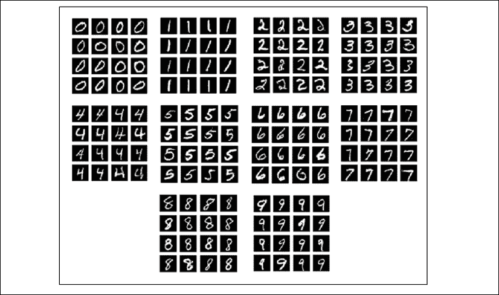

    图 6.2.9：当离散代码从 0 变为 9 时，StackedGAN 生成的图像。`z0`和`z1`均从正态分布中采样，平均值为 0，标准差为 0.5。

2.  如下所示，将第一噪声码`z[0]`从 -4.0 到 4.0 的恒定向量变为从 0 到 9 的数字。 第二噪声代码`z[1]`被设置为零向量。 “图 6.2.10”显示第一个噪声代码控制数字的粗细。 例如，对于数字 8：

    ```py
    python3 stackedgan-mnist-6.2.1.py --generator0=stackedgan_mnist-gen0.h5 --generator1=stackedgan_mnist-gen1.h5 --z0=0 --z1=0 --p0 --digit=8 
    ```

    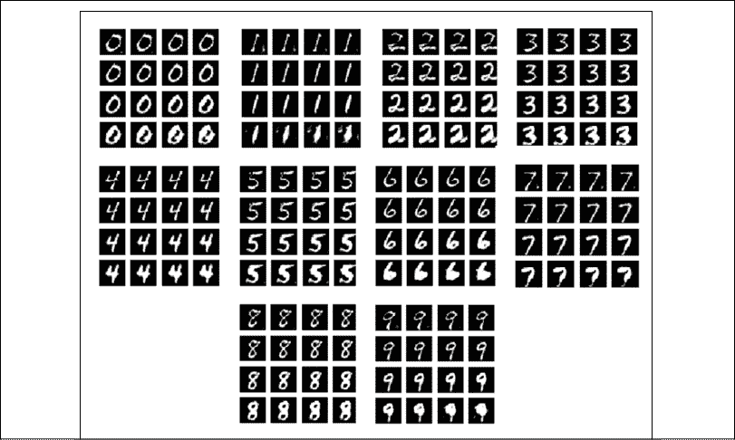

    图 6.2.10：使用 StackedGAN 作为第一个噪声代码`z0`生成的图像，对于数字 0 到 9，其向量从 -4.0 到 4.0 不变。`z0`似乎控制着每个数字的粗细。

3.  如下所示，对于数字 0 到 9，从 -1.0 到 1.0 的恒定向量变化第二噪声代码`z[1]`。 将第一噪声代码`z[0]`设置为零向量。“图 6.2.11”显示第二个噪声代码控制旋转（倾斜），并在一定程度上控制手指的粗细。 例如，对于数字 8：

    ```py
    python3 stackedgan-mnist-6.2.1.py --generator0=stackedgan_mnist-gen0.h5 --generator1=stackedgan_mnist-gen1.h5 --z0=0 --z1=0 --p1 --digit=8 
    ```

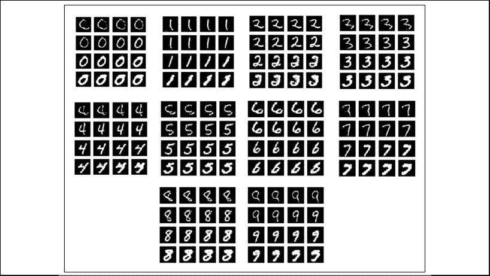

图 6.2.11：由 StackedGAN 生成的图像作为第二个噪声代码`z1`从 0 到 9 的恒定向量 -1.0 到 1.0 变化。`z1`似乎控制着每个数字的旋转（倾斜）和笔划粗细

“图 6.2.9”至“图 6.2.11”证明 StackedGAN 提供了对生成器输出属性的附加控制。 控件和属性为（标签，哪个数字），（`z0`，数字粗细）和（`z1`，数字倾斜度）。 从此示例中，我们可以控制其他可能的实验，例如：

*   从当前数量 2 增加栈中的元素数量
*   像在 InfoGAN 中一样，减小代码`z[0]`和`z[1]`的尺寸

“图 6.2.12”显示了 InfoGAN 和 StackedGAN 的潜在代码之间的区别：

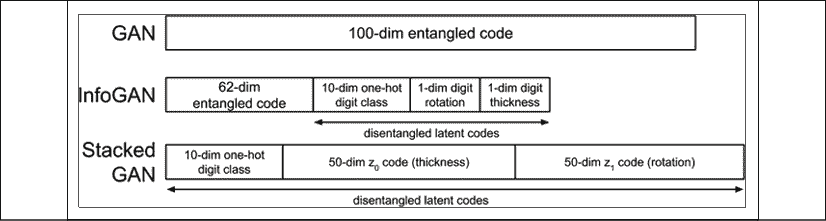

图 6.2.12：不同 GAN 的潜在表示

解开代码的基本思想是对损失函数施加约束，以使仅特定属性受代码影响。 从结构上讲，与 StackedGAN 相比，InfoGAN 更易于实现。 InfoGAN 的训练速度也更快。

# 4\. 总结

在本章中，我们讨论了如何解开 GAN 的潜在表示。 在本章的前面，我们讨论了 InfoGAN 如何最大化互信息以迫使生成器学习解纠缠的潜向量。 在 MNIST 数据集示例中，InfoGAN 使用三种表示形式和一个噪声代码作为输入。 噪声以纠缠的形式表示其余的属性。 StackedGAN 以不同的方式处理该问题。 它使用一堆编码器 GAN 来学习如何合成伪造的特征和图像。 首先对编码器进行训练，以提供特征数据集。 然后，对编码器 GAN 进行联合训练，以学习如何使用噪声代码控制生成器输出的属性。

在下一章中，我们将着手一种新型的 GAN，它能够在另一个域中生成新数据。 例如，给定马的图像，GAN 可以将其自动转换为斑马的图像。 这种 GAN 的有趣特征是无需监督即可对其进行训练，并且不需要成对的样本数据。

# 5\. 参考

1.  `Xi Chen et al.: InfoGAN: Interpretable Representation Learning by Information Maximizing Generative Adversarial Nets. Advances in Neural Information Processing Systems, 2016 (http://papers.nips.cc/paper/6399-infogan-interpretable-representation-learning-by-information-maximizing-generative-adversarial-nets.pdf).`
1.  `Xun Huang et al. Stacked Generative Adversarial Networks. IEEE Conference on Computer Vision and Pattern Recognition (CVPR). Vol. 2, 2017 (http://openaccess.thecvf.com/content_cvpr_2017/papers/Huang_Stacked_Generative_Adversarial_CVPR_2017_paper.pdf).`