# 八、变分自编码器（VAE）

与我们在之前的章节中讨论过的**生成对抗网络**（**GAN**）类似，**变分自编码器**（**VAE**）[1] 属于生成模型家族。 VAE 的生成器能够在导航其连续潜在空间的同时产生有意义的输出。 通过潜向量探索解码器输出的可能属性。

在 GAN 中，重点在于如何得出近似输入分布的模型。 VAE 尝试对可解码的连续潜在空间中的输入分布进行建模。 这是 GAN 与 VAE 相比能够生成更真实信号的可能的潜在原因之一。 例如，在图像生成中，GAN 可以生成看起来更逼真的图像，而相比之下，VAE 生成的图像清晰度较差。

在 VAE 中，重点在于潜在代码的变分推理。 因此，VAE 为潜在变量的学习和有效贝叶斯推理提供了合适的框架。 例如，带有解缠结表示的 VAE 可以将潜在代码重用于迁移学习。

在结构上，VAE 与自编码器相似。 它也由编码器（也称为识别或推理模型）和解码器（也称为生成模型）组成。 VAE 和自编码器都试图在学习潜向量的同时重建输入数据。

但是，与自编码器不同，VAE 的潜在空间是连续的，并且解码器本身被用作生成模型。

在前面各章中讨论的 GAN 讨论中，也可以对 VAE 的解码器进行调整。 例如，在 MNIST 数据集中，我们能够指定一个给定的单热向量产生的数字。 这种有条件的 VAE 类别称为 CVAE [2]。 也可以通过在损失函数中包含正则化超参数来解开 VAE 潜向量。 这称为 β-VAE [5]。 例如，在 MNIST 中，我们能够隔离确定每个数字的粗细或倾斜角度的潜向量。 本章的目的是介绍：

*   VAE 的原理
*   了解重新参数化技巧，有助于在 VAE 优化中使用随机梯度下降
*   有条件的 VAE（CVAE）和 β-VAE 的原理
*   了解如何使用`tf.keras`实现 VAE

我们将从谈论 VAE 的基本原理开始。

# 1\. VAE 原理

在生成模型中，我们经常对使用神经网络来逼近输入的真实分布感兴趣：

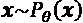 (Equation 8.1.1)

在前面的等式中，`θ`表示训练期间确定的参数。 例如，在名人面孔数据集的上下文中，这等效于找到可以绘制面孔的分布。 同样，在 MNIST 数据集中，此分布可以生成可识别的手写数字。

在机器学习中，为了执行特定级别的推理，我们有兴趣寻找`P[θ](x, z)`，这是输入`x`和潜在变量`z`之间的联合分布。 潜在变量不是数据集的一部分，而是对可从输入中观察到的某些属性进行编码。 在名人面孔的背景下，这些可能是面部表情，发型，头发颜色，性别等。 在 MNIST 数据集中，潜在变量可以表示数字和书写样式。

`P[θ](x, z)`实际上是输入数据点及其属性的分布。 `P[θ](x)`可以从边际分布计算得出：

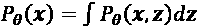 (Equation 8.1.2)

换句话说，考虑所有可能的属性，我们最终得到描述输入的分布。 在名人面孔中，如果考虑所有面部表情，发型，头发颜色和性别，将恢复描述名人面孔的分布。 在 MNIST 数据集中，如果考虑所有可能的数字，书写风格等，我们以手写数字的分布来结束。

问题在于“公式 8.1.2”很难处理。 该方程式没有解析形式或有效的估计量。 它的参数无法微分。 因此，通过神经网络进行优化是不可行的。

使用贝叶斯定理，我们可以找到“公式 8.1.2”的替代表达式：

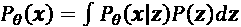 (Equation 8.1.3)

`P(z)`是`z`的先验分布。 它不以任何观察为条件。 如果`z`是离散的，而`P[θ](x | z)`是高斯分布，则`P[θ](x)`是高斯的混合。 如果`z`是连续的，则`P[θ](x)`是高斯的无限混合。

实际上，如果我们尝试在没有合适的损失函数的情况下建立一个近似`P[θ](x | z)`的神经网络，它将忽略`z`得出一个简单的解`P[θ](x | z) = P[θ](x)`。 因此，“公式 8.1.3”无法为我们提供`P[θ](x)`的良好估计。 或者，“公式 8.1.2”也可以表示为：

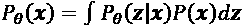 (Equation 8.1.4)

但是，`P[θ](z | x)`也很棘手。 VAE 的目标是在给定输入的情况下，找到一种可预测的分布，该分布易于估计`P[θ](z | x)`，即潜在属性`z`的条件分布的估计。

## 变分推理

为了使易于处理，VAE 引入了变化推理模型（编码器）：

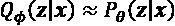 (Equation 8.1.5)

`Q[φ](z | x)`提供了`P[θ](z | x)`的良好估计。 它既参数化又易于处理。 `Q[φ](z | x)`可以通过优化参数`φ`由深度神经网络近似。 通常，`Q[φ](z | x)`被选择为多元高斯：

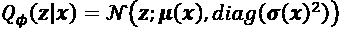 (Equation 8.1.6)

均值`μ(x)`和标准差`σ(x)`均由编码器神经网络使用输入数据点计算得出。 对角线矩阵表示`z`的元素是独立的。

在下一节中，我们将求解 VAE 的核心方程。 核心方程式将引导我们找到一种优化算法，该算法将帮助我们确定推理模型的参数。

## 核心方程

推理模型`Q[φ](z | x)`从输入`x`生成潜向量`z`。 `Q[φ](z | x)`似于自编码器模型中的编码器。 另一方面，从潜在代码`z`重构输入。 `P[θ](x | z)`的作用类似于自编码器模型中的解码器。 要估计`P[θ](x)`，我们必须确定其与`Q[φ](z | x)`和`P[θ](x | z)`的关系。

如果`Q[φ](z | x)`是`P[θ](z | x)`的估计值，则 **Kullback-Leibler**（**KL**）的差异决定了这两个条件密度之间的距离：

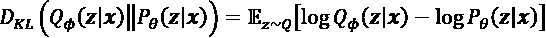 (Equation 8.1.7)

使用贝叶斯定理：

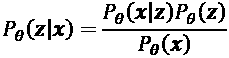 (Equation 8.1.8)

在“公式 8.1.7”中：

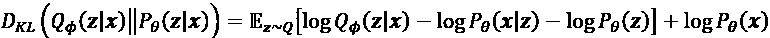 (Equation 8.1.9)

由于`log P[θ](x)`不依赖于`z ~ Q`，因此可能会超出预期。 重新排列“公式 8.1.9”并认识到：

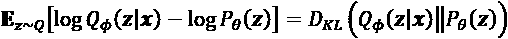，其结果是：

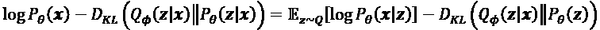 (Equation 8.1.10)

“公式 8.1.10”是 VAE 的核心。 左侧是项`P[θ](x)`，由于`Q[φ](z | x)`与真实`P[θ](z | x)`的距离，我们使误差最小化。 我们可以记得，的对数不会更改最大值（或最小值）的位置。 给定提供`P[θ](z | x)`良好估计的推断模型，`D[KL](Q[φ](z | x) || P[θ](z | x)`大约为零。

右边的第一项`P[θ](x | z)`类似于解码器，该解码器从推理模型中抽取样本以重建输入。

第二个项是另一个距离。 这次是在`Q[φ](z | x)`和先前的`P[θ](z)`之间。 “公式 8.1.10”的左侧也称为**变异下界**或**证据下界**（**ELBO**）。 由于 KL 始终为正，因此 ELBO 是`log P[θ](x)`的下限。 通过优化神经网络的参数`φ`和`θ`来最大化 ELBO 意味着：

*   在将`z`中的`x`属性编码时，`D[KL](Q[φ](z | x) || P[θ](z | x) -> 0`或推理模型变得更好。
*   右边的`log P[θ](x | z)`最大化了“公式 8.1.10”或解码器模型在从潜在向量`z`重构`x`方面变得更好。
*   在下一节中，我们将利用“公式 8.1.10”的结构来确定推理模型（编码器）和解码器的损失函数。

## 优化

“公式 8.1.10”的右侧具有有关 VAE 的`loss`函数的两个重要信息。 解码器项`E[z~Q] [log P[θ](x | z)]`表示生成器从推理模型的输出中提取`z`个样本，以重建输入。 使最大化是指我们将**重构损失**和`L_R`降到最低。 如果假设图像（数据）分布为高斯分布，则可以使用 MSE。

如果每个像素（数据）都被认为是伯努利分布，那么损失函数就是二进制互熵。

第二项`-D[KL](Q[φ](z | x) || P[θ](z))`易于评估。 根据“公式 8.1.6”，`Q[φ]`是高斯分布。 通常，`P[θ](z) = P(z) = N(0, 1)`也是平均值为零且标准差等于 1.0 的高斯。 在“公式 8.1.11”中，我们看到 KL 项简化为：

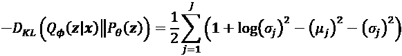 (Equation 8.1.11)

其中`J`是`z`的维。 `μ[j]`和`σ[j]`都是通过推理模型计算的`x`的函数。 要最大化：`-D[KL]`，`σ[j] -> 1`和`μ[j] -> 9`。 `P(z) = N(0, 1)`的选择源于各向同性单位高斯的性质，在具有适当函数的情况下，它可以变形为任意分布[6]。

根据“公式 8.1.11”，KL 损失`L_KL`简称为`D[KL]`。

总之，在“公式 8.1.12”中将 VAE `loss`函数定义为：

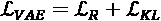 (Equation 8.1.12)

在给定编码器和解码器模型的情况下，在我们可以构建和训练 VAE（随机采样块，生成潜在属性）之前，还需要解决一个问题。 在下一节中，我们将讨论此问题以及如何使用重新参数化技巧解决它。

## 重新参数化技巧

“图 8.1.1”的左侧显示了 VAE 网络。 编码器获取输入`x`，并估计潜向量`z`的多元高斯分布的平均值`μ`和标准差`σ`。 解码器从潜向量`z`中提取样本，以将输入重构为`x_tilde`。 这似乎很简单，直到在反向传播期间发生梯度更新为止：

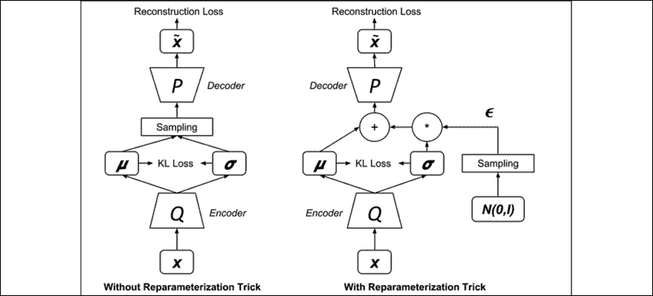

图 8.1.1：带有和不带有重新参数化技巧的 VAE 网络

反向传播梯度将不会通过随机**采样**块。 尽管具有用于神经网络的随机输入是可以的，但梯度不可能穿过随机层。

解决此问题的方法是将**采样**处理作为输入，如“图 8.1.1”右侧所示。 然后，将样本计算为：

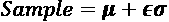 (Equation 8.1.13)

如果`ε`和`σ`以向量格式表示，则`εσ`是逐元素乘法。 使用“公式 8.1.13”，看起来好像采样直接来自潜在空间一样。 这项技术被称为*重新参数化技巧*。

现在，在输入端发生*采样*时，可以使用熟悉的优化算法（例如 SGD，Adam 或 RMSProp）来训练 VAE 网络。

在讨论如何在`tf.keras`中实现 VAE 之前，让我们首先展示如何测试经过训练的解码器。

## 解码器测试

在训练了 VAE 网络之后，可以丢弃推理模型，包括加法和乘法运算符。 为了生成新的有意义的输出，请从用于生成`ε`的高斯分布中抽取样本。“图 8.1.2”向我们展示了解码器的测试设置：

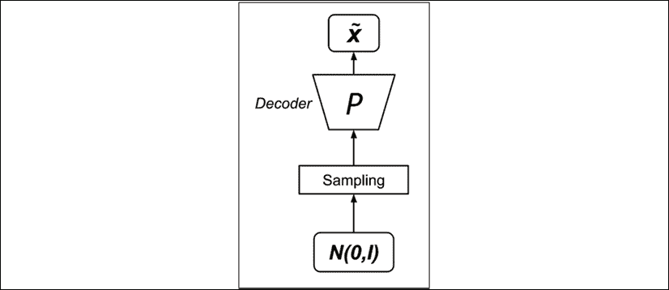

图 8.1.2：解码器测试设置

通过重新参数化技巧解决了 VAE 上的最后一个问题，我们现在可以在`tf.keras`中实现和训练变分自编码器。

## ALAS 与 Keras

VAE 的结构类似于典型的自编码器。 区别主要在于重新参数化技巧中的高斯随机变量的采样。“列表 8.1.1”显示了使用 MLP 实现的编码器，解码器和 VAE。

[此代码也已添加到官方 Keras GitHub 存储库中](https://github.com/keras-team/keras/blob/master/examples/variational_autoencoder.py)。

为便于显示潜在代码，将`z`的维设置为 2。编码器仅是两层 MLP，第二层生成均值和对数方差。 对数方差的使用是为了简化 KL 损失和重新参数化技巧的计算。 编码器的第三个输出是使用重新参数化技巧进行的`z`采样。 我们应该注意，在采样函数`exp(0.5 log σ²) = sqrt(σ²) = σ`中，因为`σ > 0`假定它是高斯分布的标准差。

解码器也是两层 MLP，它采用`z`的样本来近似输入。 编码器和解码器均使用大小为 512 的中间尺寸。

VAE 网络只是将编码器和解码器连接在一起。 `loss`函数是*重建损失*和 *KL 损失*的总和。 在默认的 Adam 优化器上，VAE 网络具有良好的效果。 VAE 网络中的参数总数为 807,700。

VAE MLP 的 Keras 代码具有预训练的权重。 要测试，我们需要运行：

```py
python3 vae-mlp-mnist-8.1.1.py --weights=vae_mlp_mnist.tf 
```

[完整的代码可以在以下链接中找到](https://github.com/PacktPublishing/Advanced-Deep-Learning-with-Keras)。

“列表 8.1.1”：`vae-mlp-mnist-8.1.1.py`

```py
# reparameterization trick
# instead of sampling from Q(z|X), sample eps = N(0,I)
# z = z_mean + sqrt(var)*eps
def sampling(args):
    """Reparameterization trick by sampling 
        fr an isotropic unit Gaussian. 
```

```py
 # Arguments:
        args (tensor): mean and log of variance of Q(z|X) 
```

```py
 # Returns:
        z (tensor): sampled latent vector
    """ 
```

```py
 z_mean, z_log_var = args
    # K is the keras backend
    batch = K.shape(z_mean)[0]
    dim = K.int_shape(z_mean)[1]
    # by default, random_normal has mean=0 and std=1.0
    epsilon = K.random_normal(shape=(batch, dim))
    return z_mean + K.exp(0.5 * z_log_var) * epsilon 
```

```py
# MNIST dataset
(x_train, y_train), (x_test, y_test) = mnist.load_data() 
```

```py
image_size = x_train.shape[1]
original_dim = image_size * image_size
x_train = np.reshape(x_train, [-1, original_dim])
x_test = np.reshape(x_test, [-1, original_dim])
x_train = x_train.astype('float32') / 255
x_test = x_test.astype('float32') / 255 
```

```py
# network parameters
input_shape = (original_dim, )
intermediate_dim = 512
batch_size = 128
latent_dim = 2
epochs = 50 
```

```py
# VAE model = encoder + decoder
# build encoder model
inputs = Input(shape=input_shape, name='encoder_input')
x = Dense(intermediate_dim, activation='relu')(inputs)
z_mean = Dense(latent_dim, name='z_mean')(x)
z_log_var = Dense(latent_dim, name='z_log_var')(x) 
```

```py
# use reparameterization trick to push the sampling out as input
# note that "output_shape" isn't necessary 
# with the TensorFlow backend
z = Lambda(sampling,
           output_shape=(latent_dim,),
           name='z')([z_mean, z_log_var]) 
```

```py
# instantiate encoder model
encoder = Model(inputs, [z_mean, z_log_var, z], name='encoder') 
```

```py
# build decoder model
latent_inputs = Input(shape=(latent_dim,), name='z_sampling')
x = Dense(intermediate_dim, activation='relu')(latent_inputs)
outputs = Dense(original_dim, activation='sigmoid')(x) 
```

```py
# instantiate decoder model
decoder = Model(latent_inputs, outputs, name='decoder')
# instantiate VAE model
outputs = decoder(encoder(inputs)[2])
vae = Model(inputs, outputs, name='vae_mlp') 
```

```py
if __name__ == '__main__':
    parser = argparse.ArgumentParser()
    help_ = "Load tf model trained weights"
    parser.add_argument("-w", "--weights", help=help_)
    help_ = "Use binary cross entropy instead of mse (default)"
    parser.add_argument("--bce", help=help_, action='store_true')
    args = parser.parse_args()
    models = (encoder, decoder)
    data = (x_test, y_test) 
```

```py
 # VAE loss = mse_loss or xent_loss + kl_loss
    if args.bce:
        reconstruction_loss = binary_crossentropy(inputs,
                                                  outputs)
    else:
        reconstruction_loss = mse(inputs, outputs)

    reconstruction_loss *= original_dim
    kl_loss = 1 + z_log_var - K.square(z_mean) - K.exp(z_log_var)
    kl_loss = K.sum(kl_loss, axis=-1)
    kl_loss *= -0.5
    vae_loss = K.mean(reconstruction_loss + kl_loss)
    vae.add_loss(vae_loss)
    vae.compile(optimizer='adam') 
```

“图 8.1.3”显示了编码器模型，它是一个 MLP，具有两个输出，即潜向量的均值和方差。 lambda 函数实现了重新参数化技巧，将随机潜在代码的采样推送到 VAE 网络之外：

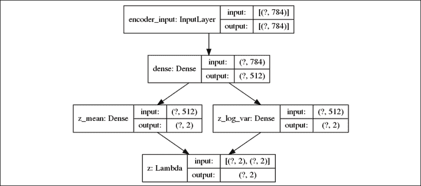

图 8.1.3：VAE MLP 的编码器模型

“图 8.1.4”显示了解码器模型。 2 维输入来自 lambda 函数。 输出是重构的 MNIST 数字：

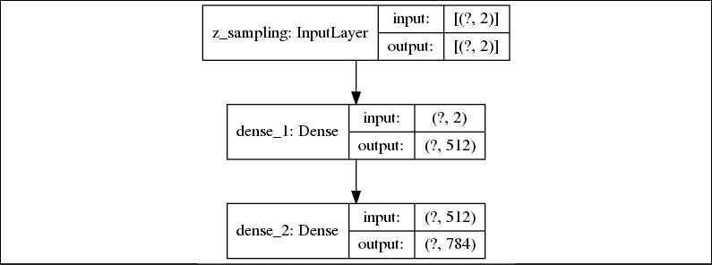

图 8.1.4：VAE MLP 的解码器模型

“图 8.1.5”显示了完整的 VAE 模型。 通过将编码器和解码器模型结合在一起制成：


图 8.1.5：使用 MLP 的 VAE 模型

“图 8.1.6”显示了使用`plot_results()`在 50 个周期后潜向量的连续空间。 为简单起见，此函数未在此处显示，但可以在`vae-mlp-mnist-8.1.1.py`的其余代码中找到。 该函数绘制两个图像，即测试数据集标签（“图 8.1.6”）和样本生成的数字（“图 8.1.7”），这两个图像都是`z`的函数。 这两个图都说明了潜在向量如何确定所生成数字的属性：

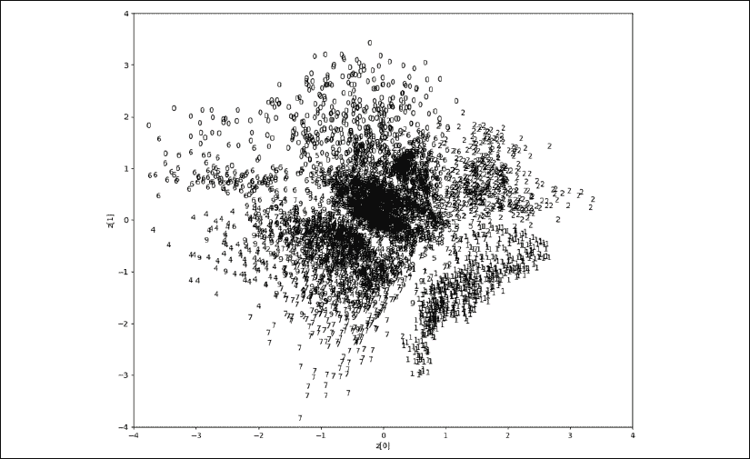

图 8.1.6：MNIST 数字标签作为测试数据集（VAE MLP）的潜在向量平均值的函数。 原始图像可以在该书的 [GitHub 存储库](https://github.com/PacktPublishing/Advanced-Deep-Learning-with-Keras/tree/master/chapter8-vae)中找到。

浏览时，连续空格始终会产生与 MNIST 数字相似的输出。 例如，数字 9 的区域接近数字 7 的区域。从中心附近的 9 移动到左下角会将数字变形为 7。从中心向上移动会将生成的数字从 3 更改为 5，最后变为 0.数字的变形在“图 8.1.7”中更明显，这是解释“图 8.1.6”的另一种方式。

在“图 8.1.7”中，显示生成器输出。 显示了潜在空间中数字的分布。 可以观察到所有数字都被表示。 由于中心附近分布密集，因此变化在中间迅速，在平均值较高的区域则缓慢。 我们需要记住，“图 8.1.7”是“图 8.1.6”的反映。 例如，数字 0 在两个图的左上象限中，而数字 1 在右下象限中。

“图 8.1.7”中存在一些无法识别的数字，尤其是在右上象限中。 从“图 8.1.6”可以看出，该区域大部分是空的，并且远离中心：

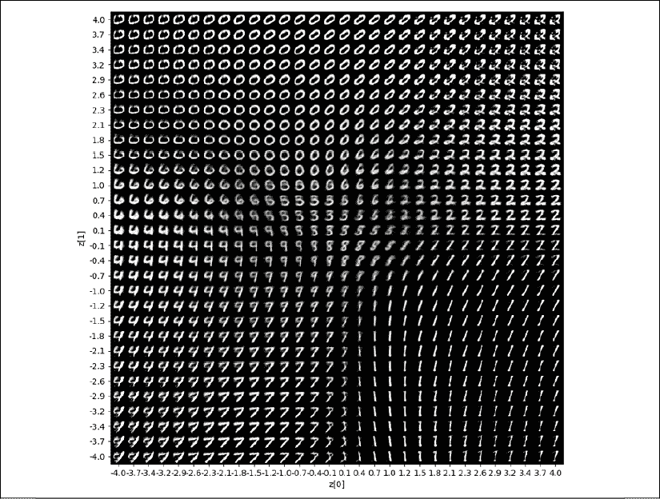

图 8.1.7：根据潜在向量平均值（VAE MLP）生成的数字。 为了便于解释，均值的范围类似于图 8.1.6

在本节中，我们演示了如何在 MLP 中实现 VAE。 我们还解释了导航潜在空间的结果。 在的下一部分中，我们将使用 CNN 实现相同的 VAE。

## 带有 CNN 的 AE

在原始论文《自编码变分贝叶斯》[1]中，使用 MLP 来实现 VAE 网络，这与我们在上一节中介绍的类似。 在本节中，我们将证明使用 CNN 将显着提高所产生数字的质量，并将参数数量显着减少至 134,165。

“列表 8.1.3”显示了编码器，解码器和 VAE 网络。 [该代码也被添加到了官方的 Keras GitHub 存储库中](https://github.com/keras-team/keras/blob/master/examples/variational_autoencoder_deconv.py)。

为简洁起见，不再显示与 MLP VAE 类似的某些代码行。 编码器由两层 CNN 和两层 MLP 组成，以生成潜在代码。 编码器的输出结构与上一节中看到的 MLP 实现类似。 解码器由一层`Dense`和三层转置的 CNN 组成。

VAE CNN 的 Keras 代码具有预训练的权重。 要测试，我们需要运行：

```py
python3 vae-cnn-mnist-8.1.2.py --weights=vae_cnn_mnist.tf 
```

“列表 8.1.3”：`vae-cnn-mnist-8.1.2.py`

使用 CNN 层的`tf.keras`中的 VAE：

```py
# network parameters
input_shape = (image_size, image_size, 1)
batch_size = 128
kernel_size = 3
filters = 16
latent_dim = 2
epochs = 30 
```

```py
# VAE model = encoder + decoder
# build encoder model
inputs = Input(shape=input_shape, name='encoder_input')
x = inputs
for i in range(2):
    filters *= 2
    x = Conv2D(filters=filters,
               kernel_size=kernel_size,
               activation='relu',
               strides=2,
               padding='same')(x) 
```

```py
# shape info needed to build decoder model
shape = K.int_shape(x) 
```

```py
# generate latent vector Q(z|X)
x = Flatten()(x)
x = Dense(16, activation='relu')(x)
z_mean = Dense(latent_dim, name='z_mean')(x)
z_log_var = Dense(latent_dim, name='z_log_var')(x) 
```

```py
# use reparameterization trick to push the sampling out as input
# note that "output_shape" isn't necessary 
# with the TensorFlow backend
z = Lambda(sampling,
           output_shape=(latent_dim,),
           name='z')([z_mean, z_log_var]) 
```

```py
# instantiate encoder model
encoder = Model(inputs, [z_mean, z_log_var, z], name='encoder') 
```

```py
# build decoder model
latent_inputs = Input(shape=(latent_dim,), name='z_sampling')
x = Dense(shape[1] * shape[2] * shape[3],
          activation='relu')(latent_inputs)
x = Reshape((shape[1], shape[2], shape[3]))(x) 
```

```py
for i in range(2):
    x = Conv2DTranspose(filters=filters,
                        kernel_size=kernel_size,
                        activation='relu',
                        strides=2,
                        padding='same')(x)
    filters //= 2 
```

```py
outputs = Conv2DTranspose(filters=1,
                          kernel_size=kernel_size,
                          activation='sigmoid',
                          padding='same',
                          name='decoder_output')(x) 
```

```py
# instantiate decoder model
decoder = Model(latent_inputs, outputs, name='decoder') 
```

```py
# instantiate VAE model
outputs = decoder(encoder(inputs)[2])
vae = Model(inputs, outputs, name='vae') 
```

“图 8.1.8”显示了 CNN 编码器模型的两个输出，即潜向量的均值和方差。 lambda 函数实现了重新参数化技巧，将随机潜码的采样推送到 VAE 网络之外：

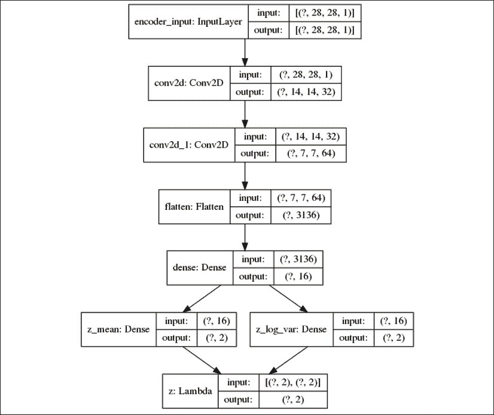

图 8.1.8：VAE CNN 的编码器

“图 8.1.9”显示了 CNN 解码器模型。 2 维输入来自 lambda 函数。 输出是重构的 MNIST 数字：

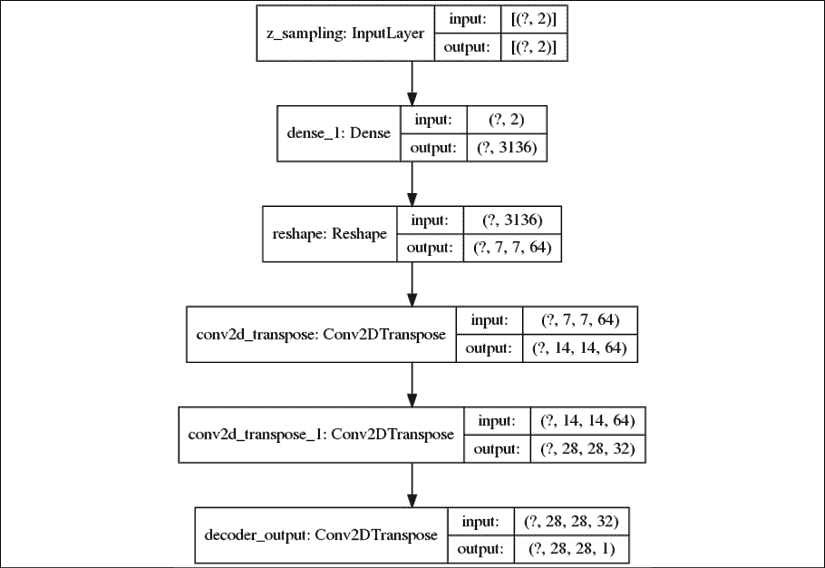

图 8.1.9：VAE CNN 的解码器

“图 8.1.10”显示完整的 CNN VAE 模型。 通过将编码器和解码器模型结合在一起制成：

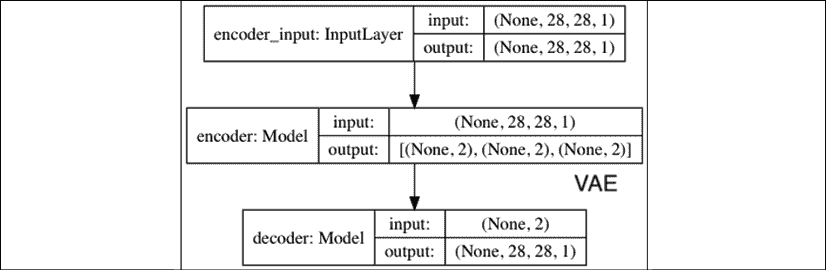

图 8.1.10：使用 CNN 的 VAE 模型

对 VAE 进行了 30 个周期的训练。“图 8.1.11”显示了在导航 VAE 的连续潜在空间时数字的分布。 例如，从中间到右边从 2 变为 0：

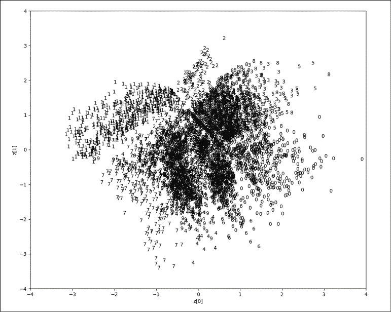

图 8.1.11：MNIST 数字标签作为测试数据集（VAE CNN）的潜在向量平均值的函数。 原始图像可以在该书的 [GitHub 存储库](https://github.com/PacktPublishing/Advanced-Deep-Learning-with-Keras/tree/master/chapter8-vae)中找到。

“图 8.1.12”向我们展示了生成模型的输出。 从质量上讲，与“图 8.1.7”（具有 MLP 实现）相比，模棱两可的位数更少：

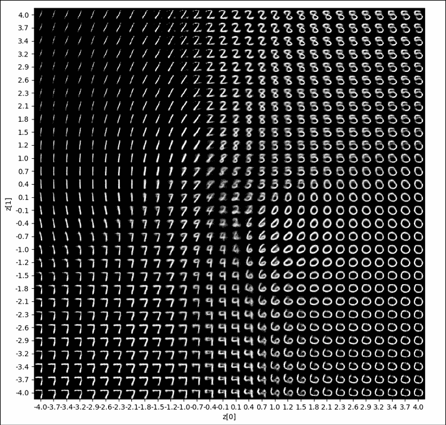

图 8.1.12：根据潜在向量平均值（VAE CNN）生成的数字。 为了便于解释，均值的范围类似于图 8.1.11

前的两节讨论了使用 MLP 或 CNN 的 VAE 的实现。 我们分析了两种实现方式的结果，结果表明 CNN 可以减少参数数量并提高感知质量。 在下一节中，我们将演示如何在 VAE 中实现条件，以便我们可以控制要生成的数字。

# 2\. 条件 VAE（CVAE）

有条件的 VAE [2]与 CGAN 相似。 在 MNIST 数据集的上下文中，如果随机采样潜在空间，则 VAE 无法控制将生成哪个数字。 CVAE 可以通过包含要产生的数字的条件（单标签）来解决此问题。 该条件同时施加在编码器和解码器输入上。

正式地，将“公式 8.1.10”中 VAE 的核心公式修改为包括条件`c`：

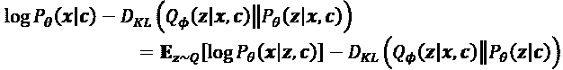 (Equation 8.2.1)

与 VAE 相似，“公式 8.2.1”表示如果要最大化输出条件`c`和`P[θ](x | c)`，则必须最小化两个损失项：

*   给定潜在向量和条件，解码器的重建损失。
*   给定潜在向量和条件的编码器之间的 KL 损失以及给定条件的先验分布。 与 VAE 相似，我们通常选择`P[θ](x | c) = P(x | c) = N(0, 1)`。

实现 CVAE 需要对 VAE 的代码进行一些修改。 对于 CVAE，使用 VAE CNN 实现是因为它可以形成一个较小的网络，并产生感知上更好的数字。

“列表 8.2.1”突出显示了针对 MNIST 数字的 VAE 原始代码所做的更改。 编码器输入现在是原始输入图像及其单标签的连接。 解码器输入现在是潜在空间采样与其应生成的图像的一键热标签的组合。 参数总数为 174,437。 与 β-VAE 相关的代码将在本章下一节中讨论。

损失函数没有改变。 但是，在训练，测试和结果绘制过程中会提供单热标签。

“列表 8.2.1”：`cvae-cnn-mnist-8.2.1.py`

`tf.keras`中使用 CNN 层的 CVAE。 重点介绍了为支持 CVAE 而进行的更改：

```py
# compute the number of labels
num_labels = len(np.unique(y_train)) 
```

```py
# network parameters
input_shape = (image_size, image_size, 1)
label_shape = (num_labels, )
batch_size = 128
kernel_size = 3
filters = 16
latent_dim = 2
epochs = 30 
```

```py
# VAE model = encoder + decoder
# build encoder model
inputs = Input(shape=input_shape, name='encoder_input')
y_labels = Input(shape=label_shape, name='class_labels')
x = Dense(image_size * image_size)(y_labels)
x = Reshape((image_size, image_size, 1))(x)
x = keras.layers.concatenate([inputs, x])
for i in range(2):
    filters *= 2
    x = Conv2D(filters=filters,
               kernel_size=kernel_size,
               activation='relu',
               strides=2,
               padding='same')(x) 
```

```py
# shape info needed to build decoder model
shape = K.int_shape(x) 
```

```py
# generate latent vector Q(z|X)
x = Flatten()(x)
x = Dense(16, activation='relu')(x)
z_mean = Dense(latent_dim, name='z_mean')(x)
z_log_var = Dense(latent_dim, name='z_log_var')(x) 
```

```py
# use reparameterization trick to push the sampling out as input
# note that "output_shape" isn't necessary 
# with the TensorFlow backend
z = Lambda(sampling,
           output_shape=(latent_dim,),
           name='z')([z_mean, z_log_var]) 
```

```py
# instantiate encoder model
encoder = Model([inputs, y_labels],
                [z_mean, z_log_var, z],
                name='encoder') 
```

```py
# build decoder model
latent_inputs = Input(shape=(latent_dim,), name='z_sampling')
x = concatenate([latent_inputs, y_labels])
x = Dense(shape[1]*shape[2]*shape[3], activation='relu')(x)
x = Reshape((shape[1], shape[2], shape[3]))(x) 
```

```py
for i in range(2):
    x = Conv2DTranspose(filters=filters,
                        kernel_size=kernel_size,
                        activation='relu',
                        strides=2,
                        padding='same')(x)
    filters //= 2 
```

```py
outputs = Conv2DTranspose(filters=1,
                          kernel_size=kernel_size,
                          activation='sigmoid',
                          padding='same',
                          name='decoder_output')(x) 
```

```py
# instantiate decoder model
decoder = Model([latent_inputs, y_labels],
                outputs,
                name='decoder')
# instantiate vae model
outputs = decoder([encoder([inputs, y_labels])[2], y_labels])
cvae = Model([inputs, y_labels], outputs, name='cvae') 
```

“图 8.2.1”显示了 CVAE 模型的编码器。 附加输入，即单热向量`class_labels`形式的条件标签表示：

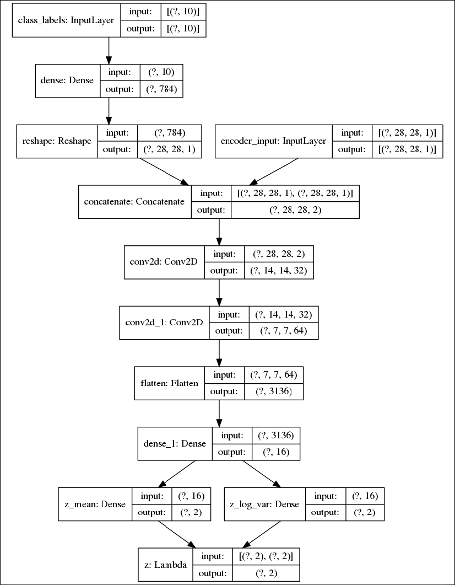

图 8.2.1：CVAE CNN 中的编码器。 输入现在包括 VAE 输入和条件标签的连接

“图 8.2.2”显示了 CVAE 模型的解码器。 附加输入，即单热向量`class_labels`形式的条件标签表示：

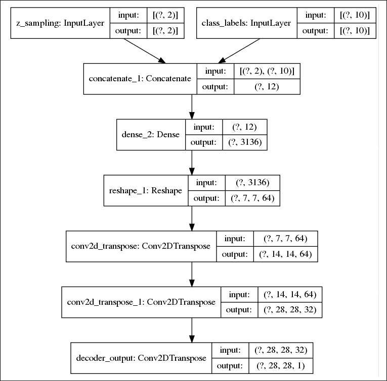

图 8.2.2：CVAE CNN 中的解码器。 输入现在包括 z 采样和条件标签的连接

“图 8.2.3”显示了完整的 CVAE 模型，该模型是编码器和解码器结合在一起的。 附加输入，即单热向量`class_labels`形式的条件标签：

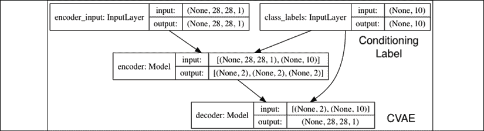

图 8.2.3：使用 CNN 的 CVAE 模型。输入现在包含一个 VAE 输入和一个条件标签

在“图 8.2.4”中，每个标记的平均值分布在 30 个周期后显示。 与前面章节中的“图 8.1.6”和“图 8.1.11”不同，每个标签不是集中在一个区域上，而是分布在整个图上。 这是预期的，因为潜在空间中的每个采样都应生成一个特定的数字。 浏览潜在空间会更改该特定数字的属性。 例如，如果指定的数字为 0，则在潜伏空间中导航仍将产生 0，但是诸如倾斜角度，厚度和其他书写样式方面的属性将有所不同。

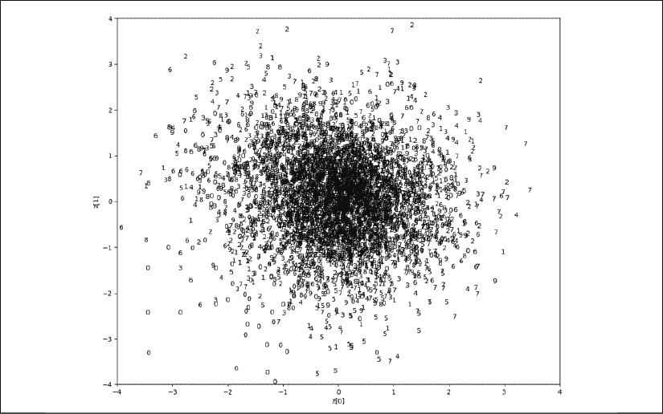

图 8.2.4：作为测试数据集（CVAE CNN）的潜在向量平均值的函数的 MNIST 数字标签。 原始图像可以在该书的 [GitHub 存储库](https://github.com/PacktPublishing/Advanced-Deep-Learning-with-Keras/tree/master/chapter8-vae)中找到。

“图 8.2.4”在“图 8.2.5”中更清楚地显示，数字 0 到 5。每个帧都有相同的数字，并且属性在我们浏览时顺畅地变化。 潜在代码：

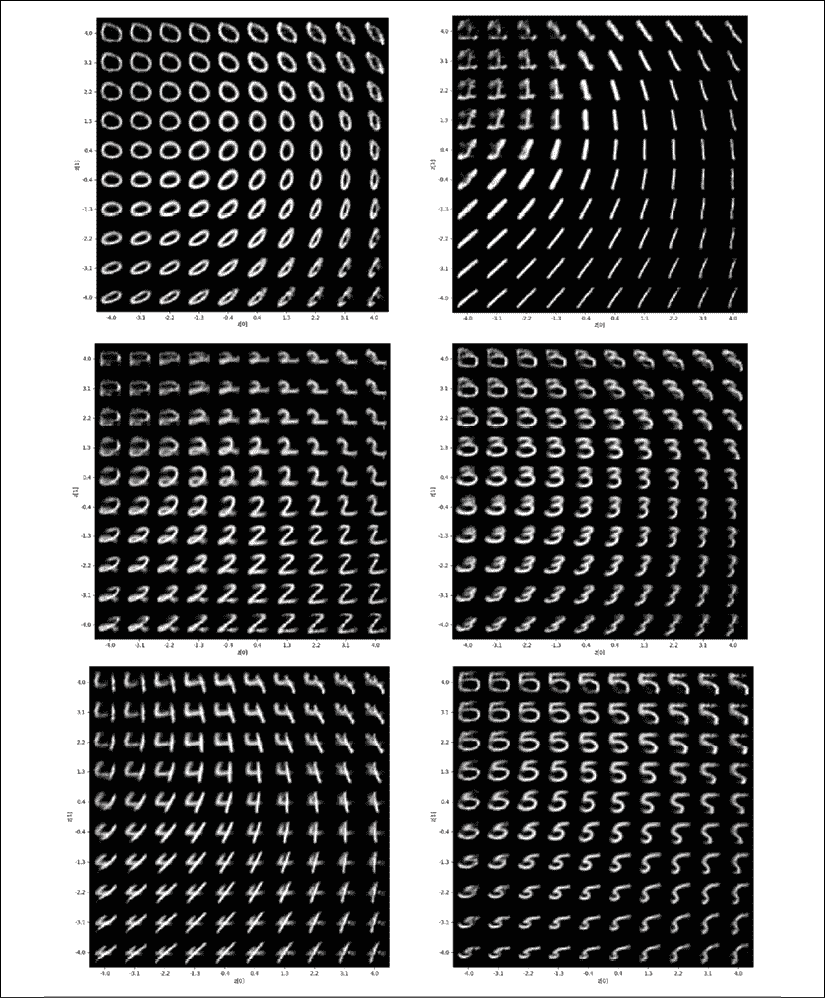

图 8.2.5：根据潜在向量平均值和单热点标签（CVAE CNN）生成的数字 0 至 5。 为了便于解释，均值的范围类似于图 8.2.4。

“图 8.2.6”显示“图 8.2.4”，用于数字 6 至 9：

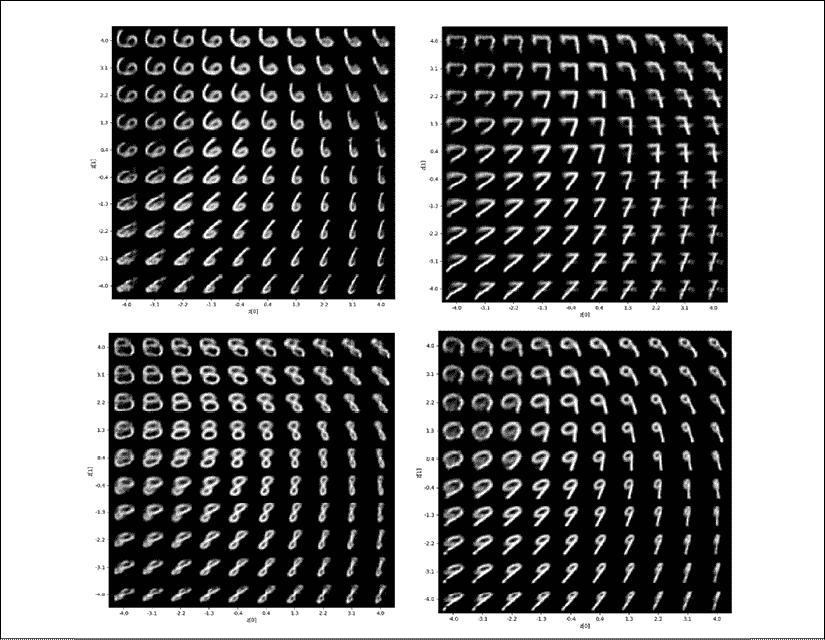

图 8.2.6：根据潜在向量平均值和单热点标签（CVAE CNN）生成的数字 6 至 9。 为了便于解释，均值的范围类似于图 8.2.4。

为了便于比较，潜向量的值范围与“图 8.2.4”中的相同。 使用预训练的权重，可以通过执行以下命令来生成数字（例如 0）：

```py
python3 cvae-cnn-mnist-8.2.1.py –bce --weights=cvae_cnn_mnist.tf --digit=0 
```

在“图 8.2.5”和“图 8.2.6”中，可以注意到，每个数字的宽度和圆度（如果适用）随`z[0]`的变化而变化。 从左到右追踪。 同时，当`z[1]`从上到下导航时，每个数字的倾斜角度和圆度（如果适用）也会发生变化。 随着我们离开分布中心，数字的图像开始退化。 这是可以预期的，因为潜在空间是一个圆形。

属性中其他明显的变化可能是数字特定的。 例如，数字 1 的水平笔划（手臂）在左上象限中可见。 数字 7 的水平笔划（纵横线）只能在右象限中看到。

在下一节中，我们将发现 CVAE 实际上只是另一种称为 β-VAE 的 VAE 的特例。

# 3\.  β-VAE – 具有纠缠的潜在表示形式的 VAE

在“第 6 章”，“非纠缠表示 GAN”中，讨论了潜码非纠缠表示的概念和重要性。 我们可以回想起，一个纠缠的表示是单个潜伏单元对单个生成因子的变化敏感，而相对于其他因子的变化相对不变[3]。 更改潜在代码会导致生成的输出的一个属性发生更改，而其余属性保持不变。

在同一章中，InfoGAN [4]向我们展示了对于 MNIST 数据集，可以控制生成哪个数字以及书写样式的倾斜度和粗细。 观察上一节中的结果，可以注意到，VAE 在本质上使潜向量维解开了一定程度。 例如，查看“图 8.2.6”中的数字 8，从上到下导航`z[1]`会减小宽度和圆度，同时顺时针旋转数字。 从左至右增加`z[0]`也会在逆时针旋转数字时减小宽度和圆度。 换句话说，`z[1]`控制顺时针旋转，而`z[0]`影响逆时针旋转，并且两者都改变​​宽度和圆度。

在本节中，我们将演示对 VAE 损失函数的简单修改会迫使潜在代码进一步解开纠缠。 修改为正恒重`β > 1`，用作 KL 损失的调节器：

 (Equation 8.3.1)

VAE 的这种变化称为 β-VAE [5]。 `β`的隐含效果是更严格的标准差。 换句话说，`β`强制后验分布中的潜码`Q[φ](z | x)`独立。

实现 β-VAE 很简单。 例如，对于上一个示例中的 CVAE，所需的修改是`kl_loss`中的额外`beta`因子：

```py
kl_loss = 1 + z_log_var - K.square(z_mean) - K.exp(z_log_var)
kl_loss = K.sum(kl_loss, axis=-1)
kl_loss *= -0.5 * beta 
```

CVAE 是 β-VAE 的特例，其中`β = 1`。 其他一切都一样。 但是，确定的值需要一些反复试验。 为了潜在的代码独立性，在重构误差和正则化之间必须有一个仔细的平衡。 解缠最大在`β = 9`附近。 当中`β = 9`的值时，β-VAE 仅被迫学习一个解纠缠的表示，而忽略另一个潜在维度。

“图 8.3.1”和“图 8.3.2”显示 β-VAE 的潜向量平均值，其中`β = 9`和`β = 10`：

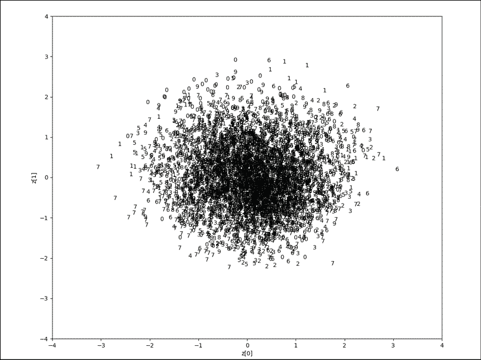

图 8.3.1：MNIST 数字标签与测试数据集的潜在向量平均值的函数（β-VAE，`β = 9`）。 原始图像可以在该书的 [GitHub 存储库](https://github.com/PacktPublishing/Advanced-Deep-Learning-with-Keras/tree/master/chapter8-vae)中找到。

`β = 9`时，与 CVAE 相比，分布具有较小的标准差。 在`β = 10`的情况下，仅学习了潜在代码。 分布实际上缩小为一个维度，编码器和解码器忽略了第一潜码`z[0]`。

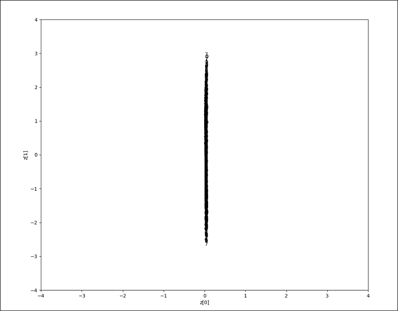

图 8.3.2：MNIST 数字标签与测试数据集的潜向量平均值的函数（β-VAE 和`β = 10`）

[原始图像可以在该书的 GitHub 存储库中找到](https://github.com/PacktPublishing/Advanced-Deep-Learning-with-Keras/tree/master/chapter8-vae)。

这些观察结果反映在“图 8.3.3”中。 具有`β = 9`的 β-VAE 具有两个实际上独立的潜在代码。 `z[0]`确定书写样式的倾斜度，而`z[1]`指定数字的宽度和圆度（如果适用）。 对于中`β = 10`的 β-VAE，`z[0]`被静音。 `z[0]`的增加不会显着改变数字。`z[1]`确定书写样式的倾斜角度和宽度：

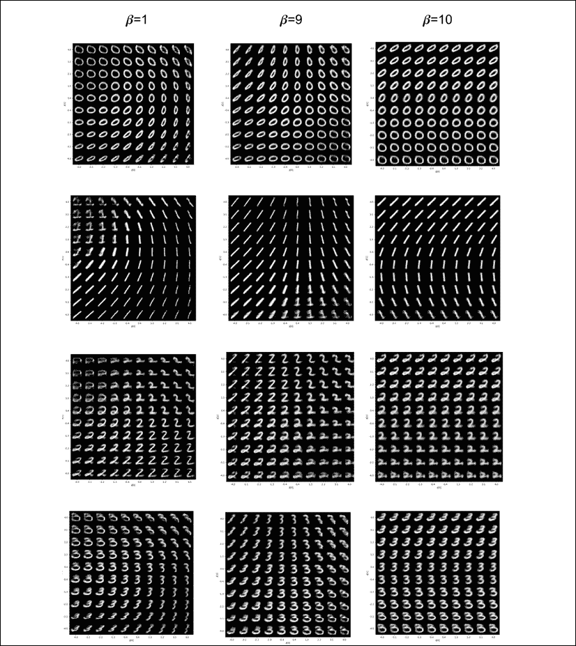

图 8.3.3：根据潜在向量平均值和单热点标签（β-VAE，`β = 1, 9, 10`）生成的数字 0 至 3。 为了便于解释，均值的范围类似于图 8.3.1。

β-VAE 的`tf.keras`代码具有预训练的权重。 要使用`β = 9`生成数字 0 来测试 β-VAE，我们需要运行以下命令：

```py
python3 cvae-cnn-mnist-8.2.1.py --beta=9 --bce --weights=beta-cvae_cnn_mnist.tf --digit=0 
```

总而言之，我们已经证明与 GAN 相比，在 β-VAE 上更容易实现解缠表示学习。 我们所需要做的就是调整单个超参数。

# 4\. 总结

在本章中，我们介绍了 VAE 的原理。 正如我们从 VAE 原理中学到的那样，从两次尝试从潜在空间创建合成输出的角度来看，它们都与 GAN 相似。 但是，可以注意到，与 GAN 相比，VAE 网络更简单，更容易训练。 越来越清楚的是 CVAE 和 β-VAE 在概念上分别类似于条件 GAN 和解缠表示 GAN。

VAE 具有消除潜在向量纠缠的内在机制。 因此，构建 β-VAE 很简单。 但是，我们应该注意，可解释和解开的代码对于构建智能体很重要。

在下一章中，我们将专注于强化学习。 在没有任何先验数据的情况下，智能体通过与周围的世界进行交互来学习。 我们将讨论如何为智能体的正确行为提供奖励，并为错误的行为提供惩罚。

# 5\. 参考

1.  `Diederik P. Kingma and Max Welling. Auto-encoding Variational Bayes. arXiv preprint arXiv:1312.6114, 2013 (https://arxiv.org/pdf/1312.6114.pdf).`
1.  `Kihyuk Sohn, Honglak Lee, and Xinchen Yan. Learning Structured Output Representation Using Deep Conditional Generative Models. Advances in Neural Information Processing Systems, 2015 (http://papers.nips.cc/paper/5775-learning-structured-output-representation-using-deep-conditional-generative-models.pdf).`
1.  `Yoshua Bengio, Aaron Courville, and Pascal Vincent. Representation Learning.`
1.  `A Review and New Perspectives. IEEE transactions on Pattern Analysis and Machine Intelligence 35.8, 2013: 1798-1828 (https://arxiv.org/pdf/1206.5538.pdf).`
1.  `Xi Chen et al.: Infogan: Interpretable Representation Learning by Information Maximizing Generative Adversarial Nets. Advances in Neural Information Processing Systems, 2016 (http://papers.nips.cc/paper/6399-infogan-interpretable-representation-learning-by-information-maximizing-generative-adversarial-nets.pdf).`
1.  `I. Higgins, L. Matthey, A. Pal, C. Burgess, X. Glorot, M. Botvinick, S. Mohamed, and A. Lerchner. -VAE: Learning Basic Visual Concepts with a Constrained Variational Framework. ICLR, 2017 (https://openreview.net/pdf?id=Sy2fzU9gl).`
1.  `Carl Doersch. Tutorial on variational autoencoders. arXiv preprint arXiv:1606.05908, 2016 (https://arxiv.org/pdf/1606.05908.pdf).`