# 九、深度强化学习

**强化学习**（**RL**）是智能体程序用于决策的框架。 智能体不一定是软件实体，例如您在视频游戏中可能看到的那样。 相反，它可以体现在诸如机器人或自动驾驶汽车之类的硬件中。 内在的智能体可能是充分理解和利用 RL 的最佳方法，因为物理实体与现实世界进行交互并接收响应。

该智能体位于**环境**中。 环境具有**状态**，可以部分或完全观察到。 该智能体具有一组**操作**，可用于与环境交互。 动作的结果将环境转换为新状态。 执行动作后，会收到相应的标量**奖励**。

智能体的目标是通过学习**策略**来最大化累积的未来奖励，该策略将决定在特定状态下应采取的行动。

RL 与人类心理学有很强的相似性。 人类通过体验世界来学习。 错误的行为会导致某种形式的惩罚，将来应避免使用，而正确的行为应得到奖励并应予以鼓励。 这种与人类心理学的强相似之处使许多研究人员相信 RL 可以将引向真正的**人工智能**（**AI**）。

RL 已经存在了几十年。 但是，除了简单的世界模型之外，RL 还在努力扩展规模。 这是，其中**深度学习**（**DL**）开始发挥作用。 它解决了这个可扩展性问题，从而开启了**深度强化学习**（**DRL**）的时代。 在本章中，我们的重点是 DRL。 DRL 中值得注意的例子之一是 DeepMind 在智能体上的工作，这些智能体能够在不同的视频游戏上超越最佳的人类表现。

在本章中，我们将讨论 RL 和 DRL。

总之，本章的目的是介绍：

*   RL 的原理
*   RL 技术，Q 学习
*   高级主题，包括**深度 Q 网络**（**DQN**）和**双重 Q 学习**（**DDQN**）
*   关于如何使用`tf.keras`在 Python 和 DRL 上实现 RL 的说明

让我们从 RL 的基本原理开始。

# 1\. 强化学习原理（RL）

“图 9.1.1”显示了用于描述 RL 的感知动作学习循环。 环境是苏打水可以坐在地板上。 智能体是一个移动机器人，其目标是拾取苏打水。 它观察周围的环境，并通过车载摄像头跟踪汽水罐的位置。 观察结果以一种状态的形式进行了汇总，机器人将使用该状态来决定要采取的动作。 所采取的动作可能与低级控制有关，例如每个车轮的旋转角度/速度，手臂的每个关节的旋转角度/速度以及抓手是打开还是关闭。

可替代地，动作可以是高级控制动作，诸如向前/向后移动机器人，以特定角度转向以及抓取/释放。 将夹持器从汽水中移开的任何动作都会得到负回报。 缩小抓取器位置和苏打之间的缝隙的任何动作都会获得积极的回报。 当机械臂成功捡起汽水罐时，它会收到丰厚的回报。 RL 的目标是学习最佳策略，该策略可帮助机器人决定在给定状态下采取哪种行动以最大化累积的折扣奖励：

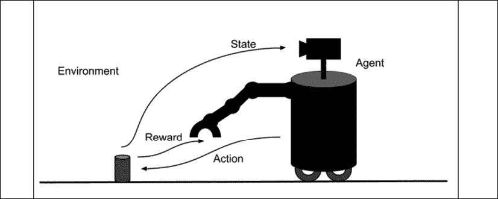

图 9.1.1：RL 中的感知-动作-学习循环

形式上，RL 问题可以描述为 **Markov 决策过程**（**MDP**）。

为简单起见，我们将假定为*确定性*环境，在该环境中，给定状态下的某个动作将始终导致已知的下一个状态和奖励。 在本章的后面部分，我们将研究如何考虑随机性。 在时间步`t`时：

*   环境处于状态空间`S`的状态下，状态`s[0]`，该状态可以是离散的也可以是连续的。 起始状态为`s[0]`，而终止状态为`s[T]`。
*   智能体通过遵循策略`π(a[t] | s[t])`从操作空间`A`采取操作，即`s[a]`。 `A`可以是离散的或连续的。
*   环境使用状态转换动态`T(s[t + 1] | s[t], a[t])`转换为新状态，`s[t + 1]`。 下一个状态仅取决于当前状态和操作。 智能体不知道`T`。
*   智能体使用奖励函数接收标量奖励，`r[t + 1] = R(s[t], a[t])`，以及`r: A x S -> R`。 奖励仅取决于当前状态和操作。 智能体不知道`R`。
*   将来的奖励折扣为`γ^k`，其中`γ ∈ [0, 1]`和`k`是未来的时间步长。
*   *地平线*，`H`是完成从`s[0]`到`s[T]`的一集所需的时间步长`T`。

该环境可以是完全或部分可观察的。 后者也称为**部分可观察的 MDP** 或 **POMDP**。 在大多数情况下，完全观察环境是不现实的。 为了提高的可观察性，当前的观测值也考虑了过去的观测值。 状态包括对环境的足够观察，以使策略决定采取哪种措施。 回忆“图 9.1.1”，这可能是汽水罐相对于机器人抓手的三维位置，如机器人摄像头所估计的那样。

每当环境转换到新状态时，智能体都会收到标量奖励`r[t + 1]`。 在“图 9.1.1”中，每当机器人靠近汽水罐时，奖励可能为 +1；当机器人离汽水罐更远时，奖励为 -1；当机器人关闭夹具并成功捡起苏打时，奖励为 +100。 能够。 智能体的目标是学习一种最佳策略`π*`，该策略可使所有状态的收益最大化：

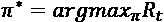 (Equation 9.1.1)

回报定义为折扣累积奖励`R[t] = Σ γ^t r[t+k], k = 0, ..., T`。 从“公式 9.1.1”可以看出，与通常的`γ^k < 1.0`相比，与立即获得的奖励相比，未来的奖励权重较低。 在极端情况下，当`γ = 0`时，仅立即获得奖励很重要。 当`γ = 1`时，将来的奖励与立即奖励的权重相同。

遵循任意策略`π`，可以将回报解释为对给定状态值的度量：

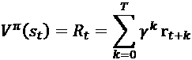 (Equation 9.1.2)

换句话说，RL 问题是智能体的目标，是学习使所有状态`s`最大化的最优策略`V^π`：

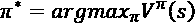 (Equation 9.1.3)

最优策略的值函数就是`V*`。 在“图 9.1.1”中，最佳策略是生成最短动作序列的一种，该动作序列使机器人越来越靠近苏打罐，直到被取走为止。 状态越接近目标状态，其值越高。 可以将导致目标（或最终状态）的事件序列建模为策略的*轨迹*或*部署*：

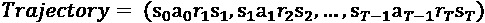 (Equation 9.1.4)

如果 MDP 是偶发的，则当智能体到达终端状态`s[T]`时，状态将重置为`s[0]`。 如果`T`是有限的，则我们的水平范围是有限的。 否则，视野是无限的。 在“图 9.1.1”中，如果 MDP 是情景*剧集*，则在收集苏打罐后，机器人可能会寻找另一个苏打罐来拾取，并且 RL 问题重发。

因此，RL 的主要目标是找到一种使每个状态的值最大化的策略。 在下一部分中，我们将介绍可用于最大化值函数的策略学习算法。

# 2\. Q 值

如果 RL 问题是找到`π*`，则智能体如何通过与环境交互来学习？“公式 9.1.3”并未明确指出尝试进行的操作以及计算收益的后续状态。 在 RL 中，使用 Q 值更容易学习`π*`：

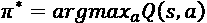 (Equation 9.2.1)

哪里：

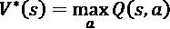 (Equation 9.2.2)

换句话说，不是找到使所有状态的值最大化的策略，而是“公式 9.2.1”寻找使所有状态的质量（Q）值最大化的操作。 在找到 Q 值函数之后，分别由“公式 9.2.2”和“公式 9.1.3”确定`V*`，因此确定了`π*`。

如果对于每个动作，都可以观察到奖励和下一状态，则可以制定以下迭代或反复试验算法来学习 Q 值：

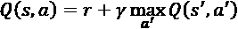 (Equation 9.2.3)

为了简化符号，`s'`和`a'`分别是下一个状态和动作。 “公式 9.2.3”被称为贝尔曼方程，它是 Q 学习算法的核心。 Q 学习尝试根据当前状态和作用来近似返回值或值的一阶展开（“公式 9.1.2”）。 从对环境动态的零知识中，智能体尝试执行操作`a`，观察以奖励`r`和下一个状态`s'`的形式发生的情况。 `max[a'] Q(s', a')`选择下一个逻辑动作，该动作将为下一个状态提供最大 Q 值。 有了“公式 9.2.3”中的所有项，该当前状态-动作对的 Q 值就会更新。 迭代地执行更新将最终使智能体能够学习 Q 值函数。

Q 学习是一种*脱离策略* RL 算法。 它学习了如何通过不直接从策略中抽取经验来改进策略。 换句话说，Q 值的获取与智能体所使用的基础策略无关。 当 Q 值函数收敛时，才使用“公式 9.2.1”确定最佳策略。

在为提供有关如何使用 Q 学习的示例之前，请注意，智能体必须在不断利用其到目前为止所学知识的同时不断探索其环境。 这是 RL 中的问题之一-在*探索*和*开发*之间找到适当的平衡。 通常，在学习开始时，动作是随机的（探索）。 随着学习的进行，智能体会利用 Q 值（利用）。 例如，一开始，90% 的动作是随机的，而 10% 的动作则来自 Q 值函数。 在每个剧集的结尾，这逐渐减少。 最终，该动作是 10% 随机的，并且是 Q 值函数的 90%。

在下一节中，我们将给出有关在简单的确定性环境中如何使用 Q 学习的具体示例。

# 3\. Q 学习实例

为了说明 Q 学习算法，我们需要考虑一个简单的确定性环境，如图“图 9.3.1”所示。 环境具有六个状态。

显示允许的过渡的奖励。 在两种情况下，奖励是非零的。 转换为**目标**（`G`）状态可获得 +100 的奖励，同时移至**洞**（`H`）状态具有 -100 奖励。 这两个状态是终端状态，从**开始**状态构成一个剧集的结尾：

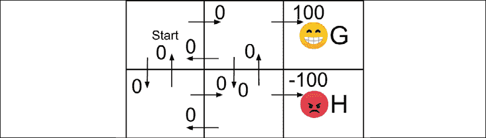

图 9.3.1：简单确定性世界中的奖励

为了使每个状态的身份正式化，我们使用`(行, 列)`标识符，如图“图 9.3.2”所示。 由于智能体尚未了解有关其环境的任何信息，因此“图 9.3.2”中所示的 Q 表的初始值为零。 在此示例中，折扣因子`γ = 0.9`。 回想一下，在当前 Q 值的估计中，折扣因子确定了未来 Q 值的权重，该权重是步数`γ^k`的函数。 在“公式 9.2.3”中，我们仅考虑近期 Q 值`k = 1`。

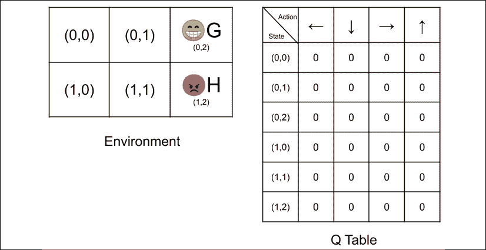

图 9.3.2：简单确定性环境中的状态和智能体的初始 Q 表

最初，智能体采用的策略是 90% 的时间选择随机操作，并 10% 的时间使用 Q 表。 假设第一个动作是随机选择的，并且指示向右移动。“图 9.3.3”说明了向右移动时状态`(0, 0)`的新 Q 值的计算。 下一个状态是`(0, 1)`。 奖励为 0，所有下一个状态的 Q 值的最大值为零。 因此，向右移动的状态`(0, 0)`的 Q 值保持为 0。

为了轻松跟踪初始状态和下一个状态，我们在环境和 Q 表上使用不同的灰色阴影-初始状态浅灰色，下一个状态灰色。

在为下一个状态选择下一个动作时，候选动作位于较粗的边框中：

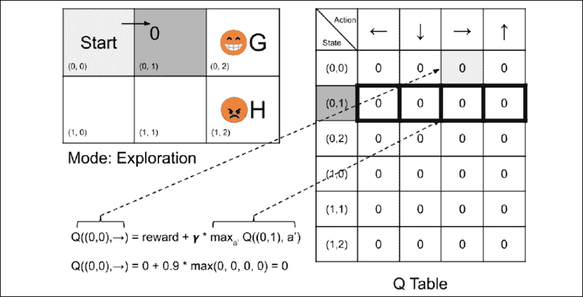

图 9.3.3：假设智能体采取的行动是向右移动，则显示状态`(0, 0)`的 Q 值的更新

假设下一个随机选择的动作是向下移动。“图 9.3.4”显示状态`(0, 1)`的 Q 值沿向下方向的移动没有​​变化：

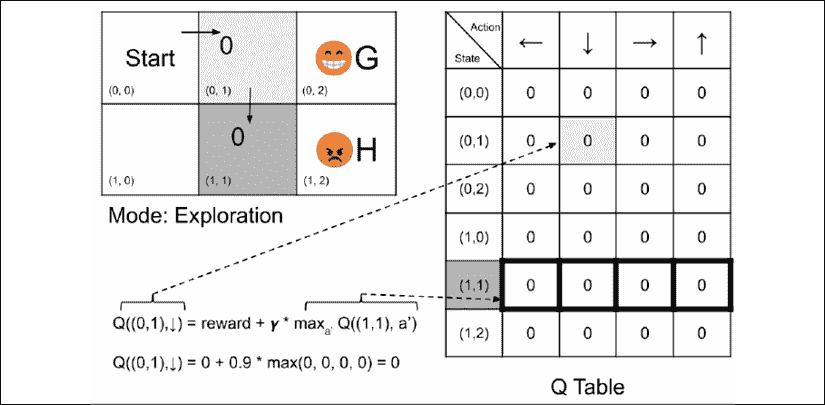

图 9.3.4：假设智能体选择的动作是向下移动，则显示状态`(0, 1)`的 Q 值的更新

在“图 9.3.5”中，智能体的第三个随机动作是向右移动。

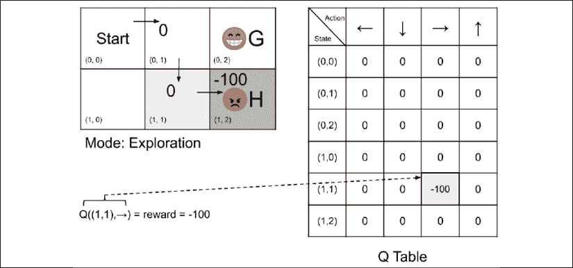

图 9.3.5：假设智能体选择的动作是向右移动，则显示状态`(1, 1)`的 Q 值的更新

它遇到了，`H`状态，并获得了 -100 奖励。 这次，更新不为零。 向右移动时，状态`(1, 1)`的新 Q 值为 -100。 注意，由于这是终端状态，因此没有下一个状态。 一集刚刚结束，**智能体**返回到**开始**状态。

假设**智能体**仍处于探索模式，如图“图 9.3.6”所示：

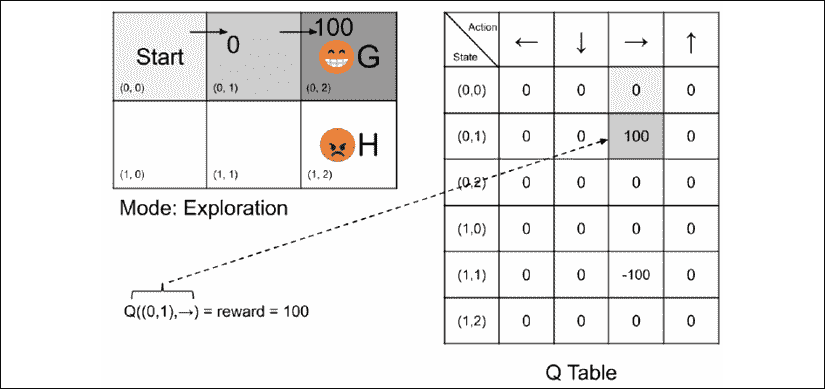

图 9.3.6：假设智能体选择的动作是向右连续两次移动，则显示状态`(0, 1)`的 Q 值的更新

为第二集采取的第一步是向右移动。 正如预期的那样，更新为 0。但是，它选择的第二个随机动作也是向右移动。 智能体到达`G`状态并获得 +100 的巨额奖励。 向右移动的状态`(0, 1)`的 Q 值变为 100。完成第二集，并且**智能体**返回到**启动**状态。

在第三集开始时，智能体采取的随机行动是向右移动。 现在，状态`(0, 0)`的 Q 值将更新为非零值，因为下一个状态的可能动作将最大 Q 值设为 100。“图 9.3.7”显示了所涉及的计算。 下一个状态`(0, 1)`的 Q 值波动回到较早的状态`(0, 0)`。 这就像对帮助找到`G`状态的早期状态表示赞赏。

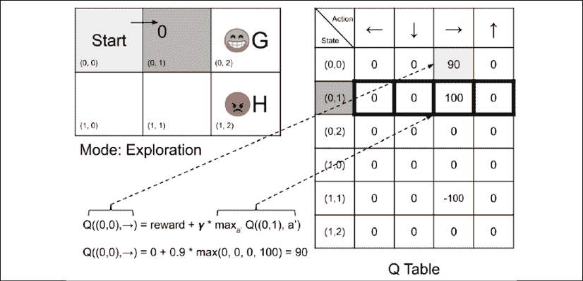

图 9.3.7：假设智能体选择的动作是向右移动，则显示状态`(0, 0)`的 Q 值的更新

Q 表的进步很大。 实际上，在下一集中，如果由于某种原因该策略决定使用 Q 表而不是随机探索环境，则第一个动作是根据“图 9.3.8”中的计算向右移动。  在 Q 表的第一行中，导致最大 Q 值的动作是向右移动。 对于下一个状态`(0, 1)`，Q 表的第二行表明下一个动作仍然是向右移动。 **智能体**已成功实现其目标。 该策略指导智能体采取了正确的措施来实现其目标：


图 9.3.8：在这种情况下，智能体的策略决定利用 Q 表来确定状态`(0, 0)`和`(0, 1)`的动作。 Q 表建议两个状态都向右移动

如果 Q 学习算法继续无限期运行，则 Q 表将收敛。 收敛的假设是 RL 问题必须是具有有限奖励的确定性 MDP，并且所有状态都将被无限次地访问。

在下一节中，我们将使用 Python 模拟环境。 我们还将展示 Q 学习算法的代码实现。

## 用 Python 进行 Q 学习

上一节中讨论的环境和 Q 学习可以在 Python 中实现。 由于该策略只是一个简单的表，因此在此时，无需使用`tf.keras`库。“列表 9.3.1”显示了`q-learning-9.3.1.py`，它是使用`QWorld`类实现的简单确定性世界（环境，智能体，操作和 Q 表算法）的实现。 为简洁起见，未显示处理用户界面的函数。

在此示例中，环境动态由`self.transition_table`表示。 在每个动作中，`self.transition_table`确定下一个状态。 执行动作的奖励存储在`self.reward_table`中。 每次通过`step()`函数执行动作时，都要查阅这两个表。 Q 学习算法由`update_q_table()`函数实现。 每当智能体需要决定要采取的操作时，它都会调用`act()`函数。 策略可以使用 Q 表随机抽取或决定。 所选动作是随机的机会百分比存储在`self.epsilon`变量中，该变量由`update_epsilon()`函数使用固定的`epsilon_decay`更新。

在执行“列表 9.3.1”中的代码之前，我们需要运行：

```py
sudo pip3 install termcolor 
```

安装`termcolor`包。 该包有助于可视化终端上的文本输出。

[完整的代码可以在 GitHub 上找到](https://github.com/PacktPublishing/Advanced-Deep-Learning-with-Keras)。

“列表 9.3.1”：`q-learning-9.3.1.py`

具有六个状态的简单确定性 MDP：

```py
from collections import deque
import numpy as np
import argparse
import os
import time
from termcolor import colored 
```

```py
class QWorld:
    def __init__(self):
        """Simulated deterministic world made of 6 states.
        Q-Learning by Bellman Equation. 
        """
        # 4 actions
        # 0 - Left, 1 - Down, 2 - Right, 3 - Up
        self.col = 4 
```

```py
 # 6 states
        self.row = 6 
```

```py
 # setup the environment
        self.q_table = np.zeros([self.row, self.col])
        self.init_transition_table()
        self.init_reward_table() 
```

```py
 # discount factor
        self.gamma = 0.9 
```

```py
 # 90% exploration, 10% exploitation
        self.epsilon = 0.9
        # exploration decays by this factor every episode
        self.epsilon_decay = 0.9
        # in the long run, 10% exploration, 90% exploitation
        self.epsilon_min = 0.1 
```

```py
 # reset the environment
        self.reset()
        self.is_explore = True 
```

```py
 def reset(self):
        """start of episode"""
        self.state = 0
        return self.state 
```

```py
 def is_in_win_state(self):
        """agent wins when the goal is reached"""
        return self.state == 2 
```

```py
 def init_reward_table(self):
        """
        0 - Left, 1 - Down, 2 - Right, 3 - Up
        ----------------
        | 0 | 0 | 100  |
        ----------------
        | 0 | 0 | -100 |
        ----------------
        """
        self.reward_table = np.zeros([self.row, self.col])
        self.reward_table[1, 2] = 100.
        self.reward_table[4, 2] = -100. 
```

```py
 def init_transition_table(self):
        """
        0 - Left, 1 - Down, 2 - Right, 3 - Up
        -------------
        | 0 | 1 | 2 |
        -------------
        | 3 | 4 | 5 |
        -------------
        """
        self.transition_table = np.zeros([self.row, self.col],
                                         dtype=int)
        self.transition_table[0, 0] = 0
        self.transition_table[0, 1] = 3
        self.transition_table[0, 2] = 1
        self.transition_table[0, 3] = 0 
```

```py
 self.transition_table[1, 0] = 0
        self.transition_table[1, 1] = 4
        self.transition_table[1, 2] = 2
        self.transition_table[1, 3] = 1 
```

```py
 # terminal Goal state
        self.transition_table[2, 0] = 2
        self.transition_table[2, 1] = 2
        self.transition_table[2, 2] = 2
        self.transition_table[2, 3] = 2 
```

```py
 self.transition_table[3, 0] = 3
        self.transition_table[3, 1] = 3
        self.transition_table[3, 2] = 4
        self.transition_table[3, 3] = 0 
```

```py
 self.transition_table[4, 0] = 3
        self.transition_table[4, 1] = 4
        self.transition_table[4, 2] = 5
        self.transition_table[4, 3] = 1 
```

```py
 # terminal Hole state
        self.transition_table[5, 0] = 5
        self.transition_table[5, 1] = 5
        self.transition_table[5, 2] = 5
        self.transition_table[5, 3] = 5 
```

```py
 def step(self, action):
        """execute the action on the environment
        Argument:
            action (tensor): An action in Action space
        Returns:
            next_state (tensor): next env state
            reward (float): reward received by the agent
            done (Bool): whether the terminal state 
                is reached
        """
        # determine the next_state given state and action
        next_state = self.transition_table[self.state, action]
        # done is True if next_state is Goal or Hole
        done = next_state == 2 or next_state == 5
        # reward given the state and action
        reward = self.reward_table[self.state, action]
        # the enviroment is now in new state
        self.state = next_state
        return next_state, reward, done 
```

```py
 def act(self):
        """determine the next action
            either fr Q Table(exploitation) or
            random(exploration)
        Return:
            action (tensor): action that the agent
                must execute
        """
        # 0 - Left, 1 - Down, 2 - Right, 3 - Up
        # action is from exploration
        if np.random.rand() <= self.epsilon:
            # explore - do random action
            self.is_explore = True
            return np.random.choice(4,1)[0] 
```

```py
 # or action is from exploitation
        # exploit - choose action with max Q-value
        self.is_explore = False
        action = np.argmax(self.q_table[self.state])
        return action 
```

```py
 def update_q_table(self, state, action, reward, next_state):
        """Q-Learning - update the Q Table using Q(s, a)
        Arguments:
            state (tensor) : agent state
            action (tensor): action executed by the agent
            reward (float): reward after executing action 
                for a given state
            next_state (tensor): next state after executing
                action for a given state
        """
        # Q(s, a) = reward + gamma * max_a' Q(s', a')
        q_value = self.gamma * np.amax(self.q_table[next_state])
        q_value += reward
        self.q_table[state, action] = q_value 
```

```py
 def update_epsilon(self):
        """update Exploration-Exploitation mix"""
        if self.epsilon > self.epsilon_min:
            self.epsilon *= self.epsilon_decay 
```

感知动作学习循环在“列表 9.3.2”中进行了说明。 在每个剧集中，环境都会重置为**开始**状态。 选择要执行的动作并将其应用于环境。 观察**奖励**和**下一个**状态，并将其用于更新 Q 表。 达到**目标**或**洞**状态后，剧集完成（`done = True`）。

对于此示例，Q 学习运行 100 集或 10 获胜，以先到者为准。 由于在每个剧集中变量的值均降低，因此智能体开始倾向于利用 Q 表来确定在给定状态下要执行的动作。 要查看 Q 学习模拟，我们只需要运行以下命令：

```py
python3 q-learning-9.3.1.py 
```

“列表 9.3.2”：`q-learning-9.3.1.py`

主要的 Q 学习循环：

```py
 # state, action, reward, next state iteration
    for episode in range(episode_count):
        state = q_world.reset()
        done = False
        print_episode(episode, delay=delay)
        while not done:
            action = q_world.act()
            next_state, reward, done = q_world.step(action)
            q_world.update_q_table(state, action, reward, next_state)
            print_status(q_world, done, step, delay=delay)
            state = next_state
            # if episode is done, perform housekeeping
            if done:
                if q_world.is_in_win_state():
                    wins += 1
                    scores.append(step)
                    if wins > maxwins:
                        print(scores)
                        exit(0)
                # Exploration-Exploitation is updated every episode
                q_world.update_epsilon()
                step = 1
            else:
                step += 1 
```

“图 9.3.9”显示了`maxwins = 2000`（达到`2000 x`目标状态）和`delay = 0`时的屏幕截图。 要仅查看最终的 Q 表，请执行：

```py
python3 q-learning-9.3.1.py --train 
```

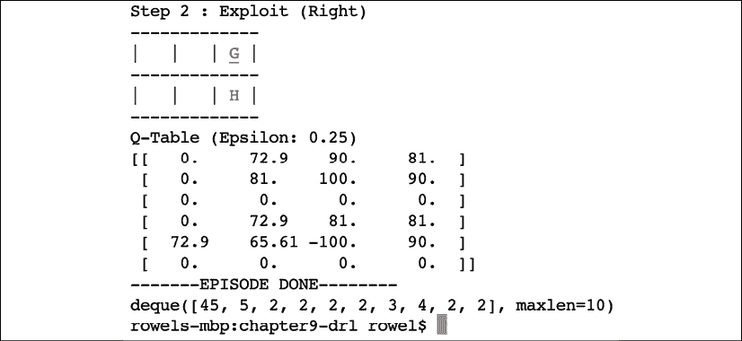

图 9.3.9：屏幕快照显示智能体在 2,000 次获胜后的 Q 表

Q 表已收敛，并显示了智能体可以在给定状态下采取的逻​​辑操作。 例如，在第一行或状态`(0, 0)`中，该策略建议向右移动。 第二行的状态`(0, 1)`也是如此。 第二个动作达到**目标**状态。 `scores`变量转储显示，随着智能体从策略获取正确的操作，所采取的最少步骤数减少了。

从“图 9.3.9”，我们可以从“公式 9.2.2”和`V*(s) = max[a] Q(s, a)`计算每个状态的值。 例如，对于状态`(0, 0)`，`V*(s) = max[a](0.0, 72.9, 90.0, 81.0) = 9.0`。

“图 9.3.10”显示每种状态的值。

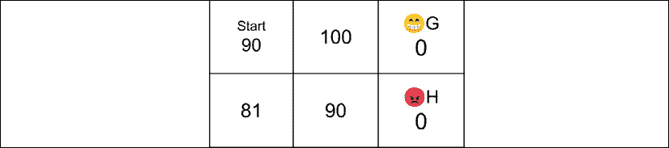

图 9.3.10：图 9.3.9 和公式 9.2.2 中每个状态的值

这个简单的示例说明了在简单确定性世界中智能体的 Q 学习的所有元素。 在下一节中，我们将介绍考虑随机性所需的轻微修改。

# 4\. 非确定性环境

如果环境不确定，则奖励和行动都是概率性的。 新系统是随机的 MDP。 为了反映不确定性报酬，新的值函数为：

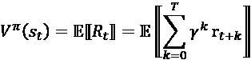 (Equation 9.4.1)

贝尔曼方程修改为：

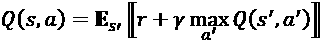 (Equation 9.4.2)

但是，在本章中，我们将重点介绍确定性环境。 在下一节中，我们将提出一种更通用的 Q 学习算法，称为**时差**（**TD**）学习。

# 5\. 时差学习

Q 学习是更广义的 TD 学习`TD(λ)`的特例。 更具体地说，这是单步 TD 学习的特殊情况，`TD(0)`：

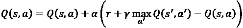 (Equation 9.5.1)

其中`α`是学习率。 注意，当`α = 1`，“公式 9.5.1”与贝尔曼等式相似。 为简单起见，我们还将“公式 9.5.1”称为 Q 学习或广义 Q 学习。

以前，我们将 Q 学习称为一种非策略性 RL 算法，因为它学习 Q 值函数而没有直接使用它尝试优化的策略。 *上策略*一步式 TD 学习算法的示例是 SARSA，类似于“公式 9.5.1”：

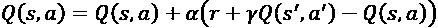 (Equation 9.5.2)

主要区别是使用已优化的策略来确定`a'`。 必须知道项`s`，`a`，`r`，`s'`和`a'`（因此名称为 SARSA）才能在每次迭代时更新 Q 值函数。 Q 学习和 SARSA 都在 Q 值迭代中使用现有的估计，该过程称为*自举*。 在引导过程中，我们从奖励中更新当前的 Q 值估计，并随后更新 Q 值估计。

在提出另一个示例之前，似乎需要合适的 RL 模拟环境。 否则，我们只能对非常简单的问题（如上一个示例）运行 RL 模拟。 幸运的是，OpenAI 创建了 [Gym](https://gym.openai.com)，我们将在下一节中介绍。

## 在 OpenAI Gym 上进行 Q 学习

OpenAI Gym 是的工具包，用于开发和比较 RL 算法。 它适用于大多数 DL 库，包括`tf.keras`。 可以通过运行以下命令来安装健身房：

```py
sudo pip3 install gym 
```

该体育馆有多种可以测试 RL 算法的环境，例如玩具文字，经典控件，算法，Atari 和二维/三维机器人。 例如，`FrozenLake-v0`（“图 9.5.1”）是一个玩具文本环境，类似于在 Python Q 学习示例中使用的简单确定性世界：

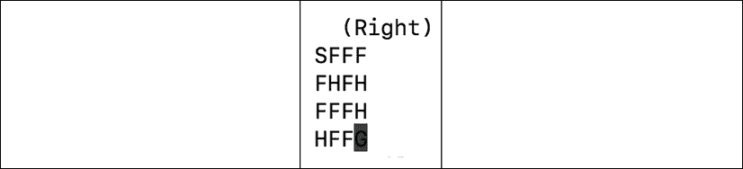

图 9.5.1：OpenAI Gym 中的 FrozenLake-v0 环境

`FrozenLake-v0`具有 12 个状态，标记为`S`的状态为起始状态，`F`的状态为湖泊的冰冻部分，这是安全的，`H`为安全状态。 应当避免的空穴状态，`G`是飞盘所在的目标状态。 转换为目标状态的奖励为 +1。 对于所有其他状态，奖励为**零**。

在`FrozenLake-v0`中，还有四个可用动作（左，下，右，上），称为动作空间。 但是，与之前的简单确定性世界不同，实际运动方向仅部分取决于所选的动作。 `FrozenLake-v0`环境有两种变体。 滑和不滑。 不出所料，滑动模式更具挑战性。

应用于`FrozenLake-v0`的操作将返回观察结果（等效于下一个状态），奖励，完成（无论剧集是否完成）以及调试信息字典。 返回的观察对象捕获环境的可观察属性，称为观察空间。

通用 Q 学习可以应用于`FrozenLake-v0`环境。“表 9.5.1”显示了湿滑和非湿滑环境的表现改进。 衡量策略表现的一种方法是执行的事件达到目标状态的百分比。 百分比越高，效果越好。 从大约 1.5% 的纯探查（随机操作）的基准来看，该策略可以在非光滑环境中达到约 76% 的目标状态，在光滑环境中可以达到约 71% 的目标状态。 不出所料，很难控制湿滑的环境。

| **模式** | **运行** | **大约百分比的目标** |
| --- | --- | --- |
| 训练非滑动 | `python3 q-frozenlake-9.5.1.py` | 26 |
| 测试非滑动 | `python3 q-frozenlake-9.5.1.py -d` | 76 |
| 纯随机动作非滑动 | `python3 q-frozenlake-9.5.1.py -e` | 1.5 |
| 训练滑动 | `python3 q-frozenlake-9.5.1.py -s` | 26 |
| 测试滑动 | `python3 q-frozenlake-9.5.1.py -s -d` | 71 |
| 纯随机动作滑动 | `python3 q-frozenlake-9.5.1.py -s -e` | 1.5 |

表 9.5.1：在 FrozenLake-v0 环境中学习率为 0.5 的广义 Q 学习的基线和表现

由于该代码仅需要一个 Q 表，因此仍可以在 Python 和 NumPy 中实现。“列表 9.5.1”显示了`QAgent`类的实现。 除了使用 OpenAI Gym 的`FrozenLake-v0`环境之外，最重要的更改是广义 Q 学习的实现，这由`update_q_table()`函数中的“公式 9.5.1”定义。

“列表 9.5.1”：`q-frozenlake-9.5.1.py`

关于 FrozenLake-v0 环境的 Q 学习：

```py
from collections import deque
import numpy as np
import argparse
import os
import time
import gym
from gym import wrappers, logger 
```

```py
class QAgent:
    def __init__(self,
                 observation_space,
                 action_space,
                 demo=False,
                 slippery=False,
                 episodes=40000):
        """Q-Learning agent on FrozenLake-v0 environment 
```

```py
 Arguments:
            observation_space (tensor): state space
            action_space (tensor): action space
            demo (Bool): whether for demo or training
            slippery (Bool): 2 versions of FLv0 env
            episodes (int): number of episodes to train
        """ 
```

```py
 self.action_space = action_space
        # number of columns is equal to number of actions
        col = action_space.n
        # number of rows is equal to number of states
        row = observation_space.n
        # build Q Table with row x col dims
        self.q_table = np.zeros([row, col]) 
```

```py
 # discount factor
        self.gamma = 0.9 
```

```py
 # initially 90% exploration, 10% exploitation
        self.epsilon = 0.9
        # iteratively applying decay til 
        # 10% exploration/90% exploitation
        self.epsilon_min = 0.1
        self.epsilon_decay = self.epsilon_min / self.epsilon
        self.epsilon_decay = self.epsilon_decay ** \
                             (1\. / float(episodes)) 
```

```py
 # learning rate of Q-Learning
        self.learning_rate = 0.1 
```

```py
 # file where Q Table is saved on/restored fr
        if slippery:
            self.filename = 'q-frozenlake-slippery.npy'
        else:
            self.filename = 'q-frozenlake.npy' 
```

```py
 # demo or train mode 
        self.demo = demo
        # if demo mode, no exploration
        if demo:
            self.epsilon = 0 
```

```py
 def act(self, state, is_explore=False):
        """determine the next action
            if random, choose from random action space
            else use the Q Table
        Arguments:
            state (tensor): agent's current state
            is_explore (Bool): exploration mode or not
        Return:
            action (tensor): action that the agent
                must execute
        """
        # 0 - left, 1 - Down, 2 - Right, 3 - Up
        if is_explore or np.random.rand() < self.epsilon:
            # explore - do random action
            return self.action_space.sample() 
```

```py
 # exploit - choose action with max Q-value
        action = np.argmax(self.q_table[state])
        return action 
```

```py
 def update_q_table(self, state, action, reward, next_state):
        """TD(0) learning (generalized Q-Learning) with learning rate
        Arguments:
            state (tensor): environment state
            action (tensor): action executed by the agent for
                the given state
            reward (float): reward received by the agent for
                executing the action
            next_state (tensor): the environment next state
        """
        # Q(s, a) += 
        # alpha * (reward + gamma * max_a' Q(s', a') - Q(s, a))
        q_value = self.gamma * np.amax(self.q_table[next_state])
        q_value += reward
        q_value -= self.q_table[state, action]
        q_value *= self.learning_rate
        q_value += self.q_table[state, action]
        self.q_table[state, action] = q_value 
```

```py
 def update_epsilon(self):
        """adjust epsilon"""
        if self.epsilon > self.epsilon_min:
            self.epsilon *= self.epsilon_decay 
```

“列表 9.5.2”演示了智能体的感知行为学习循环。 在每个剧集中，通过调用`env.reset()`重置环境。 要执行的动作由`agent.act()`选择，并由`env.step(action)`应用于环境。 奖励和下一个状态将被观察并用于更新 Q 表。

在每个动作之后，通过`agent.update_q_table()`执行 TD 学习。 由于每次调用`agent.update_epsilon()`时处`self.epsilon`变量的值都会减少，该智能体开始支持利用 Q 表来确定在给定状态下执行的操作。 达到目标或空洞状态后，剧集完成（`done = True`）。 对于此示例，TD 学习运行 4,000 集。

“列表 9.5.2”：`q-frozenlake-9.5.1.py`。

`FrozenLake-v0`环境的 Q 学习循环：

```py
 # loop for the specified number of episode
    for episode in range(episodes):
        state = env.reset()
        done = False
        while not done:
            # determine the agent's action given state
            action = agent.act(state, is_explore=args.explore)
            # get observable data
            next_state, reward, done, _ = env.step(action)
            # clear the screen before rendering the environment
            os.system('clear')
            # render the environment for human debugging
            env.render()
            # training of Q Table
            if done:
                # update exploration-exploitation ratio
                # reward > 0 only when Goal is reached
                # otherwise, it is a Hole
                if reward > 0:
                    wins += 1 
```

```py
 if not args.demo:
                agent.update_q_table(state,
                                     action, 
                                     reward, 
                                     next_state)
                agent.update_epsilon() 
```

```py
 state = next_state
            percent_wins = 100.0 * wins / (episode + 1) 
```

`agent`对象可以在湿滑或非湿滑模式下运行。 训练后，智能体可以利用 Q 表选择给定任何策略执行的操作，如“表 9.5.1”的测试模式所示。 如“表 9.5.1”所示，使用学习的策略可显着提高性能。 随着体育馆的使用，不再需要中构建环境的许多代码行。 例如，与上一个示例不同，使用 OpenAI Gym，我们不需要创建状态转换表和奖励表。

这将帮助我们专注于构建有效的 RL 算法。 要以慢动作方式运行代码或每个动作延迟 1 秒，请执行以下操作：

```py
python3 q-frozenlake-9.5.1.py -d -t=1 
```

在本节中，我们在更具挑战性的环境中演示了 Q 学习。 我们还介绍了 OpenAI 体育馆。 但是，我们的环境仍然是玩具环境。 如果我们有大量的状态或动作怎么办？ 在这种情况下，使用 Q 表不再可行。 在下一节中，我们将使用深度神经网络来学习 Q 表。

# 6\. 深度 Q 网络（DQN）

在小型离散环境中，使用 Q 表执行 Q 学习是很好的选择。 但是，在大多数情况下，当环境具有许多状态或连续时，Q 表是不可行或不实际的。 例如，如果我们观察由四个连续变量组成的状态，则表的大小是无限的。 即使我们尝试将这四个变量离散化为 1,000 个值，表中的总行数也达到了惊人的`1000^4 = 1e12`。 即使经过训练，该表仍是稀疏的–该表中的大多数单元都是零。

这个问题的解决方案称为 DQN [2]，它使用深度神经网络来近似 Q 表，如图“图 9.6.1”所示。 有两种构建 Q 网络的方法：

*   输入是状态-动作对，预测是 Q 值
*   输入是状态，预测是每个动作的 Q 值

第一种选择不是最佳的，因为网络被调用的次数等于操作数。 第二种是首选方法。 Q 网络仅被调用一次。

最希望得到的作用就是 Q 值最大的作用。

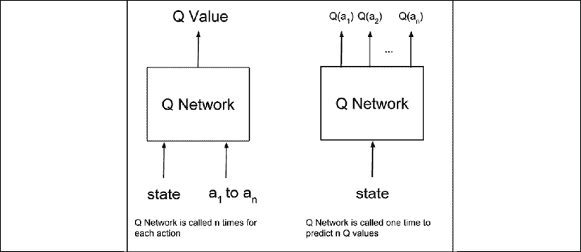

图 9.6.1：深度 Q 网络

训练 Q 网络所需的数据来自智能体的经验：`(s[0]a[0]r[1]s[1], s[1]a[1]r[2]s[2],d ..., s[T-1]a[T-1]r[T]s[T])`。 每个训练样本都是经验单元`s[t]a[t]r[t+1]s[t+1]`。 在时间步`t`，`s = s[t]`的给定状态下，使用类似于前一部分的 Q 学习算法来确定动作`a = a[t]`：

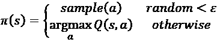 (Equation 9.6.1)

为了简化符号，我们省略了下标和粗体字母的使用。 注意，`Q(s, a)`是 Q 网络。 严格来说，它是`Q(a | s)`，因为动作已移至预测阶段（换句话说，是输出），如“图 9.6.1”的右侧所示。 Q 值最高的动作是应用于环境以获得奖励`r = r[t+1]`，下一状态`s' = s[t+1]`和布尔值`done`的动作，指示下一个状态是否为终端 。 根据关于广义 Q 学习的“公式 9.5.1”，可以通过应用所选的操作来确定 MSE 损失函数：

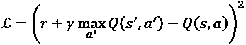 (Equation 9.6.2)

在前面有关 Q 学习和`Q(a | s) -> Q(s, a)`的讨论中，所有项都很熟悉。 项`max[a'] Q(a' | s') -> max[a'] Q(s', a')`。 换句话说，使用 Q 网络，在给定下一个状态的情况下预测每个动作的 Q 值，并从其中获得最大值。 注意，在终端状态下，`s'`，`max[a'] Q(a' | s') -> max[a'] Q(s', a') = 0`。

但是，事实证明训练 Q 网络是不稳定的。 导致不稳定的问题有两个：1）样本之间的相关性高； 2）非平稳目标。 高度相关性是由于采样经验的顺序性质。 DQN 通过创建经验缓冲解决了问题。 训练数据是从该缓冲区中随机采样的。 此过程称为**经验回放**。

非固定目标的问题是由于目标网络`Q(s', a')`在每小批训练后都会被修改。 目标网络的微小变化会导致策略，数据分布以及当前 Q 值和目标 Q 值之间的相关性发生重大变化。 这可以通过冻结`C`训练步骤的目标网络的权重来解决。 换句话说，创建了两个相同的 Q 网络。 在每个`C`训练步骤中，从训练中的 Q 网络复制目标 Q 网络参数。

“算法 9.6.1”中概述了深度 Q 网络算法。

“算法 9.6.1”： **DQN 算法**

要求：将重播内存`D`初始化为容量`N`

要求：使用随机权重`θ`初始化动作值函数`Q`

要求：使用权重`θ- = 0`初始化目标操作值函数`Q_target`

需要：探索率`ε`和折扣系数`γ`

1.  对于`episode = 1, ..., M`，执行：
2.  给定初始状态`s`
3.  对于`step = 1, ..., T`，执行：
4.  选择动作

    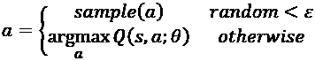
5.  执行动作`a`，观察奖励`r`，以及下一个状态`s'`
6.  将转换`(s, a, r, s')`存储在`D`中
7.  更新状态`s = s'`
8.  经验回放
9.  从`D`中抽样一小部分经验`(s[j], a[j], r[j+1], s[j+1])`
10.  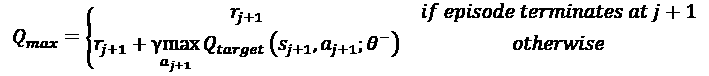
11.  在`(Q_max - Q(s[j], a[j]; θ))²`上相对于参数`θ`执行梯度下降步骤。
12.  定期更新目标网络
13.  每`C`个步骤，即`Q_target = Q`，换句话说，设置`θ- = θ`
14.  `end`

1.  `end`

“算法 9.6.1”总结了在具有离散动作空间和连续状态空间的环境上实现 Q 学习所需的所有技术。 在下一节中，我们将演示如何在更具挑战性的 OpenAI Gym 环境中使用 DQN。

## Keras 中的 DQN

为了说明 DQN，使用了 OpenAI Gym 的`CartPole-v0`环境。 `CartPole-v0`是极点平衡问题。 目的是防止电杆跌落。 环境是二维的。 动作空间由两个离散的动作（左右移动）组成。 但是，状态空间是连续的，并且包含四个变量：

*   直线位置
*   线速度
*   旋转角度
*   角速度

`CartPole-v0`环境如图 9.6.1 所示：

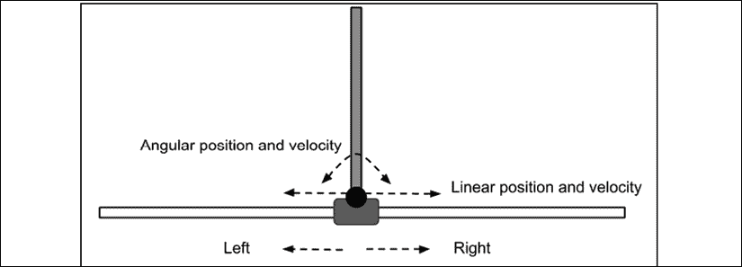

图 9.6.1：CartPole-v0 环境

最初，杆是直立的。 杆保持直立的每个时间步长都提供 +1 的奖励。 当极点与垂直方向的夹角超过 15 度或与中心的距离超过 2.4 单位时，剧集结束。 如果在 100 个连续试验中平均奖励为 195.0，则认为`CartPole-v0`问题已解决：

“列表 9.6.1”向我们展示了`CartPole-v0`的 DQN 实现。 `DQNAgent`类表示使用 DQN 的智能体。 创建了两个 Q 网络：

*   “算法 9.6.1”中的 Q 网络或 Q
*   “算法 9.6.1”中的目标 Q 网络或`Q_target`

两个网络都是 MLP，每个都有 256 个单元的 3 个隐藏层。 这两个网络都是通过`build_model()`方法创建的。 在**经验回放**，`replay()`期间训练 Q 网络。 以`update_weights()`的固定间隔`C = 10`个训练步骤，将 Q 网络参数复制到目标 Q 网络。 在“算法 9.6.1”中，这实现了第 13 行，`Q_target = Q`。 每次发作后，`update_epsilon()`都会降低探索利用的比例，以利用已学习的策略。

“列表 9.6.1”：`dqn-cartpole-9.6.1.py`

`tf.keras`中的 DQN：

```py
class DQNAgent:
    def __init__(self,
                 state_space,
                 action_space,
                 episodes=500):
        """DQN Agent on CartPole-v0 environment 
```

```py
 Arguments:
            state_space (tensor): state space
            action_space (tensor): action space
            episodes (int): number of episodes to train
        """
        self.action_space = action_space 
```

```py
 # experience buffer
        self.memory = [] 
```

```py
 # discount rate
        self.gamma = 0.9 
```

```py
 # initially 90% exploration, 10% exploitation
        self.epsilon = 1.0
        # iteratively applying decay til 
        # 10% exploration/90% exploitation
        self.epsilon_min = 0.1
        self.epsilon_decay = self.epsilon_min / self.epsilon
        self.epsilon_decay = self.epsilon_decay ** \
                             (1\. / float(episodes)) 
```

```py
 # Q Network weights filename
        self.weights_file = 'dqn_cartpole.h5'
        # Q Network for training
        n_inputs = state_space.shape[0]
        n_outputs = action_space.n
        self.q_model = self.build_model(n_inputs, n_outputs)
        self.q_model.compile(loss='mse', optimizer=Adam())
        # target Q Network
        self.target_q_model = self.build_model(n_inputs, n_outputs)
        # copy Q Network params to target Q Network
        self.update_weights() 
```

```py
 self.replay_counter = 0
        self.ddqn = True if args.ddqn else False 
```

```py
 def build_model(self, n_inputs, n_outputs):
        """Q Network is 256-256-256 MLP 
```

```py
 Arguments:
            n_inputs (int): input dim
            n_outputs (int): output dim 
```

```py
 Return:
            q_model (Model): DQN
        """
        inputs = Input(shape=(n_inputs, ), name='state')
        x = Dense(256, activation='relu')(inputs)
        x = Dense(256, activation='relu')(x)
        x = Dense(256, activation='relu')(x)
        x = Dense(n_outputs,
                  activation='linear',
                  name='action')(x)
        q_model = Model(inputs, x)
        q_model.summary()
        return q_model 
```

```py
 def act(self, state):
        """eps-greedy policy
        Return:
            action (tensor): action to execute
        """
        if np.random.rand() < self.epsilon:
            # explore - do random action
            return self.action_space.sample() 
```

```py
 # exploit
        q_values = self.q_model.predict(state)
        # select the action with max Q-value
        action = np.argmax(q_values[0])
        return action 
```

```py
 def remember(self, state, action, reward, next_state, done):
        """store experiences in the replay buffer
        Arguments:
            state (tensor): env state
            action (tensor): agent action
            reward (float): reward received after executing
                action on state
            next_state (tensor): next state
        """
        item = (state, action, reward, next_state, done)
        self.memory.append(item) 
```

```py
 def get_target_q_value(self, next_state, reward):
        """compute Q_max
           Use of target Q Network solves the 
            non-stationarity problem
        Arguments:
            reward (float): reward received after executing
                action on state
            next_state (tensor): next state
        Return:
            q_value (float): max Q-value computed by
                DQN or DDQN
        """
        # max Q value among next state's actions
        if self.ddqn:
            # DDQN
            # current Q Network selects the action
            # a'_max = argmax_a' Q(s', a')
            action = np.argmax(self.q_model.predict(next_state)[0])
            # target Q Network evaluates the action
            # Q_max = Q_target(s', a'_max)
            q_value = self.target_q_model.predict(\
                                          next_state)[0][action]
        else:
            # DQN chooses the max Q value among next actions
            # selection and evaluation of action is 
            # on the target Q Network
            # Q_max = max_a' Q_target(s', a')
            q_value = np.amax(\
                      self.target_q_model.predict(next_state)[0]) 
```

```py
 # Q_max = reward + gamma * Q_max
        q_value *= self.gamma
        q_value += reward
        return q_value 
```

```py
 def replay(self, batch_size):
        """experience replay addresses the correlation issue 
            between samples
        Arguments:
            batch_size (int): replay buffer batch 
                sample size
        """
        # sars = state, action, reward, state' (next_state)
        sars_batch = random.sample(self.memory, batch_size)
        state_batch, q_values_batch = [], [] 
```

```py
 # fixme: for speedup, this could be done on the tensor level
        # but easier to understand using a loop
        for state, action, reward, next_state, done in sars_batch:
            # policy prediction for a given state
            q_values = self.q_model.predict(state) 
```

```py
 # get Q_max
            q_value = self.get_target_q_value(next_state, reward) 
```

```py
 # correction on the Q value for the action used
            q_values[0][action] = reward if done else q_value 
```

```py
 # collect batch state-q_value mapping
            state_batch.append(state[0])
            q_values_batch.append(q_values[0]) 
```

```py
 # train the Q-network
        self.q_model.fit(np.array(state_batch),
                         np.array(q_values_batch),
                         batch_size=batch_size,
                         epochs=1,
                         verbose=0) 
```

```py
 # update exploration-exploitation probability
        self.update_epsilon() 
```

```py
 # copy new params on old target after 
        # every 10 training updates
        if self.replay_counter % 10 == 0:
            self.update_weights() 
```

```py
 self.replay_counter += 1 
```

```py
 def update_epsilon(self):
        """decrease the exploration, increase exploitation"""
        if self.epsilon > self.epsilon_min:
            self.epsilon *= self.epsilon_decay 
```

为了在“算法 9.6.1”**经验回放**`replay()`中实现第 10 行，对于每个体验单元（`s[j]`，`a[j]`，`r[j + 1]`和`s[j + 1]`）将动作`a[j]`的 Q 值设置为`Q_max`。 所有其他动作的 Q 值保持不变。

这是通过 DQNAgent `replay()`函数中的以下行实现的：

```py
# policy prediction for a given state q_values = self.q_model.predict(state)
# get Q_max
q_value = self.get_target_q_value(next_state)
# correction on the Q value for the action used q_values[0][action] = reward if done else q_value 
```

如“算法 9.6.1”的第 11 行所示，只有动作`a[j]`具有等于`(Q_max - Q(s[j], a[j]; θ))²`的非零损失。 请注意，假设缓冲区中有足够的数据，换句话说，在每个剧集结束后，“列表 9.6.2”中的感知动作学习循环会调用经验回放。 缓冲区的大小大于或等于批量大小）。 在经验回放期间，会随机采样一批体验单元，并将其用于训练 Q 网络。

与 Q 表类似，`act()`实现了 ε-贪婪策略，“公式 9.6.1”。

体验由`remember()`存储在重播缓冲区中。 Q 通过`get_target_q_value()`函数计算。

“列表 9.6.2”总结了智能体的感知－行动－学习循环。 在每个剧集中，通过调用`env.reset()`重置环境。 要执行的动作由`agent.act()`选择，并由`env.step(action)`应用于环境。 奖励和下一状态将被观察并存储在重播缓冲区中。 在执行每个操作之后，智能体会调用`replay()`来训练 DQN 并调整探索利用比率。

当极点与垂直方向的夹角超过 15 度或与中心的距离超过 2.4 单位时，剧集完成（`done = True`）。 对于此示例，如果 DQN 智能体无法解决问题，则 Q 学习最多运行 3,000 集。 如果`average mean_score`奖励在 100 次连续试验`win_trials`中为 195.0，则认为`CartPole-v0`问题已解决。

“列表 9.6.2”：`dqn-cartpole-9.6.1.py`

`tf.keras`中的 DQN 训练循环：

```py
 # Q-Learning sampling and fitting
    for episode in range(episode_count):
        state = env.reset()
        state = np.reshape(state, [1, state_size])
        done = False
        total_reward = 0
        while not done:
            # in CartPole-v0, action=0 is left and action=1 is right
            action = agent.act(state)
            next_state, reward, done, _ = env.step(action)
            # in CartPole-v0:
            # state = [pos, vel, theta, angular speed]
            next_state = np.reshape(next_state, [1, state_size])
            # store every experience unit in replay buffer
            agent.remember(state, action, reward, next_state, done)
            state = next_state
            total_reward += reward 
```

```py
 # call experience relay
        if len(agent.memory) >= batch_size:
            agent.replay(batch_size) 
```

```py
 scores.append(total_reward)
        mean_score = np.mean(scores)
        if mean_score >= win_reward[args.env_id] \
                and episode >= win_trials:
            print("Solved in episode %d: \
                   Mean survival = %0.2lf in %d episodes"
                  % (episode, mean_score, win_trials))
            print("Epsilon: ", agent.epsilon)
            agent.save_weights()
            break
        if (episode + 1) % win_trials == 0:
            print("Episode %d: Mean survival = \
                   %0.2lf in %d episodes" %
                  ((episode + 1), mean_score, win_trials)) 
```

在平均 10 次运行的中，DQN 在 822 集内解决了。 我们需要注意的是，每次训练运行的结果可能会有所不同。

自从引入 DQN 以来，连续的论文都提出了对“算法 9.6.1”的改进。 一个很好的例子是**双 DQN（DDQN）**，下面将对其进行讨论。

## 双重 Q 学习（DDQN）

在 DQN 中，目标 Q 网络选择并评估每个动作，从而导致 Q 值过高。 为了解决这个问题，DDQN [3]建议使用 Q 网络选择动作，并使用目标 Q 网络评估动作。

在 DQN 中，如“算法 9.6.1”所概述，第 10 行中 Q 值的估计为：

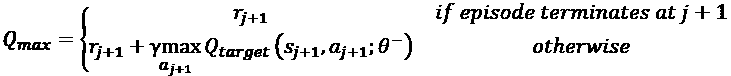

*   `Q_target`选择并评估动作，`a[j+1]`。

DDQN 建议将第 10 行更改为：

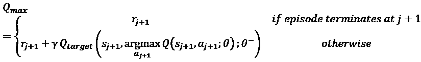

项`argmax[a[j+1]] Q(s[j+1], a[j+1]; θ)`使 Q 函数可以选择动作。 然后，该动作由`Q_target`评估。

“列表 9.6.3”显示了当我们创建一个新的`DDQNAgent`类时，该类继承自`DQNAgent`类。 只有`get_target_q_value()`方法被覆盖，以实现最大 Q 值计算中的更改。

“列表 9.6.3”：`dqn-cartpole-9.6.1.py`：

```py
class DDQNAgent(DQNAgent):
    def __init__(self,
                 state_space,
                 action_space,
                 episodes=500):
        super().__init__(state_space,
                         action_space,
                         episodes)
        """DDQN Agent on CartPole-v0 environment 
```

```py
 Arguments:
            state_space (tensor): state space
            action_space (tensor): action space
            episodes (int): number of episodes to train
        """ 
```

```py
 # Q Network weights filename
        self.weights_file = 'ddqn_cartpole.h5' 
```

```py
 def get_target_q_value(self, next_state, reward):
        """compute Q_max
           Use of target Q Network solves the 
            non-stationarity problem
        Arguments:
            reward (float): reward received after executing
                action on state
            next_state (tensor): next state
        Returns:
            q_value (float): max Q-value computed
        """
        # max Q value among next state's actions
        # DDQN
        # current Q Network selects the action
        # a'_max = argmax_a' Q(s', a')
        action = np.argmax(self.q_model.predict(next_state)[0])
        # target Q Network evaluates the action
        # Q_max = Q_target(s', a'_max)
        q_value = self.target_q_model.predict(\
                                      next_state)[0][action] 
```

```py
 # Q_max = reward + gamma * Q_max
        q_value *= self.gamma
        q_value += reward
        return q_value 
```

为了进行比较，在平均 10 次运行中，`CartPole-v0`由 DDQN 在 971 个剧集中求解。 要使用 DDQN，请运行以下命令：

```py
python3 dqn-cartpole-9.6.1.py -d 
```

DQN 和 DDQN 均表明，借助 DL，Q 学习能够扩展并解决具有连续状态空间和离散动作空间的问题。 在本章中，我们仅在具有连续状态空间和离散动作空间的最简单问题之一上演示了 DQN。 在原始论文中，DQN [2]证明了它可以在许多 Atari 游戏中达到超人的表现水平。

# 7\. 总结

在本章中，我们已经介绍了 DRL，DRL 是一种强大的技术，许多研究人员认为它是 AI 的最有希望的领先者。 我们已经超越了 RL 的原则。 RL 能够解决许多玩具问题，但是 Q 表无法扩展到更复杂的现实问题。 解决方案是使用深度神经网络学习 Q 表。 但是，由于样本相关性和目标 Q 网络的非平稳性，在 RL 上训练深度神经网络非常不稳定。

DQN 提出了一种使用经验回放并将目标网络与受训 Q 网络分离的解决方案。 DDQN 建议通过将动作选择与动作评估分开来最大程度地降低 Q 值，从而进一步改进算法。 DQN 还提出了其他改进建议。 优先经验回放[6]认为，不应对体验缓冲区进行统一采样。

取而代之的是，应更频繁地采样基于 TD 误差的更重要的经验，以完成更有效的训练。 文献[7]提出了一种对决网络架构来估计状态值函数和优势函数。 这两个函数均用于估计 Q 值，以加快学习速度。

本章介绍的方法是值迭代/拟合。 通过找到最佳值函数间接学习策略。 在下一章中，方法将是使用称为策略梯度方法的一系列算法直接学习最佳策略。 学习策略有很多好处。 特别地，策略梯度方法可以处理离散和连续的动作空间。

# 8\. 参考

1.  `Sutton and Barto: Reinforcement Learning: An Introduction, 2017 (http://incompleteideas.net/book/bookdraft2017nov5.pdf).`
1.  `Volodymyr Mnih et al.: Human-level Control through Deep Reinforcement Learning. Nature 518.7540, 2015: 529 (http://www.davidqiu.com:8888/research/nature14236.pdf).`
1.  `Hado Van Hasselt, Arthur Guez, and David Silver: Deep Reinforcement Learning with Double Q-Learning. AAAI. Vol. 16, 2016 (http://www.aaai.org/ocs/index.php/AAAI/AAAI16/paper/download/12389/11847).`
1.  `Kai Arulkumaran et al.: A Brief Survey of Deep Reinforcement Learning. arXiv preprint arXiv:1708.05866, 2017 (https://arxiv.org/pdf/1708.05866.pdf).`
1.  `David Silver: Lecture Notes on Reinforcement Learning (http://www0.cs.ucl.ac.uk/staff/d.silver/web/Teaching.html).`
1.  `Tom Schaul et al.: Prioritized experience replay. arXiv preprint arXiv:1511.05952, 2015 (https://arxiv.org/pdf/1511.05952.pdf).`
1.  `Ziyu Wang et al.: Dueling Network Architectures for Deep Reinforcement Learning. arXiv preprint arXiv:1511.06581, 2015 (https://arxiv.org/pdf/1511.06581.pdf).`