# 十、策略梯度方法

在本章中，我们将介绍在强化学习中直接优化策略网络的算法。 这些算法统称为“策略梯度方法”。 由于策略网络是在训练期间直接优化的，因此策略梯度方法属于*基于策略*强化学习算法的族。 就像我们在“第 9 章”，“深度强化学习”中讨论的基于值的方法一样，策略梯度方法也可以实现为深度强化学习算法。

研究策略梯度方法的基本动机是解决 Q 学习的局限性。 我们会回想起 Q 学习是关于选择使状态值最大化的动作。 借助 Q 函数，我们能够确定策略，使智能体能够决定对给定状态采取何种操作。 选择的动作只是使智能体最大化的动作。 在这方面，Q 学习仅限于有限数量的离散动作。 它不能处理连续的动作空间环境。 此外，Q 学习不是直接优化策略。 最后，强化学习是要找到智能体能够使用的最佳策略，以便决定应采取何种行动以最大化回报。

相反，策略梯度方法适用于具有离散或连续动作空间的环境。 另外，我们将在本章中介绍的四种策略梯度方法是直接优化策略网络的表现度量。 这样就形成了一个经过训练的策略网络，智能体可以使用该网络来最佳地在其环境中采取行动。

总之，本章的目的是介绍：

*   策略梯度定理
*   四种策略梯度方法： **REINFORCE** ， **带基线的 REINFORCE**， **演员评论家**和**优势演员评论家（A2C）**
*   在连续动作空间环境中如何在`tf.keras`中实现策略梯度方法的指南

让我们从定理开始。

# 1\. 策略梯度定理

如“第 9 章”，“深度强化学习”中所讨论的，智能体位于环境中，处于状态`s[t]`中，它是状态空间`S`的一个元素。 状态空间`S`可以是离散的，也可以是连续的。 智能体通过遵循策略`π(a[t], s[t])`从动作空间`A`采取动作`a[t]`。 `A`可以是离散的或连续的。 作为执行动作`a[t]`的结果，智能体会收到奖励`r[t + 1]`，并且环境转换为新状态`s[t + 1]`。 新状态仅取决于当前状态和操作。 智能体的目标是学习一种最佳策略`π*`，该策略可最大化所有状态的回报：

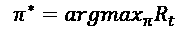 (Equation 9.1.1)

收益`R[t]`定义为从时间`t`直到剧集结束或达到最终状态时的折扣累积奖励：

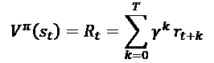 (Equation 9.1.2)

根据“公式 9.1.2”，还可以通过遵循策略`π`将返回解释为给定状态的值。 从“公式 9.1.1”可以看出，与通常的`γ^k < 1.0`相比，与立即奖励相比，未来奖励的权重较低。

到目前为止，我们仅考虑通过优化基于值的函数`Q(s, a)`来学习策略。

本章的目标是通过参数化`π(a[t] | s[t]) -> π(a[t] | s[t], θ)`直接学习该策略。 通过参数化，我们可以使用神经网络来学习策略函数。

学习策略意味着我们将最大化某个目标函数`J(θ)`，这是相对于参数`θ`的一种表现度量。在间歇式强化学习中，表现度量是起始状态的值。 在连续的情况下，目标函数是平均奖励率。

通过执行梯度上升来最大化目标函数`J(θ)`。 在梯度上升中，梯度更新是在要优化的函数的导数方向上。 到目前为止，我们的所有损失函数都通过最小化或通过执行梯度下降进行了优化。 稍后，在`tf.keras`实现中，我们将看到可以通过简单地否定目标函数并执行梯度下降来执行梯度上升。

直接学习策略的好处是它可以应用于离散和连续动作空间。 对于离散的动作空间：

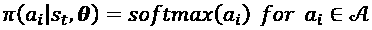 (Equation 10.1.1)

其中`a[i]`是第`i`个动作。 `a[i]`可以是神经网络的预测或状态作用特征的线性函数：

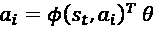 (Equation 10.1.2)

`φ(s[t], a[i])`是将状态操作转换为特征的任何函数，例如编码器。

`π(a[t] | s[t], θ)`确定每个`a[i]`的概率。 例如，在上一章中的柱杆平衡问题中，目标是通过沿二维轴向左或向右移动柱车来保持柱子直立。 在这种情况下，`a[0]`和`a[1]`分别是左右移动的概率。 通常，智能体以最高概率`a[t] = max[i] π(a[t] | s[t], θ)`采取行动。

对于连续动作空间，`π(a[t] | s[t], θ)`根据给定状态的概率分布对动作进行采样。 例如，如果连续动作空间在`a[t] ∈ [-1.0, 1.0]`范围内，则`π(a[t] | s[t], θ)`通常是高斯分布，其均值和标准差由策略网络预测。 预测动作是来自此高斯分布的样本。 为了确保不会生成任何无效的预测，该操作将被限制在 -1.0 和 1.0 之间。

正式地，对于连续的动作空间，该策略是高斯分布的样本：

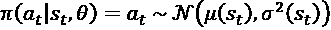 (Equation 10.1.3)

平均值`μ`和标准差`σ`都是状态特征的函数：

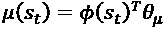 (Equation 10.1.4)

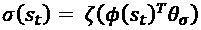 (Equation 10.1.5)

`φ(s[i])`是将状态转换为其特征的任何函数。 `ζ(x) = log(1 + e^x)`是确保标准差为正值的`softplus`函数。 实现状态特征函数`φ(s[t])`的一种方法是使用自编码器网络的编码器。 在本章的最后，我们将训练一个自编码器，并将编码器部分用作状态特征。 因此，训练策略网络是优化参数的问题`θ = [θ[μ], θ[σ]]`。

给定连续可微分的策略函数`π(a[t] | s[t], θ)`，策略梯度可以计算为：

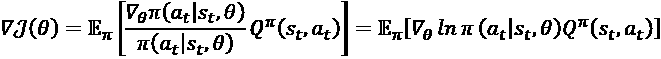 (Equation 10.1.6)

“公式 10.1.6”也被称为*策略梯度定理*。 它适用于离散和连续动作空间。 根据通过 Q 值缩放的策略操作采样的自然对数，可以计算出相对于参数`θ`的梯度。“公式 10.1.6”利用了自然对数`ᐁx/x = ᐁlnx`的特性。

策略梯度定理在某种意义上是直观的，即表现梯度是根据目标策略样本估计的，并且与策略梯度成比例。 策略梯度由 Q 值缩放，以鼓励对状态值产生积极贡献的行动。 梯度还与动作概率成反比，以惩罚对提高性能没有贡献的频繁发生的动作。

有关策略梯度定理的证明，请参阅[2]和 [David Silver 关于强化学习的讲义](http://www0.cs.ucl.ac.uk/staff/d.silver/web/Teaching_files/pg.pdf)。

与策略梯度方法相关的细微优势。 例如，在某些基于纸牌的游戏中，与基于策略的方法不同，基于值的方法在处理随机性方面没有直接的过程。 在基于策略的方法中，操作概率随参数而平滑变化。

同时，相对于参数的微小变化，基于值的行为可能会发生剧烈变化。 最后，基于策略的方法对参数的依赖性使我们对如何执行表现考核的梯度提升产生了不同的表述。 这些是在后续部分中介绍的四种策略梯度方法。

基于策略的方法也有其自身的缺点。 由于趋向于收敛于局部最优而非全局最优，所以它们通常更难训练。 在本章末尾提出的实验中，智能体很容易适应并选择不一定提供最高值的动作。 策略梯度的特征还在于高差异。

梯度更新经常被高估。 此外，基于训练策略的方法非常耗时。 训练需要成千上万集（即采样效率不高）。 每个剧集仅提供少量样本。 在本章结尾处提供的实现方面的典型训练，大约需要一个小时才能在 GTX 1060 GPU 上进行 1,000 集。

在以下各节中，我们将讨论四种策略梯度方法。 虽然讨论的重点是连续的动作空间，但是该概念通常适用于离散的动作空间。

# 2\. 蒙特卡洛策略梯度（REINFORCE）方法

最简单的策略梯度方法是 REINFORCE [4]，这是蒙特卡洛策略梯度方法：

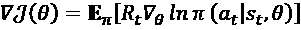 (Equation 10.2.1)

其中`R[t]`是返回值，如“公式 9.1.2”所定义。`R[t]`是策略梯度定理中`Q^π(s[t], a[t])`的无偏样本。

“算法 10.2.1”总结了 REINFORCE 算法[2]。 REINFORCE 是一种蒙特卡洛算法。 它不需要环境动态知识（换句话说，无需模型）。 仅需要经验样本`(s[i], a[i], r[i+1], s[i+1])`来优化策略网络`π(a[t] | s[t])`的参数。 折扣因子`γ`考虑到奖励随着步数增加而降低的事实。 梯度被`γ^k`打折。 在后续步骤中采用的梯度贡献较小。 学习率`α`是梯度更新的比例因子。

通过使用折扣梯度和学习率执行梯度上升来更新参数。 作为蒙特卡洛算法，REINFORCE 要求智能体在处理梯度更新之前先完成一集。 同样由于其蒙特卡洛性质，REINFORCE 的梯度更新具有高方差的特征。

**算法 10.2.1 REINFORCE**

*要求*：可微分的参数化目标策略网络`π(a[t] | s[t], θ)`。

*要求*：折扣因子，`γ = [0, 1]`和学习率`α`。 例如，`γ = 0.99`和`α = 1e - 3`。

*要求*：`θ[0]`，初始策略网络参数（例如，`θ[0] -> 0`）。

1.  重复。
2.  通过跟随`π(a[t] | s[t], θ)`来生成剧集`(s[0]a[0]r[1]s[1], s[1]a[1]r[2]s[2], ..., s[T-1]a[T-1]r[T]s[T])`。
3.  对于步骤`t = 0, ..., T - 1`，执行：
4.  计算返回值`R[t] = Σ γ^t r[t+k], k = 0, ..., T`。
5.  计算折扣的表现梯度`ᐁJ(θ) = r^t R[t] ᐁ[θ] ln π(a[t] | s[t], θ)`。

1.  执行梯度上升`θ = θ + αᐁJ(θ)`。

在 REINFORCE 中，可以通过神经网络对参数化策略进行建模，如图“图 10.2.1”所示：


图 10.2.1：策略网络

如上一节中讨论的，在连续动作空间的情况下，状态输入被转换为特征。 状态特征是策略网络的输入。 代表策略函数的高斯分布具有均值和标准差，均是状态特征的函数。 根据状态输入的性质，策略网络`π(θ)`可以是 MLP，CNN 或 RNN。 预测的动作只是策略函数的样本。

“列表 10.2.1”显示了`REINFORCEAgent` 类，该类在`tf.keras`中实现了“算法 10.2.1”。 `train_by_episode()`在剧集完成后调用，以计算每个步骤的回报。 `train()`通过针对目标函数`logp_model`优化网络来执行“算法 10.2.1”的第 5 行和第 6 行。 父类`PolicyAgent`在本章介绍的四种策略梯度方法的算法中实现了的通用代码。 在讨论所有策略梯度方法之后，将介绍`PolicyAgent`。

“列表 10.2.1”：`policygradient-car-10.1.1.py`

```py
class REINFORCEAgent(PolicyAgent):
    def __init__(self, env):
        """Implements the models and training of 
           REINFORCE policy gradient method
        Arguments:
            env (Object): OpenAI gym environment
        """
        super().__init__(env) 
```

```py
 def train_by_episode(self):
        """Train by episode
           Prepare the dataset before the step by step training
        """
        # only REINFORCE and REINFORCE with baseline
        # use the ff code
        # convert the rewards to returns
        rewards = []
        gamma = 0.99
        for item in self.memory:
            [_, _, _, reward, _] = item
            rewards.append(reward)

        # compute return per step
        # return is the sum of rewards from t til end of episode
        # return replaces reward in the list
        for i in range(len(rewards)):
            reward = rewards[i:]
            horizon = len(reward)
            discount =  [math.pow(gamma, t) for t in range(horizon)]
            return_ = np.dot(reward, discount)
            self.memory[i][3] = return_ 
```

```py
 # train every step
        for item in self.memory:
            self.train(item, gamma=gamma) 
```

```py
 def train(self, item, gamma=1.0):
        """Main routine for training 
        Arguments:
            item (list) : one experience unit
            gamma (float) : discount factor [0,1]
        """
        [step, state, next_state, reward, done] = item 
```

```py
 # must save state for entropy computation
        self.state = state 
```

```py
 discount_factor = gamma**step
        delta = reward 
```

```py
 # apply the discount factor as shown in Algorithms
        # 10\. 2.1, 10.3.1 and 10.4.1
        discounted_delta = delta * discount_factor
        discounted_delta = np.reshape(discounted_delta, [-1, 1])
        verbose = 1 if done else 0 
```

```py
 # train the logp model (implies training of actor model
        # as well) since they share exactly the same set of
        # parameters
        self.logp_model.fit(np.array(state),
                            discounted_delta,
                            batch_size=1,
                            epochs=1,
                            verbose=verbose) 
```

以下部分提出了对 REINFORCE 方法的改进。

# 3\. 带基线方法的 REINFORCE

REINFORCE 算法可以通过从收益`δ = R[t] - B(s[t])`中减去基线来概括。 基线函数`B(s[t])`可以是任何函数，只要它不依赖`a[t]`即可。 基线不会改变表现梯度的期望：

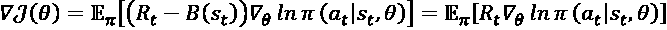 (Equation 10.3.1)

“公式 10.3.1”隐含`E[π] [B(s[t]) ᐁ[θ] ln π(a[t] | s[t], θ)] = 0`，因为`B(s[t])`不是`a[t]`的函数。 尽管引入基准不会改变期望值，但会减小梯度更新的方差。 方差的减少通常会加速学习。

在大多数情况下，我们使用值函数`B(s[t]) = V(s[t])`作为基准。 如果收益被高估，则比例系数将通过值函数成比例地减小，从而导致较低的方差。 值函数也已参数化`V(s[t]) = V(s[t]; θ[v])`，并与策略网络一起进行了训练。 在连续动作空间中，状态值可以是状态特征的线性函数：

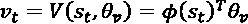 (Equation 10.3.2)

“算法 10.3.1”用基线方法[1]总结了 REINFORCE。 这与 REINFORCE 相似，只不过将返回值替换为`δ`。 区别在于我们现在正在训练两个神经网络。

算法 10.3.1 带基线的 REINFORCE

*要求*：可微分的参数化目标策略网络`π(a[t] | s[t], θ)`。

*要求*：可微分的参数化值网络`V(s[t], θ[v])`。

*要求*：折扣因子`γ ∈ [0, 1]`，表现梯度的学习率`α`和值梯度`α[v]`的学习率。

*要求*：`θ[0]`，初始策略网络参数（例如，`θ[0] -> 0`）。 `θ[v0]`，初始值网络参数（例如`θ[v0] -> 0`）。

1.  重复。
2.  通过跟随`π(a[t] | s[t], θ)`来生成剧集`(s[0]a[0]r[1]s[1], s[1]a[1]r[2]s[2], ..., a[T-1]a[T-1]r[T]s[T])`。
3.  对于步骤`t = 0, ..., T - 1`，执行：
4.  计算返回值：

    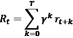
5.  减去基线：

    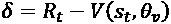
6.  计算折扣值梯度：

    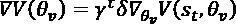
7.  执行梯度上升：

    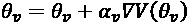
8.  计算折扣的表现梯度：

    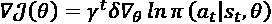

1.  执行梯度上升：

    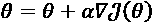

如图“图 10.3.1”所示，除了策略网络`π(θ)`之外，值网络`V(θ)`也同时受到训练。 通过表现梯度`ᐁJ(θ)`更新策略网络参数，而通过梯度`ᐁV(θ[v])`调整值网络参数。 由于 REINFORCE 是蒙特卡罗算法，因此值函数训练也是蒙特卡罗算法。

学习率不一定相同。 请注意，值网络也在执行梯度上升。

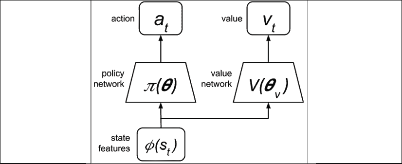

图 10.3.1：策略和值网络。 具有基线的 REINFORCE 具有一个计算基线的值网络

“列表 10.3.1”显示了`REINFORCEBaselineAgent`类，该类在`tf.keras`中实现了“算法 10.3.1”。 它继承自`REINFORCEAgent`，因为这两种算法仅在和`train()`方法上有所不同。 “算法 10.3.1”的第 5 行由`delta = reward - self.value(state)[0]`计算。 然后，通过调用各自模型的`fit()`方法来优化第 7 行和第 9 行中用于目标和值函数的网络`logp_model`和`value_model`。

“列表 10.3.1”：`policygradient-car-10.1.1.py`

```py
class REINFORCEBaselineAgent(REINFORCEAgent):
    def __init__(self, env):
        """Implements the models and training of 
           REINFORCE w/ baseline policy 
           gradient method
        Arguments:
            env (Object): OpenAI gym environment
        """
        super().__init__(env) 
```

```py
 def train(self, item, gamma=1.0):
        """Main routine for training 
        Arguments:
            item (list) : one experience unit
            gamma (float) : discount factor [0,1]
        """
        [step, state, next_state, reward, done] = item 
```

```py
 # must save state for entropy computation
        self.state = state 
```

```py
 discount_factor = gamma**step 
```

```py
 # reinforce-baseline: delta = return - value
        delta = reward - self.value(state)[0] 
```

```py
 # apply the discount factor as shown in Algorithms
        # 10\. 2.1, 10.3.1 and 10.4.1
        discounted_delta = delta * discount_factor
        discounted_delta = np.reshape(discounted_delta, [-1, 1])
        verbose = 1 if done else 0 
```

```py
 # train the logp model (implies training of actor model
        # as well) since they share exactly the same set of
        # parameters
        self.logp_model.fit(np.array(state),
                            discounted_delta,
                            batch_size=1,
                            epochs=1,
                            verbose=verbose) 
```

```py
 # train the value network (critic)
        self.value_model.fit(np.array(state),
                             discounted_delta,
                             batch_size=1,
                             epochs=1,
                             verbose=verbose) 
```

在的下一部分中，我们将介绍使用基准线方法对 REINFORCE 的改进。

# 4\. 演员评论家方法

在带有基线的 REINFORCE 方法中，该值用作基线。 它不用于训练值函数。 在本节中，我们介绍 REINFORCE 与基线的变化，称为演员评论家方法。 策略和值网络扮演着参与者和批评者网络的角色。 策略网络是参与者决定给定状态时要采取的操作。 同时，值网络评估参与者或策略网络做出的决策。

值网络充当批评者的角色，可以量化参与者所选择的行动的好坏。 值网络通过将状态值`V(s, θ[v]`与收到的奖励`r`和观察到的下一个状态`γV(s', θ[v])`的折扣值之和来评估状态值。 差异`δ`表示为：

 (Equation 10.4.1)

为了简单起见，我们在中删除了`r`和`s`的下标。“公式 10.4.1”类似于“第 9 章”，“深度强化学习”中讨论的 Q 学习中的时间差异。 下一个状态值被`γ = [0.0, 1.0]`折扣。估计遥远的未来奖励很困难。 因此，我们的估计仅基于近期`r + γV(s', θ[v])`。 这就是*自举*技术。

自举技术和“公式 10.4.1”中状态表示的依赖性通常会加速学习并减少差异。 从“公式 10.4.1”，我们注意到值网络评估了当前状态`s = s[t]`，这是由于策略网络的上一个操作`a[t-1]`。 同时，策略梯度基于当前动作`a[t]`。 从某种意义上说，评估延迟了一步。

“算法 10.4.1”总结了演员评论家方法[1]。 除了评估用于训练策略和值网络的状态值评估外，还可以在线进行训练。 在每个步骤中，两个网络都经过训练。 这与 REINFORCE 和带有基线的 REINFORCE 不同，在基线之前，智能体完成了一个剧集。 首先，在当前状态的值估计期间向值网络查询两次，其次，为下一个状态的值查询。 这两个值都用于梯度计算中。

**算法 10.4.1 演员评论家**

*要求*：可微分的参数化目标策略网络`π(a | s, θ)`。

*要求*：可微分的参数化值网络`V(s, θ[v])`。

*要求*：折扣因子`γ ∈ [0, 1]`，表现梯度的学习率`α`和值梯度`α[v]`的学习率。

*要求*：`θ[0]`，初始策略网络参数（例如，`θ[0] -> 0`）。 `θ[v0]`，初始值网络参数（例如`θ[v0] -> 0`）。

1.  重复。
2.  对于步骤`t = 0, ..., T - 1`，执行：
3.  对动作`a ~ π(a | s, θ)`进行采样。
4.  执行动作并观察奖励`r`和下一个状态`s'`。
5.  评估状态值估计：

    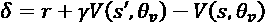
6.  计算折扣值梯度：

    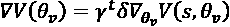
7.  执行梯度上升：

    
8.  计算折扣表现梯度：

    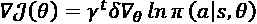
9.  执行梯度上升：

    

1.  `s = s'`

“图 10.4.1”显示了演员评论家网络：

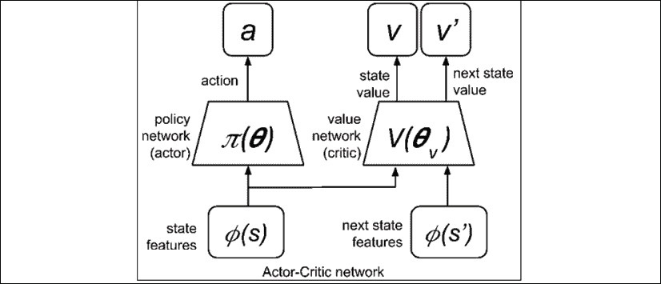

图 10.4.1：演员评论家网络。 通过对值`V'`的第二次评估，演员评论家与 REINFORCE 的基线有所不同

“列表 10.4.1”显示了`ActorCriticAgent`类，该类在`tf.keras`中实现了“算法 10.4.1”。 与两种 REINFORCE 方法不同，演员评论家不等待剧集完成。 因此，它没有实现`train_by_episode()`。 在每个体验单元，通过调用各自模型的`fit()`方法，优化第 7 行和第 9 行中用于目标和值函数`logp_model`和`value_model`的网络。 `delta`变量存储第 5 行的结果。

“列表 10.4.1”：`policygradient-car-10.1.1.py`

```py
class ActorCriticAgent(PolicyAgent):
    def __init__(self, env):
        """Implements the models and training of 
           Actor Critic policy gradient method
        Arguments:
            env (Object): OpenAI gym environment
        """
        super().__init__(env) 
```

```py
 def train(self, item, gamma=1.0):
        """Main routine for training
        Arguments:
            item (list) : one experience unit
            gamma (float) : discount factor [0,1]
        """
        [step, state, next_state, reward, done] = item 
```

```py
 # must save state for entropy computation
        self.state = state 
```

```py
 discount_factor = gamma**step 
```

```py
 # actor-critic: delta = reward - value 
        #       + discounted_next_value
        delta = reward - self.value(state)[0] 
```

```py
 # since this function is called by Actor-Critic
        # directly, evaluate the value function here
        if not done:
            next_value = self.value(next_state)[0]
            # add  the discounted next value
            delta += gamma*next_value 
```

```py
 # apply the discount factor as shown in Algortihms
        # 10\. 2.1, 10.3.1 and 10.4.1
        discounted_delta = delta * discount_factor
        discounted_delta = np.reshape(discounted_delta, [-1, 1])
        verbose = 1 if done else 0 
```

```py
 # train the logp model (implies training of actor model
        # as well) since they share exactly the same set of
        # parameters
        self.logp_model.fit(np.array(state),
                            discounted_delta,
                            batch_size=1,
                            epochs=1,
                            verbose=verbose) 
```

最终的策略梯度方法是 A2C。

# 5\. 优势演员评论家（A2C）方法

在上一节的演员评论家方法中，目标是使的值函数正确评估状态值。 还有其他用于训练值网络的技术。 一种明显的方法是在值函数优化中使用**均方误差**（**MSE**），类似于 Q 学习中的算法。 新值梯度等于返回值`R[t]`与状态值之间的 MSE 偏导数：

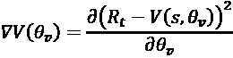 (Equation 10.5.1)

作为`(R[t] - V(s, θ[v])) -> 0`，值网络预测在预测给定状态的收益时变得更加准确。 我们将演员评论家算法的这种变化称为“优势演员评论家（A2C）”。 A2C 是[3]提出的“异步优势参与者关键（A3C）”的单线程或同步版本。 数量`R[t] - V(s, θ[v])`被称为*优势*。

“算法 10.5.1”总结了 A2C 方法。 A2C 和演员评论家之间存在一些差异。演员评论家在线上或根据经验样本进行训练。 A2C 类似于带基线的蒙特卡洛算法，REINFORCE 和 REINFORCE。 一集完成后，将对其进行训练。 从第一个状态到最后一个状态都对演员评论家进行了训练。 A2C 训练从最后一个状态开始，并在第一个状态结束。 此外，`γ^t`不再打折 A2C 策略和值梯度。

A2C 的相应网络类似于“图 10.4.1”，因为我们仅更改了梯度计算方法。 为了鼓励训练过程中的探员探索，A3C 算法[3]建议将策略函数的加权熵值的梯度添加到到梯度函数`β ᐁ[θ] H(π(a[t] | s[t], θ))`中。 回想一下，熵是对信息或事件不确定性的度量。

**算法 10.5.1 优势演员评论家（A2C）**

*要求*：可微分的参数化目标策略网络`π(a[t] | s[t], θ)`。

*要求*：可微分的参数化值网络`V(s[t], θ[v])`。

*要求*：折扣因子`γ ∈ [0, 1]`，表现梯度的学习率`α`，值梯度的学习率`α[v]`和熵权`β`。

*要求*：`θ[0]`，初始策略网络参数（例如，`θ[0] -> 0`）。 `θ[v0]`，初始值网络参数（例如`θ[v0] -> 0`）。

1.  重复。
2.  通过跟随`π(a[t] | s[t], θ)`来生成剧集`(s[0]a[0]r[1]s[1], s[1]a[1]r[2]s[2], ..., a[T-1]a[T-1]r[T]s[T])`。
3.  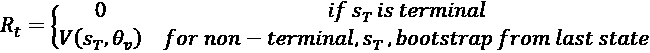
4.  对于步骤`t = 0, ..., T - 1`，执行：
5.  计算返回值：

    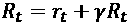
6.  计算值梯度：

    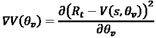
7.  累积梯度：

    
8.  计算表现梯度：

    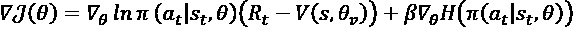

1.  执行梯度上升：

    

“列表 10.5.1”显示了`A2CAgent`类，该类在`tf.keras`中实现了“算法 10.5.1”。 与两个 REINFORCE 方法不同，返回值是从最后一个体验单元或状态到第一个体验单元或状态的计算得出的。 在每个体验单元，通过调用各自模型的`fit()`方法，优化第 7 行和第 9 行中用于目标和值函数`logp_model`和`value_model`的网络。 注意，在对象实例化期间，熵损失的`beta`或权重设置为`0.9`，以指示将使用熵损失函数。 此外，使用 MSE 损失函数训练`value_model`。

“列表 10.5.1”：`policygradient-car-10.1.1.py`

```py
class A2CAgent(PolicyAgent):
    def __init__(self, env):
        """Implements the models and training of 
           A2C policy gradient method
        Arguments:
            env (Object): OpenAI gym environment
        """
        super().__init__(env)
        # beta of entropy used in A2C
        self.beta = 0.9
        # loss function of A2C value_model is mse
        self.loss = 'mse' 
```

```py
 def train_by_episode(self, last_value=0):
        """Train by episode 
           Prepare the dataset before the step by step training
        Arguments:
            last_value (float): previous prediction of value net
        """
        # implements A2C training from the last state
        # to the first state
        # discount factor
        gamma = 0.95
        r = last_value
        # the memory is visited in reverse as shown
        # in Algorithm 10.5.1
        for item in self.memory[::-1]:
            [step, state, next_state, reward, done] = item
            # compute the return
            r = reward + gamma*r
            item = [step, state, next_state, r, done]
            # train per step
            # a2c reward has been discounted
            self.train(item) 
```

```py
 def train(self, item, gamma=1.0):
        """Main routine for training 
        Arguments:
            item (list) : one experience unit
            gamma (float) : discount factor [0,1]
        """
        [step, state, next_state, reward, done] = item 
```

```py
 # must save state for entropy computation
        self.state = state 
```

```py
 discount_factor = gamma**step 
```

```py
 # a2c: delta = discounted_reward - value
        delta = reward - self.value(state)[0] 
```

```py
 verbose = 1 if done else 0 
```

```py
 # train the logp model (implies training of actor model
        # as well) since they share exactly the same set of
        # parameters
        self.logp_model.fit(np.array(state),
                            discounted_delta,
                            batch_size=1,
                            epochs=1,
                            verbose=verbose) 
```

```py
 # in A2C, the target value is the return (reward
        # replaced by return in the train_by_episode function)
        discounted_delta = reward
        discounted_delta = np.reshape(discounted_delta, [-1, 1]) 
```

```py
 # train the value network (critic)
        self.value_model.fit(np.array(state),
                             discounted_delta,
                             batch_size=1,
                             epochs=1,
                             verbose=verbose) 
```

在介绍的四种算法中，它们仅在目标函数和值（如果适用）优化方面有所不同。 在下一节中，我们将介绍四种算法的统一代码。

# 6\. 使用 Keras 的策略梯度方法

上一节中讨论的策略梯度方法（“算法 10.2.1”至“算法 10.5.1”）使用相同的策略和值网络模型。“图 10.2.1”至“图 10.4.1”中的策略和值网络具有相同的配置。 四种策略梯度方法的不同之处仅在于：

*   表现和值梯度公式
*   训练策略

在本节中，我们将以一个代码讨论`tf.keras`算法 10.2.1 至“算法 10.5.1”的通用例程在`tf.keras`中的实现。

完整的代码可以在[这个页面](https://github.com/PacktPublishing/Advanced-Deep-Learning-with-Keras)中找到。

但是在讨论实现之前，让我们简要探讨训练环境。

与 Q 学习不同，策略梯度方法适用于离散和连续动作空间。 在我们的示例中，我们将在连续动作空间案例示例中演示四种策略梯度方法，例如 OpenAI 健身房的[`MountainCarContinuous-v0`](https://gym.openai.com)。 如果您不熟悉 OpenAI Gym，请参阅“第 9 章”，“深度强化学习”。

“图 10.6.1”中显示了`MountainCarContinuous-v0`二维环境的快照。在此二维环境中，一辆功率不太强的汽车停在两座山之间：

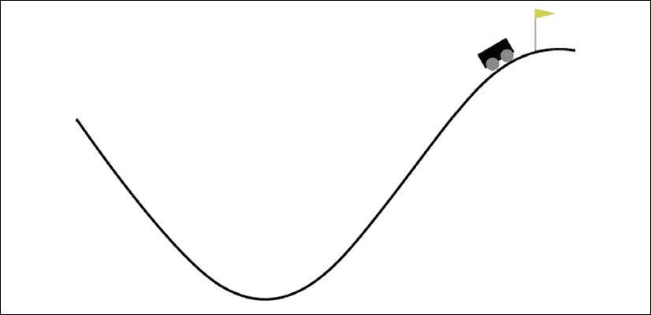

图 10.6.1：`MountainCarContinuous-v0` OpenAI Gym 环境

为了到达右侧山顶的黄旗，它必须来回行驶以获得足够的动力。 应用于汽车的能量越多（即动作的绝对值越大），则奖励越小（或负作用越大）。

奖励始终为负，到达标志时仅为正。 在这种情况下，汽车将获得 +100 的奖励。 但是，每个操作都会受到以下代码的惩罚：

```py
reward-= math.pow(action[0],2)*0.1 
```

有效动作值的连续范围是`[-1.0, 1.0]`。 超出范围时，动作将被剪裁为其最小值或最大值。 因此，应用大于 1.0 或小于 -1.0 的操作值是没有意义的。

`MountainCarContinuous-v0`环境状态包含两个元素：

*   车厢位置
*   车速

通过编码器将状态转换为状态特征。 像动作空间一样，状态空间也是连续的。 预测的动作是给定状态的策略模型的输出。 值函数的输出是状态的预测值。

如图“图 10.2.1”到“图 10.4.1”所示，在建立策略和值网络之前，我们必须首先创建一个将状态转换为特征的函数。 该函数由自编码器的编码器实现，类似于在“第 3 章”，“自编码器”中实现的编码器。

“图 10.6.2”显示了包括编码器和解码器的自编码器：

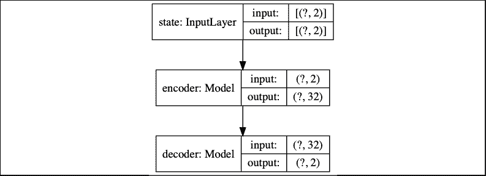

图 10.6.2：自编码器模型

在“图 10.6.3”中，编码器是由`Input(2)-Dense(256, activation='relu')-Dense(128, activation='relu')-Dense(32)`制成的 MLP。 每个状态都转换为 32 维特征向量：

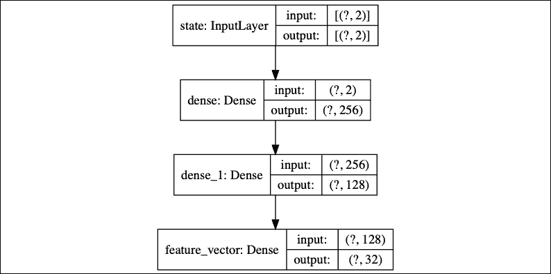

图 10.6.3：编码器模型

在“图 10.6.4”中，解码器也是 MLP，但由`Input(32)-Dense(128, activation='relu')-Dense(256, activation='relu')-Dense(2)`制成：

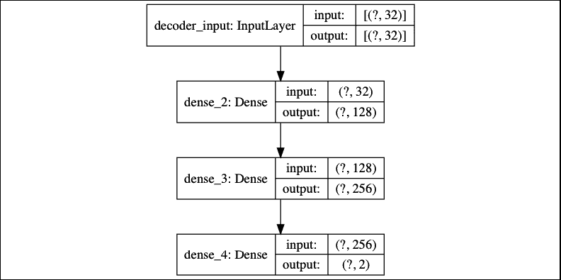

图 10.6.4：解码器模型

自编码器使用 MSE，损失函数和`tf.keras`默认的 Adam 优化器训练了 10 个周期。 我们为训练和测试数据集采样了 220,000 个随机状态，并应用了 200,000:20,000 个训练测试拆分。 训练后，将保存编码器权重，以备将来在策略和值网络的训练中使用。“列表 10.6.1”显示了构建和训练自编码器的方法。

在`tf.keras`实现中，除非另有说明，否则我们将在本节中提及的所有例程均作为`PolicyAgent`类中的方法实现。 `PolicyAgent`的作用是代表策略梯度方法的常用功能，包括建立和训练自编码器网络模型以及预测动作，对数概率，熵和状态值。 这是“列表 10.2.1”至“列表 10.5.1”中介绍的每个策略梯度方法智能体类的超类。

“列表 10.6.1”：`policygradient-car-10.1.1.py`

构建和训练特征自编码器的方法：

```py
class PolicyAgent:
    def __init__(self, env):
        """Implements the models and training of 
            Policy Gradient Methods
        Argument:
            env (Object): OpenAI gym environment
        """ 
```

```py
 self.env = env
        # entropy loss weight
        self.beta = 0.0
        # value loss for all policy gradients except A2C
        self.loss = self.value_loss 
```

```py
 # s,a,r,s' are stored in memory
        self.memory = [] 
```

```py
 # for computation of input size
        self.state = env.reset()
        self.state_dim = env.observation_space.shape[0]
        self.state = np.reshape(self.state, [1, self.state_dim])
        self.build_autoencoder() 
```

```py
 def build_autoencoder(self):
        """autoencoder to convert states into features
        """
        # first build the encoder model
        inputs = Input(shape=(self.state_dim, ), name='state')
        feature_size = 32
        x = Dense(256, activation='relu')(inputs)
        x = Dense(128, activation='relu')(x)
        feature = Dense(feature_size, name='feature_vector')(x) 
```

```py
 # instantiate encoder model
        self.encoder = Model(inputs, feature, name='encoder')
        self.encoder.summary()
        plot_model(self.encoder,
                   to_file='encoder.png',
                   show_shapes=True) 
```

```py
 # build the decoder model
        feature_inputs = Input(shape=(feature_size,),
                               name='decoder_input')
        x = Dense(128, activation='relu')(feature_inputs)
        x = Dense(256, activation='relu')(x)
        outputs = Dense(self.state_dim, activation='linear')(x) 
```

```py
 # instantiate decoder model
        self.decoder = Model(feature_inputs,
                             outputs,
                             name='decoder')
        self.decoder.summary()
        plot_model(self.decoder,
                   to_file='decoder.png',
                   show_shapes=True) 
```

```py
 # autoencoder = encoder + decoder
        # instantiate autoencoder model
        self.autoencoder = Model(inputs,
                                 self.decoder(self.encoder(inputs)),
                                 name='autoencoder')
        self.autoencoder.summary()
        plot_model(self.autoencoder,
                   to_file='autoencoder.png',
                   show_shapes=True) 
```

```py
 # Mean Square Error (MSE) loss function, Adam optimizer
        self.autoencoder.compile(loss='mse', optimizer='adam') 
```

```py
 def train_autoencoder(self, x_train, x_test):
        """Training the autoencoder using randomly sampled
            states from the environment
        Arguments:
            x_train (tensor): autoencoder train dataset
            x_test (tensor): autoencoder test dataset
        """ 
```

```py
 # train the autoencoder
        batch_size = 32
        self.autoencoder.fit(x_train,
                             x_train,
                             validation_data=(x_test, x_test),
                             epochs=10,
                             batch_size=batch_size) 
```

在给定`MountainCarContinuous-v0`环境的情况下，策略（或参与者）模型会预测必须应用于汽车的操作。 如本章第一部分中有关策略梯度方法的讨论所述，对于连续动作空间，策略模型从高斯分布`π(a[t] | s[t], θ) = a[t] ~ N(μ(s[t]), σ²(s[t]))`中采样一个动作。 在`tf.` `keras`中，实现为：

```py
import tensorflow_probability as tfp
    def action(self, args):
        """Given mean and stddev, sample an action, clip 
            and return
            We assume Gaussian distribution of probability 
            of selecting an action given a state
        Arguments:
            args (list) : mean, stddev list
        """
        mean, stddev = args
        dist = tfp.distributions.Normal(loc=mean, scale=stddev)
        action = dist.sample(1)
        action = K.clip(action,
                        self.env.action_space.low[0],
                        self.env.action_space.high[0])
        return action 
```

动作被限制在其最小和最大可能值之间。 在这种方法中，我们使用`TensorFlow probability`包。 可以通过以下方式单独安装：

```py
pip3 install --upgrade tensorflow-probability 
```

策略网络的作用是预测高斯分布的均值和标准差。“图 10.6.5”显示了为`π(a[t] | s[t], θ)`建模的策略网络。

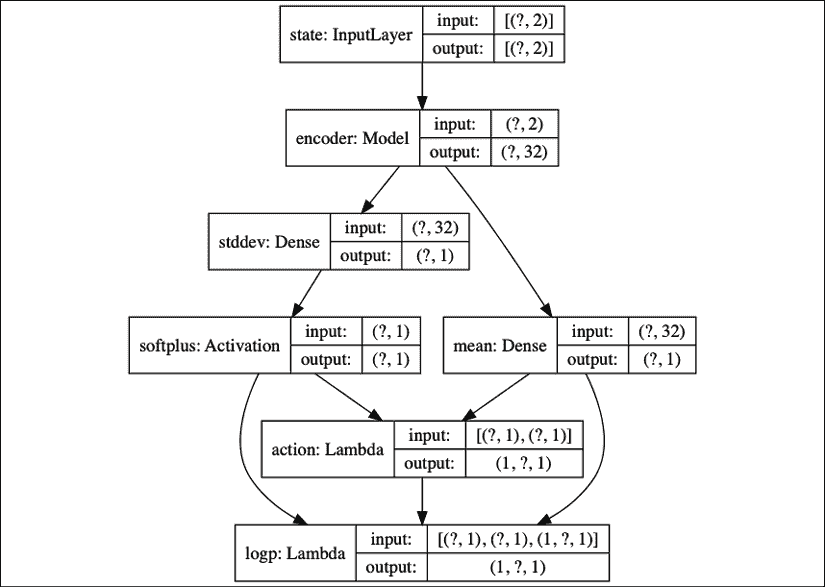

图 10.6.5：策略模型（参与者模型）

请注意，编码器模型具有冻结的预训练权重。 仅平均值和标准差权重会收到表现梯度更新。 策略网络基本上是“公式 10.1.4”和“公式 10.1.5”的实现，为方便起见在此重复：

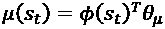 (Equation 10.1.4)

 (Equation 10.1.5)

其中`φ(s[t])`是编码器，`θ[μ]`是平均值`Dense(1)`层的权重，`θ[σ]`是标准差`Dense(1)`层的权重。 我们使用修改后的`softplus`函数`ζ(·)`来避免标准差为零：

```py
def softplusk(x):
    """Some implementations use a modified softplus 
        to ensure that the stddev is never zero
    Argument:
        x (tensor): activation input
    """
    return K.softplus(x) + 1e-10 
```

策略模型构建器显示在“列表 10.6.2”中。 对数概率，熵和值模型也包含在此清单中，我们将在下面讨论。

“列表 10.6.2”：`policygradient-car-10.1.1.py`

根据编码后的状态特征构建策略（角色），`logp`，熵和值模型的方法：

```py
 def build_actor_critic(self):
        """4 models are built but 3 models share the
            same parameters. hence training one, trains the rest.
            The 3 models that share the same parameters 
                are action, logp, and entropy models. 
            Entropy model is used by A2C only.
            Each model has the same MLP structure:
            Input(2)-Encoder-Output(1).
            The output activation depends on the nature 
                of the output.
        """
        inputs = Input(shape=(self.state_dim, ), name='state')
        self.encoder.trainable = False
        x = self.encoder(inputs)
        mean = Dense(1,
                     activation='linear',
                     kernel_initializer='zero',
                     name='mean')(x)
        stddev = Dense(1,
                       kernel_initializer='zero',
                       name='stddev')(x)
        # use of softplusk avoids stddev = 0
        stddev = Activation('softplusk', name='softplus')(stddev)
        action = Lambda(self.action,
                        output_shape=(1,),
                        name='action')([mean, stddev])
        self.actor_model = Model(inputs, action, name='action')
        self.actor_model.summary()
        plot_model(self.actor_model,
                   to_file='actor_model.png',
                   show_shapes=True) 
```

```py
 logp = Lambda(self.logp,
                      output_shape=(1,),
                      name='logp')([mean, stddev, action])
        self.logp_model = Model(inputs, logp, name='logp')
        self.logp_model.summary()
        plot_model(self.logp_model,
                   to_file='logp_model.png',
                   show_shapes=True) 
```

```py
 entropy = Lambda(self.entropy,
                         output_shape=(1,),
                         name='entropy')([mean, stddev])
        self.entropy_model = Model(inputs, entropy, name='entropy')
        self.entropy_model.summary()
        plot_model(self.entropy_model,
                   to_file='entropy_model.png',
                   show_shapes=True) 
```

```py
 value = Dense(1,
                      activation='linear',
                      kernel_initializer='zero',
                      name='value')(x)
        self.value_model = Model(inputs, value, name='value')
        self.value_model.summary()
        plot_model(self.value_model,
                   to_file='value_model.png',
                   show_shapes=True) 
```

```py
 # logp loss of policy network
        loss = self.logp_loss(self.get_entropy(self.state),
                              beta=self.beta)
        optimizer = RMSprop(lr=1e-3)
        self.logp_model.compile(loss=loss, optimizer=optimizer) 
```

```py
 optimizer = Adam(lr=1e-3)
        self.value_model.compile(loss=self.loss, optimizer=optimizer) 
```

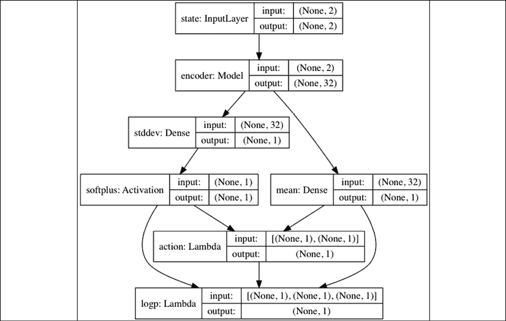

图 10.6.6：策略的高斯对数概率模型

除了策略网络`π(a[t] | s[t], θ)`之外，我们还必须具有操作日志概率（`logp`）网络`ln π(a[t] | s[t], θ)`，因为该实际上是计算梯度的系统。 如图“图 10.6.6”所示，`logp`网络只是一个策略网络，其中附加的 Lambda（1）层在给定了作用，均值和标准差的情况下计算了高斯分布的对数概率。

`logp`网络和参与者（策略）模型共享同一组参数。 Lambda 层没有任何参数。 它是通过以下函数实现的：

```py
 def logp(self, args):
        """Given mean, stddev, and action compute
            the log probability of the Gaussian distribution
        Arguments:
            args (list) : mean, stddev action, list
        """
        mean, stddev, action = args
        dist = tfp.distributions.Normal(loc=mean, scale=stddev)
        logp = dist.log_prob(action)
        return logp 
```

训练`logp`网络也可以训练角色模型。 在本节中讨论的训练方法中，仅训练`logp`网络。

如图“图 10.6.7”所示，熵模型还与策略网络共享参数：

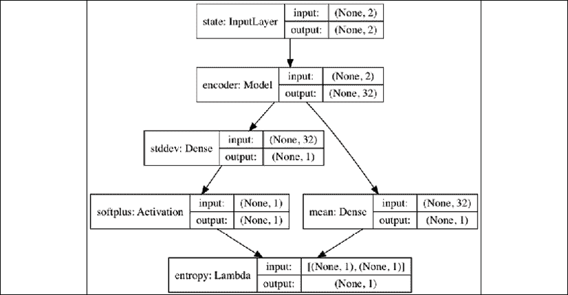

图 10.6.7：熵模型

给定平均值和标准差，使用以下函数，输出`Lambda(1)`层计算高斯分布的熵：

```py
 def entropy(self, args):
        """Given the mean and stddev compute 
            the Gaussian dist entropy
        Arguments:
            args (list) : mean, stddev list
        """
        mean, stddev = args
        dist = tfp.distributions.Normal(loc=mean, scale=stddev)
        entropy = dist.entropy()
        return entropy 
```

熵模型仅用于 A2C 方法。

“图 10.6.8”显示了值模型：

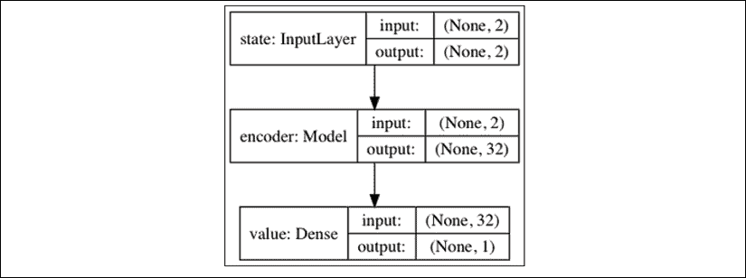

图 10.6.8：值模型

该模型还使用具有权重的预训练编码器来实现以下公式“公式 10.3.2”，为方便起见，在此重复：

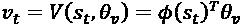 (Equation 10.3.2)

`θ[v]`是`Dense(1)`层的权重，该层是唯一接收值梯度更新的层。“图 10.6.8”表示“算法 10.3.1”至“算法 10.5.1”中的`V(s[t], θ[v])`。 值模型可以建立在以下几行中：

```py
inputs = Input(shape=(self.state_dim, ), name='state')
self.encoder.trainable = False
x = self.encoder(inputs)
value = Dense(1,
              activation='linear',
              kernel_initializer='zero',
              name='value')(x)
self.value_model = Model(inputs, value, name='value') 
```

这些行也用`build_actor_critic()`方法实现，如清单 10.6.2 所示。

建立网络模型后，下一步就是训练。 在“算法 10.2.1”至“算法 10.5.1”中，我们通过梯度上升执行目标函数最大化。 在`tf.keras`中，我们通过梯度下降执行损失函数最小化。 损失函数只是目标函数最大化的负数。 梯度下降是梯度上升的负值。“列表 10.6.3”显示了`logp`和值损失函数。

我们可以利用损失函数的通用结构来统一“算法 10.2.1”至“算法 10.5.1”中的损失函数。 表现和值梯度仅在其恒定因子上有所不同。 所有表现梯度都有一个通用项`ᐁ[θ] ln π(a[t] | s[t], θ)`。 这由策略日志概率损失函数`logp_loss()`中的`y_pred`表示。 通用项`ᐁ[θ] ln π(a[t] | s[t], θ)`的因素取决于哪种算法，并实现为`y_true`。“表 10.6.1”显示`y_true`的值。 其余项是熵的加权梯度`β ᐁ[θ] H(π(a[t] | s[t], θ))`。 这是通过`logp_loss()`函数中`beta`和`entropy`的乘积实现的。 仅 A2C 使用此项，因此默认为`self.beta=0.0`。 对于 A2C，`self.beta=0.9`。

“列表 10.6.3”：`policygradient-car-10.1.1.py`

`logp`和值网络的损失函数：

```py
 def logp_loss(self, entropy, beta=0.0):
        """logp loss, the 3rd and 4th variables 
            (entropy and beta) are needed by A2C 
            so we have a different loss function structure
        Arguments:
            entropy (tensor): Entropy loss
            beta (float): Entropy loss weight
        """
        def loss(y_true, y_pred):
            return -K.mean((y_pred * y_true) \
                    + (beta * entropy), axis=-1) 
```

```py
 return loss 
```

```py
 def value_loss(self, y_true, y_pred):
        """Typical loss function structure that accepts 
            2 arguments only
           this will be used by value loss of all methods 
            except A2C
        Arguments:
            y_true (tensor): value ground truth
            y_pred (tensor): value prediction
        """
        return -K.mean(y_pred * y_true, axis=-1) 
```

| **算法** | `logp_loss`的`y_true` | `value_loss`的`y_true` |
| --- | --- | --- |
| 10.2.1 REINFORCE | `γ^t R[t]` | 不适用 |
| 10.3.1 使用基线的 REINFORCE | `γ^t δ` | `γ^t δ` |
| 10.4.1 演员评论家 | `γ^t δ` | `γ^t δ` |
| 10.5.1 A2C | `R[t] - V(s, θ[v])` | `R[t]` |

表 10.6.1：`logp_loss`的`y_true`值和`value_loss`

“表 10.6.2”中显示了用于计算“表 10.6.1”中的`y_true`的代码实现：

| **算法** | `y_true`公式 | Keras 中的`y_true` |
| --- | --- | --- |
| 10.2.1 REINFORCE | `γ^t R[t]` | `reward * discount_factor` |
| 10.3.1 使用基线的 REINFORCE | `γ^t δ` | `(reward - self.value(state)[0]) * discount_factor` |
| 10.4.1 演员评论家 | `γ^t δ` | `(reward - self.value(state)[0] +  gamma * next_value) * discount_factor` |
| 10.5.1 A2C | `R[t] - V(s, θ[v])`和`R[t]` | （`reward - self.value(state)[0]`）和`reward` |

表 10.6.2：表 10.6.1 中的`y_true`值

类似地，“算法 10.3.1”和“算法 10.4.1”的值损失函数具有相同的结构。 值损失函数在`tf.keras`中实现为`value_loss()`，如“列表 10.6.3”所示。 公共梯度因子`ᐁ[θ[v]] V(s[t], θ[v])`由张量`y_pred`表示。 剩余因子由`y_true`表示。 `y_true`值也显示在“表 10.6.1”中。 REINFORCE 不使用值函数。 A2C 使用 MSE 损失函数来学习值函数。 在 A2C 中，`y_true`代表目标值或基本情况。

有了所有网络模型和损失函数，最后一部分是训练策略，每种算法都不同。 每个策略梯度方法的训练算法已在“列表 10.2.1”至“列表 10.5.1”中进行了讨论。 “算法 10.2.1”，“算法 10.3.1”和“算法 10.5.1”等待完整的剧集在训练之前完成，因此它同时运行`train_by_episode()` 和`train()`。 完整剧集保存在`self.memory`中。 演员评论家“算法 10.4.1”每步训练一次，仅运行`train()`。

“列表 10.6.4”显示了当智能体执行并训练策略和值模型时，一个剧集如何展开。 `for`循环执行 1,000 集。 当达到 1,000 步或汽车触及旗帜时，剧集终止。 智能体在每个步骤执行策略预测的操作。 在每个剧集或步骤之后，将调用训练例程。

“列表 10.6.4”：`policygradient-car-10.1.1.py`

```py
 # sampling and fitting
    for episode in range(episode_count):
        state = env.reset()
        # state is car [position, speed]
        state = np.reshape(state, [1, state_dim])
        # reset all variables and memory before the start of
        # every episode
        step = 0
        total_reward = 0
        done = False
        agent.reset_memory()
        while not done:
            # [min, max] action = [-1.0, 1.0]
            # for baseline, random choice of action will not move
            # the car pass the flag pole
            if args.random:
                action = env.action_space.sample()
            else:
                action = agent.act(state)
            env.render()
            # after executing the action, get s', r, done
            next_state, reward, done, _ = env.step(action)
            next_state = np.reshape(next_state, [1, state_dim])
            # save the experience unit in memory for training
            # Actor-Critic does not need this but we keep it anyway.
            item = [step, state, next_state, reward, done]
            agent.remember(item) 
```

```py
 if args.actor_critic and train:
                # only actor-critic performs online training
                # train at every step as it happens
                agent.train(item, gamma=0.99)
            elif not args.random and done and train:
                # for REINFORCE, REINFORCE with baseline, and A2C
                # we wait for the completion of the episode before 
                # training the network(s)
                # last value as used by A2C
                if args.a2c:
                    v = 0 if reward > 0 else agent.value(next_state)[0]
                    agent.train_by_episode(last_value=v)
                else:
                    agent.train_by_episode() 
```

```py
 # accumulate reward
            total_reward += reward
            # next state is the new state
            state = next_state
            step += 1 
```

在训练期间，我们收集了数据以确定每个策略梯度算法的表现。 在下一部分中，我们总结了结果。

# 7\. 策略梯度方法的表现评估

通过训练智能体 1000 次剧集，评估了 4 种策略梯度方法。 我们将 1 次训练定义为 1,000 次训练。 第一表现度量标准是通过累计汽车在 1,000 集内达到标志的次数来衡量的。

在此指标中，A2C 达到该标志的次数最多，其次是 REINFORCE（具有基线，演员评论家和 REINFORCE）。 使用基线或批判者可以加速学习。 请注意，这些是训练会话，智能体会在其中不断提高其表现。 在实验中，有些情况下智能体的表现没有随时间改善。

第二个表现指标基于以下要求：如果每集的总奖励至少为 90.0，则认为`MountainCarContinuous-v0`已解决。 从每种方法的 5 个训练会话中，我们选择了最近 100 个剧集（第 900 至 999 集）中最高总奖励的 1 个训练会话。

“图 10.7.1”至“图 10.7.4”显示了在执行 1000 集时山地车到达标志的次数。

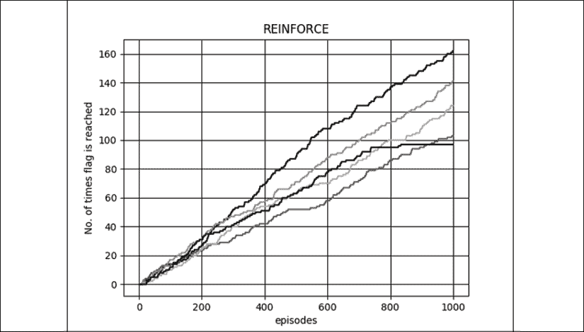

图 10.7.1：山车使用 REINFORCE 方法到达标志的次数

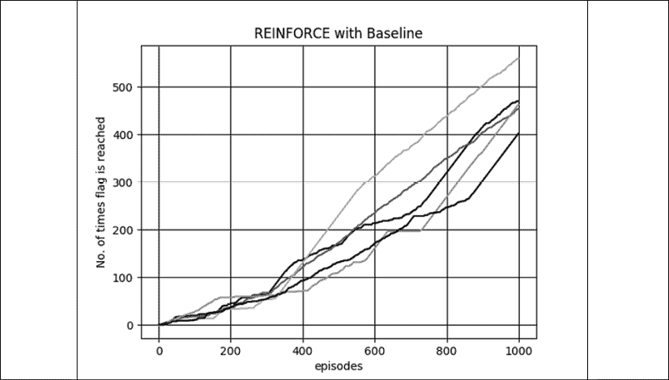

图 10.7.2：使用基线方法使用 REINFORCE，山地车到达标志的次数

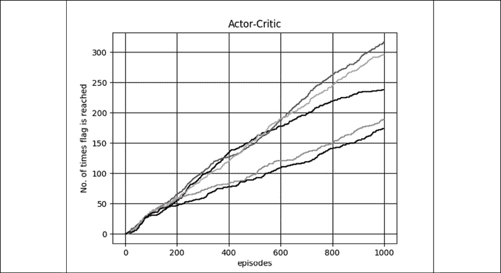

图 10.7.3：使用演员评论家方法山地车到达旗帜的次数

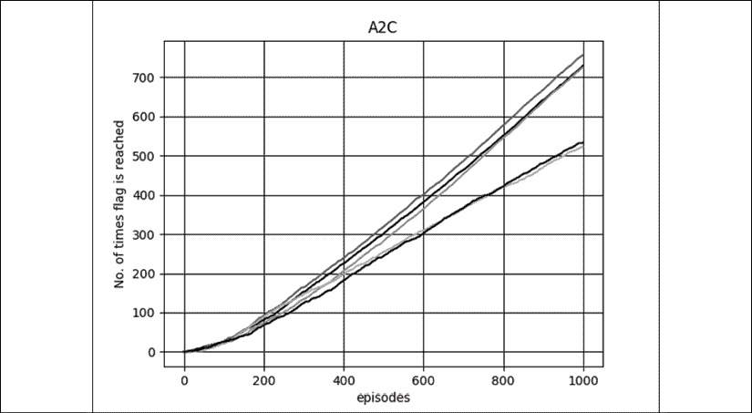

图 10.7.4：山地车使用 A2C 方法到达标志的次数

“图 10.7.5”至“图 10.7.8”显示 1,000 集的总奖励。

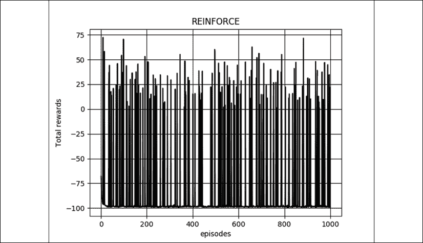

图 10.7.5：使用 REINFORCE 方法获得的每集总奖励

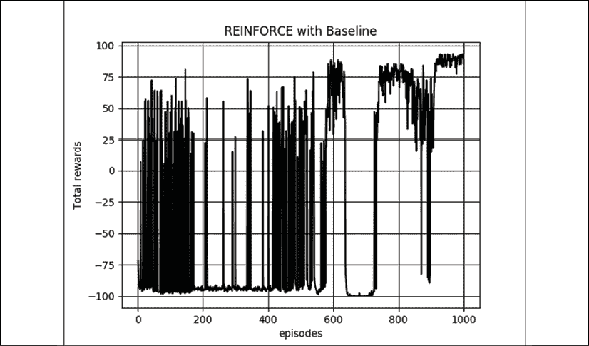

图 10.7.6：使用带有基线方法的 REINFORCE，每集获得的总奖励。

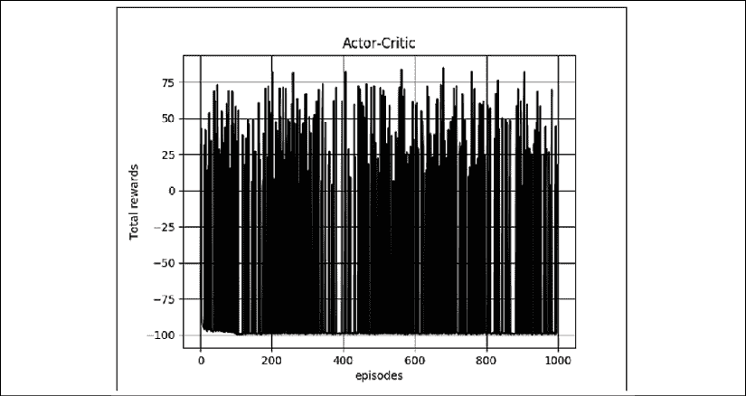

图 10.7.7：使用演员评论家方法获得的每集总奖励


图 10.7.8：使用 A2C 方法获得的每集总奖励

以为基准的 REINFORCE 是唯一能够在 1,000 次训练中始终获得约 90 的总奖励的方法。 A2C 的表现仅次于第二名，但无法始终达到至少 90 分的总奖励。

在进行的实验中，我们使用相同的学习率`1e-3`进行对数概率和值网络优化。 折扣系数设置为 0.99（A2C 除外），以 0.95 的折扣系数更容易训练。

鼓励阅读器通过执行以下操作来运行受过训练的网络：

```py
python3 policygradient-car-10.1.1.py
--encoder_weights=encoder_weights.h5 --actor_weights=actor_weights.h5 
```

“表 10.7.1”显示了其他运行`policygradient-car-10.1.1.py`的模式。 权重文件（即`*.h5`）可以替换为您自己的预训练权重文件。 请查阅代码以查看其他可能的选项。

| **目的** | **运行** |
| --- | --- |
| 从零开始训练 REINFORCE | `python3 policygradient-car-10.1.1.py` |
| 从头开始使用基线训练 REINFORCE | `python3 policygradient-car-10.1.1.py -b` |
| 从零开始训练演员评论家 | `python3 policygradient-car-10.1.1.py -a` |
| 从头开始训练 A2C | `python3 policygradient-car-10.1.1.py -c` |
| 从先前保存的权重中训练 REINFORCE | `python3 policygradient-car-10.1.1.py``--encoder-weights=encoder_weights.h5``--actor-weights=actor_weights.h5 --train` |
| 使用先前保存的权重使用基线训练 REINFORCE | `python3 policygradient-car-10.1.1.py``--encoder-weights=encoder_weights.h5``--actor-weights=actor_weights.h5``--value-weights=value_weights.h5 -b --train` |
| 使用先前保存的权重训练演员评论家 | `python3 policygradient-car-10.1.1.py``--encoder-weights=encoder_weights.h5``--actor-weights=actor_weights.h5``--value-weights=value_weights.h5 -a --train` |
| 使用先前保存的权重训练 A2C | `python3 policygradient-car-10.1.1.py``--encoder-weights=encoder_weights.h5``--actor-weights=actor_weights.h5``--value-weights=value_weights.h5 -c --train` |

表 10.7.1：运行 policygradient-car-10.1.1.py 时的不同选项

最后一点，我们在`tf.keras`中对策略梯度方法的实现存在一些局限性。 例如，训练演员模型需要对动作进行重新采样。 首先对动作进行采样并将其应用于环境，以观察奖励和下一个状态。 然后，采取另一个样本来训练对数概率模型。 第二个样本不一定与第一个样本相同，但是用于训练的奖励来自第一个采样动作，这可能会在梯度计算中引入随机误差。

# 8\. 总结

在本章中，我们介绍了策略梯度方法。 从策略梯度定理开始，我们制定了四种方法来训练策略网络。 详细讨论了四种方法：REINFORCE，带有基线的 REINFORCE，演员评论家和 A2C 算法。 我们探讨了如何在 Keras 中实现这四种方法。 然后，我们通过检查智能体成功达到目标的次数以及每集获得的总奖励来验证算法。

与上一章中讨论的深度 Q 网络[2]相似，基本策略梯度算法可以进行一些改进。 例如，最突出的一个是 A3C [3]，它是 A2C 的多线程版本。 这使智能体可以同时接触不同的经验，并异步优化策略和值网络。 但是，在 [OpenAI](https://blog.openai.com/baselines-acktr-a2c/) 进行的实验中，与 A2C 相比，A3C 没有强大的优势，因为前者无法利用当今提供强大的 GPU 的优势。

在接下来的两章中，我们将着手于另一个领域-对象检测和语义分割。 对象检测使智能体能够识别和定位给定图像中的对象。 语义分割基于对象类别识别给定图像中的像素区域。

# 9\. 参考

1.  `Richard Sutton and Andrew Barto: Reinforcement Learning: An Introduction: http://incompleteideas.net/book/bookdraft2017nov5.pdf (2017)`
1.  `Volodymyr Mnih et al.: Human-level control through deep reinforcement learning, Nature 518.7540 (2015): 529`
1.  `Volodymyr Mnih et al.: Asynchronous Methods for Deep Reinforcement Learning, International conference on machine learning, 2016`
1.  `Ronald Williams: Simple statistical gradient-following algorithms for connectionist reinforcement learning, Machine learning 8.3-4 (1992): 229-256`