# 十一、对象检测

目标检测是计算机视觉最重要的应用之一。 对象检测是同时定位和识别图像中存在的对象的任务。 为了使自动驾驶汽车安全地在街道上行驶，该算法必须检测到行人，道路，车辆，交通信号灯，标志和意外障碍物的存在。 在安全方面，入侵者的存在可以用来触发警报或通知适当的当局。

尽管很重要，但是对象检测一直是计算机视觉中的一个长期存在的问题。 已经提出了许多算法，但是通常很慢，并且精度和召回率很低。 与 AlexNet [1]在 ImageNet 大规模图像分类问题中所取得的成就类似，深度学习显着提高了对象检测领域。 最新的对象检测方法现在可以实时运行，并且具有更高的精度和召回率。

在本章中，我们重点介绍实时对象检测。 特别是，我们讨论了`tf.keras`中**单发检测**（**SSD**）[2]的概念和实现。 与其他深度学习检测算法相比，SSD 可在现代 GPU 上实现实时检测速度，而表现不会显着下降。 SSD 还易于端到端训练。

总之，本章的目的是介绍：

*   对象检测的概念
*   多尺度目标检测的概念
*   SSD 作为多尺度目标检测算法
*   `tf.keras`中 SSD 的实现

我们将从介绍对象检测的概念开始。

# 1\. 对象检测

在对象检测中，目标是在图像中定位和识别物体。“图 11.1.1”显示了目标**汽水罐**的目标物检测。 本地化意味着必须估计对象的边界框。 使用左上角像素坐标和右下角像素坐标是用于描述边界框的通用约定。 在“图 11.1.1”中，左上角像素具有坐标`(x_min, y_min)`，而右下角像素的坐标为`(x_max, y_max)`。像素坐标系的原点`(0, 0)`位于整个图像的左上角像素。

在执行定位时，检测还必须识别对象。 识别是计算机视觉中的经典识别或分类任务。 至少，对象检测必须确定边界框是属于已知对象还是背景。 可以训练对象检测网络以仅检测一个特定对象，例如“图 11.1.1”中的**汽水罐**。 其他所有内容均视为背景，因此无需显示其边界框。 同一对象的多个实例，例如两个或多个**汽水罐**，也可以通过同一网络检测到，如图“图 11.1.2”所示。

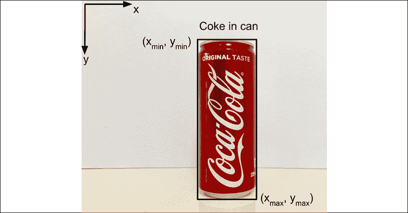

图 11.1.1 说明了对象检测是在图像中定位和识别对象的过程。

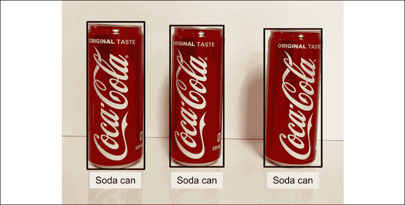

图 11.1.2 被训练为检测一个对象实例的同一网络可以检测到同一对象的多个实例。

如果场景中存在多个对象，例如在“图 11.1.3”中，则对象检测方法只能识别在其上训练的一个对象。 其他两个对象将被分类为背景，并且不会分配边界框。

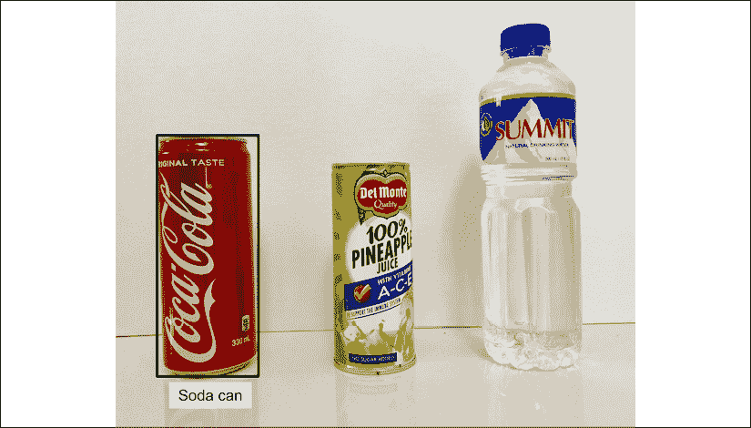

图 11.1.3 如果仅在检测汽水罐方面训练了对象检测，它将忽略图像中的其他两个对象。

但是，如果重新训练了网络以检测三个对象：1）**汽水罐**，2）**果汁罐**和 3）**水瓶**会同时定位和识别，如图“图 11.1.4”所示。

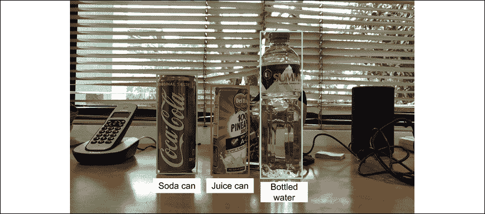

图 11.1.4 即使背景杂乱或照明发生变化，也可以重新训练对象检测网络以检测所有三个对象。

一个好的对象检测器必须在现实环境中具有鲁棒性。“图 11.1.4”显示了一个好的对象检测网络，即使背景杂乱甚至在弱光条件下，也可以定位和识别已知对象。 对象检测器必须具有鲁棒性的其他因素是物体变换（旋转和/或平移），表面反射，纹理变化和噪声。

总之，对象检测的目标是针对图像中每个**可识别的**对象同时预测以下内容：

*   `y_cls`或单热向量形式的类别或类
*   `y_box = ((x_min, y_min), (x_max, y_max))`或像素坐标形式的边界框坐标

通过解释了对象检测的基本概念，我们可以开始讨论对象检测的某些特定机制。 我们将从介绍锚框开始。

# 2\. 锚框

从上一节的讨论中，我们了解到，对象检测必须预测边界框区域以及其中的对象类别。 假设与此同时，我们的重点是边界框坐标估计。

网络如何预测坐标`(x_min, y_min)`和`(x_max, y_max)`？ 网络可以做出与图像的左上角像素坐标和右下角像素坐标相对应的初始猜测，例如`(0, 0)`和`(w, h)`。`w`是图像宽度，而`h`是图像高度。 然后，网络通过对地面真实边界框坐标执行回归来迭代地校正估计。

由于可能的像素值存在较大差异，因此使用原始像素估计边界框坐标不是最佳方法。 SSD 代替原始像素，将地面真值边界框和预测边界框坐标之间的像素误差值最小化。 对于此示例，像素的误差值为`(x_min, y_min)`和`(x_max - w, y_max - h)`。 这些值称为`offsets`。

为了帮助网络找出正确的边界框坐标，将图像划分为多个区域。 每个区域称为**定位框**。 然后，网络估计每个锚框的**偏移**。 这样得出的预测更接近于基本事实。

例如，如图“图 11.2.1”所示，将普通图像尺寸`640 x 480`分为`2 x 1`个区域，从而产生两个锚框。 与`2 x 2`的大小不同，`2 x 1`的划分创建了近似方形的锚框。 在第一个锚点框中，新的偏移量是`(x_min, y_min)`和`{x_max - w/2, y_max - h}`，它们比没有锚框的像素误差值更小。 第二个锚框的偏移量也较小。

在“图 11.2.2”中，图像被进一步分割。 这次，锚框为`3 x 2`。第二个锚框偏移为`{x_min - w/3, y_min}`和`{x_max - 2w/3, y_max - h/2}`，这是迄今为止最小的。 但是，如果将图像进一步分为`5 x 4`，则偏移量开始再次增加。 主要思想是，在创建各种尺寸的区域的过程中，将出现最接近地面真值边界框的最佳锚框大小。 使用多尺度锚框有效地检测不同大小的对象将巩固**多尺度对象检测**算法的概念。

找到一个最佳的锚框并不是零成本。 尤其是，有些外部锚框的偏移量比使用整个图像还要差。 在这种情况下，SSD 建议这些锚定框不应对整个优化过程有所帮助，而应予以抑制。 在以下各节中，将更详细地讨论排除非最佳锚框的算法。

到目前为止，我们已经有三套锚框。

第一个创建一个`2 x 1`的锚框网格，每个锚框的尺寸为`(w/2, h)`。

第二个创建一个`3 x 2`的锚框网格，每个锚框的尺寸为`(w/3, h/2)`。

第三个创建一个`5 x 4`的锚框网格，每个锚框的尺寸为`(w/5, h/4)`。

我们还需要多少套锚盒？ 它取决于图像的尺寸和对象最小边框的尺寸。 对于此示例中使用的`640 x 480`图像，其他锚点框为：

`10 x 8`格的锚框，每个框的尺寸为`(w/10, h/8)`

`20 x 15`格的锚框，每个锚框的尺寸为`(w/20, h/15)`

`40 x 30`格的锚框，每个框的尺寸为`(w/40, h/30)`

对于具有`40 x 30`网格的锚框的`640 x 480`图像，最小的锚框覆盖输入图像的`16 x 16`像素斑块，也称为**接收域**。 到目前为止，包围盒的总数为 1608。对于所有尺寸，最小的**缩放因子**可以总结为：

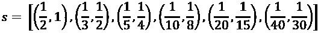 (Equation 11.2.1)

锚框如何进一步改进？ 如果我们允许锚框具有不同的纵横比，则可以减少偏移量。 每个调整大小的锚点框的质心与原始锚点框相同。 除宽高比 1 外，SSD [2]包括其他宽高比：

 (Equation 11.2.2)

对于每个纵横比`a[i]`，对应的锚框尺寸为：

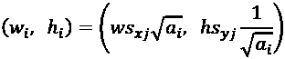 (Equation 11.2.3)

`(s[xj], s[yj])`是“公式 11.2.1”中的第`j`个比例因子。

使用每个锚框五个不同的长宽比，锚框的总数将增加到`1,608 x 5 = 8,040`。“图 11.2.3”显示了`(s[x4], s[y4]) = (1/3, 1/2)`和`a[i ∈ {0, 1, 3}] = 1, 2, 1/2`情况下的锚框。

请注意，为了达到一定的纵横比，我们不会使锚框变形。 而是调整锚框的宽度和高度。

对于`a[0] = 1`，SSD 建议使用其他尺寸的锚框：

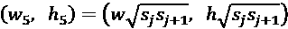 (Equation 11.2.4)

现在每个区域有六个锚定框。 有五个是由于五个纵横比，另外还有一个纵横比为 1。新的锚框总数增加到 9,648。

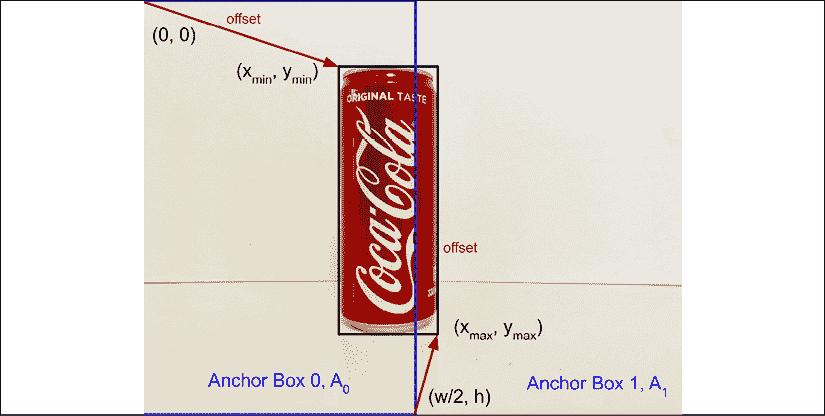

图 11.2.1 将图像划分为多个区域（也称为锚框），使网络可以进行更接近地面真实情况的预测。

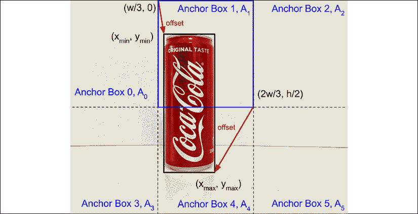

图 11.2.2 使用较小的锚框可以进一步减少偏移。


图 11.2.3 具有比例因子`(s[x4], s[y4]) = (1/3, 1/2)`和纵横比`a[i ∈ {0, 1, 3}] = 1, 2, 1/2`的一个区域的锚框。

下面的“列表 11.2.1”显示了锚框生成函数`anchor_boxes()`。 给定输入的图像形状（`image_shape`），纵横比（`aspect_ratios`）和缩放因子（`sizes`），将计算不同的锚框大小并将其存储在名为`width_height`的列表中。 从给定的特征映射形状（`feature_shape`或`(h_fmap, w_fmap)`和`width_height`， 生成具有尺寸`(h_fmap, w_fmap, n_boxes, 4)`。`n_boxes`或每个特征映射点的锚点框数是基于纵横比和等于 1 的纵横比的一个附加大小计算的。

“列表 11.2.1”：锚框生成函数的`layer_utils.py`函数：

```py
def anchor_boxes(feature_shape,
                 image_shape,
                 index=0,
                 n_layers=4,
                 aspect_ratios=(1, 2, 0.5)):
    """ Compute the anchor boxes for a given feature map.
    Anchor boxes are in minmax format 
```

```py
 Arguments:
        feature_shape (list): Feature map shape
        image_shape (list): Image size shape
        index (int): Indicates which of ssd head layers
            are we referring to
        n_layers (int): Number of ssd head layers 
```

```py
 Returns:
        boxes (tensor): Anchor boxes per feature map
    """ 
```

```py
 # anchor box sizes given an index of layer in ssd head
    sizes = anchor_sizes(n_layers)[index]
    # number of anchor boxes per feature map pt
    n_boxes = len(aspect_ratios) + 1
    # ignore number of channels (last)
    image_height, image_width, _ = image_shape
    # ignore number of feature maps (last)
    feature_height, feature_width, _ = feature_shape 
```

```py
 # normalized width and height
    # sizes[0] is scale size, sizes[1] is sqrt(scale*(scale+1))
    norm_height = image_height * sizes[0]
    norm_width = image_width * sizes[0] 
```

```py
 # list of anchor boxes (width, height)
    width_height = []
    # anchor box by aspect ratio on resized image dims
    # Equation 11.2.3
    for ar in aspect_ratios:
        box_width = norm_width * np.sqrt(ar)
        box_height = norm_height / np.sqrt(ar)
        width_height.append((box_width, box_height))
    # multiply anchor box dim by size[1] for aspect_ratio = 1
    # Equation 11.2.4
    box_width = image_width * sizes[1]
    box_height = image_height * sizes[1]
    width_height.append((box_width, box_height)) 
```

```py
 # now an array of (width, height)
    width_height = np.array(width_height) 
```

```py
 # dimensions of each receptive field in pixels
    grid_width = image_width / feature_width
    grid_height = image_height / feature_height 
```

```py
 # compute center of receptive field per feature pt
    # (cx, cy) format 
    # starting at midpoint of 1st receptive field
    start = grid_width * 0.5
    # ending at midpoint of last receptive field
    end = (feature_width - 0.5) * grid_width
    cx = np.linspace(start, end, feature_width) 
```

```py
 start = grid_height * 0.5
    end = (feature_height - 0.5) * grid_height
    cy = np.linspace(start, end, feature_height) 
```

```py
 # grid of box centers
    cx_grid, cy_grid = np.meshgrid(cx, cy) 
```

```py
 # for np.tile()
    cx_grid = np.expand_dims(cx_grid, -1)
    cy_grid = np.expand_dims(cy_grid, -1) 
```

```py
 # tensor = (feature_map_height, feature_map_width, n_boxes, 4)
    # aligned with image tensor (height, width, channels)
    # last dimension = (cx, cy, w, h)
    boxes = np.zeros((feature_height, feature_width, n_boxes, 4)) 
```

```py
 # (cx, cy)
    boxes[..., 0] = np.tile(cx_grid, (1, 1, n_boxes))
    boxes[..., 1] = np.tile(cy_grid, (1, 1, n_boxes)) 
```

```py
 # (w, h)
    boxes[..., 2] = width_height[:, 0]
    boxes[..., 3] = width_height[:, 1] 
```

```py
 # convert (cx, cy, w, h) to (xmin, xmax, ymin, ymax)
    # prepend one dimension to boxes 
    # to account for the batch size = 1
    boxes = centroid2minmax(boxes)
    boxes = np.expand_dims(boxes, axis=0)
    return boxes 
```

```py
def centroid2minmax(boxes):
    """Centroid to minmax format 
    (cx, cy, w, h) to (xmin, xmax, ymin, ymax) 
```

```py
 Arguments:
        boxes (tensor): Batch of boxes in centroid format 
```

```py
 Returns:
        minmax (tensor): Batch of boxes in minmax format
    """
    minmax= np.copy(boxes).astype(np.float)
    minmax[..., 0] = boxes[..., 0] - (0.5 * boxes[..., 2])
    minmax[..., 1] = boxes[..., 0] + (0.5 * boxes[..., 2])
    minmax[..., 2] = boxes[..., 1] - (0.5 * boxes[..., 3])
    minmax[..., 3] = boxes[..., 1] + (0.5 * boxes[..., 3])
    return minmax 
```

我们已经介绍了锚框如何协助对象检测以及如何生成它们。 在下一节中，我们将介绍一种特殊的锚点框：真实情况锚点框。 给定图像中的对象，必须将其分配给多个锚点框之一。 这就是，称为真实情况锚定框。

# 3\. 真实情况锚框

从“图 11.2.3”看来，给定一个对象边界框，有许多可以分配给对象的真实情况锚定框。 实际上，仅出于“图 11.2.3”中的说明，已经有 3 个锚定框。 如果考虑每个区域的所有锚框，则仅针对`(s[x4], s[y4]) = (1/3, 1/2)`就有`6 x 6 = 36`个地面真实框。 使用所有 9,648 个锚点框显然过多。 所有锚定框中只有一个应与地面真值边界框相关联。 所有其他锚点框都是背景锚点框。 选择哪个对象应被视为图像中对象的真实情况锚定框的标准是什么？

选择锚框的基础称为**交并比**（**IoU**）。 IoU 也称为 *Jaccard 指数*。 在“图 11.3.1”中说明了 IoU。 给定 2 个区域，对象边界框`B[0]`和锚定框`A[1]`，IoU 等于重叠除以合并区域的面积：

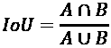 (Equation 11.3.1)

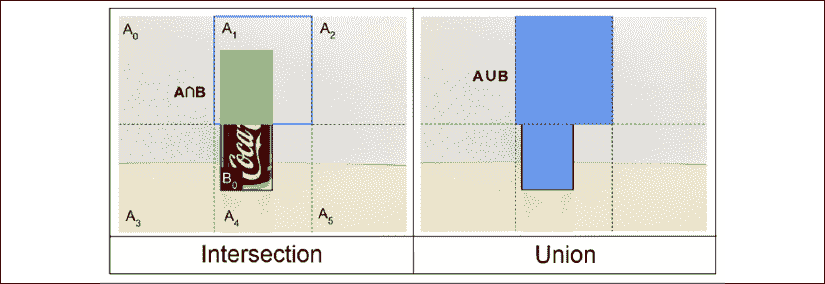

图 11.3.1 IoU 等于（左）候选锚点框`A[1]`与（右）对象边界框`B[0]`之间的相交面积除以并集面积。

我们删除了该等式的下标。 对于给定的对象边界框`B[i]`，对于所有锚点框`A[j]`，地面真值锚点框`A[j(gt)]`是具有最大 IoU 的一个：

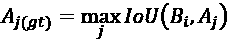 (Equation 11.3.2)

请注意，对于每个对象，只有一个基于“公式 11.3.2”的地面真值锚定框。 此外，必须在所有比例因子和尺寸（长宽比和附加尺寸）中对所有锚框进行最大化。 在“图 11.3.1”中，在 9,648 个锚框中仅显示了一个比例因子大小。

为了说明“公式 11.3.2”，假设考虑了“图 11.3.1”中纵横比为 1 的锚框。 对于每个锚框，估计的 IoU 均显示在“表 11.3.1”中。 由于边界框`B[0]`的最大 IoU 为 0.32，因此带有锚框`A[1]`，`A[1]`被分配为地面真值边界框`B[0]`。`A[1]`也被称为**正锚框**。

正锚定框的类别和偏移量是相对于其地面真值边界框确定的。 正锚定框的类别与其地面真值边界框相同。 同时，可以将正锚框偏移量计算为等于地面真实边界框坐标减去其自身的边界框坐标。

其余锚框发生了什么，`A[0]`，`A[2]`，`A[3]`，`A[4]`，和`A[5]`？ 我们可以通过找到他们的 IoU 大于某个阈值的边界框来给他们第二次机会。

例如，如果阈值为 0.5，则没有可分配给它们的地面真理边界框。 如果阈值降低到 0.25，则`A[4]`也分配有地面真值边界框`B[0]`，因为其 IoU 为 0.30 。 将`A[4]`添加到肯定锚框列表中。 在这本书中，`A[4]`被称为额外的正面锚盒。 没有地面边界框的其余锚框称为**负锚框**。

在以下有关损失函数的部分中，负锚框不构成偏移损失函数。

|  |`B[0]`|
| --- | --- |
|`A[0]`| 0 |
|`A[1]`| 0.32 |
|`A[2]`| 0 |
|`A[3]`| 0 |
|`A[4]`| 0.30 |
|`A[5]`| 0 |

“表 11.3.1”每个锚框`A[j ∈ 0 .. 5]`的 IoU，带有对象边界框`B[0]`，如“图 11.3.1”所示。

如果加载了另一个带有 2 个要检测的对象的图像，我们将寻找 2 个正 IoU，最大 IoU，并带有边界框`B[0]`和`B[1]`。 然后，我们使用边界框`B[0]`和`B[1]`寻找满足最小 IoU 准则的额外正锚框。

为了简化讨论，我们只考虑每个区域一个锚框。 实际上，应该考虑代表不同缩放比例，大小和纵横比的所有锚框。 在下一节中，我们讨论如何制定损失函数，这些损失函数将通过 SSD 网络进行优化。

“列表 11.3.1”显示了`get_gt_data()`的实现，该实现计算锚定框的真实情况标签。

“列表 11.3.1”：`layer_utils.py`

```py
def get_gt_data(iou,
                n_classes=4,
                anchors=None,
                labels=None,
                normalize=False,
                threshold=0.6):
    """Retrieve ground truth class, bbox offset, and mask

    Arguments:
        iou (tensor): IoU of each bounding box wrt each anchor box
        n_classes (int): Number of object classes
        anchors (tensor): Anchor boxes per feature layer
        labels (list): Ground truth labels
        normalize (bool): If normalization should be applied
        threshold (float): If less than 1.0, anchor boxes>threshold
            are also part of positive anchor boxes 
```

```py
 Returns:
        gt_class, gt_offset, gt_mask (tensor): Ground truth classes,
            offsets, and masks
    """
    # each maxiou_per_get is index of anchor w/ max iou
    # for the given ground truth bounding box
    maxiou_per_gt = np.argmax(iou, axis=0) 
```

```py
 # get extra anchor boxes based on IoU
    if threshold < 1.0:
        iou_gt_thresh = np.argwhere(iou>threshold)
        if iou_gt_thresh.size > 0:
            extra_anchors = iou_gt_thresh[:,0]
            extra_classes = iou_gt_thresh[:,1]
            extra_labels = labels[extra_classes]
            indexes = [maxiou_per_gt, extra_anchors]
            maxiou_per_gt = np.concatenate(indexes,
                                           axis=0)
            labels = np.concatenate([labels, extra_labels],
                                    axis=0) 
```

```py
 # mask generation
    gt_mask = np.zeros((iou.shape[0], 4))
    # only indexes maxiou_per_gt are valid bounding boxes
    gt_mask[maxiou_per_gt] = 1.0 
```

```py
 # class generation
    gt_class = np.zeros((iou.shape[0], n_classes))
    # by default all are background (index 0)
    gt_class[:, 0] = 1
    # but those that belong to maxiou_per_gt are not
    gt_class[maxiou_per_gt, 0] = 0
    # we have to find those column indexes (classes)
    maxiou_col = np.reshape(maxiou_per_gt,
                            (maxiou_per_gt.shape[0], 1))
    label_col = np.reshape(labels[:,4],
                           (labels.shape[0], 1)).astype(int)
    row_col = np.append(maxiou_col, label_col, axis=1)
    # the label of object in maxio_per_gt
    gt_class[row_col[:,0], row_col[:,1]]  = 1.0 
```

```py
 # offsets generation
    gt_offset = np.zeros((iou.shape[0], 4)) 
```

```py
 #(cx, cy, w, h) format
    if normalize:
        anchors = minmax2centroid(anchors)
        labels = minmax2centroid(labels)
        # bbox = bounding box
        # ((bbox xcenter - anchor box xcenter)/anchor box width)/.1
        # ((bbox ycenter - anchor box ycenter)/anchor box height)/.1
        # Equation 11.4.8 Chapter 11
        offsets1 = labels[:, 0:2] - anchors[maxiou_per_gt, 0:2]
        offsets1 /= anchors[maxiou_per_gt, 2:4]
        offsets1 /= 0.1 
```

```py
 # log(bbox width / anchor box width) / 0.2
        # log(bbox height / anchor box height) / 0.2
        # Equation 11.4.8 Chapter 11
        offsets2 = np.log(labels[:, 2:4]/anchors[maxiou_per_gt, 2:4])
        offsets2 /= 0.2 
```

```py
 offsets = np.concatenate([offsets1, offsets2], axis=-1) 
```

```py
 # (xmin, xmax, ymin, ymax) format
    else:
        offsets = labels[:, 0:4] - anchors[maxiou_per_gt] 
```

```py
 gt_offset[maxiou_per_gt] = offsets 
```

```py
 return gt_class, gt_offset, gt_mask 
```

```py
def minmax2centroid(boxes):
    """Minmax to centroid format
    (xmin, xmax, ymin, ymax) to (cx, cy, w, h) 
```

```py
 Arguments:
        boxes (tensor): Batch of boxes in minmax format 
```

```py
 Returns:
        centroid (tensor): Batch of boxes in centroid format
    """
    centroid = np.copy(boxes).astype(np.float)
    centroid[..., 0] = 0.5 * (boxes[..., 1] - boxes[..., 0])
    centroid[..., 0] += boxes[..., 0]
    centroid[..., 1] = 0.5 * (boxes[..., 3] - boxes[..., 2])
    centroid[..., 1] += boxes[..., 2]
    centroid[..., 2] = boxes[..., 1] - boxes[..., 0]
    centroid[..., 3] = boxes[..., 3] - boxes[..., 2]
    return centroid 
```

`maxiou_per_gt = np.argmax(iou, axis=0)`实现了“公式 11.3.2”。 额外的阳性锚框是基于由`iou_gt_thresh = np.argwhere(iou>threshold)`实现的用户定义的阈值确定的。

仅当阈值小于 1.0 时，才会查找额外的正锚框。 所有带有地面真值边界框的锚框（即组合的正锚框和额外的正锚框）的索引成为真实情况掩码的基础：

`gt_mask[maxiou_per_gt] = 1.0`。

所有其他锚定框（负锚定框）的掩码为 0.0，并且不影响偏移损失函数的优化。

每个锚定框的类别`gt_class`被分配为其地面实况边界框的类别。 最初，为所有锚框分配背景类：

```py
 # class generation
    gt_class = np.zeros((iou.shape[0], n_classes))
    # by default all are background (index 0)
    gt_class[:, 0] = 1 
```

然后，将每个正面锚点框的类分配给其非背景对象类：

```py
 # but those that belong to maxiou_per_gt are not
    gt_class[maxiou_per_gt, 0] = 0
    # we have to find those column indexes (classes)
    maxiou_col = np.reshape(maxiou_per_gt,
                            (maxiou_per_gt.shape[0], 1))
    label_col = np.reshape(labels[:,4],
                           (labels.shape[0], 1)).astype(int)
    row_col = np.append(maxiou_col, label_col, axis=1)
    # the label of object in maxio_per_gt
    gt_class[row_col[:,0], row_col[:,1]]  = 1.0 
```

`row_col[:,0]`是正锚框的索引，而`row_col[:,1]`是它们的非背景对象类的索引。 请注意，`gt_class`是单热点向量的数组。 这些值都为零，除了锚点框对象的索引处。 索引 0 是背景，索引 1 是第一个非背景对象，依此类推。 最后一个非背景对象的索引等于`n_classes-1`。

例如，如果锚点框 0 是负锚点框，并且有 4 个对象类别（包括背景），则：

```py
gt_class[0] = [1.0, 0.0, 0.0, 0.0] 
```

如果锚定框 1 是正锚定框，并且其地面真值边界框包含带有标签 2 的**汽水罐**，则：

```py
gt_class[1] = [0.0, 0.0, 1.0, 0.0] 
```

最后，偏移量只是地面真实边界框坐标减去锚框坐标：

```py
 # (xmin, xmax, ymin, ymax) format
    else:
        offsets = labels[:, 0:4] - anchors[maxiou_per_gt] 
```

注意，我们仅计算正锚框的偏移量。

如果选择了该选项，则可以将偏移量标准化。 下一部分将讨论偏移量归一化。 我们将看到：

```py
 #(cx, cy, w, h) format
    if normalize: 
```

```py
 anchors = minmax2centroid(anchors)
        labels = minmax2centroid(labels)
        # bbox = bounding box
        # ((bbox xcenter - anchor box xcenter)/anchor box width)/.1
        # ((bbox ycenter - anchor box ycenter)/anchor box height)/.1
        # Equation 11.4.8 
        offsets1 = labels[:, 0:2] - anchors[maxiou_per_gt, 0:2]
        offsets1 /= anchors[maxiou_per_gt, 2:4]
        offsets1 /= 0.1 
```

```py
 # log(bbox width / anchor box width) / 0.2
        # log(bbox height / anchor box height) / 0.2
        # Equation 11.4.8 
        offsets2 = np.log(labels[:, 2:4]/anchors[maxiou_per_gt, 2:4])
        offsets2 /= 0.2 
```

```py
 offsets = np.concatenate([offsets1, offsets2], axis=-1) 
```

只是“公式 11.4.8”的实现，下一节将进行讨论，为方便起见，在此处显示：

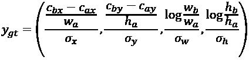 (Equation 11.4.8)

现在我们已经了解了地面真锚框的作用，我们将继续研究对象检测中的另一个关键组件：损失函数。

# 4\. 损失函数

在 SSD 中，有数千个锚定框。 如本章前面所述，对象检测的目的是预测每个锚框的类别和偏移量。 我们可以对每个预测使用以下损失函数：

*   `L_cls` - `y_cls`的分类交叉熵损失
*   `L_off` - L1 或 L2，用于`y_cls`。 请注意，只有正锚框有助于`L_off` L1，也称为**平均绝对误差**（**MAE**）损失，而 L2 也称为**均方误差**（**MSE**）损失。

总的损失函数为：

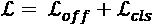 (Equation 11.4.1)

对于每个定位框，网络都会预测以下内容：

*   `y_cls`或单热向量形式的类别或类
*   `y_off = ((x_omin, y_omin), (x_omax, y_omax))`或相对于锚框的像素坐标形式的偏移。

为了方便计算，可以将偏移量更好地表示为以下形式：

`y_off = ((x_omin, y_omin), (x_omax, y_omax))` (Equation 11.4.2)

SSD 是一种监督对象检测算法。 可以使用以下基本真值：

*   `y_label`或要检测的每个对象的类标签
*   `y_gt = (x_gmin, x_gmax, y_gmin, y_gmax)`或地面真实偏差，其计算公式如下：

`y_gt = (x_bmin – x_amin, x_bmax – x_amax, y_bmin – y_amin, y_bmax – y_amax)` (Equation 11.4.3)

换句话说，将地面真实偏移量计算为对象包围盒相对于锚定框的地面真实偏移量。 为了清楚起见，`y_box`下标中的细微调整。 如上一节所述，基本真值是通过`get_gt_data()`函数计算的。

但是，SSD 不建议直接从预测原始像素误差值`y_off`。 而是使用归一化的偏移值。 地面真值边界框和锚点框坐标首先以质心尺寸格式表示：

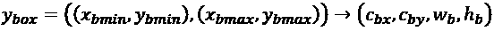

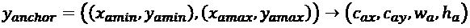 

(Equation 11.4.4)

哪里：

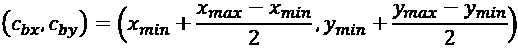 (Equation 11.4.5)

是边界框中心的坐标，并且：

`(w[b], h[b]) = (x_max – x_min, y_max - y_min)` (Equation 11.4.6)

分别对应于宽度和高度。 锚框遵循相同的约定。 归一化的真实情况偏移量表示为：

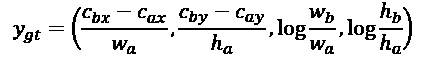 (Equation 11.4.7)

通常，`y_gt`的元素值很小，`||y_gt|| << 1.0`。 较小的梯度会使网络训练更加难以收敛。

为了缓解该问题，将每个元素除以其估计的标准差。 由此产生的基本事实抵消了：

 (Equation 11.4.8)

推荐值为：`σ[x] = σ[y] = 0.1`和`σ[w] = σ[h] = 0.2`。 换句话说，沿着`x`和`y`轴的像素误差的预期范围是`± 10%`，而对于宽度和高度，则是`± 20%。 这些值纯粹是任意的。

“列表 11.4.1”：`loss.py` L1 和平滑 L1 损失函数

```py
from tensorflow.keras.losses import Huber
def mask_offset(y_true, y_pred): 
    """Pre-process ground truth and prediction data"""
    # 1st 4 are offsets
    offset = y_true[..., 0:4]
    # last 4 are mask
    mask = y_true[..., 4:8]
    # pred is actually duplicated for alignment
    # either we get the 1st or last 4 offset pred
    # and apply the mask
    pred = y_pred[..., 0:4]
    offset *= mask 
    pred *= mask 
    return offset, pred

def l1_loss(y_true, y_pred):
    """MAE or L1 loss
    """ 
    offset, pred = mask_offset(y_true, y_pred)
    # we can use L1
    return K.mean(K.abs(pred - offset), axis=-1)

def smooth_l1_loss(y_true, y_pred):
    """Smooth L1 loss using tensorflow Huber loss
    """
    offset, pred = mask_offset(y_true, y_pred)
    # Huber loss as approx of smooth L1
    return Huber()(offset, pred) 
```

此外，代替`y_cls`的 L1 损失，SSD 受 Fast-RCNN [3]启发，使用平滑 L1：

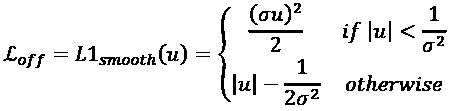 (Equation 11.4.9)

其中`u`代表地面真实情况与预测之间的误差中的每个元素：

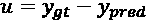 (Equation 11.4.10)

与 L1 相比，平滑 L1 更健壮，并且对异常值的敏感性较低。 在 SSD 中，`σ = 1`。 作为`σ -> ∞`，平滑 L1 接近 L1。 L1 和平滑 L1 损失函数都在“列表 11.4.1”中显示。 `mask_offset()`方法可确保仅在具有地面真实边界框的预测上计算偏移量。 平滑的 L1 函数与`σ = 1`[8]时的 Huber 损失相同。

作为对损失函数的进一步改进，RetinaNet [3]建议将 CE`y_cls`的分类交叉熵函数替换为焦点损失 FL：

 (Equation 11.4.11)

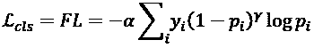 (Equation 11.4.12)

区别在于额外因素`α(1 - p[i])^γ`。 在 RetinaNet 中，当`γ = 2`和`α = 0.25`时，对象检测效果最好。 焦点损失在“列表 11.4.2”中实现。

“列表 11.4.2”：`loss.py`焦点损失

```py
def focal_loss_categorical(y_true, y_pred):
    """Categorical cross-entropy focal loss"""
    gamma = 2.0
    alpha = 0.25 
```

```py
 # scale to ensure sum of prob is 1.0
    y_pred /= K.sum(y_pred, axis=-1, keepdims=True) 
```

```py
 # clip the prediction value to prevent NaN and Inf
    epsilon = K.epsilon()
    y_pred = K.clip(y_pred, epsilon, 1\. - epsilon)
    # calculate cross entropy
    cross_entropy = -y_true * K.log(y_pred) 
```

```py
 # calculate focal loss
    weight = alpha * K.pow(1 - y_pred, gamma)
    cross_entropy *= weight 
```

```py
 return K.sum(cross_entropy, axis=-1) 
```

聚焦损失的动机是，如果我们检查图像，则大多数锚框应分类为背景或负锚框。 只有很少的正锚框是代表目标对象的良好候选对象。 负熵损失是造成交叉熵损失的主要因素。 因此，负锚框的贡献使优化过程中正锚框的贡献无法实现。 这种现象也称为**类不平衡**，其中一个或几个类占主导地位。 有关其他详细信息，Lin 等。 文献[4]讨论了对象检测中的类不平衡问题。

有了**焦点损失**，我们在优化过程的早期就确信负锚框属于背景。 因此，由于`p[i] -> 1.0`，项`(1 - p[i])^γ`减少了负锚框的贡献。 对于正锚框，其贡献仍然很大，因为`p[i]`远非 1.0。

既然我们已经讨论了锚定框，地面真值锚定框和损失函数的概念，我们现在准备介绍实现多尺度目标检测算法的 SSD 模型架构。

# 5\. SSD 模型架构

“图 11.5.1”显示了 SSD 的模型架构，该模型实现了多尺度单发目标检测的概念框架。 网络接受 RGB 图像，并输出几个预测级别。 基本或**骨干**网络提取用于分类和偏移量预测的下游任务的特征。 ResNet50 是骨干网络的一个很好的例子，它类似于“第 2 章”，“深度神经网络”中讨论，实现和评估的内容。 在骨干网络之后，对象检测任务由执行其余的网络，我们将其称为 **SSD 头**。

骨干网络可以是具有冻结权重的预训练网络（例如，以前为 ImageNet 分类而训练），也可以是与对象检测一起训练的网络。 如果使用预先训练的基础网络，则可以利用重用以前从大型数据集中学习的特征提取过滤器的优势。 此外，由于冻结了骨干网参数，因此可以加快学习速度。 仅训练对象检测中的顶层。 在这本书中，骨干网是与对象检测联合训练的，因为我们假设我们不一定需要访问预先训练的骨干网。

骨干网网络通常使用跨步 2 或通过最大池化实现几轮下采样。 对于 ResNet50，这是 4 倍。 基本网络变为`(w/2^4, h/2^4) = (w/16, h/16)`之后，特征映射的结果尺寸。 如果图像的宽度和高度均可以被 16 整除，则尺寸是精确的。

例如，对于`640 x 480`的图像，生成的特征映射的尺寸为`40 x 30 = 1200`。 如前几节所述，这是基础网络之后长宽比等于 1 的锚点框的数量。 此数字乘以每个锚定框的大小数。 在前面的部分中，由于长宽比，有 6 种不同的尺寸，而长宽比为 1 时，还有一个其他尺寸。

在本书中，我们将纵横比限制为`a[i ∈ {0, 1, 3}] = 1, 2, 1/2`。 因此，将只有 4 种不同的大小。 对于`640 x 480`图像，第一组锚框的锚框总数为`n[1] = 4,800`。

在“图 11.5.1”中，指示密集网格以表明对于第一组预测，存在大量预测（例如：`40 x 30 x 4`），从而导致大量补丁 。 尽管每个锚点框有 4 种尺寸，但为清楚起见，仅显示了与宽高比 1 对应的`16 x 16`锚点框。

此锚框也是`40 x 30 x n_filter`特征映射中每个元素的接受字段大小。`n_filter`是骨干网最后卷积层中过滤器的数量。 对于每个锚框，都将预测类别和偏移量。

总共有`n[1]`类和`n[1]`偏移量预测。 单热类预测的维数等于要检测的对象类别的数量，背景为 1。 每个偏移量变量预测的尺寸为 4，对应于`(x, y)`到预测边界框的 2 个角的偏移量。

类预测器由卷积层组成，该卷积层由使用 *softmax* 进行分类交叉熵损失的激活层终止。 偏移量预测值是具有线性激活的独立卷积层。

在基础网络之后可以应用其他特征提取模块。 每个特征提取器块都是`Conv2D(strides=2)-BN-ELU`的形式。 在特征提取块之后，特征映射的大小减半，并且过滤器的数量增加一倍。 例如，基本网络之后的第一个特征提取器块具有`20 x 15 x 2 n_filter`特征映射。 根据该特征映射，使用卷积层进行`n[2]`类和`n[2]`偏移量预测。`n[2] = 20 x 15 x 4 = 1,200`

可以继续添加具有类和偏移量预测变量的特征提取块的过程。 在前面的部分中，对于`640 x 480`的图像，最大可达`2 x 1 x 2^5 n_filter`特征映射产生`n[6]`类和`n[6]`抵消了其中`n[6] = 2 x 1 x 4 = 8`的预测。 到 6 层特征提取和预测块。 在第 6 个块之后，一个`640 x 480`图像的锚点映射预测总数为 9,648。

在前面的部分中，锚定框的比例因子大小按降序排列：

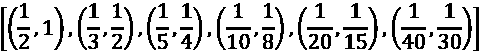 Equation 11.5.1)

这样做是为了使讨论清晰。 在本节中，应该意识到比例因子的大小实际上是从骨干网之后的特征映射大小开始的。 实际上，缩放因子应按升序排列：

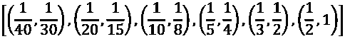 (Equation 11.5.2)

这意味着如果将特征提取块的数量减少到 4，则缩放因子为：

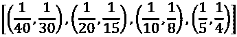 (Equation 11.5.3)

如果特征映射的宽度或高度不能被 2 整除（例如：15），则将应用天花板函数（例如：`ceil(15/2) = 8`）。 但是，在原始的 SSD [2]实现中，所使用的缩放因子被简化为`[0.2, 0.9]`范围，该范围通过缩放因子的数量或特征提取块的数量`n_layers`进行线性缩放：

```py
s = np.linspace(0.2, 0.9, n_layers + 1) 
```

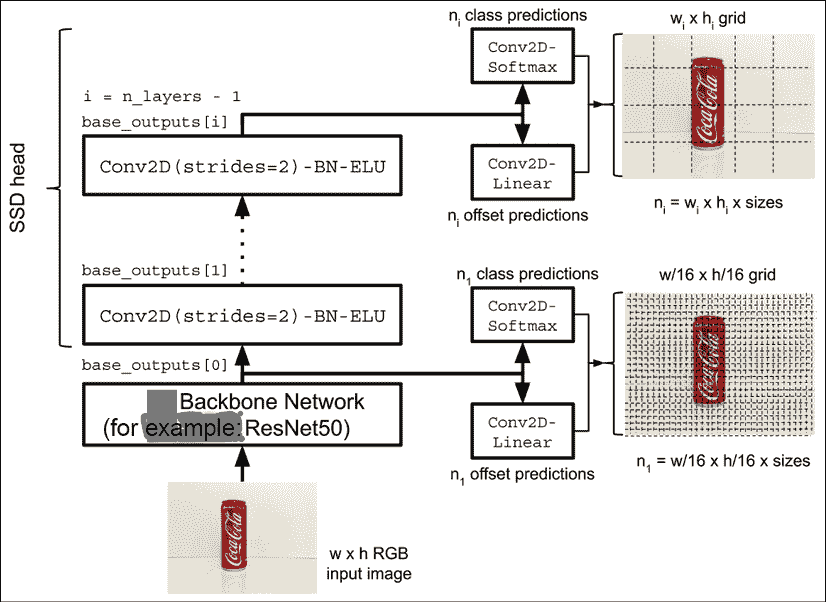

图 11.5.1 SSD 模型架构。请注意，对于`w/16 x h/16`网格，锚框的数量可能不准确。 网格显示了锚框的紧密包装。

讨论了 SSD 模型架构之后，现在让我们看一下如何在 Keras 中实现 SSD 模型架构。

# 6\. Keras 中的 SSD 模型架构

与前面章节中的代码示例不同，SSD 的`tf.keras`实现更加复杂。 与 SSD 的其他`tf.keras`实现相比，本章中提供的代码示例重点介绍多尺度目标检测的关键概念。 可以进一步优化代码实现的某些部分，例如缓存地面真锚框类，偏移量和掩码。 在我们的示例中，每次从文件系统加载图像时，线程都会计算出地面真实值。

“图 11.6.1”显示了包含 SSD 的`tf.keras`实现的代码块的概述。 `ssd-11.6.1.py`中的 SSD 对象可以构建，训练和评估 SSD 模型。 它借助`model.py`和`resnet.py`以及`data_generator.py`中的多线程数据生成器，位于 SSD 模型创建器的顶部。 SSD 模型实现了“图 11.5.1”中所示的 SSD 架构。 每个主要模块的实现将在后续部分中详细讨论。

SSD 模型使用 ResNet 作为其骨干网络。 它在`resnet.py`中调用 ResNet V1 或 V2 模型创建者。 与前几章中的示例不同，SSD 使用的数据集由数千个高分辨率图像组成。 多线程数据生成器将加载文件，并且将这些文件从文件系统排队。 它还计算锚点箱的地面真值标签。 如果没有多线程数据生成器，则在训练期间图像的加载和排队以及地面真值的计算将非常缓慢。

有许多小的但重要的例程在后台运行。 这些都集中存储在工具块中。 这些例程创建锚框，计算 IoU，建立真实情况标签，运行非最大抑制，绘制标签和框，在视频帧上显示检测到的对象，提供损失函数等。

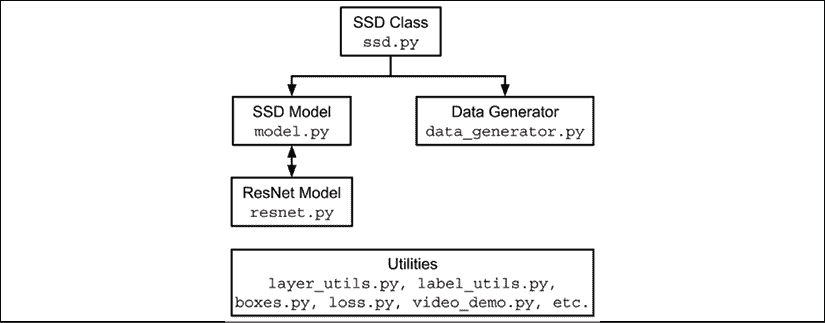

图 11.6.1 实现 SSD 的代码块。

# 7\. Keras 中的 SSD 对象

“列表 11.7.1”（很快显示）显示了 SSD 类。 说明了两个主要例程：

1.  使用`build_model()`创建 SSD 模型

1.  通过`build_generator()`实例化数据生成器

`build_model`首先根据训练标签创建数据字典。 字典存储图像文件名以及每个图像中每个对象的地面真实边界框坐标和类。 之后，构建骨干网和 SSD 网络模型。 模型创建的最重要产品是`self.ssd` – SSD 的网络模型。

标签存储在 csv 文件中。 对于本书中使用的示例训练图像，标签以以下格式保存在`dataset/drinks/labels_train.csv`中：

```py
frame,xmin,xmax,ymin,ymax,class_id
0001000.jpg,310,445,104,443,1
0000999.jpg,194,354,96,478,1
0000998.jpg,105,383,134,244,1
0000997.jpg,157,493,89,194,1
0000996.jpg,51,435,207,347,1
0000995.jpg,183,536,156,283,1
0000994.jpg,156,392,178,266,2
0000993.jpg,207,449,119,213,2
0000992.jpg,47,348,213,346,2
… 
```

“列表 11.7.1”：`ssd-11.6.1.py`

```py
class SSD:
    """Made of an ssd network model and a dataset generator.
    SSD defines functions to train and validate 
    an ssd network model. 
```

```py
 Arguments:
        args: User-defined configurations 
```

```py
 Attributes:
        ssd (model): SSD network model
        train_generator: Multi-threaded data generator for training
    """
    def __init__(self, args):
        """Copy user-defined configs.
        Build backbone and ssd network models.
        """
        self.args = args
        self.ssd = None
        self.train_generator = None
        self.build_model() 
```

```py
 def build_model(self):
        """Build backbone and SSD models."""
        # store in a dictionary the list of image files and labels
        self.build_dictionary()
        # input shape is (480, 640, 3) by default
        self.input_shape = (self.args.height,
                            self.args.width,
                            self.args.channels) 
```

```py
 # build the backbone network (eg ResNet50)
        # the number of feature layers is equal to n_layers
        # feature layers are inputs to SSD network heads
        # for class and offsets predictions
        self.backbone = self.args.backbone(self.input_shape,
                                           n_layers=self.args.layers) 
```

```py
 # using the backbone, build ssd network
        # outputs of ssd are class and offsets predictions
        anchors, features, ssd = build_ssd(self.input_shape,
                                           self.backbone,
                                           n_layers=self.args.layers,
                                           n_classes=self.n_classes)
        # n_anchors = num of anchors per feature point (eg 4)
        self.n_anchors = anchors
        # feature_shapes is a list of feature map shapes
        # per output layer - used for computing anchor boxes sizes
        self.feature_shapes = features
        # ssd network model
        self.ssd = ssd 
```

```py
 def build_dictionary(self):
        """Read input image filenames and obj detection labels
        from a csv file and store in a dictionary.
        """
        # train dataset path
        path = os.path.join(self.args.data_path,
                            self.args.train_labels) 
```

```py
 # build dictionary: 
        # key=image filaname, value=box coords + class label
        # self.classes is a list of class labels
        self.dictionary, self.classes = build_label_dictionary(path)
        self.n_classes = len(self.classes)
        self.keys = np.array(list(self.dictionary.keys())) 
```

```py
 def build_generator(self):
        """Build a multi-thread train data generator.""" 
```

```py
 self.train_generator = \
                DataGenerator(args=self.args,
                              dictionary=self.dictionary,
                              n_classes=self.n_classes,
                              feature_shapes=self.feature_shapes,
                              n_anchors=self.n_anchors,
                              shuffle=True) 
```

“列表 11.7.2”显示了 SSD 对象中的另一种重要方法`train()`。 指示了使用默认损失函数或改进的损失函数的选项，如先前部分所述。 还有一个选项可以选择仅平滑 L1。

`self.ssd.fit_generator()`是此函数中最重要的调用。 它借助多线程数据生成器启动有监督的训练。 在每个周期，都会执行两个回调函数。 首先，将模型权重保存到文件中。 然后，对于 ResNet 模型，以与“第 2 章”，“深度神经网络”相同的方式使用的改进的学习率调度器称为：

“列表 11.7.2”：`ssd-11.6.1.py`

```py
 def train(self):
        """Train an ssd network."""
        # build the train data generator
        if self.train_generator is None:
            self.build_generator() 
```

```py
 optimizer = Adam(lr=1e-3)
        # choice of loss functions via args
        if self.args.improved_loss:
            print_log("Focal loss and smooth L1", self.args.verbose)
            loss = [focal_loss_categorical, smooth_l1_loss]
        elif self.args.smooth_l1:
            print_log("Smooth L1", self.args.verbose)
            loss = ['categorical_crossentropy', smooth_l1_loss]
        else:
            print_log("Cross-entropy and L1", self.args.verbose)
            loss = ['categorical_crossentropy', l1_loss] 
```

```py
 self.ssd.compile(optimizer=optimizer, loss=loss) 
```

```py
 # prepare callbacks for saving model weights
        # and learning rate scheduler
        # learning rate decreases by 50% every 20 epochs
        # after 60th epoch
        checkpoint = ModelCheckpoint(filepath=filepath,
                                     verbose=1,
                                     save_weights_only=True)
        scheduler = LearningRateScheduler(lr_scheduler) 
```

```py
 callbacks = [checkpoint, scheduler]
        # train the ssd network
        self.ssd.fit_generator(generator=self.train_generator,
                               use_multiprocessing=True,
                               callbacks=callbacks,
                               epochs=self.args.epochs,
                               workers=self.args.workers) 
```

在下一部分中，我们将讨论 Keras 中 SSD 架构实现的其他详细信息。 特别是 SSD 模型和多线程数据生成器的实现。

# 8\. Keras 中的 SSD 模型

“列表 11.8.1”显示了 SSD 模型创建函数`build_ssd()`。 该模型在“图 11.5.1”中进行了说明。 该函数通过调用`base_outputs = backbone(inputs)`从骨干网或基础网络检索输出特征的`n_layers`。

在本书中，`backbone()`是`build_resnet()`。 `build_resnet()`可以生成的 ResNet 模型类似于“第 2 章”，“深度神经网络”中讨论的残差网络。 `build_resnet()`函数可以由构建基础网络的任何函数名称代替。

如图“图 11.5.1”所示，返回值`base_outputs`是输出特征的列表，这些特征将作为类别和偏移预测层的输入。 例如，第一输出`base_outputs[0]`用于生成`n[1]`类预测和`n[1]`偏移量预测。

在`build_ssd()`的`for`循环中，类别预测是`classes`变量，而偏移量预测是`offsets`变量。 在`for`循环迭代之后，将类别预测连接，并最终合并为一个具有以下尺寸的`classes`变量：


对`offsets`变量执行相同的过程。 结果尺寸为：

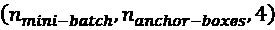

其中`n_mini_batch`是迷你批量大小，`n_anchor_box`是锚定框的数量。 `for`循环迭代的次数等于`n_layers`。 该数目也等于锚定框缩放因子的所需数目或 SSD 头的特征提取块的数目。

函数`build_ssd()`返回每个特征点或区域的锚框数量，每个前类的特征形状，偏移量预测层以及 SSD 模型本身。

“列表 11.8.1”：`model.py`

```py
def build_ssd(input_shape,
              backbone,
              n_layers=4,
              n_classes=4,
              aspect_ratios=(1, 2, 0.5)):
    """Build SSD model given a backbone

    Arguments:
        input_shape (list): input image shape
        backbone (model): Keras backbone model
        n_layers (int): Number of layers of ssd head
        n_classes (int): Number of obj classes
        aspect_ratios (list): annchor box aspect ratios

    Returns:
        n_anchors (int): Number of anchor boxes per feature pt
        feature_shape (tensor): SSD head feature maps
        model (Keras model): SSD model
    """ 
    # number of anchor boxes per feature map pt
    n_anchors = len(aspect_ratios) + 1 
```

```py
 inputs = Input(shape=input_shape)
    # no. of base_outputs depends on n_layers
    base_outputs = backbone(inputs)

    outputs = []
    feature_shapes = []              
    out_cls = []                     
    out_off = [] 
```

```py
 for i in range(n_layers):
        # each conv layer from backbone is used
        # as feature maps for class and offset predictions
        # also known as multi-scale predictions
        conv = base_outputs if n_layers==1 else base_outputs[i]
        name = "cls" + str(i+1)
        classes  = conv2d(conv,
                          n_anchors*n_classes,
                          kernel_size=3,
                          name=name) 
```

```py
 # offsets: (batch, height, width, n_anchors * 4)
        name = "off" + str(i+1)
        offsets  = conv2d(conv,
                          n_anchors*4,
                          kernel_size=3,
                          name=name) 
```

```py
 shape = np.array(K.int_shape(offsets))[1:]
        feature_shapes.append(shape)
        # reshape the class predictions, yielding 3D tensors of 
        # shape (batch, height * width * n_anchors, n_classes)
        # last axis to perform softmax on them
        name = "cls_res" + str(i+1)
        classes = Reshape((-1, n_classes),
                          name=name)(classes) 
```

```py
 # reshape the offset predictions, yielding 3D tensors of
        # shape (batch, height * width * n_anchors, 4)
        # last axis to compute the (smooth) L1 or L2 loss
        name = "off_res" + str(i+1)
        offsets = Reshape((-1, 4),
                          name=name)(offsets)
        # concat for alignment with ground truth size
        # made of ground truth offsets and mask of same dim
        # needed during loss computation
        offsets = [offsets, offsets]
        name = "off_cat" + str(i+1)
        offsets = Concatenate(axis=-1,
                              name=name)(offsets) 
```

```py
 # collect offset prediction per scale
        out_off.append(offsets) 
```

```py
 name = "cls_out" + str(i+1) 
```

```py
 #activation = 'sigmoid' if n_classes==1 else 'softmax'
        #print("Activation:", activation) 
```

```py
 classes = Activation('softmax',
                             name=name)(classes) 
```

```py
 # collect class prediction per scale
        out_cls.append(classes) 
```

```py
 if n_layers > 1:
        # concat all class and offset from each scale
        name = "offsets"
        offsets = Concatenate(axis=1,
                              name=name)(out_off)
        name = "classes"
        classes = Concatenate(axis=1,
                              name=name)(out_cls)
    else:
        offsets = out_off[0]
        classes = out_cls[0] 
```

```py
 outputs = [classes, offsets]
    model = Model(inputs=inputs,
                  outputs=outputs,
                  name='ssd_head') 
```

```py
 return n_anchors, feature_shapes, model 
```

如前面所述，与 MNIST 和 CIFAR-10 等小型数据集不同，SSD 中使用的映像很大。 因此，不可能将图像加载到张量变量中。 在下一节中，我们将介绍一个多线程数据生成器，该生成器将使我们能够从文件系统并发加载图像，并避免内存瓶颈。

# 9\. Keras 中的数据生成器模型

SSD 需要大量带标签的高分辨率图像来进行对象检测。 与之前的章节中使用的数据集可以加载到到内存中以训练模型不同，SSD 实现了多线程数据生成器。 多线程生成器的任务是加载图像的多个迷你批量及其相应的标签。 由于具有多线程，GPU 可以保持繁忙，因为一个线程向其提供数据，而其余的 CPU 线程处于队列中，准备从文件系统中馈入另一批数据或加载一批图像并计算基本真值 。“列表 11.9.1”显示了 Keras 中的数据生成器模型。

`DataGenerator`类继承自 Keras 的`Sequence`类，以确保它支持多处理。 `DataGenerator`保证在一个周期内使用整个数据集。

给定批量大小的整个周期的长度由`__len__()`方法返回。 对小批量数据的每个请求都可以通过`__getitem__()`方法来满足。 在每个周期之后，如果`self.shuffle`为`True`，则调用`on_epoch_end()`方法以随机播放整个批量。

“列表 11.9.1”：`data_generator.py`

```py
class DataGenerator(Sequence):
    """Multi-threaded data generator.
    Each thread reads a batch of images and their object labels 
```

```py
 Arguments:
        args: User-defined configuration
        dictionary: Dictionary of image filenames and object labels
        n_classes (int): Number of object classes
        feature_shapes (tensor): Shapes of ssd head feature maps
        n_anchors (int): Number of anchor boxes per feature map pt
        shuffle (Bool): If dataset should be shuffled bef sampling
    """
    def __init__(self,
                 args,
                 dictionary,
                 n_classes,
                 feature_shapes=[],
                 n_anchors=4,
                 shuffle=True):
        self.args = args
        self.dictionary = dictionary
        self.n_classes = n_classes
        self.keys = np.array(list(self.dictionary.keys()))
        self.input_shape = (args.height,
                            args.width,
                            args.channels)
        self.feature_shapes = feature_shapes
        self.n_anchors = n_anchors
        self.shuffle = shuffle
        self.on_epoch_end()
        self.get_n_boxes() 
```

```py
 def __len__(self):
        """Number of batches per epoch"""
        blen = np.floor(len(self.dictionary) / self.args.batch_size)
        return int(blen) 
```

```py
 def __getitem__(self, index):
        """Get a batch of data"""
        start_index = index * self.args.batch_size
        end_index = (index+1) * self.args.batch_size
        keys = self.keys[start_index: end_index]
        x, y = self.__data_generation(keys)
        return x, y 
```

```py
 def on_epoch_end(self):
        """Shuffle after each epoch"""
        if self.shuffle == True:
            np.random.shuffle(self.keys) 
```

```py
 def get_n_boxes(self):
        """Total number of bounding boxes"""
        self.n_boxes = 0
        for shape in self.feature_shapes:
            self.n_boxes += np.prod(shape) // self.n_anchors
        return self.n_boxes 
```

数据生成器的大部分工作都是通过`__data_generation()`方法完成的，如“列表 11.9.2”所示。 给定一个小批量，该方法执行：

*   `imread()`从文件系统读取图像。
*   `labels = self.dictionary[key]`访问词典中存储的边界框和类标签。 前四个项目是边界框偏移量。 最后一个是类标签。
*   `anchor_boxes()`生成锚框。
*   `iou()`计算相对于地面真值边界框的每个锚点框的 IoU。
*   `get_gt_data()`为每个锚框分配地面真实等级和偏移量。

样本数据扩充函数也包括在内，但此处不再讨论，例如添加随机噪声，强度重新缩放和曝光调整。 `__data_generation()`返回输入`x`和输出`y`对，其中张量`x`存储输入图像，而张量`y`捆绑类，偏移量 ，和面具一起。

“列表 11.9.2”：`data_generator.py`

```py
import layer_utils 
```

```py
from skimage.io import imread
    def __data_generation(self, keys):
        """Generate train data: images and 
        object detection ground truth labels 
```

```py
 Arguments:
            keys (array): Randomly sampled keys
                (key is image filename) 
```

```py
 Returns:
            x (tensor): Batch images
            y (tensor): Batch classes, offsets, and masks
        """
        # train input data
        x = np.zeros((self.args.batch_size, *self.input_shape))
        dim = (self.args.batch_size, self.n_boxes, self.n_classes)
        # class ground truth
        gt_class = np.zeros(dim)
        dim = (self.args.batch_size, self.n_boxes, 4)
        # offsets ground truth
        gt_offset = np.zeros(dim)
        # masks of valid bounding boxes
        gt_mask = np.zeros(dim) 
```

```py
 for i, key in enumerate(keys):
            # images are assumed to be stored in self.args.data_path
            # key is the image filename 
            image_path = os.path.join(self.args.data_path, key)
            image = skimage.img_as_float(imread(image_path))
            # assign image to a batch index
            x[i] = image
            # a label entry is made of 4-dim bounding box coords
            # and 1-dim class label
            labels = self.dictionary[key]
            labels = np.array(labels)
            # 4 bounding box coords are 1st four items of labels
            # last item is object class label
            boxes = labels[:,0:-1]
            for index, feature_shape in enumerate(self.feature_shapes):
                # generate anchor boxes
                anchors = anchor_boxes(feature_shape,
                                       image.shape,
                                       index=index,
                                       n_layers=self.args.layers)
                # each feature layer has a row of anchor boxes 
                anchors = np.reshape(anchors, [-1, 4])
                # compute IoU of each anchor box 
                # with respect to each bounding boxes
                iou = layer_utils.iou(anchors, boxes) 
```

```py
 # generate ground truth class, offsets & mask
                gt = get_gt_data(iou,
                                 n_classes=self.n_classes,
                                 anchors=anchors,
                                 labels=labels,
                                 normalize=self.args.normalize,
                                 threshold=self.args.threshold)
                gt_cls, gt_off, gt_msk = gt
                if index == 0:
                    cls = np.array(gt_cls)
                    off = np.array(gt_off)
                    msk = np.array(gt_msk)
                else:
                    cls = np.append(cls, gt_cls, axis=0)
                    off = np.append(off, gt_off, axis=0)
                    msk = np.append(msk, gt_msk, axis=0) 
```

```py
 gt_class[i] = cls
            gt_offset[i] = off
            gt_mask[i] = msk 
```

```py
 y = [gt_class, np.concatenate((gt_offset, gt_mask), axis=-1)] 
```

```py
 return x, y 
```

现在我们有一个多线程生成器，我们可以用它来从文件系统加载图像。 在下一节中，我们将演示如何通过拍摄目标对象的图像并对其进行标记来构建自定义数据集。

# 10\. 示例数据集

使用便宜的 USB 相机（A4TECH PK-635G）收集了一个由 1,000 `640 X 480` RGB 训练图像和 50 `640 X 480` RGB 测试图像组成的小型数据集。 使用 **VGG 图像标注器**（**VIA**）[5]标记数据集图像，以检测三个对象：1）**汽水罐**，2）**果汁罐**和 3）**水瓶**。“图 11.10.1”显示了标记过程的示例 UI。

可以在`GitHub`存储库的`utils/video_capture.py`中找到用于收集图像的工具脚本。 该脚本每 5 秒自动捕获一次图像，因此可以加快数据收集过程。

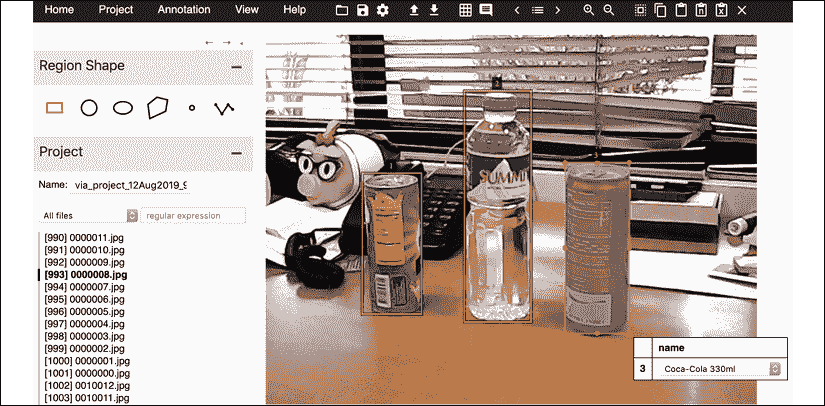

图 11.10.1 使用 VGG 图像标注器（VIA）进行数据集标记的过程

数据收集和标记是一项耗时的活动。 在行业中，通常将其外包给第三方标注公司。 使用自动数据标记软件是加快数据标记任务的另一种选择。

有了这个示例数据集，我们现在可以训练我们的对象检测网络。

# 11\. SSD 模型训练

[可以从以下链接下载包含 csv 格式标签的 train 和测试数据集](https://bit.ly/adl2-ssd)。

在顶层文件夹（即“第 11 章”，“对象检测”）中，创建数据集文件夹，将下载的文件复制到此处，然后运行以下命令将其解压缩：

```py
mkdir dataset
cp drinks.tar.gz dataset
cd dataset
tar zxvf drinks.tar.gz
cd.. 
```

通过执行以下步骤，将 SSD 模型训练 200 个周期：

```py
python3 ssd-11.6.1.py --train 
```

可以根据 GPU 内存调整默认的批量大小`--batch-size=4`。 在 1080Ti 上，批量大小为 2。在 32GB V100 上，每个 GPU 可以为 4 或 8。 `--train`代表模型训练选项。

为了支持边界框偏移量的归一化，包含`--normalize`选项。 为了使用改进的损失函数，添加了`--improved_loss`选项。 如果仅需要平滑的 L1（无焦点损失），请使用`–smooth-l1`。 为了显示：

*   L1，无规范化：
    *   `python3 ssd-11.1.1.py –-train`
*   改进的损失函数，无规范化：
    *   `python3 ssd-11.1.1.py –-train --improved-loss`
*   改进的损失函数，具有规范化：
    *   `python3 ssd-11.1.1.py –-train –improved-loss --normalize`
*   平滑 L1，具有规范化：
    *   `python3 ssd-11.1.1.py –-train –-smooth-l1 --normalize`

训练完 SSD 网络之后，我们需要解决另一个问题。 我们如何处理给定对象的多个预测？ 在测试训练好的模型之前，我们将首先讨论**非最大抑制**（**NMS**）算法。

# 12\. 非最大抑制（NMS）算法

模型训练完成后，网络将预测边界框偏移量和相应的类别。 在某些情况下，两个或更多边界框引用同一对象，从而创建冗余预测。 图 11.12.1 中的**汽水罐**表示了这种情况。 为了删除多余的预测，将调用 NMS 算法。 本书涵盖了经典 NMS 和软 NMS [6]，如“算法 11.12.1”中所示。 两种算法都假定边界框和相应的置信度得分或概率是已知的。

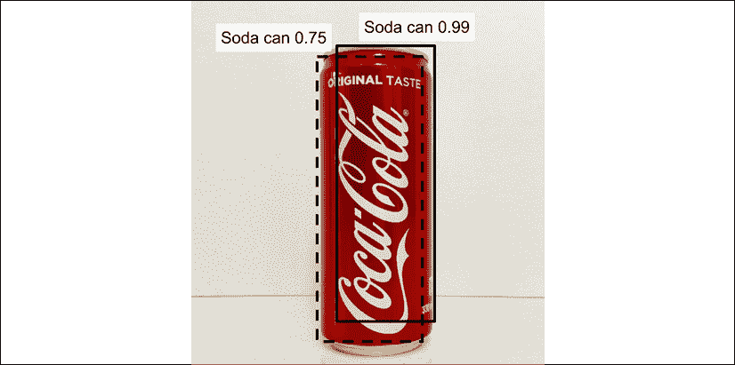

图 11.12.1 网络预测了汽水罐对象的两个重叠边界框。 只选择一个有效的边界框，即得分为 0.99 的边界框。

在经典 NMS 中，基于概率选择最终边界框，并将其存储在列表`D`中，并带有相应的分数`S`。 所有边界框和相应的概率都存储在初始列表`B`和`P`中。 在第 3 行和第 4 行中，将具有最高分数`p[m]`的边界框用作参考，`b[m]`。

参考边界框被添加到最终选择的边界框`D`的列表中，并从列表`B`中删除，如第 5 行所示。 并且列表`S`从`P`中删除。 对于其余边界框，如果 *IoU* 与`b[m]`大于或等于设置的阈值`N[t]`，将其从`B`中删除。 其相应的分数也从`P`中删除。

步骤在第 6 和 9-11 行中显示。 这些步骤将删除所有分数较小的冗余边界框。 在检查完所有其余的边界框之后，重复从第 3 行开始的过程。 该过程继续进行，直到边界框`B`的列表为空。 该算法返回选定的边界框`D`和相应的分数`S`。

经典 NMS 的问题是边界盒包含另一个对象，但其中的 *IoU* 和`b[m]`会从列表中删除。 Soft NMS [6]提出，与其从列表中彻底删除，不如以`b[m]`，如第 8 行所示。

重叠的边界框具有第二次机会。 IoU 较小的边界框在将来的迭代中具有更高的生存机会。 在将来的选择中，它实际上可能证明它包含一个与`b[m]`不同的对象。 如“算法 11.12.1”中所示，Soft NMS 是传统 NMS 的便捷替代。 无需重新训练 SSD 网络。 与经典 NMS 相比，Soft NMS 具有更高的平均精度。

“列表 11.12.1”说明了经典 NMS 和软 NMS。 除了最终的边界框和相应的分数外，还返回相应的对象。 当其余边界框的最大分数小于某个阈值（例如：0.2）时，该代码将实现 NMS 的提前终止。

“算法 11.12.1”**NMS 和软 NMS**

**要求**：边界框预测：`B = {b[1], b[2], …, b[n]}`

**要求**：边界框类别的置信度或分数：`B = {b[1], b[2], …, b[n]}`

**要求**：最小 NMS *IoU* 阈值：`N[t]`

1.  `D <- {}`；`S <- {}`
2.  当`B ≠ empty`，执行
3.  `m <- argmax P`
4.  `M <- b[m]`； `N <- p[m]`，
5.  `D <- D ∪ M`；`B <- B - M`；`S <- S ∪ N`；`P <- P - N`；
6.  对于步骤`b[i] ∈ B`，执行
7.  如果`soft_NMS = True`
8.  `p[i] = p[i] exp(-IOU(M, b[i])^2 / σ)`
9.  否则如果`IOU(M, b[i]) >= N[t]`，那么
10.  `B = B - b[i]`；`P = P - p[i]`
11.  结束
12.  结束
13.  结束

1.  返回`D, S`

“列表 11.12.1”：`boxes.py`

```py
def nms(args, classes, offsets, anchors):
    """Perform NMS (Algorithm 11.12.1). 
```

```py
 Arguments:
        args: User-defined configurations
        classes (tensor): Predicted classes
        offsets (tensor): Predicted offsets

    Returns:
        objects (tensor): class predictions per anchor
        indexes (tensor): indexes of detected objects
            filtered by NMS
        scores (tensor): array of detected objects scores
            filtered by NMS
    """ 
```

```py
 # get all non-zero (non-background) objects
    objects = np.argmax(classes, axis=1)
    # non-zero indexes are not background
    nonbg = np.nonzero(objects)[0] 
```

```py
 # D and S indexes in Line 1
    indexes = []
    while True:
        # list of zero probability values
        scores = np.zeros((classes.shape[0],))
        # set probability values of non-background
        scores[nonbg] = np.amax(classes[nonbg], axis=1) 
```

```py
 # max probability given the list
        # Lines 3 and 4
        score_idx = np.argmax(scores, axis=0)
        score_max = scores[score_idx] 
```

```py
 # get all non max probability & set it as new nonbg
        # Line 5
        nonbg = nonbg[nonbg != score_idx] 
```

```py
 # if max obj probability is less than threshold (def 0.8)
        if score_max < args.class_threshold:
            # we are done
            break

        # Line 5
        indexes.append(score_idx)
        score_anc = anchors[score_idx]
        score_off = offsets[score_idx][0:4]
        score_box = score_anc + score_off
        score_box = np.expand_dims(score_box, axis=0)
        nonbg_copy = np.copy(nonbg) 
```

```py
 # get all overlapping predictions (Line 6)
        # perform Non-Max Suppression (NMS)
        for idx in nonbg_copy:
            anchor = anchors[idx]
            offset = offsets[idx][0:4]
            box = anchor + offset
            box = np.expand_dims(box, axis=0)
            iou = layer_utils.iou(box, score_box)[0][0]
            # if soft NMS is chosen (Line 7)
            if args.soft_nms:
                # adjust score: Line 8
                iou = -2 * iou * iou
                classes[idx] *= math.exp(iou)
            # else NMS (Line 9), (iou threshold def 0.2)
            elif iou >= args.iou_threshold:
                # remove overlapping predictions with iou>threshold
                # Line 10
                nonbg = nonbg[nonbg != idx] 
```

```py
 # Line 2, nothing else to process
        if nonbg.size == 0:
            break 
```

```py
 # get the array of object scores
    scores = np.zeros((classes.shape[0],))
    scores[indexes] = np.amax(classes[indexes], axis=1) 
```

```py
 return objects, indexes, scores 
```

假设我们具有训练有素的 SSD 网络和一种抑制冗余预测的方法，则下一节将讨论对测试数据集的验证。 基本上，我们想知道我们的 SSD 是否可以对从未见过的图像执行对象检测。

# 13\. SSD 模型验证

在对 SSD 模型进行 200 个周期的训练之后，可以验证表现。 用于评估的三个可能指标：1）**IoU**，2）**精度**和 3）**召回**。

第一个指标是**平均 IoU**（**mIoU**）。 给定真实情况测试数据集，计算真实情况边界框和预测边界框之间的 IoU。 在执行 NMS 之后，对所有真实情况和预测的边界框执行此操作。 所有 IoU 的平均值计算为 mIoU：

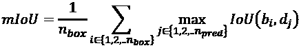 (Equation 11.13.1)

其中`n_box`是地面真值边界框`b[i]`的数量和`n_pred`是预测边界框`d[j]`的数量。 请注意，该度量标准无法验证两个重叠的边界框是否属于同一类。 如果需要，则可以轻松修改代码。“列表 11.13.1”显示了代码实现。

第二个度量是**精度**，如“公式 11.3.2”所示。 它是正确预测的对象类别的数量（真阳性或 TP）除以正确预测的对象类别的数量（真阳性或 TP）与错误预测的对象类别的数量（假阳性或 FP）之和。 精度是衡量 SSD 正确识别图像中对象的表现的指标。 精度越接近 1.0 越好。

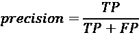 (Equation 11.3.2)

第三个度量是**召回**，如“公式 11.3.3”所示。 它是正确预测的对象类别的数量（真阳性或 TP）除以正确预测的对象类别的数量（真阳性或 TP）加上错过的对象数量（假阴性或 FN）之和。 召回率是衡量 SSD 在不对图像中的对象进行错误分类方面有多出色的度量。 召回率越接近 1.0，则越好。

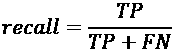 (Equation 11.3.3)

如果我们对测试数据集中的所有图像取均值，则它们称为平均精度和平均召回率。 在目标检测中，使用不同 mIoU 的精度和召回曲线来衡量表现。 为了简单起见，我们仅针对特定类别阈值（默认值为 0.5）计算这些指标的值。 感兴趣的读者可以参考 Pascal VOC [7]文章，以获取有关对象检测指标的更多详细信息。

评价结果示于“表 11.13.1”。 结果可以通过运行：

*   无规范化：
    *   `python3 ssd-11.6.1.py --restore-weights=ResNet56v2-4layer-extra_anchors-drinks-200.h5 --evaluate`
*   无规范化，平滑 L1：
    *   `python3 ssd-11.6.1.py --restore-weights=ResNet56v2-4layer-smooth_l1-extra_anchors-drinks-200.h5 --evaluate`
*   具有规范化：
    *   `python3 ssd-11.6.1.py --restore-weights=ResNet56v2-4layer-norm-extra_anchors-drinks-200.h5 --evaluate --normalize`
*   具有规范化，平滑 L1：
    *   `python3 ssd-11.6.1.py --restore-weights=ResNet56v2-4layer-norm-smooth_l1-extra_anchors-drinks-200.h5 --evaluate --normalize`
*   具有规范化，平滑 L1，焦点损失：
    *   `python3 ssd-11.6.1.py --restore-weights=ResNet56v2-4layer-norm-improved_loss-extra_anchors-drinks-200.h5 --evaluate --normalize`

权重在 GitHub 上可用。

在 mIoU 上，最佳表现是非归一化偏移选项，而归一化偏移设置具有最高的平均精度和召回率。 考虑到训练数据集中只有 1,000 张图像，表现并不是最新技术。 也没有应用数据扩充。

从结果来看，使用损失函数的改进会降低表现。 使用平滑 L1 或焦距损失函数或同时使用两者时，会发生这种情况。“图 11.13.1”至“图 11.13.5”显示了样本预测。 可以通过执行以下操作获得图像上的对象检测：

```py
python3 ssd-11.6.1.py –-restore-weights=<weights_file>
--image-file=<target_image_file> --evaluate 
```

例如，要在`dataset/drinks/0010050.jpg`上运行对象检测：

```py
python3 ssd-11.6.1.py --restore-weights=ResNet56v2-4layer-extra_anchors-drinks-200.h5 --image-file=dataset/drinks/0010050.jpg --evaluate 
```

如果模型权重文件名中包含单词`norm`，请附加`--normalize option`。

“列表 11.13.1”：`ssd-11.6.1.py`

```py
 def evaluate_test(self):
        # test labels csv path
        path = os.path.join(self.args.data_path,
                            self.args.test_labels)
        # test dictionary
        dictionary, _ = build_label_dictionary(path)
        keys = np.array(list(dictionary.keys()))
        # sum of precision
        s_precision = 0
        # sum of recall
        s_recall = 0
        # sum of IoUs
        s_iou = 0
        # evaluate per image
        for key in keys:
            # ground truth labels
            labels = np.array(dictionary[key])
            # 4 boxes coords are 1st four items of labels
            gt_boxes = labels[:, 0:-1]
            # last one is class
            gt_class_ids = labels[:, -1]
            # load image id by key
            image_file = os.path.join(self.args.data_path, key)
            image = skimage.img_as_float(imread(image_file))
            image, classes, offsets = self.detect_objects(image)
            # perform nms
            _, _, class_ids, boxes = show_boxes(args,
                                                image,
                                                classes,
                                                offsets,
                                                self.feature_shapes,
                                                show=False) 
```

```py
 boxes = np.reshape(np.array(boxes), (-1,4))
            # compute IoUs
            iou = layer_utils.iou(gt_boxes, boxes)
            # skip empty IoUs
            if iou.size ==0:
                continue
            # the class of predicted box w/ max iou
            maxiou_class = np.argmax(iou, axis=1) 
```

```py
 # true positive
            tp = 0
            # false positiove
            fp = 0
            # sum of objects iou per image
            s_image_iou = []
            for n in range(iou.shape[0]):
                # ground truth bbox has a label
                if iou[n, maxiou_class[n]] > 0:
                    s_image_iou.append(iou[n, maxiou_class[n]])
                    # true positive has the same class and gt
                    if gt_class_ids[n] == class_ids[maxiou_class[n]]:
                        tp += 1
                    else:
                        fp += 1 
```

```py
 # objects that we missed (false negative)
            fn = abs(len(gt_class_ids) - tp)
            s_iou += (np.sum(s_image_iou) / iou.shape[0])
            s_precision += (tp/(tp + fp))
            s_recall += (tp/(tp + fn)) 
```

```py
 n_test = len(keys)
        print_log("mIoU: %f" % (s_iou/n_test),
                  self.args.verbose)
        print_log("Precision: %f" % (s_precision/n_test),
                  self.args.verbose)
        print_log("Recall: %f" % (s_recall/n_test),
                  self.args.verbose) 
```

结果如下，在“表 11.13.1”中：

|  | **未归一化的偏移** | **未归一化的偏移，平滑 L1** | **归一化的偏移** | **归一化偏移，平滑 L1** | **归一化偏移，平滑 L1，焦点损失** |
| --- | --- | --- | --- | --- | --- |
| IoU | 0.64 | 0.61 | 0.53 | 0.50 | 0.51 |
| 平均精度 | 0.87 | 0.86 | 0.90 | 0.85 | 0.85 |
| 平均召回率 | 0.87 | 0.85 | 0.87 | 0.83 | 0.83 |

表 11.13.1 测试数据集上 SSD 的表现基准。

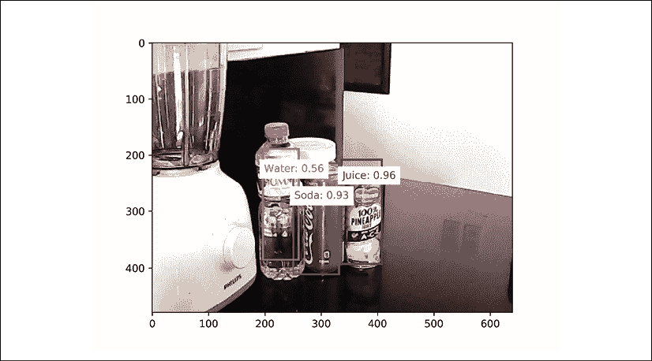

图 11.13.1 来自测试数据集的图像上的示例预测示例（未归一化的偏移量）。

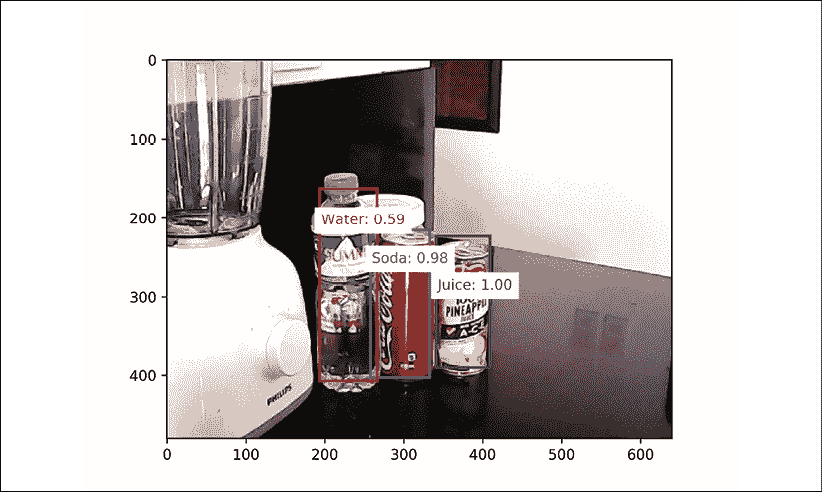

图 11.13.2 来自测试数据集的图像上的示例预测示例（未归一化的偏移量，平滑 L1）。

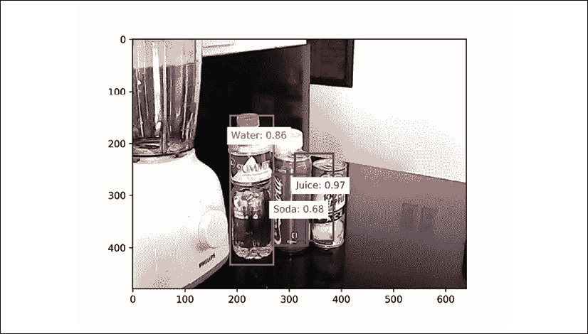

图 11.13.3 来自测试数据集的图像预测示例（标准化偏移）。

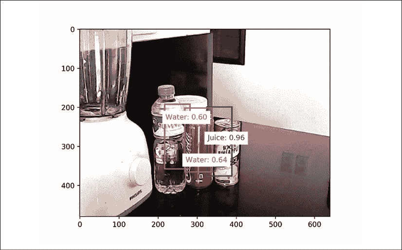

图 11.13.4 对来自测试数据集的图像进行的预测示例（标准化偏移，平滑 L1）。

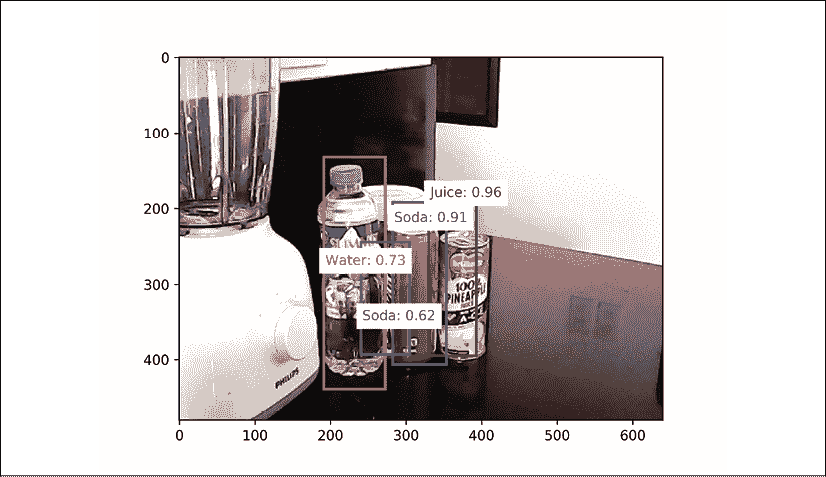

图 11.13.5 对来自测试数据集的图像进行的预测示例（归一化偏移，平滑 L1，聚焦损失）。

本节中的结果验证了我们的 SSD 模型。 一个重要的经验教训是，只要我们理解了问题，无论问题多么复杂，我们都可以逐步构建一个可行的解决方案。 SSD 是迄今为止我们在本书中介绍过的最复杂的模型。 它需要许多工具，模块以及大量数据准备和管理才能工作。

# 14\. 总结

在本章中，讨论了多尺度单发对象检测的概念。 使用以接收场斑块的质心为中心的锚框，可以计算地面真值边界框偏移量。 代替原始像素误差，归一化像素误差会鼓励更适合优化的有限范围。

每个锚框都分配有地面实况类别标签。 如果锚点框不与对象重叠，则为其分配背景类，并且其偏移量不包括在偏移量损失计算中。 已经提出了焦点损失以改善类别损失函数。 可以使用平滑的 L1 损失函数代替默认的 L1 偏置损失函数。

对测试数据集的评估表明，使用默认损失函数的归一化偏移可实现平均精度和召回率方面的最佳表现，而当消除偏移归一化时，mIoU 会得到改善。 通过增加训练图像的数量和变化可以提高性能。

在“第 12 章”中，“语义分割”建立在本章中开发的概念的基础上。 特别是，我们重用 ResNet 骨干网络来构建分段网络和 IoU 指标进行验证。

# 15\. 参考

1.  `Krizhevsky Alex, Ilya Sutskever, and Geoffrey E. Hinton. "Imagenet classification with deep convolutional neural networks." Advances in neural information processing systems. 2012.`
1.  `Liu Wei, et al. "SSD: Single Shot MultiBox Detector." European conference on computer vision. Springer, Cham, 2016.`
1.  `Girshick Ross. "Fast R-CNN." Proceedings of the IEEE international conference on computer vision. 2015.`
1.  `Lin Tsung-Yi, et al. "Focal loss for Dense Object Detection. "Proceedings of the IEEE international conference on computer vision. 2017.`
1.  `Dutta, et al. VGG Image Annotator http://www.robots.ox.ac.uk/~vgg/software/via/`
1.  `Bodla Navaneeth, et al. "Soft-NMS--Improving Object Detection With One Line of Code." Proceedings of the IEEE international conference on computer vision. 2017.`
1.  `Everingham Mark, et al. "The Pascal Visual Object Classes (VOC) challenge." International journal of computer vision 88.2 (2010): 303-338.`
1.  `"Huber Loss." https://en.wikipedia.org/wiki/Huber_loss`