# 十三、使用互信息的无监督学习

许多机器学习任务（例如分类，检测和分段）都依赖于标记的数据。 网络在这些任务上的表现直接受到标记质量和数据量的影响。 问题在于产生足够数量的高质量标注数据既昂贵又费时。

为了继续机器学习的发展，新算法应减少对人类标签的依赖。 理想情况下，网络应该从无标签数据中学习，由于互联网的发展以及诸如智能手机和**物联网**（**IoT**）。 从未标记的数据中学习是无监督学习的领域。 在某些情况下，无监督学习也称为自我监督学习，以强调使用纯净的未标记数据进行训练和缺乏人工监督。 在本文中，我们将使用术语无监督学习。

在机器学习中，有一些方法可以从未标记的数据中学习。 可以使用深度神经网络和无监督学习中的新思想来改善这些方法的表现。 当处理高度非结构化的数据（例如文本，图像，音频和视频）时，尤其如此。

在无监督学习中成功的方法之一是最大化给定神经网络中两个随机变量之间的互信息。 在信息论领域，**互信息**（**MI**）是两个随机变量之间依存性的量度。

MI 最近已成功地从未标记的数据中提取了有用的信息，可以帮助学习下游任务。 例如，MI 能够对潜在代码向量进行聚类，从而使分类任务成为简单的线性分离问题。

总之，本章的目的是介绍：

*   互信息的概念
*   使用神经网络估计 MI
*   下游任务的离散和连续随机变量上的 MI 最大化
*   Keras 中 MI 估计网络的实现

我们将从介绍互信息的概念开始。

# 1\. 互信息

互信息是对两个随机变量`X`和`Y`之间依赖性的度量。 有时，MI 也定义为通过观察`Y`得出的有关`X`的信息量。 MI 也被称为信息获取或观察`Y`时`X`不确定性的降低。

与相关性相反，MI 可以测量`X`和`Y`之间的非线性统计依赖性。 在深度学习中，MI 是一种合适的方法，因为大多数现实世界中的数据都是非结构化的，并且输入和输出之间的依赖关系通常是非线性的。 在深度学习中，最终目标是对输入数据和预先训练的模型执行特定任务，例如分类，翻译，回归或检测。 这些任务也称为下游任务。

由于 MI 可以发现输入，中间特征，表示和输出中的相关性的重要方面，这些方面本身就是随机变量，因此共享信息通常可以提高下游任务中模型的表现。

在数学上，两个随机变量`X`和`Y`之间的 MI 可以定义为：

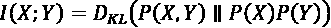 (Equation 13.1.1)

哪里：

*   `P`（`X`，`Y`）是 X 和 Y 在样本空间`X`x`Y`上的联合分布 。
*   `P`（`X`）`P`（`Y`）是边际分布`P`（`X`）和`P`（`Y`）分别位于样本空间`X`和`Y`上。

换句话说，MI 是联合分布与边际分布乘积之间的 **Kullback-Leibler**（**KL**）散度。 回顾“第 5 章”，“改进的 GAN” ，KL 是两个分布之间距离的度量。 在 MI 的上下文中，KL 距离越大，两个随机变量`X`和`Y`之间的 MI 越高。 通过扩展，MI 越高，`X`对`Y`的依赖性越高。

由于 MI 等于边际分布的联合与乘积之间的 KL 散度，因此它暗示它大于或等于零：`I(X; Y) > 0`。 当`X`和`Y`是独立随机变量时，MI 完全等于零。 当`X`和`Y`是独立的时，观察一个随机变量（例如`Y`）不会提供关于另一个随机变量的信息（例如`X`）。 因此，MI 是`X`和`Y`独立程度的度量。

如果`X`和`Y`是**离散随机变量**，则通过扩展 KL 散度，MI 可以计算为：

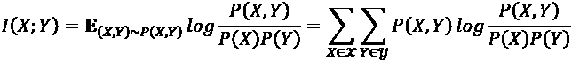 (Equation 13.1.2)

哪里：

*   `P`（`X`，`Y`）是联合**概率质量函数**（**PMF**）。
*   `P`（`X`）和`P`（`Y`）是边际 PMF。

如果联合和边际分布已知，则 MI 可以进行精确计算。

如果`X`和`Y`是**连续随机变量**，则通过扩展 KL 散度，MI 可以表示为：

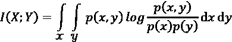 (Equation 13.1.3)

哪里：

*   `p`（`x`，`y`）是联合**概率密度函数**（**PDF**）。
*   `p`（`x`）和`p`（`y`）是边缘 PDF。

连续随机变量的 MI 通常很难处理，并且可以通过变分方法进行估计。 在本章中，我们将讨论估计两个连续随机变量之间的 MI 的技术。

在讨论用于计算互信息的技术之前，让我们首先解释一下 MI 与熵之间的关系。 熵在“第 6 章”，“纠缠表示 GAN”中非正式引入，并在 InfoGAN 中得到了应用。

# 2\. 互信息和熵

MI 也可以用熵来解释。 回想一下“第 6 章”，“纠缠表示 GAN” ，熵`H`（`X`）是对预期信息量的度量。 随机变量`X`的：

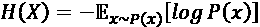 (Equation 13.2.1)

“公式 13.2.1”表示熵还是不确定性的量度。 不确定事件的发生给我们带来了更多的惊喜或信息。 例如，有关员工意外晋升的新闻具有大量信息或熵。

使用“公式 13.2.1”，MI 可以表示为：

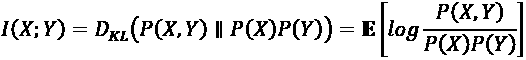

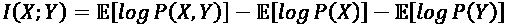

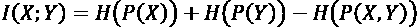

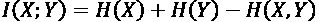 (Equation 13.2.2)

“公式 13.2.2”表示 MI 随着边际熵增加而增加，但随联合熵而减少。 就熵而言，MI 的一个更常见的表达式如下：

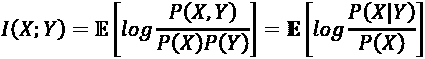

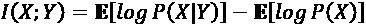

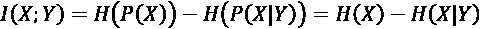 (Equation 13.2.3)

“公式 13.2.3”告诉我们，MI 随随机变量的熵增加而减小，而随另一个随机变量的条件熵而减小。 或者，如果我们知道`Y`，则 MI 是的信息减少量或`X`的不确定性。

等效地，

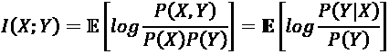

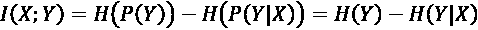 (Equation 13.2.4)

“公式 13.2.4”表示 MI 是对称的：

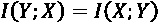 (Equation 13.2.5)

MI 也可以用`X`和`Y`的条件熵表示：

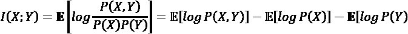 (Equation 13.2.6)

使用贝叶斯定理：

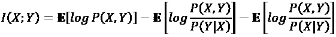

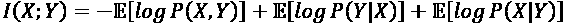


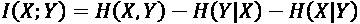 (Equation 13.2.7)

“图 13.2.1”总结了到目前为止我们讨论的 MI 与条件熵和边际熵之间的所有关系：

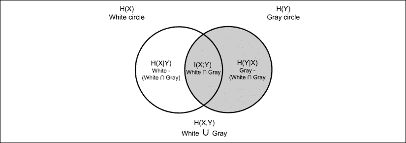

图 13.2.1 维恩图显示了 MI 与条件熵和边际熵之间的关系

MI 的另一种有趣解释是根据“公式 13.2.3”，可以将其重写为：

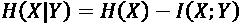 (Equation 13.2.8)

由于`H(X | Y)`是观察到`Y`时的`X`的不确定性，因此“公式 13.2.8”告诉我们， 如果可以最大化 MI，则可以确定`X`给定`Y`。 在“图 13.2.1”中，新月形`H(X | Y)`的面积随着代表 MI 的圆之间的交点增加而减小。

再举一个的具体例子，假设`X`是一个随机变量，表示观察到在给定随机字节中的 0 到 255 之间的数字。 假设分布均匀，则转换为`P(X) = 1/256`的概率。 以 2 为底的`X`的熵为：

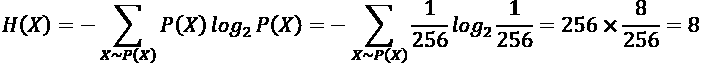

假设随机变量`Y`代表随机字节的 4 个最高有效位。 如果我们观察到 4 个最高有效位全为零，则数字 0 到 15 包含`P(X) = 1/16`，其余数字具有`P(X) = 0`。条件熵在基数 2 中是：

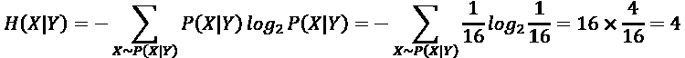

这为我们提供了`I(X; Y) = 8 - 4 = 4`的 MI。 注意，随机变量`X`的不确定性或预期信息量在知道`Y`后降低。`X`和`Y`共享的互信息为 4，这也等于两个随机变量共享的位数。“图 13.2.2”说明了两种情况，其中所有位都是随机的，而四个最高有效位都为 0。

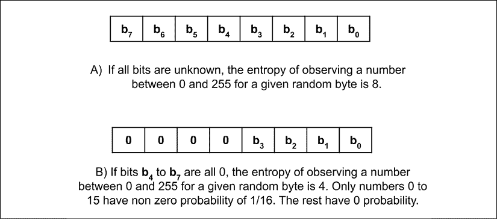

图 13.2.2 当所有位未知时与某些位已知时的熵

鉴于我们已经对 MI 和熵有了很好的了解，我们现在可以将此概念用作无监督学习的一种方法。

# 3\. 通过最大化离散随机变量的互信息来进行无监督学习

深度学习中的经典问题是监督分类。 在“第 1 章”，“Keras 简介”和“第 2 章”，“深度神经网络”中，我们了解到，在监督分类下，我们需要标记输入图像。 我们对 MNIST 和 CIFAR10 数据集都进行了分类。 对于 MNIST，三层 CNN 和密集层可实现高达 99.3% 的精度。 对于使用 ResNet 或 DenseNet 的 CIFAR10，我们可以实现大约 93% 至 94% 的精度。 MNIST 和 CIFAR10 都被标记为数据集。

与监督学习不同，本章的目标是执行无监督学习。 我们的重点是没有标签的分类。 这个想法是，如果我们学习如何对所有训练数据的潜在代码向量进行聚类，那么线性分离算法可以对每个测试输入数据潜在向量进行分类。

为了学习没有标签的潜在代码向量的聚类，我们的训练目标是在输入图像`X`和其潜在代码`Y`之间最大化 MI。`X`和`Y`都是随机变量。 这个想法是外观*相似的*图像将具有聚集到相同区域的潜在向量。 线性分配问题可以很容易地将彼此远离的区域分开。 因此，可以以无监督的方式完成分类问题。 数学上，目标是最大化：

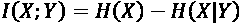 (Equation 13.2.3)

直观地，一旦我们观察到`Y`，我们对`X`充满信心。 “公式 13.2.3”的问题在于，我们无法很好地估计要测量的密度`P(X | Y) H(X | Y)`。

Ji 等人的**不变信息聚类**（**IIC**）[1] 建议从联合和边际分布直接测量`I(X; Y)`。 目的是使用“公式 13.1.2”测量引用同一输入的两个潜在代码随机变量之间的 MI。 假设输入`X`编码为`Z`：

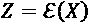

将相同的输入`X`转换为`X_bar = G(X)`，以便`X`仍可清晰地归类为与`X`相同的类别。 在图像处理中，`G`可以是常见的操作，例如小旋转，随机裁剪和剪切。 有时，只要结果图像的含义相同，就可以接受诸如对比度和亮度调整，边缘检测，少量噪声添加以及归一化之类的操作。 例如，如果`X`是狗的图像，则在`G`之后，`X_bar`显然仍是狗。

使用相同编码器网络的潜在代码向量为：

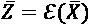

因此，我们可以用两个随机变量`Z`和`Z_bar`将“公式 13.1.2”重写为：

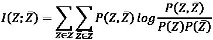 (Equation 13.3.1)

其中`P(Z)`和`P(Z_bar)`可以解释为`Z`和`Z_bar`的边际分布。 对于离散随机变量，`Z`和`Z_bar`都是`P(Z)`和`P(Z_bar)`都是分类分布。 我们可以想象，编码器输出是 *softmax* ，其维数等于训练和测试数据分布中的类数`N`。 例如，对于 MNIST，编码器输出是与训练和测试数据集中的 10 位数字相对应的 10 维一热向量。

为了确定“公式 13.3.1”中的每个项，我们首先估计`P(Z, Z_bar)`。 IIC 假设`Z`和`Z_bar`是独立的，因此联合分布可以估计为：

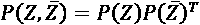 (Equation 13.3.2)

这将创建一个`N x N`矩阵`P(Z, Z_bar)`，其中每个元素`Z[ij]`对应于同时观察两个随机变量`(Z[i], Z_bar[j])`的概率。 如果对大批量进行此估计，则大样本均值将估计联合概率。

由于我们将使用 MI 来估计密度函数，因此 IIC 将采样限制为`(Z[i], Z_bar[i])`。 本质上，对于每个样本`x[i]`，我们计算其潜在代码`P(Z[i]) = E(X[i])`。 然后，我们将`x[i]`转换，并计算其潜在代码`P(Z_bar[i]) = E(X_bar[i])`。 联合分布计算如下：

 (Equation 13.3.3)

其中`M`是批量大小。 由于我们对`x[i]`和`x_bar[i]`使用相同的编码器`E`，因此联合分布应该对称。 我们通过执行以下命令来增强对称性：

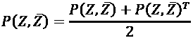 (Equation 13.3.4)

给定`P(Z, Z_bar)`，边际分布可以计算为：

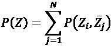 (Equation 13.3.5)

我们按行求和矩阵的所有条目。 类似地：

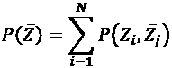 (Equation 13.3.6)

我们按矩阵汇总矩阵的所有条目。

给定“公式 13.3.1”中的所有项，我们可以训练神经网络编码器`E`，该编码器使用损失函数来最大化 MI 或最小化负 MI：

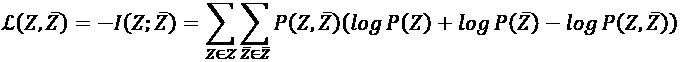 (Equation 13.3.7)

在实现无监督聚类之前，让我们再次反思目标–最大化`I(Z; Z_bar)`。 由于`X`和`X_bar = G(X)`及其对应的潜在代码向量`Z`和`Z_bar`共享相同的信息，因此神经网络编码器`E`应该学习映射`X`和`X_bar`成为潜在向量`Z`和`Z_bar`，它们具有几乎相同的值以最大化其 MI。 在 MNIST 的背景下，看起来相似的数字将具有潜在代码向量，它们聚集在空间的同一区域中。

如果潜在代码向量是 *softmax* 的输出，则表明我们正在执行无监督聚类，可以使用线性分配算法将其转换为分类器。 在本章中，我们将介绍两种可能的线性分配算法，这些算法可用于将无监督的聚类转换为无监督的分类。

在下一节中，我们将讨论可用于实现无监督聚类的编码器网络模型。 特别是，我们将介绍可用于估计`P(Z)`和`P(Z_bar)`的编码器网络。

# 4\. 用于无监督聚类的编码器网络

图 13.4.1 中显示了用于无监督聚类的编码器网络实现。 它是一种编码器，具有类似 VGG 的[2]主干和`Dense`层，并具有 *softmax* 输出。 最简单的 VGG-11 具有主干，如“图 13.4.2”所示。

对于 MNIST，使用最简单的 VGG-11 骨干将特征映射大小从`MaxPooling2D`操作的 5 倍减至零。 因此，当在 Keras 中实现时，将使用按比例缩小的 VGG-11 主干版本，如图“图 13.4.3”所示。 使用同一组过滤器。

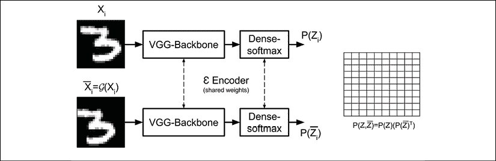

图 13.4.1 IIC 编码器网络`E`的网络实现。 输入的 MNIST 图像被中心裁剪为`24 x 24`像素。 在此示例中，`X_bar = G(X)`是随机的`24 x 24`像素裁剪操作。

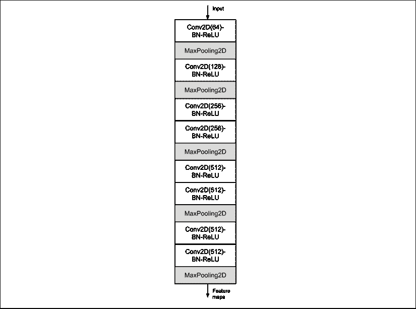

图 13.4.2 VGG-11 分类器主干

在“图 13.4.3”中，有 4 个`Conv2D-BN-ReLU Activation-MaxPooling2D`层，其过滤器大小为`(64, 128, 256, 512)`。 最后的`Conv2D`层不使用`MaxPooling2D`。 因此，最后的`Conv2D`层针对`24 x 24 x 1`裁剪的 MNIST 输入输出`(3, 3, 512)`特征映射。

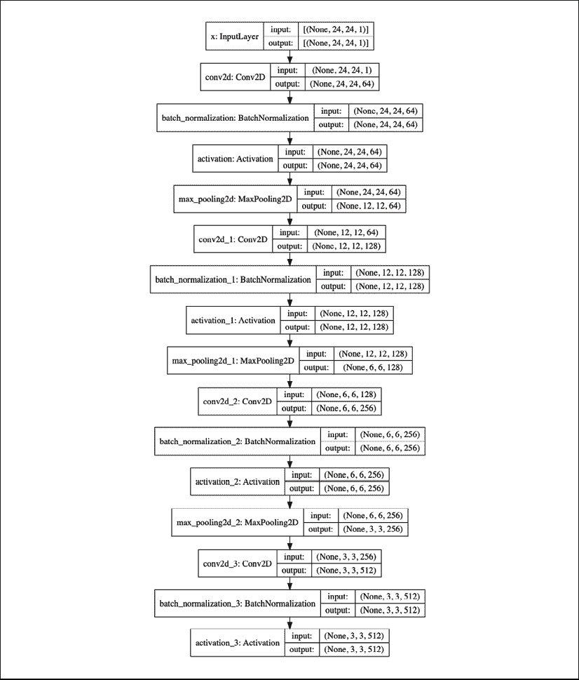

图 13.4.3 缩小的 VGG 用作编码器主干

“图 13.4.4”显示了“图 13.4.1”的 Keras 模型图。 为了提高性能，IIC 执行了超集群。 两个或更多编码器用于生成两个或更多个边际分布`P(Z)`和`P(Z_bar)`。 生成相应的联合分布。 就网络模型的而言，这是由具有两个或更多头的编码器实现的。

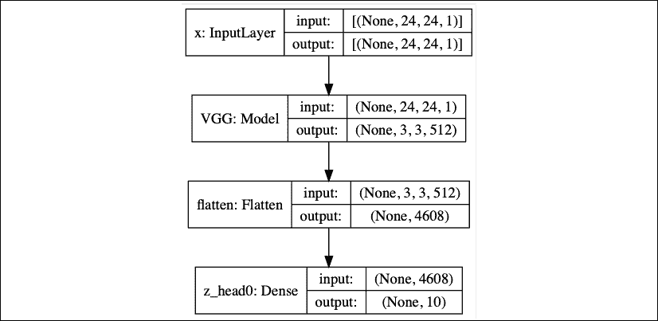

图 13.4.4 Keras 中 IIC 编码器`E`的网络实现

“图 13.4.4”是单头编码器，而“图 13.4.5”是双头编码器。 请注意，两个头共享相同的 VGG 主干。

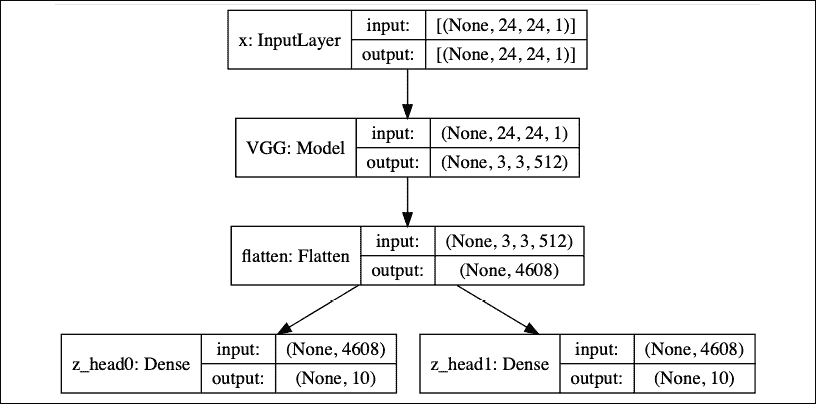

图 13.4.5 Keras 中的两头编码器网络`E`

在以下两个部分的中，我们将研究[II]网络模型是如何实现，训练和评估的。 我们还将研究线性分配问题，作为为每个聚类指定标签的工具。

# 5\. Keras 中的无监督聚类实现

Keras 中用于无监督聚类的网络模型实现在“列表 13.5.1”中显示。 仅显示初始化。 网络超参数存储在`args`中。 VGG 主干对象在初始化期间提供。 给定骨干，模型实际上只是具有 *softmax* 激活的`Dense`层，如`build_model()`方法所示。 有创建多个头的选项。

与“第 11 章”，“对象检测”相似，我们实现了`DataGenerator`类以多线程方式有效地提供输入数据。 `DataGenerator`对象生成由输入图像`X`及其变换后的图像`X_bar`组成的所需配对训练输入数据（即，连体输入图像）。 `DataGenerator`类中最关键的方法`__data_generation()`显示在“列表 13.5.2”中。 输入图像`X`从原始输入图像中央裁切。 对于 MNIST，这是`24 x 24`像素中心裁剪。 变换后的输入图像`X_bar`可以随机旋转`±20`范围内的某个角度，也可以从图像的任何部分随机裁剪`16 x 16`、`18 x 18`或`20 x 20`像素，然后将其调整为`24 x 24`像素。 作物尺寸存储在`crop_sizes`列表中。

注意，仅输入图像和变换图像在`DataGenerator`对象生成的数据中很重要。 同样，损失函数所需的配对数据沿批量轴连接。 这将使我们能够在单批配对数据中计算损失函数。

“列表 13.5.1”：`iic-13.5.1.py`。 显示初始化和模型创建的 IIC 类：IIC 类：

```py
 def __init__(self,
                 args,
                 backbone):
        """Contains the encoder model, the loss function,
            loading of datasets, train and evaluation routines
            to implement IIC unsupervised clustering via mutual
            information maximization 
```

```py
 Arguments:
            args : Command line arguments to indicate choice
                of batch size, number of heads, folder to save
                weights file, weights file name, etc
            backbone (Model): IIC Encoder backbone (eg VGG)
        """
        self.args = args
        self.backbone = backbone
        self._model = None
        self.train_gen = DataGenerator(args, siamese=True)
        self.n_labels = self.train_gen.n_labels
        self.build_model()
        self.load_eval_dataset()
        self.accuracy = 0 
```

```py
 def build_model(self):
        """Build the n_heads of the IIC model
        """
        inputs = Input(shape=self.train_gen.input_shape, name='x')
        x = self.backbone(inputs)
        x = Flatten()(x)
        # number of output heads
        outputs = []
        for i in range(self.args.heads):
            name = "z_head%d" % i
            outputs.append(Dense(self.n_labels,
                                 activation='softmax',
                                 name=name)(x))
        self._model = Model(inputs, outputs, name='encoder')
        optimizer = Adam(lr=1e-3)
        self._model.compile(optimizer=optimizer, loss=self.mi_loss) 
```

“列表 13.5.2”：`data_generator.py`。 用于生成成对的输入数据以训练 IIC 编码器的`DataGenerator`类方法：

```py
 def __data_generation(self, start_index, end_index):
        """Data generation algorithm. The method generates
            a batch of pair of images (original image X and
            transformed imaged Xbar). The batch of Siamese
            images is used to trained MI-based algorithms:
            1) IIC and 2) MINE (Section 7) 
```

```py
 Arguments:
            start_index (int): Given an array of images,
                this is the start index to retrieve a batch
            end_index (int): Given an array of images,
                this is the end index to retrieve a batch
        """ 
```

```py
 d = self.crop_size // 2
        crop_sizes = [self.crop_size*2 + i for i in range(0,5,2)]
        image_size = self.data.shape[1] - self.crop_size
        x = self.data[self.indexes[start_index : end_index]]
        y1 = self.label[self.indexes[start_index : end_index]] 
```

```py
 target_shape = (x.shape[0], *self.input_shape)
        x1 = np.zeros(target_shape)
        if self.siamese:
            y2 = y1
            x2 = np.zeros(target_shape) 
```

```py
 for i in range(x1.shape[0]):
            image = x[i]
            x1[i] = image[d: image_size + d, d: image_size + d]
            if self.siamese:
                rotate = np.random.randint(0, 2)
                # 50-50% chance of crop or rotate
                if rotate == 1:
                    shape = target_shape[1:]
                    x2[i] = self.random_rotate(image,
                                               target_shape=shape)
                else:
                    x2[i] = self.random_crop(image,
                                             target_shape[1:],
                                             crop_sizes) 
```

```py
 # for IIC, we are mostly interested in paired images
        # X and Xbar = G(X)
        if self.siamese:
            # If MINE Algorithm is chosen, use this to generate
            # the training data (see Section 9)
            if self.mine:
                y = np.concatenate([y1, y2], axis=0)
                m1 = np.copy(x1)
                m2 = np.copy(x2)
                np.random.shuffle(m2)
                x1 =  np.concatenate((x1, m1), axis=0)
                x2 =  np.concatenate((x2, m2), axis=0)
                x = (x1, x2)
                return x, y 
```

```py
 x_train = np.concatenate([x1, x2], axis=0)
            y_train = np.concatenate([y1, y2], axis=0)
            y = []
            for i in range(self.args.heads):
                y.append(y_train)
            return x_train, y 
```

```py
 return x1, y1 
```

为了实现 VGG 骨干，在 Keras 中实现了`VGG`类，如“列表 13.5.3”所示。 `VGG`类的灵活性在于可以用不同的方式（或 VGG 的不同样式）进行配置。 显示了用于 IIC VGG 主干配置`cfg`的选项'F'。 我们使用一个辅助函数来生成`Conv2D-BN-ReLU-MaxPooling2D`层。

“列表 13.5.3”：`vgg.py`。

Keras 中的`VGG backbone`类方法：

```py
cfg = {
    'F': [64, 'M', 128, 'M', 256, 'M', 512],
} 
```

```py
class VGG:
    def __init__(self, cfg, input_shape=(24, 24, 1)):
        """VGG network model creator to be used as backbone
            feature extractor 
```

```py
 Arguments:
            cfg (dict): Summarizes the network configuration
            input_shape (list): Input image dims
        """
        self.cfg = cfg
        self.input_shape = input_shape
        self._model = None
        self.build_model() 
```

```py
 def build_model(self):
        """Model builder uses a helper function
            make_layers to read the config dict and
            create a VGG network model
        """
        inputs = Input(shape=self.input_shape, name='x')
        x = VGG.make_layers(self.cfg, inputs)
        self._model = Model(inputs, x, name='VGG') 
```

```py
 @property
    def model(self):
        return self._model 
```

```py
 @staticmethod
    def make_layers(cfg,
                    inputs,
                    batch_norm=True,
                    in_channels=1):
        """Helper function to ease the creation of VGG
            network model 
```

```py
 Arguments:
            cfg (dict): Summarizes the network layer 
                configuration
            inputs (tensor): Input from previous layer
            batch_norm (Bool): Whether to use batch norm
                between Conv2D and ReLU
            in_channel (int): Number of input channels
        """
        x = inputs
        for layer in cfg:
            if layer == 'M':
                x = MaxPooling2D()(x)
            elif layer == 'A':
                x = AveragePooling2D(pool_size=3)(x)
            else:
                x = Conv2D(layer,
                           kernel_size=3,
                           padding='same',
                           kernel_initializer='he_normal'
                           )(x)
                if batch_norm:
                    x = BatchNormalization()(x)
                x = Activation('relu')(x) 
```

```py
 return x 
```

回到`IIC`类，`IIC`的关键算法是使负 MI 最小的损失函数。 此方法显示在“列表 13.5.4”中。 为了评估单个批量中的损失，我们研究了`y_pred`，并将其分为上下两半，分别对应于输入图像`X`及其变换后的图像`X_bar`的编码器输出的。 回想一下，配对数据是通过将一批图像`X`和一批其变换后的图像`X_bar`连接在一起而制成的。

`y_pred`的下半部分为`Z`，而上半部分为`Z_bar`遵循“公式 10.3.2”至“公式 10.3.7”，联合分布`P(Z, Z_bar)`和边际分布被计算。 最后，返回负数 MI。 注意，每个头对总损失函数的贡献均等。 因此，损失是根据头部的数量来缩放的。

“列表 13.5.4”：`iic-13.5.1.py`。

Keras 中的`IIC`类损失函数。 损失函数使负 MI 最小化（即，使 MI 最大化）：

```py
 def mi_loss(self, y_true, y_pred):
        """Mutual information loss computed from the joint
           distribution matrix and the marginals 
```

```py
 Arguments:
            y_true (tensor): Not used since this is
                unsupervised learning
            y_pred (tensor): stack of softmax predictions for
                the Siamese latent vectors (Z and Zbar)
        """
        size = self.args.batch_size
        n_labels = y_pred.shape[-1]
        # lower half is Z
        Z = y_pred[0: size, :]
        Z = K.expand_dims(Z, axis=2)
        # upper half is Zbar
        Zbar = y_pred[size: y_pred.shape[0], :]
        Zbar = K.expand_dims(Zbar, axis=1)
        # compute joint distribution (Eq 10.3.2 & .3)
        P = K.batch_dot(Z, Zbar)
        P = K.sum(P, axis=0)
        # enforce symmetric joint distribution (Eq 10.3.4)
        P = (P + K.transpose(P)) / 2.0
        # normalization of total probability to 1.0
        P = P / K.sum(P)
        # marginal distributions (Eq 10.3.5 & .6)
        Pi = K.expand_dims(K.sum(P, axis=1), axis=1)
        Pj = K.expand_dims(K.sum(P, axis=0), axis=0)
        Pi = K.repeat_elements(Pi, rep=n_labels, axis=1)
        Pj = K.repeat_elements(Pj, rep=n_labels, axis=0)
        P = K.clip(P, K.epsilon(), np.finfo(float).max)
        Pi = K.clip(Pi, K.epsilon(), np.finfo(float).max)
        Pj = K.clip(Pj, K.epsilon(), np.finfo(float).max)
        # negative MI loss (Eq 10.3.7)
        neg_mi = K.sum((P * (K.log(Pi) + K.log(Pj) - K.log(P))))
        # each head contribute 1/n_heads to the total loss
        return neg_mi/self.args.heads 
```

IIC 网络训练方法显示在“列表 13.5.5”中。 由于我们使用的是从`Sequence`类派生的`DataGenerator`对象，因此可以使用 Keras `fit_generator()`方法来训练模型。

我们使用学习率调度器，每 400 个周期将学习率降低 80%。 `AccuracyCallback`调用`eval()`方法，因此我们可以在每个周期之后记录网络的表现。

可以选择保存表现最佳的模型的权重。 在`eval()`方法中，我们使用线性分类器为每个聚类分配标签。 线性分类器`unsupervised_labels()`是一种匈牙利算法，它以最小的成本将标签分配给群集。

最后一步将无监督的聚类转换为无监督的分类。 `unsupervised_labels()`函数在“列表 13.5.6”中显示。

“列表 13.5.5”：`iic-13.5.1.py`。

IIC 网络训练和评估：

```py
 def train(self):
        """Train function uses the data generator,
            accuracy computation, and learning rate
            scheduler callbacks
        """
        accuracy = AccuracyCallback(self)
        lr_scheduler = LearningRateScheduler(lr_schedule,
                                             verbose=1)
        callbacks = [accuracy, lr_scheduler]
        self._model.fit_generator(generator=self.train_gen,
                                  use_multiprocessing=True,
                                  epochs=self.args.epochs,
                                  callbacks=callbacks,
                                  workers=4,
                                  shuffle=True) 
```

```py
 def eval(self):
        """Evaluate the accuracy of the current model weights
        """
        y_pred = self._model.predict(self.x_test)
        print("")
        # accuracy per head
        for head in range(self.args.heads):
            if self.args.heads == 1:
                y_head = y_pred
            else:
                y_head = y_pred[head]
            y_head = np.argmax(y_head, axis=1)
            accuracy = unsupervised_labels(list(self.y_test),
                                           list(y_head),
                                           self.n_labels,
                                           self.n_labels)
            info = "Head %d accuracy: %0.2f%%"
            if self.accuracy > 0:
                info += ", Old best accuracy: %0.2f%%"
                data = (head, accuracy, self.accuracy)
            else:
                data = (head, accuracy)
            print(info % data)
            # if accuracy improves during training, 
            # save the model weights on a file
            if accuracy > self.accuracy \
                    and self.args.save_weights is not None:
                self.accuracy = accuracy
                folder = self.args.save_dir
                os.makedirs(folder, exist_ok=True)
                path = os.path.join(folder, self.args.save_weights)
                print("Saving weights... ", path)
                self._model.save_weights(path) 
```

“列表 13.5.6”：`utils.py`。

匈牙利语算法将标签分配给具有最低成本的集群：

```py
from scipy.optimize import linear_sum_assignment
def unsupervised_labels(y, yp, n_classes, n_clusters):
    """Linear assignment algorithm

    Arguments:
        y (tensor): Ground truth labels
        yp (tensor): Predicted clusters
        n_classes (int): Number of classes
        n_clusters (int): Number of clusters
    """
    assert n_classes == n_clusters

    # initialize count matrix
    C = np.zeros([n_clusters, n_classes])

    # populate count matrix
    for i in range(len(y)):
        C[int(yp[i]), int(y[i])] += 1

    # optimal permutation using Hungarian Algo
    # the higher the count, the lower the cost
    # so we use -C for linear assignment
    row, col = linear_sum_assignment(-C)

    # compute accuracy
    accuracy = C[row, col].sum() / C.sum()

    return accuracy * 100 
```

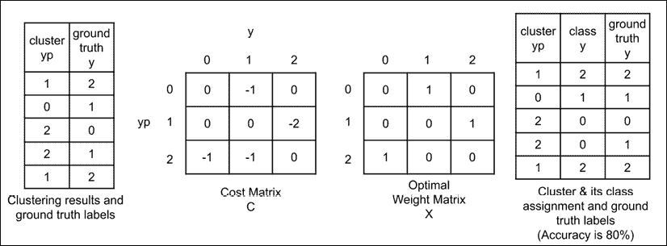

图 13.5.1 在三个群集的简单场景中说明的线性分配算法，可以将其最佳地分配给三个类别

如图“图 13.5.1”所示，线性分配问题最好使用将三个群集分配给三个类别的简化方案来解释。 线性分配问题找到了类对类的一对一分配，从而使总成本最小。 在“图 13.5.1*”的左侧，显示了聚类结果和真实情况标签。

线性分配问题可以找到每个群集的类或类别，或者如何为每个群集分配标签。 还显示了成本矩阵`C`。 对于每个聚类-真实情况对，成本矩阵像元递减 1。该像元的行-列索引是聚类编号-真实情况标签索引。 使用成本矩阵，线性分配问题的工作是找到导致总成本最小的最优矩阵`X`：

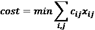 (Equation 13.5.1)

其中`c[ij]`和`x[ij]`分别是矩阵`C`和`X`的元素 。`i`和`j`是索引。`X`的元素受的以下约束：

`x[ij] ∈ {0, 1}`

`Σ[j] x[ij] = 1`对于`i = 1, 2, ..., N`

`Σ[i] x[ij] = 1`对于`j = 1, 2, ..., N`

`X`是一个二进制矩阵。 每行仅分配给一列。 因此，线性分配问题是组合问题。 最佳解决方案的详细信息超出了本书的范围，此处不再讨论。

最佳权重矩阵`X`显示在“图 13.5.1”中。 群集 0 被分配了标签 1。群集 1 被分配了标签 2。群集 2 被分配了标签 0。这可以从成本矩阵中直观地进行验证，因为这导致最低成本为 -4，同时确保每行仅分配给一列。

使用此矩阵，群集类的分配显示在最右边的表中。 使用群集类分配时，第四行上只有一个错误。 结果精度为五分之四，即 80%。

我们可以将的线性分配问题扩展到为 10 个 MNIST 集群分配标签的问题。 我们在`scipy`包中使用`linear_sum_assignment()`函数。 该函数基于匈牙利算法。“列表 13.5.6”显示了群集标记过程的实现。 有关`linear_sum_assignment()`函数的更多详细信息，请参见[这里](https://docs.scipy.org/doc/scipy-0.18.1/reference/generated/scipy.optimize.linear_sum_assignment.html)。

要训​​练 1 头情况下的 IIC 模型，请执行：

```py
python3 iic-13.5.1.py  --heads=1 --train --save-weights=head1.h5 
```

对于其他数量的打印头，应相应地修改选项`--heads`和`--save-weights`。 在下一部分中，我们将检查 IIC 作为 MNIST 分类器的表现。

# 6\. 将 MNIST 用于验证

在本节中，我们将研究使用 MNIST 测试数据集对 IIC 进行验证之后的结果。 在测试数据集上运行聚类预测后，线性分配问题为每个聚类分配标签，从本质上将聚类转换为分类。 我们计算了分类精度，如“表 13.6.1”所示。 IIC 的准确率高于论文中报告的 99.3%。 但是，应该注意的是，并非每次训练都会导致高精度分类。

有时，由于优化似乎停留在局部最小值中，我们不得不多次运行训练。 此外，在多头 IIC 模型中，对于所有头部，我们都无法获得相同水平的表现。“表 13.6.1”报告了最佳表现的头部。

| **头部数** |`1`|`2`|`3`|`4`|`5`|
| --- | --- | --- | --- | --- | --- |
| **精度，%** | 99.49 | 99.47 | 99.54 | 99.52 | 99.53 |

表 13.6.1 不同头数的 IIC 精度

权重在 GitHub 上可用。 例如，要在单头 IIC 上运行验证：

```py
python3 iic-13.5.1.py --heads=1 --eval --restore-weights=head1-best.h5 
```

总之，我们可以看到可以执行无监督分类。 结果实际上比我们在“第 2 章”，“深度神经网络”中检查的监督分类更好。 在以下各节中，我们将把注意力转向对连续随机变量的无监督学习。

# 7\. 通过最大化连续随机变量的互信息进行无监督学习

在前面的章节中，我们了解到可以很好地估计离散随机变量的 MI。 我们还证明了借助线性分配算法，通过最大化 MI 来执行聚类的网络可以得出准确的分类器。

如果 IIC 是离散随机变量 MI 的良好估计者，那么连续随机变量又如何呢？ 在本节的中，我们讨论 Belghazi 等人的**互信息网络估计器**（**MINE**）。 [3]作为连续随机变量 MI 的估计量。

MINE 在“公式 13.1.1”中提出了 KL 散度的另一种表示形式，以使用神经网络实现 MI 估计器。 在 MINE 中，使用 KL 散度的 **Donsker-Varadhan**（**DV**）表示：

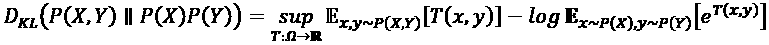 (Equation 13.7.1)

在函数`T`的整个空间中占据最高位的位置。`T`是从输入空间（例如图像）映射到实数的任意函数。 回想一下，最高被粗略地解释为最大值。 对于`T`，我们可以从`θ ∈ Θ`参数化的函数`T[θ] = X x Y -> R`系列中进行选择。 因此，我们可以用估计 KL 散度的深度神经网络表示`T[θ]`，因此代表`T`。

给定作为 MI 的精确（但难处理）表示`I(X; Y)`及其参数化的估计值`I[θ](X; Y)`作为易于处理的下限，我们可以安全地说：

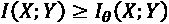 (Equation 13.7.2)

其中参数化的 MI 估计为：

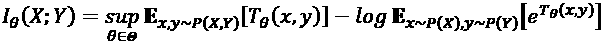 (Equation 13.7.3)

`I[θ](X; Y)`也称为神经信息测度。 在第一个期望中，样本`(x, y) ~ P(X, Y)`从联合分布`P`（`X`，`Y`）中获取。 在第二个期望中，样本`x ~ P(X), y ~ P(Y)`来自边际分布`P(X)`和`P(Y)`。

“算法 13.7.1”：`MINE`。

初始化所有网络参数`θ`。

`θ`尚未收敛时，请执行：

1.  从联合分布`{(x^(1), y^(1)), (x^(2), y^(2)), ..., (x^(b), y^(b))} ~ P(X, Y)`中抽取一个小批量的`b`
2.  从边际分布`{x^(1), x^(2), ..., x^(b)} ~ P(X)`和`{y^(1), y^(2), ..., y^(b)} ~ P(Y)`中抽取一个小批量的`b`。
3.  评估下界：

    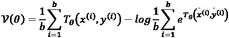
4.  评估偏差校正后的梯度：

    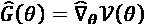

1.  更新网络参数：

    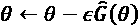
    
    其中`ε`是学习率。

“算法 13.7.1”总结了 MINE 算法。 来自边际分布的样本是来自联合分布的样本，另一个变量已删除。 例如，样本`x`只是简单的样本`(x, y)`，变量`y`被丢弃。 在降为变量`y`的值之后，将`x`的样本进行混洗。 对`y`执行相同的采样方法。 为了清楚起见，我们使用符号`x_bar`和`y_bar`从边际分布中识别样本。

在下一部分中，在双变量高斯分布的情况下，我们将使用 MINE 算法估计 MI。 我们将展示使用解析方法估计的 MI 和使用 MINE 估计 MI 的方法。

# 8\. 估计二元高斯的互信息

在本节中，我们将验证 MINE 的二元高斯分布。“图 13.8.1”显示具有均值和协方差的双变量高斯分布：

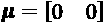 (Equation 13.8.1)

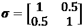 (Equation 13.8.2)

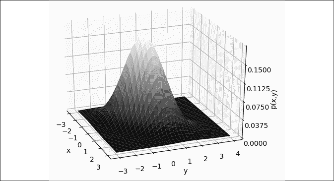

图 13.8.1 具有均值和协方差的二维高斯分布，如公式 13.8.1 和公式 13.8.2 所示

我们的目标是通过近似“公式 13.1.3”来估计 MI。 可以通过获得大量样本（例如 1 百万个）并创建具有大量箱子（例如 100 个箱子）的直方图来进行近似。“列表 13.8.1”显示了使用装仓对二元高斯分布的 MI 进行的手动计算。

“列表 13.8.1”：`mine-13.8.1.py`：

```py
def sample(joint=True,
           mean=[0, 0],
           cov=[[1, 0.5], [0.5, 1]],
           n_data=1000000):
    """Helper function to obtain samples 
        fr a bivariate Gaussian distribution 
```

```py
 Arguments:
        joint (Bool): If joint distribution is desired
        mean (list): The mean values of the 2D Gaussian
        cov (list): The covariance matrix of the 2D Gaussian
        n_data (int): Number of samples fr 2D Gaussian
    """
    xy = np.random.multivariate_normal(mean=mean,
                                       cov=cov,
                                       size=n_data) 
```

```py
 # samples fr joint distribution
    if joint:
        return xy
    y = np.random.multivariate_normal(mean=mean,
                                      cov=cov,
                                      size=n_data) 
```

```py
 # samples fr marginal distribution
    x = xy[:,0].reshape(-1,1)
    y = y[:,1].reshape(-1,1)
    xy = np.concatenate([x, y], axis=1)
    return xy 
```

```py
def compute_mi(cov_xy=0.5, n_bins=100):
    """Analytic computation of MI using binned 
        2D Gaussian 
```

```py
 Arguments:
        cov_xy (list): Off-diagonal elements of covariance
            matrix
        n_bins (int): Number of bins to "quantize" the
            continuous 2D Gaussian
    """
    cov=[[1, cov_xy], [cov_xy, 1]]
    data = sample(cov=cov)
    # get joint distribution samples
    # perform histogram binning
    joint, edge = np.histogramdd(data, bins=n_bins)
    joint /= joint.sum()
    eps = np.finfo(float).eps
    joint[joint<eps] = eps
    # compute marginal distributions
    x, y = margins(joint) 
```

```py
 xy = x*y
    xy[xy<eps] = eps
    # MI is P(X,Y)*log(P(X,Y)/P(X)*P(Y))
    mi = joint*np.log(joint/xy)
    mi = mi.sum()
    return mi 
```

运行的结果：

```py
python3 mine-13.8.1.py --gaussian 
```

表示手动计算的 MI：

```py
Computed MI: 0.145158 
```

可以使用`--cov_xy`选项更改协方差。 例如：

```py
python3 mine-13.8.1.py  --gaussian --cov_xy=0.8 
```

表示手动计算的 MI：

```py
Computed MI: 0.510342 
```

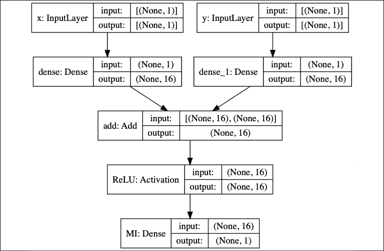

图 13.8.2 一个简单的 MINE 模型，用于估计双变量高斯分布的随机变量`X`和`Y`的 MI

“列表 13.8.2”：`mine-13.8.1.py`。

一个简单的 MINE 模型，用于估计双变量高斯分布的随机变量的 MI：

```py
class SimpleMINE:
    def __init__(self,
                 args,
                 input_dim=1,
                 hidden_units=16,
                 output_dim=1):
        """Learn to compute MI using MINE (Algorithm 13.7.1) 
```

```py
 Arguments:
            args : User-defined arguments such as off-diagonal
                elements of covariance matrix, batch size, 
                epochs, etc
            input_dim (int): Input size dimension
            hidden_units (int): Number of hidden units of the 
                MINE MLP network
            output_dim (int): Output size dimension
        """
        self.args = args
        self._model = None
        self.build_model(input_dim,
                         hidden_units,
                         output_dim) 
```

```py
 def build_model(self,
                    input_dim,
                    hidden_units,
                    output_dim):
        """Build a simple MINE model 
```

```py
 Arguments:
            See class arguments.
        """
        inputs1 = Input(shape=(input_dim), name="x")
        inputs2 = Input(shape=(input_dim), name="y")
        x1 = Dense(hidden_units)(inputs1)
        x2 = Dense(hidden_units)(inputs2)
        x = Add()([x1, x2])
        x = Activation('relu', name="ReLU")(x)
        outputs = Dense(output_dim, name="MI")(x)
        inputs = [inputs1, inputs2]
        self._model = Model(inputs,
                            outputs,
                            name='MINE')
        self._model.summary() 
```

```py
 def mi_loss(self, y_true, y_pred):
        """ MINE loss function 
```

```py
 Arguments:
            y_true (tensor): Not used since this is
                unsupervised learning
            y_pred (tensor): stack of predictions for
                joint T(x,y) and marginal T(x,y)
        """
        size = self.args.batch_size
        # lower half is pred for joint dist
        pred_xy = y_pred[0: size, :] 
```

```py
 # upper half is pred for marginal dist
        pred_x_y = y_pred[size : y_pred.shape[0], :]
        # implentation of MINE loss (Eq 13.7.3)
        loss = K.mean(pred_xy) \
               - K.log(K.mean(K.exp(pred_x_y)))
        return -loss 
```

```py
 def train(self):
        """Train MINE to estimate MI between 
            X and Y of a 2D Gaussian
        """
        optimizer = Adam(lr=0.01)
        self._model.compile(optimizer=optimizer,
                            loss=self.mi_loss)
        plot_loss = []
        cov=[[1, self.args.cov_xy], [self.args.cov_xy, 1]]
        loss = 0.
        for epoch in range(self.args.epochs):
            # joint dist samples
            xy = sample(n_data=self.args.batch_size,
                        cov=cov)
            x1 = xy[:,0].reshape(-1,1)
            y1 = xy[:,1].reshape(-1,1)
            # marginal dist samples
            xy = sample(joint=False,
                        n_data=self.args.batch_size,
                        cov=cov)
            x2 = xy[:,0].reshape(-1,1)
            y2 = xy[:,1].reshape(-1,1) 
```

```py
 # train on batch of joint & marginal samples
            x =  np.concatenate((x1, x2))
            y =  np.concatenate((y1, y2))
            loss_item = self._model.train_on_batch([x, y],
                                                   np.zeros(x.shape))
            loss += loss_item
            plot_loss.append(-loss_item)
            if (epoch + 1) % 100 == 0:
                fmt = "Epoch %d MINE MI: %0.6f"
                print(fmt % ((epoch+1), -loss/100))
                loss = 0. 
```

现在，让我们使用 MINE 估计此双变量高斯分布的 MI。“图 13.8.2”显示了一个简单的 2 层 MLP 作为`T[θ]`的模型。 输入层从联合分布中接收一批（`x`，`y`），从边缘分布中接收一批`(x_bar, y_bar)`。 该网络在`build_model()`中的“列表 13.8.2”中实现。 在同一清单中还显示了此简单 MINE 模型的训练例程。

实现“公式 13.7.3”的损失函数也在“列表 13.8.2”中显示。 请注意，损失函数不使用基本真值。 它只是最小化了 MI 的负估计（从而使 MI 最大化）。 对于此简单的 MINE 模型，未实现移动平均损失。 我们使用“列表 13.8.1”中的相同函数`sample()`来获得联合和边际样本。

现在，我们可以使用同一命令来估计双变量高斯分布的 MI：

```py
python3 mine-13.8.1.py --gaussian 
```

“图 13.8.3”显示了 MI 估计（负损失）与历时数的关系。 以下是每隔 100 个特定周期的定量结果。手动和 MINE 计算的结果接近。 这证明了 MINE 是连续随机变量 MI 的良好估计。

```py
Epoch 100 MINE MI: 0.112297
Epoch 200 MINE MI: 0.141723
Epoch 300 MINE MI: 0.142567
Epoch 400 MINE MI: 0.142087
Epoch 500 MINE MI: 0.142083
Epoch 600 MINE MI: 0.144755
Epoch 700 MINE MI: 0.141434
Epoch 800 MINE MI: 0.142480
Epoch 900 MINE MI: 0.143059
Epoch 1000 MINE MI: 0.142186
Computed MI: 0.147247 
```

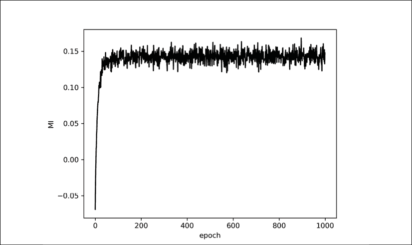

图 13.8.3 MI 估计作为简单 MINE 模型的函数周期。

到目前为止，我们已经针对二元高斯分布情况证明了 MINE。 在下一节中，我们将使用 MINE 来处理与 IIC 相同的 MNIST 无监督聚类问题。

# 9\. Keras 中的使用连续随机变量的无监督聚类

在 MNIST 数字的无监督分类中，我们使用 IIC，因为可以使用离散的联合和边际分布来计算 MI 。 我们使用线性分配算法获得了良好的准确率。

在此部分中，我们将尝试使用 MINE 进行聚类。 我们将使用来自 IIC 的相同关键思想：从一对图像及其转换后的版本`(X, X_bar)`中，最大化对应的编码潜向量`(Z, Z_bar)`的 MI。 通过最大化 MI，我们对编码的潜在向量进行聚类。 与 MINE 的不同之处在于，编码后的潜在向量是连续的，而不是 IIC 中使用的单热向量格式。 由于聚类的输出不是单热向量格式，因此我们将使用线性分类器。 线性分类器是没有诸如`ReLU`之类的非线性激活层的 MLP。 如果输出不是单热点向量格式，则使用线性分类器替代线性分配算法。

“图 13.9.1”显示了 MINE 的网络模型。 对于 MNIST，从 MNIST 训练数据集中采样了`x`。 与 IIC 相似，称为变量`y`的其他输入只是图像`x`的变换后的版本。 在测试过程中，输入图像`x`来自 MNIST 测试数据集。 从本质上讲，数据生成与 IIC 中的相同，如“列表 13.5.2”中所示。


图 13.9.1 使用编码器网络`E`的 MINE 的网络实现。 输入的 MNIST 图像被中心裁剪为`24 x 24`像素。 在此示例中，`X_bar = Y = G(X)`是随机的`24 x 24`像素裁剪操作。

当在 Keras 中实现时，“图 13.9.1”的编码器网络显示在“图 13.9.2”中。 我们在 Dense 输出中省略了维数，以便我们可以尝试不同的维数（例如 10、16 和 32）。


图 13.9.2 编码器网络`E`是 VGG 网络，类似于 IIC 中使用的网络

MINE 网络模型显示在“图 13.9.3”中，代码显示在“列表 13.9.1”中。 它在架构中与上一节中实现的简单 MINE 类似，不同之处在于，我们在 MLP 中使用了 1,024 个隐藏单元，而不是 16 个。

“列表 13.9.1”：`mine-13.8.1.py`。

MINE 网络模型用于无监督群集：

```py
class MINE:
    def __init__(self,
                 args,
                 backbone):
        """Contains the encoder, SimpleMINE, and linear 
            classifier models, the loss function,
            loading of datasets, train and evaluation routines
            to implement MINE unsupervised clustering via mutual
            information maximization 
```

```py
 Arguments:
            args : Command line arguments to indicate choice
                of batch size, folder to save
                weights file, weights file name, etc
            backbone (Model): MINE Encoder backbone (eg VGG)
        """
        self.args = args
        self.latent_dim = args.latent_dim
        self.backbone = backbone
        self._model = None
        self._encoder = None
        self.train_gen = DataGenerator(args,
                                       siamese=True,
                                       mine=True)
        self.n_labels = self.train_gen.n_labels
        self.build_model()
        self.accuracy = 0 
```

```py
 def build_model(self):
        """Build the MINE model unsupervised classifier
        """
        inputs = Input(shape=self.train_gen.input_shape,
                       name="x")
        x = self.backbone(inputs)
        x = Flatten()(x)
        y = Dense(self.latent_dim,
                  activation='linear',
                  name="encoded_x")(x)
        # encoder is based on backbone (eg VGG)
        # feature extractor
        self._encoder = Model(inputs, y, name="encoder")
        # the SimpleMINE in bivariate Gaussian is used 
        # as T(x,y) function in MINE (Algorithm 13.7.1)
        self._mine = SimpleMINE(self.args,
                                input_dim=self.latent_dim,
                                hidden_units=1024,
                                output_dim=1)
        inputs1 = Input(shape=self.train_gen.input_shape,
                        name="x")
        inputs2 = Input(shape=self.train_gen.input_shape,
                        name="y")
        x1 = self._encoder(inputs1)
        x2 = self._encoder(inputs2)
        outputs = self._mine.model([x1, x2])
        # the model computes the MI between 
        # inputs1 and 2 (x and y)
        self._model = Model([inputs1, inputs2],
                            outputs,
                            name='encoder')
        optimizer = Adam(lr=1e-3)
        self._model.compile(optimizer=optimizer,
                            loss=self.mi_loss)
        self._model.summary()
        self.load_eval_dataset()
        self._classifier = LinearClassifier(\
                            latent_dim=self.latent_dim) 
```


图 13.9.3 MINE 网络模型

如“列表 13.9.2”中所示，训练例程类似于 IIC 中的训练例程。 区别在于在每个周期之后执行的评估。 在这种情况下，我们针对个周期训练线性分类器，并将其用于评估聚类的潜在代码向量。 当精度提高时，可以选择保存模型权重。 损失函数和优化器与`SimpleMINE`中的类似，如“列表 13.8.2”中所示，此处不再赘述。

“列表 13.9.2”：`mine-13.8.1.py`。

矿山训练和评估职能：

```py
 def train(self):
        """Train MINE to estimate MI between 
            X and Y (eg MNIST image and its transformed
            version)
        """
        accuracy = AccuracyCallback(self)
        lr_scheduler = LearningRateScheduler(lr_schedule,
                                             verbose=1)
        callbacks = [accuracy, lr_scheduler]
        self._model.fit_generator(generator=self.train_gen,
                                  use_multiprocessing=True,
                                  epochs=self.args.epochs,
                                  callbacks=callbacks,
                                  workers=4,
                                  shuffle=True) 
```

```py
 def eval(self):
        """Evaluate the accuracy of the current model weights
        """
        # generate clustering predictions fr test data
        y_pred = self._encoder.predict(self.x_test)
        # train a linear classifier
        # input: clustered data
        # output: ground truth labels
        self._classifier.train(y_pred, self.y_test)
        accuracy = self._classifier.eval(y_pred, self.y_test) 
```

```py
 info = "Accuracy: %0.2f%%"
        if self.accuracy > 0:
            info += ", Old best accuracy: %0.2f%%"
            data = (accuracy, self.accuracy)
        else:
            data = (accuracy)
        print(info % data)
        # if accuracy improves during training, 
        # save the model weights on a file
        if accuracy > self.accuracy \
            and self.args.save_weights is not None:
            folder = self.args.save_dir
            os.makedirs(folder, exist_ok=True)
            args = (self.latent_dim, self.args.save_weights)
            filename = "%d-dim-%s" % args
            path = os.path.join(folder, filename)
            print("Saving weights... ", path)
            self._model.save_weights(path) 
```

```py
 if accuracy > self.accuracy:
            self.accuracy = accuracy 
```


图 13.9.4 线性分类器模型

线性分类器模型显示在“图 19.3.4”中。 它是一个具有 256 个单元的隐藏层的 MLP。 由于此模型不使用诸如`ReLU`之类的非线性激活，因此可以将其用作线性分配算法的近似值，以对 VGG-Dense 编码器`E`的输出进行分类。“列表 13.9.3”显示了在 Keras 中实现的线性分类器网络模型构建器。

“列表 13.9.3”：`mine-13.8.1.py`。

线性分类器网络：

```py
class LinearClassifier:
    def __init__(self,
                 latent_dim=10,
                 n_classes=10):
        """A simple MLP-based linear classifier. 
            A linear classifier is an MLP network
            without non-linear activations like ReLU.
            This can be used as a substitute to linear
            assignment algorithm. 
```

```py
 Arguments:
            latent_dim (int): Latent vector dimensionality
            n_classes (int): Number of classes the latent
                dim will be converted to.
        """
        self.build_model(latent_dim, n_classes) 
```

```py
 def build_model(self, latent_dim, n_classes):
        """Linear classifier model builder. 
```

```py
 Arguments: (see class arguments)
        """
        inputs = Input(shape=(latent_dim,), name="cluster")
        x = Dense(256)(inputs)
        outputs = Dense(n_classes,
                        activation='softmax',
                        name="class")(x)
        name = "classifier"
        self._model = Model(inputs, outputs, name=name)
        self._model.compile(loss='categorical_crossentropy',
                            optimizer='adam',
                            metrics=['accuracy'])
        self._model.summary() 
```

可以通过执行以下命令来训练 MINE 非监督分类器：

```py
python3 mine-13.8.1.py  --train --batch-size=1024 --epochs=200 
```

可以根据可用的 GPU 内存来调整批量的大小。 要使用其他潜在尺寸大小（例如 64），请使用`--latent-dim`选项：

```py
python3 mine-13.8.1.py  --train --batch-size=1024 --latent-dim=64 --epochs=200 
```

在 200 个周期内，MINE 网络具有“图 13.9.5”中所示的精度：


图 13.9.5 MNIST 分类中的 MINE 准确率

如图“图 13.9.5”所示，在默认潜伏昏暗 10 时，类似于 IIC，使用线性分类器的 MINE 可以达到 93.86% 的精度。 精度随潜在尺寸的值而增加。 由于 MINE 是真实 MI 的近似值，因此预计其精度会低于 IIC。

到此结束本章和书。 无监督学习的领域是新生的。 鉴于人工智能发展的当前障碍之一是人工标签，这是一个巨大的研究机会，这既昂贵又费时。 我们预计在未来几年中，无监督学习将取得突破。

# 10\. 总结

在本章中，我们讨论了 MI 及其在解决无监督任务中有用的方式。 各种在线资源提供了有关 MI 的其他背景信息[4]。 当用于聚类时，最大化 MI 会强制使用线性分配或线性分类器将潜在代码向量聚类在适合轻松标记的区域中。

我们介绍了 MI 的两种度量：IIC 和 MINE。 我们可以通过对离散随机变量使用 IIC 来近似逼近 MI，从而导致分类器以较高的精度执行。 IIC 适用于离散概率分布。 对于连续随机变量，MINE 使用 KL 散度的 Donsker-Varadhan 形式对估计 MI 的深度神经网络进行建模。 我们证明了 MINE 可以近似逼近双变量高斯分布的 MI。 作为一种无监督的方法，MINE 在对 MNIST 数字进行分类时显示出可接受的表现。

# 11\. 参考

1.  `Ji, Xu, João F. Henriques, and Andrea Vedaldi. Invariant Information Clustering for Unsupervised Image Classification and Segmentation. International Conference on Computer Vision, 2019.`
1.  `Simonyan, Karen, and Andrew Zisserman. Very deep convolutional networks for large-scale image recognition. arXiv preprint arXiv:1409.1556 (2014).`
1.  `Belghazi, Mohamed Ishmael, et al. Mutual Information Neural Estimation. International Conference on Machine Learning. 2018.`
1.  `https://en.wikipedia.org/wiki/Mutual_information.`