# 二、模型架构

基于“第 1 课”，“神经网络和深度学习简介”的基本概念，我们现在进入一个实际问题：我们可以使用深度学习模型预测比特币价格吗？ 在本课程中，我们将学习如何建立尝试这样做的深度学习模型。

我们将通过将所有这些组件放在一起并构建一个简单而完整的深度学习应用的第一个版本来结束本课程。

# 课程目标

在本课程中，您将：

*   为深度学习模型准备数据
*   选择正确的模型架构
*   使用 Keras，一个 TensorFlow 抽象库
*   使用训练好的模型进行预测

# 选择正确的模型架构

深度学习是一个正在进行大量研究活动的领域。 除其他外，研究人员致力于发明新的神经网络架构，该架构可以解决新问题或提高以前实现的架构的表现。

在本节中，我们将研究新旧架构。 较旧的架构已用于解决大量问题，并且在开始新项目时通常被认为是正确的选择。 较新的架构已在特定问题上取得了巨大的成功，但很难一概而论。 后者很有趣，可以作为下一步探索的参考，但在启动项目时并不是一个好的选择。

## 通用架构

考虑到有许多种可能的架构，经常被用作两种应用的两种流行架构：**卷积神经网络**（**CNN**）和 **循环神经网络**（**RNN**）。 这些是基本的网络，应该被视为大多数项目的起点。 由于它们在该领域中的相关性，我们还包括了另外三个网络的描述： **RNN 变体的长短期记忆**（**LSTM**）网络； **生成对抗网络**（**GAN**）； 和深度强化学习。 后面的这些架构在解决当代问题方面取得了巨大的成功，但是使用起来有些困难。

### 卷积神经网络

卷积神经网络因处理具有网格状结构的问题而臭名昭著。 它们最初是为了对图像进行分类而创建的，但已用于许多其他领域，从语音识别到自动驾驶车辆。

CNN 的基本见解是将紧密相关的数据用作训练过程的特征，而不仅仅是单个数据输入。 这个想法在图像的上下文中特别有效，因为位于另一个像素右边的一个像素也与该像素有关，因为它们构成了较大合成的部分。 在这种情况下，网络正在训练预测该组成。 因此，将几个像素组合在一起比单独使用单个像素更好。

**卷积**的名称是，以表示此过程的数学表达式：

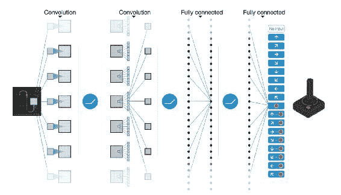

图 1：卷积过程的图示图像来源：Volodymyr Mnih 等。

### 注意

有关更多信息，请参考[《通过深度强化学习进行人类水平控制》](https://storage.googleapis.com/deepmind-media/dqn/DQNNaturePaper.pdf)。

### 循环神经网络

卷积神经网络与一组输入一起工作，这些输入不断改变网络各个层和节点的权重和偏差。 这种方法的一个已知局限性是，在确定如何更改网络的权重和偏差时，其架构会忽略这些输入的顺序。

专门创建了循环神经网络来解决该问题。 RNN 旨在处理顺序数据。 这意味着在每个周期，各层都会受到先前层的输出的影响。 给定序列中的先前观测值的记忆在后验观测值的评估中起作用。

由于该问题的顺序性质，RNN 已在语音识别中成功应用。 此外，它们还用于翻译问题。 Google Translate 当前的算法**转换器**使用 RNN 将文本从一种语言翻译成另一种语言。

### 注意

有关更多信息，请参阅 Jakob Uszkoreit 撰写的[《转换器：一种用于语言理解的新型神经网络架构》](https://research.googleblog.com/2017/08/transformer-novel-neural-network.html)。

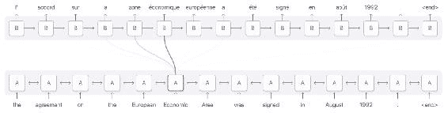

图 2：[来自 distill.pub 的插图](https://distill.pub/2016/augmented-rnns/)。

图 2 根据单词在句子中的位置显示英语单词与法语单词相关。 RNN 在语言翻译问题中非常受欢迎。

长期短期存储网络是为解决消失的梯度问题而创建的 RNN 变体。 逐渐消失的梯度问题是由与当前步骤相距太远的内存组件引起的，并且由于它们的距离而将获得较低的权重。 LSTM 是 RNN 的变体，其中包含一个称为**遗忘门**的内存组件。 该组件可用于评估最新元素和旧元素如何影响权重和偏差，具体取决于观察值在序列中的位置。

### 注意

有关更多详细信息，请参见 1997 年 Sepp Hochreiter 和 JürgenSchmidhuber 首次引入 LSTM 架构。当前的实现已进行了一些修改。 有关 LSTM 每个组件如何工作的详细数学解释，我们建议克里斯托弗·奥拉（Christopher Olah）于 2015 年 8 月发表的文章[《了解 LSTM 网络》](http://colah.github.io/posts/2015-08-Understanding-LSTMs/)。

### 生成对抗网络

**生成对抗网络**（**GAN**）由蒙特利尔大学的 Ian Goodfellow 和他的同事于 2014 年发明。 GAN 提出，与其拥有一个优化权重和偏向以最小化其误差为目标的神经网络，不如两个神经网络为此目的相互竞争。

### 注意

有关更多详细信息，请参见 Ian Goodfellow 等人的[《生成对抗网络》](https://arxiv.org/abs/1406.2661)。

GAN 具有生成新数据（即“伪”数据）的网络和评估由第一个网络生成的数据为真实或“伪”数据的可能性的网络。 他们之所以竞争是因为两者都学到了：一种学习如何更好地生成“伪”数据，另一种学习如何区分所呈现的数据是否真实。 它们在每个周期都进行迭代，直到它们都收敛为止。 这就是评估生成的数据的网络无法再区分“伪数据”和真实数据的时候。

GAN 已成功用于数据具有清晰拓扑结构的领域。 它的原始实现使用 GAN 来创建对象，人脸和动物的合成图像，这些图像类似于这些东西的真实图像。 GAN 是最常使用图像创建的领域，但是研究论文中偶尔会出现其他领域的应用。

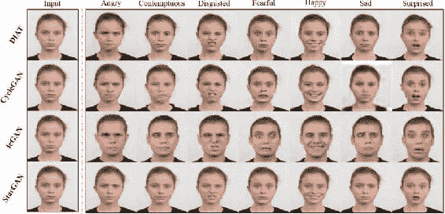

图 3：该图像显示了不同 GAN 算法根据给定的情感来改变人脸的结果。 资料来源：[StarGAN 项目](https://github.com/yunjey/StarGAN)。

### 深度强化学习

原始 DRL 架构受到总部位于英国的 Google 拥有的人工智能研究组织 DeepMind 的支持。 DRL 网络的关键思想是，它们本质上不受监督，可以从试错中学习，仅针对奖励函数进行优化。 也就是说，与其他网络（使用监督方法来优化预测的错误程度（与已知的正确方法相比）不同）相比，DRL 网络并不知道正确的解决问题的方法。 它们只是被赋予系统规则，然后在每次正确执行功能时得到奖励。 这个过程需要大量的迭代，最终会训练网络使其在许多任务中脱颖而出。

### 注意

有关更多信息，请参阅[《通过深度强化学习进行人类水平控制》](https://storage.googleapis.com/deepmind-media/dqn/DQNNaturePaper.pdf)。

在 DeepMind 创建 AlphaGo 之后，深度强化学习（DRL）模型获得了普及，AlphaGo 是一种玩 Go 游戏的系统，其表现优于专业玩家。 DeepMind 还创建了 DRL 网络，该网络完全依靠自己来学习如何以超人的水平玩视频游戏：

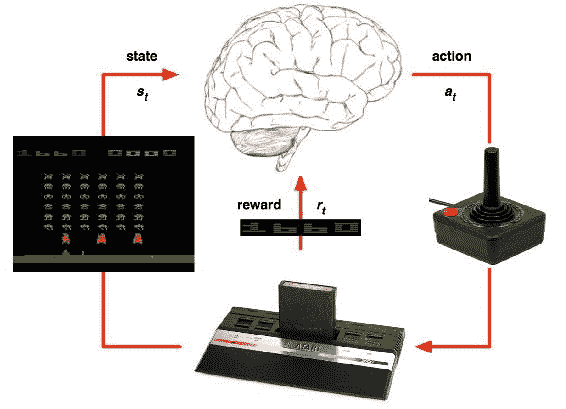

图 4：代表 DQN 算法工作原理的图像

### 注意

有关更多信息，请参阅 DeepMind 创建的 DQN，以击败 Atari 游戏。 该算法使用深度强化学习解决方案来不断增加其奖励。 [图片来源](https://keon.io/deep-q-learning/)。

| 架构 | 数据结构 | 成功的应用 |
| --- | --- | --- |
| 卷积神经网络（CNN） | 网格状的拓扑结构（即图像） | 图像识别与分类 |
| 循环神经网络（RNN）和长短期记忆（LSTM）网络 | 顺序数据（即时间序列数据） | 语音识别，文本生成和翻译 |
| 生成对抗网络（GAN） | 网格状的拓扑结构（即图像） | 图像生成 |
| 深度强化学习（DRL） | 规则明确，奖励函数明确的系统 | 玩电子游戏和自动驾驶汽车 |

> 表 1：不同的神经网络架构已在不同领域取得成功。 网络的架构通常与当前问题的结构有关。

## 数据标准化

在建立深度学习模型之前，还需要采取以下步骤：数据规范化。

数据规范化是机器学习系统中的常见做法。 特别是在神经网络方面，研究人员提出，归一化是训练 RNN（和 LSTM）的一项必不可少的技术，主要是因为它减少了网络的训练时间并提高了网络的整体表现。

### 注意

有关更多信息，请参考 Sergey Ioffe 等人的[《批量归一化：通过减少内部协变量偏移来加速深度网络训练》](https://arxiv.org/abs/1502.03167)。

根据数据和手头的问题，对进行归一化技术的决定会有所不同。 通常使用以下技术。

### Z 得分

当数据以呈正态分布（即高斯）时，可以将每个观测值之间的距离计算为与其平均值的标准差。 当标识数据点与分布中更可能出现的地方相距多远时，此规范化很有用。 Z 分数定义为：

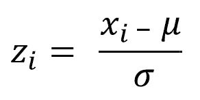

此处，`x[i]`是第`i`个观察值，`μ`是平均值，而`σ`是序列的标准差。

### 注意

有关更多信息，请参阅[维基百科的标准评分（Z 评分）文章](https://en.wikipedia.org/wiki/Standard_score)。

### 点相对归一化

此归一化计算给定观测值与序列的第一个观测值的差。 这种规范化对于识别与起点有关的趋势很有用。 点相对归一化定义为：

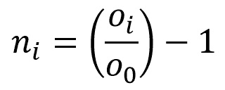

在此，`o[i]`是第`i`个观测值，`o[0]`是该序列的第一个观测值。

### 注意

正如 Siraj Raval 在视频中建议的，[《如何轻松预测股票价格 - 深度学习入门 7》](https://www.youtube.com/watch?v=ftMq5ps503w)，可在 YouTube 上找到。

### 最大最小归一化

此归一化计算给定观察值与序列的最大值和最小值之间的距离。 当使用序列时，此最大值很有用，在该序列中，最大值和最小值不是离群值，并且对于将来的预测很重要。 此规范化技术可以应用于：

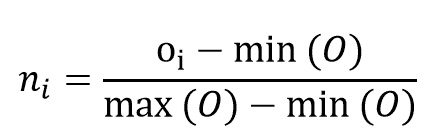

在这里，`o[i]`是第`i`个观测值，`O`表示具有所有`0`值的向量，并且函数` min(O)`和`max(O)`分别表示该序列的最小值和最大值。

在“活动 3”，“探索比特币数据集并为模型准备数据”中，我们将准备可用的比特币数据以用于我们的 LSTM 模式。 其中包括选择感兴趣的变量，选择相关时段并应用先前的点相对归一化技术。

## 解决问题

与研究人员相比，从业人员在启动新的深度学习项目时花费更少的时间来确定选择哪种架构。 在开发这些系统时，最重要的考虑因素是正确获取代表给定问题的数据，其次是了解数据集的固有偏差和局限性。

在开始开发深度学习系统时，请考虑以下问题以进行反思：

*   **我有正确的数据吗？** 这是训练深度学习模型时最困难的挑战。 首先，用数学规则定义问题。 使用精确的定义并按类别（分类问题）或连续规模（回归问题）组织问题。 现在，您如何收集有关这些指标的数据？
*   **我有足够的数据吗？** 通常，深度学习算法在大型数据集中表现出比在小型数据集中更好的表现。 了解训练高性能算法所需的数据量取决于您要解决的问题类型，但目的是要收集尽可能多的数据。
*   **我可以使用预训练的模型吗？** 如果您要解决的问题是更一般的应用的子集（但在同一领域内），请考虑使用预训练的模型。 预训练的模型可以让您抢先解决特定问题的模式，而不是整个领域的更一般特征。 [正式的 TensorFlow 仓库](https://github.com/tensorflow/models)是一个不错的起点。


图 5：在深度学习项目开始时要做出的关键思考问题的决策树

在某些情况下，可能根本无法获得数据。 根据情况，可能可以使用一系列技术从输入数据中有效创建更多数据。 此过程称为**数据扩充**，在处理图像识别问题时已成功应用。

### 注意

很好的参考是文章[《使用深度神经网络对浮游生物进行分类》](http://benanne.github.io/2015/03/17/plankton.html)。 作者展示了一系列用于增强少量图像数据以增加模型具有的训练样本数量的技术。

## 活动 3 – 探索比特币数据集并为模型准备数据

我们将使用最初从 CoinMarketCap 检索的公共数据集，该数据是一个流行的网站，跟踪不同的加密货币统计数据。 数据集已在本课程中提供，并将在本书的其余部分中使用。

我们将使用 Jupyter 笔记本探索数据集。 Jupyter 笔记本通过网络浏览器提供 Python 会话，使您可以交互地处理数据。 它们是用于探索数据集的流行工具。 在本书的所有活动中都将使用它们。

使用您的终端，导航到目录`lesson_2/activity_3`并执行以下命令以启动 Jupyter 笔记本实例：

```py
$ jupyter notebook
```

现在，在浏览器中打开应用提供的 URL。 您应该能够看到 Jupyter 笔记本页面，其中包含文件系统中的许多目录。

您应该看到以下输出：

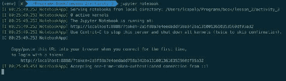

图 6：启动 Jupyter 笔记本实例后的终端镜像。 导航到浏览器中显示的 URL，您应该能够看到 Jupyter 笔记本登陆页面。

现在，导航至目录，然后单击文件`Activity_3_Exploring_Bitcoin_Dataset.ipynb`。 这是一个 Jupyter 笔记本文件，将在新的浏览器选项卡中打开。 该应用将自动为您启动一个新的 Python 交互式会话。

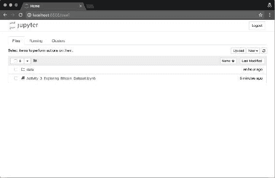

图 7：Jupyter 笔记本实例的登录页面

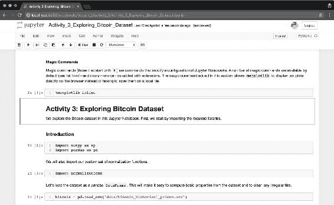

图 8：笔记本的图像`Activity_3_Exploring_Bitcoin_Dataset.ipynb`。 您现在可以与该笔记本进行交互并进行修改。

在打开我们的 Jupyter 笔记本电脑之后，现在让我们探索本课程提供的比特币数据。

数据集`data/bitcoin_historical_prices.csv`包含自 2013 年初以来比特币价格的度量。最近的观察是在 2017 年 11 月，该数据集来自每日更新的在线服务 CoinMarketCap。 它包含八个变量，其中两个（`date`和`week`）描述数据的时间段（可以用作索引），另外六个变量（`open`，`high`，`low`，`close`，`volume`和`market_capitalization`），可用于了解比特币的价格和价值如何随时间变化：

| 变量 | 描述 |
| --- | --- |
| `date` | 观察日期。 |
| `iso_week` | 给定年份的星期数。 |
| `open` | 单个比特币硬币的开盘价值。 |
| `high` | 在给定的一天时间内实现的最高价值。 |
| `low` | 在给定的一天内实现的最低价值。 |
| `close` | 交易日结束时的价值。 |
| `volume` | 当天交换的比特币总量。 |
| `market_capitalization` | 市值，由`市值 = 价格 * 循环供给`来解释。 |

> 表 2：比特币历史价格数据集中的可用变量（即列）

现在使用打开的 Jupyter 笔记本实例，我们探索其中两个变量的时间序列：`close`和`volume`。 我们将从这些时间序列开始探讨价格波动模式。

导航到 Jupyter 笔记本`Activity_3_Exploring_Bitcoin_Dataset.ipynb`的打开的实例。 现在，执行标题`Introduction`下的所有单元格。 这将导入所需的库并将数据集导入内存。

将数据集导入内存后，移至`Exploration`部分。 您将找到一个代码片段，该代码片段为`close`变量生成时间序列图。 您可以为`volume`变量生成相同的图吗？

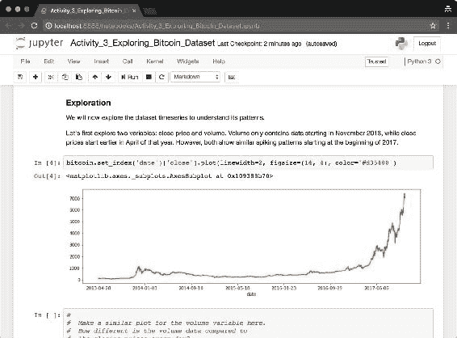

图 9：来自`close`变量的比特币收盘价的时间序列图。 重现此图，但在此图下面的新单元格中使用`volume`变量。

您肯定会注意到这两个变量在 2017 年都在激增。这反映了当前的现象，即比特币的价格和价值自该年年初以来一直在持续增长。

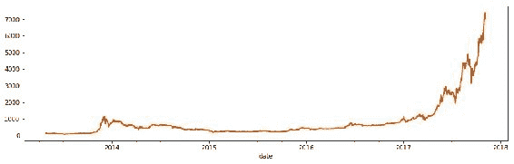

图 10：以美元计的比特币硬币的收盘价。 请注意，2013 年底和 2014 年初出现了早期的飙升。此外，请注意，自 2017 年初以来，最近的价格已飙升。

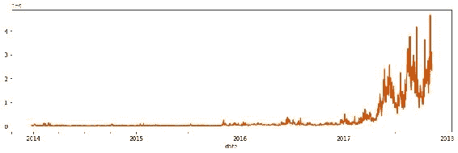

图 11：比特币硬币的交易量（以美元为单位）显示，从 2017 年开始，趋势开始了，市场上交易的比特币数量明显增加。 每日总交易量的变化远大于每日收盘价。

此外，我们注意到，多年来，比特币价格的波动幅度不如近年来。 尽管这些时间段可以被神经网络用来理解某些模式，但是我们将排除较早的观察结果，因为我们有兴趣预测不太遥远的周期的未来价格。 让我们仅过滤 2016 年和 2017 年的数据。

导航至，“为模型准备数据集”部分。 我们将使用`pandas` API 过滤 2016 年和 2017 年的数据。Pandas 提供了直观的 API 来执行此操作：

```py
bitcoin_recent = bitcoin[bitcoin['date'] >= '2016-01-01']
```

变量`bitcoin_recent`现在具有我们原始比特币数据集的副本，但已过滤为更新或等于 2016 年 1 月 1 日的观测值。

作为最后一步，我们现在使用“数据归一化”部分中介绍的点相对归一化技术对数据进行归一化。 我们将仅归一化两个变量（`close`和`volume`），因为这是我们正在努力预测的变量。

在包含本课程的同一目录中，我们放置了一个名为`normalizations.py`的脚本。 该脚本包含本课中描述的三种标准化技术。 我们将该脚本导入到 Jupyter 笔记本中，并将这些功能应用于我们的序列。

导航到“为模型准备数据集”部分。 现在，使用`iso_week`变量使用 pandas 方法`groupby()`将给定一周中的全天观察分组。 现在，我们可以在一周内将归一化函数`normalizations.point_relative_normalization()`直接应用于该序列。 我们使用以下命令将该归一化的输出存储为同一 Pandas 数据帧中的新变量：

```py
bitcoin_recent['close_point_relative_normalization'] =
bitcoin_recent.groupby('iso_week')['close'].apply(
lambda x: normalizations.point_relative_normalization(x))
```

现在，变量`close_point_relative_normalization`包含变量`close`的规范化数据。 对变量`volume`执行相同的操作：


图 12：Jupyter 笔记本的图像，重点是应用归一化函数的部分

标准化的`close`变量每周包含一个有趣的方差模式。 我们将使用该变量来训练我们的 LSTM 模型。

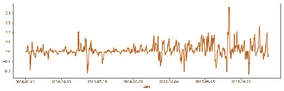

图 13：显示归一化变量`close_point_relative_normalization`的序列的图

为了评估模型的效果，我们需要对照其他数据测试其准确率。 为此，我们创建了两个数据集：训练集和测试集。 在本活动中，我们将使用 80% 的数据集训练 LSTM 模型，并使用 20% 的数据评估其表现。

鉴于数据是连续的并且采用时间序列的形式，我们将可用周的最后 20% 用作测试集，并将前 80% 用作训练集：

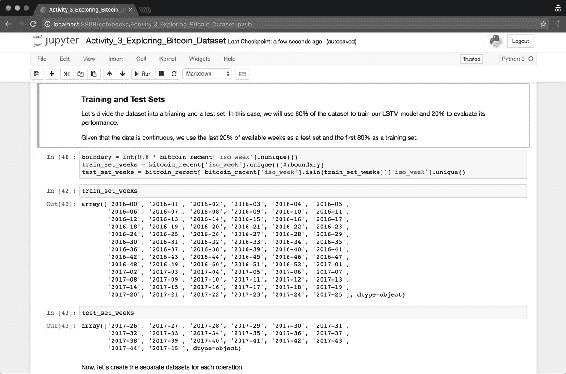

图 14：使用几周来创建训练和测试集

最后，将导航到`Storing Output`部分，并将过滤后的变量保存到磁盘，如下所示：

```py
test_dataset.to_csv('data/test_dataset.csv', index=False)
train_dataset.to_csv('data/train_dataset.csv', index=False)
bitcoin_recent.to_csv('data/bitcoin_recent.csv', index=False)
```

### 注意

对于参考解决方案，请使用`Code/Lesson-2/activity_3`文件夹。

在本节中，我们探索了比特币数据集，并将其准备好用于深度学习模型。

我们了解到，在 2017 年期间，比特币的价格飞涨。 这种现象需要很长时间才能发生-并可能受此数据无法单独解释的许多外部因素的影响（例如，其他加密货币的出现）。 我们还使用点相对归一化技术按周块处理比特币数据集。 我们这样做是为了训练 LSTM 网络来学习比特币价格每周变化的模式，从而可以预测未来整整一周的时间。

但是，比特币统计数据显示每周都有重大波动。 我们可以预测未来的比特币价格吗？ 从现在开始的 7 天里，这些价格将是多少？ 我们将在下一部分中使用 Keras 构建一个深度学习模型来探讨这个问题。

# 使用 Keras 作为 TensorFlow 接口

本节重点介绍 Keras。 我们之所以使用 Keras，是因为它将 TensorFlow 接口简化为通用抽象。 在后端，计算仍然在 TensorFlow 中执行，并且仍然使用 TensorFlow 组件构建图，但是接口要简单得多。 我们花费较少的时间来担心诸如变量和运算之类的各个组件，而花费更多的时间将网络构建为计算单元。 Keras 使您可以轻松地尝试不同的架构和超参数，从而更快地向高性能解决方案迈进。

从 TensorFlow 1.4.0（2017 年 11 月）开始，Keras 现在以 TensorFlow 作为`tf.keras`正式发行。 这表明 Keras 现在已经与 TensorFlow 紧密集成，并且很可能会在很长一段时间内继续作为开源工具进行开发。

## 模型组件

正如我们在“第 1 课”，“神经网络和深度学习简介”中看到的那样，LSTM 网络也具有输入，隐藏和输出层。 每个隐藏层都有一个激活函数，用于评估该层的相关权重和偏差。 正如预期的那样，网络将数据从一层顺序移到另一层，并在每次迭代（即一个周期）时通过输出评估结果。

Keras 提供了直观的类来表示这些组件中的每个组件：

| 组件 | Keras 类 |
| --- | --- |
| 完整的顺序神经网络的高级抽象。 | `keras.models.Sequential()` |
| 密集的全连接层。 | `keras.layers.core.Dense()` |
| 激活函数。 | `keras.layers.core.Activation()` |
| LSTM 循环神经网络。 此类包含此架构专有的组件，其中大多数由 Keras 抽象。 | `keras.layers.recurrent.LSTM()` |

> 表 3：Keras API 中的关键组件说明。 我们将使用这些组件来构建深度学习模型。

Keras 的`keras.models.Sequential()`组件代表整个顺序的神经网络。 可以单独实例化该 Python 类，然后再添加其他组件。

我们对构建 LSTM 网络感兴趣，因为这些网络在使用顺序数据时表现良好，而时间序列是一种顺序数据。 使用 Keras，完整的 LSTM 网络将实现如下：

```py
from keras.models import Sequential
from keras.layers.recurrent import LSTM
from keras.layers.core import Dense, Activation

model = Sequential()

model.add(LSTM(
units=number_of_periods,
input_shape=(period_length, number_of_periods)
return_sequences=False), stateful=True)

model.add(Dense(units=period_length))

model.add(Activation("linear"))
model.compile(loss="mse", optimizer="rmsprop")
```

> 片段 1：使用 Keras 的 LSTM 实现

此实现将在“第 3 课”，“模型评估和优化”中进一步优化。

Keras 抽象允许人们专注于使深度学习系统更具表现的关键元素：正确的组件顺序，要包含的层和节点的数量以及要使用的激活函数。 所有这些选择都取决于将组件添加到实例化的`keras.models.Sequential()`类的顺序或通过传递给每个组件实例化的参数（即`Activation("linear")`）确定的。 最后的`model.compile()`步骤使用 TensorFlow 组件构建神经网络。

建立网络后，我们使用`model.fit()`方法训练网络。 这将产生一个经过训练的模型，可用于进行预测：

```py
model.fit(
X_train, Y_train,
batch_size=32, epochs=epochs)
```

> “代码段 2.1”：`model.fit()`的用法

变量`X_train`和`Y_train`分别是用于训练的集合和用于评估损失函数（即测试网络预测数据的能力）的较小集合。

最后，我们可以使用`model.predict()`方法进行预测：

```py
model.predict(x=X_train)
```

> “代码段 2.2”：`model.predict()`的用法

前面的步骤介绍了使用神经网络的 Keras 范例。 尽管可以用非常不同的方式处理不同的架构，但是 Keras 通过使用以下三个组件简化了使用不同架构的接口：网络架构，适应性和预测性：

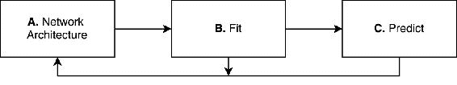

图 15：Keras 神经网络范例：A. 设计神经网络架构，B. 训练神经网络（或拟合），以及 C. 进行预测

Keras 允许在每个步骤中进行更大的控制。 但是，其重点是使用户在尽可能短的时间内尽可能轻松地创建神经网络。 这意味着我们可以从一个简单的模型开始，然后在上述每个步骤中增加复杂性，以使初始模型的表现更好。

在即将进行的活动和课程中，我们将利用该范例。 在下一个活动中，我们将创建最简单的 LSTM 网络。 然后，在“第 3 课”，“模型评估和优化”中，我们将不断评估和更改该网络，以使其更加健壮和高效。

## 活动 4 – 使用 Keras 创建 TensorFlow 模型

在此活动中，我们将使用 Keras 创建一个 LSTM 模型。

Keras 用作较低级程序的接口； 在这种情况下，使用 TensorFlow。 当我们使用 Keras 设计神经网络时，该神经网络被*编译为* TensorFlow 计算图。

导航到 Jupyter 笔记本`Activity_4_Creating_a_TensorFlow_Model_Using_Keras.ipynb`的打开的实例。 现在，执行标题**构建模型**下的所有单元格。 在该部分中，我们建立第一个参数化两个值的 LSTM 模型：训练观察的输入大小（一天相当于 1 个值）和预测期间的输出大小（在我们的情况下为 7 天）：

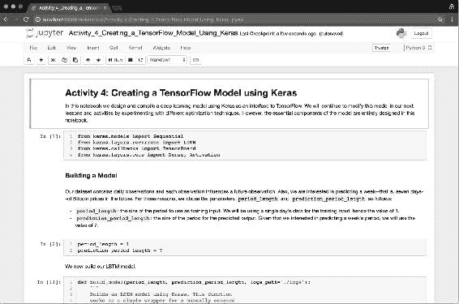

图 16：来自 Jupyter 笔记本实例的图像，我们在其中构建了 LSTM 模型的第一个版本

使用 Jupyter 笔记本`Activity_4_Creating_a_TensorFlow_Model_Using_Keras.ipynb`从“模型组件”部分构建相同的模型，对输入和输出的周期长度进行参数设置，以便进行实验。

编译模型后，我们将其作为`h5`文件存储在磁盘上。 优良作法是偶尔将模型的版本存储在磁盘上，以便将模型架构的版本与预测特征一起保留。

仍在同一 Jupyter 笔记本的上，导航至标题**保存模型**。 在该部分中，我们将使用以下命令将模型存储为磁盘上的文件：

```py
model.save('bitcoin_lstm_v0.h5')
```

模型`'bitcoin_lstm_v0.h5'`尚未训练。 如果在没有事先训练的情况下保存模型，则只能有效地保存模型的架构。 稍后可以使用 Keras 的`load_model()`函数来加载相同的模型，如下所示：

```py
1  model = keras.models.load_model('bitcoin_lstm_v0.h5')
```

### 注意

加载 Keras 库时，您可能会遇到以下警告：

```py
    Using TensorFlow backend.
```

可以将 Keras 配置为使用其他后端而不是 TensorFlow（即 Theano）。 为了避免出现此消息，您可以创建一个名为`keras.json`的文件并在那里配置其后端。 该文件的正确配置取决于您的系统。 因此，建议您访问 [Keras 官方文档](https://keras.io/backend/)。

### 注意

对于参考解决方案，请使用`Code/Lesson-2/activity_4`文件夹。

在本部分中，我们学习了如何使用 TensorFlow 的接口 Keras 构建深度学习模型。 我们研究了 Keras 的核心组件，并使用这些组件构建了基于 LSTM 模型的比特币价格预测系统的第一版。

在下一节中，我们将讨论如何将本课中的所有组件整合到一个（几乎完整的）深度学习系统中。 该系统将产生我们最初的预测，作为未来改进的起点。

# 从数据准备到建模

本节重点介绍深度学习系统的实现方面。 我们将使用“选择正确的模型架构”中的比特币数据和 Keras 知识，并使用 Keras 作为 TensorFlow 接口将这两个组件组合在一起。 本节通过构建一个从磁盘读取数据并将其作为单个软件馈入模型的系统来结束本课程。

## 训练神经网络

神经网络可能需要很长时间才能训练。 许多因素影响该过程可能需要多长时间。 其中，三个因素通常被认为是最重要的：

*   网络架构
*   网络有多少层和神经元
*   训练过程中将使用多少数据

其他因素也可能极大地影响网络训练所需的时间，但是神经网络在解决业务问题时可以进行的大多数优化来自探索这三个方面。

我们将使用上一节中的归一化数据。 回想一下，我们已将训练数据存储在名为`train_dataset.csv`的文件中。 我们将使用`pandas`将数据集加载到内存中，以方便探索：

```py
  import pandas as pd
   train = pd.read_csv('data/train_dataset.csv')
```

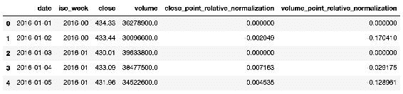

图 17：该表显示了从`train_d–ataset.csv`文件加载的训练数据集的前五行

自 2016 年初以来，我们将使用变量`close_point_relative_normalization`的序列，该序列是变量`close`的归一化比特币收盘价序列。

变量`close_point_relative_normalization`已每周标准化。 该周的周期的每个观察值都是相对于该周期第一天收盘价的差额进行的。 标准化步骤很重要，将有助于我们的网络训练更快。


> 图 18：显示归一化变量`close_point_relative_normalization`的序列的图。 此变量将用于训练我们的 LSTM 模型。

### 重塑时间序列数据

神经网络通常使用向量和张量，这两个数学对象都可以在多个维度上组织数据。 用 Keras 实现的每个神经网络都将具有根据规范进行组织的向量或张量作为输入。 首先，了解如何将数据重整为给定层所需的格式可能会造成混淆。 为避免混淆，建议从尽可能少的组件开始，然后逐渐添加组件。 Keras 的官方文档（在“层”部分下）对于了解每种层的要求至关重要。

### 注意

可在[这个页面](https://keras.io/layers/core/)上获得 Keras 官方文档。 该链接直接将您带到“层”部分。

### 注意

`NumPy`是一个流行的 Python 库，用于执行数值计算。 深度学习社区使用它来操纵向量和张量，并为深度学习系统做好准备。

特别是，在为深度学习模型调整数据时，`numpy.reshape()`方法非常重要。 该模型允许对`NumPy`数组进行操作，这是类似于向量和张量的 Python 对象。

现在，我们使用 2016 年和 2017 年的星期来组织变量`close_point_relative_normalization`的价格。我们创建不同的组，每个组包含七个观测值（一周中的每一天），共 77 个完整星期。 我们之所以这样做，是因为我们有兴趣预测一周交易量的价格。

### 注意

我们使用 ISO 标准来确定一周的开始和结束。 其他类型的组织也是完全可能的。 遵循此方法既简单又直观，但是仍有改进的空间。

LSTM 网络使用三维张量。 这些维度中的每一个都代表了网络的一项重要属性。 这些大小是：

*   **周期长度**：周期长度，即，一个周期中有多少个观测值
*   **周期数**：数据集中有多少个周期可用
*   **特征数量**：数据集中可用的特征数量

目前，来自变量`close_point_relative_normalization`的数据是一维向量，我们需要对其进行重塑以匹配这三个维度。

我们将以一周的时间为。 因此，我们的周期长度为 7 天（周期长度为 7）。 我们的数据中有 77 个完整的星期可用。 在训练期间，我们将使用这周的最后一周来测试我们的模型。 这给我们留下了 76 个不同的星期（周期数为 76）。 最后，我们将在此网络中使用单个特征（特征数量为 1）-将来的版本中将包含更多特征。

我们如何重塑数据以匹配这些维度？ 我们将结合使用基本的 Python 属性和`numpy`库中的`reshape()`。 首先，我们使用纯 Python 创建 76 个不同的星期组，每个星期 7 天：

```py
group_size = 7
samples = list()
for i in range(0, len(data), group_size):
sample = list(data[i:i + group_size])
if len(sample) == group_size:
samples.append(np.array(sample).reshape(group_size, 1).tolist())

data = np.array(samples)
```

> “代码段 3”：创建不同星期组的 Python 代码段

结果变量`data`是包含所有正确大小的变量。 Keras LSTM 层期望这些维度以特定的顺序进行组织：特征数量，观测数量和周期长度。 让我们重塑数据集以匹配该格式：

```py
X_train = data[:-1,:].reshape(1, 76, 7)
Y_validation = data[-1].reshape(1, 7)
```

> “代码段 5”：代码段显示了如何训练我们的模型

### 注意

每个 Keras 层都希望以特定方式组织其输入。 但是，在大多数情况下，Keras 将相应地重塑数据。 在添加新层或遇到层形状问题时，请始终参阅层上的 [Keras 文档](https://keras.io/layers/core/)。

“代码段 4”也选择我们集合的最后一周作为验证集合（通过`data[-1]`）。 我们将尝试使用前 76 周来预测数据集中的最后一周。

下一步是使用这些变量来拟合我们的模型：

```py
  model.fit(x=X_train, y=Y_validation, epochs=100)
```

LSTM 是计算上昂贵的模型。 在现代计算机上，我们最多可能需要五分钟来训练我们的数据集。 当算法创建完整的计算图时，该时间中的大部分都花在了计算的开始。 开始训练后，该过程将加快速度：

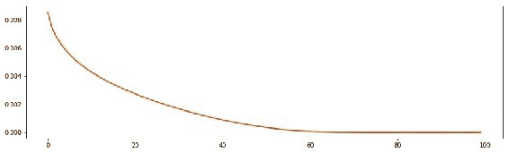

图 19：该图显示了每个周期评估的损失函数的结果

### 注意

这将比较模型在每个周期预测的结果，然后使用称为均方误差的技术将其与实际数据进行比较。 该图显示了这些结果。

乍一看，我们的网络运行情况非常好：它以很小的错误率开始，并不断降低。 现在，我们的预测告诉我们什么？

## 做出预测

在训练好网络之后，我们现在可以进行预测了。 我们将对超出时段的未来一周进行预测。

一旦我们用`model.fit(),`训练了我们的模型，做出预测就变得微不足道了：

```py
  model.predict(x=X_train)
```

> “代码段 6”：使用我们之前用于训练的数据进行预测

我们使用与用于训练的数据（`X_train`变量）相同的数据进行预测。 如果有更多可用数据，则可以改用 LSTM 要求的格式，而可以改用它。

### 过拟合

当神经网络过度适合于验证集时，意味着它会学习训练集中存在的模式，但无法将其推广到看不见的数据（例如测试集）。 在下一课中，我们将学习如何避免过拟合，并创建一个系统来评估我们的网络并提高其表现：

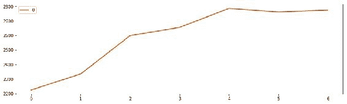

图 20：归一化后，我们的 LSTM 模型预测，到 2017 年 7 月下旬，比特币的价格将从 2200 美元增加到大约 2800 美元，一周内增长 30% 

## 活动 5 – 组装深度学习系统

在本活动中，我们将构建基本的深度学习系统的所有基本特征汇总在一起：数据，模型和预测。

我们将继续使用 Jupyter 笔记本，并将使用之前练习中准备的数据（`data/train_dataset.csv`）和我们本地存储的模型（`bitcoin_lstm_v0.h5`）。

1.  启动 Jupyter 笔记本实例后，导航到名为`Activity_5_Assembling_a_Deep_Learning_System.ipynb`的笔记本并打开它。 执行标题中的单元以加载所需的组件，然后导航至标题`Shaping Data`:

    

    图 21：显示归一化变量`close_point_relative_normalization`的序列的图

    ### 注意

    `close_point_relative_normalization`变量将用于训练我们的 LSTM 模型。

    我们将通过加载先前活动中准备的数据集来开始。 我们使用`pandas`将数据集加载到内存中。

2.  使用 Pandas 将训练数据集加载到内存中，如下所示：

    ```py
    train = pd.read_csv('data/train_dataset.csv')
    ```

3.  现在，通过执行以下命令快速检查数据集：

    ```py
    train.head()
    ```

    如本课程中所述，LSTM 网络需要具有三个维度的张量。 这些维度是：周期长度，周期数和特征数。

    现在，继续创建每周组，然后重新排列结果数组以匹配这些大小。

4.  随时使用提供的函数`create_groups()`执行此操作：

    ```py
    create_groups(data=train, group_size=7)
    ```

    该函数的默认值为 7 天。 如果将该数字更改为其他值（例如 10），会发生什么情况？

    现在，确保将数据分为两组：训练和验证。 为此，我们将比特币价格数据集中的最后一周分配给评估集。 然后，我们训练网络对上周进行评估。

    分开训练数据的最后一周，并使用`numpy.reshape()`对其进行调整。 重塑很重要，因为 LSTM 模型仅接受以这种方式组织的数据：

    ```py
    X_train = data[:-1,:].reshape(1, 76, 7)
    Y_validation = data[-1].reshape(1, 7)
    ```

    现在我们的数据已准备好用于训练。 现在，我们加载先前保存的模型，并以给定的周期数对其进行训练。

5.  导航至标题**加载我们的模型**并加载我们先前训练过的模型：

    ```py
    model = load_model('bitcoin_lstm_v0.h5')
    ```

6.  现在，使用我们的训练数据`X_train`和`Y_validation`训练模型：

    ```py
    history = model.fit(
    x=X_train, y=Y_validation,
    batch_size=32, epochs=100)
    ```

    注意，我们将模型的日志存储在名为`history`的变量中。 模型日志对于探索训练精度的特定变化以及了解损失函数的执行情况非常有用：

    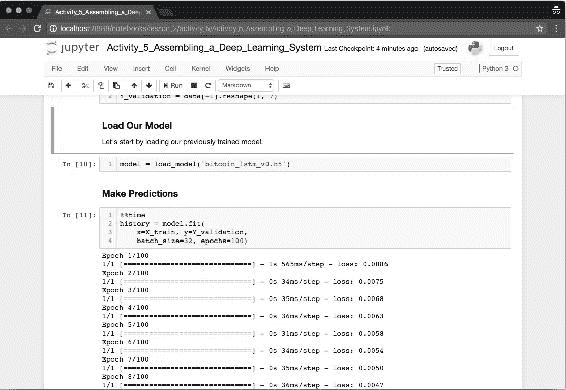

    图 22：Jupyter 笔记本的部分，我们在其中加载早期模型并使用新数据进行训练

    最后，让用我们训练有素的模型进行预测。

7.  使用相同的数据`X_train`，调用以下方法：

    ```py
    model.predict(x=X_train)
    ```

8.  该模型会立即返回标准化值列表以及接下来 7 天的预测。 使用`denormalize()`函数将数据转换为美元值。 使用可用的最新值作为缩放预测结果的参考：

    ```py
    denormalized_prediction = denormalize(predictions, last_weeks_value)
    ```

    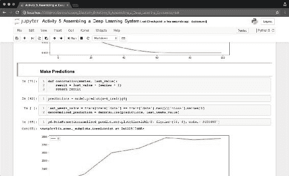

    图 23：Jupyter 笔记本部分，我们在其中预测了未来 7 天的比特币价格。 我们的预测表明价格将大幅上涨约 30%。

    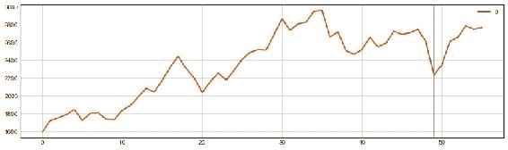

    图 24：使用我们刚刚建立的 LSTM 模型预测未来 7 天的比特币价格

    ### 注意

    我们在此图中组合了两个时间序列：实际数据（在行之前）和预测数据（在行之后）。 该模型显示出与之前看到的模式相似的方差，并且表明接下来的 7 天之内价格上涨。

9.  完成实验后，请使用以下命令保存模型：

    ```py
    model.save('bitcoin_lstm_v0_trained.h5')
    ```

    我们将保存此训练有素的网络以供将来参考，并将其表现与其他模型进行比较。

    网络可能已经从我们的数据中学到了模式，但是如何用如此简单的架构和很少的数据来做到这一点呢？ LSTM 是用于从数据中学习模式的强大工具。 但是，我们将在接下来的课程中学习到，他们也可能遭受*过拟合*的困扰，这是神经网络中常见的一种现象，他们会从训练数据中学习模式，这些模式在预测实际模式时无用 。 我们将学习如何处理该问题以及如何改进我们的网络以做出有用的预测。

    ### 注意

    对于参考解决方案，请使用`Code/Lesson-2/activity_5`文件夹。

# 总结

在本课程中，我们组装了一个完整的深度学习系统：从数据到预测。 在本活动中创建的模型必须加以大量改进，才能被认为有用。 但是，它是我们不断改进的一个很好的起点。

我们的下一课将探讨用于衡量模型表现的技术，并将继续进行修改，直到获得一个既有用又健壮的模型。