# 三、模型评估和优化

本课程侧重于如何评估神经网络模型。 与使用其他模型不同，在使用神经网络时，我们修改了网络的*超参数*以提高其表现。 但是，在更改任何参数之前，我们需要测量模型的表现。

# 课程目标

在本课程中，您将：

*   评估模型

    *   探索神经网络解决的问题类型
    *   探索损失函数，准确率和错误率
    *   使用 TensorBoard
    *   评估指标和技术

*   超参数优化

    *   添加层和节点
    *   探索并添加周期
    *   实现激活函数
    *   使用正则化策略

# 模型评估

在机器学习中，定义两个不同的术语是的共同点：**参数**和**超参数**。 参数是影响模型如何根据数据进行预测的属性。 超参数是指模型如何从数据中学习。 可以从数据中学习参数并进行动态修改。 超参数是高级属性，通常不会从数据中学习。 有关更详细的概述，请参阅 Sebastian Raschka 和 Vahid Mirjalili 撰写的书《Python 机器学习》。

## 问题类别

通常，神经网络可以解决两类问题：分类和回归。 分类问题涉及根据数据对正确类别的预测； 例如，如果温度为*热*或*冷*。 回归问题与连续标量中值的预测有关。 例如，实际温度值是多少？

这两个类别中的问题具有以下特性：

*   **分类**：以类别为特征的问题。 类别可以不同，也可以不同。 它们也可能是关于二进制问题的。 但是，必须将它们明确分配给每个数据元素。 分类问题的一个示例是使用卷积神经网络将标签*汽车*或*非汽车*分配给图像。 “第 1 课”，“神经网络和深度学习简介”中探讨的 MNIST 示例是分类问题的另一个示例。
*   **回归**：以连续变量（即标量）为特征的问题。 这些问题的测量范围是，其评估考虑的是网络与实际值的接近程度。 一个示例是时间序列分类问题，其中使用循环神经网络预测未来温度值。 比特币价格预测问题是回归问题的另一个示例。

虽然对于这两个问题类别，评估这些模型的总体结构是相同的，但我们采用了不同的技术来评估模型的表现。 在以下部分中，我们将探讨用于分类或回归问题的这些技术。

### 注意

本课程中的所有代码段均在“活动 6 和 7”中实现。 随时随地进行，但不要认为它是强制性的，因为在活动期间将对其进行更详细的重复。

## 损失函数，准确率和错误率

神经网络利用函数来测量与验证集相比网络的运行情况，也就是说，一部分数据被分离为，用作训练过程的一部分。 这些函数称为**损失函数**。

损失函数评估神经网络预测的*误差*； 然后他们会将这些误差传播回去并调整网络，从而修改单个神经元的激活方式。 损失函数是神经网络的关键组成部分，选择正确的损失函数可能会对网络的表现产生重大影响。

误差如何传播到网络中的每个神经元？

误差通过称为反向传播的过程传播。 反向传播是一种将损失函数返回的误差传播回神经网络中每个神经元的技术。 传播的误差会影响神经元的激活方式，并最终影响神经网络的输出。

许多神经网络包，包括 Keras，默认情况下都使用此技术。

### 注意

有关反向传播数学的更多信息，请参阅 Ian Goodfellow 等的《深度学习》。

对于回归和分类问题，我们使用不同的损失函数。 对于分类问题，我们使用精度函数（即，预测正确的时间比例）。 对于回归问题，我们使用的错误率（即，预测值与观察值有多接近）。

下表提供了常见损失函数以及它们的常见应用的摘要：

| 问题类型 | 损失函数 | 问题 | 示例 |
| --- | --- | --- | --- |
| 回归 | 均方误差（**MSE**） | 预测连续特征。 即，预测值范围内的值。 | 使用过去的温度测量结果来预测将来的温度。 |
| 回归 | 均方根误差（**RMSE**） | 与前面相同，但处理负值。 RMSE 通常提供更可解释的结果。 | 与前面相同。 |
| 回归 | 平均绝对百分比误差（**MAPE**） | 预测连续特征。 在使用非标准化范围时具有更好的表现。 | 使用产品属性（例如，价格，类型，目标受众，市场条件）预测产品的销售。 |
| 分类 | 二元交叉熵 | 两个类别之间或两个值之间的分类（即`true`或`false`）。 | 根据浏览器的活动预测网站的访问者是男性还是女性。 |
| 分类 | 分类交叉熵 | 一组已知类别中许多类别之间的分类。 | 根据讲英语的口音来预测说话者的国籍。 |

> 表 1：用于分类和回归问题的常见损失函数

对于回归问题，MSE 函数是最常见的选择。 对于分类问题，二元交叉熵（对于二元类别问题）和分类交叉熵（对于多类别问题）是常见的选择。 建议从这些损失函数开始，然后在发展神经网络时尝试其他函数，以期获得表现。

我们在“第 2 课”，“模型架构”中开发的网络使用 MSE 作为其损失函数。 在下一节中，我们将探讨该函数如何在网络训练中发挥作用。

### 不同的损失函数，相同的架构

在进入下一部分之前，让我们以实践的方式探讨这些问题在神经网络环境中的不同之处。

TensorFlow 团队可使用 TensorFlow Playground 应用，以帮助我们了解神经网络的工作原理。 在这里，我们看到了一个由其层表示的神经网络：输入（在左侧），隐藏层（在中间）和输出（在右侧）。 我们还可以选择最左侧的不同样本数据集进行实验。 最后，在最右边，我们看到了网络的输出。

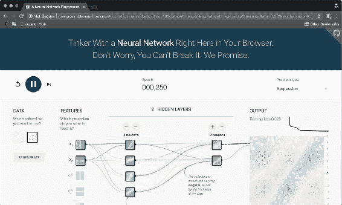

图 1：TensorFlow Playground Web 应用在此可视化中获取神经网络的参数，以直观了解每个参数如何影响模型结果。

应用帮助我们探索了上一节中讨论的不同问题类别。 当我们选择分类作为问题类型（右上角）时，数据集中的点仅用两种颜色值着色：蓝色或橙色。 选择回归时，点的颜色将在橙色和蓝色之间的一系列颜色值中上色。 在处理分类问题时，网络会根据网络出错了多少个蓝色和橙色来评估其损失函数。 在处理分类问题时，它将检查网络每个点距正确的颜色值的距离，如下图所示：

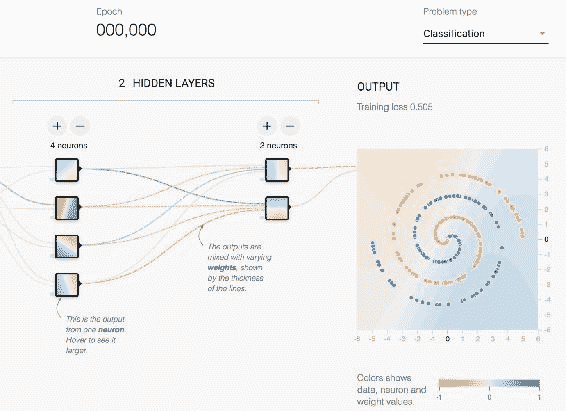

> 图 2：TensorFlow Playground 应用的细节。 根据问题类型，将不同的颜色值分配给点。

在单击播放按钮后，我们注意到**训练损失**区域中的数字随着网络不断训练而不断下降。 在每个问题类别中，数字非常相似，因为损失函数在两个神经网络中都扮演相同的角色。 但是，用于每个类别的实际损失函数是不同的，并且根据问题类型进行选择。

### 使用 TensorBoard

TensorBoard 擅长评估神经网络。 正如“第 1 课”，“神经网络和深度学习简介”中所述，TensorBoard 是 TensorFlow 附带的一套可视化工具。 在中，可以探索每个周期后损失函数评估的结果。 TensorBoard 的一大功能是可以分别组织每个运行的结果，并比较每个运行的结果损失函数指标。 然后，您可以决定要调整哪些超参数，并对网络的运行情况有一个大致的了解。 最好的部分是，这一切都是实时完成的。

为了在我们的模型中使用 TensorBoard，我们将使用 Keras 回调函数。 我们通过导入`TensorBoard`回调并将其传递给我们的模型（在调用`fit()`函数时）来完成此操作。 以下代码显示了如何在上一课中创建的比特币模型中实现该示例：

```py
 from keras.callbacks import TensorBoard
 model_name = 'bitcoin_lstm_v0_run_0'
 tensorboard = TensorBoard(log_dir='./logs/{}'.format(model_name))
 model.fit(x=X_train, y=Y_validate,
 batch_size=1, epochs=100,
 verbose=0, callbacks=[tensorboard])
```

> 片段 1：在我们的 LSTM 模型中实现 TensorBoard 回调的片段

在每个时间段运行结束时调用 Keras 回调函数。 在这种情况下，Keras 调用 TensorBoard 回调以将每次运行的结果存储在磁盘上。 还有许多其他有用的回调函数，其中一个可以使用 Keras API 创建自定义函数。

### 注意

有关更多信息，请参阅 [Keras 回调文档](https://keras.io/callbacks/)。

实现 TensorBoard 回调后，`loss`函数指标现在可在 TensorBoard 接口中使用。 现在，您可以运行 TensorBoard 进程（使用`tensorboard --logdir=./logs`），并在使用`fit()`训练网络时保持运行状态。 要评估的主要图通常称为*损失*。 通过将已知指标传递给`fit()`函数中的`metrics`参数，可以添加更多指标； 这些将可以在 TensorBoard 中用于可视化，但不会用于调整网络权重。 交互式图形将继续实时更新，这使您可以了解每个周期发生的情况。

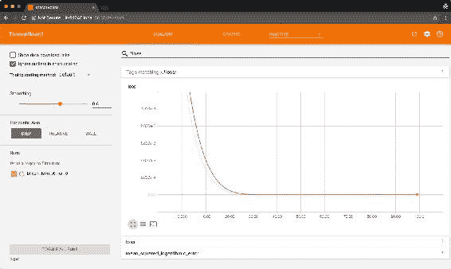

图 3：TensorBoard 实例的屏幕快照，显示了损失函数结果以及添加到指标参数的其他指标

# 实现模型评估指标

在回归和分类问题中，我们将输入数据集分为其他三个数据集：训练，验证和测试。 训练和验证集都用于训练网络。 网络将训练集用作输入，损失函数将验证集用作输入，以将神经网络的输出与实际数据进行比较，计算预测的错误程度。 最后，在对网络进行训练之后，可以使用测试集来测量网络如何处理从未见过的数据。

### 注意

没有确定如何划分训练，验证和测试数据集的明确规则。 通常的方法是将原始数据集分为 80% 的训练和 20% 的测试，然后再将训练数据集分为 80% 的训练和 20% 的验证。 有关此问题的更多信息，请参阅 Sebastian Raschka 和 Vahid Mirjalili 撰写的书《Python 机器学习》。

在分类问题中，您会将数据和标签都作为相关但又不同的数据传递给神经网络。 然后，网络将了解数据与每个标签的关系。 在回归问题中，不是传递数据和标签，而是传递感兴趣的变量作为一个参数，传递用于学习模式的变量作为另一个参数。 Keras 通过`fit()`方法为这两种用例提供​​了接口。 有关示例，请参见“代码段 2”：

```py
model.fit(x=X_train, y=Y_train,
             batch_size=1, epochs=100,
             verbose=0, callbacks=[tensorboard],
             validation_split=0.1,
             validation_data=(X_validation, Y_validation))
 Snippet 2: Snippet that illustrates how to use the validation_split and validation_data parameters
```

> “代码段 2”：说明如何使用`validation_split` 和`validation_data`参数的代码段

### 注意

`fit()`方法可以使用`validation_split`或`validation_data`参数，但不能同时使用两者。

损失函数评估模型的进度并在每次运行时调整其权重。 但是，损失函数仅描述训练数据与验证数据之间的关系。 为了评估模型是否正确执行，我们通常使用第三组数据（该数据不用于训练网络），并将模型做出的预测与该组数据中的可用值进行比较。 那就是测试集的作用。

Keras 提供了`model.evaluate(),`方法，该方法使针对测试集评估训练有素的神经网络的过程变得容易。 有关示例，请参见以下代码：

```py
 model.evaluate(x=X_test, y=Y_test)
```

> “代码段 3”：说明如何使用`evaluate()`方法的代码段

`evaluate()`方法返回损失函数的结果以及传递给`metrics`参数的函数的结果。 我们将在比特币问题中频繁使用该函数来测试模型在测试集上的表现。

您会注意到，比特币模型看起来与上面的示例有些不同。 那是因为我们使用的是 LSTM 架构。 LSTM 旨在预测序列。 因此，即使是回归问题，我们也不使用一组变量来预测另一个变量。 相反，我们使用单个变量（或一组变量）的先前观察值来预测同一变量（或一组变量）的未来观察结果。 `Keras.fit()`上的`y`参数包含与`x`参数相同的变量，但仅包含预测序列。

## 评估比特币模型

我们在“第 1 课”，“神经网络和深度学习简介”的活动期间创建了一个测试集。 该测试集具有 19 周的比特币每日价格观察，大约相当于原始数据集的 20%。

我们还在“第 2 课”，“模型结构”并将经过训练的网络存储在磁盘上（`bitcoin_lstm_v0).` 我们现在可以在测试集中的 19 周数据中的每一个中使用`evaluate()`方法，并检查第一个神经网络的表现。

为了做到这一点，我们必须在前几周提供 76 个。 我们之所以必须这样做，是因为我们的网络已经过训练，可以准确地使用 76 周的连续数据来预测一周的数据（在第 4 课，“产品化”中）。当我们将神经网络部署为 Web 应用时，我们将通过定期对网络进行较大的定期训练来解决此问题：

```py
 combined_set = np.concatenate((train_data, test_data), axis=1)
```

```py
  evaluated_weeks = []
  for i in range(0, validation_data.shape[1]):
  input_series = combined_set[0:,i:i+77]

     X_test = input_series[0:,:-1].reshape(1, input_series.shape[1] - 1, )
     Y_test = input_series[0:,-1:][0]

     result = B.model.evaluate(x=X_test, y=Y_test, verbose=0)
     evaluated_weeks.append(result)
```

> “代码段 4”：实现`evaluate()`方法以评估模型在测试数据集中的表现的代码段

在前面的代码中，我们每周使用 Keras 的`model.evaluate()`进行评估，然后将其输出存储在变量`evaluated_weeks`中。 然后，在下图中绘制每个星期的结果 MSE：

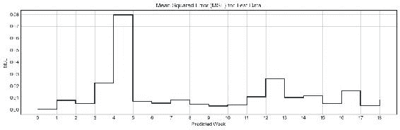

> 图 4：测试集中每周的 MSE； 请注意，第 5 周的模型预测比其他任何一周都差

根据我们的模型得出的 MSE 表明，我们的模型在除第 5 周外的大多数星期内均表现良好，此时其值增加到大约`0.08`。 在几乎所有其他测试周中，我们的模型似乎都表现良好。

### 过拟合

我们的首先训练网络（`bitcoin_lstm_v0`）可能正遭受一种称为*过拟合*的现象。 过拟合是指训练模型来优化验证集的方法，但是这样做会以我们有意预测的现象为基础，更笼统的模式为代价。 过拟合的主要问题是模型学习了如何预测验证集，但无法预测新数据。

在训练过程结束时，模型中使用的损失函数达到非常低的水平（约`2.9 * 10-6`）。 不仅如此，而且这种情况发生得很早：用于预测我们数据最后一周的 MSE 损失函数在大约第 30 个周期下降到一个稳定的平台。这意味着我们的模型几乎可以完美地预测第 77 周的数据， 76 周。 这可能是过拟合的结果吗？

让我们再次看图 4。 我们知道，我们的 LSTM 模型在验证集中达到极低的值（约`2.9 * 10-6`），但在测试集中也达到极低的值。 但是，关键的区别在于规模。 我们的测试集中每周的 MSE 大约是测试集中平均水平的 4,000 倍。 这意味着该模型在我们的测试数据中比在验证集中的表现要差得多。 这值得考虑。

但是，规模隐藏了我们 LSTM 模型的力量：即使在我们的测试集中表现更差，预测的 MSE 误差仍然非常非常低。 这表明我们的模型可能是从数据中学习模式。

### 模型预测

一件事是测量我们的模型，比较 MSE 误差，另一件事是能够直观地解释其结果。

使用相同的模型，我们现在使用 76 周作为输入来创建接下来几周的一系列预测。 通过在整个序列（即训练和测试集）上滑动 76 周的窗口，并对每个窗口进行预测，我们可以做到这一点。 预测是使用`Keras model.predict()`方法完成的：

```py
 combined_set = np.concatenate((train_data, test_data), axis=1)
```

```py
 predicted_weeks = []
 for i in range(0, validation_data.shape[1] + 1):
 input_series = combined_set[0:,i:i+76]
 predicted_weeks.append(B.predict(input_series))
```

> 片段 5：使用`model.predict()`方法对测试数据集的所有星期进行预测的片段

在前面的代码中，我们使用`model.predict(),`进行预测，然后将这些预测存储在`predicted_weeks`变量中。 然后，我们绘制结果预测，如下图所示：

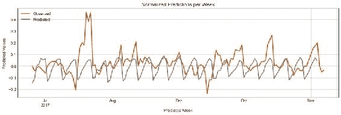

> 图 5：测试集中每周的 MSE。 请注意，第 5 周的模型预测比其他任何一周都差。

我们模型的结果（如图“图 5”所示）表明它的表现还不错。 通过观察*预测*行的模式，您可以注意到该网络已识别出每周发生的波动模式，其中正常价格在一周中上调，然后在下周下跌。 结束。 除了为数不多的几周（最值得注意的是第 5 周，与我们之前的 MSE 分析相同）之外，大多数周都接近正确的值。

现在让我们对预测进行反规范化，以便我们可以使用与原始数据相同的标度（即美元）调查预测值。 为此，我们可以实现一个反规范化函数，该函数使用来自预测数据的日索引来确定测试数据上的等效星期。 在确定了该周之后，该函数将采用该周的第一个值，并使用相同的点相对归一化技术，使用该值对预测值进行归一化，但取反：

```py
 def denormalize(reference, series,
```

```py
 normalized_variable='close_point_relative_normalization',
 denormalized_variable='close'):
 week_values = observed[reference['iso_week'] == series['iso_week']. values[0]]
 last_value = week_values[denormalized_variable].values[0]
 series[denormalized_variable] = last_value * (series[normalized_variable] + 1)

 return series

 predicted_close = predicted.groupby('iso_week').apply(
 lambda x: denormalize(observed, x))
```

> “代码段 6”：使用反向点相对归一化技术对数据进行归一化。 `denormalize()`函数从测试的等效一周的第一天起收取第一个收盘价。

现在，我们的结果使用美元将预测值与测试集进行比较。 从“图 5”中可以看出，`bitcoin_lstm_v0` 模型在预测接下来的 7 天比特币价格时似乎表现良好。 但是，我们如何用可解释的项衡量表现呢？


图 6：测试集中每周的 MSE； 请注意，第 5 周的模型预测比其他任何一周都差

#### 解释预测

我们的最后一步是为我们的预测增加可解释性。 图 6 似乎表明我们的模型预测在某种程度上与测试数据匹配，但是与测试数据的匹配程度如何？

Keras 的`model.evaluate()`函数对于理解模型在每个评估步骤中的执行情况很有用。 但是，鉴于我们通常使用规范化的数据集来训练神经网络，因此`model.evaluate()`方法生成的指标也难以解释。

为了解决该问题，我们可以从模型中收集完整的预测集，并使用“表 1”中的两个易于解释的函数将其与测试集进行比较：MAPE 和 RMSE ，分别实现为`mape()`和`rmse()`：

```py
def mape(A, B):
return np.mean(np.abs((A - B) / A)) * 100

  def rmse(A, B):
  return np.sqrt(np.square(np.subtract(A, B)).mean())
```

> “代码段 7”：`mape()`和`rmse()`函数的实现

### 注意

这些函数是使用 NumPy 实现的。 原始实现来自[这里](https://stats.stackexchange.com/questions/58391/mean-absolute-percentage-error-mape-in-scikit-learn)（MAPE）和[这里](https://stackoverflow.com/questions/16774849/mean-squared-error-in-numpy)（RMSE）。

在使用这两个函数将测试集与预测进行比较之后，我们得到以下结果：

*   非规范化的 **RMSE**: 399.6 美元
*   非规范化的 **MAPE**：8.4%

这表明我们的预测与实际数据的平均差异约为 399 美元。 这意味着与实际比特币价格相差约 8.4%。

这些结果有助于理解我们的预测。 我们将继续使用`model.evaluate()`方法来跟踪我们的 LSTM 模型的改进情况，但还将在模型的每个版本的完整序列中计算`rmse()`和`mape()`来解释我们预测的比特币价格的接近程度。

#### 活动 6 – 创建活动的训练环境

在此活动中，我们为神经网络创建了一个训练环境，以促进其训练和评估。 这个环境对于我们的下一课特别重要，在下一课中，我们寻找超参数的最佳组合。

首先，我们将启动 Jupyter 笔记本实例和 TensorBoard 实例。 在此活动的其余部分中，这两个实例都可以保持打开状态。

1.  在您的终端上，导航至目录`lesson_3/activity_6`并执行以下代码以启动 Jupyter 笔记本实例：

    ```py
    $ jupyter notebook
    ```

2.  在浏览器中打开应用提供的 URL，然后打开名为`Activity_6_Creating_an_active_training_environment.ipynb`的 Jupyter 笔记本：

    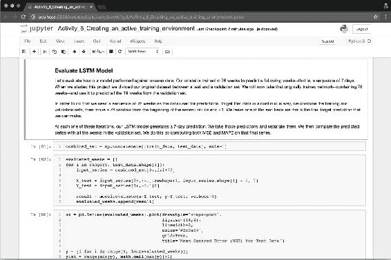

    图 7：Jupyter 笔记本突出显示“评估 LSTM 模型”部分

3.  同样在您的终端机上，通过执行以下命令来启动 TensorBoard 实例：

    ```py
    $ cd ./lesson_3/activity_6/
    $ tensorboard --logdir=logs/
    ```

4.  打开出现在屏幕上的 URL，并使该浏览器选项卡也保持打开状态。
5.  现在，将训练（`train_dataset.csv`）和测试集（`test_dataset.csv`）以及我们先前编译的模型（`bitcoin_lstm_v0.h5`）都加载到笔记本中。
6.  使用以下命令在 Jupyter 笔记本实例中加载训练和测试数据集：

    ```py
    $ train = pd.read_csv('data/train_dataset.csv')
    $ test = pd.read_csv('data/test_dataset.csv')
    ```

7.  另外，使用以下命令加载先前编译的模型：

    ```py
    $ model = load_model('bitcoin_lstm_v0.h5')
    ```

    现在让我们评估我们的模型如何针对测试数据执行。 我们使用 76 周的时间对模型进行了训练，以预测未来的一周-即接下来的 7 天。 建立第一个模型时，我们将原始数据集分为训练集和测试集。 现在，我们将两个数据集的合并版本（我们称为合并集）并移动 76 周的滑动窗口。 在每个窗口中，我们执行 Keras 的`model.evaluate()`方法来评估网络在特定星期的表现。

8.  执行标题**评估 LSTM 模型**下的单元格。 这些单元格的关键概念是在测试集中每个星期调用`model.evaluate()`方法。 这条线是最重要的：

    ```py
    $ result = model.evaluate(x=X_test, y=Y_test, verbose=0)
    ```

9.  现在，每个评估结果都存储在变量`evaluated_weeks`中。 该变量是一个简单的数组，其中包含测试集中每个星期的 MSE 预测序列。 继续并绘制以下结果：

    

    图 8：模型`set.evaluate()`方法对测试集每周的 MSE 结果

    正如我们在本课程中讨论的那样，MSE 损失函数很难解释。 为了促进我们对模型表现的理解，我们还每周在测试集中调用方法`model.predict()`，并将其预测结果与该集的值进行比较。

10.  导航至`Interpreting Model Results`部分，并在子标题`Make Predictions`下执行代码单元。 注意，我们正在调用方法`model.predict()`，但是参数的组合稍有不同。 我们不使用`X`和`Y`值，而是只使用`X`：

    ```py
     predicted_weeks = []
     for i in range(0, test_data.shape[1]):
     input_series = combined_set[0:,i:i+76]
     predicted_weeks.append(model.predict(input_series))
    ```

    在每个窗口中，我们将发布下一周的预测并存储结果。 现在，我们可以将标准化结果与测试集中的标准化值一起绘制，如下图所示：

    

    图 9：绘制测试集每个星期从`model.predict()`返回的归一化值

    我们还将进行相同的比较，但使用非标准化值。 为了使我们的数据不规范，我们必须首先确定测试集和预测之间的等效周。 然后，我们获取该周的第一个价格值，并使用它来逆转“第 2 课，模型架构”中的点相对标准化方程。

11.  导航到标题“非规范化预测”，然后执行该标题下的所有单元格。
12.  在本节中，我们定义了函数`denormalize()`，该函数执行完整的反规范化过程。 与其他函数不同，此函数采用 Pandas 数据帧而不是 NumPy 数组。 我们这样做是为了将日期用作索引。 这是与该标题最相关的单元格块：

    ```py
      predicted_close = predicted.groupby('iso_week').apply(
                            lambda x: denormalize(observed, x))
    ```

    我们的归一化结果（如下图所示）表明，我们的模型做出的预测接近真实的比特币价格。 但是有多近？

    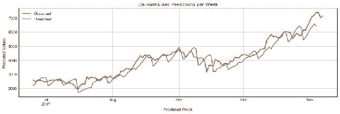

    图 10：绘制测试集每个星期从`model.predict()`返回的归一化值

    LSTM 网络使用 MSE 值作为其损失函数。 但是，正如课程中所讨论的，MSE 值难以解释。 为了解决这个问题，我们实现了两个函数（从脚本`utilities.py`加载），它们实现了函数 RMSE 和 MAPE。 这些函数通过返回与原始数据相同的比例尺的度量值，并比较比例尺的百分比差异，从而为我们的模型增加了可解释性。

13.  导航至标题`De-normalizing Predictions`并从`utilities.py`脚本中加载两个函数：

    ```py
    from scripts.utilities import rmse, mape
    ```

    该脚本中的函数实际上非常简单：

    ```py
    def mape(A, B):
        return np.mean(np.abs((A - B) / A)) * 100

    def rmse(A, B):
        return np.sqrt(np.square(np.subtract(A, B)).mean())
    ```

    每个函数都是使用 NumPy 的向量方式操作实现的。 它们在相同长度的向量中效果很好。 它们旨在应用于完整的结果集。

    使用`mape()`函数，我们现在可以了解到，我们的模型预测与测试集的价格相比，大约相差 8.4%。 这等效于约 399.6 美元的均方根误差（使用`rmse()`函数计算）。

    在继续下一部分之前，请回到笔记本电脑中，找到标题为 TensorBoard 的重新训练模型。 您可能已经注意到我们创建了一个名为`train_model()`的辅助函数。 该函数是模型的包装器，用于训练（使用`model.fit()`）模型，并将其各自的结果存储在新目录中。 然后，这些结果由 TensorBoard 用作判别器，以显示不同模型的统计信息。

14.  继续并修改传递给`model.fit()`函数的参数的某些值（例如，尝试周期）。 现在，运行将模型从磁盘加载到内存的单元（这将替换您训练的模型）：

    ```py
    model = load_model('bitcoin_lstm_v0.h5')
    ```

15.  现在，再次运行`train_model()`函数，但使用不同的参数，指示新的运行版本：

    ```py
    train_model(X=X_train, Y=Y_validate, version=0, run_number=0)
    ```

    ### 注意

    对于参考解决方案，请使用`Code/Lesson-3/activity_6`文件夹。

在本节中，我们学习了如何使用损失函数评估网络。 我们了解到，损失函数是神经网络的关键元素，因为它们在每个周期评估网络的表现，并且是将调整传播回层和节点的起点。 我们还探讨了为什么某些损失函数可能难以解释（例如 MSE）的原因，并开发了使用其他两个函数（RMSE 和 MAPE）的策略来解释 LSTM 模型的预测结果。

最重要的是，本课以一个活跃的训练环境结束。 我们现在拥有一个可以训练深度学习模型并不断评估其结果的系统。 当我们在下一个会话中转向优化我们的网络时，这将是关键。

### 超参数优化

我们已经训练了一个神经网络，以使用之前的 76 周价格来预测比特币价格的未来 7 天。 平均而言，该模型发出的预测与实际比特币价格相距约 8.4%。

本节描述了改善神经网络模型表现的常用策略：

*   添加或删除层并更改节点数
*   增加或减少训练次数
*   尝试不同的激活函数
*   使用不同的正则化策略

我们将使用在“模型评估”部分末尾开发的相同的主动学习环境来评估每种修改，并测量这些策略中的每一种如何帮助我们开发更精确的模型。

#### 层和节点 - 添加更多层

具有单个隐藏层的神经网络在许多问题上的表现都相当不错。 我们的第一个比特币模型（`bitcoin_lstm_v0`）是一个很好的例子：它可以使用单个 LSTM 层预测（根据测试集）未来七天的比特币价格（错误率约为 8.4% ）。 但是，并非所有问题都可以用单层建模。

您正在预测的函数越复杂，则需要添加更多层的可能性就越高。 确定是否添加新层是一个好主意，这是了解它们在神经网络中的作用。

每一层都创建其输入数据的模型表示。 链中较早的层创建较低级别的表示，较晚的层创建较高的级别。

尽管该描述可能难以转化为现实问题，但其实际直觉很简单：当使用具有不同表示级别的复杂函数时，您可能需要尝试添加层。

##### 添加更多节点

层所需的神经元数量与输入和输出数据的结构方式有关。 例如，如果您要将`4 x 4`像素图像分为两类之一，则可以从一个具有 12 个神经元的隐藏层（每个可用像素一个）和一个只有两个神经元的输出层开始（每个预测类一个）。

通常在添加新层的同时添加新神经元。 然后，可以添加一层具有与前一层相同数量的神经元，或者是前一层的神经元数量的倍数的层。 例如，如果您的第一个隐藏层具有 12 个神经元，则可以尝试添加第二个具有 12、6 或 24 个层的神经元。

添加层和神经元可能具有明显的表现限制。 随意尝试添加层和节点。 通常从一个较小的网络（即具有少量层和神经元的网络）开始，然后根据其表现提升而增长。

如果以上说法不准确，您的直觉是正确的。 引用 YouTube 视频分类的前负责人 AurélienGéron 的话，*找到完美数量的神经元仍然有些荒唐可笑*。

### 注意

《Scikit-Learn 和 TensorFlow 机器学习使用指南》，由 AureliénGéron 撰写，由 O'Reilly 于 2017 年 3 月发布。

最后，请注意：您添加的层越多，您需要调整的超参数就越多，网络训练所需的时间也就越长。 如果您的模型运行良好且没有过拟合数据，请在将新层添加到网络之前尝试本课中概述的其他策略。

##### 层和节点 - 实现

现在，我们将通过添加更多层来修改我们的原始 LSTM 模型。 在 LSTM 模型中，通常会按顺序添加 LSTM 层，从而在 LSTM 层之间形成一条链。 在我们的案例中，新的 LSTM 层具有与原始层相同的神经元数量，因此我们不必配置该参数。

我们将命名模型的修改版本`bitcoin_lstm_v1`。 优良作法是为每个要尝试不同的超参数配置的模型命名。 这有助于您跟踪每个不同架构的表现，还可以轻松比较 TensorBoard 中的模型差异。 在本课程结束时，我们将比较所有不同的修改架构。

### 注意

在添加新的 LSTM 层之前，我们需要在第一个 LSTM 层上将参数`return_sequences`修改为`True`。 我们这样做是因为第一层期望一个与第一层具有相同输入的数据序列。 当此参数设置为`False,`时，LSTM 层将以不同的不兼容输出输出预测参数。

考虑以下代码示例：

```py
period_length = 7
number_of_periods = 76
batch_size = 1

  model = Sequential()
  model.add(LSTM(
      units=period_length,
      batch_input_shape=(batch_size, number_of_periods, period_length),
      input_shape=(number_of_periods, period_length),
      return_sequences=True, stateful=False))

  model.add(LSTM(
      units=period_length,
      batch_input_shape=(batch_size, number_of_periods, period_length),
      input_shape=(number_of_periods, period_length),
      return_sequences=False, stateful=False))

  model.add(Dense(units=period_length))
  model.add(Activation("linear"))

  model.compile(loss="mse", optimizer="rmsprop")
```

> 片段 8：在原始`bitcoin_lstm_v0 model`上添加第二个 LSTM 层，使其成为`bitcoin_lstm_v1`

##### 周期

周期是网络响应于数据通过及其损失函数而调整其权重的次数。 为更多周期运行模型可以使它从数据中学到更多，但同时也存在过拟合的风险。

训练模型时，最好以指数形式增加历时，直到损失函数开始趋于平稳。 在`bitcoin_lstm_v0`模型的情况下，其损失函数稳定在大约 100 个周期。

我们的 LSTM 模型使用少量数据进行训练，因此增加周期数不会显着影响其表现。 例如，如果尝试在 103 个周期训练它，该模型几乎没有任何改进。 如果要训练的模型使用大量数据，则情况并非如此。 在这些情况下，大量的时间对于实现良好的表现至关重要。

我建议您使用以下关联：训练模型的日期越长，获得良好表现所需的时间越长。

###### 周期 - 实现

我们的比特币数据集非常小，因此增加了模型训练可能会对的表现产生边际影响的周期。 为了使模型具有更多的周期，只需更改`model.fit()`中的`epochs`参数即可：

```py
number_of_epochs = 10**3
model.fit(x=X, y=Y, batch_size=1,
          epochs=number_of_epochs,
          verbose=0,
          callbacks=[tensorboard])
```

> 片段 9：更改模型训练的周期数，使其变为`bitcoin_lstm_v2`

这一变化将我们的模型更改为`v2`，有效地使其变为`bitcoin_lstm_v2`。

###### 激活函数

激活函数评估您需要多少时间才能*激活*单个神经元。 他们使用上一层的输入和损失函数的结果（或者神经元是否应该传递任何值）来确定每个神经元将传递到网络下一个元素的值。

### 注意

激活函数是研究神经网络的科学界非常感兴趣的主题。 有关当前正在对该主题进行的研究概述以及有关激活函数如何工作的更详细的评论，请参阅 Ian Goodfellow 等的《深度学习》。 麻省理工学院出版社，2017 年。

TensorFlow 和 Keras 提供了许多激活函数-偶尔会添加新的激活函数。 引言中，三个重要的考虑因素； 让我们探索它们中的每一个。

### 注意

本部分的灵感来自 Avinash Sharma 撰写的文章[《了解神经网络中的激活函数》](https://medium.com/the-theory-of-everything/understanding-activation-functions-in-neural-networks-9491262884e0)，该文章可从获得启发。

###### 线性（恒等）

仅线性函数会基于恒定值激活神经元。 它们的定义是：

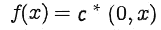

当`c = 1`时，神经元将按原样传递值，而无需激活函数进行修改。 使用线性函数的问题是，由于神经元是线性激活的，因此链接的层现在可以用作单个大层。 换句话说，一个人失去了构建多层网络的能力，其中一个人的输出会影响另一个人：

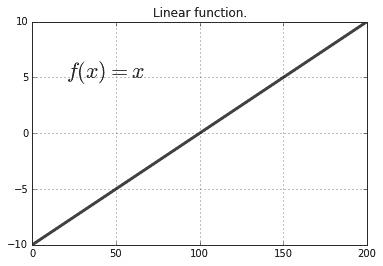

图 11：线性函数的图示

对于大多数网络，线性函数的使用通常认为是。

###### 双曲正切（Tanh）

**Tanh** 是非线性函数，由以下公式表示：

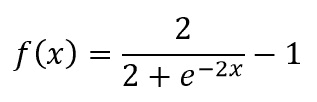

表示将连续评估它们对节点的影响。 同样，由于其非线性，可以使用此函数来更改一层如何影响链中的下一层。 使用非线性函数时，层会以不同的方式激活神经元，从而使从数据中学习不同的表示更为容易。 但是，它们具有类似于 Sigmoid 的图案，可反复惩罚极端节点值，从而导致称为的问题，即消失梯度。 消失的梯度对网络的学习能力产生负面影响：

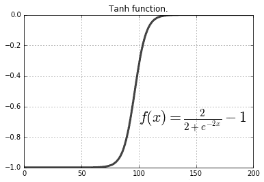

图 12：tanh 函数的图示

Tanh 是的流行选择，但是由于它们的计算量很大，因此经常使用 ReLU。

###### 整流线性单元

ReLU 具有非线性属性。 它们的定义是：

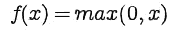

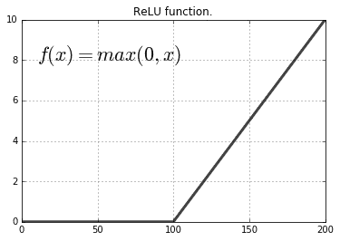

图 13：ReLU 函数示意图

在尝试其他函数之前，通常建议将 ReLU 函数作为起点。 ReLU 倾向于惩罚负值。 因此，如果输入数据（例如，在`-1`和`1`之间进行归一化）包含负值，则这些数据现在将受到 ReLU 的惩罚。 可能不是预期的行为。

我们不会在网络中使用 ReLU 函数，因为我们的规范化过程会创建许多负值，从而导致学习模型慢得多。

###### 激活函数 - 实现

在 Keras 中实现激活函数的最简单方法是实例化`Activation()`类，并将其添加到`Sequential()`模型中。 可以使用 Keras 中可用的任何激活函数实例化`Activation()`（有关完整列表，请参见[这里](https://keras.io/activations/)）。 在我们的例子中，我们将使用`tanh`函数。 实现激活函数后，我们将模型的版本更改为`v2`，使其变为`bitcoin_lstm_v3`：

```py
 model = Sequential()
```

```py
  model.add(LSTM(
      units=period_length,
      batch_input_shape=(batch_size, number_of_periods, period_length),
      input_shape=(number_of_periods, period_length),
      return_sequences=True, stateful=False))

  model.add(LSTM(
      units=period_length,
      batch_input_shape=(batch_size, number_of_periods, period_length),
      input_shape=(number_of_periods, period_length),
      return_sequences=False, stateful=False))

  model.add(Dense(units=period_length))
  model.add(Activation("tanh"))

  model.compile(loss="mse", optimizer="rmsprop")
```

> “代码段 10”：在`bitcoin_lstm_v2 model`中添加激活函数 tanh，使其成为`bitcoin_lstm_v3`

还有许多其他激活函数值得尝试。 TensorFlow 和 Keras 都在各自的官方文档中提供了已实现函数的列表。 在实现自己的方法之前，请先从 TensorFlow 和 Keras 中已实现的方法开始。

###### 正则化策略

神经网络特别容易过拟合。 当网络学习训练数据的模式但无法找到也可以应用于测试数据的可推广模式时，就会发生过拟合。

正则化策略是指通过调整网络学习方式来解决过拟合问题的技术。 在本书中，我们讨论两种常见的策略：L2 和丢弃。

###### L2 正则化

L2 正则化（或权重衰减）是用于处理过拟合模型的常见技术。 在某些模型中，某些参数的变化幅度很大。 L2 正则化惩罚了这些参数，从而降低了这些参数对网络的影响。

L2 正则化使用`λ`参数来确定对模型神经元的惩罚程度。 通常将其设置为一个非常低的值（即`0.0001`）； 否则，就有可能完全消除给定神经元的输入。

###### 丢弃

丢弃是一种基于简单问题的正则化技术：如果一个节点随机地从层中删除一部分节点，那么另一个节点将如何适应？ 事实证明，其余的神经元会适应，学会代表先前由缺失的那些神经元处理过的模式。

退出策略易于实现，通常非常有效地避免过拟合。 这将是我们首选的正则化。

###### 正则化策略 - 实现

为了使用 Keras 实现的退出策略，我们导入`Dropout()`类并将其添加到每个 LSTM 层之后的网络中。 有效的添加使我们的网络`bitcoin_lstm_v4`：

```py
  model = Sequential()
  model.add(LSTM(
      units=period_length,
      batch_input_shape=(batch_size, number_of_periods, period_length),
      input_shape=(number_of_periods, period_length),
      return_sequences=True, stateful=False))

  model.add(Dropout(0.2))

  model.add(LSTM(
      units=period_length,
      batch_input_shape=(batch_size, number_of_periods, period_length),
      input_shape=(number_of_periods, period_length),
      return_sequences=False, stateful=False))

  model.add(Dropout(0.2))

  model.add(Dense(units=period_length))
  model.add(Activation("tanh"))

  model.compile(loss="mse", optimizer="rmsprop")
```

> “代码段 11”：在此代码段中，我们将`Dropout()`步骤添加到模型`(bitcoin_lstm_v3)`中，使其设为`bitcoin_lstm_v4`

可以使用 L2 正则化代替丢弃。 为此，只需实例化`ActivityRegularization()`类，并将`L2`参数设置为较低的值（例如`0.0001,`）。 然后，将其放置在`Dropout()`类添加到网络的位置。 随时进行测试，只需将其添加到网络中，同时保持`Dropout()`的两个步骤，或者直接将所有`Dropout()`实例替换为`ActivityRegularization()`。

###### 优化结果

总而言之，我们已经创建了四个版本的模型。 这些版本中的三个是通过应用本课中概述的不同优化技术创建的。

在创建所有这些版本之后，我们现在必须评估哪种模型表现最佳。 为此，我们使用第一个模型中使用的相同指标：MSE，RMSE 和 MAPE。 MSE 用于比较每个预测周的模型错误率。 计算 RMSE 和 MAPE 使模型结果更易于解释。

| 模型 | MSE（最后一个周期） | RMSE（整个序列） | MAPE（整个序列） | 训练时间 |
| --- | --- | --- | --- | --- |
| `bitcoin_lstm_v0` | - | 399.6 | 8.4%  | - |
| `bitcoin_lstm_v1` | 7.15*10-6 | 419.3 | 8.8%  | 49.3 秒 |
| `bitcoin_lstm_v2` | 3.55*10-6 | 425.4 | 9.0%  | 1 分 13 秒 |
| `bitcoin_lstm_v3` | 2.8*10-4 | 423.9 | 8.8%  | 1 分 19 秒 |
| `bitcoin_lstm_v4` | 4.8*10-7 | 442.4 | 9.4%  | 1 分 20 秒 |

> 表 2：所有模型的模型结果

有趣的是，我们的第一个模型（`bitcoin_lstm_v0`）在几乎所有定义的指标中表现最佳。 我们将使用该模型构建我们的 Web 应用并不断预测比特币价格。

###### 活动 7 – 优化深度学习模型

在此活动中，我们对在“第 2 课”，“模型架构”（`bitcoin_lstm_v0`）中创建的模型实现不同的优化策略。 该模型在完整的反规范化测试集上获得了大约 8.4% 的 MAPE 表现。 我们将努力缩小这一差距。

1.  在您的终端上，通过执行以下命令来启动 TensorBoard 实例：

    ```py
    $ cd ./lesson_3/activity_7/
    $ tensorboard --logdir=logs/
    ```

2.  打开出现在屏幕上的 URL，并使该浏览器选项卡也保持打开状态。 另外，使用以下命令启动 Jupyter 笔记本实例：

    ```py
    $ jupyter notebook
    ```

    打开出现在其他浏览器窗口中的 URL。

3.  现在，打开名为`Activity_7_Optimizing_a_deep_learning_model.ipynb`的 Jupyter 笔记本，并导航至笔记本的标题并导入所有必需的库。

    我们将像以前的活动一样加载训练和测试数据。 我们还将使用工具函数`split_lstm_input()`将分为训练组和测试组。

    在本笔记本的每个部分中，我们将在模型中实现新的优化技术。 每次这样做，我们都会训练一个新模型并将其训练后的实例存储在描述模型版本的变量中。 例如，在本笔记本中，我们的第一个模型`bitcoin_lstm_v0,`被称为`model_v0`。 在笔记本的最后，我们使用 MSE，RMSE 和 MAPE 评估所有模型。

4.  现在，在打开的 Jupyter 笔记本中，导航至标题`Adding Layers and Nodes`。 您将在下一个单元格中识别出我们的第一个模型。 这是我们在第 2 课，“模型架构”中构建的基本 LSTM 网络。 现在，我们必须向该网络添加一个新的 LSTM 层。

    利用本课中的知识，继续并添加新的 LSTM 层，编译和训练模型。

    在训练模型时，请记住经常访问正在运行的 TensorBoard 实例。 您将能够查看每个模型的运行情况，并在此处比较其损失函数的结果：

    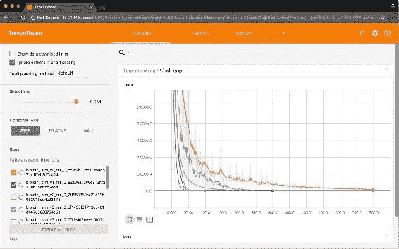

    图 14：运行 TensorBoard 实例，该实例显示了许多不同的模型运行。 TensorBoard 对于实时跟踪模型训练非常有用。

5.  现在，导航至标题`Epochs`。 在本节中，我们有兴趣探索不同周期的大小。 使用工具函数`train_model()`来命名不同的模型版本并运行：

    ```py
    train_model(model=model_v0, X=X_train, Y=Y_validate, epochs=100, version=0, run_number=0)
    ```

    使用一些不同的周期参数训练模型。

    此时，您有兴趣确保模型不会过拟合训练数据。 您想避免这种情况，因为如果这样做，它将无法预测训练数据中表示的模式，但测试数据中具有不同的表示形式。

    在尝试了新周期之后，请转到下一个优化技术：激活函数。

6.  现在，导航至笔记本中的标题`Activation Functions`。 在本节中，您只需要更改以下变量：

    ```py
    activation_function = "tanh"
    ```

    我们在本节中使用了`tanh`函数，但是请随时尝试其他激活函数。 查看[这个页面](https://keras.io/activations/)上可用的列表，然后尝试其他可能性。

    我们的最终选择是尝试不同的正则化策略。 这显然更加复杂，并且可能需要花费一些迭代才能注意到任何收益，尤其是数据量很少时。 此外，添加正则化策略通常会增加网络的训练时间。

7.  现在，导航至笔记本中的标题**正则化策略**。 在本部分中，您需要实现`Dropout()`正则化策略。 找到合适的位置放置该步骤并将其实现到我们的模型中。
8.  您也可以在这里尝试进行 L2 正则化（或将两者结合使用）。 与`Dropout()`相同，但现在使用`ActivityRegularization(l2=0.0001)`。

    最后，让我们使用 RMSE 和 MAPE 评估我们的模型：

9.  现在，导航至笔记本中的标题`Evaluate Models`。 在本节中，我们将评估测试集中未来 19 周数据的模型预测。 然后，我们将计算预测序列与测试序列的 RMSE 和 MAPE。

    我们已经实现了与活动 6 相同的评估技术，所有这些技术都包含在工具函数中。 只需运行本节中的所有单元格，直到笔记本末尾即可查看结果。

    ### 注意

    对于参考解决方案，请使用`Code/Lesson-3/activity_7`文件夹。

    借此机会来调整前面的优化技术的值，并尝试击败该模型的表现。

# 总结

在本课程中，我们学习了如何使用度量均方误差（MSE），均方误差（RMSE）和均值平均百分比误差（MAPE）来评估模型。 我们通过第一个神经网络模型进行的为期 19 周的一系列预测中计算了后两个指标。 然后我们得知它运行良好。

我们还学习了如何优化模型。 我们研究了通常用于提高神经网络表现的优化技术。 此外，我们实现了许多这些技术，并创建了更多模型来预测具有不同错误率的比特币价格。

在下一课中，我们将把我们的模型变成一个执行以下两件事的 Web 应用：使用新数据定期重新训练我们的模型，并能够使用 HTTP API 接口进行预测。