# 一、探索和转换数据

TensorFlow 是用于使用数据流图进行数值计算的开源软件库。 图中的节点表示数学运算，而图的边缘表示在它们之间传递的多维数据数组（张量）。

该库包含各种函数，使您能够实现和探索用于图像和文本处理的最先进的卷积神经网络（CNN）和循环神经网络（RNN）架构。 由于复杂的计算以图的形式排列，因此 TensorFlow 可用作框架，使您能够轻松开发自己的模型并将其用于机器学习领域。

它还能够在从 CPU 到移动处理器（包括高度并行的 GPU 计算）的大多数异构环境中运行，并且新的服务架构可以在所有指定选项的非常复杂的混合环境中运行：

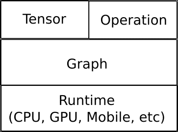

# TensorFlow 的主要数据结构 -- 张量

TensorFlow 的数据管理基于张量。 张量是来自数学领域的概念，并且是作为向量和矩阵的线性代数项的概括而开发的。

专门讨论 TensorFlow 时，张量只是在张量对象中建模的带类型的多维数组，带有其他操作。

## 张量属性 -- 阶数，形状和类型

如前所述，TensorFlow 使用张量数据结构表示所有数据。 任何张量都具有静态类型和动态尺寸，因此您可以实时更改张量的内部组织。

张量的另一个特性是，只有张量类型的对象才能在计算图中的节点之间传递。

现在让我们看一下张量的属性是什么（从现在开始，每次使用张量这个词时，我们都将引用 TensorFlow 的张量对象）。

### 张量阶数

张量阶数表示张量的维度方面，但与矩阵阶数不同。 它表示张量所处的维数，而不是行/列或等效空间中张量扩展的精确度量。

秩为 1 的张量等于向量，秩为 2 的张量是矩阵。 对于二阶张量，您可以使用语法`t[i, j]`访问任何元素。 对于三阶张量，您将需要使用`t[i, j, k]`来寻址元素，依此类推。

在下面的示例中，我们将创建一个张量，并访问其分量之一：

```py
>>> import tensorflow as tf 
>>> tens1 = tf.constant([[[1,2],[2,3]],[[3,4],[5,6]]]) 
>>> print sess.run(tens1)[1,1,0] 
5 

```

这是三阶张量，因为在包含矩阵的每个元素中都有一个向量元素：

| 秩 | 数学实体 | 代码定义示例 |
| --- | --- | --- |
| 0 | 标量 | `scalar = 1000` |
| 1 | 向量 | `vector = [2, 8, 3]` |
| 2 | 矩阵 | `matrix = [[4, 2, 1], [5, 3, 2], [5, 5, 6]]` |
| 3 | 3 阶张量 | `tensor = [[[4], [3], [2]], [[6], [100], [4]], [[5], [1], [4]]]` |
| n | n 阶张量 | ... |

### 张量形状

TensorFlow 文档使用三种符号约定来描述张量维数：阶数，形状和维数。 下表显示了它们之间的相互关系：

| 秩 | 形状 | 维度数量 | 示例 |
| --- | --- | --- | --- |
| 0 | `[]` | 0 | `4` |
| 1 | `[D0]` | 1 | `[2]` |
| 2 | `[D0，D1]` | 2 | `[6, 2]` |
| 3 | `[D0，D1，D2]` | 3 | `[7, 3, 2]` |
| n | `[D0，D1，... Dn-1]` | d | 形状为`[D0, D1, ..., Dn-1]`的张量。 |

在下面的示例中，我们创建一个样本阶数三张量，并打印其形状：

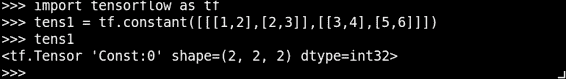

### 张量数据类型

除了维数外，张量还具有固定的数据类型。 您可以将以下任意一种数据类型分配给张量：

| 数据类型 | Python 类型 | 描述 |
| --- | --- | --- |
| `DT_FLOAT` | `tf.float32` | 32 位浮点。 |
| `DT_DOUBLE` | `tf.float64` | 64 位浮点。 |
| `DT_INT8` | `tf.int8` | 8 位有符号整数。 |
| `DT_INT16` | `tf.int16` | 16 位有符号整数。 |
| `DT_INT32` | `tf.int32` | 32 位有符号整数。 |
| `DT_INT64` | `tf.int64` | 64 位有符号整数。 |
| `DT_UINT8` | `tf.uint8` | 8 位无符号整数。 |
| `DT_STRING` | `tf.string` | 可变长度字节数组。 张量的每个元素都是一个字节数组。 |
| `DT_BOOL` | `tf.bool` | 布尔值。 |

## 创建新的张量

我们可以创建自己的张量，也可以从著名的 numpy 库派生它们。 在以下示例中，我们创建一些 numpy 数组，并对其进行一些基本数学运算：

```py
import tensorflow as tf
import numpy as np
x = tf.constant(np.random.rand(32).astype(np.float32))
y=  tf.constant ([1,2,3])

```

### 从 numpy 到张量，以及反向

TensorFlow 可与 numpy 互操作，通常`eval()`函数调用将返回一个 numpy 对象，准备与标准数值工具一起使用。

### 提示

我们必须注意，张量对象是操作结果的符号句柄，因此它不保存其包含的结构的结果值。 因此，我们必须运行`eval()`方法来获取实际值，该值等于`Session.run(tensor_to_eval)`。

在此示例中，我们构建了两个 numpy 数组，并将它们转换为张量：

```py
import tensorflow as tf #we import tensorflow 
import numpy as np   #we import numpy 
sess = tf.Session() #start a new Session Object 
x_data = np.array([[1.,2.,3.], 
[3.,2.,6.]]) # 2x3 matrix 
x = tf.convert_to_tensor(x_data, dtype=tf.float32) #Finally, we create the tensor, starting from the fload 3x matrix 

```

#### 有用的方法

`tf.convert_to_tensor`：此函数将各种类型的 Python 对象转换为张量对象。 它接受张量对象，numpy 数组，Python 列表和 Python 标量。

## 完成工作 -- 与 TensorFlow 交互

与大多数 Python 模块一样，TensorFlow 允许使用 Python 的交互式控制台：

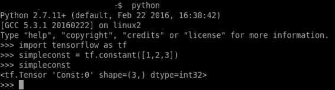

与 Python 的解释器和 TensorFlow 库轻松交互

在上图中，我们调用 Python 解释器（通过简单地调用 Python）并创建常量类型的张量。 然后我们再次调用它，Python 解释器显示张量的形状和类型。

我们还可以使用 IPython 解释器，该解释器将允许我们采用与笔记本样式工具（例如 Jupyter）更兼容的格式：

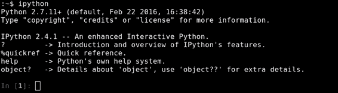

IPython 提示

在谈论以交互方式运行 TensorFlow 会话时，最好使用`InteractiveSession`对象。

与普通的`tf.Session`类不同，`tf.InteractiveSession`类将自身安装为构造时的默认会话。 因此，当您尝试求值张量或运行操作时，将不需要传递`Session`对象来指示它所引用的会话。

# 处理计算工作流程 -- TensorFlow 的数据流程图

TensorFlow 的数据流图是模型计算如何工作的符号表示：


在 TensorBoard 上绘制的简单数据流图表示

简而言之，数据流图是一个完整的 TensorFlow 计算，表示为一个图，其中节点是操作，边是操作之间的数据流。

通常，节点执行数学运算，但也表示连接以输入数据或变量，或推出结果。

边缘描述节点之间的输入/输出关系。 这些数据边仅传输张量。 节点被分配给计算设备，并且一旦它们进入边缘上的所有张量都可用，就会异步并行执行。

所有运算都有一个名称，并表示一个抽象计算（例如，矩阵求逆或乘积）。

## 计算图构建

通常在库用户创建张量和模型将支持的操作时构建计算图，因此无需直接构建`Graph()`对象。 Python 张量构造器，例如`tf.constant()`，会将必要的元素添加到默认图。 TensorFlow 操作也会发生同样的情况。

例如，`c = tf.matmul(a, b)`创建一个`MatMul`类型的操作，该操作将张量`a`和`b`作为输入并产生`c`作为输出。

### 有用的操作对象方法

*   `tf.Operation.type`：返回操作的类型（例如`MatMul`）
*   `tf.Operation.inputs`：返回代表操作输入的张量对象列表
*   `tf.Graph.get_operations()`：返回图中的操作列表
*   `tf.Graph.version`：返回图的自动数字版本

## 馈送

TensorFlow 还提供了一种馈送机制，可将张量直接修补到图中的任何操作中。

提要用张量值临时替换操作的输出。 您将提要数据作为`run()`调用的参数提供。 提要仅用于传递给它的运行调用。 最常见的用例涉及通过使用`tf.placeholder()`创建特定的操作，使其指定为`feed`操作。

## 变量

在大多数计算中，图执行多次。 大多数张量都无法通过图的一次执行而幸存。 但是，变量是一种特殊的操作，它可以将句柄返回到持久可变的张量，该张量在图执行过程中仍然存在。 对于 TensorFlow 的机器学习应用，模型的参数通常存储在变量中保存的张量中，并在运行模型的训练图时进行更新。

### 变量初始化

要初始化变量，只需使用张量作为参数调用`Variable`对象构造器。

在此示例中，我们使用`1000`零数组初始化了一些变量：

```py
b = tf.Variable(tf.zeros([1000])) 

```

## 保存数据流程图

数据流图是使用 Google 的协议缓冲区编写的，因此以后可以使用多种语言进行读取。

### 图序列化语言 -- 协议缓冲区

协议缓冲区是一种不依赖语言，不依赖平台的可扩展机制，用于序列化结构化数据。 首先定义数据结构，然后可以使用专门生成的代码来使用多种语言进行读写。

#### 有用的方法

`tf.Graph.as_graph_def(from_version=None, add_shapes=False)`：返回此图的序列化`GraphDef`表示形式。

参数：

*   `from_version`：如果设置了此选项，它将返回带有从该版本添加的节点的`GraphDef`
*   `add_shapes`：如果`true`，则向每个节点添加一个`shape`属性

### 建立图的示例

在此示例中，我们将构建一个非常简单的数据流图，并观察生成的 protobuffer 文件的概述：

```py
import tensorflow as tf 
g = tf.Graph() 
with g.as_default(): 
import tensorflow as tf 
sess = tf.Session() 
W_m = tf.Variable(tf.zeros([10, 5])) 
x_v = tf.placeholder(tf.float32, [None, 10]) 
result = tf.matmul(x_v, W_m) 
print g.as_graph_def() 

```

生成的 protobuffer（摘要）为：

```py
node {
  name: "zeros"
  op: "Const"
  attr {
    key: "dtype"
    value {
      type: DT_FLOAT
    }
  }
  attr {
    key: "value"
    value {
      tensor {
        dtype: DT_FLOAT
        tensor_shape {
          dim {
            size: 10
          }
          dim {
            size: 5
          }
        }
        float_val: 0.0
      }
    }
  }
}
...
node {
  name: "MatMul"
  op: "MatMul"
  input: "Placeholder"
  input: "Variable/read"
  attr {
    key: "T"
    value {
      type: DT_FLOAT
    }
  }
...
}
versions {
  producer: 8
}
```

# 运行我们的程序 -- 会话

客户端程序通过创建会话与 TensorFlow 系统交互。 会话对象表示将在其中运行计算的环境。 `Session`对象开始为空，并且当程序员创建不同的操作和张量时，它们将被自动添加到`Session`中，在调用`Run()`方法之前，该对象不会进行任何计算。

`Run()`方法采用一组需要计算的输出名称，以及一组可选的张量，以代替节点的某些输出输入到图中。

如果调用此方法，并且命名操作依赖于某些操作，则`Session`对象将执行所有这些操作，然后继续执行命名操作。

这条简单的线是创建会话所需的唯一一行：

```py
s = tf.Session()
Sample command line output:
tensorflow/core/common_runtime/local_session.cc:45]Localsessioninteropparallelism threads:6

```

# 基本张量方法

在本节中，我们将探索 TensorFlow 支持的一些基本方法。 它们对于初始数据探索和为更好的并行计算准备数据很有用。

## 简单矩阵运算

TensorFlow 支持许多更常见的矩阵运算，例如转置，乘法，获取行列式和逆运算。

这是应用于样本数据的那些函数的一个小例子：

```py
In [1]: import tensorflow as tf 
In [2]: sess = tf.InteractiveSession() 
In [3]: x = tf.constant([[2, 5, 3, -5], 
...:                  [0, 3,-2,  5], 
...:                  [4, 3, 5,  3], 
...:                  [6, 1, 4,  0]]) 

In [4]: y = tf.constant([[4, -7, 4, -3, 4], 
...:                  [6, 4,-7,  4, 7], 
...:                  [2, 3, 2,  1, 4], 
...:                  [1, 5, 5,  5, 2]]) 
In [5]: floatx = tf.constant([[2., 5., 3., -5.], 
...:                       [0., 3.,-2.,  5.], 
...:                       [4., 3., 5.,  3.], 
...:                       [6., 1., 4.,  0.]]) 
In [6]: tf.transpose(x).eval() # Transpose matrix 
Out[6]: 
array([[ 2,  0,  4,  6], 
[ 5,  3,  3,  1], 
[ 3, -2,  5,  4], 
[-5,  5,  3,  0]], dtype=int32) 

In [7]: tf.matmul(x, y).eval() # Matrix multiplication 
Out[7]: 
array([[ 39, -10, -46,  -8,  45], 
[ 19,  31,   0,  35,  23], 
[ 47,  14,  20,  20,  63], 
[ 38, -26,  25, -10,  47]], dtype=int32) 

In [8]: tf.matrix_determinant(floatx).eval() # Matrix determinant 
Out[8]: 818.0 

In [9]: tf.matrix_inverse(floatx).eval() # Matrix inverse 
Out[9]: 
array([[-0.00855745,  0.10513446, -0.18948655,  0.29584351], 
[ 0.12958434,  0.12224938,  0.01222495, -0.05134474], 
[-0.01955992, -0.18826403,  0.28117359, -0.18092911], 
[-0.08557458,  0.05134474,  0.10513448, -0.0415648 ]], dtype=float32) 

In [10]: tf.matrix_solve(floatx, [[1],[1],[1],[1]]).eval() # Solve Matrix system 
Out[10]: 
array([[ 0.20293398], 
[ 0.21271393], 
[-0.10757945], 
[ 0.02933985]], dtype=float32) 

```

### 归约

归约运算是对张量的一个维度进行运算的操作，而其维数较小。

支持的操作（具有相同参数）包括乘积，最小值，最大值，平均值，所有，任意和`accumulate_n`）。

```py
In [1]: import tensorflow as tf 

In [2]: sess = tf.InteractiveSession() 
In [3]: x = tf.constant([[1,  2, 3], 
...:                  [3,  2, 1], 
...:                  [-1,-2,-3]]) 
In [4]: 

In [4]: boolean_tensor = tf.constant([[True,  False, True], 
...:                  [False, False, True], 
...:                  [True, False, False]]) 

In [5]: tf.reduce_prod(x, reduction_indices=1).eval() # reduce prod 
Out[5]: array([ 6,  6, -6], dtype=int32) 

In [6]: tf.reduce_min(x, reduction_indices=1).eval() # reduce min 
Out[6]: array([ 1,  1, -3], dtype=int32) 

In [7]: tf.reduce_max(x, reduction_indices=1).eval() # reduce max 
Out[7]: array([ 3,  3, -1], dtype=int32) 

In [8]: tf.reduce_mean(x, reduction_indices=1).eval() # reduce mean 
Out[8]: array([ 2,  2, -2], dtype=int32) 

In [9]: tf.reduce_all(boolean_tensor, reduction_indices=1).eval() # reduce all 
Out[9]: array([False, False, False], dtype=bool) 

In [10]: tf.reduce_any(boolean_tensor, reduction_indices=1).eval() # reduce any 
Out[10]: array([ True,  True,  True], dtype=bool) 

```

### 张量分段

张量分段是一个过程，其中某个维度被归约，并且所得元素由索引行确定。 如果该行中的某些元素被重复，则对应的索引将转到其中的值，并且该操作将在具有重复索引的索引之间应用。

索引数组的大小应与索引数组的维度 0 的大小相同，并且必须增加 1。

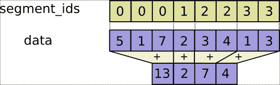

细分说明（重做）

```py
In [1]: import tensorflow as tf 
In [2]: sess = tf.InteractiveSession() 
In [3]: seg_ids = tf.constant([0,1,1,2,2]); # Group indexes : 0|1,2|3,4 
In [4]: tens1 = tf.constant([[2, 5, 3, -5], 
...:                     [0, 3,-2,  5], 
...:                     [4, 3, 5,  3], 
...:                     [6, 1, 4,  0], 
...:                     [6, 1, 4,  0]])  # A sample constant matrix 

In [5]: tf.segment_sum(tens1, seg_ids).eval()   # Sum segmentation 
Out[5]: 
array([[ 2,  5,  3, -5], 
[ 4,  6,  3,  8], 
[12,  2,  8,  0]], dtype=int32) 

In [6]: tf.segment_prod(tens1, seg_ids).eval() # Product segmentation 
Out[6]: 
array([[  2,   5,   3,  -5], 
[  0,   9, -10,  15], 
[ 36,   1,  16,   0]], dtype=int32) 

In [7]: tf.segment_min(tens1, seg_ids).eval() # minimun value goes to group 
Out[7]: 
array([[ 2,  5,  3, -5], 
[ 0,  3, -2,  3], 
[ 6,  1,  4,  0]], dtype=int32) 

In [8]: tf.segment_max(tens1, seg_ids).eval() # maximum value goes to group 
Out[8]: 
array([[ 2,  5,  3, -5], 
[ 4,  3,  5,  5], 
[ 6,  1,  4,  0]], dtype=int32) 

In [9]: tf.segment_mean(tens1, seg_ids).eval() # mean value goes to group 
Out[9]: 
array([[ 2,  5,  3, -5], 
[ 2,  3,  1,  4], 
[ 6,  1,  4,  0]], dtype=int32) 

```

## 序列

序列工具包括诸如`argmin`和`argmax`（显示维度的最小值和最大值），`listdiff`（显示列表之间交集的补码），`where`（显示真实值的索引）和`unique`（在列表上显示唯一值）之类的张量方法。

```py
In [1]: import tensorflow as tf 
In [2]: sess = tf.InteractiveSession() 
In [3]: x = tf.constant([[2, 5, 3, -5], 
...:                  [0, 3,-2,  5], 
...:                  [4, 3, 5,  3], 
...:                  [6, 1, 4,  0]]) 
In [4]: listx = tf.constant([1,2,3,4,5,6,7,8]) 
In [5]: listy = tf.constant([4,5,8,9]) 

In [6]: 

In [6]: boolx = tf.constant([[True,False], [False,True]]) 

In [7]: tf.argmin(x, 1).eval() # Position of the maximum value of columns 
Out[7]: array([3, 2, 1, 3]) 

In [8]: tf.argmax(x, 1).eval() # Position of the minimum value of rows 
Out[8]: array([1, 3, 2, 0]) 

In [9]: tf.listdiff(listx, listy)[0].eval() # List differences 
Out[9]: array([1, 2, 3, 6, 7], dtype=int32) 

In [10]: tf.where(boolx).eval() # Show true values 
Out[10]: 
array([[0, 0], 
[1, 1]]) 

In [11]: tf.unique(listx)[0].eval() # Unique values in list 
Out[11]: array([1, 2, 3, 4, 5, 6, 7, 8], dtype=int32) 

```

## 张量形状变换

这些操作与矩阵形状有关，用于调整不匹配的数据结构并检索有关数据量度的快速信息。 这在确定运行时的处理策略时很有用。

在以下示例中，我们将从第二张量张量开始，并将打印有关它的一些信息。

然后，我们将探讨按维度修改矩阵的操作，包括添加或删除维度，例如`squeeze`和`expand_dims`：

```py
In [1]: import tensorflow as tf 
In [2]: sess = tf.InteractiveSession() 
In [3]: x = tf.constant([[2, 5, 3, -5], 
...:                  [0, 3,-2,  5], 
...:                  [4, 3, 5,  3], 
...:                  [6, 1, 4,  0]]) 

In [4]: tf.shape(x).eval() # Shape of the tensor 
Out[4]: array([4, 4], dtype=int32) 

In [5]: tf.size(x).eval() # size of the tensor 
Out[5]: 16 

In [6]: tf.rank(x).eval() # rank of the tensor 
Out[6]: 2 

In [7]: tf.reshape(x, [8, 2]).eval() # converting to a 10x2 matrix 
Out[7]: 
array([[ 2,  5], 
[ 3, -5], 
[ 0,  3], 
[-2,  5], 
[ 4,  3], 
[ 5,  3], 
[ 6,  1], 
[ 4,  0]], dtype=int32) 

In [8]: tf.squeeze(x).eval() #  squeezing 
Out[8]: 
array([[ 2,  5,  3, -5], 
[ 0,  3, -2,  5], 
[ 4,  3,  5,  3], 
[ 6,  1,  4,  0]], dtype=int32) 

In [9]: tf.expand_dims(x,1).eval() #Expanding dims 
Out[9]: 
array([[[ 2,  5,  3, -5]], 
[[ 0,  3, -2,  5]], 
[[ 4,  3,  5,  3]], 
[[ 6,  1,  4,  0]]], dtype=int32) 

```

### 张量切片和合并

为了从大型数据集中提取和合并有用的信息，切片和联接方法使您可以合并所需的列信息，而不必使用非特定信息来占用内存空间。

在以下示例中，我们将提取矩阵切片，对其进行分割，添加填充以及对行进行打包和解包：

```py
In [1]: import tensorflow as tf 
In [2]: sess = tf.InteractiveSession() 
In [3]: t_matrix = tf.constant([[1,2,3], 
...:                         [4,5,6], 
...:                         [7,8,9]]) 
In [4]: t_array = tf.constant([1,2,3,4,9,8,6,5]) 
In [5]: t_array2= tf.constant([2,3,4,5,6,7,8,9]) 

In [6]: tf.slice(t_matrix, [1, 1], [2,2]).eval() # cutting an slice 
Out[6]: 
array([[5, 6], 
[8, 9]], dtype=int32) 

In [7]: tf.split(0, 2, t_array) # splitting the array in two 
Out[7]: 
[<tf.Tensor 'split:0' shape=(4,) dtype=int32>, 
<tf.Tensor 'split:1' shape=(4,) dtype=int32>] 

In [8]: tf.tile([1,2],[3]).eval() # tiling this little tensor 3 times 
Out[8]: array([1, 2, 1, 2, 1, 2], dtype=int32) 

In [9]: tf.pad(t_matrix, [[0,1],[2,1]]).eval() # padding 
Out[9]: 
array([[0, 0, 1, 2, 3, 0], 
[0, 0, 4, 5, 6, 0], 
[0, 0, 7, 8, 9, 0], 
[0, 0, 0, 0, 0, 0]], dtype=int32) 

In [10]: tf.concat(0, [t_array, t_array2]).eval() #concatenating list 
Out[10]: array([1, 2, 3, 4, 9, 8, 6, 5, 2, 3, 4, 5, 6, 7, 8, 9], dtype=int32) 

In [11]: tf.pack([t_array, t_array2]).eval() # packing 
Out[11]: 
array([[1, 2, 3, 4, 9, 8, 6, 5], 
[2, 3, 4, 5, 6, 7, 8, 9]], dtype=int32) 

In [12]: sess.run(tf.unpack(t_matrix)) # Unpacking, we need the run method to view the tensors 
Out[12]: 
[array([1, 2, 3], dtype=int32), 
array([4, 5, 6], dtype=int32), 
array([7, 8, 9], dtype=int32)] 

In [13]: tf.reverse(t_matrix, [False,True]).eval() # Reverse matrix 
Out[13]: 
array([[3, 2, 1], 
[6, 5, 4], 
[9, 8, 7]], dtype=int32) 

```

## 数据流结构和结果可视化 -- TensorBoard

可视化摘要信息是任何数据科学家工具箱的重要组成部分。

TensorBoard 是一个软件工具，它允许数据流图的图形表示和用于解释结果的仪表板，通常来自日志记录工具：

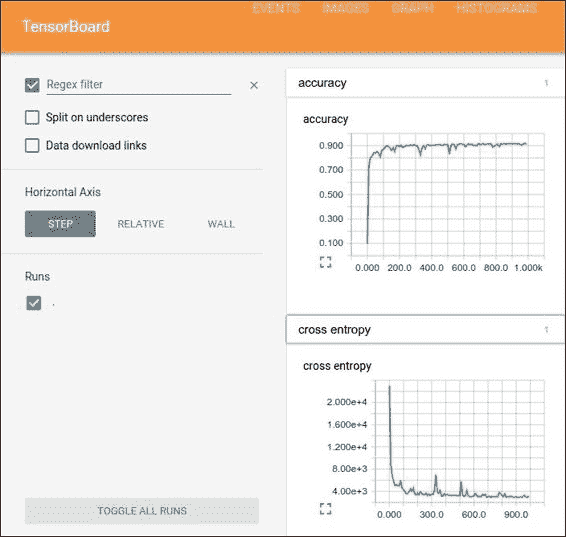

TensorBoard GUI

可以将图的所有张量和操作设置为将信息写入日志。 TensorBoard 分析在`Session`运行时正常编写的信息，并向用户显示许多图形项，每个图形项一个。

### 命令行用法

要调用 TensorBoard，命令行为：

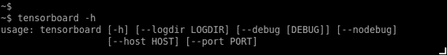

## TensorBoard 的工作方式

我们构建的每个计算图都有 TensorFlow 的实时日志记录机制，以便保存模型拥有的几乎所有信息。

但是，模型构建者必须考虑应保存的几百个信息维中的哪一个，以后才能用作分析工具。

为了保存所有必需的信息，TensorFlow API 使用了称为摘要的数据输出对象。

这些摘要将结果写入 TensorFlow 事件文件，该文件收集在`Session`运行期间生成的所有必需数据。

在以下示例中，我们将直接在生成的事件日志目录上运行 TensorBoard：

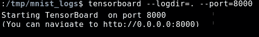

### 添加摘要节点

TensorFlow 会话中的所有摘要均由`SummaryWriter`对象编写。 调用的主要方法是：

```py
tf.train.SummaryWriter.__init__(logdir, graph_def=None) 

```

该命令将在参数的路径中创建一个`SummaryWriter`和一个事件文件。

`SummaryWriter`的构造器将在`logdir`中创建一个新的事件文件。 当您调用以下函数之一时，此事件文件将包含`Event`类型的协议缓冲区：`add_summary()`，`add_session_log()`，`add_event()`或`add_graph()`。

如果将`graph_def`协议缓冲区传递给构造器，则会将其添加到事件文件中。 （这等效于稍后调用`add_graph()`）。

当您运行 TensorBoard 时，它将从文件中读取图定义并以图形方式显示它，以便您可以与其进行交互。

首先，创建您要从中收集摘要数据的 TensorFlow 图，并确定要使用摘要操作标注的节点。

TensorFlow 中的操作在您运行它们或取决于它们的输出的操作之前不会做任何事情。 我们刚刚创建的摘要节点是图的外围：当前运行的所有操作都不依赖于它们。 因此，要生成摘要，我们需要运行所有这些摘要节点。 手动管理它们很繁琐，因此请使用`tf.merge_all_summaries`将它们组合为一个可生成所有摘要数据的操作。

然后，您可以运行合并的摘要操作，这将在给定步骤中生成一个包含所有摘要数据的序列化摘要`protobuf`对象。 最后，要将摘要数据写入磁盘，请将摘要`protobuf`传递给`tf.train.SummaryWriter`。

`SummaryWriter`在其构造器中带有`logdir`，此`logdir`非常重要，它是所有事件将被写出的目录。 同样，`SummaryWriter`可以选择在其构造器中使用`GraphDef`。 如果收到一个，TensorBoard 还将可视化您的图。

现在，您已经修改了图并具有`SummaryWriter`，就可以开始运行网络了！ 如果需要，您可以在每个步骤中运行合并的摘要操作，并记录大量的训练数据。 不过，这可能是您需要的更多数据。 相反，请考虑每 n 个步骤运行一次合并的摘要操作。

### 通用摘要操作

这是不同的摘要类型及其构造所使用的参数的列表：

*   `tf.scalar_summary(label, value, collection=None, name=None)`
*   `tf.image_summary(label, tensor, max_images=3, collection=None, name=None)`
*   `tf.histogram_summary(label, value, collection=None, name=None)`

### 特殊摘要函数

这些是特殊函数，用于合并不同操作的值，无论是摘要的集合，还是图中的所有摘要：

*   `tf.merge_summary(input, collection=None, name=None)`
*   `tf.merge_all_summaries(key="summary")`

最后，作为提高可读性的最后一项帮助，可视化对常数和汇总节点使用特殊的图标。 总而言之，这是节点符号表：

| 符号 | 含义 |
| --- | --- |
|  | 代表名称范围的高级节点。 双击以展开一个高级节点。 |
|  | 彼此不连接的编号节点序列。 |
|  | 彼此连接的编号节点序列。 |
|  | 单个操作节点。 |
|  | 一个常数。 |
|  | 摘要节点。 |
|  | 显示操作之间的数据流的边。 |
|  | 显示操作之间的控制依赖项的边。 |
|  | 显示输出操作节点可以改变输入张量的参考边。 |

### 与 TensorBoard 的 GUI 交互

通过平移和缩放来浏览图形。单击并拖动以进行平移，然后使用滚动手势进行缩放。 双击节点，或单击其`+`按钮，以展开表示操作代码的名称范围。 为了轻松跟踪缩放时的当前视点，右下角有一个小地图：

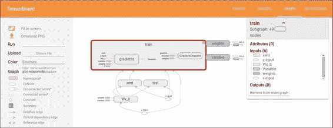

具有一个扩展的操作组和图例的 Openflow

要关闭打开的节点，请再次双击它或单击其`-`按钮。 您也可以单击一次以选择一个节点。 它将变为较暗的颜色，有关该颜色及其连接的节点的详细信息将显示在可视化文件右上角的信息卡中。

选择还有助于理解高级节点。 选择任何高度节点，其他连接的相应节点图标也会被选择。 例如，这可以轻松查看正在保存的节点和未保存的节点。

单击信息卡中的节点名称将其选中。 如有必要，视点将自动平移以使该节点可见。

最后，您可以使用图例上方的颜色菜单为图形选择两种配色方案。 默认的“结构视图”显示结构：当两个高级节点具有相同的结构时，它们以相同的彩虹色显示。 唯一结构化的节点为灰色。 第二个视图显示了不同操作在哪个设备上运行。 名称范围的颜色与设备中用于其内部操作的部分的比例成比例。

## 从磁盘读取信息

TensorFlow 读取许多最标准的格式，包括众所周知的 CSV，图像文件（JPG 和 PNG 解码器）以及标准 TensorFlow 格式。

### 列表格式 -- CSV

为了读取众所周知的 CSV 格式，TensorFlow 有自己的方法。 与其他库（例如熊猫）相比，读取简单 CSV 文件的过程稍微复杂一些。

读取 CSV 文件需要完成前面的几个步骤。 首先，我们必须使用要使用的文件列表创建文件名队列对象，然后创建`TextLineReader`。 使用此行读取器，剩下的操作将是解码 CSV 列，并将其保存在张量上。 如果我们想将同类数据混合在一起，则`pack`方法将起作用。

#### 鸢尾花数据集

鸢尾花数据集或费舍尔鸢尾花数据集是分类问题的众所周知基准。 这是罗纳德·费舍尔（Ronald Fisher）在 1936 年的论文中引入的多元数据集，该分类法是将生物分类问题中的多次测量用作线性判别分析的示例。

数据集包含来自三种鸢尾花（鸢尾鸢尾，初春鸢尾和杂色鸢尾）中每种的 50 个样本。 在每个样本中测量了四个特征：萼片和花瓣的长度和宽度，以厘米为单位。 基于这四个特征的组合，Fisher 开发了一个线性判别模型以区分物种。 （您可以在书的代码包中获取此数据集的`.csv`文件。）

为了读取 CSV 文件，您必须下载它并将其放在与 Python 可执行文件运行所在的目录中。

在下面的代码示例中，我们将从知名的鸢尾数据库中读取和打印前五个记录：

```py
import tensorflow as tf 
sess = tf.Session() 
filename_queue = tf.train.string_input_producer( 
tf.train.match_filenames_once("./*.csv"), 
shuffle=True) 
reader = tf.TextLineReader(skip_header_lines=1) 
key, value = reader.read(filename_queue) 
record_defaults = [[0.], [0.], [0.], [0.], [""]] 
col1, col2, col3, col4, col5 = tf.decode_csv(value, record_defaults=record_defaults)  # Convert CSV records to tensors. Each column maps to one tensor. 
features = tf.pack([col1, col2, col3, col4]) 

tf.initialize_all_variables().run(session=sess) 
coord = tf.train.Coordinator() 
threads = tf.train.start_queue_runners(coord=coord, sess=sess) 

for iteration in range(0, 5):
 example = sess.run([features])
 print(example)
 coord.request_stop()
 coord.join(threads)

```

这就是输出的样子：

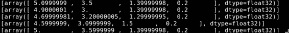

### 读取图像数据

TensorFlow 允许从图像格式导入数据，这对于导入面向图像的模型的自定义图像输入将非常有用。可接受的图像格式将为 JPG 和 PNG，内部表示形式为`uint8`张量，每个张量为图片通道的二阶张量：


要读取的样本图像

### 加载和处理图像

在此示例中，我们将加载示例图像并对其进行一些其他处理，将生成的图像保存在单独的文件中：

```py
import tensorflow as tf 
sess = tf.Session() 
filename_queue = tf.train.string_input_producer(tf.train.match_filenames_once("./blue_jay.jpg")) 
reader = tf.WholeFileReader() 
key, value = reader.read(filename_queue) 
image=tf.image.decode_jpeg(value) 
flipImageUpDown=tf.image.encode_jpeg(tf.image.flip_up_down(image)) 
flipImageLeftRight=tf.image.encode_jpeg(tf.image.flip_left_right(image)) 
tf.initialize_all_variables().run(session=sess) 
coord = tf.train.Coordinator() 
threads = tf.train.start_queue_runners(coord=coord, sess=sess) 
example = sess.run(flipImageLeftRight) 
print example 
file=open ("flippedUpDown.jpg", "wb+") 
file.write (flipImageUpDown.eval(session=sess)) 
file.close() 
file=open ("flippedLeftRight.jpg", "wb+") 
file.write (flipImageLeftRight.eval(session=sess)) 
file.close() 

```

`print example`行将逐行显示图像中 RGB 值的摘要：

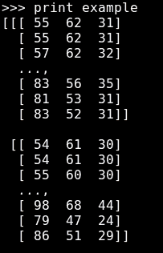

最终图像如下所示：


比较原始图像和变更后的图像（上下翻转和左右翻转）

### 从标准 TensorFlow 格式读取

另一种方法是将您拥有的任意数据转换为正式格式。 这种方法使混合和匹配数据集和网络架构变得更加容易。

您可以编写一个获取数据的小程序，将其填充到示例协议缓冲区中，将协议缓冲区序列化为字符串，然后使用`tf.python_io.TFRecordWriter`类将字符串写入`TFRecords`文件。

要读取`TFRecords`的文件，请将`tf.TFRecordReader`与`tf.parse_single_example`解码器一起使用。 `parse_single_example` `op`将示例协议缓冲区解码为张量。

# 总结

在本章中，我们学习了可应用于数据的主要数据结构和简单操作，并对计算图的各个部分进行了简要总结。

这些操作将成为即将出现的技术的基础。 通过这些类，数据科学家可以在查看当前数据的总体特征之后，确定类的分离或调整特征是否足够清晰，或者直接使用更复杂的工具，从而决定是否使用更简单的模型。

在下一章中，我们将开始构建和运行图，并使用本章中介绍的某些方法来解决问题。

