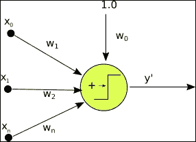
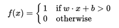
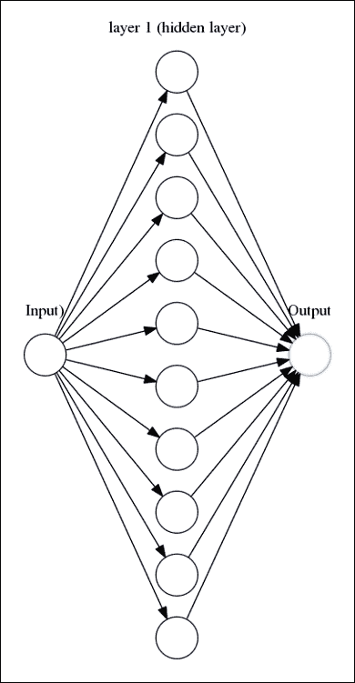
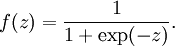
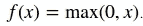
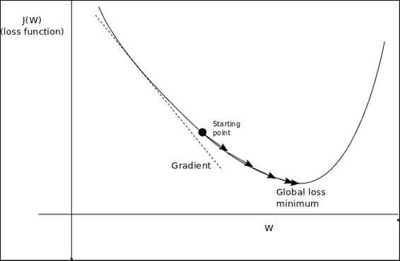
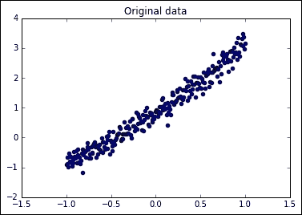
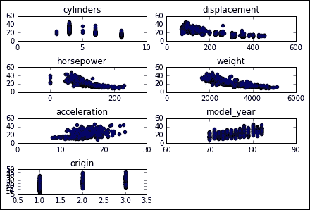
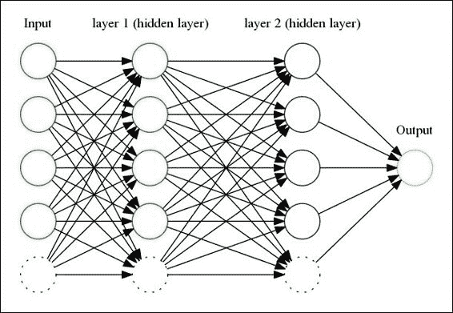
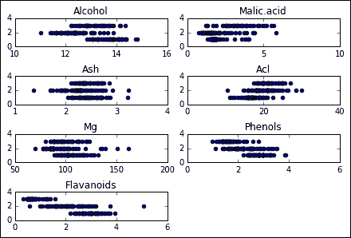

# 五、简单的前馈神经网络

神经网络确实是 Tensorflow 擅长的机器学习领域。 可以用它实现多种类型的架构和算法，以及结合了符号引擎的其他优点，这实际上将有助于训练更复杂的设置。

在本章中，我们开始利用高表现原语的功能来解决大量支持输入变量的日益复杂的问题。

在本章中，我们将介绍以下主题：

*   神经网络的初步概念
*   非线性一般函数回归的神经网络项目
*   利用非线性回归预测汽车燃油效率的项目
*   学习葡萄酒的分类和多分类

# 初步概念

为了将简单的框架构建到神经网络的组件和架构中，我们将对原始概念进行简单明了的构建，这些原始概念为当前，复杂而多样的神经网络格局铺平了道路。

## 人工神经元

人工神经元是一种数学函数，被视为真实生物神经元的模型。

它的主要特征是它接收一个或多个输入（训练数据），并对它们求和以产生输出。 此外，通常对总和进行加权（权重和偏差），然后将总和传递给非线性函数（激活函数或传递函数）。

## 原始示例 -- 感知器

感知器是实现人工神经元的最简单方法之一，并且它的算法可以追溯到 1950 年代，最早是在 1960 年代实现的。

从本质上讲，它是一种学习二分类函数的算法，该算法将一个实数映射为两个数：



下图显示了单层感知器

### 感知机算法

感知器的简化算法为：

1.  用随机分布初始化权重（通常为低值）
2.  选择一个输入向量并将其呈现给网络，
3.  为指定的输入向量和权重值计算网络的输出`y'`。
4.  用于感知机的函数是：

    

5.  如果`y' ≠ y`，则通过添加更改`Δw = yx[i]`修改所有连接`w[i]`
6.  返回步骤 2。

## 神经网络层

单层感知器可以推广到彼此连接的多个层，但是仍然存在问题；表示函数是输入的线性组合，并且感知器只是一种线性分类器，不可能正确拟合非线性函数。



## 神经网络激活函数

仅靠单变量线性分类器，神经网络的学习表现就不会那么好。 甚至机器学习中的一些轻微复杂的问题都涉及多个非线性变量，因此开发了许多变体来替代感知器的传递函数。

为了表示非线性模型，可以在激活函数中使用许多不同的非线性函数。 这意味着神经元将对输入变量的变化做出反应的方式发生变化。 实际上，最常用的激活函数是：

*   Sigmoid: 规范的激活函数，对于计算分类属性的概率具有很好的属性。

    

*   Tanh: 与 Sigmoid 非常相似，但其值范围是`[-1,1]`而不是`[0,1]`

    

*   Relu: 这称为整流线性单元，其主要优点之一是它不受“梯度消失”问题的影响，该问题通常存在于网络的第一层，趋向于 0 或很小的`epsilon`值：

    

## 梯度和反向传播算法

当我们描述感知器的学习阶段时，我们描述了根据权重对最终误差的“责任”来按比例调整权重的阶段。

在这个复杂的神经元网络中，误差的责任将分布在整个架构中应用于数据的所有函数之间。

因此，一旦我们计算了总误差，并且将整个函数应用于原始数据，我们现在就必须尝试调整方程式中的所有变量以将其最小化。

正如最优化领域所研究的那样，我们需要知道的是能够使该误差最小化的是损失函数的梯度。

鉴于数据要经过许多权重和传递函数，因此必须通过链式法则来解决合成函数的梯度。

## 最小化损失函数：梯度下降

让我们看下图以了解损失函数：



### 神经网络问题的选择 -- 分类与回归

神经网络可用于回归问题和分类问题。 架构上的共同差异在于输出层：为了能够带来实数为基础的结果，不应应用诸如 Sigmoid 之类的标准化函数，这样我们就不会将变量的结果更改为许多可能的类别值之一，获得了可能的连续结果。

## 有用的库和方法

在本章中，我们将使用 TensorFlow 和工具库中的一些新工具，这些是最重要的工具：

### TensorFlow 激活函数

TensorFlow 导航中最常用的函数：

*   `tf.sigmoid(x)`：标准 Sigmoid 函数
*   `tf.tanh(x)`：双曲正切
*   `tf.nn.relu(features)`：Relu 传递函数

TensorFlow 导航的其他函数：

*   `tf.nn.elu(features)`：计算指数线性：如果`< 0`则为`exp(features) - 1`，否则为`features`
*   `tf.nn.softsign(features)`：计算 softsign：`features / (abs(features) + 1)`
*   `tf.nn.bias_add(value, bias)`：为值增加偏差

### TensorFlow 损失优化方法

TensorFlow 损失优化方法如下所述：

*   `tf.train.GradientDescentOptimizer(learning_rate, use_locking, name)`：这是原始的梯度下降方法，仅具有学习率参数
*   `tf.train.AdagradOptimizer(learning_rate, initial_accumulator_value, use_locking, name)`：此方法使学习率适应参数的频率，从而提高了最小搜索稀疏参数的效率
*   `tf.train.AdadeltaOptimizer(learning_rate, rho, epsilon, use_locking, name)`：这是改良的 AdaGrad，它将限制频繁参数的累积到最大窗口，因此它考虑了一定数量的步骤，而不是整个参数历史记录。
*   `tf.train.AdamOptimizer tf.train.AdamOptimizer.__init__(learning_rate, beta1, beta2, epsilon, use_locking, name)`：此方法在计算梯度时会添加一个因子，该因子对应于过去梯度的平均值，等同于动量因子。 因此，来自自适应矩估计的亚当这个名字。

### Sklearn 预处理工具

让我们看一下以下 Sklearn 预处理工具：

*   `preprocessing.StandardScaler()`：数据集的正则化是许多机器学习估计器的普遍要求，因此，为了使收敛更加直接，数据集将必须更像是标准正态分布，即具有零均值和单位方差的高斯曲线。 在实践中，我们通常会忽略分布的形状，而只是通过删除每个特征的平均值来变换数据以使其居中，然后通过将非恒定特征除以它们的标准偏差来缩放它。 对于此任务，我们使用`StandardScaler`，它实现了前面提到的任务。 它还存储转换，以便能够将其重新应用于测试集。
*   `StandardScaler` 。 `fit_transform()`：简单地将数据调整为所需格式。 `StandardScaler`对象将保存转换变量，因此您将能够取回非规格化数据。
*   `cross_validation.train_test_split`：此方法将数据集分为训练和测试段，我们只需要提供分配给每个阶段的数据集的百分比即可。

# 第一个项目 -- 非线性一般函数回归

人工神经网络示例通常包含绝大多数分类问题，但实际上有大量应用可以表示为回归。

用于回归的网络架构与用于分类问题的网络架构没有很大不同：它们可以采用多变量输入，也可以使用线性和非线性激活函数。

在某些情况下，唯一必要的情况是仅在层的末尾删除类似于 Sigmoid 的函数，以允许出现所有选项。

在第一个示例中，我们将对一个简单的，有噪声的二次函数进行建模，并将尝试通过单个隐藏层网络对其进行回归，并查看我们可以多么接近地预测从测试总体中得出的值。

## 数据集说明和加载

在这种情况下，我们将使用生成的数据集，该数据集与第 3 章的线性回归中的数据集非常相似。

我们将使用常见的 Numpy 方法生成二次函数，然后添加随机噪声，这将有助于我们了解线性回归如何推广。

核心样本创建例程如下：

```py
import numpy as np 
trainsamples = 200 
testsamples = 60 
dsX = np.linspace(-1, 1, trainsamples + testsamples).transpose() 
dsY = 0.4* pow(dsX,2) +2 * dsX + np.random.randn(*dsX.shape) * 0.22 + 0.8  

```

## 数据集预处理

该数据集在生成时不需要进行预处理，并且具有良好的属性，例如居中并具有`-1, 1`的样本分布。

## 模型架构 -- 损失函数描述

此设置的损耗将简单地用均方根误差表示，如下所示：

```py
cost = tf.pow(py_x-Y, 2)/(2)  

```

## 损失函数优化器

在这种情况下，我们将使用梯度下降成本优化器，可以通过以下代码调用该优化器：

```py
train_op = tf.train.AdamOptimizer(0.5).minimize(cost)  

```

## 准确率和收敛性测试

`predict_op = tf.argmax(py_x, 1)`

```py
cost1 += sess.run(cost, feed_dict={X: [[x1]], Y: y1}) / testsamples 

```

### 示例代码

让我们看一下下面显示的示例代码：

```py
import tensorflow as tf
import numpy as np
from sklearn.utils import shuffle
%matplotlib inline
import matplotlib.pyplot as plt
trainsamples = 200
testsamples = 60
#Here we will represent the model, a simple imput, a hidden layer of sigmoid activation
def model(X, hidden_weights1, hidden_bias1, ow):
    hidden_layer =  tf.nn.sigmoid(tf.matmul(X, hidden_weights1)+ b)
    return tf.matmul(hidden_layer, ow)  
dsX = np.linspace(-1, 1, trainsamples + testsamples).transpose()
dsY = 0.4* pow(dsX,2) +2 * dsX + np.random.randn(*dsX.shape) * 0.22 + 0.8
plt.figure() # Create a new figure
plt.title('Original data')
plt.scatter(dsX,dsY) #Plot a scatter draw of the datapoints
```



```py
X = tf.placeholder("float")
Y = tf.placeholder("float")
# Create first hidden layer
hw1 = tf.Variable(tf.random_normal([1, 10], stddev=0.1))
# Create output connection
ow = tf.Variable(tf.random_normal([10, 1], stddev=0.0))
# Create bias
b = tf.Variable(tf.random_normal([10], stddev=0.1))
model_y = model(X, hw1, b, ow)
# Cost function
cost = tf.pow(model_y-Y, 2)/(2)
# construct an optimizer
train_op = tf.train.GradientDescentOptimizer(0.05).minimize(cost)
# Launch the graph in a session
with tf.Session() as sess:
    tf.initialize_all_variables().run() #Initialize all variables
    for i in range(1,100):
        dsX, dsY = shuffle (dsX.transpose(), dsY) #We randomize the samples to mplement a better training
        trainX, trainY =dsX[0:trainsamples], dsY[0:trainsamples]
        for x1,y1 in zip (trainX, trainY):
            sess.run(train_op, feed_dict={X: [[x1]], Y: y1})
        testX, testY = dsX[trainsamples:trainsamples + testsamples], dsY[0:trainsamples:trainsamples+testsamples]
        cost1=0.
        for x1,y1 in zip (testX, testY):
            cost1 += sess.run(cost, feed_dict={X: [[x1]], Y: y1}) / testsamples      
        if (i%10 == 0):
            print "Average cost for epoch " + str (i) + ":" + str(cost1)
```

## 结果描述

这是不同周期的结果的副本。请注意，由于这是一个非常简单的函数，因此即使第一次迭代也具有非常好的结果：

```py
Average cost for epoch 1:[[ 0.00753353]]
Average cost for epoch 2:[[ 0.00381996]]
Average cost for epoch 3:[[ 0.00134867]]
Average cost for epoch 4:[[ 0.01020064]]
Average cost for epoch 5:[[ 0.00240157]]
Average cost for epoch 6:[[ 0.01248318]]
Average cost for epoch 7:[[ 0.05143405]]
Average cost for epoch 8:[[ 0.00621457]]
Average cost for epoch 9:[[ 0.0007379]]
```

# 第二个项目 -- 非线性回归和汽车的燃油效率建模

在此示例中，我们将进入一个区域，其中神经网络可提供大部分附加价值； 解决非线性问题。 为了开始这一旅程，我们将基于几个变量对几种汽车模型的燃油效率建模一个回归模型，该变量可以更好地用非线性函数表示。

## 数据集说明和加载

对于这个问题，我们将分析一个非常著名的，标准的，格式正确的数据集，该数据集将使我们能够分析一个多变量问题：根据离散和连续的一些相关变量来猜测汽车的 MPG。

这可以被认为是一个玩具，并且有些过时了，但是它将为更复杂的问题铺平道路，并且具有已经被众多书目分析的优势。

属性信息

该数据集具有以下数据列：

*   `mpg`：连续
*   `cylinders`：多值离散
*   `displacement`：连续
*   `horsepower`：连续
*   `weight`：连续
*   `acceleration`：连续
*   `model year:`多值离散
*   `origin`：多值离散
*   `car name`：字符串（将不使用）

我们将不对数据进行详细的分析，但是我们可以非正式地推断出所有连续变量都与增加或减少目标变量相关：



## 数据集预处理

对于此任务，我们将使用来自 sklearn 的上述缩放器对象：

*   `scaler = preprocessing.StandardScaler()`
*   `X_train = scaler.fit_transform(X_train)`

## 模型架构

我们将要构建的是一个前馈神经网络，具有多变量输入和简单输出：



## 收敛性测试

```py
score = metrics.mean_squared_error(regressor.predict(scaler.transform(X_test)), y_test)
print('MSE: {0:f}'.format(score))
```

## 结果描述

```py
Step #99, avg. train loss: 182.33624
Step #199, avg. train loss: 25.09151
Step #300, epoch #1, avg. train loss: 11.92343
Step #400, epoch #1, avg. train loss: 11.20414
Step #500, epoch #1, avg. train loss: 5.14056
Total Mean Squared Error: 15.0792258911
```

```py
%matplotlib inline  
import matplotlib.pyplot as plt 
import pandas as pd 

from sklearn import datasets, cross_validation, metrics 
from sklearn import preprocessing 
from tensorflow.contrib import skflow 

# Read the original dataset 
df = pd.read_csv("data/mpg.csv", header=0) 
# Convert the displacement column as float 
df['displacement']=df['displacement'].astype(float) 
# We get data columns from the dataset 
# First and last (mpg and car names) are ignored for X 
X = df[df.columns[1:8]] 
y = df['mpg'] 

plt.figure() # Create a new figure 

for i in range (1,8): 
    number = 420 + i 
    ax1.locator_params(nbins=3) 
    ax1 = plt.subplot(number) 
    plt.title(list(df)[i]) 
    ax1.scatter(df[df.columns[i]],y) #Plot a scatter draw of the  datapoints 
plt.tight_layout(pad=0.4, w_pad=0.5, h_pad=1.0) 
# Split the datasets 

X_train, X_test, y_train, y_test = cross_validation.train_test_split(X, y, 
test_size=0.25) 

# Scale the data for convergency optimization 
scaler = preprocessing.StandardScaler() 

# Set the transform parameters 
X_train = scaler.fit_transform(X_train) 

# Build a 2 layer fully connected DNN with 10 and 5 units respectively 
regressor = skflow.TensorFlowDNNRegressor(hidden_units=[10, 5], 
steps=500, learning_rate=0.051, batch_size=1) 

# Fit the regressor 
regressor.fit(X_train, y_train) 

# Get some metrics based on the X and Y test data 
score = metrics.mean_squared_error(regressor.predict(scaler.transform(X_test)), y_test) 

print(" Total Mean Squared Error: " + str(score)) 

```

# 第三个项目 -- 葡萄酒分类：多类分类的学习

在本节中，我们将使用更复杂的数据集，尝试根据产地对葡萄酒进行分类。

## 数据集说明和加载

该数据包含对来自意大利同一地区但来自三个不同品种的葡萄酒进行化学分析的结果。 分析确定了三种葡萄酒中每种所含 13 种成分的数量。

数据变量：

*   醇
*   苹果酸
*   灰
*   灰的碱度
*   镁
*   总酚
*   黄酮
*   非类黄酮酚
*   花青素
*   色彩强度
*   色调
*   稀释酒的 OD280/OD315
*   脯氨酸

要读取数据集，我们将仅使用提供的 CSV 文件和熊猫：

```py
df = pd.read_csv("./wine.csv", header=0)
```



## 数据集预处理

随着 csv 上的值从 1 开始，我们将归一化带有偏差的值：

```py
y = df['Wine'].values-1 

```

对于结果，我们将这些选项表示为一个数组的热门列表：

```py
Y = tf.one_hot(indices = y, depth=3, on_value = 1., off_value = 0., axis = 1 , name = "a").eval() 

```

我们还将预先洗净值：

```py
X, Y = shuffle (X, Y) 
scaler = preprocessing.StandardScaler() 
X = scaler.fit_transform(X) 

```

## 模型架构

这个特定的模型将由一个单层，全连接的神经网络组成：

*   `x` = `tf.placeholder(tf.float32, [None, 12])`
*   `W` = `tf.Variable(tf.zeros([12, 3]))`
*   `b` = `tf.Variable(tf.zeros([3]))`
*   `y` = `tf.nn.softmax(tf.matmul(x, W) + b)`

## 损失函数说明

我们将使用交叉熵函数来衡量损失：

```py
y_ = tf.placeholder(tf.float32, [None, 3]) 
cross_entropy = tf.reduce_mean(-tf.reduce_sum(y_ * tf.log(y), reduction_indices=[1])) 

```

## 损失函数优化器

同样，将使用“梯度下降”方法来减少损失函数：

```py
train_step = tf.train.GradientDescentOptimizer(0.1).minimize(cross_entropy) 

```

## 收敛测试

在收敛性测试中，我们将每个良好的回归均转换为 1，将每个错误的回归均转换为 0，然后获取值的平均值来衡量模型的准确率：

```py
correct_prediction = tf.equal(tf.argmax(y, 1), tf.argmax(y_, 1)) 
accuracy = tf.reduce_mean(tf.cast(correct_prediction, tf.float32)) 
print(accuracy.eval({x: Xt, y_: Yt})) 

```

## 结果描述

如我们所见，随着历时的发展，我们具有可变精度，但是它总是优于 90% 的精度，具有 30% 的随机基数（如果我们生成 0 到 3 之间的随机数来猜测结果）。

```py
0.973684
0.921053
0.921053
0.947368
0.921053
```

## 完整源代码

让我们看一下完整的源代码：

```py
sess = tf.InteractiveSession() 
import pandas as pd 
# Import data 
from tensorflow.examples.tlutorials.mnist import input_data 
from sklearn.utils import shuffle 
import tensorflow as tf 

from sklearn import preprocessing 

flags = tf.app.flags 
FLAGS = flags.FLAGS 

df = pd.read_csv("./wine.csv", header=0) 
print (df.describe()) 
#df['displacement']=df['displacement'].astype(float) 
X = df[df.columns[1:13]].values 
y = df['Wine'].values-1 
Y = tf.one_hot(indices = y, depth=3, on_value = 1., off_value = 0., axis = 1 , name = "a").eval() 
X, Y = shuffle (X, Y) 

scaler = preprocessing.StandardScaler() 
X = scaler.fit_transform(X) 

# Create the model 
x = tf.placeholder(tf.float32, [None, 12]) 
W = tf.Variable(tf.zeros([12, 3])) 
b = tf.Variable(tf.zeros([3])) 
y = tf.nn.softmax(tf.matmul(x, W) + b) 

# Define loss and optimizer 
y_ = tf.placeholder(tf.float32, [None, 3]) 
cross_entropy = tf.reduce_mean(-tf.reduce_sum(y_ * tf.log(y), reduction_indices=[1])) 
train_step = tf.train.GradientDescentOptimizer(0.1).minimize(cross_entropy) 
# Train 
tf.initialize_all_variables().run() 
for i in range(100): 
X,Y =shuffle (X, Y, random_state=1) 

Xtr=X[0:140,:] 
Ytr=Y[0:140,:] 

Xt=X[140:178,:] 
Yt=Y[140:178,:] 
Xtr, Ytr = shuffle (Xtr, Ytr, random_state=0) 
#batch_xs, batch_ys = mnist.train.next_batch(100) 
batch_xs, batch_ys = Xtr , Ytr 
train_step.run({x: batch_xs, y_: batch_ys}) 
cost = sess.run (cross_entropy, feed_dict={x: batch_xs, y_: batch_ys}) 
# Test trained model 
correct_prediction = tf.equal(tf.argmax(y, 1), tf.argmax(y_, 1)) 
accuracy = tf.reduce_mean(tf.cast(correct_prediction, tf.float32)) 
print(accuracy.eval({x: Xt, y_: Yt})) 

```

# 总结

在本章中，我们已经开始着手实现 TensorFlow 能力的真正替代物：神经网络模型。

我们还看到了在回归和分类任务中使用简单神经网络，简单生成模型和实验模型的情况。

在下一章中，我们将以卷积神经网络的形式提高新架构的知识以及将神经网络范式应用于其他知识领域（例如计算机视觉）的方式。

