# 七、循环神经网络和 LSTM

回顾我们对更传统的神经网络模型的了解后，我们发现训练阶段和预测阶段通常以静态方式表示，其中输入作为输入，而我们得到输出，但我们不仅考虑了事件发生的顺序。与到目前为止回顾的预测模型不同，循环神经网络的预测取决于当前的输入向量以及先前的输入向量。

我们将在本章中介绍的主题如下：

*   了解循环神经网络的工作原理以及构建它们的主要操作类型
*   解释在更高级的模型（例如 LSTM）中实现的想法
*   在 TensorFlow 中应用 LSTM 模型来预测能耗周期
*   撰写新音乐，从 J.S Bach 的一系列研究开始

# 循环神经网络

知识通常不会从虚无中出现。 许多新的想法是先前知识的结合而诞生的，因此这是一种有用的模仿行为。 传统的神经网络不包含任何将先前看到的元素转换为当前状态的机制。

为了实现这一概念，我们有循环神经网络，即 RNN。 可以将循环神经网络定义为神经网络的顺序模型，该模型具有重用已给定信息的特性。 他们的主要假设之一是，当前信息依赖于先前的数据。 在下图中，我们观察到称为单元的 RNN 基本元素的简化图：

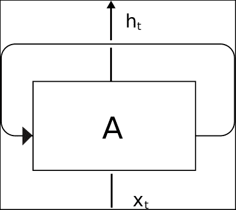

单元的主要信息元素是输入（`Xt`），状态和输出（`ht`）。 但是正如我们之前所说，单元没有独立的状态，因此它还存储状态信息。 在下图中，我们将显示一个“展开”的 RNN 单元，显示其从初始状态到输出最终`h[n]`值的过程，中间有一些中间状态。

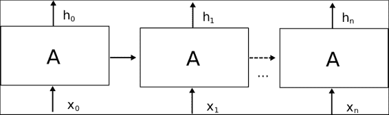

一旦我们定义了单元的动态性，下一个目标就是研究制造或定义 RNN 单元的内容。 在标准 RNN 的最常见情况下，仅存在一个神经网络层，该神经网络层将输入和先前状态作为输入，应用 tanh 操作，并输出新状态`h(t+1).`

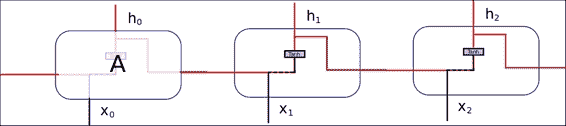

这种简单的设置能够随着周期的过去而对信息进行汇总，但是进一步的实验表明，对于复杂的知识而言，序列距离使得难以关联某些上下文（例如，建筑师知道设计漂亮的建筑物）似乎是一种简单的结构， 请记住，但是将它们关联所需的上下文需要增加顺序才能将两个概念关联起来。 这也带来了爆炸和消失梯度的相关问题。

## 梯度爆炸和消失

循环神经网络的主要问题之一发生在反向传播阶段，鉴于其循环性质，误差反向传播所具有的步骤数与一个非常深的网络相对应。 梯度计算的这种级联可能在最后阶段导致非常不重要的值，或者相​​反，导致不断增加且不受限制的参数。 这些现象被称为消失和爆炸梯度。 这是创建 LSTM 架构的原因之一。

## LSTM 神经网络

长短期内存（LSTM）是一种特定的 RNN 架构，其特殊的架构使它们可以表示长期依赖性。 而且，它们是专门为记住长时间的信息模式和信息而设计的。

## 门操作 -- 基本组件

为了更好地理解 lstm 单元内部的构造块，我们将描述 LSTM 的主要操作块：门操作。

此操作基本上有一个多元输入，在此块中，我们决定让一些输入通过，将其他输入阻塞。 我们可以将其视为信息过滤器，并且主要有助于获取和记住所需的信息元素。

为了实现此操作，我们采用了一个多元控制向量（标有箭头），该向量与具有 Sigmoid 激活函数的神经网络层相连。 应用控制向量并通过 Sigmoid 函数，我们将得到一个类似于二元的向量。

我们将用许多开关符号来表示此操作：

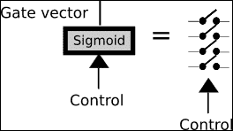

定义了二元向量后，我们将输入函数与向量相乘，以便对其进行过滤，仅让部分信息通过。 我们将用一个三角形来表示此操作，该三角形指向信息行进的方向。

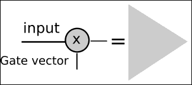

LSTM 单元格的一般结构

在下面的图片中，我们代表了 LSTM 单元的一般结构。 它主要由上述三个门操作组成，以保护和控制单元状态。

此操作将允许丢弃（希望不重要）低状态数据，并且将新数据（希望重要）合并到状态中。

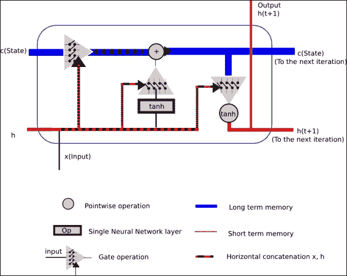

上一个图试图显示一个 LSTM 单元的运行中发生的所有概念。

作为输入，我们有：

*   单元格状态将存储长期信息，因为它从一开始就从单元格训练的起点进行优化的权重，并且
*   短期状态`h(t)`，将在每次迭代中直接与当前输入结合使用，因此，其状态将受输入的最新值的影响更大

作为输出，我们得到了结合所有门操作的结果。

## 操作步骤

在本节中，我们将描述信息将对其操作的每个循环步骤执行的所有不同子步骤的概括。

### 第 1 部分 -- 设置要忘记的值（输入门）

在本节中，我们将采用来自短期的值，再加上输入本身，并且这些值将由多元 Sigmoid 表示的二元函数的值设置。 根据输入和短期记忆值，Sigmoid 输出将允许或限制一些先前的知识或单元状态中包含的权重。

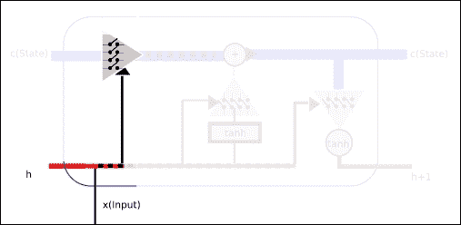

### 第 2 部分 -- 设置要保留的值，更改状态

然后是时候设置过滤器了，该过滤器将允许或拒绝将新的和短期的内存合并到单元半永久状态。

因此，在此阶段，我们将确定将多少新信息和半新信息合并到新单元状态中。 此外，我们最终将通过我们一直在配置的信息过滤器，因此，我们将获得更新的长期状态。

为了规范新的和短期的信息，我们通过具有`tanh`激活的神经网络传递新的和短期的信息，这将允许在正则化（`-1,1`）范围内提供新信息。

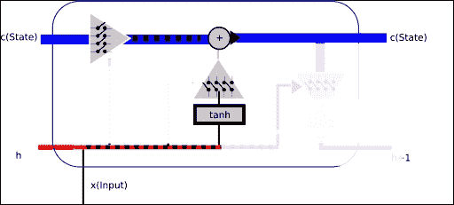

### 第 3 部分 -- 输出已过滤的单元状态

现在轮到短期状态了。 它还将使用新的和先前的短期状态来允许新信息通过，但是输入将是长期状态，点乘以 tanh 函数，再一次将输入标准化为（`-1,1`）范围。

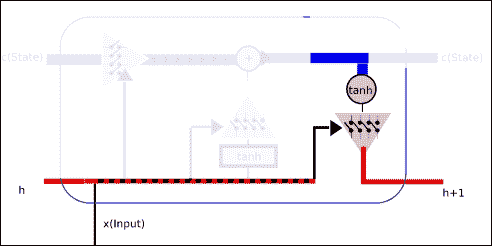

## 其他 RNN 架构

通常，在本章中，假设 RNN 的领域更为广泛，我们将集中讨论 LSTM 类型的循环神经网络单元。 例如，还采用了 RNN 的其他变体，并为该领域增加了优势。

*   具有窥孔的 LSTM：在此网络中，单元门连接到单元状态
*   门控循环单元：这是一个更简单的模型，它结合了忘记门和输入门，合并了单元的状态和隐藏状态，因此大大简化了网络的训练

## TensorFlow LSTM 有用的类和方法

在本节中，我们将回顾可用于构建 LSTM 层的主要类和方法，我们将在本书的示例中使用它们。

### 类`tf.nn.rnn_cell.BasicLSTMCell`

此类基本的 LSTM 循环网络单元，具有遗忘偏差，并且没有其他相关类型（如窥孔）的奇特特性，即使在不应影响的阶段，它也可以使单元查看所得状态。

以下是主要参数：

*   `num_units`：整数，LSTM 单元的单元数
*   `forget_bias`：浮动，此偏差（默认为`1`）被添加到忘记门，以便允许第一次迭代以减少初始训练步骤的信息丢失。
*   `activation`：内部状态的激活函数（默认为标准`tanh`）

### 类`MultiRNNCell`（`RNNCell`）

在将用于此特定示例的架构中，我们将不会使用单个单元来考虑历史值。 在这种情况下，我们将使用一组连接的单元格。 因此，我们将实例化`MultiRNNCell`类。

```py
MultiRNNCell(cells, state_is_tuple=False)
```

这是`multiRNNCell`的构造器，此方法的主要参数是单元格，它将是我们要堆叠的`RNNCells`的实例。

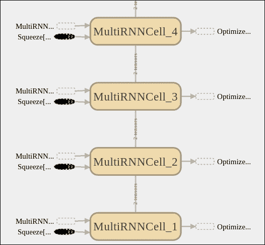

### `learning.ops.split_squeeze(dim, num_split, tensor_in)`

此函数将输入拆分为一个维度，然后压缩拆分后的张量所属的前一个维度。 它需要切割的尺寸，切割方式的数量，然后是张量的切割。 它返回相同的张量，但缩小一维。

# 示例 1 -- 能耗数据的单变量时间序列预测

在此示例中，我们将解决回归域的问题。 我们将要处理的数据集是一个周期内对一个家庭的许多功耗量度的汇总。 正如我们可以推断的那样，这种行为很容易遵循以下模式（当人们使用微波炉准备早餐时，这种行为会增加，醒来后的电脑数量会有所增加，下午可能会有所减少，而到了晚上，一切都会增加。 灯，从午夜开始直到下一个起床时间减少为零）。

因此，让我们尝试在一个示例案例中对此行为进行建模。

## 数据集说明和加载

在此示例中，我们将使用 [Artur Trindade](https://archive.ics.uci.edu/ml/datasets/ElectricityLoadDiagrams20112014) 的电力负荷图数据集。

这是原始数据集的描述：

> 数据集没有缺失值。 每 15 分钟以 kW 为单位的值。 要以 kWh 为单位转换值，必须将值除以 4。每一列代表一个客户端。 在 2011 年之后创建了一些客户。在这些情况下，消费被视为零。 所有时间标签均以葡萄牙语小时为单位。 但是，整天呈现 96 个小节（`24 * 15`）。 每年 3 月的时间更改日（只有 23 小时），所有时间点的凌晨 1:00 和 2:00 之间均为零。 每年 10 月的时间变更日（有 25 个小时），上午 1:00 和凌晨 2:00 之间的值合计消耗两个小时。

为了简化我们的模型描述，我们仅对一位客户进行了完整的测量，并将其格式转换为标准 CSV。 它位于本章代码文件夹的数据子文件夹中

使用以下代码行，我们将打开并表示客户的数据：

```py
import pandas as pd 
from matplotlib import pyplot as plt
df = pd.read_csv("data/elec_load.csv", error_bad_lines=False)
plt.subplot()
plot_test, = plt.plot(df.values[:1500], label='Load')
plt.legend(handles=[plot_test])
```

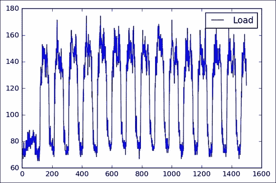

我看一下这种表示形式（我们看一下前 1500 个样本），我们看到了一个初始瞬态状态，可能是在进行测量时可能出现的状态，然后我们看到了一个清晰的高，低功耗水平的循环。

从简单的观察中，我们还可以看到冰柱或多或少是 100 个样本的，非常接近该数据集每天的 96 个样本。

## 数据集预处理

为了确保反向传播方法更好的收敛性，我们应该尝试对输入数据进行正则化。

因此，我们将应用经典的缩放和居中技术，减去平均值，然后按最大值的底数进行缩放。

为了获得所需的值，我们使用熊猫`describe()`方法。

```py
                Load 
count  140256.000000 
mean      145.332503 
std        48.477976 
min         0.000000 
25%       106.850998 
50%       151.428571 
75%       177.557604 
max       338.218126 

```

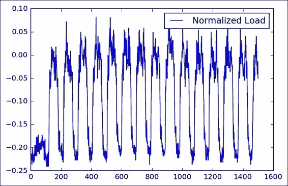

## 模型架构

在这里，我们将简要描述将尝试对电力消耗变化进行建模的架构：

最终的架构基本上由 10 个成员连接的 LSTM 多单元组成，该单元的末尾具有线性回归或变量，对于给定的历史记录，它将线性单元数组输出的结果转换为最终的实数。 值（在这种情况下，我们必须输入最后 5 个值才能预测下一个）。

```py
def lstm_model(time_steps, rnn_layers, dense_layers=None): 
    def lstm_cells(layers): 
        return [tf.nn.rnn_cell.BasicLSTMCell(layer['steps'],state_is_tuple=True) 
                for layer in layers] 

    def dnn_layers(input_layers, layers): 
            return input_layers 

    def _lstm_model(X, y): 
        stacked_lstm = tf.nn.rnn_cell.MultiRNNCell(lstm_cells(rnn_layers), state_is_tuple=True) 
        x_ = learn.ops.split_squeeze(1, time_steps, X) 
        output, layers = tf.nn.rnn(stacked_lstm, x_, dtype=dtypes.float32) 
        output = dnn_layers(output[-1], dense_layers) 
        return learn.models.linear_regression(output, y) 

    return _lstm_model 

```

下图显示了主要模块，随后由学习模块进行了补充，您可以在其中看到 RNN 阶段，优化器以及输出之前的最终线性回归。

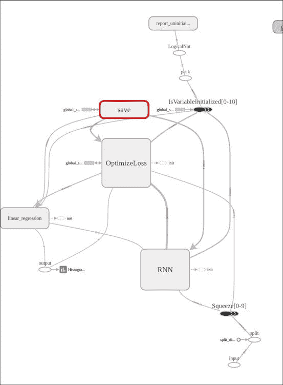

在这张图片中，我们看了 RNN 阶段，在那里我们可以观察到各个 LSTM 单元的级联，输入的挤压以及该学习包所添加的所有互补操作。

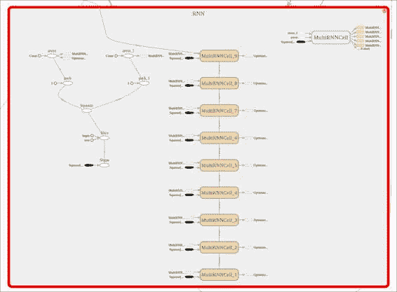

然后，我们将使用回归器完成模型的定义：

```py
regressor = learn.TensorFlowEstimator(model_fn=lstm_model( 
                                    TIMESTEPS, RNN_LAYERS, DENSE_LAYERS), n_classes=0, 
                                      verbose=2,  steps=TRAINING_STEPS, optimizer='Adagrad', 
                                      learning_rate=0.03, batch_size=BATCH_SIZE) 

```

## 损失函数说明

对于损失函数，经典回归参数均方误差将：

```py
rmse = np.sqrt(((predicted - y['test']) ** 2).mean(axis=0))
```

## 收敛性测试

在这里，我们将为当前模型运行拟合函数：

```py
regressor.fit(X['train'], y['train'], monitors=[validation_monitor], logdir=LOG_DIR) 

```

并将获得以下内容（很好）！ 错误率。 我们可以做的一项工作是避免对数据进行标准化，并查看平均误差是否相同（注意：不是，差很多）

这是我们将获得的简单控制台输出：

```py
MSE: 0.001139 

```

这是生成的损耗/均值图形，它告诉我们误差在每次迭代中如何衰减：


## 结果描述

现在我们可以得到真实测试值和预测值的图形，在图形中我们可以看到平均误差表明我们的循环模型具有很好的预测能力：

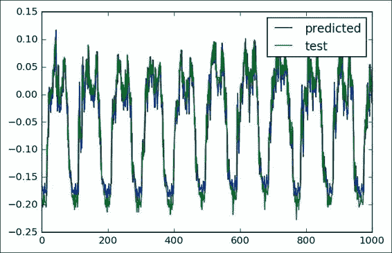

## 完整源代码

以下是完整的源代码：

```py

import numpy as np 
import pandas as pd 
import tensorflow as tf 
from matplotlib import pyplot as plt 

from tensorflow.python.framework import dtypes 
from tensorflow.contrib import learn 

import logging 
logging.basicConfig(level=logging.INFO) 

from tensorflow.contrib import learn 
from sklearn.metrics import mean_squared_error 

LOG_DIR = './ops_logs' 
TIMESTEPS = 5 
RNN_LAYERS = [{'steps': TIMESTEPS}] 
DENSE_LAYERS = None 
TRAINING_STEPS = 10000 
BATCH_SIZE = 100 
PRINT_STEPS = TRAINING_STEPS / 100 

def lstm_model(time_steps, rnn_layers, dense_layers=None): 
    def lstm_cells(layers): 
        return [tf.nn.rnn_cell.BasicLSTMCell(layer['steps'],state_is_tuple=True) 
                for layer in layers] 

    def dnn_layers(input_layers, layers): 
            return input_layers 

    def _lstm_model(X, y): 
        stacked_lstm = tf.nn.rnn_cell.MultiRNNCell(lstm_cells(rnn_layers), state_is_tuple=True) 
        x_ = learn.ops.split_squeeze(1, time_steps, X) 
        output, layers = tf.nn.rnn(stacked_lstm, x_, dtype=dtypes.float32) 
        output = dnn_layers(output[-1], dense_layers) 
        return learn.models.linear_regression(output, y) 

    return _lstm_model 

regressor = learn.TensorFlowEstimator(model_fn=lstm_model(TIMESTEPS, RNN_LAYERS, DENSE_LAYERS), n_classes=0, 
                                      verbose=2,  steps=TRAINING_STEPS, optimizer='Adagrad', 
                                      learning_rate=0.03, batch_size=BATCH_SIZE) 

df = pd.read_csv("data/elec_load.csv", error_bad_lines=False) 
plt.subplot() 
plot_test, = plt.plot(df.values[:1500], label='Load') 
plt.legend(handles=[plot_test]) 

print df.describe() 
array=(df.values- 147.0) /339.0 
plt.subplot() 
plot_test, = plt.plot(array[:1500], label='Normalized Load') 
plt.legend(handles=[plot_test]) 

listX = [] 
listy = [] 
X={} 
y={} 

for i in range(0,len(array)-6): 
    listX.append(array[i:i+5].reshape([5,1])) 
    listy.append(array[i+6]) 

arrayX=np.array(listX) 
arrayy=np.array(listy) 

X['train']=arrayX[0:12000] 
X['test']=arrayX[12000:13000] 
X['val']=arrayX[13000:14000] 

y['train']=arrayy[0:12000] 
y['test']=arrayy[12000:13000] 
y['val']=arrayy[13000:14000] 

# print y['test'][0] 
# print y2['test'][0] 

#X1, y2 = generate_data(np.sin, np.linspace(0, 100, 10000), TIMESTEPS, seperate=False) 
# create a lstm instance and validation monitor 
validation_monitor = learn.monitors.ValidationMonitor(X['val'], y['val'], 
                                                      every_n_steps=PRINT_STEPS, 
                                                      early_stopping_rounds=1000) 

regressor.fit(X['train'], y['train'], monitors=[validation_monitor], logdir=LOG_DIR) 

predicted = regressor.predict(X['test']) 
rmse = np.sqrt(((predicted - y['test']) ** 2).mean(axis=0)) 
score = mean_squared_error(predicted, y['test']) 
print ("MSE: %f" % score) 

#plot_predicted, = plt.plot(array[:1000], label='predicted') 

plt.subplot() 
plot_predicted, = plt.plot(predicted, label='predicted') 

plot_test, = plt.plot(y['test'], label='test') 
plt.legend(handles=[plot_predicted, plot_test]) 

```

# 示例 2 -- 编写音乐 A La Bach

在此示例中，我们将使用专门针对字符序列或字符 RNN 模型的循环神经网络。

我们将使用一系列基于字符的格式表达的音乐，即巴赫·戈德堡变奏曲（Bach Goldberg Variations），馈入该神经网络，并根据所学的结构编写一首音乐样本。

### 注意

请注意，此示例归功于[《可视化和理解循环网络》](https://arxiv.org/abs/1506.02078)和[标题为“循环神经网络的不合理有效性”的文章](http://karpathy.github.io/2015/05/21/rnn-effectiveness/)，该文章提供了许多想法和概念。

## 字符级别模型

如我们先前所见，字符 RNN 模型可用于字符序列。 这类输入可以代表多种可能的语言。 以下是一些示例：

*   代码
*   不同的人类语言（某些作者的写作风格的建模）
*   科学论文（tex）等

### 字符序列和概率表示

RNN 的输入内容需要一种清晰直接的表示方式。 因此，选择单热表示，可以方便地将其直接用于表征有限数量的可能结果（有限字符的数量是有限的并且以十为单位）的输出，并可以将其与 `Softmax`函数值。

因此，模型的输入是字符序列，模型的输出将是每个实例的数组序列。 数组的长度将与词汇表的大小相同，因此，给定先前输入的序列字符，每个数组位置将代表当前字符在此序列位置中的概率。

在下图中，我们观察到一个非常简化的设置模型，其中编码的输入单词和该模型预测单词`TEST`作为预期的输出：

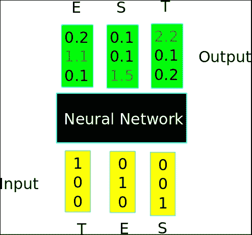

### 将音乐编码为字符 -- ABC 音乐格式

搜索表示输入数据的格式时，如果可能的话，选择一种更简单但结构上均一的格式很重要。

关于音乐表示，ABC 格式是一种合适的选择，因为它的结构非常简单，使用的字符数有限，并且是 ASCII 字符集的子集。

#### ABC 格式数据组织

ABC 格式页面主要包含两个组件：标头和注释。

*   `Header`：标头包含一些键：值行，例如`X:[Reference number]`，`T:[Title]`，`M:[Meter]`，`K:[Key]`和`C[Composer]`。
*   注释：注释从`K`标题键之后开始，并列出每个小节的不同注释，以`|`字符分隔。

还有其他元素，但是通过以下示例，即使没有音乐训练，您也将了解格式的工作原理：

原始样本如下：

```py
X:1 
T:Notes 
M:C 
L:1/4 
K:C 
C, D, E, F,|G, A, B, C|D E F G|A B c d|e f g a|b c' d' e'|f' g' a' b'|] 

```

最终表示如下：

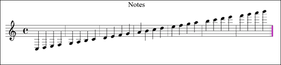

巴赫·戈德堡的变化：

巴赫·戈德堡（Bach Goldberg）变奏曲是一组原始的咏叹调，并基于该咏叹调创作了 30 部作品，以巴赫的门徒约翰·哥特利布·戈德堡（Johann Gottlieb Goldberg）的名字命名，他可能是其主要的解释者。

在下一个清单和图中，我们将表示变体`Nr 1`的第一部分，因此您对我们将尝试模仿的文档结构有所了解：

```py
X:1  
T:Variation no. 1  
C:J.S.Bach  
M:3/4  
L:1/16  
Q:500  
V:2 bass  
K:G  
[V:1]GFG2- GDEF GAB^c |d^cd2- dABc defd |gfg2- gfed ^ceAG|  
[V:2]G,,2B,A, B,2G,2G,,2G,2 |F,,2F,E, F,2D,2F,,2D,2 |E,,2E,D, E,2G,2A,,2^C2|  
%  (More parts with V:1 and V:2) 

```

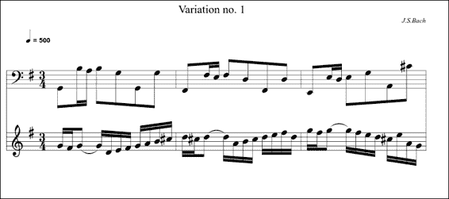

### 有用的库和方法

在本节中，我们将学习在此示例中将使用的新函数。

### 保存和还原变量和模型

对于现实世界的应用来说，一项非常重要的能力是能够保存和检索整个模型。 TensorFlow 通过`tf.train.Saver`对象提供此功能。

该对象的主要方法如下：

*   `tf.train.Saver(args)`：这是构造器。 这是主要参数的列表：
    *   `var_list`：这是一个列表，其中包含要保存的所有变量的列表。 例如，{`firstvar: var1`，`secondvar: var2`}。 如果不存在，请保存所有对象。
    *   `max_to_keep`：这表示要维护的最大检查点数。
    *   `write_version`：这是文件格式版本，实际上只有 1 个有效。
*   `tf.train.Saver.save`：此方法运行由构造器添加的用于保存变量的操作。 这需要当前会​​话，并且所有变量都已初始化。 主要参数如下：
    *   `session`：这是保存变量的会话
    *   `save_path`：这是检查点文件名的路径
    *   `global_step`：这是唯一的步骤标识符

此方法返回保存检查点的路径。

*   `tf.train.Saver.restore`：此方法恢复以前保存的变量。 主要参数如下：
    *   `session`：会话是要还原变量的位置
    *   `save_path`：这是先前由`save`方法，对`last_checkpoint()`的调用或提供的变量先前返回的变量

### 加载和保存的伪代码

在这里，我们将使用一些示例代码来构建用于保存和检索两个示例变量的最小结构。

#### 变量保存

以下是创建变量的代码：

```py
# Create some variables.simplevar = tf.Variable(..., name="simple")anothervar = tf.Variable(..., name="another")...# Add ops to save and restore all the variables.saver = tf.train.Saver()# Later, launch the model, initialize the variables, do some work, save the# variables to disk.with tf.Session() as sess:  sess.run(tf.initialize_all_variables())  # Do some work with the model.  ..  # Save the variables to disk.  save_path = saver.save(sess, "/tmp/model.ckpt")
```

#### 变量还原

以下是用于还原变量的代码：

```py
saver = tf.train.Saver()
# Later, launch the model, use the saver to restore variables from disk, and
# do some work with the model.
with tf.Session() as sess:
#Work with the restored model....

```

## 数据集说明和加载

对于此数据集，我们从 30 幅作品开始，然后生成其随机分布的`1000`个实例的列表：

```py
import random 
input = open('input.txt', 'r').read().split('X:') 
for i in range (1,1000): 
    print "X:" + input[random.randint(1,30)] + "\n_____________________________________\n" 

```

## 网络训练

网络训练的原始材料将是 ABC 格式的`30`作品。

### 注意

请注意，原始 ABC 文件位于[此链接](http://www.barfly.dial.pipex.com/Goldbergs.abc)。

然后，我们使用这个小程序。

对于此数据集，我们从`30`作品开始，然后生成一个随机分布的`1000`实例列表：

```py
import random 
input = open('original.txt', 'r').read().split('X:') 
for i in range (1,1000): 
    print "X:" + input[random.randint(1,30)] + "\n_____________________________________\n" 

```

然后我们执行以下命令来获取数据集：

```py
python generate_dataset.py > input.txt 

```

## 数据集预处理

生成的数据集在有用之前需要一些信息。 首先，它需要词汇的定义。

### 词汇定义

该过程的第一步是找到可以在原始文本中找到的所有不同字符，以便以后能够确定尺寸并填充单热编码输入。

在下图中，我们表示以 ABC 音乐格式找到的不同字符。 在这里，您可以看到标准中包含普通和特殊标点符号的内容：

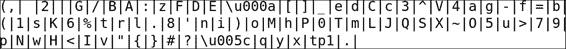

### 模型架构

下面的行中描述了此 RNN 的模型，它是具有初始零状态的多层 LSTM：

```py
        cell_fn = rnn_cell.BasicLSTMCell  
        cell = cell_fn(args.rnn_size, state_is_tuple=True) 
        self.cell = cell = rnn_cell.MultiRNNCell([cell] * args.num_layers, state_is_tuple=True) 
        self.input_data = tf.placeholder(tf.int32, [args.batch_size, args.seq_length]) 
        self.targets = tf.placeholder(tf.int32, [args.batch_size, args.seq_length]) 
        self.initial_state = cell.zero_state(args.batch_size, tf.float32) 
        with tf.variable_scope('rnnlm'): 
            softmax_w = tf.get_variable("softmax_w", [args.rnn_size, args.vocab_size])  
            softmax_b = tf.get_variable("softmax_b", [args.vocab_size])   
            with tf.device("/cpu:0"): 
                embedding = tf.get_variable("embedding", [args.vocab_size, args.rnn_size]) 
                inputs = tf.split(1, args.seq_length, tf.nn.embedding_lookup(embedding, self.input_data)) 
                inputs = [tf.squeeze(input_, [1]) for input_ in inputs] 
        def loop(prev, _): 
            prev = tf.matmul(prev, softmax_w) + softmax_b 
            prev_symbol = tf.stop_gradient(tf.argmax(prev, 1)) 
            return tf.nn.embedding_lookup(embedding, prev_symbol) 
        outputs, last_state = seq2seq.rnn_decoder(inputs, self.initial_state, cell, loop_function=loop if infer else None, scope='rnnlm') 
        output = tf.reshape(tf.concat(1, outputs), [-1, args.rnn_size]) 

```

## 损失函数说明

损失函数由`losss_by_example`函数定义。 这是基于一种称为“困惑性”的度量，该度量可测量概率分布预测样本的程度。 此度量在语言模型中广泛使用：

```py
        self.logits = tf.matmul(output, softmax_w) + softmax_b 
        self.probs = tf.nn.softmax(self.logits) 
        loss = seq2seq.sequence_loss_by_example([self.logits], 
                [tf.reshape(self.targets, [-1])], 
                [tf.ones([args.batch_size * args.seq_length])], 
                args.vocab_size) 
        self.cost = tf.reduce_sum(loss) / args.batch_size / args.seq_length 

```

## 停止条件

程序将迭代直到达到周期数和批号为止。 这是条件块：

```py
if (e==args.num_epochs-1 and b == data_loader.num_batches-1) 

```

## 结果描述

为了运行程序，首先使用以下代码运行训练脚本：

```py
python train.py 

```

然后，使用以下代码运行示例程序：

```py
python sample.py 

```

配置`X:1\n`的质数，这是一个可能的初始化字符序列，我们可以根据 RNN 的深度（建议 3）和长度（建议 512）获得几乎可以识别的完整构图。

根据现场诊断，获得了以下乐谱，将得到的字符序列复制到 [drawthedots.com](http://www.drawthedots.com/) 并进行简单的字符校正：


## 完整源代码

以下是完整的源代码（`train.py`）：

```py
from __future__ import print_function 
import numpy as np 
import tensorflow as tf 

import argparse 
import time 
import os 
from six.moves import cPickle 
from utils import TextLoader 
from model import Model 
class arguments: 
    def __init__(self): 
        return 
def main(): 
    args = arguments()     
    train(args) 
def train(args): 
    args.data_dir='data/'; args.save_dir='save'; args.rnn_size =64; 
    args.num_layers=1;  args.batch_size=50;args.seq_length=50 
    args.num_epochs=5;args.save_every=1000; args.grad_clip=5\. 
    args.learning_rate=0.002; args.decay_rate=0.97 
    data_loader = TextLoader(args.data_dir, args.batch_size, args.seq_length) 
    args.vocab_size = data_loader.vocab_size 
    with open(os.path.join(args.save_dir, 'config.pkl'), 'wb') as f: 
        cPickle.dump(args, f) 
    with open(os.path.join(args.save_dir, 'chars_vocab.pkl'), 'wb') as f: 
        cPickle.dump((data_loader.chars, data_loader.vocab), f) 
    model = Model(args) 
    with tf.Session() as sess: 
        tf.initialize_all_variables().run() 
        saver = tf.train.Saver(tf.all_variables()) 
        for e in range(args.num_epochs): 
            sess.run(tf.assign(model.lr, args.learning_rate * (args.decay_rate ** e))) 
            data_loader.reset_batch_pointer() 
            state = sess.run(model.initial_state) 
            for b in range(data_loader.num_batches): 
                start = time.time() 
                x, y = data_loader.next_batch() 
                feed = {model.input_data: x, model.targets: y} 
                for i, (c, h) in enumerate(model.initial_state): 
                    feed[c] = state[i].c 
                    feed[h] = state[i].h 
                train_loss, state, _ = sess.run([model.cost, model.final_state, model.train_op], feed) 
                end = time.time() 
                print("{}/{} (epoch {}), train_loss = {:.3f}, time/batch = {:.3f}" \ 
                    .format(e * data_loader.num_batches + b, 
                            args.num_epochs * data_loader.num_batches, 
                            e, train_loss, end - start)) 
                if (e==args.num_epochs-1 and b == data_loader.num_batches-1): # save for the last result 
                    checkpoint_path = os.path.join(args.save_dir, 'model.ckpt') 
                    saver.save(sess, checkpoint_path, global_step = e * data_loader.num_batches + b) 
                    print("model saved to {}".format(checkpoint_path)) 

if __name__ == '__main__': 
    main() 

```

以下是完整的源代码（`model.py`）：

```py
import tensorflow as tf
from tensorflow.python.ops import rnn_cell
from tensorflow.python.ops import seq2seq
import numpy as np

class Model():
    def __init__(self, args, infer=False):
        self.args = args
        if infer: #When we sample, the batch and sequence lenght are = 1
            args.batch_size = 1
            args.seq_length = 1
        cell_fn = rnn_cell.BasicLSTMCell #Define the internal cell structure
        cell = cell_fn(args.rnn_size, state_is_tuple=True)
        self.cell = cell = rnn_cell.MultiRNNCell([cell] * args.num_layers, state_is_tuple=True)
        #Build the inputs and outputs placeholders, and start with a zero internal values
        self.input_data = tf.placeholder(tf.int32, [args.batch_size, args.seq_length])
        self.targets = tf.placeholder(tf.int32, [args.batch_size, args.seq_length])
        self.initial_state = cell.zero_state(args.batch_size, tf.float32)
        with tf.variable_scope('rnnlm'):
            softmax_w = tf.get_variable("softmax_w", [args.rnn_size, args.vocab_size]) #Final w
            softmax_b = tf.get_variable("softmax_b", [args.vocab_size]) #Final bias
            with tf.device("/cpu:0"):
                embedding = tf.get_variable("embedding", [args.vocab_size, args.rnn_size])
                inputs = tf.split(1, args.seq_length, tf.nn.embedding_lookup(embedding, self.input_data))
                inputs = [tf.squeeze(input_, [1]) for input_ in inputs]
        def loop(prev, _):
            prev = tf.matmul(prev, softmax_w) + softmax_b
            prev_symbol = tf.stop_gradient(tf.argmax(prev, 1))
            return tf.nn.embedding_lookup(embedding, prev_symbol)
        outputs, last_state = seq2seq.rnn_decoder(inputs, self.initial_state, cell, loop_function=loop if infer else None, scope='rnnlm')
        output = tf.reshape(tf.concat(1, outputs), [-1, args.rnn_size])
        self.logits = tf.matmul(output, softmax_w) + softmax_b
        self.probs = tf.nn.softmax(self.logits)
        loss = seq2seq.sequence_loss_by_example([self.logits],
            [tf.reshape(self.targets, [-1])],
            [tf.ones([args.batch_size * args.seq_length])],
            args.vocab_size)
        self.cost = tf.reduce_sum(loss) / args.batch_size / args.seq_length
        self.final_state = last_state
        self.lr = tf.Variable(0.0, trainable=False)
        tvars = tf.trainable_variables()
        grads, _ = tf.clip_by_global_norm(tf.gradients(self.cost,        tvars),
        args.grad_clip)
        optimizer = tf.train.AdamOptimizer(self.lr)
        self.train_op = optimizer.apply_gradients(zip(grads, tvars))
    def sample(self, sess, chars, vocab, num=200, prime='START', sampling_type=1):
        state = sess.run(self.cell.zero_state(1, tf.float32))
        for char in prime[:-1]:
            x = np.zeros((1, 1))
            x[0, 0] = vocab[char]
            feed = {self.input_data: x, self.initial_state:state}
            [state] = sess.run([self.final_state], feed)
        def weighted_pick(weights):
            t = np.cumsum(weights)
            s = np.sum(weights)
            return(int(np.searchsorted(t, np.random.rand(1)*s)))
        ret = prime
        char = prime[-1]
        for n in range(num):
            x = np.zeros((1, 1))
            x[0, 0] = vocab[char]
            feed = {self.input_data: x, self.initial_state:state}
            [probs, state] = sess.run([self.probs, self.final_state], feed)
            p = probs[0]
            sample = weighted_pick(p)
            pred = chars[sample]
            ret += pred
            char = pred
        return ret
```

以下是完整的源代码（`sample.py`）：

```py
from __future__ import print_function

import numpy as np
import tensorflow as tf
import time
import os
from six.moves import cPickle
from utils import TextLoader
from model import Model
from six import text_type

class arguments: #Generate the arguments class
    save_dir= 'save'
    n=1000
    prime='x:1\n'
    sample=1 

def main():
    args = arguments()
    sample(args)   #Pass the argument object

def sample(args):
    with open(os.path.join(args.save_dir, 'config.pkl'), 'rb') as f:
        saved_args = cPickle.load(f) #Load the config from the standard file
    with open(os.path.join(args.save_dir, 'chars_vocab.pkl'), 'rb') as f:

        chars, vocab = cPickle.load(f) #Load the vocabulary
    model = Model(saved_args, True) #Rebuild the model
    with tf.Session() as sess:
        tf.initialize_all_variables().run() 
        saver = tf.train.Saver(tf.all_variables())   
        ckpt = tf.train.get_checkpoint_state(args.save_dir) #Retrieve the chkpoint
        if ckpt and ckpt.model_checkpoint_path:
            saver.restore(sess, ckpt.model_checkpoint_path) #Restore the model
            print(model.sample(sess, chars, vocab, args.n, args.prime, args.sample))
            #Execute the model, generating a n char sequence
            #starting with the prime sequence
if __name__ == '__main__':
    main()

```

以下是完整的源代码（`utils.py`）：

```py
import codecs
import os
import collections
from six.moves import cPickle
import numpy as np

class TextLoader():
    def __init__(self, data_dir, batch_size, seq_length, encoding='utf-8'):
        self.data_dir = data_dir
        self.batch_size = batch_size
        self.seq_length = seq_length
        self.encoding = encoding

        input_file = os.path.join(data_dir, "input.txt")
        vocab_file = os.path.join(data_dir, "vocab.pkl")
        tensor_file = os.path.join(data_dir, "data.npy")

        if not (os.path.exists(vocab_file) and os.path.exists(tensor_file)):
            print("reading text file")
            self.preprocess(input_file, vocab_file, tensor_file)
        else:
            print("loading preprocessed files")
            self.load_preprocessed(vocab_file, tensor_file)
        self.create_batches()
        self.reset_batch_pointer()

    def preprocess(self, input_file, vocab_file, tensor_file):
        with codecs.open(input_file, "r", encoding=self.encoding) as f:
            data = f.read()
        counter = collections.Counter(data)
        count_pairs = sorted(counter.items(), key=lambda x: -x[1])
        self.chars, _ = zip(*count_pairs)
        self.vocab_size = len(self.chars)
        self.vocab = dict(zip(self.chars, range(len(self.chars))))
        with open(vocab_file, 'wb') as f:
            cPickle.dump(self.chars, f)
        self.tensor = np.array(list(map(self.vocab.get, data)))
        np.save(tensor_file, self.tensor)

    def load_preprocessed(self, vocab_file, tensor_file):
        with open(vocab_file, 'rb') as f:
            self.chars = cPickle.load(f)
        self.vocab_size = len(self.chars)
        self.vocab = dict(zip(self.chars, range(len(self.chars))))
        self.tensor = np.load(tensor_file)
        self.num_batches = int(self.tensor.size / (self.batch_size *
                                                   self.seq_length))

    def create_batches(self):
        self.num_batches = int(self.tensor.size / (self.batch_size *
                                                   self.seq_length))

        self.tensor = self.tensor[:self.num_batches * self.batch_size * self.seq_length]
        xdata = self.tensor
        ydata = np.copy(self.tensor)
        ydata[:-1] = xdata[1:]
        ydata[-1] = xdata[0]
        self.x_batches = np.split(xdata.reshape(self.batch_size, -1), self.num_batches, 1)
        self.y_batches = np.split(ydata.reshape(self.batch_size, -1), self.num_batches, 1)

    def next_batch(self):
        x, y = self.x_batches[self.pointer], self.y_batches[self.pointer]
        self.pointer += 1
        return x, y

    def reset_batch_pointer(self):
        self.pointer = 0

```

# 总结

在本章中，我们回顾了一种最新的神经网络架构，即循环神经网络，从而完善了机器学习领域主流方法的全景。

在下一章中，我们将研究在最先进的实现中出现的不同的神经网络层类型组合，并涵盖一些新的有趣的实验模型。

