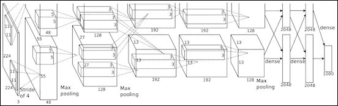
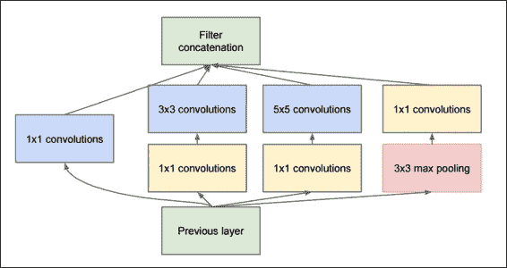
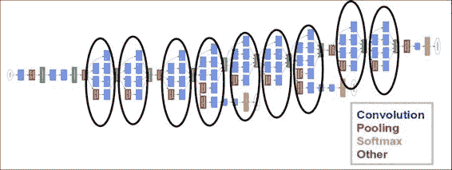
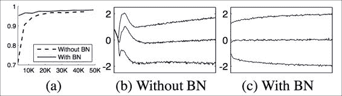
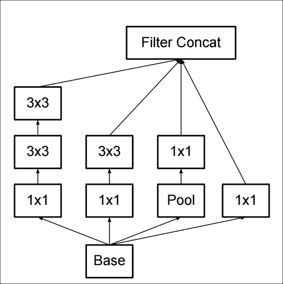
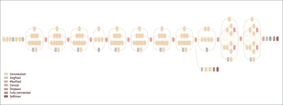
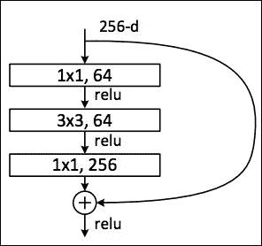
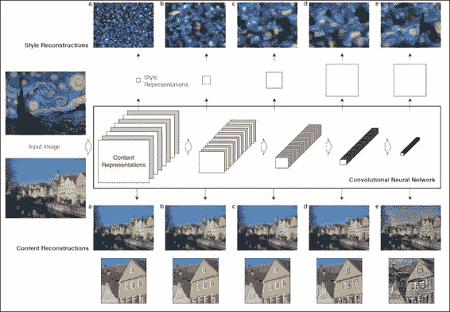
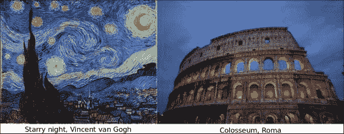
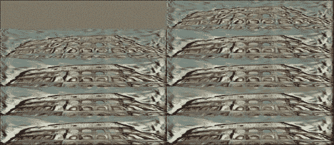

# 八、深度神经网络

在本章中，我们将回顾机器学习，深度神经网络中最先进的技术，也是研究最多的领域之一。

# 深度神经网络定义

这是一个新闻技术领域蓬勃发展的领域，每天我们都听到成功地将 DNN 用于解决新问题的实验，例如计算机视觉，自动驾驶，语音和文本理解等。

在前几章中，我们使用了与 DNN 相关的技术，尤其是在涉及卷积神经网络的技术中。

出于实际原因，我们将指深度学习和深度神经网络，即其中层数明显优于几个相似层的架构，我们将指代具有数十个层的神经网络架构，或者复杂结构的组合。

# 穿越时空的深度网络架构

在本节中，我们将回顾从 LeNet5 开始在整个深度学习历史中出现的里程碑架构。

## LeNet 5

在 1980 年代和 1990 年代，神经网络领域一直保持沉默。 尽管付出了一些努力，但是架构非常简单，并且需要大的（通常是不可用的）机器力量来尝试更复杂的方法。

1998 年左右，在贝尔实验室中，在围绕手写校验数字分类的研究中，Ian LeCun 开始了一种新趋势，该趋势实现了所谓的“深度学习——卷积神经网络”的基础，我们已经在第 5 章，简单的前馈神经网络中对其进行了研究。

在那些年里，SVM 和其他更严格定义的技术被用来解决这类问题，但是有关 CNN 的基础论文表明，与当时的现有方法相比，神经网络的表现可以与之媲美或更好。

# Alexnet

经过几年的中断（即使 LeCun 继续将其网络应用到其他任务，例如人脸和物体识别），可用结构化数据和原始处理能力的指数增长，使团队得以增长和调整模型， 在某种程度上被认为是不可能的，因此可以增加模型的复杂性，而无需等待数月的训练。

来自许多技术公司和大学的计算机研究团队开始竞争一些非常艰巨的任务，包括图像识别。 对于以下挑战之一，即 Imagenet 分类挑战，开发了 Alexnet 架构：



Alexnet 架构

## 主要功能

从其第一层具有卷积运算的意义上讲，Alexnet 可以看作是增强的 LeNet5。 但要添加未使用过的最大池化层，然后添加一系列密集的连接层，以建立最后的输出类别概率层。 视觉几何组（VGG）模型

图像分类挑战的其他主要竞争者之一是牛津大学的 VGG。

VGG 网络架构的主要特征是它们将卷积滤波器的大小减小到一个简单的`3x3`，并按顺序组合它们。

微小的卷积内核的想法破坏了 LeNet 及其后继者 Alexnet 的最初想法，后者最初使用的过滤器高达`11x11`过滤器，但复杂得多且表现低下。 过滤器大小的这种变化是当前趋势的开始：


VGG 中每层的参数编号摘要

然而，使用一系列小的卷积权重的积极变化，总的设置是相当数量的参数（数以百万计的数量级），因此它必须受到许多措施的限制。

## 原始的初始模型

在由 Alexnet 和 VGG 主导的两个主要研究周期之后，Google 凭借非常强大的架构 Inception 打破了挑战，该架构具有多次迭代。

这些迭代的第一个迭代是从其自己的基于卷积神经网络层的架构版本（称为 GoogLeNet）开始的，该架构的名称让人想起了始于网络的方法。

## GoogLenet（InceptionV1）



InceptionV1

GoogLeNet 是这项工作的第一个迭代，如下图所示，它具有非常深的架构，但是它具有九个链式初始模块的令人毛骨悚然的总和，几乎没有或根本没有修改：



盗梦空间原始架构

与两年前发布的 Alexnet 相比，它是如此复杂，但它设法减少了所需的参数数量并提高了准确率。

但是，由于几乎所有结构都由相同原始结构层构建块的确定排列和重复组成，因此提高了此复杂架构的理解和可伸缩性。

## 批量归一化初始化（V2）

2015 年最先进的神经网络在提高迭代效率的同时，还存在训练不稳定的问题。

为了理解问题的构成，首先我们将记住在前面的示例中应用的简单正则化步骤。 它主要包括将这些值以零为中心，然后除以最大值或标准偏差，以便为反向传播的梯度提供良好的基线。

在训练非常大的数据集的过程中，发生的事情是，经过大量训练示例之后，不同的值振荡开始放大平均参数值，就像在共振现象中一样。 我们非常简单地描述的被称为协方差平移。



有和没有批量归一化的表现比较

这是开发批归一化技术的主要原因。

再次简化了过程描述，它不仅包括对原始输入值进行归一化，还对每一层上的输出值进行了归一化，避免了在层之间出现不稳定性之前就开始影响或漂移这些值。

这是 Google 在 2015 年 2 月发布的改进版 GoogLeNet 实现中提供的主要功能，也称为 InceptionV2。

# InceptionV3

快进到 2015 年 12 月，Inception 架构有了新的迭代。 两次发行之间月份的不同使我们对新迭代的开发速度有了一个想法。

此架构的基本修改如下：

*   将卷积数减少到最大`3x3`
*   增加网络的总体深度
*   在每一层使用宽度扩展技术来改善特征组合

下图说明了如何解释改进的启动模块：



InceptionV3 基本模块

这是整个 V3 架构的表示形式，其中包含通用构建模块的许多实例：



InceptionV3 总体图

# 残差网络（ResNet）

残差网络架构于 2015 年 12 月出现（与 InceptionV3 几乎同时出现），它带来了一个简单而新颖的想法：不仅使用每个构成层的输出，还将该层的输出与原始输入结合。

在下图中，我们观察到 ResNet 模块之一的简化​​视图。 它清楚地显示了卷积层栈末尾的求和运算，以及最终的 relu 运算：



ResNet 一般架构

模块的卷积部分包括将特征从 256 个值减少到 64 个值，一个保留特征数的`3x3`过滤层以及一个从 64 x 256 个值增加`1x1`层的特征。 在最近的发展中，ResNet 的使用深度还不到 30 层，分布广泛。

## 其他深度神经网络架构

最近开发了很多神经网络架构。 实际上，这个领域是如此活跃，以至于我们每年或多或少都有新的杰出架构外观。 最有前途的神经网络架构的列表是：

*   SqueezeNet：此架构旨在减少 Alexnet 的参数数量和复杂性，声称减少了 50 倍的参数数量
*   高效神经网络（Enet）：旨在构建更简单，低延迟的浮点运算数量，具有实时结果的神经网络
*   Fractalnet：它的主要特征是非常深的网络的实现，不需要残留的架构，将结构布局组织为截断的分形

# 示例 -- 风格绘画 -- VGG 风格迁移

在此示例中，我们将配合 Leon Gatys 的论文《艺术风格的神经算法》的实现。

### 注意

此练习的原始代码由 [Anish Athalye](http://www.anishathalye.com/) 提供。

我们必须注意，此练习没有训练内容。 我们将仅加载由 VLFeat 提供的预训练系数矩阵，该矩阵是预训练模型的数据库，可用于处理模型，从而避免了通常需要大量计算的训练：



风格迁移主要概念

## 有用的库和方法

*   使用`scipy.io.loadmat`加载参数文件
    *   我们将使用的第一个有用的库是`scipy.io`模块，用于加载系数数据，该数据另存为 matlab 的 MAT 格式。
*   上一个参数的用法：

```py
scipy.io.loadmat(file_name, mdict=None, appendmat=True, **kwargs) 

```

*   返回前一个参数：

    `mat_dict : dict :dictionary`，变量名作为键，加载的矩阵作为值。 如果填充了`mdict`参数，则将结果分配给它。

## 数据集说明和加载

为了解决这个问题，我们将使用预训练的数据集，即 VGG 神经网络的再训练系数和 Imagenet 数据集。



## 数据集预处理

假设系数是在加载的参数矩阵中给出的，那么关于初始数据集的工作就不多了。

## 模型架构

模型架构主要分为两部分：风格和内容。

为了生成最终图像，使用了没有最终完全连接层的 VGG 网络。

## 损失函数

该架构定义了两个不同的损失函数来优化最终图像的两个不同方面，一个用于内容，另一个用于风格。

### 内容损失函数

`content_loss`函数的代码如下：

```py
 # content loss 
        content_loss = content_weight * (2 * tf.nn.l2_loss( 
                net[CONTENT_LAYER] - content_features[CONTENT_LAYER]) / 
                content_features[CONTENT_LAYER].size) 

```

## 风格损失函数

### 损失优化循环

损耗优化循环的代码如下：

```py
        best_loss = float('inf') 
        best = None 
        with tf.Session() as sess: 
            sess.run(tf.initialize_all_variables()) 
            for i in range(iterations): 
                last_step = (i == iterations - 1) 
                print_progress(i, last=last_step) 
                train_step.run() 

                if (checkpoint_iterations and i % checkpoint_iterations == 0) or last_step: 
                    this_loss = loss.eval() 
                    if this_loss < best_loss: 
                        best_loss = this_loss 
                        best = image.eval() 
                    yield ( 
                        (None if last_step else i), 
                        vgg.unprocess(best.reshape(shape[1:]), mean_pixel) 
                    ) 

```

## 收敛性测试

在此示例中，我们将仅检查指示的迭代次数（迭代参数）。

## 程序执行

为了以良好的迭代次数（大约 1000 个）执行该程序，我们建议至少有 8GB 的 RAM 内存可用：

```py
python neural_style.py --content examples/2-content.jpg --styles examples/2-style1.jpg  --checkpoint-iterations=100 --iterations=1000 --checkpoint-output=out%s.jpg --output=outfinal

```

前面命令的结果如下：



风格迁移步骤

控制台输出如下：

```py
Iteration 1/1000
Iteration 2/1000
Iteration 3/1000
Iteration 4/1000
...
Iteration 999/1000
Iteration 1000/1000
  content loss: 908786
    style loss: 261789
       tv loss: 25639.9
    total loss: 1.19621e+06

```

## 完整源代码

`neural_style.py`的代码如下：

```py
import os 

import numpy as np 
import scipy.misc 

from stylize import stylize 

import math 
from argparse import ArgumentParser 

# default arguments 
CONTENT_WEIGHT = 5e0 
STYLE_WEIGHT = 1e2 
TV_WEIGHT = 1e2 
LEARNING_RATE = 1e1 
STYLE_SCALE = 1.0 
ITERATIONS = 100 
VGG_PATH = 'imagenet-vgg-verydeep-19.mat' 

def build_parser(): 
    parser = ArgumentParser() 
    parser.add_argument('--content', 
            dest='content', help='content image', 
            metavar='CONTENT', required=True) 
    parser.add_argument('--styles', 
            dest='styles', 
            nargs='+', help='one or more style images', 
            metavar='STYLE', required=True) 
    parser.add_argument('--output', 
            dest='output', help='output path', 
            metavar='OUTPUT', required=True) 
    parser.add_argument('--checkpoint-output', 
            dest='checkpoint_output', help='checkpoint output format', 
            metavar='OUTPUT') 
    parser.add_argument('--iterations', type=int, 
            dest='iterations', help='iterations (default %(default)s)', 
            metavar='ITERATIONS', default=ITERATIONS) 
    parser.add_argument('--width', type=int, 
            dest='width', help='output width', 
            metavar='WIDTH') 
    parser.add_argument('--style-scales', type=float, 
            dest='style_scales', 
            nargs='+', help='one or more style scales', 
            metavar='STYLE_SCALE') 
    parser.add_argument('--network', 
            dest='network', help='path to network parameters (default %(default)s)', 
            metavar='VGG_PATH', default=VGG_PATH) 
    parser.add_argument('--content-weight', type=float, 
            dest='content_weight', help='content weight (default %(default)s)', 
            metavar='CONTENT_WEIGHT', default=CONTENT_WEIGHT) 
    parser.add_argument('--style-weight', type=float, 
            dest='style_weight', help='style weight (default %(default)s)', 
            metavar='STYLE_WEIGHT', default=STYLE_WEIGHT) 
    parser.add_argument('--style-blend-weights', type=float, 
            dest='style_blend_weights', help='style blending weights', 
            nargs='+', metavar='STYLE_BLEND_WEIGHT') 
    parser.add_argument('--tv-weight', type=float, 
            dest='tv_weight', help='total variation regularization weight (default %(default)s)', 
            metavar='TV_WEIGHT', default=TV_WEIGHT) 
    parser.add_argument('--learning-rate', type=float, 
            dest='learning_rate', help='learning rate (default %(default)s)', 
            metavar='LEARNING_RATE', default=LEARNING_RATE) 
    parser.add_argument('--initial', 
            dest='initial', help='initial image', 
            metavar='INITIAL') 
    parser.add_argument('--print-iterations', type=int, 
            dest='print_iterations', help='statistics printing frequency', 
            metavar='PRINT_ITERATIONS') 
    parser.add_argument('--checkpoint-iterations', type=int, 
            dest='checkpoint_iterations', help='checkpoint frequency', 
            metavar='CHECKPOINT_ITERATIONS') 
    return parser 

def main(): 
    parser = build_parser() 
    options = parser.parse_args() 

    if not os.path.isfile(options.network): 
        parser.error("Network %s does not exist. (Did you forget to download it?)" % options.network) 

    content_image = imread(options.content) 
    style_images = [imread(style) for style in options.styles] 

    width = options.width 
    if width is not None: 
        new_shape = (int(math.floor(float(content_image.shape[0]) / 
                content_image.shape[1] * width)), width) 
        content_image = scipy.misc.imresize(content_image, new_shape) 
    target_shape = content_image.shape 
    for i in range(len(style_images)): 
        style_scale = STYLE_SCALE 
        if options.style_scales is not None: 
            style_scale = options.style_scales[i] 
        style_images[i] = scipy.misc.imresize(style_images[i], style_scale * 
                target_shape[1] / style_images[i].shape[1]) 

    style_blend_weights = options.style_blend_weights 
    if style_blend_weights is None: 
        # default is equal weights 
        style_blend_weights = [1.0/len(style_images) for _ in style_images] 
    else: 
        total_blend_weight = sum(style_blend_weights) 
        style_blend_weights = [weight/total_blend_weight 
                               for weight in style_blend_weights] 

    initial = options.initial 
    if initial is not None: 
        initial = scipy.misc.imresize(imread(initial), content_image.shape[:2]) 

    if options.checkpoint_output and "%s" not in options.checkpoint_output: 
        parser.error("To save intermediate images, the checkpoint output " 
                     "parameter must contain `%s` (e.g. `foo%s.jpg`)") 

    for iteration, image in stylize( 
        network=options.network, 
        initial=initial, 
        content=content_image, 
        styles=style_images, 
        iterations=options.iterations, 
        content_weight=options.content_weight, 
        style_weight=options.style_weight, 
        style_blend_weights=style_blend_weights, 
        tv_weight=options.tv_weight, 
        learning_rate=options.learning_rate, 
        print_iterations=options.print_iterations, 
        checkpoint_iterations=options.checkpoint_iterations 
    ): 
        output_file = None 
        if iteration is not None: 
            if options.checkpoint_output: 
                output_file = options.checkpoint_output % iteration 
        else: 
            output_file = options.output 
        if output_file: 
            imsave(output_file, image) 

def imread(path): 
    return scipy.misc.imread(path).astype(np.float) 

def imsave(path, img): 
    img = np.clip(img, 0, 255).astype(np.uint8) 
    scipy.misc.imsave(path, img) 

if __name__ == '__main__': 
    main() 

```

`Stilize.py`的代码如下：

```py
import vgg 

import tensorflow as tf 
import numpy as np 

from sys import stderr 

CONTENT_LAYER = 'relu4_2' 
STYLE_LAYERS = ('relu1_1', 'relu2_1', 'relu3_1', 'relu4_1', 'relu5_1') 

try: 
    reduce 
except NameError: 
    from functools import reduce 

def stylize(network, initial, content, styles, iterations, 
        content_weight, style_weight, style_blend_weights, tv_weight, 
        learning_rate, print_iterations=None, checkpoint_iterations=None): 
    """ 
    Stylize images. 

    This function yields tuples (iteration, image); `iteration` is None 
    if this is the final image (the last iteration).  Other tuples are yielded 
    every `checkpoint_iterations` iterations. 

    :rtype: iterator[tuple[int|None,image]] 
    """ 
    shape = (1,) + content.shape 
    style_shapes = [(1,) + style.shape for style in styles] 
    content_features = {} 
    style_features = [{} for _ in styles] 

    # compute content features in feedforward mode 
    g = tf.Graph() 
    with g.as_default(), g.device('/cpu:0'), tf.Session() as sess: 
        image = tf.placeholder('float', shape=shape) 
        net, mean_pixel = vgg.net(network, image) 
        content_pre = np.array([vgg.preprocess(content, mean_pixel)]) 
        content_features[CONTENT_LAYER] = net[CONTENT_LAYER].eval( 
                feed_dict={image: content_pre}) 

    # compute style features in feedforward mode 
    for i in range(len(styles)): 
        g = tf.Graph() 
        with g.as_default(), g.device('/cpu:0'), tf.Session() as sess: 
            image = tf.placeholder('float', shape=style_shapes[i]) 
            net, _ = vgg.net(network, image) 
            style_pre = np.array([vgg.preprocess(styles[i], mean_pixel)]) 
            for layer in STYLE_LAYERS: 
                features = net[layer].eval(feed_dict={image: style_pre}) 
                features = np.reshape(features, (-1, features.shape[3])) 
                gram = np.matmul(features.T, features) / features.size 
                style_features[i][layer] = gram 

    # make stylized image using backpropogation 
    with tf.Graph().as_default(): 
        if initial is None: 
            noise = np.random.normal(size=shape, scale=np.std(content) * 0.1) 
            initial = tf.random_normal(shape) * 0.256 
        else: 
            initial = np.array([vgg.preprocess(initial, mean_pixel)]) 
            initial = initial.astype('float32') 
        image = tf.Variable(initial) 
        net, _ = vgg.net(network, image) 

        # content loss 
        content_loss = content_weight * (2 * tf.nn.l2_loss( 
                net[CONTENT_LAYER] - content_features[CONTENT_LAYER]) / 
                content_features[CONTENT_LAYER].size) 
        # style loss 
        style_loss = 0 
        for i in range(len(styles)): 
            style_losses = [] 
            for style_layer in STYLE_LAYERS: 
                layer = net[style_layer] 
                _, height, width, number = map(lambda i: i.value, layer.get_shape()) 
                size = height * width * number 
                feats = tf.reshape(layer, (-1, number)) 
                gram = tf.matmul(tf.transpose(feats), feats) / size 
                style_gram = style_features[i][style_layer] 
                style_losses.append(2 * tf.nn.l2_loss(gram - style_gram) / style_gram.size) 
            style_loss += style_weight * style_blend_weights[i] * reduce(tf.add, style_losses) 
        # total variation denoising 
        tv_y_size = _tensor_size(image[:,1:,:,:]) 
        tv_x_size = _tensor_size(image[:,:,1:,:]) 
        tv_loss = tv_weight * 2 * ( 
                (tf.nn.l2_loss(image[:,1:,:,:] - image[:,:shape[1]-1,:,:]) / 
                    tv_y_size) + 
                (tf.nn.l2_loss(image[:,:,1:,:] - image[:,:,:shape[2]-1,:]) / 
                    tv_x_size)) 
        # overall loss 
        loss = content_loss + style_loss + tv_loss 

        # optimizer setup 
        train_step = tf.train.AdamOptimizer(learning_rate).minimize(loss) 

        def print_progress(i, last=False): 
            stderr.write('Iteration %d/%d\n' % (i + 1, iterations)) 
            if last or (print_iterations and i % print_iterations == 0): 
                stderr.write('  content loss: %g\n' % content_loss.eval()) 
                stderr.write('    style loss: %g\n' % style_loss.eval()) 
                stderr.write('       tv loss: %g\n' % tv_loss.eval()) 
                stderr.write('    total loss: %g\n' % loss.eval()) 

        # optimization 
        best_loss = float('inf') 
        best = None 
        with tf.Session() as sess: 
            sess.run(tf.initialize_all_variables()) 
            for i in range(iterations): 
                last_step = (i == iterations - 1) 
                print_progress(i, last=last_step) 
                train_step.run() 

                if (checkpoint_iterations and i % checkpoint_iterations == 0) or last_step: 
                    this_loss = loss.eval() 
                    if this_loss < best_loss: 
                        best_loss = this_loss 
                        best = image.eval() 
                    yield ( 
                        (None if last_step else i), 
                        vgg.unprocess(best.reshape(shape[1:]), mean_pixel) 
                    ) 

def _tensor_size(tensor): 
    from operator import mul 
    return reduce(mul, (d.value for d in tensor.get_shape()), 1) 
 vgg.py 
import tensorflow as tf 
import numpy as np 
import scipy.io 

def net(data_path, input_image): 
    layers = ( 
        'conv1_1', 'relu1_1', 'conv1_2', 'relu1_2', 'pool1', 

        'conv2_1', 'relu2_1', 'conv2_2', 'relu2_2', 'pool2', 

        'conv3_1', 'relu3_1', 'conv3_2', 'relu3_2', 'conv3_3', 
        'relu3_3', 'conv3_4', 'relu3_4', 'pool3', 

        'conv4_1', 'relu4_1', 'conv4_2', 'relu4_2', 'conv4_3', 
        'relu4_3', 'conv4_4', 'relu4_4', 'pool4', 

        'conv5_1', 'relu5_1', 'conv5_2', 'relu5_2', 'conv5_3', 
        'relu5_3', 'conv5_4', 'relu5_4' 
    ) 

    data = scipy.io.loadmat(data_path) 
    mean = data['normalization'][0][0][0] 
    mean_pixel = np.mean(mean, axis=(0, 1)) 
    weights = data['layers'][0] 

    net = {} 
    current = input_image 
    for i, name in enumerate(layers): 
        kind = name[:4] 
        if kind == 'conv': 
            kernels, bias = weights[i][0][0][0][0] 
            # matconvnet: weights are [width, height, in_channels, out_channels] 
            # tensorflow: weights are [height, width, in_channels, out_channels] 
            kernels = np.transpose(kernels, (1, 0, 2, 3)) 
            bias = bias.reshape(-1) 
            current = _conv_layer(current, kernels, bias) 
        elif kind == 'relu': 
            current = tf.nn.relu(current) 
        elif kind == 'pool': 
            current = _pool_layer(current) 
        net[name] = current 

    assert len(net) == len(layers) 
    return net, mean_pixel 

def _conv_layer(input, weights, bias): 
    conv = tf.nn.conv2d(input, tf.constant(weights), strides=(1, 1, 1, 1), 
            padding='SAME') 
    return tf.nn.bias_add(conv, bias) 

def _pool_layer(input): 
    return tf.nn.max_pool(input, ksize=(1, 2, 2, 1), strides=(1, 2, 2, 1), 
            padding='SAME') 

def preprocess(image, mean_pixel): 
    return image - mean_pixel 

def unprocess(image, mean_pixel): 
    return image + mean_pixel 

```

# 总结

在本章中，我们一直在学习不同的深度神经网络架构。

我们了解了如何构建近年来最著名的架构之一 VGG，以及如何使用它来生成可转换艺术风格的图像。

在下一章中，我们将使用机器学习中最有用的技术之一：图形处理单元。 我们将回顾安装具有 GPU 支持的 TensorFlow 所需的步骤并对其进行训练，并将执行时间与唯一运行的模型 CPU 进行比较。

