# 十、库安装和其他提示

有多种安装 TensorFlow 的选项。 Google 已经为许多架构，操作系统和图形处理单元（GPU）准备了包。 尽管在 GPU 上机器学习任务的执行速度要快得多，但是两个安装选项都可用：

*   CPU：它将在机器处理核心的所有处理单元中并行工作。
*   GPU：此选项仅在使用多种架构之一的情况下才能使用，这些架构利用了非常强大的图形处理单元，即 NVIDIA 的 CUDA 架构。 还有许多其他架构/框架，例如 Vulkan，还没有达到成为标准的临界数量。

在本章中，您将学习：

*   如何在三种不同的操作系统（Linux，Windows 和 OSX）上安装 TensorFlow
*   如何测试安装以确保您能够运行示例，并从中开发自己的脚本
*   关于我们正在准备的其他资源，以简化您对机器学习解决方案进行编程的方式

# Linux 安装

首先，我们应该放弃免责声明。 您可能知道，Linux 领域中有很多替代品，它们具有自己的特定包管理。 因此，我们选择使用 Ubuntu 16.04 发行版。 毫无疑问，它是最广泛的 Linux 发行版，此外，Ubuntu 16.04 是 LTS 版本或长期支持。 这意味着该发行版将对桌面版本提供三年的支持，对服务器版本提供五年的支持。 这意味着我们将在本书中运行的基本软件在 2021 年之前将获得支持！

### 注意

您可以在[此链接](https://wiki.ubuntu.com/LTS)上找到有关 LTS 含义的更多信息。

即使被认为是面向新手的发行版，Ubuntu 也为 TensorFlow 所需的所有技术提供了所有必要的支持，并且拥有最大的用户群。 因此，我们将解释该发行版所需的步骤，该步骤也将与其余基于 Debian 的发行版的发行版非常接近。

### 提示

在撰写本文时，TensorFlow 不支持 32 位 Linux，因此请确保以 64 位版本运行示例。

## 初始要求

对于 TensorFlow 的安装，您可以使用以下任一选项：

*   在云上运行的基于 AMD64 的映像
*   具有 AMD64 指令能力的计算机（通常称为 64 位处理器）

### 提示

在 AWS 上，非常适合的 AMI 映像是代码`ami-cf68e0d8`。 它可以在 CPU 上运行良好，如果需要，也可以在 GPU 图像上运行。

## Ubuntu 准备（需要在任何方法之前应用）

在开发最近发布的 Ubuntu 16.04 时，我们将确保已更新到最新的包版本，并且安装了最小的 Python 环境。

让我们在命令行上执行以下指令：

```py
$ sudo apt-get update
$ sudo apt-get upgrade -y 
$ sudo apt-get install -y build-essential python-pip python-dev python-numpy swig python-dev default-jdk zip zlib1g-dev

```

## PIP 安装方法

在本节中，我们将使用 PIP（PIP 安装包）包管理器来获取 TensorFlow 及其所有依赖项。

这是一种非常简单的方法，您只需要进行一些调整就可以正常运行 TensorFlow 安装。

### CPU 版本

为了安装 TensorFlow 及其所有依赖项，我们只需要一个简单的命令行（只要我们已经实现了准备任务即可）。

因此，这是标准 Python 2.7 所需的命令行：

```py
$ sudo pip install --upgrade https://storage.googleapis.com/tensorflow/linux/cpu/tensorflow-0.9.0-cp27-none-linux_x86_64.whl

```

然后，您将找到正在下载的不同从属包，如果未检测到问题，则会显示相应的消息：

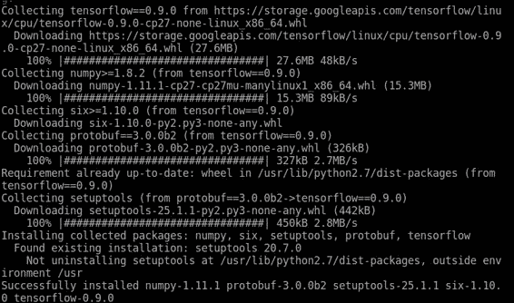

点安装输出

### 测试您​​的安装

在安装步骤之后，我们可以做一个非常简单的测试，调用 Python 解释器，然后导入 TensorFlow 库，将两个数字定义为一个常量，并获得其总和：

```py
$ python
>>> import tensorflow as tf
>>> a = tf.constant(2)
>>> b = tf.constant(20)
>>> print(sess.run(a + b))

```

### GPU 支持

为了安装支持 GPU 的 TensorFlow 库，首先必须从源安装中执行 GPU 支持部分中的所有步骤。

然后您将调用：

```py
$ sudo pip install -upgrade https://storage.googleapis.com/tensorflow/linux/gpu/tensorflow-0.10.0rc0-cp27-none-linux_x86_64.whl

```

### 提示

预打包的 TensorFlow 有许多版本。

它们遵循以下形式：

```py
https://storage.googleapis.com/tensorflow/linux/[processor type]/tensorflow-[version]-cp[python version]-none-linux_x86_64.whl

```

### 提示

其中`[version]`可以是`cpu`或`gpu`，`[version]`是 TensorFlow 版本（实际上是 0.11），而 Python 版本可以是 2.7、3.4 或 3.5。

## Virtualenv 安装方法

在本节中，我们将使用 Virtualenv 工具说明 TensorFlow 的首选方法。

来自 Virtualenv 页面（`virtualenv.pypa.io`）：

> Virtualenv 是用于创建隔离的 Python 环境的工具。（...）它创建具有自己的安装目录的环境，该环境不与其他 Virtualenv 环境共享库（并且可以选择不访问全局安装的库） 。

通过此工具，我们将为 TensorFlow 安装简单地安装隔离的环境，而不会干扰所有其他系统库，这又不会影响我们的安装。

这些是我们将要执行的简单步骤（从 Linux 终端）：

1.  设置`LC_ALL`变量：

    ```py
    $ export LC_ALL=C

    ```

2.  从安装程序安装`virtualenv` Ubuntu 包：

    ```py
    $ sudo apt-get install python-virtualenv

    ```

3.  安装`virtualenv`包：

    ```py
    virtualenv --system-site-packages ~/tensorflow

    ```

4.  然后，要使用新的 TensorFlow，您将始终需要记住激活 TensorFlow 环境：

    ```py
    source ~/tensorflow/bin/activate

    ```

5.  然后通过 PIP 安装`tensorflow`包：

    ```py
    pip install --upgrade https://storage.googleapis.com/tensorflow/linux/cpu/tensorflow-0.9.0-cp27-none-linux_x86_64.whl

    ```

您将能够安装在 PIP linux 安装方法中转录的所有替代官方`tensorflow`包。

### 环境测试

在这里，我们将对 TensorFlow 做一个最小的测试。

首先，我们将激活新创建的 TensorFlow 环境：

```py
$ source ~/tensorflow/bin/activate

```

然后，提示将以（`tensorflow`）前缀更改，我们可以执行简单的代码来加载 TensorFlow，并对两个值求和：

```py
(tensorflow) $ python
>>> import tensorflow as tf
>>> a = tf.constant(2)
>>> b = tf.constant(3)
>>> print(sess.run(a * b))
6

```

完成工作后，如果要返回到正常环境，可以简单地停用该环境：

```py
(tensorflow)$ deactivate

```

## Docker 安装方法

这种 TensorFlow 安装方法使用一种称为容器的最新操作技术。

容器在某些方面与 Virtualenv 的工作相关，在 Docker 中，您将拥有一个新的虚拟环境。 主要区别在于此虚拟化工作的级别。 它在简化的包中包含应用和所有依赖项，并且这些封装的容器可以在公共层 Docker 引擎上同时运行，而 Docker 引擎又在主机操作系统上运行。

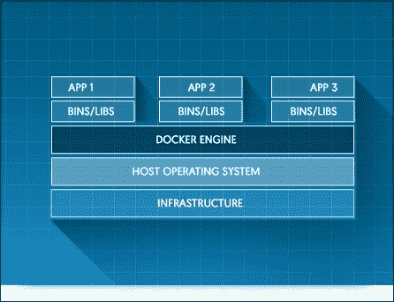

Docker 主要架构（[图片来源](https://www.docker.com/products/docker-engine)）

### 安装 Docker

首先，我们将通过`apt`包安装`docker`：

```py
sudo apt-get install docker.io

```

### 允许 Docker 以普通用户身份运行

在此步骤中，我们创建一个 Docker 组以能够将 Docker 用作用户：

```py
sudo groupadd docker

```

### 提示

您可能会得到错误； `group 'docker' already exists`。 您可以放心地忽略它。

然后，将当前用户添加到 Docker 组：

```py
sudo usermod -aG docker [your user]

```

### 提示

此命令不应返回任何输出。

### 重新启动

完成此步骤后，需要重新启动才能应用更改。

### 测试 Docker 安装

重新启动后，您可以尝试使用命令行调用 HelloWorld Docker 示例：

```py
$ docker run hello-world

```

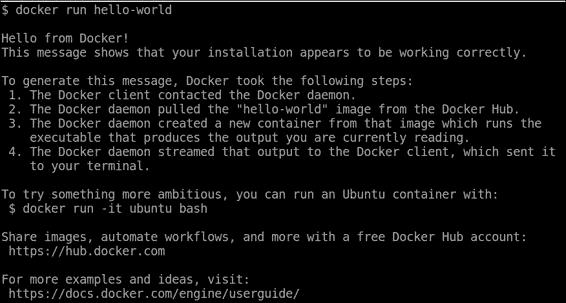

Docker HelloWorld 容器

### 运行 TensorFlow 容器

然后，我们运行（如果之前未安装过，请安装）TensorFlow 二进制映像（在这种情况下为原始 CPU 二进制映像）：

```py
docker run -it -p 8888:8888 gcr.io/tensorflow/tensorflow

```

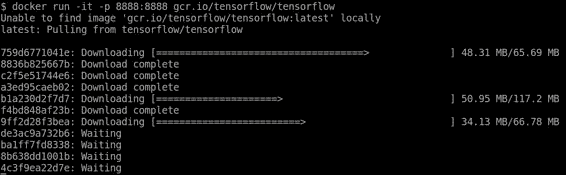

通过 PIP 安装 TensorFlow

安装完成后，您将看到最终的安装步骤，并且 Jupyter 笔记本开始：

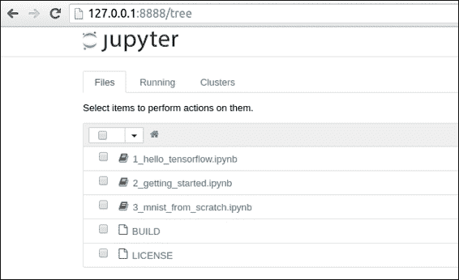

### 注意

许多示例使用 Jupyter 笔记本格式。 为了执行和运行它们，您可以在其主页 [jupyter.org](http://jupyter.org) 上找到有关许多架构的安装和使用的信息。

## 从源代码安装

现在我们来看看 TensorFlow 的最完整，对开发人员友好的安装方法。 从源代码安装将使您了解用于编译的不同工具。

### 安装 Git 源代码版本管理器

Git 是现有的最著名的源代码版本管理器之一，并且是 Google 选择的版本管理器，并将其代码发布在 GitHub 上。

为了下载 TensorFlow 的源代码，我们将首先安装 Git 源代码管理器：

#### 在 Linux 中安装 Git（Ubuntu 16.04）

要在您的 Ubuntu 系统上安装 Git，请运行以下命令：

```py
$ sudo apt-get install git

```

### 安装 Bazel 构建工具

Bazel（`bazel.io`）是一个构建工具，基于 Google 七年来一直使用的内部构建工具（称为 Blaze），并于 2015 年 9 月 9 日发布为 beta 版。

此外，它还用作 TensorFlow 中的主要构建工具，因此，要执行一些高级任务，需要对工具有最少的了解。

### 提示

与诸如 Gradle 之类的竞争项目相比，优点有所不同，主要优点是：

*   支持多种语言，例如 C++，Java，Python 等
*   支持创建 Android 和 iOS 应用，甚至 Docker 映像
*   支持使用来自许多不同来源的库，例如 GitHub，Maven 等
*   通过 API 可扩展以便添加自定义构建规则

#### 添加 Bazel 发行版 URI 作为包源

首先，我们将 Bazel 仓库添加到可用仓库列表中，并将其各自的密钥添加到 APT 工具的配置中，该工具管理 Ubuntu 操作系统的依赖项。

```py
$ echo "deb http://storage.googleapis.com/bazel-apt stable jdk1.8" | sudo tee /etc/apt/sources.list.d/bazel.list
$ curl https://storage.googleapis.com/bazel-apt/doc/apt-key.pub.gpg | sudo apt-key add -

```


挡板安装

#### 更新和安装 Bazel

一旦安装了所有包源，就可以通过`apt-get`安装 Bazel：

```py
$ sudo apt-get update && sudo apt-get install bazel

```

### 提示

此命令将安装 Java 和大量依赖项，因此可能需要一些时间来安装它。

### 安装 GPU 支持（可选）

本节将教我们如何在 Linux 设置中安装支持 GPU 所需的必需包。

实际上，获得 GPU 计算支持的唯一方法是通过 CUDA。

检查 nouveau NVIDIA 显卡驱动程序是否不存在。 要对此进行测试，请执行以下命令并检查是否有任何输出：

```py
lsmod | grep nouveau

```

如果没有输出，请参阅安装 CUDA 系统包。如果没有输出，请执行以下命令：

```py
$ echo -e "blacklist nouveau\nblacklist lbm-nouveau\noptions nouveau modeset=0\nalias nouveau off\nalias lbm-nouveau off\n" | sudo tee /etc/modprobe.d/blacklist-nouveau.conf
$ echo options nouveau modeset=0 | sudo tee -a /etc/modprobe.d/nouveau-kms.conf
$ sudo update-initramfs -u
$ sudo reboot (a reboot will occur)

```

### 安装 CUDA 系统包

第一步是从仓库中安装所需的包：

```py
sudo apt-get install -y linux-source linux-headers-`uname -r` 
nvidia-graphics-drivers-361
nvidia-cuda-dev
sudo apt install nvidia-cuda-toolkit
sudo apt-get install libcupti-dev

```

### 提示

如果要在云映像上安装 CUDA，则应在以下命令阻止之前运行此命令：

```py
sudo apt-get install linux-image-extra-virtual

```

#### 创建替代位置

当前的 TensorFlow 安装配置期望非常严格的结构，因此我们必须在文件系统上准备类似的结构。

这是我们将需要运行的命令：

```py
sudo mkdir /usr/local/cuda
cd /usr/local/cuda
sudo ln -s /usr/lib/x86_64-linux-gnu/ lib64
sudo ln -s /usr/include/ include
sudo ln -s /usr/bin/ bin
sudo ln -s /usr/lib/x86_64-linux-gnu/ nvvm
sudo mkdir -p extras/CUPTI
cd extras/CUPTI
sudo ln -s /usr/lib/x86_64-linux-gnu/ lib64
sudo ln -s /usr/include/ include
sudo ln -s /usr/include/cuda.h /usr/local/cuda/include/cuda.h
sudo ln -s /usr/include/cublas.h /usr/local/cuda/include/cublas.h
sudo ln -s /usr/include/cudnn.h /usr/local/cuda/include/cudnn.h
sudo ln -s /usr/include/cupti.h /usr/local/cuda/extras/CUPTI/include/cupti.h
sudo ln -s /usr/lib/x86_64-linux-gnu/libcudart_static.a /usr/local/cuda/lib64/libcudart_static.a
sudo ln -s /usr/lib/x86_64-linux-gnu/libcublas.so /usr/local/cuda/lib64/libcublas.so
sudo ln -s /usr/lib/x86_64-linux-gnu/libcudart.so /usr/local/cuda/lib64/libcudart.so
sudo ln -s /usr/lib/x86_64-linux-gnu/libcudnn.so /usr/local/cuda/lib64/libcudnn.so
sudo ln -s /usr/lib/x86_64-linux-gnu/libcufft.so /usr/local/cuda/lib64/libcufft.so
sudo ln -s /usr/lib/x86_64-linux-gnu/libcupti.so /usr/local/cuda/extras/CUPTI/lib64/libcupti.so

```

#### 安装 cuDNN

TensorFlow 使用附加的 cuDNN 包来加速深度神经网络操作。

然后，我们将下载`cudnn`包：

```py
$ wget http://developer.download.nvidia.com/compute/redist/cudnn/v5/cudnn-7.5-linux-x64-v5.0-ga.tgz

```

然后，我们需要解压缩包并链接它们：

```py
$ sudo cp cuda/lib64/libcudnn* /usr/local/cuda/lib64
$ sudo cp cuda/include/cudnn.h /usr/local/cuda/include/

```

### 克隆 TensorFlow 源

最后，我们完成了获取 TensorFlow 源代码的任务。

获得它就像执行以下命令一样容易：

```py
$ git clone https://github.com/tensorflow/tensorflow

```

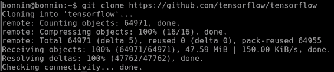

Git 安装

### 配置 TensorFlow 构建

然后我们访问`tensorflow`主目录：

```py
$ cd tensorflow

```

然后我们只需运行`configure`脚本：

```py
$ ./configure

```

在下图中，您可以看到大多数问题的答案（它们几乎都是输入的，是的）

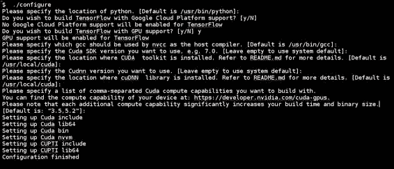

CUDA 配置

因此，我们现在准备着手进行库的建设。

### 提示

如果要在 AWS 上安装它，则必须执行修改后的行：

```py
TF_UNOFFICIAL_SETTING=1 ./configure

```

### 构建 TensorFlow

在完成所有准备步骤之后，我们将最终编译 TensorFlow。 以下几行可能引起您的注意，因为它涉及到教程。 我们构建示例的原因是它包含基础安装，并提供了一种测试安装是否有效的方法。

运行以下命令：

```py
$ bazel build -c opt --config=cuda //tensorflow/cc:tutorials_example_trainer

```

### 测试安装

现在该测试安装了。 在主`tensorflow`安装目录中，只需执行以下命令：

```py
$ bazel-bin/tensorflow/cc/tutorials_example_trainer --use_gpu

```

这是命令输出的示例表示：

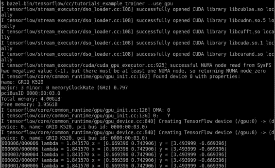

TensorFlow GPU 测试

# Windows 安装

现在轮到 Windows 操作系统了。 首先，我们必须说这不是 TensorFlow 生态系统的首选，但是我们绝对可以使用 Windows 操作系统进行开发。

## 经典 Docker 工具箱方法

此方法使用经典的工具箱方法，该方法可用于大多数最新的 Windows 版本（从 Windows 7 开始，始终使用 64 位操作系统）。

### 提示

为了使 Docker（特别是 VirtualBox）正常工作，您需要安装 VT-X 扩展。 这是您需要在 BIOS 级别执行的任务。

### 安装步骤

在这里，我们将列出在 Windows 中通过 Docker 安装`tensorflow`所需的不同步骤。

#### 下载 Docker 工具箱安装程序

安装程序的当前 URL 位于[此链接](https://github.com/docker/toolbox/releases/download/v1.12.0/DockerToolbox-1.12.0.exe)。

执行安装程序后，我们将看到第一个安装屏幕：

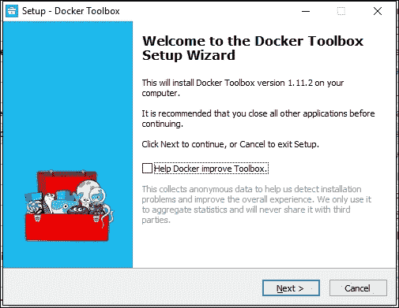

Docker 工具箱第一个安装屏幕

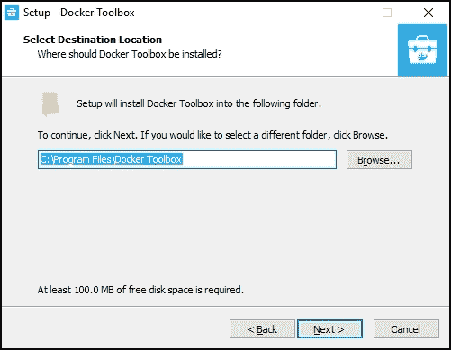

Docker 工具箱安装程序路径选择器

然后，选择安装中需要的所有组件：

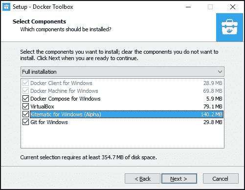

Docker 工具箱包选择屏幕

完成各种安装操作后，我们的 Docker 安装将准备就绪：

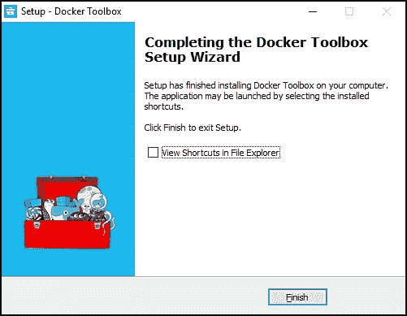

Docker 工具箱安装最终屏幕

#### 创建 Docker 机器

为了创建初始机器，我们将在 Docker 终端中执行以下命令：

```py
docker-machine create vdocker -d virtualbox

```

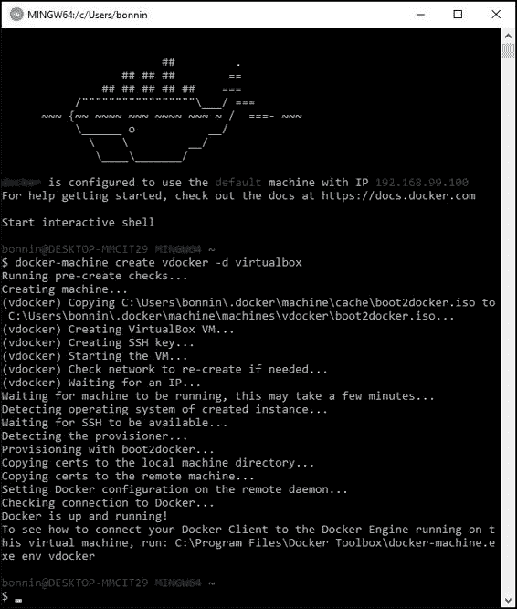

Docker 初始映像安装

然后，在命令窗口中，键入以下内容：

```py
FOR /f "tokens=*" %i IN ('docker-machine env --shell cmd vdocker') DO %i docker run -it b.gcr.io/tensorflow/tensorflow

```

这将打印并读取运行最近创建的虚拟机所需的许多变量。

最后，要安装`tensorflow`容器，请像在 Linux 控制台上一样从同一控制台进行操作：

```py
docker run -it -p 8888:8888 gcr.io/tensorflow/tensorflow

```

### 提示

如果您不想执行 Jupyter，但想直接启动到控制台，则可以通过以下方式运行 Docker 映像：

```py
run -it -p 8888:8888 gcr.io/tensorflow/tensorflow bash

```

# MacOSX 安装

现在转到在 MacOSX 上进行安装。安装过程与 Linux 非常相似。 它们基于 OSX El Capitan 版本。 我们还将参考不支持 GPU 的 2.7 版 Python。

安装要求安装用户具有`sudo`特权。

## 安装 PIP

在此步骤中，我们将使用`easy_install`包管理器安装 PIP 包管理器，该包管理器包含在安装工具 Python 包中，并且默认情况下包含在操作系统中。

对于此安装，我们将在终端中执行以下操作：

```py
$ sudo easy_install pip

```

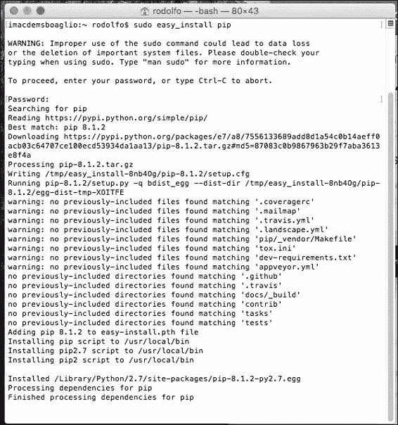

然后，我们将安装六个模块，这是一个兼容性模块，可帮助 Python 2 程序支持 Python 3 编程：

要安装`six`，我们执行以下命令：

```py
sudo easy_install --upgrade six

```

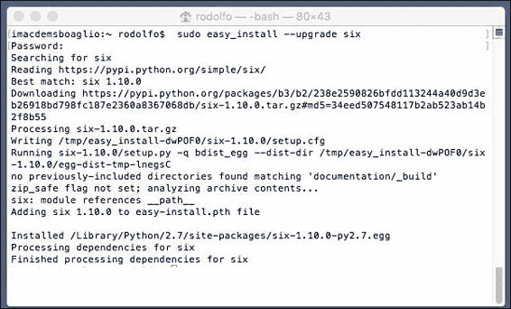

在安装`six`包之后，我们通过执行以下命令来继续安装`tensorflow`包：

```py
sudo pip install -ignore-packages six https://storage.googleapis.com/tensorflow/mac/cpu/tensorflow-0.10.0-py2-none-any.whl

```

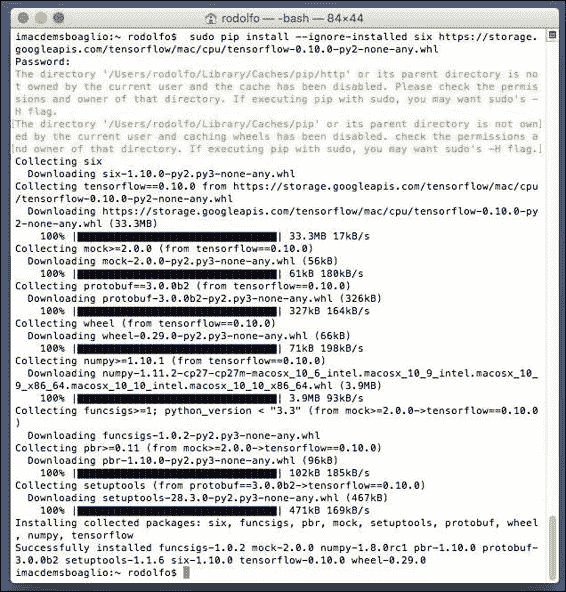

然后我们调整`numpy`包的路径，这在 El Capitan 中是必需的：

```py
sudo easy_install numpy

```

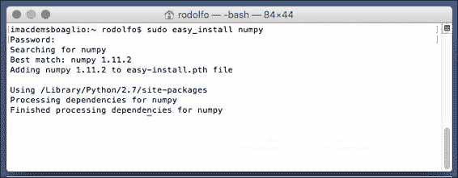

现在我们准备导入`tensorflow`模块并运行一些简单的示例：

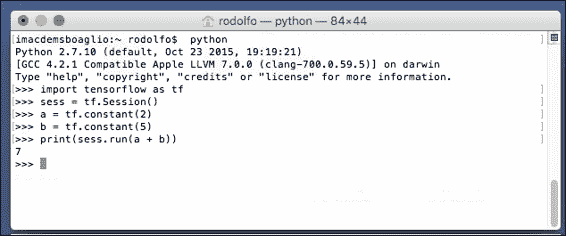

# 总结

在本章中，我们回顾了可以执行 TensorFlow 安装的一些主要方法。

即使可能性是有限的，每个月左右我们都会看到支持新的架构或处理器，因此我们只能期望该技术的应用领域越来越多。

