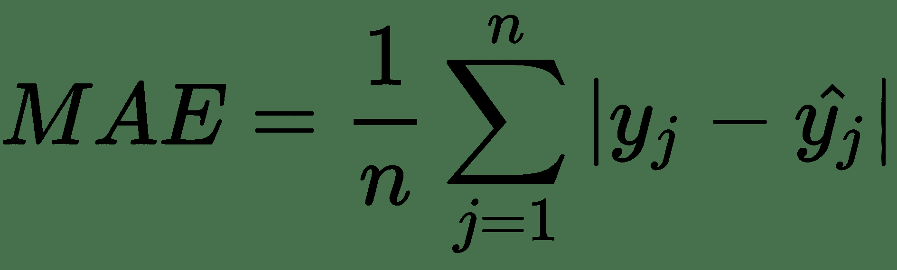
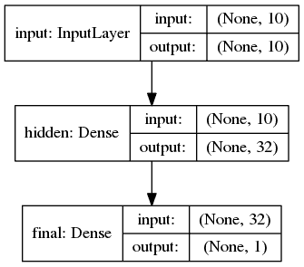
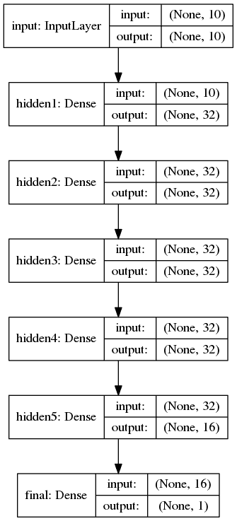
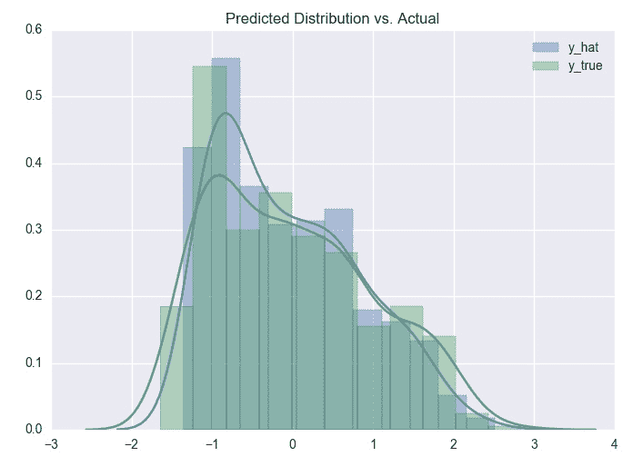

# 二、使用深度学习解决回归问题

在本章中，我们将构建一个简单的**多层感知器**（**MLP**），它是具有单个隐藏层的神经网络的奇特名称，用于解决回归问题。 然后，我们将深入研究具有多个隐藏层的深度神经网络。 在此过程中，我们将探索模型的表现和过拟合。 所以，让我们开始吧！

我们将在本章介绍以下主题：

*   回归分析和深度神经网络
*   将深度神经网络用于回归
*   在 Keras 中建立 MLP
*   在 Keras 中建立深度神经网络
*   保存和加载经过训练的 Keras 模型

# 回归分析和深度神经网络

在经典回归分析中，我们使用线性模型来学习一组独立变量和因变量之间的关系。 在找到这种关系时，我们希望能够在给定自变量值的情况下预测因变量的值。

进行回归分析的第二个重要原因是要了解当所有其他自变量保持恒定时单个自变量对因变量的影响。 传统多元线性回归的一大优点是线性模型的*其他条件不变*属性。 我们可以通过使用与该自变量关联的学习权重来解释单个自变量对因变量的影响，而无需考虑其他自变量。 这种解释充其量是具有挑战性的，需要我们对我们的数据和模型做出很多假设。 但是，它通常非常有用。

深度神经网络很难解释，尽管尝试这样做是一个活跃的研究领域。

有关介绍深度神经网络的当前状态的介绍，请查看 Montavon 等人的[《解释和理解深度神经网络的方法》](https://arxiv.org/abs/1706.07979)。

# 将神经网络用于回归的好处

在本章的其余部分，我们将重点介绍使用深度神经网络进行预测。 与使用传统的多元线性回归进行比较时，您会很高兴地发现我们的神经网络具有以下优势：

*   我们不需要选择或筛选特征。 神经网络是功能强大的特征工程机器，可以了解哪些特征是相关的，而忽略了无关的特征。
*   给定足够复杂的网络，还可以学习特征交互（例如，除了`x[1]`和`x[2]`的独立效应，`x[1] * x[2]`的效应））
*   您可能现在已经猜到了，我们还可以学习更高阶的多项式关系（例如`x[2]^3`）
*   最后，只要我们确保最终激活可以对分布进行建模，我们就不必只对正态分布建模或对非正态分布使用不同的模型。

# 将神经网络用于回归时要考虑的缺点

但这并不是所有的彩虹和小猫，使用神经网络解决这些真正简单的问题也有一些弊端。 最明显的缺点是：

*   如前所述，神经网络不容易解释。
*   当具有许多特征和大量数据时，神经网络最有效。 许多简单的回归问题还不够大，无法真正从神经网络中受益。
*   在很多情况下，传统的多元回归或树模型（例如梯度提升树）在此类问题上的表现将优于神经网络。 越复杂，就越适合神经网络。

# 将深度神经网络用于回归

既然您已经希望了解为什么（不希望）使用深度神经网络进行回归，那么我将向您展示如何做到这一点。 虽然它不像在 **scikit-learn** 中使用**线性回归器**那样简单，但我认为使用 **Keras** 会很容易。 最重要的是，Keras 将允许您快速迭代模型架构而无需更改大量代码。

# 如何规划机器学习问题

在构建新的神经网络时，我建议每次都遵循相同的基本步骤。

深度神经网络很快就会变得非常复杂。 进行一点计划和组织，大大加快您的工作流程！

以下是构建深度神经网络的步骤：

1.  概述您要解决的问题。
2.  确定模型的输入和输出。
3.  选择`cost`函数和指标。
4.  创建一个初始的网络架构。
5.  训练和调整网络。

# 定义示例问题

在我们的示例问题中，我们将使用 P. Cortez 等人创建的[葡萄酒质量数据集](https://archive.ics.uci.edu/ml/datasets/wine+quality)。 考虑到白酒的其他 10 个化学特性，我们将预测白葡萄酒数据中所含酒精的百分比。

此数据集中总共有 4,898 个观测值或元素，对于经典回归问题而言可能很大，但对于深度学习问题而言却很小。

一些快速的探索性数据分析将告诉我们，我们将用来预测酒精含量的 10 个化学特征在不同尺度上都是连续变量。

# 加载数据集

虽然可能不是机器学习问题中最有趣的部分，但加载数据是重要的一步。 我将在这里介绍我的数据加载方法，以便您可以了解如何处理数据集。

```py
from sklearn.preprocessing import StandardScaler
import pandas as pd

TRAIN_DATA = "./data/train/train_data.csv"
VAL_DATA = "./data/val/val_data.csv"
TEST_DATA = "./data/test/test_data.csv"

def load_data():
 """Loads train, val, and test datasets from disk"""
 train = pd.read_csv(TRAIN_DATA)
 val = pd.read_csv(VAL_DATA)
 test = pd.read_csv(TEST_DATA)

 # we will use sklearn's StandardScaler to scale our data to 0 mean, unit variance.
 scaler = StandardScaler()
 train = scaler.fit_transform(train)
 val = scaler.transform(val)
 test = scaler.transform(test)
 # we will use a dict to keep all this data tidy.
 data = dict()

 data["train_y"] = train[:, 10]
 data["train_X"] = train[:, 0:9]
 data["val_y"] = val[:, 10]
 data["val_X"] = val[:, 0:9]
 data["test_y"] = test[:, 10]
 data["test_X"] = test[:, 0:9]
 # it's a good idea to keep the scaler (or at least the mean/variance) so we can unscale predictions
 data["scaler"] = scaler
 return data
```

当我从 csv，excel 甚至是 DBMS 中读取数据时，第一步通常是将其加载到 pandas 数据框中。

标准化我们的数据很重要，这样每个特征都应具有可比的范围，并且所有这些范围都应位于激活函数的范围之内。 在这里，我使用了 Scikit-Learn 的`StandardScaler`完成此任务。

这为我们提供了一个形状完整的数据集`(4898, 10)`。 我们的目标变量`alcohol`的百分比介于 8% 和 14.2% 之间。

在加载数据之前，我已经对数据进行了随机采样并将其划分为`train`，`val`和`test`数据集，因此我们在这里不必担心。

最后，`load_data()`函数返回一个字典，该字典将所有内容保持整齐并放在一个位置。 如果您以后看到我参考数据`[X_train]`，则知道我正在参考训练数据集，该数据集已存储在数据字典中。

。 [该项目的代码和数据均可在该书的 GitHub 网站上找到](https://github.com/mbernico/deep_learning_quick_reference)。

# 定义成本函数

对于回归任务，最常见的成本函数是**均方根误差**（**RMSE**）和**平均绝对误差**（**MAE**）。 我将在这里使用 MAE。 定义如下：



很简单，MAE 是数据集中所有示例的平均无符号误差。 与 RMSE 非常相似； 但是，我们使用`y`和`y_hat`之间的差的绝对值代替平均平方误差的平方根：


您可能想知道 MAE 与更熟悉​​的 RMSE 有何不同。 如果误差在数据集中均匀分布，则 RMSE 和 MAE 将相等。 如果数据集中有非常大的离群值，则 RMSE 将比 MAE 大得多。 您选择的成本函数应适合您的用例。 关于可解释性，MAE 比 RMSE 更具解释性，因为它是实际的平均误差。

# 在 Keras 中建立 MLP

Keras 使用模型对象的实例来包含神经网络。 对于熟悉 scikit-learn 的人来说，这可能是相当熟悉的。 略有不同的是 Keras 模型包含一组层。 这一组层需要由我们定义。 只需很少的代码，就可以在网络架构中实现惊人的灵活性。

Keras 当前有两个用于构建模型的 API。 在我的示例中，我将使用函数式 API。 它稍微冗长一些，但可以提供更多的灵活性。 我建议尽可能使用函数式 API。

我们的 MLP 将需要一个输入层，一个隐藏层和一个输出层。

# 输入层形状

由于我们已经确定了输入，因此我们知道输入矩阵的行数等于数据集中的数据元素/观测值的数量，并且列数等于变量/特征的数量。 输入矩阵的形状为`(观察数量 x 10 个特征)`。 TensorFlow 和 Keras 可以在定义数据集中元素的数量时使用`None`作为占位符，而不是定义数据集中或小批量中的确切记录数。

如果看到 Keras 或 TensorFlow 模型层形状中使用了`None`维度，则它实际上表示任意维度，该维度可以采用任何正整数值。

# 隐藏层形状

我们的隐藏层将从 32 个神经元开始。 在这一点上，我们不知道需要多少神经元。 这确实是一个超参数，以后可以进行探索和调整。 为给定问题确定合适的网络架构是深度学习领域的一个开放问题。

由于隐藏层中这 32 个神经元中的每一个都将其激活输出到输出层，因此隐藏层的形状将为`(10, 32)`。

# 输出层形状

我们的最后一层将由单个神经元组成，使用来自隐藏层的 32 个输入，将为每个观察值预测单个输出值`y_hat`。

将所有各层放在一起，我们的 MLP 网络结构将如下所示：



# 神经网络架构

现在我们已经定义了输入和输出，我们可以看一下网络的代码。

```py
from keras.layers import Input, Dense
from keras.models import Model
def build_network(input_features=None):
    inputs = Input(shape=(input_features,), name="input")
    x = Dense(32, activation='relu', name="hidden")(inputs)
    prediction = Dense(1, activation='linear', name="final")(x)
    model = Model(inputs=inputs, outputs=prediction)
    model.compile(optimizer='adam', loss='mean_absolute_error')
    return model
```

这里的所有都是它的！ 然后，我们可以使用此代码，只需调用它即可构建适合于我们问题的神经网络实例，如下所示：

```py
model = build_network(input_features=10)
```

但是，在开始之前，让我们回顾一下前面代码中的一些有趣的部分：

*   每层*链接到*到它上面的层。 每层都是可调用的，并返回张量。 例如，当隐藏层调用它时，我们的隐藏层*绑定到输入层*：

```py
        x = Dense(32, activation='relu', name="hidden")(inputs)
```

*   我们最后一层的激活函数是线性的。 这与不使用任何激活（这是我们要进行回归）相同。
*   Keras 模型需要使用`.compile()`进行编译。
*   在编译调用期间，您需要定义将要使用的成本函数和优化器。 正如我们所讨论的，在此示例中，我已将 MAE 用于成本函数。 我使用具有默认参数的 Adam 作为我的优化程序，我们在第 1 章中已经介绍了这一点。很可能我们最终将希望调整 Adam 的学习速度。 这样做非常简单：您只需要定义一个自定义`adam`实例，然后使用该实例即可：

```py
from keras.optimizers import Adam
adam_optimizer = Adam(lr=0.001, beta_1=0.9, beta_2=0.999, epsilon=1e-08, decay=0.0)
model.compile(optimizer=adam_optimizer, loss='mean_absolute_error')
```

# 训练 Keras 模型

现在我们的网络已经构建和编译，剩下的就是训练它了。 就像 Python 的 scikit-learn 一样，您可以通过在模型实例上调用`.fit()`来做到这一点，如以下代码所示：

```py
model.fit(x=data["train_X"], y=data["train_y"], batch_size=32, epochs=200, verbose=1, validation_data=(data["val_X"], data["val_y"]))
```

让我们来看一下 Keras `fit`方法所采用的一些重要参数。 我将假设您熟悉小批量梯度下降和训练周期，但如果不熟悉，请查看第 1 章“深度学习的基础知识”， 概述。 Keras 拟合模型中的重要参数如下：

*   `batch_size`：Keras 的默认批次大小为 32。批次大小是 Keras 将使用的迷你批次的大小。 当然，这意味着 Keras 假设您要使用小批量梯度下降。 如果由于某种原因不想使用小批量梯度，可以设置`batch_size=None`。
*   `epochs`：一个周期只是整个训练集的单次通过。 在实践中，您需要在训练网络时对其进行监视，以了解网络何时收敛，因此`epochs`是一个易于学习的超参数。 稍后，我们将看到可以在每个周期甚至比最后一个周期更好的每个周期保存模型的权重。 一旦知道如何做到这一点，我们就可以选择我们认为最好的周期，并实现一种基于人的早期停止。
*   `validation_data`：在这里，我们指定验证集。 在每个阶段结束时，Keras 将在验证集上测试模型，并使用损失函数和您指定的任何其他指标输出结果。 另外，您可以将`validation_split`设置为浮点值，以指定要用于验证的训练组的百分比。 这两个选项都可以正常工作，但是在数据集拆分方面，我希望讲得很明确。
*   `verbose`：这有点不言而喻； 但是，值得一提。 `verbose=1`输出一个进度条，显示当前周期的状态，在周期结束时，Keras 将输出训练和验证损失。 也可以将`verbose`设置为 2（每个小批量输出损失信息），将其设置为 0（使 Keras 保持静音）。

# 评估模型的表现

现在我们的 MLP 已经过训练，我们可以开始了解它的表现。 为此，我将对`Train`，`Val`和`Test`数据集进行预测。 相同的代码如下：

```py
print("Model Train MAE: " + str(mean_absolute_error(data["train_y"], model.predict(data["train_X"]))))
print("Model Val MAE: " + str(mean_absolute_error(data["val_y"], model.predict(data["val_X"]))))
print("Model Test MAE: " + str(mean_absolute_error(data["test_y"], model.predict(data["test_X"]))))
```

对于我们的 MLP，这是我们做得如何：

```py
Model Train MAE: 0.190074701809
Model Val MAE: 0.213255747475 
Model Test MAE: 0.199885450841
```

请记住，我们的数据已缩放为 0 均值和单位方差。 `Train MAE`是`0.19`，而我们的`Val MAE`是`0.21`。 这两个误差彼此之间非常接近，所以过分适合并不是我太在意的事情。 因为我预计会有一些我看不到的过拟合（通常是更大的问题），所以我认为此模型可能有太多偏差。 换句话说，我们可能无法足够紧密地拟合数据。 发生这种情况时，我们需要为我们的模型添加更多的层，更多的神经元或两者。 我们需要更深入。 让我们接下来做。

我们可以尝试通过以更多神经元的形式向网络添加参数来减少网络偏差。 虽然您可能会开始尝试优化优化器，但通常最好先找到自己熟悉的网络架构。

# 在 Keras 中建立深度神经网络

更改模型就像重新定义我们先前的`build_network()`函数一样容易。 我们的输入层将保持不变，因为我们的输入没有更改。 同样，输出层应保持不变。

我将通过添加其他隐藏层将参数添加到我们的网络中。 我希望通过添加这些隐藏层，我们的网络可以了解输入和输出之间更复杂的关系。 我将从添加四个其他隐藏层开始； 前三个将具有 32 个神经元，第四个将具有 16 个神经元。其外观如下：



以下是在 Keras 中构建模型的相关代码：

```py
def build_network(input_features=None):
    inputs = Input(shape=(input_features,), name="input")
    x = Dense(32, activation='relu', name="hidden1")(inputs)
 x = Dense(32, activation='relu', name="hidden2")(x)
 x = Dense(32, activation='relu', name="hidden3")(x)
 x = Dense(32, activation='relu', name="hidden4")(x)
 x = Dense(16, activation='relu', name="hidden5")(x)
    prediction = Dense(1, activation='linear', name="final")(x)
    model = Model(inputs=inputs, outputs=prediction)
    model.compile(optimizer='adam', loss='mean_absolute_error')
    return model
```

如所承诺的，我们的代码几乎没有改变。 我将其他行加粗了。 我们其余的代码可以保持不变。 但是，随着网络复杂性的增加，您通常必须训练更长的时间（更多的时间）。

# 测量深度神经网络表现

在这个问题上，深层网络真的比 MLP 好吗？ 让我们找出答案！ 训练了 500 个周期后，模型的效果如下：

```py
Model Train MAE: 0.0753991873787
Model Val MAE: 0.189703853999
Model Test MAE: 0.190189985043
```

我们可以看到`Train MAE`现在从`0.19`减少到`0.075`。 我们大大降低了网络的偏差。

但是，我们的差异增加了。 训练误差和验证误差之间的差异要大得多。 我们的`Val`集误差确实略有下降，这很好； 但是，训练误差和验证误差之间的巨大差距表明我们开始过度适应训练集。

在这种情况下，减少差异的最直接方法是添加其他训练数据或应用诸如 L2 正则化或丢弃法之类的正则化技术，我们将在下一章中介绍。

对于高方差网络，更多的数据通常是最佳解决方案。 如果有可能收集更多数据，那可能就是花费时间的最佳位置。

建立网络后，我想直观地检查误差，以了解网络对验证集分布进行建模的程度。 这通常会带来见解，这将有助于我改进模型。 对于回归模型，我想绘制验证集的预测值和实际值的直方图。 让我们看看我的表现如何。 该图如下，供您参考：



总体而言，我认为该模型正在相当接近地预测实际分布。 似乎实际的验证数据集比预测的数据集向左移动（较小的值）要多一些，这可能是一个重要的见解。 换句话说，网络可能会预测葡萄酒的酒精含量高于平均水平，尤其是在酒精含量较低的情况下。 更仔细地检查验证数据可能会建议我们如何收集更多的训练数据。

# 调整模型超参数

现在，我们已经针对该问题训练了 MLP 和六层深度神经网络，现在可以调整和优化模型超参数了。

我们将在第 6 章“超参数优化”中讨论深度模型调整。 您可以使用多种策略为模型选择最佳参数。 您可能已经注意到，我们仍然可以优化许多可能的参数和超参数。

如果要完全调整此模型，则应执行以下操作：

*   试验隐藏层的数量。 看来五个可能太多，而一个可能还不够。
*   试验每个隐藏层相对于层数的神经元数量。
*   尝试添加丢弃或正则化。
*   尝试通过尝试使用 SGD 或 RMS 属性而不是 Adam 或通过对 Adam 使用不同的学习率来进一步减少模型误差。

深度神经网络有许多活动部分，有时要达到最佳状态是一个疲惫的概念。 您必须确定您的模型是否足够好。

# 保存和加载经过训练的 Keras 模型

您不太可能会训练一个深层的神经网络，然后将其应用到同一脚本中。 最有可能的是，您将需要训练网络，然后保存结构和权重，以便可以将其用于设计用于对新数据进行评分的面向生产的应用中。 为此，您需要能够保存和加载模型。

在 Keras 中保存模型非常简单。 您可以使用模型实例的`.save()`方法将网络结构和权重保存到`hdf5`文件，如以下代码所示：

```py
model.save("regression_model.h5")
```

这就是全部。 从磁盘加载模型非常简单。 此处提供了执行此操作的代码供您参考：

```py
from keras.models import load_model
model = load_model("regression_model.h5")
```

# 总结

当您考虑深度学习时，您可能会想到令人印象深刻的复杂计算机视觉问题，但是即使对于像这样的简单回归问题，深度神经网络也可能有用。 希望我已经证明了这一点，同时还介绍了 Keras 语法并向您展示了如何构建一个非常简单的网络。

随着我们的继续，我们将遇到更多的复杂性。 更大的网络，更复杂的成本函数以及高维输入数据。 但是，我在本章中使用的过程在大多数情况下将保持不变。 在每种情况下，我们都将概述问题，确定输入和输出，选择成本函数，创建网络架构，最后训练和调整模型。

如果考虑以下因素，则在深度神经网络中通常可以独立地控制和减少偏差和方差：

*   **偏差**：可以通过增加模型复杂度来减少此偏差。 其他神经元或层将有所帮助。 添加数据并不能真正帮助减少偏差。
*   **方差**：可以通过添加数据或正则化来减少此变化。

在下一章中，我们将讨论如何使用 TensorBoard 更快地对深度神经网络进行优化和故障排除。