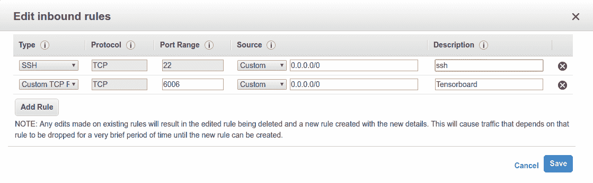
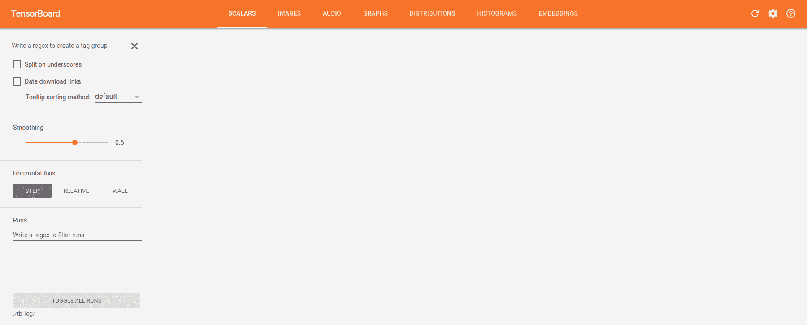
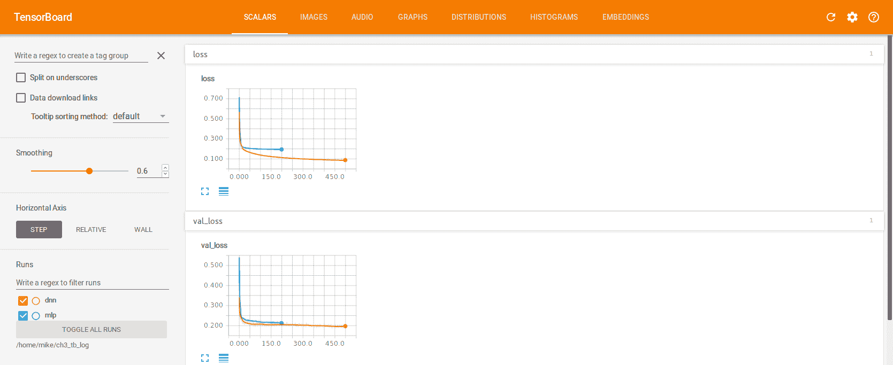
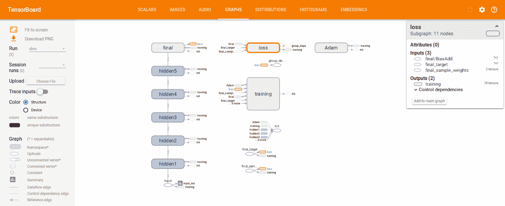
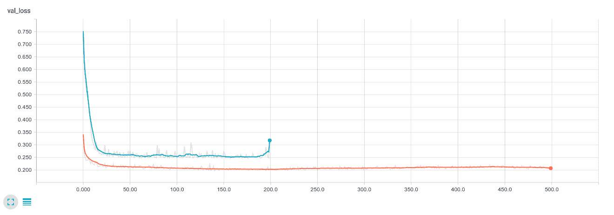
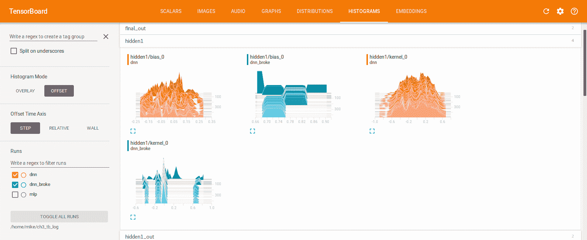

# 三、使用 TensorBoard 监控网络训练

在本章中，我将向您展示如何使用 TensorBoard 帮助更快更轻松地训练深度神经网络。 我认为 TensorBoard 是一个很棒的工具，经常被忽略，而它又常常被拖到脚注或上一章中。 现在，让我们看一下 TensorBoard，以便我们可以立即开始利用它。

我们将在本章介绍以下主题：

*   TensorBoard 的简要概述
*   设置 TensorBoard
*   将 Keras 连接到 TensorBoard
*   使用 TensorBoard

# TensorBoard 的简要概述

TensorBoard 是一个基于 Web 的应用，可以帮助您可视化 TensorFlow 中创建的深度神经网络的指标，参数和结构。 它将帮助您更快，更轻松地调试和优化深度神经网络。

正如您现在可能已经猜到的那样，深度神经网络可能变得相当复杂。 不幸的是，这意味着很多事情可能出错。 众所周知，我时不时地会犯一个错误，而当错误发生在一个深度神经网络内部时，该深度神经网络位于一个框架内，该框架在另一个框架上运行，在一个 GPU 上运行，很难找到这些错误。 他们。 TensorBoard 可能是您需要在其他本来很暗的房间中发现问题的手电筒。 TensorBoard 将允许您在训练网络时监视指标和参数的变化，这可以大大加快故障排除速度。

TensorBoard 也非常适合优化。 借助 TensorBoard，您可以直观地比较多个模型运行。 这使您可以试验不断变化的架构和超参数，然后相对于网络的其他运行评估那些变化。 所有这一切都可能在每个周期发生，因此如果您愿意，您可以取消效果不佳的模型运行，从而节省了时间和金钱。 您可以在[这个页面](https://www.tensorflow.org/programmers_guide/summaries_and_tensorboard)上阅读有关 TensorBoard 的更多信息。

# 设置 TensorBoard

TensorBoard 是一个独立的 Web 应用。 您将通过网络浏览器使用它。 设置需要两个步骤。 首先，我们将设置 TensorBoard 以可视化在 TensorFlow 和 Keras 中构建的网络，然后我们将设置 Keras 与 TensorBoard 共享信息。

本节介绍 TensorBoard 的设置。 接下来的内容将涉及修改 Keras 代码以与 TensorBoard 共享信息。

# 安装 TensorBoard

如果您已经安装了 TensorFlow，则您的机器上可能已经安装了 Tensorboard。 万一您可以安装和更新 TensorBoard，可以使用`pip`进行安装，就像 Keras 和 TensorFlow 一样。 要安装它，只需运行以下命令：

```py
pip install -U tensorboard
```

# TensorBoard 如何与 Keras/TensorFlow 交互

TensorBoard 和 TensorFlow 使用公共日志目录共享信息。 在 Keras 和 TensorFlow 训练中，Keras 将指标和激活直方图（稍后将对此进行详细介绍）写入您指定的日志目录中。 现在，让我们使用以下代码在主目录中为该示例创建一个日志目录：

```py
mkdir ~/ch3_tb_log
```

# 运行 TensorBoard

剩下的就是启动 TensorBoard 进程。 我们可以使用以下代码启动 TensorBoard：

```py
tensorboard --logdir ~/ch3_tb_log --port 6006
```

您可能已经猜到了，`--logdir`指定我们刚刚创建的目录，`--port 6006`指定 TensorBoard 将在其上运行的端口。 端口`6006`是默认端口。 但是，您可以使用所需的任何端口。

现在，您应该可以通过将浏览器指向`http://<ip address>:6006`来导航到 TensorBoard URL。

如果使用的是云服务，则可能还需要调整防火墙或安全规则，以允许通过端口`6006`连接到服务器。 在 Amazon Web Services（AWS）上，您可以通过编辑与您的 EC2 实例关联的安全组中的入站规则来执行此操作：



您可能不希望像我上面那样允许全世界范围内的开放访问。 这只是一个测试实例，因此我不太关心安全性，无论如何我都喜欢过着危险的生活。

如果一切正常，您应该看到一个空的 TensorBoard，如下所示：



不用担心，我们很快就会填满。

# 将 Keras 连接到 TensorBoard

现在 TensorBoard 已启动并正在运行，剩下的就是告诉 Keras 将 TensorBoard 日志写入我们上面指定的目录。 幸运的是，这确实很容易实现，它为我们提供了一个很好的机会来了解 Keras 中称为 **Keras 回调**的特殊函数类。

# 引入 Keras 回调

Keras 中的回调是可以在训练过程中运行的函数。 他们可以做各种伟大的事情，例如在某个周期之后节省模型权重，记录事情，更改超参数或方便地编写 TensorBoard 日志文件。 您甚至可以创建自己的自定义回调。

在下一节中，我们将使用 TensorBoard 回调。 但是，我鼓励您在[这个页面](https://keras.io/callbacks)上查看 Keras 中可用的所有回调。

TensorBoard 回调是可以在模型训练之前进行配置和实例化的对象。 我们将创建这些回调的列表。 一旦创建了要用于深度神经网络的回调列表，我们就可以将该列表作为参数传递给模型的`.fit()`方法。 然后，将在每个周期或 Keras 适当时使用这些回调。 在我们继续下一个示例时，这将更有意义。

# 创建一个 TensorBoard 回调

在本章中，我通过复制第 2 章“开始使用深度学习来解决回归问题”的网络和数据。 我们将做一些简单的添加来添加 TensorBoard 回调。 让我们从修改我们首先构建的`mlp`开始。

首先，我们需要使用以下代码导入 TensorBoard 回调类：

```py
from keras.callbacks import TensorBoard
```

然后，我们将启动回调。 我喜欢在创建所有回调的函数中执行此操作，以使事情精心制作和整理。 下面的`create_callbacks()`函数将返回我们将传递给`.fit()`的所有回调的列表。 在这种情况下，它将返回一个包含一个元素的列表：

```py
def create_callbacks():
    tensorboard_callback = TensorBoard(log_dir='~/ch3_tb_log/mlp',  
      histogram_freq=1, batch_size=32, write_graph=True, 
        write_grads=False)
    return [tensorboard_callback]
```

在继续之前，我们先介绍一下这里使用的一些参数：

*   `log_dir` **：**这是我们将为 TensorBoard 写入日志文件的路径。

您可能已经注意到，我正在将 MLP 网络的 TensorBoard 回调的日志写入`~/ch_3_tb_log/mlp`，这将在我们为 TensorBoard 指定的目录下创建一个新的目录`mlp`。 这是故意的。 我们将配置在第 2 章，“使用深度学习解决回归问题”训练的深度神经网络模型，以登录到单独的目录`~/ch_3_tb_log/dnn`。 这样做将使我们能够比较两个模型的运行。

*   `histogram_freq`：这指定我们将多长时间计算一次激活和权重的直方图（以周期为单位）。 它的默认值为 0，这会使日志更小，但不会生成直方图。 我们将介绍为什么以及何时您会对直方图感兴趣。
*   `batch_size`：这是用于计算直方图的批量大小。 默认为 32。
*   `write_graph`：此函数为布尔值。 这将告诉 TensorBoard 可视化网络图。 这可能非常方便，但也会使日志变得很大。
*   `write_grads`：此函数也是布尔值。 这将告诉 TensorBoard 也计算梯度的直方图。

由于 TensorFlow 会自动为您计算梯度，因此很少使用。 但是，如果您要使用自定义激活或费用，它可能是出色的故障排除工具。

TensorBoard 回调可以接受用于在图像上运行神经网络或通过使用嵌入式层的其他参数。 我们将在本书的后面介绍这两个方面。 如果您对这些函数感兴趣，请访问 [TensorBoard API 文档](https://keras.io/callbacks/#tensorboard)。

现在，我们只需要创建回调列表，并将`mlp`与`callbacks`参数匹配即可。 看起来像这样：

```py
callbacks = create_callbacks()
model.fit(x=data["train_X"], y=data["train_y"], batch_size=32, 
  epochs=200, verbose=1, validation_data=(data["val_X"], 
    data["val_y"]), callbacks=callbacks)
```

为了清楚起见，我将新参数加粗了。

在继续使用 TensorBoard 之前，我将以与检测`mlp`相同的方式来检测深度神经网络。 唯一的代码更改是我们将 TensorBoard 日志写入的目录。 下面给出了实现该方法的方法，供您参考：

```py
def create_callbacks():
tensorboard_callback = TensorBoard(log_dir='./ch3_tb_log/dnn', 
  histogram_freq=1, batch_size=32, write_graph=True, write_grads=False) 
    return [tensorboard_callback]
```

其余代码将相同。 现在，让我们再次训练每个网络，看看 TensorBoard。

# 使用 TensorBoard

现在我们已经完全配置了 TensorBoard 并告诉我们的网络如何向其发送日志数据，我们可以开始利用它了。 在本章的其余部分，我将向您展示一些我最喜欢的使用 TensorBoard 的方式。 TensorBoard 的功能不只此而已，我们将在本书的其余部分中重新讨论其他功能。

# 可视化训练

由于我们已在第 2 章“使用了深度学习解决回归问题”中使用这两种模型编写了日志数据，因此可以使用 TensorBoard 以图形方式比较这两种模型。 打开 TensorBoard 并转到`SCALARS`选项卡。 您应该会看到类似这样的内容。 您可能需要单击`loss`和`val_loss`来展开图形：



张量板显示模型的损失图和`val_loss`图

如果您查看屏幕的左下角，则应注意，我们创建的每个目录都有与之关联的运行。 两者均处于选中状态。 这意味着在我们的图形上，我们将看到两个模型的输出。

TensorBoard 可以容纳许多运行，并且您可以通过正则表达式过滤它们（例如`^dnn`将显示所有以`dnn`开头的运行）。 这意味着，如果您通过许多实验或运行（例如超参数优化）来搜索*最佳*模型，则可以在明确并一致地命名运行，并包含有意义的超参数和架构信息的情况下，以这个名字快速浏览它们！

这些图上的默认 **X** 比例尺是**周期**。 **Y** 值是我们选择的**损失函数**，即 **MAE**。 您可以单击图形以浏览它们并拖动以缩放。

看到这样的图，我们真的可以看到每个网络的相对偏差和方差。 虽然模型之间在训练损失方面有很好的分离，但深度神经网络在验证集上只得到了一点点改善，这表明我们已经进入了过拟合的领域。

# 可视化网络图

虽然能够查看我们的训练过程并比较模型显然很不错，但这并不是 TensorBoard 所能做的。 我们还可以使用它来可视化网络结构。 在这里，我导航到`GRAPHS`并提出了深度神经网络的结构：



TensorBoard 显示深度神经网络的结构

训练节点代表输入张量，默认情况下，正是这个巨型章鱼以某种无益的方式连接到图的其余部分。 要解决此问题，您只需单击该节点，然后单击从主图中删除。 然后将其移到侧面。

# 可视化损坏的网络

TensorBoard 是一个出色的故障排除工具。 为了证明这一点，我将复制我们的深度神经网络并将其破坏！ 幸运的是，打破神经网络真的很容易。 相信我，我已经无意间做了这件事，以至于我现在基本上是专家。

想象一下，您刚刚训练了一个新的神经网络，并且看到损失看起来像这样：



该网络的损失函数被卡住，并且比我们之前的运行要高得多。 什么地方出了错？

导航到 TensorBoard 的`HISTOGRAMS`部分，并可视化第一个隐藏层。 让我们比较两个网络中隐藏层 1 的权重直方图：



显示两个网络中隐藏层 1 的权重直方图的屏幕截图

对于标记为 dnn 的网络的偏差和权重，您将看到权重分布在整个图中。 您甚至可以说每个分布都可能是正态分布。

您也可以在“分布”部分比较权重和偏差。 两者都以略有不同的方式呈现大多数相同的信息。

现在，看看我们破碎的网络的权重和偏置。 并不是*这样分散*，实际上的权重基本上是相同的。 网络并不是真正的学习。 该层中的每个神经元看起来或多或少都是相同的。 如果您查看其他隐藏层，则会看到更多相同的层。

您可能想知道我是怎么做到的。 您很幸运，我会分享我的秘密。 毕竟，您永远都不知道何时需要断开自己的网络。 为了解决问题，我将网络中的每个神经元初始化为完全相同的值。 发生这种情况时，每个神经元在反向传播期间收到的误差是完全相同的，并且更改的方式也完全相同。 网络然后无法破坏对称性。 以随机方式将权重初始化到深度神经网络非常重要，如果您违反了该规则，就会发生这种情况！

遇到问题时，可以像这样完全使用 TensorBoard。 请记住，我们的深度神经网络有 4033，在深度学习领域中，它仍然可以算作*很小的*。 使用 TensorBoard，我们能够直观地检查 4033 个参数并确定问题。 TensorBoard 是一个用于深度学习的暗室中的神奇手电筒。

# 总结

在本章中，我们讨论了如何安装，配置和使用 TensorBoard。 我们讨论了如何使用 TensorBoard 在 TensorBoard 的`SCALARS`部分中的每个周期检查模型的损失函数，从而直观地比较模型。 然后，我们使用 TensorsBoard 的`GRAPHS`部分来可视化网络结构。 最后，我们通过查看直方图向您展示了如何使用 TensorBoard 进行故障排除。

在下一章中，我们将研究如何使用 Keras 和 TensorFlow 解决二分类问题，从而扩展我们的深度学习技巧。