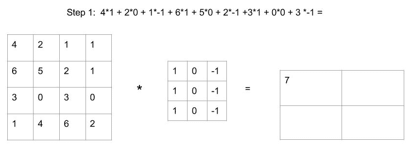
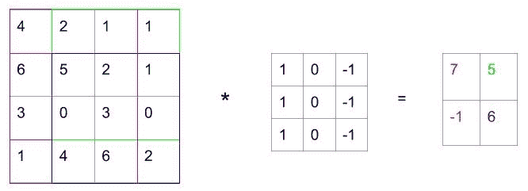
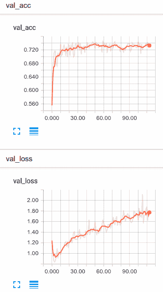
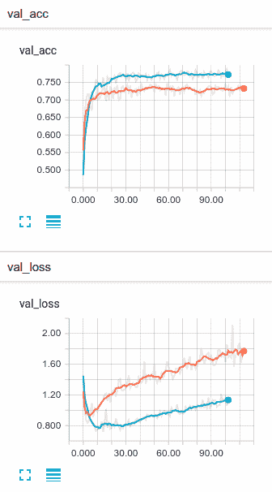

# 七、从头开始训练 CNN

深度神经网络彻底改变了计算机视觉。 实际上，我认为在最近几年中计算机视觉的进步已经使深层神经网络成为许多消费者每天使用的东西。 我们已经在第 5 章“使用 Keras 进行多分类”中使用计算机视觉分类器，其中我们使用了深度网络对手写数字进行分类。 现在，我想向您展示卷积层如何工作，如何使用它们以及如何在 Keras 中构建自己的卷积神经网络以构建更好，功能更强大的深度神经网络来解决计算机视觉问题。

我们将在本章介绍以下主题：

*   卷积介绍
*   在 Keras 中训练卷积神经网络
*   使用数据增强

# 卷积介绍

经过训练的卷积层由称为过滤器的许多特征检测器组成，这些特征检测器在输入图像上滑动作为移动窗口。 稍后我们将讨论过滤器内部的内容，但现在它可能是一个黑匣子。 想象一个已经训练过的过滤器。 也许该过滤器已经过训练，可以检测图像中的边缘，您可能会认为这是黑暗与明亮之间的过渡。 当它经过图像时，其输出表示它检测到的特征的存在和位置，这对于第二层过滤器很有用。 稍微扩展一下我们的思想实验，现在想象第二个卷积层中的一个过滤器，它也已经被训练过了。 也许这个新层已经学会了检测直角，其中存在由上一层找到的两个边缘。 不断地我们去； 随着我们添加层，可以了解更多复杂的特征。 特征层次结构的概念对于卷积神经网络至关重要。 下图来自 Honglak Lee 等人的《使用卷积深度信念网络的无监督学习层次表示》[2011]，非常好地说明了特征层次结构的概念：


这是一种非常强大的技术，它比我们先前在 MNIST 上使用的深度学习`flatten`和`classify`方法具有多个优势。 我们将在短期内讨论这些内容，但首先让我们深入了解过滤器。

# 卷积层如何工作？

在上一节中，我说过卷积层是一组充当特征检测器的过滤器。 在我们深入探讨该架构之前，让我们回顾一下卷积实际上是什么的数学。

让我们首先手动将以下`4 x 4`矩阵与`3 x 3`矩阵卷积，我们将其称为过滤器。 卷积过程的第一步是获取过滤器与`4 x 4`矩阵的前九个框的按元素乘积：



完成此操作后，我们将过滤器滑到一行上并执行相同的操作。 最后，我们将过滤器向下滑动，然后再次滑动。 卷积过程一旦完成，将使我们剩下`2x2`矩阵，如下图所示：



从技术上讲，这不是卷积，而是互相关。 按照惯例，我们将其称为卷积，并且就我们的目的而言，差异确实很小。

# 三维卷积

MNIST 是一个灰度示例，我们可以将每个图像表示为二维矩阵中从 0 到 255 的像素强度值。 但是，大多数时候，我们将使用彩色图像。 彩色图像实际上是三维矩阵，其中维是图像高度，图像宽度和颜色。 这将为图像中的每个像素生成一个矩阵，分别具有红色，蓝色和绿色值。

虽然我们先前展示的是二维过滤器，但我们可以通过在（高度，宽度，3（颜色））矩阵与`3 x 3 x 3`之间进行卷积来将其思想轻松转换为三个维度。 过滤。 最后，当我们在矩阵的所有三个轴上进行逐元素乘积运算时，仍然剩下二维输出。 提醒一下，这些高维矩阵通常称为张量，而我们正在做的就是使它们流动。

# 卷积层

之前我们已经讨论了由多个线性函数单元以及一些非线性（例如`relu`）组成的深度神经网络层。 在卷积层中，每个单元都是一个过滤器，结合了非线性。 例如，可以在 Keras 中定义卷积层，如下所示：

```py
from keras.layers import Conv2D
Conv2D(64, kernel_size=(3,3), activation="relu", name="conv_1")
```

在此层中，有 64 个独立的单元，每个单元都有`3 x 3 x 3`过滤器。 卷积操作完成后，每个单元都会像传统的完全连接层中那样为输出添加偏置和非线性（稍后会详细介绍该术语）。

在继续之前，让我们快速浏览一下示例的维度，以便确保我们都在同一页面上。 想象一下，我们有一个`32 x 32 x 3`的输入图像。 现在，我们将其与上述卷积层进行卷积。 该层包含 64 个过滤器，因此输出为`30 x 30 x 64`。 每个过滤器输​​出一个`30 x 30`矩阵。

# 卷积层的好处

因此，现在您希望对卷积层的工作原理有所了解，让我们讨论为什么我们要进行所有这些疯狂的数学运算。 为什么我们要使用卷积层而不是以前使用的普通层？

假设我们确实使用了普通层，以得到与之前讨论的相同的输出形状。 我们从`32 x 32 x 3`图像开始，所以总共有 3,072 个值。 我们剩下一个`30 x 30 x 64`矩阵。 总共有 57,600 个值。 如果我们要使用完全连接的层来连接这两个矩阵，则该层将具有 176,947,200 个可训练参数。 那是 1.76 亿。

但是，当我们使用上面的卷积层时，我们使用了 64 个`3 x 3 x 3`过滤器，这将导致 1,728 个可学习权重加 64 个偏差（总共 1,792 个参数）。

因此，显然卷积层需要的参数要少得多，但是为什么这很重要呢？

# 参数共享

由于过滤器是在整个图像中使用的，因此过滤器会学会检测特征，而不管其在图像中的位置如何。 事实证明，这非常有用，因为它为我们提供了平移不变性，这意味着我们可以检测到重要的内容，而不管其在整个图像中的朝向。

回想一下 MNIST，不难想象我们可能想检测 9 的循环，而不管它在照片中的位置如何。 提前思考，想象一个将图片分类为猫或汽车的分类器。 容易想象有一组过滤器可以检测出像汽车轮胎一样复杂的东西。 无论轮胎的方向在图像中的什么位置，检测该轮胎都是有用的，因为轮胎之类的东西强烈表明该图像不是猫（除非图像是驾驶汽车的猫）。

# 本地连接

过滤器由于其固定大小而着重于相邻像素之间的连通性。 这意味着他们将最强烈地学习本地特征。 当与其他过滤器以及层和非线性结合使用时，这使我们逐渐关注更大，更复杂的特征。 确实需要这种局部化特征的堆叠，这也是卷积层如此之大的关键原因。

# 池化层

除了卷积层，卷积神经网络通常使用另一种类型的层，称为**池化层**。 当添加卷积层时，使用池化层来减少卷积网络的维数，这会减少过拟合。 它们具有使特征检测器更坚固的附加好处。

池化层将矩阵划分为非重叠部分，然后通常在每个区域中采用最大值（在最大池化的情况下）。 可替代地，可以采用平均值。 但是，目前很少使用。 下图说明了此技术：


如我们所料，池化层在 Keras 中很容易实现。 以下代码可用于池化各层：

```py
from keras.layers import MaxPooling2D
pool1 = MaxPooling2D(pool_size=(2, 2), name="pool_1")
```

在这里，我们将池窗口定义为`2 x 2`。

尽管我们之前没有讨论过填充，但是在某些架构中，通常将卷积层或池化层的输入填充为 0，以使输出尺寸等于输入。 Keras 的卷积层和池化层中的默认值都是有效填充，这意味着按惯例没有填充。 如果需要，参数`padding="same"`将应用填充。

# 批量标准化

批量规范化有助于我们的网络整体表现更好，学习速度更快。 批量规范化在应用中也很容易理解。 但是，为什么它起作用，仍然受到研究人员的争议。

使用批量归一化时，对于每个小批量，我们可以在每个非线性之后（或之前）对那个批量进行归一化，使其平均值为 0，单位方差。 这使每一层都可以从中学习标准化输入，从而使该层的学习效率更高。

批归一化层很容易在 Keras 中实现，本章的示例将在每个卷积层之后使用它们。 以下代码用于批量规范化：

```py
from keras.layers import BatchNormalization
x = BatchNormalization(name="batch_norm_1")
```

# 在 Keras 中训练卷积神经网络

现在我们已经介绍了卷积神经网络的基础知识，是时候构建一个了。 在本案例研究中，我们将面对一个众所周知的问题，即 **CIFAR-10**。 该数据集由 Alex Krizhevsky，Vinod Nair 和 Geoffrey Hinton 创建。

# 输入

CIFAR-10 数据集由属于 10 类的 60,000 张`32 x 32`彩色图像组成，每类 6,000 张图像。 我将使用 50,000 张图像作为训练集，使用 5,000 张图像作为验证集，并使用 5,000 张图像作为测试集。

卷积神经网络的输入张量层将为`(N, 32, 32, 3)`，我们将像以前一样将其传递给`build_network`函数。 以下代码用于构建网络：

```py
def build_network(num_gpu=1, input_shape=None):
   inputs = Input(shape=input_shape, name="input")
```

# 输出

该模型的输出将是 0-9 之间的类别预测。 我们将使用与 MNIST 相同的 10 节点`softmax`。 令人惊讶的是，我们的输出层没有任何变化。 我们将使用以下代码来定义输出：

```py
output = Dense(10, activation="softmax", name="softmax")(d2)
```

# 成本函数和指标

在第 5 章中，我们使用分类交叉熵作为多分类器的损失函数。 这只是另一个多分类器，我们可以继续使用分类交叉熵作为我们的损失函数，并使用准确率作为度量。 我们已经开始使用图像作为输入，但是幸运的是我们的成本函数和指标保持不变。

# 卷积层

如果您开始怀疑此实现中是否会有任何不同之处，那就是这里。 我将使用两个卷积层，分别进行批量规范化和最大池化。 这将要求我们做出很多选择，当然我们以后可以选择作为超参数进行搜索。 不过，最好先让某些东西开始工作。 正如 Donald Knuth 所说，过早的优化是万恶之源。 我们将使用以下代码片段定义两个卷积块：

```py
# convolutional block 1
conv1 = Conv2D(64, kernel_size=(3,3), activation="relu", name="conv_1")(inputs)
batch1 = BatchNormalization(name="batch_norm_1")(conv1)
pool1 = MaxPooling2D(pool_size=(2, 2), name="pool_1")(batch1)

# convolutional block 2
conv2 = Conv2D(32, kernel_size=(3,3), activation="relu", name="conv_2")(pool1)
batch2 = BatchNormalization(name="batch_norm_2")(conv2)
pool2 = MaxPooling2D(pool_size=(2, 2), name="pool_2")(batch2)
```

因此，很明显，我们在这里有两个卷积块，它们由一个卷积层，一个批量规范化层和一个池化层组成。

在第一块中，我使用具有`relu`激活函数的 64 个`3 x 3`过滤器。 我使用的是有效（无）填充，跨度为 1。批量规范化不需要任何参数，并且实际上不是可训练的。 池化层使用`2 x 2`池化窗口，有效填充和跨度为 2（窗口尺寸）。

第二个块几乎相同。 但是，我将过滤器数量减半为 32。

尽管在该架构中有许多旋钮可以转动，但我首先要调整的是卷积的内核大小。 内核大小往往是一个重要的选择。 实际上，一些现代的神经网络架构（例如 Google 的 **Inception**）使我们可以在同一卷积层中使用多个过滤器大小。

# 全连接层

经过两轮卷积和合并后，我们的张量变得相对较小和较深。 在`pool_2`之后，输出尺寸为`(n, 6, 6, 32)`。

我们希望在这些卷积层中提取此`6 x 6 x 32`张量表示的相关图像特征。 为了使用这些特征对图像进行分类，在进入最终输出层之前，我们将将该张量连接到几个完全连接的层。

在此示例中，我将使用 512 神经元完全连接层，256 神经元完全连接层以及最后的 10 神经元输出层。 我还将使用丢弃法来帮助防止过拟合，但只有一点点！ 该过程的代码如下，供您参考：

```py
from keras.layers import Flatten, Dense, Dropout
# fully connected layers
flatten = Flatten()(pool2)
fc1 = Dense(512, activation="relu", name="fc1")(flatten)
d1 = Dropout(rate=0.2, name="dropout1")(fc1)
fc2 = Dense(256, activation="relu", name="fc2")(d1)
d2 = Dropout(rate=0.2, name="dropout2")(fc2)
```

我之前没有提到上面的`flatten`层。 `flatten`层完全按照其名称的含义执行。 将`flattens`，`n x 6 x 6 x 32`张量`flattens`转换为`n x 1152`向量。 这将作为全连接层的输入。

# Keras 中的多 GPU 模型

许多云计算平台可以提供包含多个 GPU 的实例。 随着我们模型的规模和复杂性的增长，您可能希望能够跨多个 GPU 并行化工作负载。 这在本机 TensorFlow 中可能涉及到一些过程，但是在 Keras 中，这只是一个函数调用。

正常构建模型，如以下代码所示：

```py
model = Model(inputs=inputs, outputs=output)
```

然后，我们借助以下代码将该模型传递给`keras.utils.multi_gpu_model`：

```py
model = multi_gpu_model(model, num_gpu)
```

在此示例中，`num_gpu`是我们要使用的 GPU 的数量。

# 训练

将模型放在一起，并结合我们新的 CUDA GPU 功能，我们提出了以下架构：

```py

def build_network(num_gpu=1, input_shape=None):
    inputs = Input(shape=input_shape, name="input")

    # convolutional block 1
    conv1 = Conv2D(64, kernel_size=(3,3), activation="relu", 
      name="conv_1")(inputs)
    batch1 = BatchNormalization(name="batch_norm_1")(conv1)
    pool1 = MaxPooling2D(pool_size=(2, 2), name="pool_1")(batch1)

    # convolutional block 2
    conv2 = Conv2D(32, kernel_size=(3,3), activation="relu", 
      name="conv_2")(pool1)
    batch2 = BatchNormalization(name="batch_norm_2")(conv2)
    pool2 = MaxPooling2D(pool_size=(2, 2), name="pool_2")(batch2)

    # fully connected layers
    flatten = Flatten()(pool2)
    fc1 = Dense(512, activation="relu", name="fc1")(flatten)
    d1 = Dropout(rate=0.2, name="dropout1")(fc1)
    fc2 = Dense(256, activation="relu", name="fc2")(d1)
    d2 = Dropout(rate=0.2, name="dropout2")(fc2)

    # output layer
    output = Dense(10, activation="softmax", name="softmax")(d2)

    # finalize and compile
    model = Model(inputs=inputs, outputs=output)
    if num_gpu > 1:
        model = multi_gpu_model(model, num_gpu)
    model.compile(optimizer='adam', loss='categorical_crossentropy', 
      metrics=["accuracy"])
    return model
```

我们可以使用它来构建我们的模型：

```py
model = build_network(num_gpu=1, input_shape=(IMG_HEIGHT, IMG_WIDTH, CHANNELS))
```

然后，我们可以满足您的期望：

```py
model.fit(x=data["train_X"], y=data["train_y"],
          batch_size=32,
          epochs=200,
          validation_data=(data["val_X"], data["val_y"]),
          verbose=1,
          callbacks=callbacks)
```

在我们训练该模型时，您会注意到过拟合是一个紧迫的问题。 即使只有相对较小的两个卷积层，我们也已经有点过拟合了。

您可以从以下图形中看到过拟合的影响：



不足为奇，50,000 次观察不是很多数据，尤其是对于计算机视觉问题。 在实践中，计算机视觉问题得益于非常大的数据集。 实际上，[Chen Sun 指出](https://arxiv.org/abs/1707.02968)，附加数据倾向于以数据量的对数线性帮助计算机视觉模型。 不幸的是，在这种情况下，我们无法真正找到更多数据。 但是也许我们可以做些。 接下来让我们讨论数据增强。

# 使用数据增强

数据增强是一种将变换应用于图像并使用原始图像和变换后的图像进行训练的技术。 想象一下，我们有一个训练类，里面有一只猫：


如果将水平翻转应用于此图像，我们将得到如下所示的内容：


当然，这是完全相同的图像，但是我们可以将原始图像和转换图像用作训练示例。 这不像我们训练中的两只猫那么好。 但是，它的确使我们可以告诉计算机，无论猫面对什么方向，猫都是猫。

在实践中，我们可以做的不仅仅是水平翻转。 当有意义时，我们也可以垂直翻转，移动和随机旋转图像。 这使我们能够人为地放大我们的数据集，并使它看起来比实际的更大。 当然，您只能将其推到目前为止，但这是在存在少量数据的情况下防止过拟合的一个非常强大的工具。

# Keras `ImageDataGenerator`

不久前，进行图像增强的唯一方法是对转换进行编码，并将其随机应用于训练集，然后将转换后的图像保存在磁盘上（上下坡，在雪中）。 对我们来说幸运的是，Keras 现在提供了`ImageDataGenerator`类，可以在我们训练时即时应用转换，而无需手工编码转换。

我们可以通过实例化`ImageDataGenerator`来创建一个数据生成器对象，如下所示：

```py
def create_datagen(train_X):
    data_generator = ImageDataGenerator(
        rotation_range=20,
        width_shift_range=0.02,
        height_shift_range=0.02,
        horizontal_flip=True)
    data_generator.fit(train_X)
    return data_generator
```

在此示例中，我同时使用了移位，旋转和水平翻转。 我只使用很小的移位。 通过实验，我发现更大的变化太多了，而且我的网络实际上无法学到任何东西。 您的经验会随着您的问题而变化，但是我希望较大的图像更能容忍移动。 在这种情况下，我们使用 32 个像素的图像，这些图像非常小。

# 用生成器训练

如果您以前没有使用过生成器，则它就像迭代器一样工作。 每次调用`ImageDataGenerator` `.flow()`方法时，它都会产生一个新的训练小批量，并将随机变换应用于所馈送的图像。

Keras `Model`类带有`.fit_generator()`方法，该方法使我们可以使用生成器而不是给定的数据集：

```py
model.fit_generator(data_generator.flow(data["train_X"], data["train_y"], batch_size=32),
                    steps_per_epoch=len(data["train_X"]) // 32,
                    epochs=200,
                    validation_data=(data["val_X"], data["val_y"]),
                    verbose=1,
                    callbacks=callbacks)
```

在这里，我们用生成器替换了传统的`x`和`y`参数。 最重要的是，请注意`steps_per_epoch`参数。 您可以从训练集中任意采样替换次数，并且每次都可以应用随机变换。 这意味着我们每个周期可以使用的迷你批数比数据还多。 在这里，我将仅根据观察得到的样本数量进行采样，但这不是必需的。 如果可以，我们可以并且应该将这个数字提高。

在总结之前，让我们看一下这种情况下图像增强的好处：



如您所见，仅一点点图像增强确实帮助了我们。 不仅我们的整体精度更高，而且我们的网络过拟合的速度也慢得多。 如果您的计算机视觉问题只包含少量数据，那么图像增强就是您想要做的事情。

# 总结

在本章中，我们快速介绍了许多基础知识。 我们讨论了卷积层及其如何用于神经网络。 我们还介绍了批量规范化，池化层和数据增强。 最后，我们使用 Keras 从零开始训练卷积神经网络，然后使用数据增强对该网络进行改进。

我们还讨论了如何基于数据的渴望计算机视觉的深度神经网络问题。 在下一章中，我将向您展示**迁移学习**，这是我最喜欢的技术之一。 这将帮助您快速解决计算机视觉问题，并获得惊人的结果并且数据量更少。