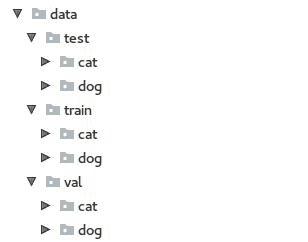
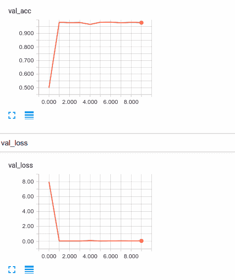
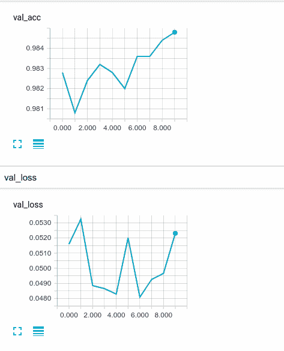

# 八、将预训练的 CNN 用于迁移学习

迁移学习很棒。 实际上，在一本充满奇妙事物的书中，这可能是我必须告诉您的最奇妙的事物。 如果没有，那也许至少是我可以教给您的最有用和最实用的深度学习技术。 迁移学习可以帮助您解决深度学习问题，尤其是计算机视觉问题，而涉及问题范围的数据和数据却很少。 在本章中，我们将讨论什么是迁移学习，什么时候应该使用它，最后讨论如何在 Keras 中进行迁移学习。

我们将在本章介绍以下主题：

*   迁移学习概述
*   何时应使用迁移
*   源/目标数量和相似性的影响
*   Keras 的迁移学习

# 迁移学习概述

在第 7 章和“卷积神经网络”中，我们训练了约 50,000 个观测值的卷积神经网络，并且由于网络和问题的复杂性，在开始训练的短短几个周期后，我们过拟合了。 如果您还记得的话，我曾评论说我们的训练集中有 50,000 个观察结果对于计算机视觉问题不是很大。 确实如此。 计算机视觉问题喜欢数据，而我们可以提供给他们的数据越多，它们的表现就越好。

我们可能认为计算机视觉技术最先进的深度神经网络通常在称为 **ImageNet** 的数据集上进行训练。 [`ImageNet`数据集](http://www.image-net.org/)是包含 120 万张图像的 1,000 个分类器。 这还差不多！ 如此庞大的数据集使研究人员能够构建真正复杂的深度神经网络，以检测复杂的特征。 当然，在 120 万张图像上训练有时具有 100 多个层的模型的价格很高。 训练可能需要数周和数月，而不是数小时。

但是，如果我们可以从一个最先进的，多层的，经过数百万张图像训练的网络开始，然后仅使用少量数据将该网络应用于我们自己的计算机视觉问题，该怎么办？ 那就是**迁移学习**！

要使用迁移学习，我们将执行以下步骤：

1.  从训练非常大的复杂计算机视觉问题的模型开始； 我们将其称为我们的源域
2.  删除网络的最后一层（`softmax`层），并可能删除其他完全连接的层
3.  将最后几层替换为适合我们新问题的层，我们将其称为目标域
4.  冻结所有已训练的层，使其权重不变
5.  在目标域数据上训练网络

如果我们在这里停止，这通常被称为特征提取，因为我们正在使用在源域上训练的网络来提取目标域的视觉特征。 然后，我们使用栓接到该特征提取网络上的相对较小的神经网络来执行目标域任务。 根据我们的目标和数据集，这可能就足够了。

可选地，我们将通过解冻一些或所有冻结的层来微调整个网络，然后通常以很小的学习率再次进行训练。 我们将在短期内讨论何时使用微调，但是请确保我们涵盖了首先使用迁移学习的一些原因。

# 何时应使用迁移

当您的数据有限且存在解决类似问题的网络时，迁移学习会非常有效。 您可以使用迁移学习将最先进的网络和大量数据带入一个其他小的问题。 那么，什么时候应该使用迁移学习？ 随时可以！ 但是，我希望您首先考虑两个规定。 我们将在以下各节中讨论它们。

# 数据有限

关于计算机视觉和迁移学习，我最常被问到的问题是：我必须拥有多少张图像？ 这是一个很难回答的问题，因为，正如我们将在下一节中看到的那样，更多通常更好。 一个更好的问题可能是：我可以使用几张图像来充分解决我的业务问题？

那么，我们的数据集有多有限？ 尽管远非科学，但我已经建立了使用多达 2,000 张图像进行二分类任务的有用模型。 更简单的任务和更多样化的图像集通常可以在较小的数据集下获得更令人满意的结果。

根据经验，您至少需要几千张某类的图像，而通常最好使用 10 至 2 万张图像。

# 常见问题域

如果您的目标域至少与源域有些相似，那么迁移学习会很有效。 例如，假设您正在将图像分类为包含猫或狗。 有许多`ImageNet`训练有素的图像分类器非常适合用于此类型或问题。

相反，让我们想象我们的问题是将 CT 扫描或 MRI 归类为是否包含肿瘤。 此目标域与`ImageNet`源域非常不同。 这样，虽然使用迁移学习可能（并且可能会）有好处，但我们将需要更多的数据，并且可能需要进行一些微调才能使网络适应此目标域。

# 源/目标数量和相似性的影响

直到最近，很少有人研究数据量和源/目标域相似性对迁移学习表现的影响。 但是，这是一个对迁移学习的可用性很重要的主题，也是我撰写的主题。 在我的同事撰写的[《调查数据量和域相似性对迁移学习应用的影响》](https://arxiv.org/pdf/1712.04008.pdf)中，对这些主题进行了一些实验。 这就是我们发现的东西。

# 更多数据总是有益的

Google 研究人员在《重新研究深度学习周期数据的不合理有效性》中进行的几次实验中，构建了一个内部数据集，其中包含 3 亿个观测值，显然比`ImageNet`大得多。 然后，他们在该数据集上训练了几种最先进的架构，从而使模型显示的数据量从 1000 万增加到 3000 万，1 亿，最后是 3 亿。 通过这样做，他们表明模型表现随用于训练的观察次数的对数线性增加，这表明在源域中，更多的数据总是有帮助。

但是目标域呢？ 我们使用了一些类似于我们在迁移学习过程中可能使用的类型的数据集重复了 Google 实验，包括我们将在本章稍后使用的`Dogs versus Cats`数据集。 我们发现，在目标域中，模型的表现随用于训练的观察次数的对数线性增加，就像在源域中一样。 更多数据总是有帮助的。

# 源/目标域相似度

迁移学习的独特之处在于您担心源域和目标域之间的相似度。 经过训练以识别人脸的分类器可能不会轻易迁移到识别各种架构的目标领域。 我们进行了源和目标尽可能不同的实验，以及源和目标域非常相似的实验。 毫不奇怪，当迁移学习应用中的源域和目标域非常不同时，与相似时相比，它们需要更多的数据。 它们也需要更多的微调，因为当域在视觉上非常不同时，特征提取层需要大量的学习。

# Keras 的迁移学习

与本书中的其他示例不同，在这里我们将需要涵盖目标域问题，源域问题以及我们正在使用的网络架构。 我们将从目标域的概述开始，这是我们要解决的问题。 然后，我们将介绍网络最初经过训练的源域，并简要介绍我们将使用的网络架构。 然后，我们将在本章的其余部分中将问题联系在一起。 我们需要分别考虑两个域，因为它们的大小和相似性与网络表现密切相关。 目标和源的类型越近，结果越好。

# 目标域概述

在本章的示例中，我将使用 Kaggle 的`Dogs versus Cats`数据集。 该数据集包含 25,000 张猫和狗的图像。 每个类别之间达到完美平衡，每个类别 12,500。 可以从[这里](https://www.kaggle.com/c/dogs-vs-cats/data)下载数据集。

这是一个二分类问题。 每张照片都包含狗或猫，但不能同时包含两者。

该数据集由 Jeremy Elson 等人于 2007 年组装。 ，它目前托管在 [www.kaggle.com](https://www.kaggle.com/) 上。 它是完全免费下载和用于学术用途的，但是它确实需要一个 Kaggle 帐户并接受其最终用户许可。 一样，这是一个了不起的数据集，因此我在此处包括使用说明。

# 源域概述

我们将从在 ImageNet 上训练的深度神经网络开始。 如果您从“迁移学习概述”部分中回顾过，`ImageNet`是一个 1,000 类分类器，训练了大约 120 万张图像。 `ImageNet`数据集中都包含狗和猫的图像，因此在这种情况下，我们的目标域实际上与我们的源域非常相似。

# 源网络架构

我们将使用 [**Inception-V3** 网络架构](https://www.cv-foundation.org/openaccess/content_cvpr_2016/papers/Szegedy_Rethinking_the_Inception_CVPR_2016_paper.pdf)。 与您到目前为止在本书中所看到的相比，Inception 架构很有趣并且非常复杂。 如果您从第 7 章，“卷积神经网络”中回想起，我们必须围绕网络架构做出的决定之一就是选择过滤器大小。 对于每一层，我们必须决定是否应使用例如`3 x 3`过滤器，而不是`5 x 5`过滤器。 当然，也许根本就不需要另一次卷积。 也许像池化之类的东西可能更合适。 因此，如果我们在每一层都做所有事情，该怎么办？ 这就是开始的动机。

该架构基于一系列模块或称为**初始模块**的构建块。 在每个初始模块中，先前的激活都赋予`1 x 1`卷积，`3 x 3`卷积，`5 x 5`卷积和最大池化层。 然后将输出连接在一起。

Inception-V3 网络由几个相互堆叠的 Inception 模块组成。 最后两层都完全连接，输出层是 1,000 个神经元 softmax。

通过使用`keras.applications.inception_v3`中的`InceptionV3`类，我们可以加载 Inception-V3 网络及其权重。 Keras 的网络动物园中有几个流行的网络，它们都位于`keras.applications`内部。 只需多一点工作就可以加载在 TensorFlow 中创建的模型。 也可以转换在其他架构中训练的模型，但这不在快速参考的范围之内。

要加载 Inception，我们只需要实例化一个`InceptionV3`对象，它是 Keras 模型，如以下代码所示：

```py
from keras.applications.inception_v3 import InceptionV3
base_model = InceptionV3(weights='imagenet', include_top=False)
```

您可能会注意到，我们在这里说了`include_top=False`，这表明我们不需要网络的顶层。 这免除了我们手动清除它们的工作。 第一次运行此代码时，它将下载 Inception-V3 网络架构并保存权重并将其缓存给我们。 现在，我们只需要添加我们自己的完全连接的层即可。

# 迁移网络架构

我们将用更适合我们的用例的全连接层替换最后两层。 由于我们的问题是二分类，因此我们将使用激活`sigmoid`的单个神经元替换输出层，如以下代码所示：

```py
# add a global spatial average pooling layer
x = base_model.output
x = GlobalAveragePooling2D()(x)
# let's add a fully-connected layer
x = Dense(1024, activation='relu')(x)
# and a logistic layer
predictions = Dense(1, activation='sigmoid')(x)

# this is the model we will train
model = Model(inputs=base_model.input, outputs=predictions)
```

注意，我们在这里使用`GlobalAveragePooling2D`层。 该层将前一层的 4D 输出平坦化为 2D 层，通过求平均将其适合于我们的全连接层。 通过指定`pooling='avg' or 'max'`来加载基本模型时，也可以完成此操作。 这是您如何处理此问题的电话。

至此，我们已经准备好训练网络。 但是，在执行此操作之前，我们需要记住冻结基本模型中的层，以免新的完全连接的层疯狂地试图学习时它们的权重不变。 为此，我们可以使用以下代码遍历各层并将其设置为不可训练：

```py
for layer in base_model.layers:
   layer.trainable = False

```

# 数据准备

我们将首先从 [Kaggle](https://www.kaggle.com/c/dogs-vs-cats/data) 下载数据，然后将`train.zip`解压缩到本书的`Chapter08`目录中。 现在，您将拥有一个名为`train/`的目录，其中包含 25,000 张图像。 每个名称都将类似于`cat.number.jpg`。

我们想移动这些数据，以便我们为训练，验证和测试创建单独的目录。 这些目录中的每一个都应具有猫和狗的目录。 这都是非常无聊且平凡的工作，因此，我创建了`data_setup.py`来为您执行此操作。 一旦运行它，数据将在本章的其余部分中全部格式化。

完成后，您将拥有一个具有以下结构的数据目录：



# 数据输入

快速浏览图像应使您确信我们的图像的分辨率和大小均不同。 正如您从第 7 章，“卷积神经网络”，所了解的那样，我们需要这些图像的大小与神经网络的输入张量一致。 这是一个非常现实的问题，您将经常面对计算机视觉任务。 虽然当然可以使用 [**ImageMagick**](http://www.imagemagick.org) 之类的程序来批量调整图像大小，但 Keras `ImageDataGenerator`类可用于快速调整图像大小，这就是我们要做的。

Inception-V3 期望`299 x 299 x 3`图像。 我们可以在数据生成器中指定此目标大小，如以下代码所示：

```py
train_datagen = ImageDataGenerator(rescale=1./255)
val_datagen = ImageDataGenerator(rescale=1./255)

train_generator = train_datagen.flow_from_directory(
    train_data_dir,
    target_size=(img_width, img_height),
    batch_size=batch_size,
    class_mode='binary')

validation_generator = val_datagen.flow_from_directory(
    val_data_dir,
    target_size=(img_width, img_height),
    batch_size=batch_size,
    class_mode='binary')
```

如果需要，我们当然可以在这里使用数据增强，但是我们实际上并不需要它。

我们在这里最有趣的事情可能是使用数据生成器的`flow_from_directory()`方法。 此方法采用一条路径，并根据该路径生成一批图像。 它为我们完成了将映像从磁盘中取出的所有工作。 由于它一次执行一批，因此即使不需要时，我们甚至不必将所有 50,000 个图像保留在 RAM 中。 很酷吧？

# 训练（特征提取）

对于此模型，我们将训练两次。 对于第一轮训练，我们将通过冻结网络的训练来进行 10 个周期的特征提取，仅调整完全连接的层权重，如我们在“迁移网络架构”部分中所讨论的。 然后，在下一部分中，我们将解冻某些层并再次进行训练，对另外 10 个周期进行微调，如以下代码所示：

```py
data_dir = "data/train/"
val_dir = "data/val/"
epochs = 10
batch_size = 30
model = build_model_feature_extraction()
train_generator, val_generator = setup_data(data_dir, val_dir)
callbacks_fe = create_callbacks(name='feature_extraction')
# stage 1 fit
model.fit_generator(
    train_generator,
    steps_per_epoch=train_generator.n // batch_size,
    epochs=epochs,
    validation_data=val_generator,
    validation_steps=val_generator.n // batch_size,
    callbacks=callbacks_fe,
    verbose=1)

scores = model.evaluate_generator(val_generator, steps=val_generator.n // batch_size)
print("Step 1 Scores: Loss: " + str(scores[0]) + " Accuracy: " + str(scores[1]))
```

在前面的示例中，我们使用`ImageDataGenerator`的`n`属性来了解可用于生成器的图像总数，并将每个周期的步骤定义为该数目除以批量大小。

此代码的其余部分应该很熟悉。

如前所述，我们只需要训练大约 10 个周期。 现在，让我们看一下 TensorBoard 中的训练过程：



如您所见，即使经过一个周期，网络的表现仍然非常好。 直到大约第 7 个阶段，我们都取得了非常微弱的表现提升。在第 7 个阶段，我们达到了最佳表现，导致 0.9828 的精度和 0.0547 的损失。

# 训练（微调）

为了微调网络，我们需要解冻一些冻结的层。 您可以解冻多少层，并且可以解冻任意数量的网络。 实际上，在大多数情况下，我们仅看到解冻最顶层的好处。 在这里，我仅解冻最后一个初始块，该块从图的`249`层开始。 以下代码描述了此技术：

```py
def build_model_fine_tuning(model, learning_rate=0.0001, momentum=0.9):
        for layer in model.layers[:249]:
            layer.trainable = False
        for layer in model.layers[249:]:
            layer.trainable = True
        model.compile(optimizer=SGD(lr=learning_rate, 
         momentum=momentum), loss='binary_crossentropy', metrics=
           ['accuracy'])
        return model
```

另请注意，我对**随机梯度下降**使用的学习率非常低，因此需要进行微调。 重要的是，此时应缓慢移动重物，以免在错误的方向上发生太大的飞跃。 我不建议使用`adam`或`rmsprop`进行微调。 以下代码描述了微调机制：

```py
callbacks_ft = create_callbacks(name='fine_tuning')
# stage 2 fit
model = build_model_fine_tuning(model)
model.fit_generator(
 train_generator,
 steps_per_epoch=train_generator.n // batch_size,
 epochs=epochs,
 validation_data=val_generator,
 validation_steps=val_generator.n // batch_size,
 callbacks=callbacks_ft,
 verbose=2)

scores = model.evaluate_generator(val_generator, steps=val_generator.n // batch_size)
print("Step 2 Scores: Loss: " + str(scores[0]) + " Accuracy: " + str(scores[1]))
```

我们可以再次查看 TensorBoard 图，以了解我们在进行微调后是否能得到任何收益：



毫无疑问，我们的模型确实可以改进，但是只有很少的改进。 虽然规模很小，但您会注意到验证损失正在努力改善，并且可能显示出一些过拟合的迹象。

在这种情况下，微调几乎没有带来任何好处，但并非总是如此。 在此示例中，目标域和源域非常相似。 如前所述，由于源域和目标域不同，您从微调中获得的收益将增加。

# 总结

在本章中，我们介绍了迁移学习，并演示了如何使用在源域上进行预训练的网络如何极大地缩短训练时间，并最终改善我们的深度神经网络的表现。 我希望您喜欢这项技术，它是我的最爱之一，因为它非常实用，而且我通常会从中获得很好的效果。

在下一章中，我们将从计算机视觉过渡到可以记住先前输入的网络，使它们成为预测序列中下一项的理想选择。