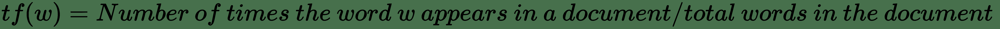
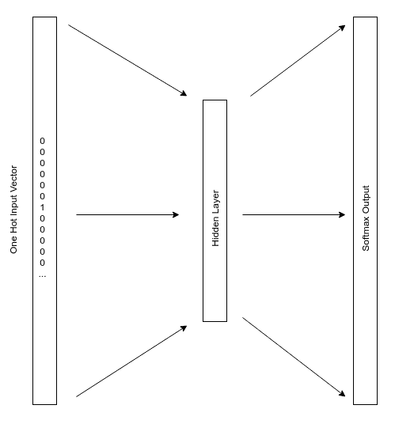
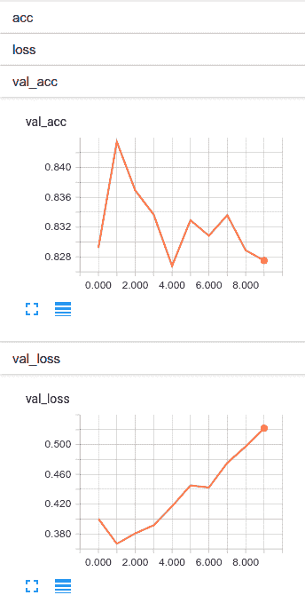
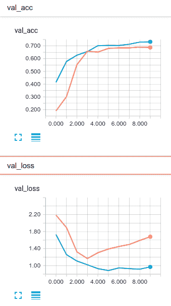

# 十、使用词嵌入从头开始训练 LSTM

到目前为止，我们已经看到了深度学习在结构化数据，图像数据甚至时间序列数据中的应用示例。 似乎唯一正确的方法是继续进行**自然语言处理**（**NLP**）作为下一步。 机器学习和人类语言之间的联系非常有趣。 深度学习已像计算机视觉一样，以指数方式加快了该领域的发展速度。 让我们从 NLP 的简要概述开始，并在本章中将要完成的一些任务开始。

我们还将在本章中介绍以下主题：

*   自然语言处理入门
*   向量化文本
*   词嵌入
*   Keras 嵌入层
*   用于自然语言处理的一维 CNN 
*   文档分类的案例研究

# 自然语言处理入门

NLP 领域广阔而复杂。 从技术上讲，人类语言与计算机科学之间的任何交互都可能属于此类。 不过，为了便于讨论，我将 NLP 限于分析，理解，有时生成人类语言。

从计算机科学的起源开始，我们就对 NLP 着迷，因为它是通向强大人工智能的门户。 1950 年，艾伦·图灵（Alan Turing）提出了图灵测试，其中涉及一台计算机，它很好地模仿了一个人，使其与另一个人无法区分，以此作为机器智能的度量标准。 从那时起，我们一直在寻找帮助机器理解人类语言的聪明方法。 在此过程中，我们开发了语音到文本的转录，人类语言之间的自动翻译，文档的自动汇总，主题建模，命名实体标识以及各种其他用例。

随着我们对 NLP 的了解不断增长，我们发现 AI 应用在日常生活中变得越来越普遍。 聊天机器人作为客户服务应用已变得司空见惯，最近，它们已成为我们的个人数字助理。 在撰写本文时，我可以要求 Alexa 在我的购物清单中添加一些内容或演奏一些流畅的爵士乐。 自然语言处理以一种非常有趣和强大的方式将人类连接到计算机。

在本章中，我将专注于理解人类语言，然后使用这种理解进行分类。 我实际上将进行两个分类案例研究，一个涉及语义分析，另一个涉及文档分类。 这两个案例研究为深度学习的应用提供了巨大的机会，而且它们确实非常相似。

# 语义分析

**语义分析**从技术上讲是对语言含义的分析，但是通常当我们说语义分析时，我们是在谈论理解作者的感受。 语义分类器通常试图将某些话语分类为积极，消极，快乐，悲伤，中立等。

讽刺是我最喜欢的语言之一，这使这成为一个具有挑战性的问题。 人类语言中有许多微妙的模式，这些对于计算机学习来说是非常具有挑战性的。 但是挑战并不意味着没有可能。 只要有一个好的数据集，这个任务就很有可能实现。

要成功解决此类问题，需要一个好的数据集。 虽然我们当然可以在整个互联网上找到大量的人类对话，但其中大多数没有标签。 查找带标签的病例更具挑战性。 解决此问题的早期尝试是收集包含表情符号的 Twitter 数据。 如果一条推文中包含:)，则认为该推文是肯定的。 这成为 Jimmy Lin 和 Alek Kolcz 在 Twitter 上的[大规模机器学习中引用的知名表情符号技巧。](https://www.semanticscholar.org/paper/Large-scale-machine-learning-at-twitter-Lin-Kolcz/d192c32acab207b89fb11df88ef79c6ce5a69411)

这种类型的分类器的大多数业务应用都是二元的，我们尝试在其中预测客户是否满意。 但是，那当然不是对这种语言模型的限制。 只要我们有用于此类事物的标签，我们就可以为其他音调建模。 我们甚至可能尝试衡量某人的声音或语言中的焦虑或困扰； 但是，解决音频输入超出了本章的范围。

进一步挖掘数据的尝试包括使用与正面和负面电影评论相关的语言以及与在线购物产品评论相关的语言。 这些都是很好的方法。 但是，在使用这些类型的数据源对来自不同域的文本进行分类时，应格外小心。 您可能会想到，电影评论或在线购买中使用的语言可能与 IT 帮助台客户支持电话中使用的语言完全不同。

当然，我们当然可以对情绪进行更多的分类。 在下一节中，我们将讨论文档分类的更一般的应用。

# 文档分类

**文档分类**与情感分析密切相关。 在这两种情况下，我们都使用文本将文档分类。 实际上，这只是改变的原因。 文档分类就是根据文档的类型对文档进行分类。 世界上最明显，最常见的文档分类系统是垃圾邮件过滤器，但它还有许多其他用途。

我最喜欢的文档分类用途之一是解决“联邦主义者论文”的原始作者的辩论。 亚历山大·汉密尔顿（Alexander Hamilton），詹姆斯·麦迪逊（James Madison）和约翰·杰伊（John Jay）在 1787 年和 1788 年以化名 Publius 出版了 85 篇文章，支持批准美国宪法。 后来，汉密尔顿提供了一份清单，详细列出了每篇论文的作者在 1804 年与亚伦·伯尔（Aaron Burr）进行致命的对决之前。麦迪逊（Madison）在 1818 年提供了自己的清单，这在作者身份上引起了争执，此后学者一直在努力解决。 虽然大多数人都同意有争议的作品是麦迪逊的作品，但是关于两者之间的合作仍存在一些理论。 将这 12 个有争议的文档归类为 Madison 还是 Hamilton，已经成为许多数据科学博客的不二之选。 正式而言，Glenn Fung 的论文[《有争议的联邦主义者论文：通过凹面最小化进行 SVM 特征选择》](http://pages.cs.wisc.edu/~gfung/federalist.pdf) 涵盖了相当严格的主题。

文档分类的最后一个示例可能是围绕了解文档的内容并规定操作。 想象一下一个分类器，它可能会读取有关法律案件的一些信息，例如请愿/投诉和传票，然后向被告提出建议。 然后，我们的假想系统可能会说：*鉴于我在其他类似情况下的经验，您可能想解决*。

情感分析和文档分类是基于计算机理解自然语言的能力的强大技术。 但是，当然，这引出了一个问题，我们如何教计算机阅读？

# 向量化文本

机器学习模型（包括深度神经网络）吸收数字信息并产生数字输出。 自然语言处理的挑战自然就变成了将单词转换成数字。

我们可以通过多种方式将单词转换为数字。 所有这些方法都满足相同的目标，即将某些单词序列转换为数字向量。 有些方法比其他方法更好，因为有时进行转换时，翻译中可能会失去一些含义。

# NLP 术语

让我们从定义一些通用术语开始，以便消除它们使用可能引起的任何歧义。 我知道，由于您可以阅读，因此您可能会对这些术语有所了解。 如果这看起来很古怪，我深表歉意，但是我保证，这将立即与我们接下来讨论的模型有关：

*   **词**：我们将使用的大多数系统的原子元素。 尽管确实存在某些字符级模型，但我们今天不再讨论它们。
*   **句子**：表达陈述，问题等的单词集合。
*   **文档**：文档是句子的集合。 它可能是一个句子，或更可能是多个句子。
*   **语料库**：文档的集合。

# 词袋模型

**词袋**（**BoW**）模型是 NLP 模型，实际上忽略了句子结构和单词放置。 在“单词袋”模型中，我们将每个文档视为单词袋。 很容易想到这一点。 每个文档都是一个包含大量单词的容器。 我们忽略句子，结构以及哪个词排在前或后。 我们对文档中包含“非常”，“很好”和“不好”这两个词的事实感到关注，但是我们并不真正在意“好”而不是“坏”。

词袋模型很简单，需要相对较少的数据，并且考虑到该模型的朴素性，其运行效果非常好。

注意，这里使用模型表示表示。 我并不是在特定意义上指深度学习模型或机器学习模型。 相反，在这种情况下，模型是表示文本的一种方式。

给定一个由一组单词组成的文档，则需要定义一种策略来将单词转换为数字。 稍后我们将介绍几种策略，但首先我们需要简要讨论词干，词形化和停用词。

# 词干，词根去除和停用词

**词干**和**词根去除**是两种不同但非常相似的技术，它们试图将每个单词还原为基本形式，从而简化了语言模型。 例如，如果要阻止猫的各种形式，我们将在此示例中进行转换：

```py
cat, cats, cat's, cats' -> cat
```

限制词法化和词干化之间的差异成为我们进行此转换的方式。 提取是通过算法完成的。 当应用于同一个单词的多种形式时，提取的根在大多数情况下应相同。 这个概念可以与词条反义化形成对比，词条反义化使用具有已知基础的词汇表并考虑如何使用该词。

词干处理通常比词条化处理快得多。 Porter 提取器在很多情况下都可以很好地工作，因此您可以将其作为提取的第一个安全选择。

停用词是在该语言中非常常见的词，但几乎没有语义。 典范示例是`the`一词。 我在上一句话中只使用了 3 次，但实际上只保留了一次意思。 通常，我们会删除停用词，以使输入内容更加稀疏。

大部分 BoW 模型都受益于词干，词根化和删除停用词。 有时，我们很快将要讨论的词嵌入模型也可以从词干提取或词义化中受益。 词嵌入模型很少会受益于停用词的删除。

# 计数和 TF-IDF 向量化

计数向量化和**词频逆文档频率**（**TF-IDF**）是两种策略，将词袋转换成适合机器学习算法输入的特征向量。

计数向量化采用我们的一组单词，并创建一个向量，其中每个元素代表语料库词汇中的一个单词。 自然，一组文档中唯一单词的数量可能会很大，并且许多文档可能不包含语料库中存在的单词的任何实例。 在这种情况下，使用稀疏矩阵表示这些类型的字向量通常是非常明智的。 当一个单词出现一次或多次时，计数向量化器将简单地对该单词出现在文档中的次数进行计数，然后将该计数放置在代表该单词的位置。

使用计数向量化器，整个语料库可以表示为二维矩阵，其中每一行是一个文档，每一列是一个单词，然后每个元素就是该单词在文档中的计数。

在继续之前，让我们先看一个简单的例子。 想象一个具有两个文档的语料库：

```py
docA = "the cat sat on my face"
docB = "the dog sat on my bed"
```

语料库词汇为：

```py
{'bed', 'cat', 'dog', 'face', 'my', 'on', 'sat', 'the'}
```

因此，如果我们要为该语料库创建一个计数嵌入，它将看起来像这样：

|  | `bed` | `cat` | `dog` | `face` | `my` | `on` | `sat` | `the` |
| --- | --- | --- | --- | --- | --- | --- | --- | --- |
| **文件 0** | 0 | 1 | 0 | 1 | 1 | 1 | 1 | 1 |
| **文件 1** | 1 | 0 | 1 | 0 | 1 | 1 | 1 | 1 |

这就是计数向量化。 这是我们工具箱中最简单的向量化技术。

计数向量化的问题在于我们使用了很多根本没有太多意义的单词。 实际上，英语中最常用的单词（`the`）占我们所讲单词的 7%，是第二个最受欢迎的单词（`of`）出现频率的两倍。 语言中单词的分布是幂律分布，[这是称为 Zipf 定律的基础](https://en.wikipedia.org/wiki/Zipf%27s_law)。 如果我们从计数中构造文档矩阵，那么最终得到的数字将包含很多信息，除非我们的目标是查看谁最经常使用`the`。

更好的策略是根据单词在文档中的相对重要性对单词进行加权。 为此，我们可以使用 TF-IDF。

一个单词的 TF-IDF 分数是：


在此公式中：



这个公式：

 

如果我们要为同一语料库计算 TF-IDF 矩阵，它将看起来像这样：

|  | `bed` | `cat` | `dog` | `face` | `my` | `on` | `sat` | `the` |
| --- | --- | --- | --- | --- | --- | --- | --- | --- |
| **文件 0** | 0 | 0.116 | 0 | 0.116 | 0 | 0 | 0 | 0 |
| **文件 1** | 0.116 | 0 | 0.116 | 0 | 0 | 0 | 0 | 0 |

您可能会注意到，通过对单词频率乘以逆文档频率进行加权，我们取消了所有文档中出现的单词，从而放大了不同的单词。 文件 0 全部关于猫和脸，而文件 1 全部关于狗和床。 这正是我们对许多分类器所要的。

# 词嵌入

词袋模型具有一些不理想的属性，值得注意的是。

我们之前研究过的词袋模型的第一个问题是它们没有考虑单词的上下文。 他们并没有真正考虑文档中单词之间存在的关系。

第二个相关问题是向量空间中单词的分配有些随意。 可能无法捕获有关语料库词汇中两个单词之间的关系的信息。 例如，虽然鳄鱼和鳄鱼都是相似的具有许多特征的生物，但已经学会处理鳄鱼的单词的模型几乎无法利用鳄鱼学到的知识（爬行动物学家讨厌邮件） 。

最后，由于语料库的词汇量可能很大，并且可能不会出现在所有文档中，因此 BoW 模型往往会产生非常稀疏的向量。

单词嵌入模型通过为每个单词学习一个向量来解决这些问题，其中每个语义相似的单词都映射到（嵌入）附近的点。 另外，与 BoW 模型相比，我们将在更小的向量空间中表示整个词汇表。 这提供了降维效果，并为我们提供了一个更小，更密集的向量，该向量可以捕获单词的语义值。

词嵌入模型在现实文档分类问题和语义分析问题中通常比词袋模型具有很大的提升，因为这种能力可以保留词相对于语料库中其他词的语义值。

# 一个简单的例子

如果您不熟悉单词嵌入，那么您现在可能会感到有些迷茫。 挂在那儿，它很快就会变得清晰起来。 让我们尝试一个具体的例子。

使用流行的单词嵌入模型`word2vec`，我们可以从单词`cat`开始，找到它的 384 元素向量，如以下输出代码所示：

```py
array([ 5.81600726e-01, 3.07168198e+00, 3.73339128e+00,
 2.83814788e-01, 2.79787600e-01, 2.29124355e+00,
 -2.14855480e+00, -1.22236431e+00, 2.20581269e+00,
 1.81546474e+00, 2.06929898e+00, -2.71712840e-01,...
```

我缩短了输出，但您明白了。 此模型中的每个单词都将转换为 384 个元素的向量。 可以对这些向量进行比较，以评估数据集中单词的语义相似性。

现在我们有了猫的向量，我将计算狗和蜥蜴的词向量。 我建议猫比蜥蜴更像狗。 我应该能够测量猫向量和狗向量之间的距离，然后测量猫向量和蜥蜴向量之间的距离。 尽管有许多方法可以测量向量之间的距离，但余弦相似度可能是单词向量最常用的方法。 在下表中，我们正在比较猫与狗和蜥蜴的余弦相似度：

|  | `dog` | `lizard` |
| --- | --- | --- |
| `cat` | 0.74 | 0.63 |

不出所料，在我们的向量空间中，猫的含义比蜥蜴更接近狗。

# 通过预测学习单词嵌入

单词嵌入是通过使用专门为该任务构建的神经网络来计算的。 我将在这里介绍该网络的概述。 一旦计算了某些语料库的词嵌入，它们便可以轻松地重用于其他应用，因此使该技术成为迁移学习的候选者，类似于我们在第 8 章“使用预先训练的 CNN 的迁移学习”中介绍的技术。

当我们完成了对该词嵌入网络的训练后，我们网络中单个隐藏层的权重将成为我们词嵌入的查找表。 对于词汇表中的每个单词，我们将学习该单词的向量。

该隐藏层将包含比输入空间少的神经元，从而迫使网络学习输入层中存在的信息的压缩形式。 这种架构非常类似于自编码器。 但是，该技术围绕着一项任务，该任务帮助网络学习向量空间中每个单词的语义值。

我们将用来训练嵌入网络的任务是预测某些目标词出现在距训练词距离窗口内的概率。 例如，如果`koala`是我们的输入词，而`marsupials`是我们的目标词，则我们想知道这两个词彼此靠近的可能性。

此任务的输入层将是词汇表中每个单词的一个热编码向量。 输出层将是相同大小的`softmax`层，如下图所示：



该网络导致隐藏层的形状为权重矩阵`[词汇 x 神经元]`。 例如，如果我们的语料库中有 20,000 个唯一单词，而隐藏层中有 300 个神经元，那么我们的隐藏层权重矩阵将为`20,000 x 300`。将这些权重保存到磁盘后，我们将拥有一个 300 元素向量，可用于代表每个词。 然后，在训练其他模型时，可以使用这些向量表示单词。

当然，除此以外，还有更多的训练词嵌入网络的方法，而我故意过分简化了快速参考样式。

如果您想了解更多信息，我建议您先阅读 Mikolov 等人的[《单词和短语的分布式表示及其组成》](https://papers.nips.cc/paper/5021-distributed-representations-of-words-and-phrases-and-their-compositionality.pdf)。 本文介绍了一种流行的创建单词嵌入的方法，称为`word2vec`。

# 通过计数学习单词嵌入

学习单词嵌入的另一种方法是通过计数。 [用于词表示的**全局向量**或 **GloVe** 是 Pennington 等人创建的算法](https://nlp.stanford.edu/projects/glove/)。

GloVe 通过创建单词共现的非常大的矩阵来工作。 对于某些语料库，这实际上是两个单词彼此相邻出现的次数的计数。 该算法的作者根据单词的接近程度来加权此计数，以使彼此接近的单词对每个计数的贡献更大。 一旦创建了这个共现矩阵，它将分解为一个较小的空间，从而生成一个单词 x 特征较大的矩阵。

有趣的是，`word2vec`和 GloVe 的结果非常相似，可以互换使用。 由 60 亿个单词的数据集预先构建的 GloVe 向量由斯坦福大学分发，是单词向量的常用来源。 本章稍后将使用 GloVe 向量。

# 从文本到文档

如果您一直在仔细阅读，您可能会注意到我尚未消除的鸿沟。 词嵌入模型为每个词创建一个向量。 相比之下，BoW 模型为每个文档创建一个向量。 那么，我们如何使用词嵌入模型进行文档分类呢？

一种幼稚的方法可能是获取文档中所有单词的向量并计算均值。 我们可能将此值解释为文档的平均语义值。 在实践中，通常使用此解决方案，并且可以产生良好的结果。 但是，它并不总是优于 BoW 嵌入模型。 考虑短语`dog bites man`和`man bites dog`。 希望您会同意我的观点，这是两个截然不同的陈述。 但是，如果我们对它们的词向量进行平均，它们将具有相同的值。 这使我们提出了一些其他策略，可以用来设计文档中的特征，例如使用每个向量的均值，最大值和最小值。

Le 和 Mikolov 在[《句子和文档的分布式表示》](https://arxiv.org/abs/1405.4053)中提出了一种从单词到文档的更好的想法。 基于`word2vec`的思想，本文将段落标识符添加到我们描述的用于学习单词向量的神经网络的输入中。 使用文本中的单词以及文档 ID 可以使网络学习将可变长度文档嵌入向量空间中。 该技术称为 **doc2vec**，它可以很好地用作主题建模以及为模型创建输入特征的技术。

最后，许多深度学习框架都包含了嵌入层的概念。 嵌入层使您可以了解嵌入空间，这是网络正在执行的总体任务的一部分。 使用深度神经网络时，嵌入层可能是向量化文本的最佳选择。 接下来让我们看一下嵌入层。

# Keras 嵌入层

**Keras 嵌入层**允许我们学习输入词的向量空间表示，就像我们在训练模型时在`word2vec`中所做的那样。 使用函数式 API，Keras 嵌入层始终是网络中的第二层，紧随输入层之后。

嵌入层需要以下三个参数：

*   `input_dim`：语料库的词汇量。
*   `output_dim`：我们要学习的向量空间的大小。 这将对应于`word2vec`隐藏层中神经元的数量。
*   `input_length`：我们将在每次观察中使用的文字数量。 在下面的示例中，我们将根据需要发送的最长文本使用固定大小，并将较小的文档填充为 0。

嵌入层将为每个输入文档输出 2D 矩阵，该矩阵包含`input_length`指定的每个单词的一个向量。

例如，我们可能有一个如下所示的嵌入层：

```py
Embedding(input_dim=10000, output_dim=128, input_length=10)
```

在这种情况下，该层的输出将是形状为`10 x 128`的 2D 矩阵，其中每个文档的 10 个单词将具有与之关联的 128 元素向量。

这样的单词序列可以作为 LSTM 的出色输入。 LSTM 层可以紧随嵌入层。 就像上一章一样，我们可以将嵌入层中的这 10 行视为 LSTM 的顺序输入。 在本章的第一个示例中，我将使用 LSTM，因此，如果您在未阅读第 9 章“从头开始训练 RNN”的情况下，则请花一点时间重新了解 LSTM 的操作，可以在此处找到。

如果我们想将嵌入层直接连接到密集层，则需要对其进行展平，但您可能不想这样做。 如果您有序列文本，通常使用 LSTM 是更好的选择。 我们还有另外一个有趣的选择。

# 用于自然语言处理的一维 CNN 

回顾第 7 章，“从头开始训练 CNN”时，我们使用了卷积在图像区域上滑动窗口以学习复杂的视觉特征。 这使我们能够学习重要的局部视觉特征，而不管这些特征在图片中的位置，然后随着我们的网络越来越深入，逐步地学习越来越复杂的特征。 我们通常在 2D 或 3D 图像上使用`3 x 3`或`5 x 5`过滤器。 如果您对卷积层及其工作原理的理解感到生疏，则可能需要阅读第 7 章“从头开始训练 CNN”。

事实证明，我们可以对一系列单词使用相同的策略。 在这里，我们的 2D 矩阵是嵌入层的输出。 每行代表一个单词，并且该行中的所有元素都是其单词向量。 继续前面的示例，我们将有一个 10 x 128 的向量，其中连续有 10 个单词，每个单词都由 128 个元素的向量空间表示。 我们当然可以在这些单词上滑动过滤器。

卷积过滤器的大小针对 NLP 问题而改变。 当我们构建网络来解决 NLP 问题时，我们的过滤器将与单词向量一样宽。 过滤器的高度可以变化，通常在 2 到 5 之间。高度为 5 表示我们一次要在五个字上滑动过滤器。

事实证明，对于许多 NLP 问题，CNN 可以很好地运行，并且比 LSTM 快得多。 很难就何时使用 RNN/LSTM 和何时使用 CNN 给出确切的规则。 通常，如果您的问题需要状态，或者从很远的序列中学习到一些东西，那么使用 LSTM 可能会更好。 如果您的问题需要检测描述文本的特定单词集或文档的语义感觉，那么 CNN 可能会更快甚至更好地解决您的问题。

# 文档分类的案例研究

由于我已经提出了两种可行的文档分类方法，因此本章将包含两个单独的文档分类示例。 两者都将使用嵌入层。 一个将使用 LSTM，另一个将使用 CNN。

我们还将比较学习嵌入层与从其他人的权重开始采用迁移学习方法之间的表现。

这两个示例的代码都可以在本书的 Git 存储库中的`Chapter10`文件夹中找到。 某些数据和 GloVe 向量将需要分别下载。 有关说明，请参见代码中的注释。

# Keras 嵌入层和 LSTM 的情感分析

本章的第一个案例研究将演示情绪分析。 在此示例中，我们将应用本章中学到的大多数内容。

我们将使用从**互联网电影数据库**（**IMDB**）内置于 Keras 中的数据集。 该数据集包含 25,000 条电影评论，每条评论均按情感标记。 正面评论标记为 1，负面评论标记为 0。此数据集中的每个单词均已替换为标识该单词的整数。 每个评论都被编码为单词索引序列。

我们的目标是仅使用评论中的文字将电影评论分为正面评论或负面评论。

# 准备数据

因为我们使用的是内置数据集，所以 Keras 会处理大量的日常工作，这些工作涉及标记，词干，停用词以及将词标记转换为数字标记的工作。 `keras.datasets.imbd`将为我们提供一个列表列表，每个列表包含一个长度可变的整数序列，这些整数表示审阅中的单词。 我们将使用以下代码定义数据：

```py
def load_data(vocab_size):
    data = dict()
    data["vocab_size"] = vocab_size
    (data["X_train"], data["y_train"]), (data["X_test"], data["y_test"]) = 
    imdb.load_data(num_words=vocab_size)
    return data
```

我们可以通过调用`load_data`并为词汇表选择最大大小来加载数据。 在此示例中，我将使用 20,000 个单词作为词汇量。

如果需要手动执行此操作，以使示例代码可以解决您自己的问题，则可以使用`keras.preprocessing.text.Tokenizer`类，我们将在下一个示例中介绍该类。 我们将使用以下代码加载数据：

```py
data = load_data(20000)
```

下一步，我希望这些序列中的每个序列都具有相同的长度，并且我需要此列表列表为 2D 矩阵，其中每个评论是一行，每列是一个单词。 为了使每个列表大小相同，我将用 0 填充较短的序列。 我们稍后将使用的 LSTM 将学习忽略那些 0，这对于我们当然非常方便。

这种填充操作相当普遍，因此已内置在 Keras 中。 我们可以通过以下代码使用`keras.preprocessing.sequence.pad_sequences`完成此操作：

```py
def pad_sequences(data):
    data["X_train"] = sequence.pad_sequences(data["X_train"])
    data["sequence_length"] = data["X_train"].shape[1]
    data["X_test"] = sequence.pad_sequences(data["X_test"], maxlen=data["sequence_length"])
    return data
```

调用此函数会将列表列表转换为等长序列，并方便地将列表列表转换为 2D 矩阵，如下所示：

```py
data = pad_sequences(data)
```

# 输入和嵌入层架构

在上一章中，我们使用时间序列中的一组滞后训练了 LSTM。 在这里，我们的滞后实际上是序列中的单词。 我们将使用这些词来预测审阅者的情绪。 为了从单词序列到考虑这些单词的语义值的输入向量，我们可以使用嵌入层。

使用 Keras 函数式 API，嵌入层始终是网络中输入层之后的第二层。 让我们看一下这两层如何结合在一起：

```py
input = Input(shape=(sequence_length,), name="Input")
embedding = Embedding(input_dim=vocab_size, output_dim=embedding_dim,
                      input_length=sequence_length, name="embedding")(input)
```

我们的输入层需要知道序列长度，该长度与输入矩阵中的列数相对应。

嵌入层将使用输入层。 但是，它需要知道整体语料库词汇量，我们将这些词嵌入到的向量空间的大小以及序列长度。

我们定义的词汇量为 20,000 个单词，数据的序列长度为 2,494，并且指定的嵌入维数为 100。

将所有这些放在一起，嵌入层将从每个文件的 20,000 个输入热向量到每个文档的`2,494 x 100` 2D 矩阵，从而为序列中的每个单词嵌入向量空间。 随着模型的学习，嵌入层将不断学习。 很酷吧？

# LSTM 层

我将在这里只使用一个 LSTM 层，只有 10 个神经元，如以下代码所示：

```py
lstm1 = LSTM(10, activation='tanh', return_sequences=False,
             dropout=0.2, recurrent_dropout=0.2, name='lstm1')(embedding)
```

为什么要使用这么小的 LSTM 层？ 就像您将要看到的那样，该模型将因过拟合而陷入困境。 甚至只有 10 个 LSTM 单元也能很好地学习训练数据。 解决此问题的方法可能是添加数据，但实际上不能添加数据，因此保持网络结构简单是一个好主意。

这导致我们使用丢弃法。 我将在这一层同时使用丢弃法和经常性丢弃。 我们还没有谈论经常性丢弃的问题，所以让我们现在解决它。 以这种方式应用于 LSTM 层的常规过滤器将随机掩盖 LSTM 的输入。 循环丢弃会随机打开和关闭 LSTM 单元/神经元中*展开的*单元之间的内存。 与往常一样，丢弃是一个超参数，您需要搜索最佳值。

因为我们的输入是基于文档的，并且因为没有任何上下文，所以我们需要记住在文档之间，这是使用无状态 LSTM 的绝佳时机。

# 输出层

在此示例中，我们预测了二元目标。 和以前一样，我们可以使用具有单个 Sigmoid 神经元的密集层来完成此二分类任务：

```py
output = Dense(1, activation='sigmoid', name='sigmoid')(lstm1)
```

# 放在一起

现在，我们了解了组成部分，现在来看整个网络。 该网络显示在以下代码中，以供您参考：

```py
def build_network(vocab_size, embedding_dim, sequence_length):
    input = Input(shape=(sequence_length,), name="Input")
    embedding = Embedding(input_dim=vocab_size,  
       output_dim=embedding_dim, input_length=sequence_length, 
         name="embedding")(input)
    lstm1 = LSTM(10, activation='tanh', return_sequences=False,
       dropout=0.2, recurrent_dropout=0.2, name='lstm1')(embedding)
    output = Dense(1, activation='sigmoid', name='sigmoid')(lstm1)
    model = Model(inputs=input, outputs=output)
    model.compile(optimizer='adam', loss='binary_crossentropy', metrics=['accuracy'])
    return model
```

与其他二分类任务一样，我们可以使用二元交叉熵。 请注意，因为我们正在将 LSTM 层连接到密集层，所以我们需要将`return_sequences`设置为`False`，正如我们在第 9 章，“从头训练”中讨论的那样。

为了使这部分代码可重用，我们使词汇量，嵌入维数和序列长度可配置。 如果要搜索超参数，则还可能希望参数化`dropout`，`recurrent_dropout`和 LSTM 神经元的数量。

# 训练网络

现在，我的情绪分析网络已经建立，现在该进行训练了：

```py
data = load_data(20000)
data = pad_sequences(data)
model = build_network(vocab_size=data["vocab_size"],
                      embedding_dim=100,
                      sequence_length=data["sequence_length"])

callbacks = create_callbacks("sentiment")

model.fit(x=data["X_train"], y=data["y_train"],
          batch_size=32,
          epochs=10,
          validation_data=(data["X_test"], data["y_test"]),
          callbacks=callbacks)
```

像这样将我所有的训练参数和数据保存在一个字典中，实际上只是一个样式问题，而与函数无关。 您可能希望单独处理所有事情。 我喜欢对所有内容使用字典，因为它使我无法来回传递大量参数。

由于我们使用的是无状态 LSTM，因此我们将在每个批次中重置单元存储器。 我的信念是，我们可以在不损失任何罚款的情况下重置文档之间的单元状态，因此批量大小实际上与表现有关。 我在这里使用了 32 个观察批，但是只要 GPU 内存允许，128 个观察批会产生相似的结果，并且表现会有所提高。

# 表现

从下面的屏幕截图中，让我们看一下我们的网络运行情况。 检查这些图时，请密切注意`y`轴上的刻度。 虽然挥杆动作看起来很戏剧性，但幅度并不大：



这里首先要注意的是，在第 1 阶段，网络正在做的相当不错。 此后，它迅速开始过拟合。 总体而言，我认为我们的结果相当不错。 在第 1 阶段，我们会在验证集上正确预测约 86% 的时间的情绪。

尽管此案例研究涵盖了本章到目前为止已讨论的许多主题，但让我们再来看一个可以在嵌入层使用预训练的单词向量与我们学习的单词向量进行比较的地方。

# 有和没有 GloVe 的文档分类

在此示例中，我们将使用一个比较著名的文本分类问题，称为 [**news20**](http://www.cs.cmu.edu/afs/cs.cmu.edu/project/theo-20/www/data/news20.html)。 在此问题中，我们获得了 19,997 个文档，每个文档都属于一个新闻组。 我们的目标是使用帖子的文本来预测该文本所属的新闻组。对于我们中间的千禧一代，新闻组是 **Reddit** 的先驱（但可能更接近伟大的 -Reddit 的曾祖父）。 这些新闻组涵盖的主题差异很大，包括政治，宗教和操作系统等主题，您应避免在礼貌的公司中讨论所有这些主题。 这些职位相当长，语料库中有 174,074 个独特的单词。

这次，我将构建模型的两个版本。 在第一个版本中，我们将使用嵌入层，并且将学习嵌入空间，就像在前面的示例中一样。 在第二个版本中，我将使用 GloVe 向量作为嵌入层的权重。 然后，我将花一些时间比较和对比这两种方法。

最后，在此示例中，我们将使用一维 CNN 代替 LSTM。

# 准备数据

当使用这样的文本文档时，可能需要很多平凡的代码才能使您到达想要的位置。 我将这个示例作为解决问题的一种方式。 一旦了解了这里发生的事情，就可以在将来的问题中重用其中的大部分内容并缩短开发时间，因此值得考虑。

以下函数将进入 20 个新闻组文本所在的顶级目录。 在该目录中，将有 20 个单独的目录，每个目录都有文件。 每个文件都是新闻组帖子：

```py
def load_data(text_data_dir, vocab_size, sequence_length, validation_split=0.2):
    data = dict()
    data["vocab_size"] = vocab_size
    data["sequence_length"] = sequence_length

    # second, prepare text samples and their labels
    print('Processing text dataset')

    texts = []  # list of text samples
    labels_index = {}  # dictionary mapping label name to numeric id
    labels = []  # list of label ids
    for name in sorted(os.listdir(text_data_dir)):
        path = os.path.join(text_data_dir, name)
        if os.path.isdir(path):
            label_id = len(labels_index)
            labels_index[name] = label_id
            for fname in sorted(os.listdir(path)):
                if fname.isdigit():
                    fpath = os.path.join(path, fname)
                    if sys.version_info < (3,):
                        f = open(fpath)
                    else:
                        f = open(fpath, encoding='latin-1')
                    t = f.read()
                    i = t.find('\n\n')  # skip header
                    if 0 < i:
                        t = t[i:]
                    texts.append(t)
                    f.close()
                    labels.append(label_id)
    print('Found %s texts.' % len(texts))
    data["texts"] = texts
    data["labels"] = labels
    return data
```

对于每个目录，我们将使用目录名称并将其添加到将其映射为数字的字典中。 这个数字将成为我们想要预测的值，我们的标签。 我们将把标签列表保留在`data["labels"]`中。

同样，对于文本，我们将打开每个文件，仅解析相关文本，而忽略有关谁在信息中张贴的垃圾邮件。 然后，我们将文本存储在`data["texts"]`中。 顺便说一句，删除标头中标识新闻组的部分非常重要。 那是作弊！

最后，我们剩下一个文本列表和一个相应的标签列表。 但是，此时，这些文本都是字符串。 我们需要做的下一件事是将这些字符串拆分为单词标记，将这些标记转换为数字标记，并填充序列，以使它们具有相同的长度。 这几乎是我们在前面的示例中所做的； 但是，在我们之前的示例中，数据已预先加标记。 我将使用此函数来完成任务，如以下代码所示：

```py
def tokenize_text(data):
    tokenizer = Tokenizer(num_words=data["vocab_size"])
    tokenizer.fit_on_texts(data["texts"])
    data["tokenizer"] = tokenizer
    sequences = tokenizer.texts_to_sequences(data["texts"])

    word_index = tokenizer.word_index
    print('Found %s unique tokens.' % len(word_index))

    data["X"] = pad_sequences(sequences, maxlen=data["sequence_length"])
    data["y"] = to_categorical(np.asarray(data["labels"]))
    print('Shape of data tensor:', data["X"].shape)
    print('Shape of label tensor:', data["y"].shape)

    # texts and labels aren't needed anymore
    data.pop("texts", None)
    data.pop("labels", None)
    return data
```

在这里，我们获取该文本列表，并使用`keras.preprocessing.text.Tokenizer`将其标记化。 之后，我们将它们填充为相等的长度。 最后，我们将数字标签转换为`one_hot`格式，就像 Keras 在其他多分类问题中一样。

我们几乎完成了数据处理。 但是，最后，我们需要获取文本和标签，然后将数据随机分成训练，验证和测试集，如以下代码所示。 我没有太多数据需要处理，因此我将在此处选择`test`和`val`。 如果样本太小，可能无法很好地理解实际模型的表现，因此在执行此操作时要格外小心：

```py
def train_val_test_split(data):

    data["X_train"], X_test_val, data["y_train"],  y_test_val = train_test_split(data["X"],
                                                                                 data["y"],
                                                                                 test_size=0.2,
                                                                                 random_state=42)
    data["X_val"], data["X_test"], data["y_val"], data["y_test"] = train_test_split(X_test_val,
                                                                                    y_test_val,
                                                                                  test_size=0.25,
                                                                                 random_state=42)
    return data
```

# 加载预训练的单词向量

正如我刚才提到的，我将使用 Keras 嵌入层。 对于模型的第二个版本，我们将使用本章前面介绍的 GloVe 字向量来初始化嵌入层的权重。 为此，我们将需要从磁盘加载这些权重，并将它们放入合适的 2D 矩阵中，该层可用作权重。 我们将在这里介绍该操作。

下载 GloVe 向量时，您会发现在将下载文件解压缩到的目录中有几个文本文件。每个文件都对应一组单独的尺寸。 但是，在所有情况下，这些载体都是使用包含 60 亿个唯一单词的相同通用语料库开发的（因此标题为`GloVe.6B`）。 我将演示如何使用`glove.6B.100d.txt`文件。 在`glove.6B.100d.txt`中，每行都是单个单词向量。 在该行上，您将找到该单词和与其相关联的 100 维向量。 单词和向量的元素存储为文本，并用空格分隔。

为了使这些数据进入可用状态，我们将从磁盘加载开始。 然后，我们将线分为第一部分，单词和向量的元素。 完成此操作后，我们将向量转换为数组。 最后，我们将单词作为该值的键将数组作为值存储在字典中。 以下代码说明了此过程：

```py
def load_word_vectors(glove_dir):
    print('Indexing word vectors.')

    embeddings_index = {}
    f = open(os.path.join(glove_dir, 'glove.6B.100d.txt'),    
             encoding='utf8')
    for line in f:
        values = line.split()
        word = values[0]
        coefs = np.asarray(values[1:], dtype='float32')
        embeddings_index[word] = coefs
    f.close()

    print('Found %s word vectors.' % len(embeddings_index))
    return embeddings_index
```

运行此命令后，我们将有一个名为`embeddings_index`的字典，其中包含 GloVe 单词作为键，其向量作为值。 Keras 嵌入层需要 2D 矩阵作为输入，但是不需要字典，因此我们需要使用以下代码将字典操纵为矩阵：

```py
def embedding_index_to_matrix(embeddings_index, vocab_size, embedding_dim, word_index):
    print('Preparing embedding matrix.')

    # prepare embedding matrix
    num_words = min(vocab_size, len(word_index))
    embedding_matrix = np.zeros((num_words, embedding_dim))
    for word, i in word_index.items():
        if i >= vocab_size:
            continue
        embedding_vector = embeddings_index.get(word)
        if embedding_vector is not None:
            # words not found in embedding index will be all-zeros.
            embedding_matrix[i] = embedding_vector
    return embedding_matrix
```

我知道所有这些烦恼似乎都是可怕的，但确实如此，但是 GloVe 的作者在如何分配这些单词向量方面非常有心。 他们希望使使用任何一种编程语言的任何人都可以使用这些向量，为此，文本格式将受到人们的赞赏。 此外，如果您是一名实践中的数据科学家，您将习惯于此！

现在，我们将向量表示为 2D 矩阵，现在可以在 Keras 嵌入层中使用它们了。 我们的准备工作已经完成，所以现在让我们建立网络。

# 输入和嵌入层架构

我们在这里格式化 API 的方式与前面的示例稍有不同。 这种略有不同的结构将使在嵌入层中使用预训练向量更加容易。 我们将在以下各节中讨论这些结构性更改。

# 没有 GloVe 向量

让我们演示没有先训练词向量的`embedding`层的代码。 此代码应与上一个示例中的代码几乎相同：

```py
sequence_input = Input(shape=(sequence_length,), dtype='int32')
embedding_layer = Embedding(input_dim=vocab_size,
                            output_dim=embedding_dim,
                            input_length=sequence_length,
                            name="embedding")(sequence_input)
```

# 带有 GloVe 向量

现在，将其与包含以 2D 矩阵编码的预先训练的 GloVe 向量的代码进行比较：

```py
sequence_input = Input(shape=(sequence_length,), dtype='int32')
embedding_layer = Embedding(input_dim=vocab_size,
                            output_dim=embedding_dim,
                            weights=[embedding_matrix],
                            input_length=sequence_length,
                            trainable=False,
                            name="embedding")(sequence_input)
```

在大多数情况下，此代码看起来是等效的。 有两个主要区别：

*   我们初始化层权重以包含在我们与`weights=[embedding_matrix]`组装的 GloVe 矩阵中。
*   我们还将层设置为`trainable=False`。 这将阻止我们更新权重。 您可能希望以与微调权重相似的方式微调权重，该方式类似于我们在第 8 章“使用预训练的 CNN”进行的迁移学习中构建的 CNN，但是在大多数情况下， 不必要或没有帮助。

# 卷积层

对于一维卷积，层可以使用`keras.layers.Conv1D`。 我们将需要使用`MaxPooling1D`层以及`Conv1D`层，如以下代码所示：

```py
x = Conv1D(128, 5, activation='relu')(embedding_layer)
x = MaxPooling1D(5)(x)
x = Conv1D(128, 5, activation='relu')(x)
x = MaxPooling1D(5)(x)
x = Conv1D(128, 5, activation='relu')(x)
x = GlobalMaxPooling1D()(x)
```

对于`Conv1D`层，第一个整数参数是单元数，第二个是过滤器大小。 我们的过滤器只有一维，因此命名为 1D 卷积。 上例中的窗口大小为 5。

我正在使用的`MaxPooling1D`层也将使用 5 的窗口大小。相同的规则适用于一维实现中的池化层。

在最后一个卷积层之后，我们应用`GlobalMaxPooling1D`层。 该层是最大池化的特殊实现，它将获取最后一个`Conv1D`层（一个`[batch x 35 x 128]`张量）的输出，并跨时间步长将其合并到`[batch x 128]`。 这通常是在 NLP 网络中完成的，其目的类似于在基于图像的卷积网络中使用`Flatten()`层。 该层充当卷积层和密集层之间的桥梁。

# 输出层

此示例中的输出层看起来像其他任何多分类。 我在输出层之前也包括了一个密集层，如以下代码所示：

```py
x = Dense(128, activation='relu')(x)
preds = Dense(20, activation='softmax')(x)
```

# 放在一起

和以前一样，我们将在此处显示整个神经网络结构。 请注意，此结构适用于包含 GloVe 向量的模型版本：

```py
def build_model(vocab_size, embedding_dim, sequence_length, embedding_matrix):

    sequence_input = Input(shape=(sequence_length,), dtype='int32')
    embedding_layer = Embedding(input_dim=vocab_size,
                                output_dim=embedding_dim,
                                weights=[embedding_matrix],
                                input_length=sequence_length,
                                trainable=False,
                                name="embedding")(sequence_input)
    x = Conv1D(128, 5, activation='relu')(embedding_layer)
    x = MaxPooling1D(5)(x)
    x = Conv1D(128, 5, activation='relu')(x)
    x = MaxPooling1D(5)(x)
    x = Conv1D(128, 5, activation='relu')(x)
    x = GlobalMaxPooling1D()(x)
    x = Dense(128, activation='relu')(x)
    preds = Dense(20, activation='softmax')(x)
    model = Model(sequence_input, preds)
    model.compile(loss='categorical_crossentropy',
              optimizer='adam',
              metrics=['accuracy'])
    return model
```

我在这里再次使用`adam`，`categorical_crossentropy`和`accuracy`。 尽管本章介绍了许多新主题，但希望能看到保持不变的感觉会有些安慰。

# 训练

将所有代码放在一起，只需几行就可以完成训练，如以下代码所示：

```py
glove_dir = os.path.join(BASE_DIR, 'glove.6B')
text_data_dir = os.path.join(BASE_DIR, '20_newsgroup')
embeddings_index = load_word_vectors(glove_dir)

data = load_data(text_data_dir, vocab_size=20000, sequence_length=1000)
data = tokenize_text(data)
data = train_val_test_split(data)
data["embedding_dim"] = 100
data["embedding_matrix"] = embedding_index_to_matrix(embeddings_index=embeddings_index,
                                                     vocab_size=data["vocab_size"],
                                                     embedding_dim=data["embedding_dim"],
                                                     word_index=data["tokenizer"].word_index)

callbacks = create_callbacks("newsgroups-pretrained")
model = build_model(vocab_size=data["vocab_size"],
                    embedding_dim=data['embedding_dim'],
                    sequence_length=data['sequence_length'],
                    embedding_matrix=data['embedding_matrix'])

model.fit(data["X_train"], data["y_train"],
          batch_size=128,
          epochs=10,
          validation_data=(data["X_val"], data["y_val"]),
          callbacks=callbacks)
```

请注意，我们只训练 10 个周期，因此将这个问题的损失降到最低不会花很长时间。

# 表现

而我们在这里处于关键时刻。 让我们看看我的表现如何。 更重要的是，让我们将 GloVe 向量与该问题的学习向量进行比较。

以下屏幕截图中的橙色线对应于学习的嵌入层，蓝色线对应于 GloVe 向量：



GloVe 预先训练的网络不仅学习得更快，而且在每个周期都表现得更好。 总体而言，这些网络似乎在学习文档分类任务方面做得很好。 大约在第五个周期之后，它们都开始过拟合。 但是，GloVe 模型比没有使用 GloVe 训练的网络更能防止过拟合。

通常，我建议尽可能在任何地方使用迁移学习。 图片和文字都是如此。

如果通过这些示例与我一起工作，我建议您对 LSTM 尝试同样的问题。 我认为使用 LSTM 时，您会发现该问题更加难以解决，并且难以解决过拟合问题。

# 总结

在本章中，我们以一般形式以及在情感分析的特定情况下研究了文档分类。 在此过程中，我们涵盖了很多 NLP 主题，包括 Word 袋模型，向量空间模型以及每个模型的相对优点。 我们还研究了使用 LSTM 和 1D 卷积进行文本分析。 最后，我们训练了两个单独的文档分类器，并通过实际示例应用了我们讨论的所有内容。

在下一章中，我们将讨论一个非常酷的自然语言模型，该模型将允许我们实际生成单词，称为**序列到序列模型**。