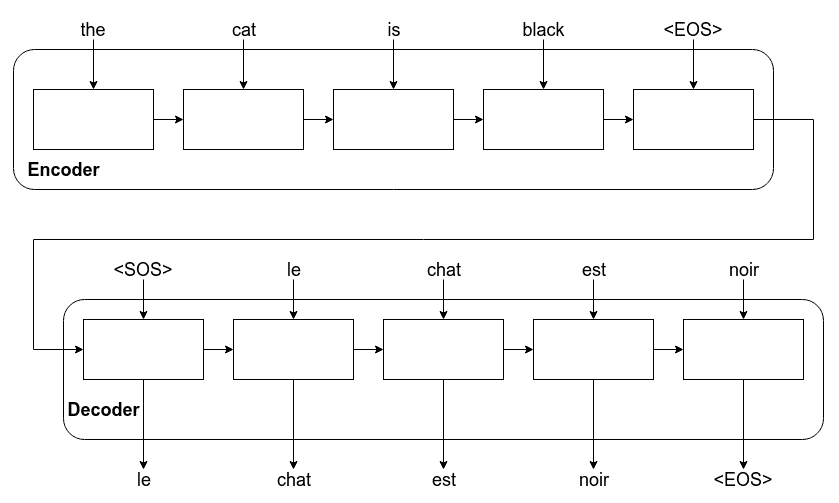
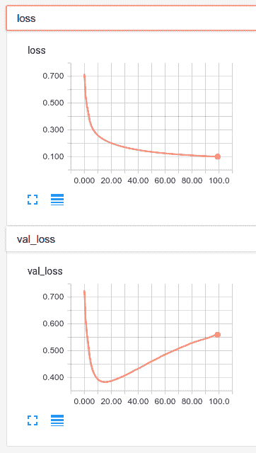

# 十一、训练 Seq2Seq 模型

在上一章中，我们讨论了文档分类以及文档分类的一种特殊情况，称为**情感分类**。 这样做时，我们不得不谈论很多关于向量化的知识。

在本章中，我们将继续谈论解决 NLP 问题，但是除了分类之外，我们将生成新的单词序列。

我们将在本章介绍以下主题：

*   序列到序列模型
*   机器翻译

# 序列到序列模型

到目前为止，我们所研究的网络已经做了一些真正令人惊奇的事情。 但是它们都有一个很大的局限性：它们只能应用于输出具有固定且众所周知的大小的问题。

序列到序列模型能够将输入序列映射到具有可变长度的输出序列。

您可能还会看到术语序列到序列，甚至 **Seq2Seq**。 这些都是序列到序列模型的术语。

当使用序列到序列模型时，我们将引入一个序列并交换出一个序列。 这些序列的长度不必相同。 序列到序列模型使我们能够学习输入序列和输出序列之间的映射。

序列到序列模型可能在许多应用中有用，我们接下来将讨论这些应用。

# 序列到序列模型的应用

序列到序列模型具有许多实际应用。

也许最实际的应用是**机器翻译**。 我们可以使用机器翻译将一种语言的短语作为输入，并输出另一种语言的短语。 机器翻译是我们越来越依赖的一项重要服务。 得益于计算机视觉和机器翻译的进步，我们可以听不懂的语言，或者用不懂的语言查看标志，并且几乎可以立即在智能手机上获得不错的翻译。 序列到序列的网络确实使我们非常接近道格拉斯·亚当（Douglas Adam）想象的《银河系漫游指南》中的通天鱼。

问答也可以全部或部分通过序列到序列模型来完成，在这里我们可以将问题想象为输入序列，将答案想象为输出序列。 回答问题最普遍的应用是聊天。 如果您通过呼叫中心为企业提供支持，则每天会有成千上万甚至数百万个问题/答案对通过电话传递。 对于序列到序列聊天机器人来说，这是完美的训练。

我们可以利用这种问答方式的多种细微形式。 每天，我收到大约 34 亿封电子邮件。 其中，我可能只需要阅读 20-30（这是一个分类任务）。 但是，我对这些电子邮件的回复很少新颖。 我几乎可以肯定地创建一个序列到序列的网络，该网络可以为我写电子邮件，或者至少起草回复。 我认为我们已经开始看到这种行为已经内置在我们最喜欢的电子邮件程序中，并且肯定会出现更加全自动的响应。

序列到序列网络的另一个重要用途是自动文本摘要。 想象一下一组研究论文或大量期刊文章。 所有这些论文可能都有摘要。 这只是另一个翻译问题。 给定一些论文，我们可以使用序列到序列网络生成摘要。 网络可以学习以这种方式总结文档。

在本章的后面，我们将实现一个序列到序列的网络来进行机器翻译。 不过，在进行此操作之前，让我们了解一下这种网络架构是如何工作的。

# 序列到序列模型架构

理解序列到序列模型架构的关键是要理解该架构是为了允许输入序列的长度与输出序列的长度而变化的。 然后可以使用整个输入序列来预测长度可变的输出序列。

为此，网络被分为两个独立的部分，每个部分都包含一个或多个 LSTM 层，这些层负责一半的任务。 如果您想对其操作进行复习，我们在第 9 章“从头开始训练 RNN”中讨论了 LSTM。 我们将在以下各节中了解这两个部分。

# 编码器和解码器

序列到序列模型由两个单独的组件组成，一个编码器和一个解码器：

*   **编码器**：模型的编码器部分采用输入序列，并返回输出和网络的内部状态。 我们并不在乎输出。 我们只想保留编码器的状态，即输入序列的内存。
*   **解码器**：然后，模型的解码器部分将来自编码器的状态（称为**上下文**或**条件**）作为输入。 然后，根据前一个时间步长的输出，可以预测每个时间步长的目标序列。

然后，编码器和解码器如下图所示一起工作，获取输入序列并生成输出序列。 如您所见，我们使用特殊字符表示序列的开始和结束。

我们知道，一旦序列字符的结尾（我称之为`<EOS>`）结束，就停止生成输出：



尽管此示例涵盖了机器翻译，但是序列到序列学习的其他应用却以相同的方式工作。

# 字符与文本

可以在字符级别或单词级别建立序列到序列模型。 单词级序列到序列模型将单词作为输入的原子单位，而字符级模型将字符作为输入的原子单位。

那么，您应该使用哪个呢？ 通常，最好的结果是从单词级模型中获得的。 就是说，预测序列中最可能出现的下一个单词需要`softmax`层与问题的词汇量一样宽。 这导致了非常广泛的，高度尺寸的问题。

字符级模型要小得多。 字母表中有 26 个字母，但大约有 171,000 个英文单词是常用的。

对于本章中提出的问题，我将使用字符级模型，因为我重视您的 AWS 预算。 转换为单词非常简单，其中大部分复杂性都在数据准备中，这是留给读者的练习。

# 监督强迫

如上图所示，当预测序列`y[t(n)]`某个位置的输出时，我们使用`y[t(n-1)]`作为 LSTM 的输入。 然后，我们使用此时间步骤的输出来预测`y[t(n+1)]`。

训练中这样做的问题是，如果`y[t(n-1)]`错误，则`y[t(n)]`将更加错误。 错误不断增加的链条会使事情变得非常缓慢。

解决该问题的一个显而易见的解决方案是将每个时间步长的每个序列预测替换为该时间步长的实际正确序列。 因此，我们将使用训练集中的实际值，而不是对`y[t(n-1)]`使用 LSTM 预测。

通过使用这个概念，我们可以促进模型的训练过程，这恰好被称为**监督强迫**。

教师强迫有时会使我们的模型难以可靠地生成训练中看不到的序列，但总的来说，该技术可能会有所帮助。

# 注意

注意是可以在序列到序列模型中实现的另一种有用的训练技巧。 注意使解码器在输入序列的每个步骤中都能看到隐藏状态。 这使网络可以专注于（或关注）特定的输入，这可以加快训练速度并可以提高模型的准确率。 注意通常是一件好事。 但是，在撰写本文时，Keras 尚未内置注意力。尽管如此，Keras 目前确实有一个拉取请求正在等待自定义注意层。 我怀疑很快就会在 Keras 中建立对关注的支持。

# 翻译指标

知道翻译是否良好很难。 机器翻译质量的通用度量标准称为**双语评估研究**（**BLEU**），它最初是由 Papineni 等人在[《BLEU：一种自动评估机器翻译的方法》](http://aclweb.org/anthology/P/P02/P02-1040.pdf)中创建的。 BLEU 是基于 ngram 的分类精度的改进应用。 如果您想使用 BLEU 来衡量翻译质量，TensorFlow 团队已经发布了一个脚本，该脚本可以根据给定的地面真实翻译和机器预测翻译的语料来计算 BLEU 分数。 您可以在[这里](https://github.com/tensorflow/nmt/blob/master/nmt/scripts/bleu.py)找到该脚本。

# 机器翻译

`Je ne parle pasfrançais`，那就是你怎么说我不会说英语的法语。 大约两年前，我发现自己在巴黎，几乎不会说法语。 在我去之前，我已经看过一本书，听过一些 DVD，但是即使经过几个月的练习，我对法语的掌握还是很可悲的。 然后，在旅途的第一个早晨，我醒来，走进附近的`boulangerie`（法国或法式面包店）吃早餐和早晨咖啡。 我说`Bonjour, parlez-vous anglais?`，他们一点也不讲英语，或者也许他们正在享受我的奋斗。 无论哪种方式，当我的早餐取决于我对法语的掌握时，我都会比过去更有动力去争取`Je voudrais un pain au chocolat`（翻译：我想要其中一种美味的巧克力面包）。 在最终成本函数（我的胃）的驱动下，我很快学会了在英语序列和法语序列之间进行映射。

在本案例研究中，我们将教计算机讲法语。 在几个小时的训练中，该模型将比我说法语更好。 考虑一下，这真是太神奇了。 我将训练一台计算机来执行我自己无法完成的任务。 当然，也许您确实会说法语，但这并不会给您留下深刻的印象，在这种情况下，我将美国著名演员亚当·桑德勒（Adam Sandler）称为比利·麦迪逊（Billy Madison）：好吧，对我来说很难，所以退缩！

该示例的大部分来自于弗朗索瓦·乔勒（Francois Chollet）的博客文章，标题为[《序列到序列学习的十分钟介绍》](https://blog.keras.io/a-ten-minute-introduction-to-sequence-to-sequence-learning-in-keras.html)。 尽管我怀疑自己是否可以改进这项工作，但我希望使用本示例的目的是花一点点多一点的时间看一下序列到序列的网络，以使您掌握实现自己的所有知识。

与往常一样，本章的代码可以在本书的 Git 存储库中的`Chapter11`下找到。 您可以在[这个页面](http://www.manythings.org/anki/)中找到此示例所需的数据，该文件将存档许多双语句子对的数据集，我们将在后面详细讨论。 我要使用的文件是 [fra-eng.zip](http://www.manythings.org/anki/fra-eng.zip) 。 这是英语/法语句子对的集合。 如果需要，您可以轻松选择其他语言，而无需进行太多修改。

在本案例研究中，我们将构建一个网络，该网络可以在给定一些英语句子的情况下学习法语句子。 这将是一个具有老师强迫作用的字符级序列到序列模型。

我希望最终得到的是看起来很像翻译服务的东西，您可以在网上找到它或下载到手机上。

# 了解数据

我们正在使用的数据是一个文本文件。 每行都有一个英文短语及其法语翻译，并用一个选项卡分隔，如以下代码所示：

```py
Ignore Tom. Ignorez Tom.
```

（我不确定`Tom`对数据集的作者做了什么...）

通常，每行英语翻译都有重复的法语翻译行。 当有多种常用方法翻译英语短语时，会发生这种情况。 看下面的代码例如：

```py
Go now.    Va, maintenant.
Go now.    Allez-y maintenant.
Go now.    Vas-y maintenant.
```

由于我们正在构建一个字符级序列到序列模型，因此需要将数据加载到内存中，然后对每个输入和输出在字符级进行热编码。 那是困难的部分。 让我们接下来做。

# 加载数据

加载此数据涉及很多工作。 阅读本文时，您可能想参考代码块。

以下代码中的第一个`for`循环将遍历整个输入文件或调用`load_data()`时指定的一些样本。 我这样做是因为您可能没有 RAM 来加载整个数据集。 多达 10,000 个示例，您可能会获得良好的结果； 但是，多多益善。

当我们逐行浏览输入文件时，我们一次要执行几项操作：

*   我们将每个法语翻译包装在`'\t'`中，以开始该短语，并在`'\n'`中，以结束它。 这对应于我在序列到序列图中使用的`<SOS>`和`<EOS>`标签。 当我们要生成翻译序列时，这将允许我们使用`'\t'`作为输入来为解码器设定种子。
*   我们将每一行分为英语输入和其各自的法语翻译。 这些存储在列表`input_texts`和`target_texts`中。
*   最后，我们将输入文本和目标文本的每个字符添加到一个集合中。 这些集称为`input_characters`和`target_characters`。 当需要对短语进行热编码时，我们将使用这些集合。

循环完成后，我们会将字符集转换为排序列表。 我们还将创建名为`num_encoder_tokens`和`num_decoder_tokens`的变量，以保存每个列表的大小。 稍后我们也将需要这些以进行单热编码。

为了将输入和目标输入矩阵，我们需要像上一章一样，将短语填充到最长短语的长度。 为此，我们需要知道最长的短语。 我们将其存储在`max_encoder_seq_length`和`max_decoder_seq_length`中，如以下代码所示：

```py
def load_data(num_samples=50000, start_char='\t', end_char='\n', data_path='data/fra-eng/fra.txt'):
    input_texts = []
    target_texts = []
    input_characters = set()
    target_characters = set()
    lines = open(data_path, 'r', encoding='utf-8').read().split('\n')
    for line in lines[: min(num_samples, len(lines) - 1)]:
        input_text, target_text = line.split('\t')
        target_text = start_char + target_text + end_char
        input_texts.append(input_text)
        target_texts.append(target_text)
        for char in input_text:
            if char not in input_characters:
                input_characters.add(char)
        for char in target_text:
            if char not in target_characters:
                target_characters.add(char)

    input_characters = sorted(list(input_characters))
    target_characters = sorted(list(target_characters))
    num_encoder_tokens = len(input_characters)
    num_decoder_tokens = len(target_characters)
    max_encoder_seq_length = max([len(txt) for txt in input_texts])
    max_decoder_seq_length = max([len(txt) for txt in target_texts])

    print('Number of samples:', len(input_texts))
    print('Number of unique input tokens:', num_encoder_tokens)
    print('Number of unique output tokens:', num_decoder_tokens)
    print('Max sequence length for inputs:', max_encoder_seq_length)
    print('Max sequence length for outputs:', max_decoder_seq_length)
    return {'input_texts': input_texts, 'target_texts': target_texts,
           'input_chars': input_characters, 'target_chars': 
           target_characters, 'num_encoder_tokens': num_encoder_tokens, 
           'num_decoder_tokens': num_decoder_tokens,
           'max_encoder_seq_length': max_encoder_seq_length, 
           'max_decoder_seq_length': max_decoder_seq_length}
```

加载数据后，我们将在字典中返回所有这些信息，这些信息可以传递给一个函数，该函数将对每个短语进行热编码。 让我们接下来做。

# 单热编码

在此函数中，我们将使用刚刚构建的字典，并对每个短语的文本进行热编码。

一旦完成，我们将剩下三个字典。 它们每个的尺寸为`[文本数 * 最大序列长度 * 标记]`。 如果您停顿一下，回想一下第 10 章“使用单词嵌入从零开始训练 LSTM”的更简单的时间，您会发现这确实与我们在其他 NLP 模型中使用的相同，我们在输入端完成它。 我们将使用以下代码定义单热编码：

```py
def one_hot_vectorize(data):
    input_chars = data['input_chars']
    target_chars = data['target_chars']
    input_texts = data['input_texts']
    target_texts = data['target_texts']
    max_encoder_seq_length = data['max_encoder_seq_length']
    max_decoder_seq_length = data['max_decoder_seq_length']
    num_encoder_tokens = data['num_encoder_tokens']
    num_decoder_tokens = data['num_decoder_tokens']

    input_token_index = dict([(char, i) for i, char in 
      enumerate(input_chars)])
    target_token_index = dict([(char, i) for i, char in 
      enumerate(target_chars)])
    encoder_input_data = np.zeros((len(input_texts), 
      max_encoder_seq_length, num_encoder_tokens), dtype='float32')
    decoder_input_data = np.zeros((len(input_texts), 
      max_decoder_seq_length, num_decoder_tokens), dtype='float32')
    decoder_target_data = np.zeros((len(input_texts), 
      max_decoder_seq_length, num_decoder_tokens), dtype='float32')

    for i, (input_text, target_text) in enumerate(zip(input_texts, 
     target_texts)):
        for t, char in enumerate(input_text):
            encoder_input_data[i, t, input_token_index[char]] = 1.
        for t, char in enumerate(target_text):
    # decoder_target_data is ahead of decoder_input_data by one 
       timestep
            decoder_input_data[i, t, target_token_index[char]] = 1.
            if t > 0:
           # decoder_target_data will be ahead by one timestep
           # and will not include the start character.
           decoder_target_data[i, t - 1, target_token_index[char]] = 1.
    data['input_token_index'] = input_token_index
    data['target_token_index'] = target_token_index
    data['encoder_input_data'] = encoder_input_data
    data['decoder_input_data'] = decoder_input_data
    data['decoder_target_data'] = decoder_target_data
    return data
```

我们在此代码中创建了三个训练向量。 在继续之前，我想确保我们了解以下所有向量：

*   `encoder_input_data`是形状为`number_of_pairs`，`max_english_sequence_length`，`number_of_english_characters`的 3D 矩阵。
*   `decoder_input_data`是形状（`number_of_pairs`，`max_french_sequence_length`，`number_of_french_characters`）的 3d 矩阵。
*   `decoder_output_data`与`decoder_input_data`相同，仅向前移了一个时间步。 这意味着`decoder_input_data[:, t+1, :]`等于`decoder_output_data[:, t, :]`。

前面的每个向量都是字符层上整个短语的一个热编码表示。 这意味着，如果我们输入的短语是 Go！ 向量的第一步是为文本中每个可能的英文字符包含一个元素。 除`g`设置为 1 以外，其他每个元素都将设置为`0`。

我们的目标是使用`encoder_input_data`和`decoder_input`数据作为输入特征，训练序列至序列模型来预测`decoder_output_data`。

终于完成了数据准备，因此我们可以开始构建序列到序列的网络架构。

# 用于训练的网络架构

在此示例中，我们实际上将使用两种单独的架构，一种用于训练，另一种用于推理。 我们将从推理模型训练中使用训练过的层。 虽然实际上我们为每种架构使用了相同的部分，但是为了使事情更清楚，我将分别展示每个部分。 以下是我们将用来训练网络的模型：

```py
encoder_input = Input(shape=(None, num_encoder_tokens), name='encoder_input')
encoder_outputs, state_h, state_c = LSTM(lstm_units, return_state=True,
                                         name="encoder_lstm")(encoder_input)
encoder_states = [state_h, state_c]
decoder_input = Input(shape=(None, num_decoder_tokens), name='decoder_input')
decoder_lstm = LSTM(lstm_units, return_sequences=True, 
  return_state=True, name="decoder_lstm")
decoder_outputs, _, _ = decoder_lstm(decoder_input, initial_state=encoder_states)
decoder_dense = Dense(num_decoder_tokens, activation='softmax',
  name='softmax_output')
decoder_output = decoder_dense(decoder_outputs)

model = Model([encoder_input, decoder_input], decoder_output)
model.compile(optimizer='rmsprop', loss='categorical_crossentropy')
```

如果我们将*放大*编码器，则会看到相当标准的 LSTM。 不同之处在于，我们从编码器（`return_state=True`）获取状态，如果将 LSTM 连接到密集层，通常不会这样做。 这些状态是我们将在`encoder_states`中捕获的状态。 我们将使用它们为解码器提供上下文或条件。

在解码器方面，我们设置的`decoder_lstm`与我们先前构建 Keras 层的方式略有不同，但实际上只是语法略有不同。

看下面的代码：

```py
decoder_lstm = LSTM(lstm_units, return_sequences=True, 
   return_state=True, name="decoder_lstm")
decoder_outputs, _, _ = decoder_lstm(decoder_input, initial_state=encoder_states)
```

其功能与以下代码相同：

```py
decoder_outputs, _, _ = LSTM(lstm_units, return_sequences=True, 
  return_state=True, name="decoder_lstm")(decoder_input, initial_state=encoder_states)
```

我这样做的原因在推理架构中将变得显而易见。

请注意，解码器将编码器的隐藏状态作为其初始状态。 然后将解码器输出传递到预测`decoder_output_data`的`softmax`层。

最后，我们将定义训练模型，我将其创造性地称为`model`，该模型将`encoder_input_data`和`decoder_input`数据作为输入并预测`decoder_output_data`。

# 用于推理的网络架构

为了在给定输入序列的情况下预测整个序列，我们需要稍微重新安排一下架构。 我怀疑在 Keras 的未来版本中，这将变得更简单，但是从今天起这是必需的步骤。

为什么需要有所不同？ 因为我们没有推断的`decoder_input_data`教师向量。 我们现在独自一人。 因此，我们将必须进行设置，以便我们不需要该向量。

让我们看一下这种推理架构，然后逐步执行代码：

```py
encoder_model = Model(encoder_input, encoder_states)

decoder_state_input_h = Input(shape=(lstm_units,))
decoder_state_input_c = Input(shape=(lstm_units,))
decoder_states_inputs = [decoder_state_input_h, decoder_state_input_c]
decoder_outputs, state_h, state_c = decoder_lstm(
    decoder_input, initial_state=decoder_states_inputs)
decoder_states = [state_h, state_c]
decoder_outputs = decoder_dense(decoder_outputs)
decoder_model = Model(
    [decoder_input] + decoder_states_inputs,
    [decoder_outputs] + decoder_states)
```

首先，我们从构建编码器模型开始。 该模型将采用一个输入序列，并返回我们在先前模型中训练过的 LSTM 的隐藏状态。

然后，解码器模型具有两个输入，即`h`和`c`隐藏状态，这些状态限制了其从编码器模型派生的输出。 我们统称为`decoder_states_inputs`。

我们可以从上面重用`decoder_lstm`； 但是，这次我们不会丢弃状态`state_h`和`state_c`。 我们将把它们与目标的`softmax`预测一起作为网络输出传递。

现在，当我们推断出一个新的输出序列时，我们可以在预测第一个字符之后获得这些状态，然后将它们通过`softmax`预测传递回 LSTM，以便 LSTM 可以预测另一个字符。 我们将重复该循环，直到解码器生成一个`'\n'`信号为止，该信号已到达`<EOS>`。

我们将很快看一下推理代码。 现在，让我们看看如何训练和序列化此模型集合。

# 放在一起

按照本书的传统，我将在这里向您展示该模型的整个架构如何融合在一起：

```py
def build_models(lstm_units, num_encoder_tokens, num_decoder_tokens):
    # train model
    encoder_input = Input(shape=(None, num_encoder_tokens), 
      name='encoder_input')
    encoder_outputs, state_h, state_c = LSTM(lstm_units, 
      return_state=True, name="encoder_lstm")(encoder_input)
    encoder_states = [state_h, state_c]
    decoder_input = Input(shape=(None, num_decoder_tokens), 
      name='decoder_input')
    decoder_lstm = LSTM(lstm_units, return_sequences=True, 
      return_state=True, name="decoder_lstm")
    decoder_outputs, _, _ = decoder_lstm(decoder_input,
                                         initial_state=encoder_states)
    decoder_dense = Dense(num_decoder_tokens, activation='softmax',
                          name='softmax_output')
    decoder_output = decoder_dense(decoder_outputs)
    model = Model([encoder_input, decoder_input], decoder_output)
    model.compile(optimizer='rmsprop', loss='categorical_crossentropy')

    encoder_model = Model(encoder_input, encoder_states)
    decoder_state_input_h = Input(shape=(lstm_units,))
    decoder_state_input_c = Input(shape=(lstm_units,))
    decoder_states_inputs = [decoder_state_input_h, 
      decoder_state_input_c]
    decoder_outputs, state_h, state_c = decoder_lstm(
        decoder_input, initial_state=decoder_states_inputs)
    decoder_states = [state_h, state_c]
    decoder_outputs = decoder_dense(decoder_outputs)
    decoder_model = Model(
        [decoder_input] + decoder_states_inputs,
        [decoder_outputs] + decoder_states)

    return model, encoder_model, decoder_model
```

请注意，我们将在此处返回所有三个模型。 训练完训练模型后，我将使用`keras model.save()`方法序列化这三个方法。

# 训练

我们终于准备好训练我们的序列到序列网络。 以下代码首先调用我们所有的数据加载函数，创建回调，然后拟合模型：

```py
data = load_data()
data = one_hot_vectorize(data)
callbacks = create_callbacks("char_s2s")
model, encoder_model, decoder_model = build_models(256, data['num_encoder_tokens'], data['num_decoder_tokens'])
print(model.summary())

model.fit(x=[data["encoder_input_data"], data["decoder_input_data"]],
          y=data["decoder_target_data"],
          batch_size=64,
          epochs=100,
          validation_split=0.2,
          callbacks=callbacks)

model.save('char_s2s_train.h5')
encoder_model.save('char_s2s_encoder.h5')
decoder_model.save('char_s2s_decoder.h5')
```

您会注意到，我以前没有像通常那样定义验证或测试集。 这次，按照博客文章中给出的示例，我将让 Keras 随机选择 20% 的数据作为验证，这在示例中可以很好地工作。 如果要使用此代码实际进行机器翻译，请使用单独的测试集。

训练模型适合后，我将保存所有三个模型，并将它们再次加载到为推理而构建的单独程序中。 我这样做是为了使代码保持简洁，因为推理代码本身非常复杂。

让我们来看看这个模型的 100 个周期的模型训练：



如您所见，我们在第 20 个周期开始过拟合。虽然损失持续减少，但`val_loss`却在增加。 在这种情况下，模型检查指向可能无法正常工作，因为在训练结束之前我们不会序列化推理模型。 因此，理想情况下，我们应该再训练一次，将训练的周期数设置为略大于 TensorBoard 中观察到的最小值。

# 推理

现在我们有了训练有素的模型，我们将实际生成一些翻译。

总体而言，推理步骤如下：

1.  加载数据并再次向量化（我们需要字符到索引的映射以及一些转换进行测试）
2.  使用字符对字典进行索引，我们将创建字符字典的反向索引，因此一旦我们预测了正确的字符，我们就可以从数字返回到字符
3.  选择一些输入序列进行翻译，然后通过编码器运行，获取状态
4.  将状态和`<SOS>`字符`'\t'`发送到解码器。
5.  循环，获取每个下一个字符，直到解码器生成`<EOS>`或`'\n'`

# 加载数据

我们可以从训练脚本中导入`load_data`和`one_hot_vectorize`函数，以相同的方式调用这些方法，如以下代码所示：

```py
data = load_data()
data = one_hot_vectorize(data)
```

# 创建反向索引

解码器将预测正确字符的索引，该索引将是解码器的`softmax`输出的`argmax`。 我们将需要能够将索引映射到字符。 您可能还记得，数据字典中已经有一个字符到索引的映射，所以我们只需要反转它即可。 逆转字典非常简单，如下所示：

```py
def create_reverse_indicies(data):
    data['reverse_target_char_index'] = dict(
        (i, char) for char, i in data["target_token_index"].items())
    return data
```

然后，我们可以如下调用此函数：

```py
data = create_reverse_indicies(data)
```

# 载入模型

我们可以使用`keras.models.load_model`加载保存在训练脚本中的模型。 我创建了此助手来完成该任务。 我们将使用以下代码加载模型：

```py
def load_models():
    model = load_model('char_s2s.h5')
    encoder_model = load_model('char_s2s_encoder.h5')
    decoder_model = load_model('char_s2s_decoder.h5')
    return [model, encoder_model, decoder_model]
```

我们可以调用以下函数来加载所有三个模型：

```py
model, encoder_model, decoder_model = load_models()
```

# 翻译序列

现在，我们准备对一些输入序列进行采样并进行翻译。 在示例代码中，我们使用前 100 个双语对进行翻译。 一个更好的测试可能是在整个空间中随机抽样，但是我认为这个简单的循环说明了这一过程：

```py
for seq_index in range(100):
    input_seq = data["encoder_input_data"][seq_index: seq_index + 1]
    decoded_sentence = decode_sequence(input_seq, data, encoder_model, 
                                       decoder_model)
    print('-')
    print('Input sentence:', data['input_texts'][seq_index])
    print('Correct Translation:', data['target_texts']
      [seq_index].strip("\t\n"))
    print('Decoded sentence:', decoded_sentence)
```

在这段代码中，我们将`encoder_input_data`的一个观察值用作`decode_sequence`的输入。 `decode_sequence`将传回解码器认为正确翻译的序列。 我们还需要将其传递给编码器和解码器模型，以便能够完成其工作。下面的翻译更加有趣，因为学习的短语未与

有了解码器预测后，就可以将其与输入和正确的转换进行比较。

当然，我们还没有完成，因为我们还没有探讨`decode_sequence`方法的工作方式。 接下来。

# 解码序列

解码器需要执行以下两项操作：

*   来自编码器的状态。
*   输入信号开始预测的翻译。 我们将在一个热向量中向其发送`'\t'`，因为这是我们的`<SOS>`字符。

为了获得编码器状态，我们只需要使用以下代码将要翻译的短语的向量化版本发送到编码器：

```py
states_value = encoder_model.predict(input_seq)
```

为了启动解码器，我们还需要一个包含`<SOS>`字符的热向量。 这段代码将我们带到了那里：

```py
target_seq = np.zeros((1, 1, data['num_decoder_tokens']))
target_seq[0, 0, data['target_token_index']['\t']] = 1.
```

现在，我们准备使用以下代码设置一个解码器循环，该循环将生成我们的翻译短语：

```py
stop_condition = False
decoded_sentence = ''
while not stop_condition:
    output_tokens, h, c = decoder_model.predict(
        [target_seq] + states_value)

    sampled_token_index = np.argmax(output_tokens[0, -1, :])
    sampled_char = data["reverse_target_char_index"][sampled_token_index]
    decoded_sentence += sampled_char

    if (sampled_char == '\n' or
       len(decoded_sentence) > data['max_decoder_seq_length']):
        stop_condition = True

    target_seq = np.zeros((1, 1, data['num_decoder_tokens']))
    target_seq[0, 0, sampled_token_index] = 1.

    states_value = [h, c]
```

首先要注意的是，我们一直循环到`stop_condition = True`。 这在解码器生成`'\n'`时发生。

第一次通过循环，我使用`<SOS>`向量和我们在循环外部创建的编码器的状态调用了`decoder_model`的预测方法。

当然，`output_tokens`将包含解码器可以预测的每个字符的`softmax`预测。 通过取`output_tokens`的`argmax`，我们将获得最大`softmax`值的索引。 方便地，我可以使用之前创建的`reverse_target_char_index`将其转换回关联的字符，这是一个在索引和字符之间转换的字典。

接下来，我们将该字符附加到`decode_sequence`字符串。

接下来，我们可以检查该字符是否为`'\n'`并触发`stop_condition`为`True`。

最后，我们将创建一个新的`target_seq`，其中包含解码器生成的最后一个字符，以及一个包含解码器隐藏状态的列表。 现在，我们准备再次重复循环。

我们的解码器将遵循此过程，直到生成解码序列为止。

# 翻译示例

只是为了好玩，我在这里提供了一些尝试的翻译。 所有这些都来自训练集的前面，这意味着我正在对`training`数据集进行预测，因此这些转换可能会使模型看起来比实际更好。

我们的第一版翻译使您对我们的期望有所了解，并且该网络做得很好：

输入句子：`Help!`

正确翻译：`À l'aide!`

解码后的句子：`À l'aide!`

后续的翻译更加有趣，因为学习的短语未与任何训练短语相关联。 短语`Vas-tu immédiatement!`转换为类似`You go immediately`的字词。这非常相似，甚至可能正确：

输入句子：`Go on.`

正确的翻译： `Poursuis.`

解码后的句子： `Vas-tu immédiatement!`

输入句子：`Go on.`

正确的翻译：`Continuez.`

解码后的句子： `Vas-tu immédiatement!`

输入句子：`Go on.`

正确的翻译： `Poursuivez.`

解码后的句子： `Vas-tu immédiatement!`


当然，有很多方法可以说相同的事情，这使得网络变得更加困难：

输入句子：`Come on!`

正确的翻译： `Allez !`

解码后的句子： `Allez !`

输入句子：`Come on!`

正确的翻译： `Allez !`

解码后的句子： `Allez !`

输入句子：`Come on.`

正确的翻译：`Viens!`

解码后的句子： `Allez!`

输入句子：`Come on.`

正确的翻译：`Venez!`

解码后的句子： `Allez!`

# 总结

在本章中，我们介绍了序列到序列模型的基础知识，包括它们如何工作以及如何使用它们。 希望我们已经向您展示了一个功能强大的工具，可用于机器翻译，问题解答和聊天应用。

如果您已经做到了，那就好。 您已经看到了很多深度学习的应用，并且发现自己正处于深层神经网络应用的最先进的钟形曲线的右边。

在下一章中，我将向您展示另一个高级主题的示例，即深度强化学习或深度 Q 学习，并向您展示如何实现自己的深度 Q 网络。

在此之前，请放松！