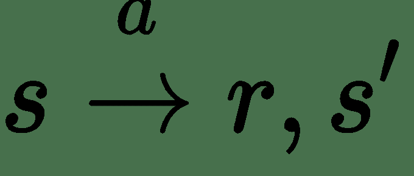
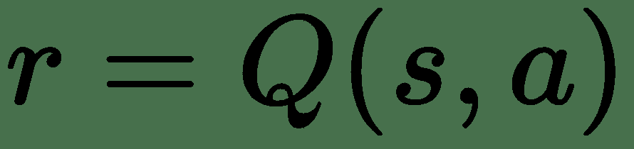
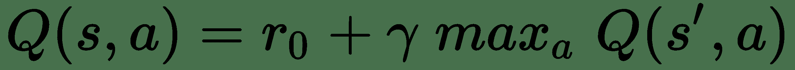
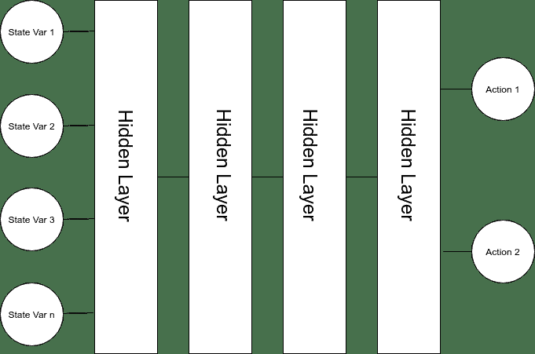
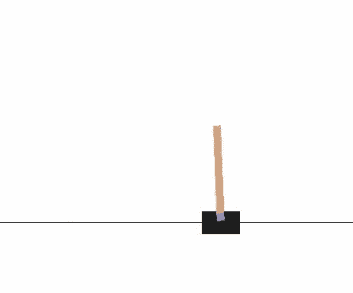
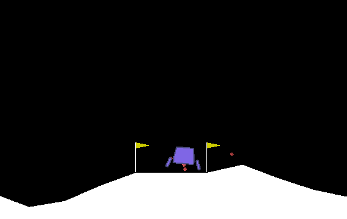

# 十二、深度强化学习

在本章中，我们将以略有不同的方式使用深度神经网络。 我们将要构建一个智能体，而不是预测一个类的成员，估计一个值，甚至生成一个序列。 尽管机器学习和人工智能这两个术语经常互换使用，但在本章中，我们将讨论人工智能作为一种可以感知其环境的智能体，并采取步骤在该环境中实现某些目标。

想象一个可以玩象棋或围棋之类策略游戏的特工。 构建神经网络来解决此类游戏的一种非常幼稚的方法可能是使用一种网络架构，在该架构中，我们对每个可能的棋盘/棋子组合进行热编码，然后预测每个可能的下一个动作。 尽管该网络庞大而复杂，但可能做得并不好。 要很好地玩国际象棋，您不仅要考虑下一步，而且还要考虑接下来的步伐。 在不确定的情况下，我们的智能体将需要考虑给定未来行动的最佳下一步行动。

这是一个令人兴奋的领域。 正是在智能体领域，研究人员才朝着人工智能或强大的 AI 迈进，这是创建可以执行人类任何智力任务的智能体的崇高目标。 强 AI 的概念通常与弱 AI 形成对比，弱 AI 是解决某些单个任务或应用的能力。

对于作者（我）和读者（您）而言，本章将是一个挑战，因为强化学习理应拥有自己的书，并且需要总结在数学，心理学和计算机科学方面所做的工作。 因此，请原谅快速参考处理，并知道我在为您提供足够的信息，而在接下来的部分中将不多说。

强化学习，马尔可夫决策过程和 Q 学习是智能体的基础，我们接下来将讨论这些内容。

我们将在本章中讨论以下主题：

*   强化学习概述
*   Keras 强化学习框架
*   在 Keras 中建立强化学习智能体

# 强化学习概述

强化学习基于智能体的概念。 智能体通过观察某种状态然后采取行动来与其环境进行交互。 当智能体采取行动在状态之间移动时，它会以奖励信号的形式接收有关其行动良好性的反馈。 这个奖励信号是强化学习中的强化。 这是一个反馈循环，智能体可以使用它来学习其选择的优势。 当然，奖励可以是正面的，也可以是负面的（惩罚）。

想象一下，无人驾驶汽车是我们正在制造的智能体。 在行驶过程中，它不断收到动作的奖励信号。 留在车道内可能会产生积极的报酬，而在行人上奔跑可能会给智能体带来非常消极的报酬。 当面临选择留在行人或撞到行人的选择时，智能体将希望学会以避开行人为代价，避开行人，损失车道线奖励，以避免更大的行人碰撞惩罚。

强化学习概念的核心是状态，行为和奖励的概念。 我已经讨论过奖励，所以让我们谈谈行动和状态。 动作是智能体在观察到某种状态时可以执行的操作。 如果我们的特工正在玩一个简单的棋盘游戏，那么该动作将由该特工轮到它来做。 然后转弯就是座席的状态。 为了解决这些问题，我们将在这里着眼于一个智能体可以采取的行动始终是有限的和离散的。 下图说明了此概念：


此反馈循环的一个步骤可以用数学方式表示为：



动作会在原始状态`s`和下一个状态`s'`的智能体之间进行转换，智能体会在其中获得一些奖励`r`。 智能体选择动作的方式称为**智能体策略**，通常称为`pi`。

强化学习的目的是找到一系列动作，使行动者从一个状态到另一个状态，并获得尽可能多的报酬。

# 马尔可夫决策过程

我们构筑的这个世界恰好是**马尔可夫决策过程**（**MDP**），它具有以下属性：

*   它具有一组有限的状态，`S`
*   它具有一组有限的动作 `A`
*   `P[a](s, s')`是采取行动`A`将在状态`s`和状态`s'`之间转换的概率
*   `R[a](s, s')`是`s`和`s'`之间过渡的直接奖励。
*   `γ ∈ [0, 1]`是折扣因子，这是我们相对于当前奖励对未来奖励的折扣程度（稍后会详细介绍）

一旦我们有了确定每个状态要采取的操作的策略函数`pi`，MDP 就解决了，成为了马尔可夫链。

好消息是，有一个警告就完全有可能完美解决 MDP。 需要注意的是，必须知道 MDP 的所有回报和概率。 事实证明，这种警告相当重要，因为在大多数情况下，由于智能体的环境混乱或至少不确定，因此智能体不知道所有的回报和状态更改概率。

# Q 学习

想象一下，我们有一些函数`Q`，可以估计出采取行动的回报：



对于某些状态`s`以及动作`a`，它会根据状态为该动作生成奖励。 如果我们知道环境带来的所有回报，那么我们就可以遍历`Q`并选择能够为我们带来最大回报的行动。 但是，正如我们在上一节中提到的那样，我们的智能体不知道所有的奖励状态和状态概率。 因此，我们的`Q`函数需要尝试近似奖励。

我们可以使用称为 **Bellman 公式**的递归定义的`Q`函数来近似此理想的`Q`函数：



在这种情况下， `r[0]`是下一个动作的奖励，然后在下一个动作上（递归地）递归使用`Q`函数确定该行动的未来奖励。 为此，我们将`γ`作为相对于当前奖励的未来奖励的折扣。 只要伽玛小于 1，它就不会使我们的奖励序列变得无限大。 更明显地，与当前状态下的相同奖励相比，未来状态下的奖励的值要低。 具体来说，如果有人今天给您 100 美元，明天给您 100 美元，您应该立即拿走这笔钱，因为明天不确定。

如果我们尽最大的努力让我们的智能体经历每种可能的状态转换，并使用此函数来估计我们的报酬，我们将得出我们试图近似的理想`Q`函数。

# 无限状态空间

对`Q`函数的讨论使我们陷入了传统强化学习的重要局限。 您可能还记得，它假设状态空间是有限且离散的。 不幸的是，这不是我们生活的世界，也不是我们的智能体在很多时候会发现自己的环境。 考虑一个可以打乒乓球的经纪人。 状态空间的重要组成部分是乒乓球的速度，它当然不是离散的。 像我们不久将要看到的那样，可以看到的特工会看到一个图像，该图像是一个很大的连续空间。

我们讨论的 Bellman 方程将要求我们在状态与状态之间转移时保持经验奖励的大矩阵。 但是，当面对连续的状态空间时，这是不可能的。 可能的状态本质上是无限的，我们不能创建无限大小的矩阵。

幸运的是，我们可以使用深度神经网络来近似`Q`函数。 这可能不会让您感到惊讶，因为您正在阅读一本深度学习书，因此您可能猜测深度学习必须在某个地方出现。 就是那个地方

# 深度 Q 网络

**深层 Q 网络**（**DQN**）是近似`Q`函数的神经网络。 他们将状态映射到动作，并学会估计每个动作的`Q`值，如下图所示：



我们可以使用深度神经网络作为函数来逼近该矩阵，而不是尝试存储一个无限大的矩阵，而是将奖励从连续状态空间映射到动作。 这样，我们可以将神经网络用作智能体的大脑。 但这一切都导致我们提出一个非常有趣的问题。 我们如何训练这个网络？

# 在线学习

当我们的智能体通过采取行动从一个状态过渡到另一个状态时，它会得到奖励。 智能体可以通过使用每个状态，动作和奖励作为训练输入来在线学习。 在执行每个操作后，该智能体将更新其神经网络权重，并希望在此过程中变得更聪明。 这是在线学习的基本思想。 智能体就像您和我一样，不断学习。

这种朴素的在线学习的缺点有些明显，有两个方面：

*   经历之后，我们就会放弃经验。
*   我们所经历的经验彼此高度相关，我们将过度适应最新的经验。 有趣的是，这也是人类遭受的苦难，称为可用性偏差。

我们可以通过使用内存和经验重放来解决这些问题。

# 记忆和经验重放

当我们引入有限存储空间的概念时，可以找到针对这两个问题的巧妙解决方案，该存储空间用于存储智能体具有的一组经验。 在每个状态下，我们都可以借此机会记住状态，行动和奖励。 然后，智能体可以通过从内存中采样一个随机小批量并使用该小批量更新 DQN 权重，定期重放这些经验。

这种重放机制使智能体能够以一般的方式从更长远的经验中学习，因为它是从内存中的那些经验中随机采样的，而不是仅使用最近的经验来更新整个网络。

# 利用与探索

通常，我们希望智能体遵循*贪婪*策略，这意味着我们希望智能体采取具有最大`Q`值的操作。 在学习网络的同时，我们不希望它总是贪婪地表现。 如果这样做，它将永远不会探索新的选择，也不会学习新的东西。 因此，我们需要我们的智能体偶尔执行不符合规定的策略。

平衡这种探索的最佳方法是一个持续不断的研究主题，并且已经使用了很长时间。 但是，我们将使用的方法非常简单。 智能体每次执行操作时，我们都会生成一个随机数。 如果该数字等于或小于某个阈值`ε`，则智能体将采取随机措施。 这称为 **ε 贪婪策略**。

智能体第一次启动时，对世界了解不多，应该探索更多。 随着智能体变得越来越聪明，它可能应该减少探索并更多地使用其对环境的了解。 为此，我们只需要在训练时逐渐降低`ε`。 在我们的示例中，我们将每转降低`ε`的衰减率，以使它随每个动作线性减小。

综上所述，我们有一个**线性退火 ε - 贪心 Q 策略**，说起来既简单又有趣。

# DeepMind

至少没有提到 Mnih 等人的论文[《和深度强化学习一起玩 Atari》](https://www.cs.toronto.edu/~vmnih/docs/dqn.pdf)，就不会完成关于强化学习的讨论。 然后是 DeepMind，现在是 Google。 在这篇具有里程碑意义的论文中，作者使用了卷积神经网络来训练深度 Q 网络来玩 Atari 2600 游戏。 他们从 Atari 2600 游戏中获取原始像素输出，将其缩小一点，将其转换为灰度，然后将其用作网络的状态空间输入。 为了使计算机了解屏幕上对象的速度和方向，他们使用了四个图像缓冲区作为深度 Q 网络的输入。

作者能够创建一个智能体，该智能体能够使用完全相同的神经网络架构玩 7 个 Atari 2600 游戏，并且在其中三个游戏上，该智能体要比人类更好。 后来又扩大到 49 场比赛，其中大多数比赛都比人类出色。 本文是迈向通用 AI 的非常重要的一步，它实际上是目前在强化学习中开展的许多研究的基础。

# Keras 强化学习框架

在这一点上，我们应该有足够的背景知识来开始建立深层的 Q 网络，但是仍然需要克服很大的障碍。

实现利用深度强化学习的智能体可能是一个很大的挑战，但是最初由 Matthias Plappert 编写的 Keras-RL 库使其变得更加容易。 我将使用他的库来为本章介绍的智能体提供支持。

当然，如果没有环境，我们的经纪人将不会有太多的乐趣。 我将使用 OpenAI 体育馆，该体育馆提供许多环境，包括状态和奖励函数，我们可以轻松地使用它们来构建供智能体探索的世界。

# 安装 Keras-RL

Keras-RL 可以通过 PIP 安装。 但是，我建议从项目 GitHub 存储库中安装它，因为代码可能会更新一些。 为此，只需克隆存储库并按以下方式运行`python setup.py install`：

```py
git clone https://github.com/matthiasplappert/keras-rl.git
cd keras-rl
python setup.py install
```

# 安装 OpenAI Gym

OpenAI 体育场可作为点子安装。 我将使用他们的`Box2D`和`atari`环境中的示例。 您可以使用以下代码安装它们：

```py
pip install gym
pip install gym[atari]
pip install gym[Box2D]
```

# 使用 OpenAI Gym

使用 OpenAI 体育场确实使深度强化学习变得容易。 Keras-RL 将完成大部分艰苦的工作，但是我认为值得单独走遍体育馆，这样您才能了解智能体如何与环境互动。

环境是可以实例化的对象。 例如，要创建`CartPole-v0`环境，我们只需要导入体育场并创建环境，如以下代码所示：

```py
import gym
env = gym.make("CartPole-v0")
```

现在，如果我们的智能体想要在那种环境中行动，它只需要发送一个`action`并返回一个状态和一个`reward`，如下所示：

```py
next_state, reward, done, info = env.step(action)
```

该智能体可以通过使用循环与环境进行交互来播放整个剧集。 此循环的每次迭代都对应剧集中的单个步骤。 当智能体从环境接收到“完成”信号时，剧集结束。

# 在 Keras 中建立强化学习智能体

好消息，我们终于可以开始编码了。 在本部分中，我将演示两种名为 **CartPole** 和 **Lunar Lander** 的 Keras-RL 智能体。 我选择这些示例是因为它们不会消耗您的 GPU 和云预算来运行。 它们可以很容易地扩展到 Atari 问题，我在本书的 Git 存储库中也包括了其中之一。 您可以照常在`Chapter12`文件夹中找到所有这些代码。 让我们快速讨论一下这两种环境：

*   **CartPole**：CartPole 环境由平衡在推车上的杆组成。 智能体必须学习如何在立柱下方的推车移动时垂直平衡立柱。 给智能体指定了推车的位置，推车的速度，杆的角度和杆的旋转速度作为输入。 智能体可以在推车的任一侧施加力。 如果电线杆与垂直线的夹角下降超过 15 度，我们的经纪人就此告吹。
*   **Lunar Lander**：Lunar Lander 的环境更具挑战性。 特工必须将月球着陆器降落在着陆垫上。 月亮的表面会发生变化，着陆器的方位也会在每个剧集发生变化。 该智能体将获得一个八维数组，用于描述每个步骤中的世界状态，并且可以在该步骤中执行四个操作之一。 智能体可以选择不执行任何操作，启动其主引擎，启动其左向引擎或启动其右向引擎。

# CartPole

CartPole 智能体将使用一个相当适度的神经网络，即使没有 GPU，您也应该能够相当迅速地进行训练。 我们将一如既往地从模型架构开始。 然后，我们将定义网络的内存，探索策略，最后训练智能体。

# CartPole 神经网络架构

三个具有 16 个神经元的隐藏层实际上可能足以解决这个简单的问题。 这个模型非常类似于我们在本书开始时使用的一些基本模型。 我们将使用以下代码来定义模型：

```py
def build_model(state_size, num_actions):
    input = Input(shape=(1,state_size))
    x = Flatten()(input)
    x = Dense(16, activation='relu')(x)
    x = Dense(16, activation='relu')(x)
    x = Dense(16, activation='relu')(x)
    output = Dense(num_actions, activation='linear')(x)
    model = Model(inputs=input, outputs=output)
    print(model.summary())
    return model
```

输入将是一个`1 x 状态空间`向量，每个可能的动作都有一个输出神经元，它将预测每个步骤该动作的`Q`值。 通过获取输出的`argmax`，我们可以选择`Q`值最高的动作，但是我们不必自己做，因为 Keras-RL 会为我们做。

# 记忆

Keras-RL 为我们提供了一个名为`rl.memory.SequentialMemory`的类，该类提供了快速有效的数据结构，我们可以将智能体的经验存储在以下位置：

```py
memory = SequentialMemory(limit=50000, window_length=1)
```

我们需要为此存储对象指定一个最大大小，它是一个超参数。 随着新的经验添加到该内存中并变得完整，旧的经验会被遗忘。

# 策略

Keras-RL 提供了一个称为`rl.policy.EpsGreedyQPolicy`的 ε-贪婪 Q 策略，我们可以用来平衡利用与探索。 当智能体程序向世界前进时，我们可以使用`rl.policy.LinearAnnealedPolicy`来衰减`ε`，如以下代码所示：

```py
policy = LinearAnnealedPolicy(EpsGreedyQPolicy(), attr='eps', value_max=1., value_min=.1, value_test=.05, nb_steps=10000)
```

在这里我们要说的是，我们要从`ε`的值 1 开始，并且不小于 0.1，同时测试我们的随机数是否小于 0.05。 我们将步数设置为 .1 到 10,000 之间，Keras-RL 为我们处理衰减数学。

# 智能体

定义了模型，内存和策略后，我们现在就可以创建一个深度 Q 网络智能体，并将这些对象发送给该智能体。 Keras RL 提供了一个称为`rl.agents.dqn.DQNAgent`的智能体类，我们可以为此使用它，如以下代码所示：

```py
dqn = DQNAgent(model=model, nb_actions=num_actions, memory=memory, nb_steps_warmup=10,
               target_model_update=1e-2, policy=policy)

dqn.compile(Adam(lr=1e-3), metrics=['mae'])
```

此时，其中两个参数`target_model_update`和`nb_steps_warmup`可能还不熟悉：

*   `nb_steps_warmup`：确定我们开始进行经验重放之前需要等待的时间，如果您还记得的话，这是我们实际上开始训练网络的时间。 这使我们积累了足够的经验来构建适当的小批量生产。 如果您为此参数选择的值小于批量大小，则 Keras RL 将抽样替换。
*   `target_model_update`：`Q`函数是递归的，当智能体更新它的网络以获取` Q(s, a)`时，更新也影响其对`Q(s', a)`所​​做的预测。 这会导致网络非常不稳定。 大多数深度 Q 网络实现解决此限制的方法是使用目标网络，该目标网络是未经训练的深度 Q 网络的副本，而经常被新副本替换。 `target_model_update`参数控制这种情况发生的频率。

# 训练

Keras RL 提供了多个类似 Keras 的回调，可以方便地进行模型检查指向和记录。 我将在下面使用这两个回调。 如果您想查看 Keras-RL 提供的更多回调，[可以在以下位置找到它们](https://github.com/matthiasplappert/keras-rl/blob/master/rl/callbacks.py)。 您还可以找到可用于创建自己的 Keras-RL 回调的回调类。

我们将使用以下代码来训练我们的模型：

```py
def build_callbacks(env_name):
    checkpoint_weights_filename = 'dqn_' + env_name + '_weights_{step}.h5f'
    log_filename = 'dqn_{}_log.json'.format(env_name)
    callbacks = [ModelIntervalCheckpoint(checkpoint_weights_filename, interval=5000)]
    callbacks += [FileLogger(log_filename, interval=100)]
    return callbacks

callbacks = build_callbacks(ENV_NAME)

dqn.fit(env, nb_steps=50000,
 visualize=False,
 verbose=2,
 callbacks=callbacks)
```

一旦构建了智能体的回调，我们就可以使用`.fit()`方法来拟合`DQNAgent`，就像使用 Keras 模型一样。 在此示例中，请注意`visualize`参数。 如果将`visualize`设置为`True`，我们将能够观察智能体与环境的交互。 但是，这大大减慢了训练的速度。

# 结果

在前 250 个剧集之后，我们将看到剧集的总奖励接近 200，剧集步骤的总奖励也接近 200。这意味着智能体已学会平衡购物车上的杆位，直到环境结束最多 200 个步骤 。

观看我们的成功当然很有趣，因此我们可以使用`DQNAgent` `.test()`方法评估某些剧集。 以下代码用于定义此方法：

```py
dqn.test(env, nb_episodes=5, visualize=True)
```

在这里，我们设置了`visualize=True`，以便我们可以看到我们的智能体平衡杆位，如下图所示：



我们走了，那是一根平衡杆！ 好吧，我知道，我承认平衡手推车上的电线杆并不是那么酷，所以让我们再做一个轻量级的例子。 在此示例中，我们将把月球着陆器降落在月球上，希望它将给您留下深刻的印象。

# Lunar Lander

感谢 Keras-RL，我们用于 Lunar Lander 的智能体几乎与 CartPole 相同，除了实际的模型架构和一些超参数更改外。 Lunar Lander 的环境有八个输入而不是四个输入，我们的智能体现在可以选择四个操作而不是两个。

如果您受到这些示例的启发，并决定尝试构建 Keras-RL 网络，请记住，超参数选择非常非常重要。 对于 Lunar Lander 智能体，对模型架构的最小更改导致我的智能体无法学习环境解决方案。 使网络正确运行是一项艰巨的工作。

# Lunar Lander 网络架构

我的 Lunar Lander 智能体程序的架构仅比 CartPole 的架构稍微复杂一点，对于相同的三个隐藏层仅引入了几个神经元。 我们将使用以下代码来定义模型：

```py
def build_model(state_size, num_actions):
    input = Input(shape=(1, state_size))
    x = Flatten()(input)
    x = Dense(64, activation='relu')(x)
    x = Dense(32, activation='relu')(x)
    x = Dense(16, activation='relu')(x)
    output = Dense(num_actions, activation='linear')(x)
    model = Model(inputs=input, outputs=output)
    print(model.summary())
    return model
```

在此问题的情况下，较小的架构会导致智能体学习控制和悬停着陆器，但实际上并未着陆。 当然，由于我们要对每个剧集的每个步骤进行小批量更新，因此我们需要仔细权衡复杂性与运行时和计算需求之间的关系。

# 记忆和策略

CartPole 的内存和策略可以重复使用。 我相信，通过进一步调整**线性退火策略**中的步骤，可能会提高智能体训练的速度，因为该智能体需要采取更多的步骤来进行训练。 但是，为 CartPole 选择的值似乎可以很好地工作，因此这是留给读者的练习。

# 智能体

从以下代码中可以看出，Lunar Lander `DQNAgent`再次相同，只是学习率小得多。

```py
dqn = DQNAgent(model=model, nb_actions=num_actions, memory=memory, nb_steps_warmup=10, target_model_update=1e-2, policy=policy)
dqn.compile(Adam(lr=0.00025), metrics=['mae'])
```

# 训练

在训练该特工时，您会注意到它学会做的第一件事是将着陆器悬停，并避免着陆。 当着陆器最终着陆时，它会收到非常高的奖励，成功着陆时为 +100，坠毁时为 -100。 这种 -100 的奖励是如此之强，以至于智能体一开始宁愿因悬停而受到小额罚款。 我们的探员要花很多时间才能得出这样的提示：良好的着陆总比没有良好着陆好，因为坠机着陆非常糟糕。

可以塑造奖励信号来帮助座席更快地学习，但这超出了本书的范围。 有关更多信息，请查看奖励塑造。

由于这种对坠机着陆的极端负面反馈，网络需要花费相当长的一段时间才能学会着陆。 在这里，我们正在运行五十万个训练步骤，以传达我们的信息。 我们将使用以下代码来训练智能体：

```py
callbacks = build_callbacks(ENV_NAME)

dqn.fit(env, nb_steps=1000000,
        visualize=False,
        verbose=2,
        callbacks=callbacks)
```

您可以通过调整参数`gamma`（默认值为 0.99）来进一步改进此示例。 如果您从`Q`函数中调用，此参数会减少或增加`Q`函数中将来奖励的影响。

# 结果

我在 Git 一章中包含了 Lunar Lander 的权重，并创建了一个脚本，该脚本在启用可视化的情况下运行这些权重`dqn_lunar_lander_test.py`。 它加载经过训练的模型权重并运行 10 集。 在大多数情况下，特工能够以惊人的技能和准确率将月球着陆器降落在其着陆板上，如以下屏幕截图所示：



希望这个例子可以说明，尽管深层 Q 网络并不是*火箭科学*，但仍可用于控制火箭。

# 总结

斯坦福大学只教授强化学习的整个课程。 可能只写了一本关于强化学习的书，实际上已经做了很多次。 我希望本章能够向您展示足够的知识，让您开始解决强化学习问题。

当我解决“月球着陆器”问题时，很容易让我的头脑从玩具问题到利用深层 Q 网络驱动的特工进行实际太空探索而徘徊。 我希望本章为您做同样的事情。

在下一章中，我将向您展示深度神经网络的最后一种用法，我们将研究可以生成新图像，数据点甚至音乐的网络，称为**生成对抗网络**。