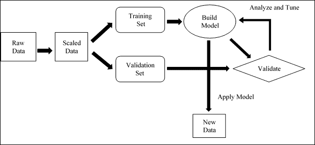
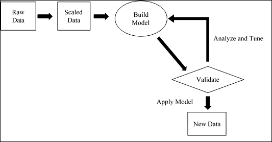
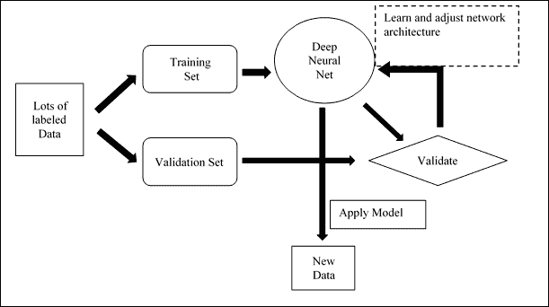
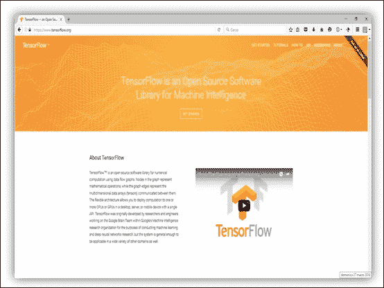
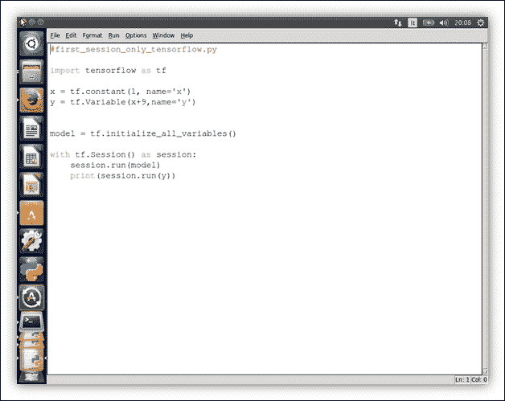
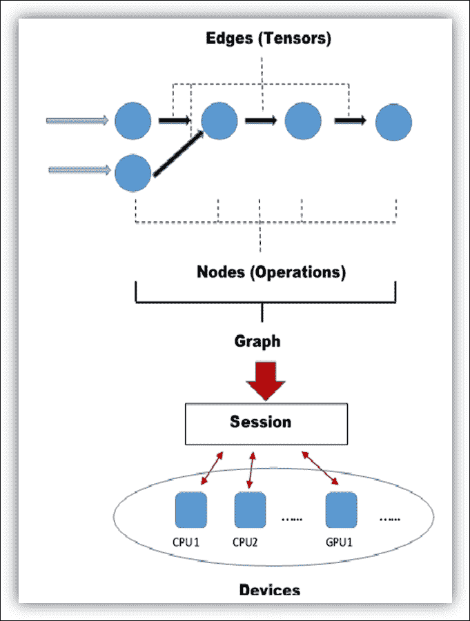
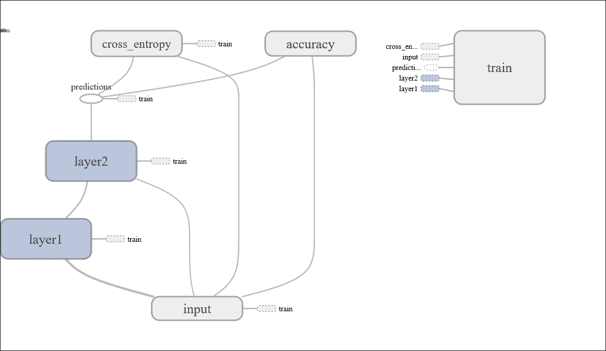
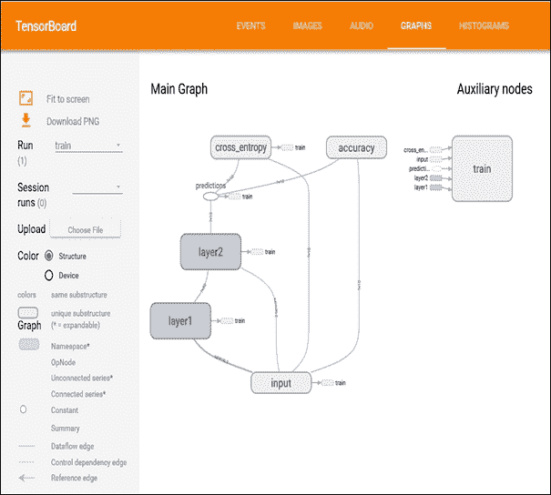
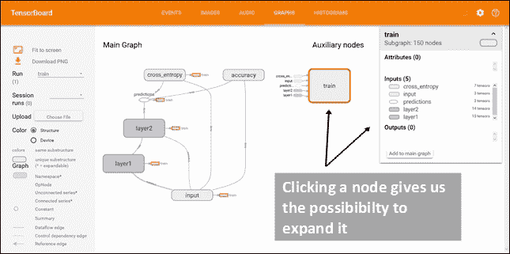
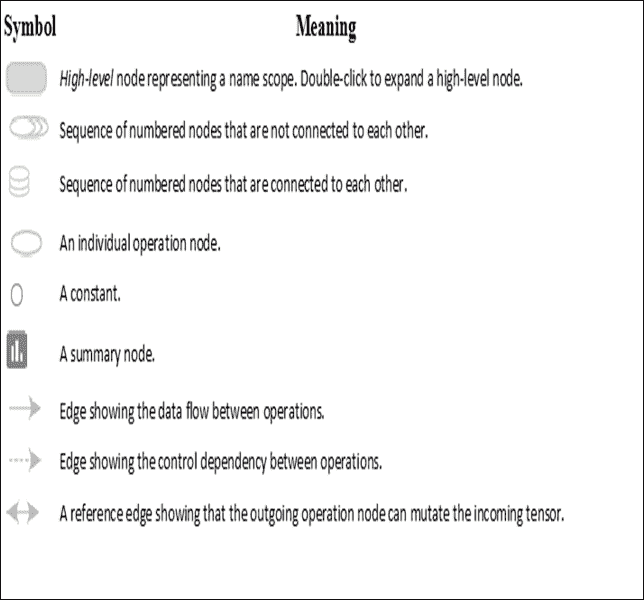

# 一、TensorFlow 基本概念

在本章中，我们将介绍以下主题：

*   机器学习和深度学习基础
*   TensorFlow 概述
*   Python 基础
*   安装 TensorFlow
*   第一个工作会话
*   数据流图
*   TensorFlow 编程模型
*   如何使用 TensorBoard

# 机器学习和深度学习基础

机器学习是人工智能（尤其是计算机科学）的一个分支，它研究可以从数据中学习的系统和算法，并从中综合新知识。

“学习”一词直观地表明，基于机器学习的系统可能会基于对先前处理的数据的观察，*改善*的知识，以便在将来实现*更好的结果* ，或为特定系统提供输出，使其更接近。

由于*过去的经验*，基于机器学习的程序或系统提高其在特定任务中的表现的能力与*识别数据*的能力紧密相关。 。 因此，这个主题称为*模式识别*，在人工智能领域具有至关重要的意义，并且引起了越来越多的关注。 它是所有机器学习技术的基础。

机器学习系统的训练可以通过不同的方式完成：

*   监督学习
*   无监督学习

## 监督学习

监督学习是机器学习的最常见形式。 在监督学习的情况下，在*训练阶段*期间，将一组示例（训练集）作为输入提交给系统，其中，每个示例都被标记为相应的*期望输出值*。 例如，让我们考虑一个**分类问题**，其中系统必须将`N`个不同类别之一中的一些实验观察结果归因于已知的类别。 在此问题中，训练集被表示为类型为`{(X1, Y1), ....., (Xn, Yn)}`的成对序列，其中`Xi`是输入向量（*特征向量*），`Yi`代表相应输入的所需类别向量。 大多数受监督的学习算法都有一个特征：通过最小损失函数（*成本函数*）的最小化来执行训练，该损失函数表示相对于所需输出系统的*输出误差*。

最常用于此类训练的成本函数计算所需输出与系统提供的输出之间的*标准差*。 训练后，在与训练集（即所谓的*验证集*）分离的一组示例中测量模型的*准确率*。



监督学习工作流程

然后在此阶段验证*模型的泛化能力*：对于训练阶段中未使用的输入，我们将测试是否输出正确。

### 无监督学习

在无监督学习中，系统提供的训练示例*未使用相关所属类别标记*。 因此，该系统开发并组织数据，在其中寻找*共同特征*，然后根据其内部知识对其进行更改。

无监督学习算法特别用于*聚类问题*，其中存在许多输入示例，您不知道先验类，甚至不知道可能的类是什么，或者不知道他们有多少类。 当您无法使用监督学习时，这是很明显的情况，因为您不知道先验的类别数量。



无监督学习工作流程

### 深度学习

深度学习技术代表了近几十年来机器学习所迈出的重要一步，它提供了许多应用从未见过的结果，例如图像和语音识别或**自然语言处理**（**NLP**）。 导致深度学习发展的原因有很多，仅在最近几十年中它才被置于机器学习领域的中心。 原因之一，也许是主要原因，可以肯定地以硬件的进步为代表，并且随着新处理器的出现，例如**图形处理单元**（**GPU**），它们大大减少了使用所需的数据训练网络的时间，将它们降低了 10 或 20 倍。另一个原因当然是训练系统所需的数据集越来越多，训练一定深度并具有高维度输入数据的架构所需的数据集。



深度学习工作流程

深度学习基于*人脑*处理信息和学习并对外部刺激做出反应的方式。 它包含在*几个表示级别*的机器学习模型中，其中更深的级别将先前级别的输出作为输入，对其进行转换并始终进行抽象。 在此假设模型中，每个级别对应于大脑皮层的不同区域：当大脑接收图像时，它将通过*边检测*和*形式感知*等各个阶段对其进行处理，即从*原语*表示级别到*最复杂的*。 例如，在图像分类问题中，每个块借助于*过滤操作*，以各种抽象级别逐渐提取*特征*，输入已经处理的数据。

# TensorFlow 概述

[TensorFlow](https://www.tensorflow.org/) 是一个软件库，由 Google 机器学习情报研究组织的 Google Brain 团队开发，目的是进行机器学习和深度神经网络研究。 然后 TensorFlow 结合了编译优化技术的计算代数，从而简化了许多数学表达式的计算，其中问题是执行计算所需的时间。

主要功能包括：

*   定义，优化和有效地计算涉及多维数组（张量）的数学表达式。
*   深度神经网络和机器学习技术的编程支持。
*   透明使用 GPU 计算，自动管理和优化所使用的相同内存和数据。 您可以编写相同的代码，然后在 CPU 或 GPU 上运行它。 更具体地说，TensorFlow 将确定应将计算的哪些部分移至 GPU。
*   跨机器和巨大数据集的计算具有高度可扩展性。



TensorFlow 主页

TensorFlow 可以使用 Python 和 C++ 支持，并且我们将使用 Python 2.7 进行学习，因为 Python API 确实受到更好的支持并且更容易学习。 Python 的安装取决于您的系统。 [下载页面](https://www.python.org/downloads/)包含安装页面所需的所有信息。 在下一节中，我们将通过一些编程示例非常简要地解释 Python 语言的主要功能。

# Python 基础

Python 是一种强类型的动态语言（数据类型是必需的，但不必显式声明它们），区分大小写（`var`和`VAR`是两个不同的变量）和面向对象（Python 中的所有对象都是对象）。

## 语法

在 Python 中，不需要行终止符，并且使用缩进指定块。 缩进以开始一个块并删除缩进以结束它，仅此而已。 需要缩进的指令以冒号（`:`）结尾。 注释以井号（`#`）开头，为单行。 多行字符串用于多行注释。 分配以等号（`=`）完成。 对于相等性测试，我们使用双等于（`==`）符号。 您可以通过使用`+=`和`-=`后跟加号来增加和减少值。 这适用于许多数据类型，包括字符串。 您可以在同一行上分配和使用多个变量。

以下是一些示例：

```py
>>> myvar = 3
>>> myvar += 2
>>> myvar
5
>>> myvar -= 1
>>> myvar
4
"""This is a comment"""
>>> mystring = "Hello"
>>> mystring += " world."
>>> print mystring
Hello world.

```

以下代码在一行中交换两个变量：

```py
>>> myvar, mystring = mystring, myvar

```

## 数据类型

Python 中最重要的结构是列表，元组和字典。 从 2.5 版开始，这些集就集成在 Python 中（对于以前的版本，它们在集库中可用）。 列表与一维数组相似，但是您可以创建包含其他列表的列表。 字典是包含键和值对（哈希表）的数组，元组是不可变的一维对象。 在 Python 中，数组可以是任何类型，因此您可以在列表/字典和元组中混合使用整数，字符串等。 任何类型的数组中第一个对象的索引始终为零。 允许使用负索引并从数组末尾开始计数，`-1`是最后一个元素。 变量可以引用函数。

```py
>>> example = [1, ["list1", "list2"], ("one", "tuple")]
>>> mylist = ["Element 1", 2, 3.14]
>>> mylist [0] 
"Element 1"
>>> mylist [-1]
3.14
>>> mydict = {"Key 1": "Val 1", 2: 3, "pi": 3.14}
>>> mydict ["pi"]
3.14
>>> mytuple = (1, 2, 3)
>>> myfunc = len
>>> print myfunc (mylist)
3

```

您可以使用冒号（`:`）获得数组范围。 不指定范围的起始索引意味着第一个元素； 不指示最终索引意味着最后一个元素。 负索引从最后一个元素开始计数（`-1`是最后一个元素）。 然后运行以下命令：

```py
>>> mylist = ["first element", 2, 3.14]
>>> print mylist [:]
['first element', 2, 3.1400000000000001]
>>> print mylist [0:2]
['first element', 2]
>>> print mylist [-3:-1]
['first element', 2]
>>> print mylist [1:]
[2, 3.14]

```

## 字符串

Python 字符串用单引号（`'`）或双引号（`"`）表示，并允许在另一字符串（`"He said' hello '."It is valid`）上的定界字符串内使用符号。 多行字符串用三引号（或单引号）（`"""`）括起来。 Python 支持 unicode； 只需使用语法：`"This is a unicode string"`。 要将值插入字符串中，请使用`%`运算符（模）和元组。 每个`%`由一个元组元素从左到右替换，并允许使用字典进行替换。

```py
>>> print "Nome: %s\nNumber: %s\nString: %s" % (myclass.nome, 3, 3 * "-")
Name: Poromenos
Number: 3
String: ---
strString = """this is a string
on multiple lines."""
>>> print "This %(verbo)s un %(name)s." % {"name": "test", "verb": "is"}
This is a test.

```

## 控制流

流量控制的指令为`if`，`for`和`while`。 有`select`控制流； 我们使用`if`代替它。 `for`控制流用于枚举列表的成员。 要获取数字列表，请使用`range (number)`。

```py
rangelist = range(10)
>>> print rangelist
[0, 1, 2, 3, 4, 5, 6, 7, 8, 9]

```

让我们检查`number`是否为元组中的数字之一：

```py
for number in rangelist:
    if number in (3, 4, 7, 9):
        # "Break" ends the for instruction without the else clause
        break
    else:
        # "Continue" continues with the next iteration of the loop
        continue
else:
    # this is an optional "else" 
    # executed only if the loop is not interrupted with "break".
    pass # it does nothing
if rangelist[1] == 2:
    print "the second element (lists are 0-based) is 2"
elif rangelist[1] == 3:
    print "the second element is 3"
else:
    print "I don't know"
while rangelist[1] == 1:
    pass

```

## 函数

函数用关键字`def`声明。 必须在必选参数之后声明所有可选参数，并且必须为其分配值。 使用参数命名的函数调用函数时，还必须传递值。 函数可以返回一个元组（元组拆包可以返回多个值）。 Lambda 函数是内联的。 参数是通过引用传递的，但是不能在函数中更改不可变的类型（元组，整数，字符串等）。 发生这种情况是因为它仅通过元素在内存中的位置传递，并且将另一个对象分配给变量会导致较早丢失对象引用。

例如：

```py
# equal to a def f(x): return x + 1
funzionevar = lambda x: x + 1
>>> print funzionevar(1)
2
def passing_example(my_list,my_int):
    my_list.append("new element")
    my_int = 4
    return my_list, my_int
>>> input_my_list = [1, 2, 3]
>>> input_my_int = 10
>>> print passing_example(input_my_list, input_my_int)
([1, 2, 3, 'new element'], 10)
>>> my_list
[1, 2, 3, 'new element']
>>> my_int
10

```

## 类

Python 支持类的多重继承。 变量和私有方法是通过对流（这不是语言规则）声明的，方法是在变量和私有方法前加两个下划线（`__`）。 我们可以将属性（属性）分配给类的任意实例。

以下是一个示例：

```py
class Myclass:
    common = 10
    def __init__(self):
        self.myvariable= 3
    def myfunc(self, arg1, arg2):
        return self.myvariable
# We create an instance of the class
>>> instance= Myclass()
>>> instance.myfunc(1, 2)
3
# This variable is shared by all instances
>>> instance2= Myclass()
>>> instance.common
10
>>> instance2.common
10
# Note here how we use the class name
# Instead of the instance.
>>> Myclass.common = 30
>>> instance.common
30
>>> instance2.common
30
# This does not update the variable in the class, 
# Instead assign a new object to the variable
# of the first instance.
>>> instance.common = 10
>>> instance.common
10
>>> instance2.common
30
>>> Myclass.common = 50
# The value is not changed because "common" is an instance variable.
>>> instance.common
10
>>> instance2.common
50
# This class inherits from Myclass. Multiple inheritance
# is declared like this:
# class AltraClasse(Myclass1, Myclass2, MyclassN)
class AnotherClass(Myclass):
    # The topic "self" is automatically passed 
    # and makes reference to instance of the class, so you can set 
    # of instance variables as above, but within the class.    
def __init__(self, arg1):
        self.myvariable= 3
        print arg1
>>> instance= AnotherClass ("hello")
hello
>>> instance.myfunc(1, 2)
3
# This class does not have a member (property) .test member, but
# We can add one all instance when we want. Note
# .test That will be a member of only one instance.
>>> instance.test = 10
>>> instance.test
10

```

## 异常

Python 中的异常通过 `try-except`块[`exception_name`]处理：

```py
def my_func():
    try:
        # Division by zero causes an exception
        10 / 0
    except ZeroDivisionError:
        print "Oops, error"
    else:
        # no exception, let's proceed
        pass
    finally:
# This code is executed when the block
    # Try..except is already executed and all exceptions
    # Were handled, even if there is a new
    # Exception directly in the block.
        print "finish"
>>> my_func()
Oops, error.
finish

```

## 导入库

外部库通过`import [library name]`导入。 您也可以使用`[libraryname] import [funcname]`表格导入单个函数。 这是一个例子：

```py
import random
from time import clock
randomint = random.randint(1, 100)
>>> print randomint
64

```

# 安装 TensorFlow

TensorFlow Python API 支持 Python 2.7 和 Python 3.3+。 GPU 版本（仅 Linux）需要 Cuda Toolkit >= 7.0 和 cuDNN >= v2。

在 Python 环境中工作时，建议您使用`virtualenv`。 它将隔离您的 Python 配置用于不同的项目； 使用`virtualenv`不会覆盖 TensorFlow 所需的 Python 包的现有版本。

## 在 Mac 或 Linux 发行版上安装

以下是在 Mac 和 Linux 系统上安装 TensorFlow 的步骤：

1.  如果尚未安装 PIP 和 Virtualenv（可选），请首先安装它们：

    对于 Ubuntu/Linux 64 位：

    ```py
     $ sudo apt-get install python-pip python-dev python-virtualenv

    ```

    对于 Mac OSX：

    ```py
     $ sudo easy_install pip
            $ sudo pip install --upgrade virtualenv

    ```

2.  然后，您可以创建虚拟环境 Virtualenv。 以下命令在`~ / tensorflow`目录中创建虚拟环境 virtualenv：

    ```py
     $ virtualenv --system-site-packages ~/tensorflow

    ```

3.  下一步是如下激活 Virtualenv：

    ```py
     $ source ~/tensorflow/bin/activate.csh
        (tensorflow)$

    ```

4.  此后，我们正在使用的环境的名称在命令行之前。 一旦激活，PIP 将用于在其中安装 TensorFlow。

对于 Ubuntu/Linux 64 位 CPU：

```py
(tensorflow)$ pip install --upgrade https://storage.googleapis.com/tensorflow/linux/cpu/tensorflow-0.5.0-cp27-none-linux_x86_64.whl

```

对于 Mac OSX，CPU：

```py
(tensorflow)$ pip install --upgrade https://storage.googleapis.com/tensorflow/mac/tensorflow-0.5.0-py2-none-any.whl

```

如果您想将 GPU 卡与 TensorFlow 一起使用，请安装另一个包。 我建议您访问官方文档，以查看您的 GPU 是否满足支持 TensorFlow 所需的规格。

### 注意

要使用 TensorFlow 启用 GPU，有关完整的说明您可以参考[这里](https://www.tensorflow.org/versions/r0.9/get_started/os_setup.html#optional-linux-enable-gpu-support)。

最后，完成后，必须禁用虚拟环境：

```py
(tensorflow)$ deactivate

```

### 注意

鉴于本书的介绍性，我建议读者访问[下载和设置 TensorFlow 页面](https://www.tensorflow.org/versions/r0.7/get_started/os_setup.html#download-and-setup)以查找有关其他安装 TensorFlow 的方法的更多信息。

## 在 Windows 上安装

如果无法获得基于 Linux 的系统，则可以在虚拟机上安装 Ubuntu。 只需使用名为 VirtualBox 的免费应用，即可在 Windows 上创建虚拟 PC 并在后者中安装 Ubuntu。 因此，您可以尝试操作系统，而无需创建分区或处理繁琐的过程。

### 注意

安装 VirtualBox 后，您可以安装 [Ubuntu](http://www.ubuntu.com)，然后按照 Linux 机器的安装步骤来安装 TensorFlow。

## 从源安装

但是，PIP 安装可能会引起问题，[尤其是在使用可视化工具 TensorBoard 时](https://github.com/tensorflow/tensorflow/issues/530)。 要解决此问题，建议您通过以下步骤构建并安装 TensorFlow，以启动表单源文件：

1.  克隆 TensorFlow 存储库：

    ```py
    git clone --recurse-submodules https://github.com/tensorflow/tensorflow

    ```

2.  按照[说明](http://bazel.io/docs/install.html)安装 Bazel（依赖项和安装程序）.

3.  运行 Bazel 安装程序：

    ```py
     chmod +x bazel-version-installer-os.sh
      ./bazel-version-installer-os.sh --user

    ```

4.  安装 Python 依赖项：

    ```py
    sudo apt-get install python-numpy swig python-dev

    ```

5.  在 TensorFlow 下载的存储库中配置安装（GPU 还是没有 GPU？）：

    ```py
    ./configure

    ```

6.  使用`bazel`创建自己的 TensorFlow PIP 包：

    ```py
    bazel build -c opt //tensorflow/tools/pip_package:build_pip_package

    ```

7.  要使用 GPU 支持进行构建，请再次使用`bazel build -c opt --config=cuda`和

    ```py
    //tensorflow/tools/pip_package:build_pip_package

    ```

8.  最后，安装 TensorBoard，其中`.whl`文件的名称将取决于您的平台。

    ```py
     pip install /tmp/tensorflow_pkg/tensorflow-0.7.1-py2-none- linux_x86_64.whl

    ```

9.  祝好运！

### 注意

有关更多信息，请参考[这里](https://www.tensorflow.org/versions/r0.7/get_started/os_setup.html#installation-for-linux)。

## 测试您的 TensorFlow 安装

打开一个终端并输入以下代码行：

```py
>>> import tensorflow as tf
>>> hello = tf.constant("hello TensorFlow!")
>>> sess=tf.Session()

```

要验证您的安装，只需键入：

```py
>>> print(sess.run(hello))

```

您应该具有以下输出：

```py
Hello TensorFlow!
>>>

```

# 第一个工作会话

最后，是时候从理论转向实践了。 我将使用 Python 2.7 IDE 编写所有示例。 要初步了解如何使用 TensorFlow，请打开 Python 编辑器并编写以下代码行：

```py
x = 1
y = x + 9
print(y)
import tensorflow as tf
x = tf.constant(1,name='x')
y = tf.Variable(x+9,name='y')
print(y)

```

如您在前三行中容易理解的那样，将等于`1`的常量`x`添加到`9`以设置变量`y`的新值，然后得出变量的最终结果。 变量`y`打印在屏幕上。

在最后四行中，我们已根据 TensorFlow 库转换了前三个变量。

如果运行程序，则将显示以下输出：

```py
10
<tensorflow.python.ops.variables.Variable object at    0x7f30ccbf9190>

```

程序示例的前三行的 TensorFlow 转换会产生不同的结果。 让我们分析一下：

1.  如果您想使用 TensorFlow 库，请不要错过以下声明。 它告诉我们我们正在导入库并将其命名为`tf`：

    ```py
    import tensorflow as tf 

    ```

2.  我们创建一个名为`x`的常数，其值等于 1：

    ```py
    x = tf.constant(1,name='x')

    ```

3.  然后，我们创建一个名为`y`的变量。 通过简单的公式`y=x+9`定义此变量：

    ```py
    y = tf.Variable(x+9,name='y')

    ```

4.  最后，打印出结果：

    ```py
    print(y)

    ```

那么我们如何解释不同的结果呢？ 区别在于变量定义。 实际上，变量`y`并不代表`x + 9`的当前值，而是表示：*在计算变量`y`时，取常数`x`的值并将其加 9*。 这就是从未执行`y`值的原因。 在下一节中，我将尝试修复它。

因此，我们打开 Python IDE 并输入以下行：



运行前面的代码，输出结果最终如下：

```py
10

```

我们删除了打印指令，但是已经初始化了模型变量：

```py
model = tf.initialize_all_variables()

```

而且，大多数情况下，我们创建了一个用于计算值的会话。 在下一步中，我们运行先前创建的模型，最后仅运行变量`y`并打印出其当前值。

```py
with tf.Session() as session:
    session.run(model)
    print(session.run(y))

```

这是允许正确结果的魔术。 在此基本步骤中，在`session`中创建了称为数据流图的执行图，其中包含变量之间的所有依赖关系。 `y`变量取决于变量`x`，并且通过向其添加`9`来转换该值。 在执行会话之前不会计算该值。

最后一个示例在 TensorFlow 中引入了另一个重要功能，即数据流图。

# 数据流图

机器学习应用是重复计算复杂数学表达式的结果。 在 TensorFlow 中，使用数据流图描述了计算，其中图中的每个*节点*代表数学运算的实例（`multiply`，`add`等）， 每个*边*是执行操作的多维数据集（*张量*）。

TensorFlow 支持这些构造和这些运算符。 让我们详细看看 TensorFlow 如何管理节点和边：

*   **节点**：在 TensorFlow 中，每个节点代表一个操作的实例。 每个操作都有`>=`输入和`>= 0`输出。
*   **边**：在 TensorFlow 中，有两种类型的边：
    *   **正常边**：它们是数据结构（张量）的载体，其中一个操作的输出（来自一个节点）成为另一操作的输入。
    *   **特殊边**：这些边不是节点（运算符）的输出与另一节点的输入之间的数据载体。 特殊边表示两个节点之间的控制依赖关系。 假设我们有两个节点`A`和`B`，并且有一个特殊的边将`A`连接到`B`； 这意味着`B`仅在`A`中的操作结束时才开始操作。 数据流图中使用特殊边来设置张量上的操作之间的事前关系。

让我们更详细地探讨数据流图中的一些组件：

*   **操作**：这表示一种抽象计算，例如对矩阵进行相加或相乘。 一个操作管理张量。 它可以是多态的：同一操作可以操纵不同的张量元素类型。 例如，添加两个`int32`张量，添加两个浮点张量，依此类推。
*   **内核**：这表示该操作的具体实现。 内核定义特定设备上操作的实现。 例如，加矩阵运算可以具有 CPU 实现和 GPU 实现。 在以下部分中，我们介绍了在 TensorFlow 中创建`del`执行图的会话概念。 让我们解释一下这个主题：
*   **会话**：当客户端程序必须与 TensorFlow 运行时系统建立通信时，必须创建一个会话。 为客户端创建会话后，便会创建一个初始图，该图为空。 它有两种基本方法：
    *   `session.extend`：在计算中，用户可以扩展执行图，请求添加更多操作（节点）和边（数据）。
    *   `session.run`：使用 TensorFlow，使用一些图创建会话，并执行这些完整图以获得一些输出，或者有时，使用运行调用来执行子图数千/百万次。 基本上，该方法运行执行图以提供输出。



数据流图中的组件

# TensorFlow 编程模型

采用数据流图作为执行模型，您可以使用隐藏所有复杂性的单个编程接口将数据流设计（图构建和数据流）与其执行（CPU，GPU 卡或组合）分开。 它还定义了 TensorFlow 中的编程模型应该是什么样的。

让我们考虑将两个整数相乘的简单问题，即`a`和`b`。

以下是此简单问题所需的步骤：

1.  定义并初始化变量。 每个变量都应定义当前执行的状态。 在 Python 中导入 TensorFlow 模块后：

    ```py
    import tensorflow as tf

    ```

2.  我们定义了计算中涉及的变量`a`和`b`。 这些是通过称为`placeholder`的基本结构定义的：

    ```py
    a = tf.placeholder("int32")
    b = tf.placeholder("int32")

    ```

3.  `placeholder`允许我们创建操作并建立计算图，而无需*数据*。
4.  然后，我们将这些变量用作 TensorFlow 函数`mul`的输入：

    ```py
    y = tf.mul(a,b)
    this function will return the result of the multiplication the input   integers a and b.

    ```

5.  管理执行流程，这意味着我们必须构建一个*会话*：

    ```py
    sess = tf.Session()

    ```

6.  可视化结果。 我们在变量`a`和`b`上运行模型，通过先前定义的占位符将数据馈入数据流图中。

    ```py
    print sess.run(y , feed_dict={a: 2, b: 5})

    ```

## 如何使用 TensorBoard

TensorBoard 是一个可视化工具，致力于分析数据流图以及更好地理解机器学习模型。 它可以以图形方式查看有关计算图的任何部分的参数和详细信息的不同类型的统计信息。 通常，计算图可能非常复杂。 深度神经网络最多可包含 36,000 个节点。 因此，TensorBoard 将节点折叠成高级块，从而突出显示具有相同结构的组。 这样做可以更好地分析图，仅关注计算图的核心部分。 而且，可视化过程是交互式的； 用户可以平移，缩放和展开节点以显示详细信息。

下图显示了使用 TensorBoard 的神经网络模型：



TensorBoard 可视化示例

TensorBoard 的算法将节点折叠为高级块，并突出显示具有相同结构的组，同时还分离出高级节点。 可视化工具也是交互式的：用户可以平移，放大，扩展和折叠节点。

TensorBoard 在机器学习模型的开发和调整中同样有用。 因此，TensorFlow 允许您在图中插入所谓的**摘要操作**。 这些摘要操作监视在日志文件中写入的更改值（在执行计算期间）。 然后，将 TensorBoard 配置为观看带有摘要信息的日志文件，并显示该信息随时间的变化。

让我们考虑一个基本的例子，以了解 TensorBoard 的用法。 我们有以下示例：

```py
import tensorflow as tf
a = tf.constant(10,name="a")
b = tf.constant(90,name="b")
y = tf.Variable(a+b*2, name="y")
model = tf.initialize_all_variables()
with tf.Session() as session:
    merged = tf.merge_all_summaries()
    writer = tf.train.SummaryWriter\
                      ("/tmp/tensorflowlogs",session.graph)   
     session.run(model)
    print(session.run(y))

```

得到以下结果：

```py
190

```

让我们指向会话管理。 要考虑的第一条指令如下：

```py
merged = tf.merge_all_summaries()

```

该指令必须合并默认图中收集的所有摘要。

然后我们创建`SummaryWriter`。 它将将从代码执行中获得的所有摘要（在本例中为执行图）写入`/tmp/tensorflowlogs`目录：

```py
writer = tf.train.SummaryWriter\
                    ("/tmp/tensorflowlogs",session.graph)

```

最后，我们运行模型并构建数据流图：

```py
session.run(model)
print(session.run(y))

```

TensorBoard 的使用非常简单。 让我们打开一个终端并输入以下内容：

```py
$tensorboard --logdir=/tmp/tensorflowlogs

```

出现如下信息：

```py
startig tensorboard on port 6006

```

然后，通过打开 Web 浏览器，我们应该显示带有辅助节点的数据流图：



使用 TensorBoard 显示数据流图

现在，我们将能够探索数据流图：



使用 TensorBoard 探索数据流图显示

TensorBoard 对常量和摘要节点使用特殊的图标。 总而言之，我们在下图中报告显示的节点符号表：



TensorBoard 中的节点符号

# 总结

在本章中，我们介绍了主要主题：**机器学习**和**深度学习**。 机器学习探索可以学习数据并进行数据预测的算法的研究和构建，而深度学习正是基于*人脑处理信息和学习*的方式， [对外部刺激作出反应](https://en.wikipedia.org/wiki/Algorithm)。

在这个庞大的科学研究和实际应用领域中，我们可以牢固地放置 **TensorFlow** 软件库，该库由 Google 人工智能研究小组（Google Brain Project）开发，并于 2015 年 11 月 9 日作为开源软件发布 。

在选择 **Python** 编程语言作为示例和应用的开发工具之后，我们了解了如何安装和编译该库，然后进行了第一个工作会话。 这使我们可以介绍 TensorFlow 和**数据流图**的执行模型。 它引导我们定义了我们的编程模型。

本章以如何使用重要工具调试机器学习应用的示例结尾： **TensorBoard**。

在下一章中，我们将继续进入 TensorFlow 库，以展示其多功能性。 从基本概念张量开始，我们将看到如何将库用于纯数学应用。