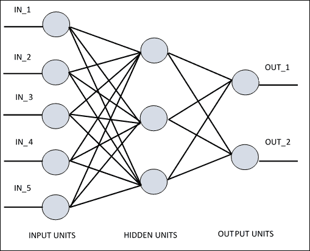
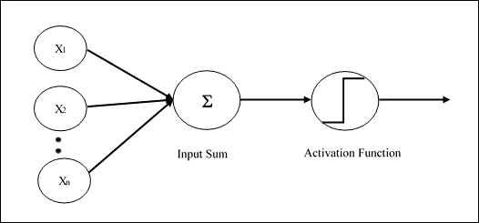
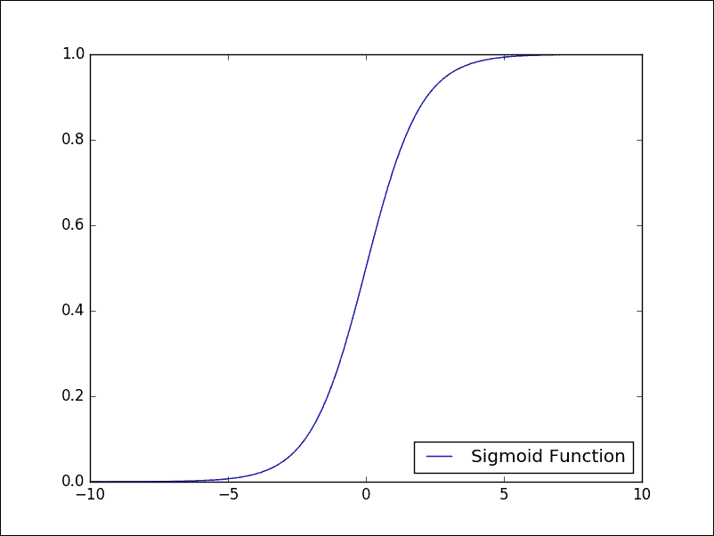
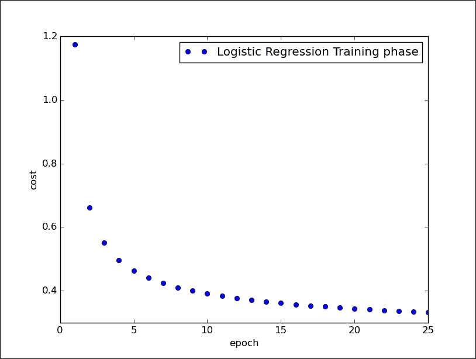
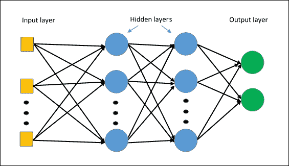
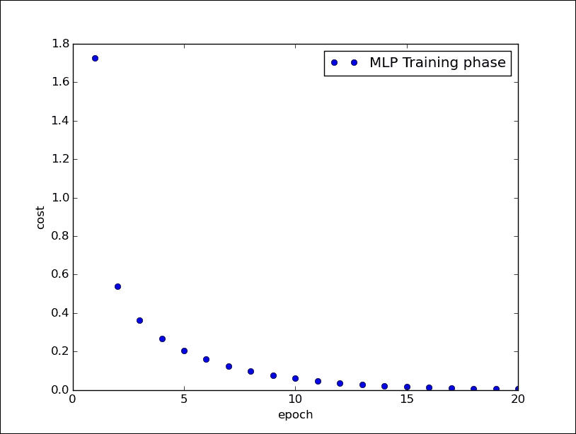
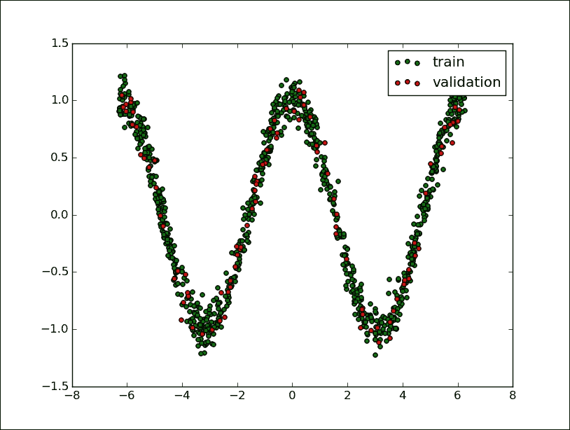
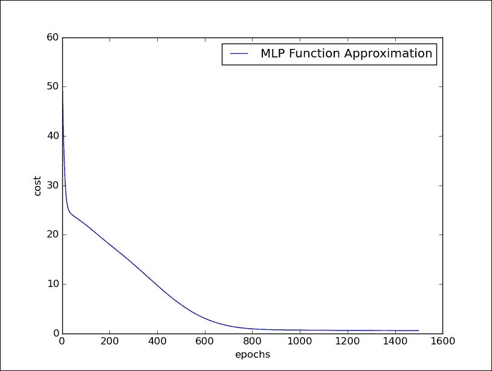

# 四、神经网络简介

在本章中，我们将介绍以下主题：

*   什么是神经网络？
*   单层感知机
*   逻辑回归
*   多层感知机
*   多层感知机分类
*   多层感知机函数近似

# 什么是人工神经网络？

**人工神经网络**（**ANN**）是一种信息处理系统，其运行机制受生物神经电路的启发。 由于它们的特性，神经网络是机器学习系统（尤其是在人工智能环境中）真正革命的主角。 根据各种架构，人工神经网络拥有许多相互连接的简单处理单元。 如果我们看一下稍后报告的 ANN 的架构，可以看到*隐藏单元*在输入和输出中与外部层通信，而*输入*和*输出单元*仅与网络的*隐藏层*通信。

每个单元或节点都模拟神经元在生物神经网络中的作用。 每个节点，即*人工神经元*，都具有非常简单的操作：如果其接收到的信号总量超过其激活阈值（由所谓的激活函数定义），它将变为活动状态。 如果节点*变为活动*，它会发射信号，该信号沿着传输通道传输到与其连接的另一个单元。 每个连接点都充当过滤器，将消息转换为抑制性信号或兴奋性信号，根据其各自的特征来增加或减少强度。 连接点模拟生物突触，并具有通过将传输信号乘以权重（其值取决于连接本身）来权衡传输信号强度的基本功能。



ANN 原理图

## 神经网络架构

连接节点的方式，*总层数*，即输入和输出之间的节点级别，以及每层神经元的数量-所有这些都定义了*神经网络的架构*。 例如，在**多层网络**中（我们将在本章的第二部分中介绍这些网络），可以识别层的人工神经元，使得：

*   每个神经元都与下一层的所有神经元相连
*   属于同一层的神经元之间没有连接
*   层数和每层神经元的数量取决于要解决的问题

现在，我们开始探索神经网络模型，介绍最简单的神经网络模型：单层感知机或所谓的罗森布拉特感知机。

# 单层感知机

单层感知机是第一个神经网络模型，由 Frank Rosenblatt 于 1958 年提出。 在此模型中，神经元局部记忆的内容由权重向量`W = (w1, w2,......, wn)`组成。 该计算是在计算输入向量`X =(x1, x2,......, xn)`的总和之后执行的，每个输入向量均与权重向量的相应元素相乘； 那么输出中提供的值（即加权总和）将是激活函数的输入。 如果结果大于某个阈值，则此函数返回`1`，否则返回`-1`。 在下图中，激活函数是所谓的`sign`函数：

```py
 +1        x > 0
sign(x)=
 −1        otherwise

```

可以使用其他激活函数，最好是非线性激活函数（例如`sigmoid`函数，我们将在下一部分中看到）。 网络的学习过程是迭代的：通过使用称为训练集的选定集，可以为每个学习周期（称为周期）稍微修改突触权重。 在每个循环中，必须修改权重以最小化成本函数，该成本函数特定于所考虑的问题。 最后，当感知机已在训练集上进行训练后，将在其他输入（测试集）上对其进行测试，以验证其概括能力。



Rosemblatt 的感知机架构

现在让我们看看如何使用 TensorFlow 对图像分类问题实现单层神经网络。

# 逻辑回归

该算法与我们在第 3 章“机器学习入门”开始看到的规范线性回归无关，但是它是允许我们解决监督分类问题的算法。 实际上，为了估计因变量，现在我们利用所谓的逻辑函数或 Sigmoid。 正是由于这个函数，我们将此算法称为逻辑回归。 Sigmoid 函数具有以下模式：



Sigmoid 函数

如我们所见，因变量的取值严格在`0`和`1`之间，这正是为我们服务的内容。 对于*逻辑回归*，我们希望我们的函数告诉我们属于我们的类别某个特定元素的*概率*是多少。 我们再次记得，通过神经网络对*监督*学习被配置为权重优化的*迭代过程*； 然后根据训练集的网络表现对它们进行修改。 实际上，其目标是使*损失函数*最小化，该函数表明网络行为偏离所需行为的程度。 然后，在*测试集*上验证网络的表现，该测试集由除受过训练的图像以外的其他图像组成。

我们将要实现的训练的基本步骤如下：

*   权重在训练开始时用随机值初始化。
*   对于训练集的每个元素，都会计算*误差*，即期望输出与实际输出之间的差。 此误差用于调整权重。
*   重复该过程，以随机顺序将训练集的所有示例重新提交给网络，直到整个训练集上的误差不小于某个阈值，或者直到达到最大迭代次数为止。

现在让我们详细了解如何使用 TensorFlow 实现逻辑回归。 我们要解决的问题是对来自 MNIST 数据集的图像进行分类，如第 3 章，“机器学习入门”中的手写数字的数据库。

## TensorFlow 实现

要实现 TensorFlow，我们需要执行以下步骤：

1.  首先，我们必须导入所有必需的库：

    ```py
    import input_data
    import tensorflow as tf
    import matplotlib.pyplot as plt

    ```

2.  我们使用第 3 章“机器学习入门”引入的 *MNIST 数据集*部分中的`input_data.read`函数，将图像上传到我们的问题中：

    ```py
    mnist = input_data.read_data_sets("/tmp/data/", one_hot=True)

    ```

3.  然后，我们设置训练阶段的总次数：

    ```py
    training_epochs = 25

    ```

4.  我们还必须定义构建模型所需的其他参数：

    ```py
    learning_rate = 0.01
    batch_size = 100
    display_step = 1

    ```

5.  现在我们转到模型的构建。

## 建立模型

将`x`定义为输入张量； 它表示大小为`28 x 28 = 784`像素的 MNIST 数据图像：

```py
x = tf.placeholder("float", [None, 784]) 

```

我们回想起我们的问题是为每种可能的隶属度类别（从 0 到 9 的数字）分配一个概率值。 在计算的最后，我们将使用概率分布，该分布为我们提供了对我们的预测的置信值。

因此，我们要获得的输出将是一个具有`10`概率的输出张量，每个张量都对应一个数字（当然，概率之和必须为 1）：

```py
y = tf.placeholder("float", [None, 10]) 

```

为了给每个图像分配概率，我们将使用所谓的 softmax 激活函数。

`softmax`函数在两个主要步骤中指定：

*   计算*证据*，即某个图像属于特定类别
*   将证据转换为属于 10 个可能类别中的每个类别的*概率*

为了求值证据，我们首先将权重输入张量定义为`W`：

```py
W = tf.Variable(tf.zeros([784, 10]))

```

对于给定的图像，我们可以通过简单地将张量`W`与输入张量`x`相乘来求值每个类别`i`的证据。 使用 TensorFlow，我们应该具有以下内容：

```py
evidence = tf.matmul(x, W)

```

通常，模型包括代表偏差的额外参数，该参数表示一定程度的不确定性。 在我们的案例中，证据的最终公式如下：

```py
evidence = tf.matmul(x, W) + b

```

这意味着，对于每个`i`（从 0 到 9），我们都有一个`Wi`矩阵元素`784 (28 × 28)`，其中矩阵的每个元素`j`与输入图像的相应分量`j`相乘（784 部分），并添加相应的偏置元素`bi`。

因此，要定义证据，我们必须定义以下偏差张量：

```py
b = tf.Variable(tf.zeros([10]))

```

第二步是最终使用`softmax`函数获得概率的输出向量，即`activation`：

```py
activation = tf.nn.softmax(tf.matmul(x, W) + b)

```

TensorFlow 的`tf.nn.softmax`函数提供了来自输入证据张量的基于概率的输出。 一旦实现模型，我们就可以指定必要的代码，以通过迭代训练算法找到权重`W`和偏置`b`网络。 在每次迭代中，训练算法都会获取训练数据，应用神经网络，并将结果与​​预期结果进行比较。

### 注意

TensorFlow 提供了许多其他激活函数。 有关更好的参考，请参见[这里](https://www.tensorflow.org/versions/r0.8/api_docs/index.html)。

为了训练我们的模型并知道何时有一个好的模型，我们必须定义如何定义模型的准确率。 我们的目标是尝试获取参数`W`和`b`的值，这些值会最小化指示模型有多糟糕的度量值。

不同的度量标准计算了期望输出和训练数据输出之间的误差。 常见的误差度量是均方误差或*平方欧几里德距离*。 但是，有一些研究发现建议对这种神经网络使用其他指标。

在此示例中，我们使用所谓的`cross-entropy error`函数。 它定义为：

```py
cross_entropy = y*tf.lg(activation)

```

为了最小化`cross_entropy`，我们可以使用`tf.reduce_mean`和`tf.reduce_sum`的以下组合来构建成本函数：

```py
cost = tf.reduce_mean\
         (-tf.reduce_sum\
           (cross_entropy, reduction_indices=1)) 

```

然后，我们必须使用梯度下降优化算法将其最小化：

```py
optimizer = tf.train.GradientDescentOptimizer\
                 (learning_rate).minimize(cost)

```

只需几行代码即可构建神经网络模型！

## 启动会话

现在是构建会话并启动我们的神经网络模型的时候了。

我们修复了以下列表以可视化训练过程：

```py
avg_set = []
epoch_set=[]

```

然后我们初始化 TensorFlow 变量：

```py
init = tf.initialize_all_variables()

```

开始会话：

```py
with tf.Session() as sess:
    sess.run(init)

```

如前所述，每个周期都是一个训练周期：

```py
 for epoch in range(training_epochs):
        avg_cost = 0.
        total_batch = int(mnist.train.num_examples/batch_size)

```

然后我们遍历所有批次：

```py
 for i in range(total_batch):
            batch_xs, batch_ys = \
                            mnist.train.next_batch(batch_size)

```

使用批量数据拟合训练：

```py
 sess.run(optimizer, feed_dict={x: batch_xs, y: batch_ys})

```

用给定的图像值（`x`）和实际输出（`y_`）计算运行`train_step`函数的平均损失：

```py
 avg_cost += sess.run\
                        (cost, feed_dict={x: batch_xs,\
                                y: batch_ys})/total_batch

```

在计算过程中，我们每个周期显示一个日志：

```py
 if epoch % display_step == 0:
            print "Epoch:",\
                  '%04d' % (epoch+1),\
                  "cost=","{:.9f}".format(avg_cost)
    print " Training phase finished"

```

让我们获得模式的准确率。 如果`y`值最高的索引与实数向量中的`correct_prediction`均值使我们具有准确率，则是正确的。 我们需要使用测试集（`mnist.test`）运行准确率函数。

我们使用`x`和`y`的关键图像和标签：

```py
 correct_prediction = tf.equal\
                           (tf.argmax(activation, 1),\
                            tf.argmax(y, 1))
    accuracy = tf.reduce_mean\
                       (tf.cast(correct_prediction, "float"))
   print "MODEL accuracy:", accuracy.eval({x: mnist.test.images,\
                                   y: mnist.test.labels})

```

## 测试和评估

我们之前显示了训练阶段，并且对于每个周期，我们都打印了相对成本函数：

```py
Python 2.7.10 (default, Oct 14 2015, 16:09:02)  [GCC 5.2.1 20151010] on linux2 Type "copyright", "credits" or "license()" for more information. >>> ======================= RESTART ============================
>>>
Extracting /tmp/data/train-images-idx3-ubyte.gz 
Extracting /tmp/data/train-labels-idx1-ubyte.gz 
Extracting /tmp/data/t10k-images-idx3-ubyte.gz 
Extracting /tmp/data/t10k-labels-idx1-ubyte.gz 
Epoch: 0001 cost= 1.174406662 
Epoch: 0002 cost= 0.661956009 
Epoch: 0003 cost= 0.550468774 
Epoch: 0004 cost= 0.496588717 
Epoch: 0005 cost= 0.463674555 
Epoch: 0006 cost= 0.440907706 
Epoch: 0007 cost= 0.423837747 
Epoch: 0008 cost= 0.410590841 
Epoch: 0009 cost= 0.399881751 
Epoch: 0010 cost= 0.390916621 
Epoch: 0011 cost= 0.383320325 
Epoch: 0012 cost= 0.376767031 
Epoch: 0013 cost= 0.371007620 
Epoch: 0014 cost= 0.365922904 
Epoch: 0015 cost= 0.361327561 
Epoch: 0016 cost= 0.357258660 
Epoch: 0017 cost= 0.353508228 
Epoch: 0018 cost= 0.350164634 
Epoch: 0019 cost= 0.347015593 
Epoch: 0020 cost= 0.344140861 
Epoch: 0021 cost= 0.341420144 
Epoch: 0022 cost= 0.338980592 
Epoch: 0023 cost= 0.336655581 
Epoch: 0024 cost= 0.334488012 
Epoch: 0025 cost= 0.332488823 
Training phase finished

```

如您所见，在训练阶段，成本函数被最小化。 在测试的最后，我们展示了实现模型的准确率：

```py
Model Accuracy: 0.9475 
    >>>

```

最后，使用以下代码行，我们可以可视化网络的训练阶段：

```py
plt.plot(epoch_set,avg_set, 'o',\
     label='Logistic Regression Training phase')
plt.ylabel('cost')
plt.xlabel('epoch')
plt.legend()
plt.show()

```



逻辑回归训练阶段

## 源代码

```py
# Import MINST data
import input_data
mnist = input_data.read_data_sets("/tmp/data/", one_hot=True)
import tensorflow as tf
import matplotlib.pyplot as plt
# Parameters
learning_rate = 0.01
training_epochs = 25
batch_size = 100
display_step = 1
# tf Graph Input
x = tf.placeholder("float", [None, 784]) 
y = tf.placeholder("float", [None, 10]) 
# Create model
# Set model weights
W = tf.Variable(tf.zeros([784, 10]))
b = tf.Variable(tf.zeros([10]))
# Construct model
activation = tf.nn.softmax(tf.matmul(x, W) + b) 
# Minimize error using cross entropy
cross_entropy = y*tf.log(activation)
cost = tf.reduce_mean\
       (-tf.reduce_sum\
        (cross_entropy,reduction_indices=1))
optimizer = tf.train.\
            GradientDescentOptimizer(learning_rate).minimize(cost) 
#Plot settings
avg_set = []
epoch_set=[]
# Initializing the variables
init = tf.initialize_all_variables()
# Launch the graph
with tf.Session() as sess:
    sess.run(init)
    # Training cycle
    for epoch in range(training_epochs):
        avg_cost = 0.
        total_batch = int(mnist.train.num_examples/batch_size)
        # Loop over all batches
        for i in range(total_batch):
            batch_xs, batch_ys = \
                      mnist.train.next_batch(batch_size)
            # Fit training using batch data
            sess.run(optimizer, \
                     feed_dict={x: batch_xs, y: batch_ys})
            # Compute average loss
            avg_cost += sess.run(cost,feed_dict=\
                                     {x: batch_xs,\ 
                                      y: batch_ys})/total_batch
        # Display logs per epoch step
        if epoch % display_step == 0:
            print "Epoch:", '%04d' % (epoch+1),\
                  "cost=", "{:.9f}".format(avg_cost)
        avg_set.append(avg_cost)
        epoch_set.append(epoch+1)
    print "Training phase finished"
    plt.plot(epoch_set,avg_set, 'o',\
             label='Logistic Regression Training phase')
    plt.ylabel('cost')
    plt.xlabel('epoch')
    plt.legend()
    plt.show()
    # Test model
    correct_prediction = tf.equal\
                        (tf.argmax(activation, 1),\
                         tf.argmax(y, 1))
    # Calculate accuracy
    accuracy = tf.reduce_mean(tf.cast(correct_prediction, "float"))
    print "Model accuracy:", accuracy.eval({x: mnist.test.images,\
                                            y: mnist.test.labels})

```

# 多层感知机

更复杂和有效的架构是**多层感知机**（**MLP**）。 它基本上由多层感知机组成，因此至少存在*隐藏的层*，即**未连接到网络的输入或输出**：



MLP 架构

根据上一段中概述的原则，通常使用监督学习来训练这种类型的网络。 特别地，用于 MLP 网络的典型学习算法是所谓的反向传播算法。

### 注意

反向传播算法是一种用于神经网络的学习算法。 它将系统的输出值与所需值进行比较。 基于由此计算出的差异（即误差），该算法通过逐步收敛所需输出值的集合来修改神经网络的突触权重。

重要的是要注意，在 MLP 网络中，尽管您不知道网络隐藏层的神经元的期望输出，但是始终可以通过基于最小误差函数的最小化应用有监督的学习方法。 梯度下降技术的应用。

在以下示例中，我们显示了针对图像分类问题（MNIST）的 MLP 实现。

## 多层感知机分类

导入必要的库：

```py
import input_data
import tensorflow as tf
import matplotlib.pyplot as plt

```

加载图像进行分类：

```py
mnist = input_data.read_data_sets("/tmp/data/", one_hot=True)

```

修复 MLP 模型的一些参数：

网络学习率：

```py
learning_rate = 0.001

```

周期：

```py
training_epochs = 20

```

要分类的图像数量：

```py
batch_size = 100
display_step = 1

```

第一层的神经元数量：

```py
n_hidden_1 = 256 

```

第二层的神经元数量：

```py
n_hidden_2 = 256 

```

输入的大小（每个图像都有`784`像素）：

```py
n_input = 784 # MNIST data input (img shape: 28*28)

```

输出类的大小：

```py
n_classes = 10

```

因此，应该注意的是，尽管对于给定的应用，输入和输出大小是完美定义的，但是对于如何定义隐藏层的数量和每层神经元的数量，没有严格的标准。

每个选择都必须基于类似应用的经验，例如：

*   当增加隐藏层的数量时，我们还应该在学习阶段增加必要的训练集的大小，并增加要更新的连接数。 这导致训练时间*增加*。
*   另外，如果隐藏层中的神经元太多，不仅有更多的权重需要更新，而且网络还倾向于从训练示例集中学习太多，从而导致*泛化能力很差*。 但是，如果隐藏的神经元太少，即使使用训练集，网络*也无法学习*。

### 建立模型

输入层是`x`张量`[1×784]`，它表示要分类的图像：

```py
x = tf.placeholder("float", [None, n_input])

```

输出张量`y`等于类数：

```py
y = tf.placeholder("float", [None, n_classes])

```

在中间，我们有两个隐藏层。 第一层由权重的`h`张量构成，其权重为`[784 × 256]`，其中`256`是该层的节点总数：

```py
h = tf.Variable(tf.random_normal([n_input, n_hidden_1]))

```

对于第 1 层，我们必须定义各自的偏置张量：

```py
bias_layer_1 = tf.Variable(tf.random_normal([n_hidden_1]))

```

每个神经元接收要与`hij`权重连接相结合进行分类的输入图像像素，并添加到偏置张量的各个值中：

```py
layer_1 = tf.nn.sigmoid(tf.add(tf.matmul(x,h),bias_layer_1))

```

它通过`activation`函数将其输出发送到下一层的神经元。 必须说，每个神经元的特征可能不同，但是在实践中，我们对所有神经元（通常为 Sigmoid）采用一个共同的特征。 有时输出神经元具有线性激活函数。 有趣的是，隐藏层中神经元的激活函数不能是线性的，因为在这种情况下，MLP 网络将等效于具有两层的网络，因此不再是 MLP 类型。 第二层必须执行与第一相同的步骤。

第二中间层由权重张量`[256 × 256]`的形状表示：

```py
w = tf.Variable(tf.random_normal([n_hidden_1, n_hidden_2]))

```

有偏置张量：

```py
bias_layer_2 = tf.Variable(tf.random_normal([n_hidden_2]))

```

第二层中的每个神经元都接收来自第 1 层神经元的输入，并与权重`Wij`连接相结合，并添加到第 2 层的各个偏差中：

```py
layer_2 = tf.nn.sigmoid(tf.add(tf.matmul(layer_1,w),bias_layer_2))

```

它将其输出发送到下一层，即输出层：

```py
output = tf.Variable(tf.random_normal([n_hidden_2, n_classes]))
bias_output = tf.Variable(tf.random_normal([n_classes]))
output_layer = tf.matmul(layer_2, output) + bias_output

```

输出层接收来自层 2 的 n 个刺激（256）作为输入，该 n 个刺激被转换为每个数的相应概率类别。

至于逻辑回归，我们然后定义`cost`函数：

```py
cost = tf.reduce_mean\
    (tf.nn.softmax_cross_entropy_with_logits\
(output_layer, y))

```

TensorFlow 函数`tf` `.nn.softmax_cross_entropy_with_logits`计算 softmax 层的成本。 仅在训练期间使用。 logits 是模型输出的未归一化对数概率（将 softmax 归一化之前输出的值）。

使`cost`函数最小化的相应优化器是：

```py
optimizer = tf.train.AdamOptimizer\
      (learning_rate=learning_rate).minimize(cost) 

```

`tf.train.AdamOptimizer`使用 Kingma 和 Ba 的 Adam 算法控制学习率。 与简单的`tf.train.GradientDescentOptimizer`相比，Adam 具有多个优点。 实际上，它使用了较大的有效步长，并且该算法将收敛到该步长而无需微调。

一个简单的`tf.train.GradientDescentOptimizer`也可以在您的 MLP 中使用，但需要更多的超参数调整，才能使其快速收敛。

### 注意

TensorFlow 提供了优化器基类来计算损失的梯度并将梯度应用于变量。 此类定义用于添加操作以训练模型的 API。 您永远不会直接使用此类，而是实例化其子类之一。 请参阅[这里](https://www.tensorflow.org/versions/r0.8/api_docs/python/train.html#Optimizer)以查看优化程序的实现。

### 启动会话

以下是启动会话的步骤：

1.  定义集合：

    ```py
    avg_set = []
    epoch_set=[]

    ```

2.  初始化变量：

    ```py
    init = tf.initialize_all_variables()

    ```

3.  启动图：

    ```py
    with tf.Session() as sess:
        sess.run(init)

    ```

4.  定义训练周期：

    ```py
     for epoch in range(training_epochs):
            avg_cost = 0.
            total_batch = int(mnist.train.num_examples/batch_size)

    ```

5.  循环所有批次（100）：

    ```py
     for i in range(total_batch):
                batch_xs, batch_ys = mnist.train.next_batch(batch_size)

    ```

6.  使用批次数据进行拟合训练：

    ```py
     sess.run(optimizer, feed_dict={x: batch_xs, y: batch_ys})

    ```

7.  计算平均损失：

    ```py
     avg_cost += sess.run(cost,feed_dict={x: batch_xs,\
                    y: batch_ys})/total_batch 
    Display logs per epoch step
            if epoch % display_step == 0:
                print "Epoch:", '%04d' % (epoch+1),\
              "cost=", "{:.9f}".format(avg_cost)
            avg_set.append(avg_cost)
            epoch_set.append(epoch+1)
        print "Training phase finished"

    ```

8.  使用以下代码行，我们绘制了训练阶段：

    ```py
     plt.plot(epoch_set,avg_set, 'o', label='MLP Training phase')
        plt.ylabel('cost')
        plt.xlabel('epoch')
        plt.legend()
        plt.show()

    ```

9.  最后，我们可以测试 MLP 模型：

    ```py
     correct_prediction = tf.equal(tf.argmax(output_layer, 1),\
                    tf.argmax(y, 1))
    evaluating its accuracy
        accuracy = tf.reduce_mean(tf.cast(correct_prediction, "float"))
        print "Model Accuracy:", accuracy.eval({x: mnist.test.images,\
                         y: mnist.test.labels})

    ```

10.  这是 20 个周期后的输出结果：

    ```py
    Python 2.7.10 (default, Oct 14 2015, 16:09:02)  [GCC 5.2.1 20151010] on linux2 Type "copyright", "credits" or "license()" for more information.
    >>> ========================== RESTART ==============================
    >>>  
    Succesfully downloaded train-images-idx3-ubyte.gz 9912422 bytes. 
    Extracting /tmp/data/train-images-idx3-ubyte.gz 
    Succesfully downloaded train-labels-idx1-ubyte.gz 28881 bytes. 
    Extracting /tmp/data/train-labels-idx1-ubyte.gz 
    Succesfully downloaded t10k-images-idx3-ubyte.gz 1648877 bytes. 
    Extracting /tmp/data/t10k-images-idx3-ubyte.gz 
    Succesfully downloaded t10k-labels-idx1-ubyte.gz 4542 bytes. 
    Extracting /tmp/data/t10k-labels-idx1-ubyte.gz 
    Epoch: 0001 cost= 1.723947845 
    Epoch: 0002 cost= 0.539266024 
    Epoch: 0003 cost= 0.362600502 
    Epoch: 0004 cost= 0.266637279 
    Epoch: 0005 cost= 0.205345784 
    Epoch: 0006 cost= 0.159139332 
    Epoch: 0007 cost= 0.125232637 
    Epoch: 0008 cost= 0.098572041 
    Epoch: 0009 cost= 0.077509963 
    Epoch: 0010 cost= 0.061127526 
    Epoch: 0011 cost= 0.048033808 
    Epoch: 0012 cost= 0.037297983 
    Epoch: 0013 cost= 0.028884999 
    Epoch: 0014 cost= 0.022818390 
    Epoch: 0015 cost= 0.017447586 
    Epoch: 0016 cost= 0.013652348 
    Epoch: 0017 cost= 0.010417282 
    Epoch: 0018 cost= 0.008079228 
    Epoch: 0019 cost= 0.006203546 
    Epoch: 0020 cost= 0.004961207 
    Training phase finished 
    Model Accuracy: 0.9775 
    >>>

    ```

我们在下图中显示了训练阶段：



多层感知机的训练阶段

### 源代码

```py
# Import MINST data
import input_data
mnist = input_data.read_data_sets("/tmp/data/", one_hot=True)
import tensorflow as tf
import matplotlib.pyplot as plt
# Parameters
learning_rate = 0.001
training_epochs = 20
batch_size = 100
display_step = 1
# Network Parameters
n_hidden_1 = 256 # 1st layer num features
n_hidden_2 = 256 # 2nd layer num features
n_input = 784 # MNIST data input (img shape: 28*28)
n_classes = 10 # MNIST total classes (0-9 digits)
# tf Graph input
x = tf.placeholder("float", [None, n_input])
y = tf.placeholder("float", [None, n_classes])
#weights layer 1
h = tf.Variable(tf.random_normal([n_input, n_hidden_1]))
#bias layer 1
bias_layer_1 = tf.Variable(tf.random_normal([n_hidden_1]))
#layer 1
layer_1 = tf.nn.sigmoid(tf.add(tf.matmul(x,h),bias_layer_1))
#weights layer 2
w = tf.Variable(tf.random_normal([n_hidden_1, n_hidden_2]))
#bias layer 2
bias_layer_2 = tf.Variable(tf.random_normal([n_hidden_2]))
#layer 2
layer_2 = tf.nn.sigmoid(tf.add(tf.matmul(layer_1,w),bias_layer_2))
#weights output layer
output = tf.Variable(tf.random_normal([n_hidden_2, n_classes]))
#biar output layer
bias_output = tf.Variable(tf.random_normal([n_classes]))
#output layer
output_layer = tf.matmul(layer_2, output) + bias_output
# cost function
cost = tf.reduce_mean\
    (tf.nn.softmax_cross_entropy_with_logits(output_layer, y))
# optimizer
optimizer = tf.train.AdamOptimizer\
      (learning_rate=learning_rate).minimize(cost) 
#Plot settings
avg_set = []
epoch_set=[]
# Initializing the variables
init = tf.initialize_all_variables()
# Launch the graph
with tf.Session() as sess:
    sess.run(init)
    # Training cycle
    for epoch in range(training_epochs):
        avg_cost = 0.
        total_batch = int(mnist.train.num_examples/batch_size)
        # Loop over all batches
        for i in range(total_batch):
            batch_xs, batch_ys = mnist.train.next_batch(batch_size)
            # Fit training using batch data
            sess.run(optimizer, feed_dict={x: batch_xs, y: batch_ys})
            # Compute average loss
            avg_cost += sess.run(cost, \
        feed_dict={x: batch_xs,\
              y: batch_ys})/total_batch
        # Display logs per epoch step
        if epoch % display_step == 0:
            print "Epoch:", '%04d' % (epoch+1),\
          "cost=", "{:.9f}".format(avg_cost)
        avg_set.append(avg_cost)
        epoch_set.append(epoch+1)
    print "Training phase finished"
    plt.plot(epoch_set,avg_set, 'o', label='MLP Training phase')
    plt.ylabel('cost')
    plt.xlabel('epoch')
    plt.legend()
    plt.show()
    # Test model
    correct_prediction = tf.equal(tf.argmax(output_layer, 1),\
         tf.argmax(y, 1))
    # Calculate accuracy
    accuracy = tf.reduce_mean(tf.cast(correct_prediction, "float"))
    print "Model Accuracy:", accuracy.eval({x: mnist.test.images,\                     y: mnist.test.labels})

```

## 多层感知机函数近似

在以下示例中，我们实现了一个 MLP 网络，该网络将能够学习任意函数`f (x)`的趋势。 在训练阶段，网络将必须从一组已知点中学习`x`和`f (x)`，而在测试阶段，网络将仅从`x`值中扣除`f (x)`的值。

这个非常简单的网络将由单个隐藏层构建。

导入必要的库：

```py
import tensorflow as tf
import numpy as np
import math, random
import matplotlib.pyplot as plt

```

我们建立数据模型。 要学习的函数将遵循`cosine`函数的趋势，并针对`1000`点进行了评估，并向其中添加了很少的随机误差（噪声）以重现真实情况：

```py
NUM_points = 1000
np.random.seed(NUM_points) 
function_to_learn = lambda x: np.cos(x) + \
       0.1*np.random.randn(*x.shape)

```

我们的 MLP 网络将由`10`神经元的隐藏层形成：

```py
layer_1_neurons = 10

```

网络一次学习`100`点，总共学习`1500`个学习周期（周期）：

```py
batch_size = 100
NUM_EPOCHS = 1500

```

最后，我们构造训练集和测试集：

```py
all_x contiene tutti i punti 
all_x = np.float32(np.random.uniform\
    (-2*math.pi, 2*math.pi,\
       (1, NUM_points))).T
np.random.shuffle(all_x)
train_size = int(900)

```

前`900`点在训练集中：

```py
x_training = all_x[:train_size]
y_training = function_to_learn(x_training)

```

最后一个`100`将在验证集中：

```py
x_validation = all_x[train_size:]
y_validation = function_to_learn(x_validation)

```

使用 matplotlib，我们显示以下集合：

```py
plt.figure(1)
plt.scatter(x_training, y_training, c='blue', label='train')
plt.scatter(x_validation, y_validation,c='red',label='validation')
plt.legend()
plt.show()

```



训练和验证集

### 建立模型

首先，我们为输入张量（`X`）和输出张量（`Y`）创建占位符：

```py
X = tf.placeholder(tf.float32, [None, 1], name="X")
Y = tf.placeholder(tf.float32, [None, 1], name="Y")

```

然后，我们构建`[1 x 10]`尺寸的隐藏层：

```py
w_h = tf.Variable(tf.random_uniform([1, layer_1_neurons],\
                                   minval=-1, maxval=1, \
                                                                                               dtype=tf.float32))
b_h = tf.Variable(tf.zeros([1, layer_1_neurons], \
                            dtype=tf.float32))

```

它从`X`输入张量接收输入值，并与权重`w_hij`连接相结合，并加上第 1 层的各个偏置：

```py
h = tf.nn.sigmoid(tf.matmul(X, w_h) + b_h)

```

输出层是一个`[10 x 1]`张量：

```py
w_o = tf.Variable(tf.random_uniform([layer_1_neurons, 1],\
                             minval=-1, maxval=1,\ 
                                   dtype=tf.float32))
b_o = tf.Variable(tf.zeros([1, 1], dtype=tf.float32))

```

第二层中的每个神经元都从层 1 的神经元接收输入，并与权重`w_oij`连接相结合，并与输出层的各个偏置相加：

```py
model = tf.matmul(h, w_o) + b_o

```

然后，我们为新定义的模型定义优化器：

```py
train_op = tf.train.AdamOptimizer().minimize\
        (tf.nn.l2_loss(model - Y))

```

我们还注意到，在这种情况下，采用的成本函数如下：

```py
tf.nn.l2_loss(model - Y)

```

`tf.nn.l2_loss`函数是一个 TensorFlow，它计算不具有`sqrt`的张量的 L2 范数的一半，也就是说，前一个函数的输出如下：

```py
 output = sum((model - Y) ** 2) / 2

```

对于我们的示例，`tf.nn.l2_loss`函数可以是可行的成本函数。

### 启动会话

让我们建立求值图：

```py
sess = tf.Session()
sess.run(tf.initialize_all_variables())

```

现在我们可以启动学习过程：

```py
errors = []
for i in range(NUM_EPOCHS):
    for start, end in zip(range(0, len(x_training), batch_size),\
                          range(batch_size,\
                                len(x_training), batch_size)):
        sess.run(train_op, feed_dict={X: x_training[start:end],\
                                      Y: y_training[start:end]})
    cost = sess.run(tf.nn.l2_loss(model - y_validation),\
                    feed_dict={X:x_validation})
    errors.append(cost)
    if i%100 == 0: print "epoch %d, cost = %g" % (i, cost)

```

将这个网络运行 1400 个周期，我们将看到误差逐渐减少并最终收敛：

```py
Python 2.7.10 (default, Oct 14 2015, 16:09:02)  [GCC 5.2.1 20151010] on linux2 Type "copyright", "credits" or "license()" for more information.
>>> ======================= RESTART ============================ 
>>>
epoch 0, cost = 55.9286 
epoch 100, cost = 22.0084 
epoch 200, cost = 18.033 
epoch 300, cost = 14.0481 
epoch 400, cost = 9.74721 
epoch 500, cost = 5.83419 
epoch 600, cost = 3.05434 
epoch 700, cost = 1.53706 
epoch 800, cost = 0.91719 
epoch 900, cost = 0.726675 
epoch 1000, cost = 0.668316 
epoch 1100, cost = 0.633737 
epoch 1200, cost = 0.608306 
epoch 1300, cost = 0.590429 
epoch 1400, cost = 0.574602
>>> 
```

 **以下代码行使我们能够显示成本在运行周期中的变化：

```py
plt.plot(errors,label='MLP Function Approximation')
plt.xlabel('epochs')
plt.ylabel('cost')
plt.legend()
plt.show()

```



多层感知机的训练阶段

# 总结

在本章中，我们介绍了*人工神经网络*。 人工神经元是一种数学模型，在某种程度上模仿了活神经元的特性。 网络的每个神经元都有一个非常简单的操作，包括接收到的信号总量超过激活阈值时变为活动状态。 学习过程通常是*监督的*：神经网络使用训练集来推断输入和相应输出之间的关系，而学习算法会修改网络的权重以使成本函数*最小化*，它表示*训练集*有关的*预测误差*。 如果训练成功，则即使事先不知道输出结果，神经网络也将能够做出预测。 在本章中，我们使用 TensorFlow 实现了一些涉及神经网络的示例。 在使用 *Rosemblatt 的感知机*进行分类的问题中，我们已经看到神经网络作为*逻辑回归*算法来解决分类和回归问题。 在本章的最后，在实现*图像分类器*之前，我们介绍了*多层感知机*架构，然后在*数学函数仿真器*的实现中，我们已经看到了该架构的实际应用。

在下一章中，我们最后介绍深度学习模型； 我们将研究和实现更复杂的神经网络架构，例如卷积神经网络和循环神经网络。