# 一、入门

TensorFlow 是 Google 最近发布的新的机器学习和图计算库。 其 Python 接口可确保通用模型的优雅设计，而其编译后的后端可确保速度。

让我们看一下应用 TensorFlow 时要学习的技术和要构建的模型。

# 安装 TensorFlow

在本节中，您将学习什么是 TensorFlow，如何安装 TensorFlow 以及如何构建简单模型和进行简单计算。 此外，您将学习如何建立用于分类的逻辑回归模型，并介绍机器学习问题以帮助我们学习 TensorFlow。

我们将学习 TensorFlow 是什么类型的库，并将其安装在我们自己的 Linux 机器上；如果您无法访问 Linux 机器，则将其安装在 CoCalc 的免费实例中。

## TensorFlow 主页

首先，什么是 TensorFlow？ TensorFlow 是 Google 推出的新的机器学习库。 它被设计为非常易于使用且非常快。 如果您访问 [TensorFlow 网站](http://tensorflow.org)，则可以访问有关 TensorFlow 是什么以及如何使用的大量信息。 我们将经常提到这一点，特别是文档。

## TensorFlow 安装页面

在我们开始使用 TensorFlow 之前，请注意，您需要先安装它，因为它可能尚未预先安装在您的操作系统上。 因此，如果转到 TensorFlow 网页上的“安装”选项卡，单击在 Ubuntu 上安装 TensorFlow，然后单击“本机 PIP”，您将学习如何安装 TensorFlow。

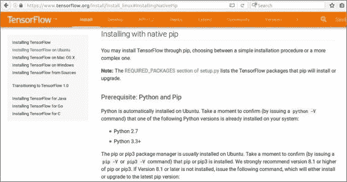

即使对于经验丰富的系统管理员来说，安装 TensorFlow 也是非常困难的。 因此，我强烈建议您使用类似`pip`的安装方式。 或者，如果您熟悉 Docker，请使用 Docker 安装。 您可以从源代码安装 TensorFlow，但这可能非常困难。 我们将使用称为 wheel 文件的预编译二进制文件安装 TensorFlow。 您可以使用 Python 的`pip`模块安装程序来安装此文件。

## 通过`pip`安装

对于`pip`安装，您可以选择使用 Python2 或 Python3 版本。 另外，您可以在 CPU 和 GPU 版本之间进行选择。 如果您的计算机具有功能强大的显卡，则可能适合您使用 GPU 版本。

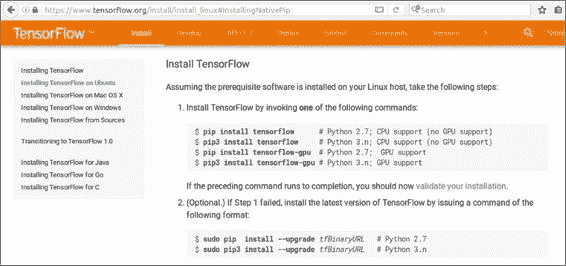

但是，您需要检查显卡是否与 TensorFlow 兼容。 如果不是，那很好。 本系列中的所有内容都可以仅使用 CPU 版本来完成。

### 注意

我们可以使用`pip install tensorflow`命令（基于您的 CPU 或 GPU 支持以及`pip`版本）安装 TensorFlow，如前面的屏幕截图所示。

因此，如果您为 TensorFlow 复制以下行，则也可以安装它：

```py
# Python 3.4 installation
sudo pip3 install --upgrade \
https://storage.googleapis.com/tensorflow/linux/cpu/tensorflow-1.2.1-cp34-cp34m-linux_x86_64.whl

```

如果您没有 Python 3.4，请按照 wheel 文件的要求进行操作，那就可以了。 您可能仍然可以使用相同的 wheel 文件。 让我们看一下如何在 Python 3.5 上执行此操作。 首先，只需将以下 URL 放在浏览器中，或使用命令行程序（例如`wget`）直接下载 wheel 文件，就像我们在这里所做的那样：

```py
wget  https://storage.googleapis.com/tensorflow/linux/cpu/tensorflow-1.2.1-cp34-cp34m-linux_x86_64.whl

```

如果下载此文件，它将很快被您的计算机抓住。

现在，您需要做的就是将文件名从`cp34`（代表 Python 3.4）更改为您使用的任何版本的 Python3。 在这种情况下，我们将其更改为使用 Python 3.5 的版本，因此我们将`4`更改为`5`：

```py
mv tensorflow-1.2.1-cp34-cp34m-linux_x86_64.whl tensorflow-1.2.1-cp35-cp35m-linux_x86_64.whl

```

现在您可以通过简单地将安装行更改为`pip3 install`并将新 wheel 文件的名称更改为 3.5 后，来为 Python 3.5 安装 TensorFlow：

```py
sudo pip3 install ./tensorflow-1.2.1-cp35-cp35m-linux_x86_64.whl

```

我们可以看到这很好。 现在，您已经安装了 TensorFlow。

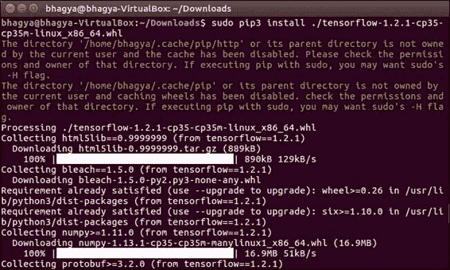

如果您的安装以后因某种原因损坏了，您可以随时跳回到该部分，以提醒自己有关安装所涉及的步骤。

## 通过 CoCalc 安装

如果您没有计算机的管理或安装权限，但仍然想尝试 TensorFlow，则可以尝试在 CoCalc 实例中通过 Web 运行 TensorFlow。 如果转到 [cocalc.com](https://cocalc.com/) 并创建一个新帐户，则可以创建一个新项目。 这将为您提供一种可以玩耍的虚拟机。 方便的是，TensorFlow 已经安装在 Anaconda 3 内核中。


让我们创建一个名为`TensorFlow`的新项目。 单击+创建新项目...，为您的项目输入标题，然后单击创建项目。 现在，我们可以通过单击标题进入我们的项目。 加载将需要几秒钟。


单击+新建以创建一个新文件。 在这里，我们将创建一个 Jupyter 笔记本：


Jupyter 是与 IPython 进行交互的便捷方法，也是使用 CoCalc 进行这些计算的主要手段。 加载可能需要几秒钟。

进入下面的屏幕快照中所示的界面时，您需要做的第一件事是通过转到“内核 | 更改内核… | Python3（Anaconda）”将内核更改为 Anaconda Python3：

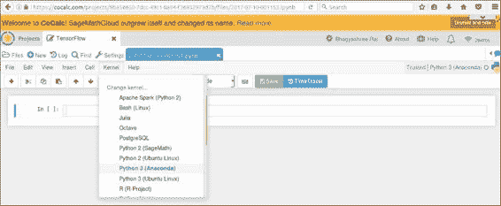

这将为您提供适当的依赖关系以使用 TensorFlow。 更改内核可能需要几秒钟。 连接到新内核后，可以在单元格中键入`import tensorflow`，然后转到“单元格 | 运行单元格”以检查其是否有效：

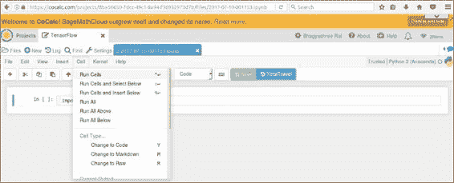

如果 Jupyter 笔记本需要很长时间才能加载，则可以使用以下屏幕截图中所示的按钮在 CoCalc 中创建终端：


到那里后，键入`anaconda3`切换环境，然后键入`ipython3`启动交互式 Python 会话，如以下屏幕截图所示：

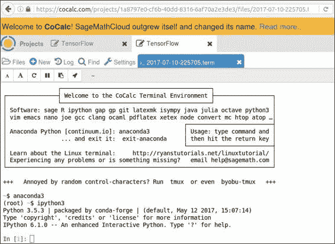

尽管您无法可视化输出，但是您可以在这里轻松地工作。 在终端中输入`import tensorflow`，然后离开。

到目前为止，您已经了解了 TensorFlow 是什么以及如何在本地或 Web 上的虚拟机上安装 TensorFlow。 现在我们准备在 TensorFlow 中探索简单的计算。

# 简单的计算

首先，我们将看一下张量对象类型。 然后，我们将理解定义计算的 TensorFlow 图。 最后，我们将使用会话运行图，显示如何替换中间值。

## 定义标量和张量

您需要做的第一件事是下载本书的源代码包并打开`simple.py`文件。 您可以使用此文件将行复制并粘贴到 TensorFlow 或 CoCalc 中，也可以直接键入它们。 首先，让我们将`tensorflow`导入为`tf`。 这是在 Python 中引用它的便捷方法。 您需要在`tf.constant`通话中保留常数。 例如，做`a = tf.constant(1)`和`b = tf.constant(2)`：

```py
import tensorflow as tf
# You can create constants in TF to hold specific values
a = tf.constant(1)
b = tf.constant(2)
```

当然，您可以将它们相加并相乘以获得其他值，即`c`和`d`：

```py
# Of course you can add, multiply, and compute on these as you like
c = a + b
d = a * b
```

TensorFlow 数字以张量存储，这是多维数组的一个花哨术语。 如果您将 Python 列表传递给 TensorFlow，它将做正确的事并将其转换为适当尺寸的张量。 您可以在以下代码中看到这一点：

```py
# TF numbers are stored in "tensors", a fancy term for multidimensional arrays. If you pass TF a Python list, it can convert it
V1 = tf.constant([1., 2.])   # Vector, 1-dimensional
V2 = tf.constant([3., 4.])   # Vector, 1-dimensional
M = tf.constant([[1., 2.]])             # Matrix, 2d
N = tf.constant([[1., 2.],[3.,4.]])     # Matrix, 2d
K = tf.constant([[[1., 2.],[3.,4.]]])   # Tensor, 3d+
```

`V1`向量（一维张量）作为`[1\. , 2.]`的 Python 列表传递。 这里的点只是强制 Python 将数字存储为十进制值而不是整数。 `V2`向量是`[3\. , 4\. ]`的另一个 Python 列表。 `M`变量是由 Python 中的列表列表构成的二维矩阵，在 TensorFlow 中创建了二维张量。 `N`变量也是二维矩阵。 请注意，这一行实际上有多行。 最后，`K`是一个真实的张量，包含三个维度。 请注意，最终维度仅包含一个条目，即一个`2 x 2`框。

如果该项有点混乱，请不要担心。 每当您看到一个奇怪的新变量时，都可以跳回到这一点以了解它可能是什么。

## 张量计算

您还可以做一些简单的事情，例如将张量相加：

```py
V3 = V1 + V2
```

或者，您可以将它们逐个元素相乘，以便将每个公共位置相乘在一起：

```py
# Operations are element-wise by default
M2 = M * M
```

但是，对于真正的矩阵乘法，您需要使用`tf.matmul`，传入两个张量作为参数：

```py
NN = tf.matmul(N,N)
```

## 执行计算

到目前为止，所有内容都已指定 TensorFlow 图； 我们还没有计算任何东西。 为此，我们需要启动一个进行计算的会话。 以下代码创建一个新的会话：

```py
sess = tf.Session()
```

打开会话后，请执行以下操作：`sess.run(NN)`将计算给定的表达式并返回一个数组。 通过执行以下操作，我们可以轻松地将其发送到变量：

```py
output = sess.run(NN)
print("NN is:")
print(output)
```

如果现在运行此单元格，则应该在屏幕上看到`NN`输出的正确张量数组：

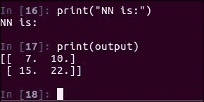

使用完会话后，最好将其关闭，就像关闭文件句柄一样：

```py
# Remember to close your session when you're done using it
sess.close()
```

对于交互式工作，我们可以像这样使用`tf.InteractiveSession()`：

```py
sess = tf.InteractiveSession()
```

然后，您可以轻松计算任何节点的值。 例如，输入以下代码并运行单元格将输出`M2`的值：

```py
# Now we can compute any node
print("M2 is:")
print(M2.eval())
```

## 可变张量

当然，并非我们所有的数字都是恒定的。 例如，要更新神经网络中的权重，我们需要使用`tf.Variable`创建适当的对象：

```py
W = tf.Variable(0, name="weight")
```

请注意，TensorFlow 中的变量不会自动初始化。 为此，我们需要使用一个特殊的调用，即`tf.global_variables_initializer()`，然后使用`sess.run()`运行该调用：

```py
init_op = tf.global_variables_initializer()
sess.run(init_op)
```

这是在该变量中放置一个值。 在这种情况下，它将把`0`值填充到`W`变量中。 让我们验证一下`W`是否具有该值：

```py
print("W is:")
print(W.eval())
```

您应该在单元格中看到`0`的`W`的输出值：

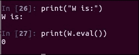

让我们看看向其中添加`a`会发生什么：

```py
W += a
print("W after adding a:")
print(W.eval())
```

回想一下`a`是`1`，因此您在这里得到`1`的期望值：

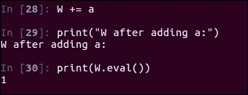

让我们再次添加`a`，以确保我们可以递增并且它确实是一个变量：

```py
W += a
print("W after adding a:")
print(W.eval())
```

现在您应该看到`W`持有`2`，因为我们已经使用`a`对其进行了两次递增：

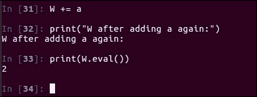

## 查看和替换中间值

在执行 TensorFlow 计算时，您可以返回或提供任意节点。 让我们定义一个新节点，但同时在`fetch`调用中返回另一个节点。 首先，让我们定义新节点`E`，如下所示：

```py
E = d + b # 1*2 + 2 = 4
```

让我们看看`E`的开头是：

```py
print("E as defined:")
print(E.eval())
```

如您所料，您应该看到`E`等于`4`。 现在让我们看一下如何传递`E`和`d`多个节点，以从`sess.run`调用中返回多个值：

```py
# Let's see what d was at the same time
print("E and d:")
print(sess.run([E,d]))
```

您应该看到输出中返回了多个值，即`4`和`2`：

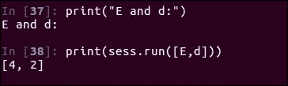

现在假设我们要使用其他中间值，例如出于调试目的。 返回值时，我们可以使用`feed_dict`将自定义值提供给计算中任何位置的节点。 让我们现在用`d`等于`4`而不是`2`来做：

```py
# Use a custom d by specifying a dictionary
print("E with custom d=4:")
print(sess.run(E, feed_dict = {d:4.}))
```

请记住，`E` 等于 `d + b`，`d`和`b`的值都是`2`。 尽管我们为`d`插入了`4`的新值，但是您应该看到`E`的值现在将输出为`6`：

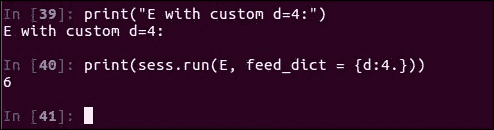

您现在已经了解了如何使用 TensorFlow 张量进行核心计算。 现在是时候通过建立逻辑回归模型来迈出下一步。

# 逻辑回归模型构建

好的，让我们开始构建一个真正的机器学习模型。 首先，我们将看到提出的机器学习问题：字体分类。 然后，我们将回顾一个简单的分类算法，称为逻辑回归。 最后，我们将在 TensorFlow 中实现逻辑回归。

## 字体分类数据集简介

在开始之前，让我们加载所有必需的模块：

```py
import tensorflow as tf
import numpy as np
```

如果要复制并粘贴到 IPython，请确保将`autoindent`属性设置为`OFF`：

```py
%autoindent
```

`tqdm`模块是可选的； 它只是显示了不错的进度条：

```py
try:
    from tqdm import tqdm
except ImportError:
    def tqdm(x, *args, **kwargs):
        return x
```

接下来，我们将设置`0`的种子，以使每次运行之间的数据分割保持一致：

```py
# Set random seed
np.random.seed(0)
```

在本书中，我们提供了使用五种字体的字符图像数据集。 为方便起见，这些文件存储在压缩的 NumPy 文件（`data_with_labels.npz`）中，该文件可在本书的下载包中找到。 您可以使用`numpy.load`轻松将它们加载到 Python 中：

```py
# Load data
data = np.load('data_with_labels.npz')
train = data['arr_0']/255.
labels = data['arr_1']
```

这里的`train`变量保存从 0 到 1 缩放的实际像素值，`labels`保留原来的字体类型。 因此，它将是 0、1、2、3 或 4，因为总共有五种字体。 您可以打印这些值，因此可以使用以下代码查看它们：

```py
# Look at some data
print(train[0])
print(labels[0])
```

但是，这不是很有启发性，因为大多数值都是零，并且仅屏幕的中央部分包含图像数据：

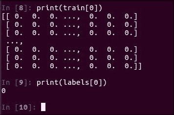

如果您已安装 Matplotlib，则现在是导入它的好地方。 在需要时，我们将使用`plt.ion()`自动调出数字：

```py
# If you have matplotlib installed
import matplotlib.pyplot as plt
plt.ion()
```

这是每种字体的一些字符示例图：

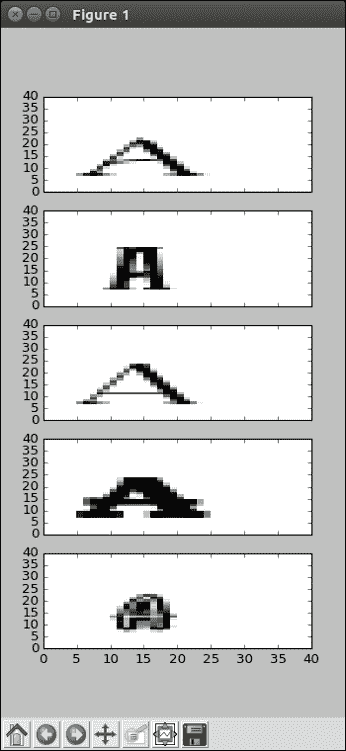

是的，他们很浮华。 在数据集中，每个图像都表示为像素暗度值的`36 x 36`二维矩阵。 0 值表示白色像素，而 255 表示黑色像素。 两者之间的一切都是灰色阴影。 这是在您自己的计算机上显示这些字体的代码：

```py
# Let's look at a subplot of one of A in each font
f, plts = plt.subplots(5, sharex=True)
c = 91
for i in range(5):
    plts[i].pcolor(train[c + i * 558],
                   cmap=plt.cm.gray_r)
```

如果您的图看起来确实很宽，则可以使用鼠标轻松调整窗口大小。 如果您只是以交互方式进行绘图，则在 Python 中提前调整其大小通常需要做很多工作。 鉴于我们还有许多其他标记的字体图像，我们的目标是确定图像属于哪种字体。 为了扩展数据集并避免过拟合，我们还在`36 x 36`区域内抖动了每个字符，为我们提供了 9 倍的数据点。

在使用较新的模型后重新回到这一点可能会有所帮助。 无论最终模型有多高级，记住原始数据都非常重要。

## 逻辑回归

如果您熟悉线性回归，那么您将了解逻辑回归。 基本上，我们将为图像中的每个像素分配一个权重，然后对这些像素进行加权求和（权重为`beta`，像素为`X`）。 这将为我们提供该图像是特定字体的分数。 每种字体都有自己的权重集，因为它们对像素的重视程度不同。 要将这些分数转换为适当的概率（由`Y`表示），我们将使用`softmax`函数将其总和强制在 0 到 1 之间，如下所示。 对于特定图像而言，无论最大概率是多少，我们都将其分类为关联的类别。

您可以在大多数统计建模教科书中阅读有关逻辑回归理论的更多信息。 这是它的公式：

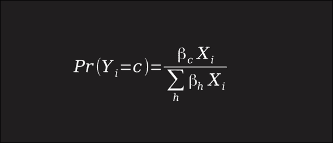

William H. Greene 的《计量经济学分析》（Pearson）于 2012 年出版，这是一本针对应用的很好的参考。

## 准备数据

在 TensorFlow 中实现逻辑回归非常容易，并将作为更复杂的机器学习算法的基础。 首先，我们需要将整数标签转换为单格式。 这意味着，不是将字体类标记为 2，而是将标签转换为`[0, 0, 1, 0, 0]`。 也就是说，我们将`1`放在第二个位置（注意，向上计数在计算机科学中很常见），而`0`则放在其他位置。 这是我们的`to_onehot`函数的代码：

```py
def to_onehot(labels,nclasses = 5):
    '''
    Convert labels to "one-hot" format.
    >>> a = [0,1,2,3]
    >>> to_onehot(a,5)
    array([[ 1.,  0.,  0.,  0.,  0.],
           [ 0.,  1.,  0.,  0.,  0.],
           [ 0.,  0.,  1.,  0.,  0.],
           [ 0.,  0.,  0.,  1.,  0.]])
    '''
    outlabels = np.zeros((len(labels),nclasses))
    for i,l in enumerate(labels):
        outlabels[i,l] = 1
    return outlabels
```

完成此操作后，我们可以继续调用该函数：

```py
onehot = to_onehot(labels)
```

对于像素，在这种情况下，我们实际上并不需要矩阵，因此我们将`36 x 36`的数字展平为长度为 1,296 的一维向量，但这会在以后出现。 另外，回想一下，我们已经重新调整了 0-255 的像素值，使其介于 0 和 1 之间。

好的，我们的最后准备是将数据集分为训练和验证集。 这将有助于我们稍后解决过拟合问题。 训练集将帮助我们确定逻辑回归模型中的权重，而验证集将仅用于确认这些权重在新数据上是否合理：

```py
# Split data into training and validation
indices = np.random.permutation(train.shape[0])
valid_cnt = int(train.shape[0] * 0.1)
test_idx, training_idx = indices[:valid_cnt],\
                         indices[valid_cnt:]
test, train = train[test_idx,:],\
              train[training_idx,:]
onehot_test, onehot_train = onehot[test_idx,:],\
                        onehot[training_idx,:]
```

## 建立 TensorFlow 模型

好的，让我们通过创建一个交互式会话来开始 TensorFlow 代码：

```py
sess = tf.InteractiveSession()
```

这样，我们就在 TensorFlow 中开始了我们的第一个模型。

我们将为`x`使用占位符变量，该变量代表我们的输入图像。 这只是告诉 TensorFlow 我们稍后将通过`feed_dict`为该节点提供值：

```py
# These will be inputs
## Input pixels, flattened
x = tf.placeholder("float", [None, 1296])
```

另外，请注意，我们可以指定此张量的形状，在这里我们将`None`用作大小之一。 `None`的大小允许我们立即将任意数量的数据点发送到算法中以进行批量。 同样，我们将使用变量`y_`来保存我们已知的标签，以便稍后进行训练：

```py
## Known labels
y_ = tf.placeholder("float", [None,5])
```

要执行逻辑回归，我们需要一组权重（`W`）。 实际上，五个字体类别中的每一个都需要 1,296 的权重，这将为我们提供形状。 请注意，我们还希望为每个类别添加一个额外的权重作为偏差（`b`）。 这与添加始终为`1`值的额外输入变量相同：

```py
# Variables
W = tf.Variable(tf.zeros([1296,5]))
b = tf.Variable(tf.zeros([5]))
```

随着所有这些 TensorFlow 变量浮动，我们需要确保对其进行初始化。 现在给他们打电话：

```py
# Just initialize
sess.run(tf.global_variables_initializer())
```

做得好！ 您已经准备好一切。 现在，您可以实现`softmax`公式来计算概率。 由于我们非常仔细地设置权重和输入，因此 TensorFlow 只需调用`tf.matmul`和`tf.nn.softmax`就可以轻松完成此任务：

```py
# Define model
y = tf.nn.softmax(tf.matmul(x,W) + b)
```

而已！ 您已经在 TensorFlow 中实现了整个机器学习分类器。辛苦了。但是，我们从哪里获得权重的值？ 让我们看一下使用 TensorFlow 训练模型。

# 逻辑回归训练

首先，您将了解我们的机器学习分类器的损失函数，并在 TensorFlow 中实现它。 然后，我们将通过求值正确的 TensorFlow 节点来快速训练模型。 最后，我们将验证我们的模型是否合理准确，权重是否合理。

## 定义损失函数

优化我们的模型实际上意味着最大程度地减少我们的误差。 使用我们的标签，可以很容易地将它们与模型预测的类概率进行比较。 类别`cross_entropy`函数是测量此函数的正式方法。 尽管确切的统计信息超出了本课程的范围，但是您可以将其视为对模型的惩罚，以期获得更不准确的预测。 为了进行计算，我们将单热的实数标签与预测概率的自然对数相乘，然后将这些值相加并取反。 为方便起见，TensorFlow 已经包含此函数为`tf.nn.softmax_cross_entropy_with_logits()`，我们可以这样称呼它：

```py
# Climb on cross-entropy
cross_entropy = tf.reduce_mean(
        tf.nn.softmax_cross_entropy_with_logits(
        logits = y + 1e-50, labels = y_))
```

请注意，我们在此处添加了一个较小的`1e-50`误差值，以避免数值不稳定问题。

## 训练模型

TensorFlow 的便利之处在于它提供了内置的优化器，以利用我们刚刚编写的损失函数。 梯度下降是一种常见的选择，它将使我们的权重逐渐趋于更好。 这是将更新我们权重的节点：

```py
# How we train
train_step = tf.train.GradientDescentOptimizer(
                0.02).minimize(cross_entropy)
```

在我们实际开始训练之前，我们应该指定一些其他节点来评估模型的表现：

```py
# Define accuracy
correct_prediction = tf.equal(tf.argmax(y,1),
                     tf.argmax(y_,1))
accuracy = tf.reduce_mean(tf.cast(
           correct_prediction, "float"))
```

如果我们的模型将最高概率分配给正确的类别，则`correct_prediction`节点为`1`，否则为`0`。 `accuracy`变量对可用数据的这些预测取平均值，从而使我们对模型的执行情况有一个整体认识。

在进行机器学习训练时，我们经常希望多次使用同一数据点，以挤出所有信息。 每次遍历整个训练数据都称为一个周期。 在这里，我们将每 10 个时间段同时保存训练和验证准确率：

```py
# Actually train
epochs = 1000
train_acc = np.zeros(epochs//10)
test_acc = np.zeros(epochs//10)
for i in tqdm(range(epochs)):
    # Record summary data, and the accuracy
    if i % 10 == 0:
        # Check accuracy on train set
        A = accuracy.eval(feed_dict={
            x: train.reshape([-1,1296]),
            y_: onehot_train})
        train_acc[i//10] = A
        # And now the validation set
        A = accuracy.eval(feed_dict={
            x: test.reshape([-1,1296]),
            y_: onehot_test})
        test_acc[i//10] = A
    train_step.run(feed_dict={
        x: train.reshape([-1,1296]),
        y_: onehot_train})
```

请注意，我们使用`feed_dict`传递不同类型的数据以获得不同的输出值。 最后，`train_step.run`每次迭代都会更新模型。 在典型的计算机上，这只需几分钟，如果使用 GPU，则要少得多，而在功率不足的计算机上则要花更多时间。

您刚刚使用 TensorFlow 训练了模型; 真棒！

## 评估模型准确率

在 1,000 个周期之后，让我们看一下模型。 如果您安装了 Matplotlib，则可以在绘图中查看精度； 如果没有，您仍然可以查看电话号码。 对于最终结果，请使用以下代码：

```py
# Notice that accuracy flattens out
print(train_acc[-1])
print(test_acc[-1])
```

如果您确实安装了 Matplotlib，则可以使用以下代码显示图：

```py
# Plot the accuracy curves
plt.figure(figsize=(6,6))
plt.plot(train_acc,'bo')
plt.plot(test_acc,'rx')
```

您应该看到类似下面的图（请注意，我们使用了一些随机初始化，因此可能并不完全相同）：

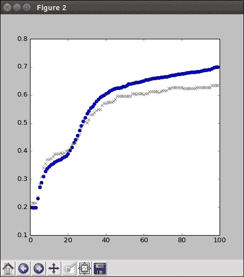

验证精度似乎在经过约 400-500 次迭代后趋于平稳； 除此之外，我们的模型可能过拟合或没有学到更多。 同样，即使最终精度大约是 40%，看起来也很差，但请记住，对于五个类别，完全随机的猜测将仅具有 20% 的精度。 有了这个有限的数据集，简单的模型就可以做到。

查看计算出的权重通常也很有帮助。 这些可以为您提供有关模型认为重要的线索。 让我们按给定类的像素位置绘制它们：

```py
# Look at a subplot of the weights for each font
f, plts = plt.subplots(5, sharex=True)
for i in range(5):
    plts[i].pcolor(W.eval()[:,i].reshape([36,36]))
```

这应该给您类似于以下的结果（同样，如果图显示得很宽，则可以挤压窗口大小以使其平方）：

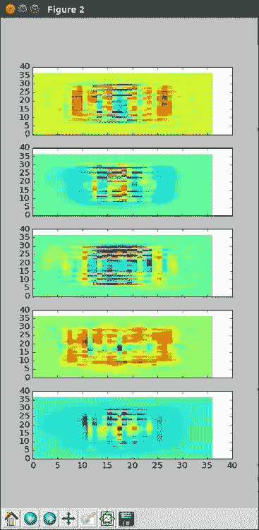

我们可以看到，在某些模型中，靠近内部的权重很重要，而外部的权重基本上为零。 这是有道理的，因为没有字体字符到达图像的角落。

同样，请注意，由于随机初始化的影响，最终结果可能看起来有些不同。 随时可以尝试并更改模型的参数； 这就是您学习新事物的方式。

## 总结

在本章中，我们在可以使用的机器上安装了 TensorFlow。 经过一些基本计算的小步骤，我们跳入了机器学习问题，仅通过逻辑回归和几行 TensorFlow 代码就成功构建了一个体面的模型。

在下一章中，我们将看到 TensorFlow 在深度神经网络方面的优势。

