# 二、深度神经网络

在上一章中，我们研究了简单的 TensorFlow 操作以及如何在字体分类问题上使用逻辑回归。 在本章中，我们将深入探讨一种最流行和成功的机器学习方法-神经网络。 使用 TensorFlow，我们将构建简单和深度的神经网络，以改善字体分类问题的模型。 在这里，我们将实践神经网络的基础。 我们还将使用 TensorFlow 构建和训练我们的第一个神经网络。 然后，我们将进入具有神经元隐藏层的神经网络，并完全理解它。 完成后，您将更好地掌握以下主题：

*   基本神经网络
*   单隐藏层模型
*   单隐藏层说明
*   多隐藏层模型
*   多隐藏层的结果

在第一部分中，我们将回顾神经网络的基础。 您将学习转换输入数据的常见方法，了解神经网络如何将这些转换联系在一起，最后，如何在 TensorFlow 中实现单个神经元。

# 基本神经网络

我们的逻辑回归模型运作良好，但本质上是线性的。 将像素的强度加倍会使像素对得分的贡献增加一倍，但我们可能只真正关心像素是否在某个阈值之上或将较小的权重放在较小的值上。 线性可能无法捕获问题的所有细微差别。 解决此问题的一种方法是使用非线性函数转换输入。 让我们看一下 TensorFlow 中的一个简单示例。

首先，请确保加载所需的模块（`tensorflow`，`numpy`和`math`）并启动交互式会话：

```py
import tensorflow as tf
import numpy as np
import math

sess = tf.InteractiveSession()
```

在下面的示例中，我们创建了三个五长向量的正常随机数，这些向量被截断以防止它们过于极端，中心不同：

```py
x1 = tf.Variable(tf.truncated_normal([5],
                 mean=3, stddev=1./math.sqrt(5)))
x2 = tf.Variable(tf.truncated_normal([5],
                 mean=-1, stddev=1./math.sqrt(5)))
x3 = tf.Variable(tf.truncated_normal([5],
                 mean=0, stddev=1./math.sqrt(5)))

sess.run(tf.global_variables_initializer())
```

### 注意

请注意，由于这是随机的，因此您的值可能会有所不同，但这很好。

常见的转换是对输入求平方。 这样做会使更大的值变得更加极端，当然也使所有事情都变得积极起来：

```py
sqx2 = x2 * x2
print(x2.eval())
print(sqx2.eval())
```

您可以在以下屏幕截图中看到结果：

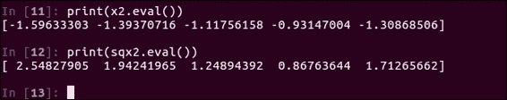

## 对数函数

相反，如果您需要在较小的值中有更多细微差别，则可以尝试采用输入的自然对数或任何基本对数：

```py
logx1 = tf.log(x1)
print(x1.eval())
print(logx1.eval())
```

请参考以下屏幕截图，请注意，较大的值往往会挤在一起，而较小的值则散布得多：

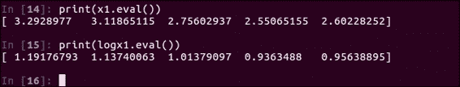

但是，对数不能处理负输入，并且您越接近零，小输入就变得越负。 因此，请注意对数。 最后，是 Sigmoid 变换。

## sigmoid 函数

不必担心公式，只需知道正负两个极值分别被压缩为加一或零，而接近零的输入就接近二分之一：

```py
sigx3 = tf.sigmoid(x3)
print(x3.eval())
print(sigx3.eval())
```

在这里，您将看到一个接近一半的示例。 它从四分之一开始，到现在将近一半：

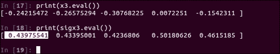

在机器学习中，我们通常将这些转换称为激活函数。 我们通常将输入的加权总和组合到其中。 当您考虑输入，权重和激活函数时，就将其称为神经元，因为它是受生物神经元启发的。

真正的神经元如何在物理大脑中工作的细节不在本书的讨论范围之内。 如果您对此感兴趣，则神经生物学文章可能包含更多内容，或者您​​可以参考 Gordon M. Shepherd 的《神经元学说》作为近期参考。 让我们看一下 TensorFlow 中的一个简单示例：

```py
w1 = tf.constant(0.1)
w2 = tf.constant(0.2)
sess.run(tf.global_variables_initializer())
```

首先，只需创建一些常量`w1`和`w2`即可。 我们将`x1`乘以`w1`，将`x2`乘以`w2`，然后将这些中间值相加，最后将结果通过`tf.sigmoid`的`sigmoid`激活函数进行处理。 查看以下屏幕快照中显示的结果：

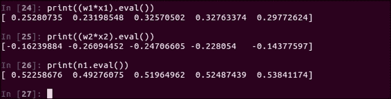

同样，现在不必担心确切的公式，您可以拥有各种不同的激活函数。 请注意，这是您迈向自己的神经网络的第一步。

那么，我们如何从单个神经元到整个网络？ 简单！ 一个神经元的输入仅成为网络下一层中另一神经元的输入。

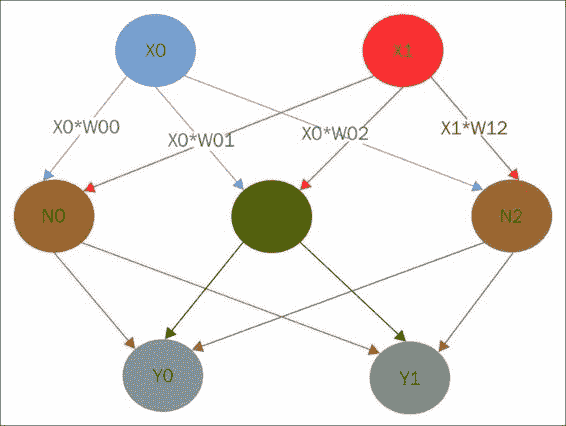

在上图中，我们有一个简单的网络，其中有两个输入`X0`和`X1`，两个输出`Y0`和`Y1`，中间有三个神经元。 `X0`中的值被发送到每个`N`神经元，但是权重不同，该权重乘以与每个相关的`X0`。 `X1`也发送到每个神经元，并具有自己的一组权重。 对于每个神经元，我们计算输入的加权总和，将其通过激活函数，然后产生中间输出。 现在，我们做同样的事情，但是将神经元的输出视为`Y`的输入。 注意，通过对输入加权和进行非线性激活，我们实际上只是为最终模型计算了一组新的特征。

现在您已经了解了 TensorFlow 中非线性转换的基础以及什么是神经网络。 好吧，它们可能不会让您读懂思想，它们对于深度学习至关重要。 在下一节中，我们将使用简单的神经网络来改进分类算法。

# 单隐藏层模型

在这里，我们将实践神经网络的基础知识。 我们将逻辑回归 TenserFlow 代码改编为神经元的单个隐藏层。 然后，您将学习反向传播背后的思想以计算权重，即训练网络。 最后，您将在 TensorFlow 中训练您的第一个真正的神经网络。

本部分的 TensorFlow 代码应该看起来很熟悉。 它只是逻辑回归代码的略微演变版本。 让我们看看如何添加神经元的隐藏层，以计算输入像素的非线性组合。

您应该从全新的 Python 会话开始，执行代码以读入，并按照逻辑模型中的步骤设置数据。 相同的代码，只是复制到新文件中：

```py
import tensorflow as tf
import numpy as np
import math
from tqdm import tqdm
%autoindent
try:
    from tqdm import tqdm
except ImportError:
    def tqdm(x, *args, **kwargs):
        return x
```

您总是可以回到前面的部分，并提醒自己该代码的作用； 直到`num_hidden`变量的所有内容都可以使您快速入门。

## 探索单隐藏层模型

现在，让我们逐步介绍单个隐藏层模型：

1.  首先，让我们指定`num_hidden = 128`想要多少个神经元； 最终，这实际上是将多少个非线性组合传递给逻辑对数。
2.  为了适应这一点，我们还需要更新`W1`和`b1`权重张量的形状。 他们现在正在馈送我们隐藏的神经元，因此需要匹配形状：

    ```py
    W1 = tf.Variable(tf.truncated_normal([1296, num_hidden],
                                       stddev=1./math.sqrt(1296)))
    b1 = tf.Variable(tf.constant(0.1,shape=[num_hidden]))
    ```

3.  我们计算加权和的激活函数的方法是使用单行`h1`。 这是将我们的输入像素乘以每个神经元各自的权重：

    ```py
    h1 = tf.sigmoid(tf.matmul(x,W1) + b1)
    ```

    添加神经元偏差项，最后通过`sigmoid`激活函数进行设置； 此时，我们有 128 个中间值：

    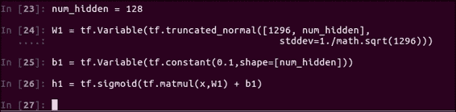

4.  现在，这只是对您友好的逻辑回归； 您已经知道该怎么办。 这些新计算的 128 个特征需要它们自己的权重和偏置集来计算输出类的分数，分别为`W2`和`b2`。 注意形状如何与神经元的形状 128 匹配，并且输出类的数量为 5：

    ```py
    W2 = tf.Variable(tf.truncated_normal([num_hidden, 5],
                                          stddev=1./math.sqrt(5)))
    b2 = tf.Variable(tf.constant(0.1,shape=[5]))
    sess.run(tf.global_variables_initializer())
    ```

    在所有这些权重中，我们使用此奇怪的截断普通调用对其进行初始化。 借助神经网络，我们希望获得良好的初始值分布，以便我们的权重可以攀升至有意义的值，而不是仅仅归零。

5.  截断正态具有给定标准偏差的正态分布中的随机值，该研究标准按输入数量进行缩放，但抛出的值太极端，因此被截断了。 定义好权重和神经元后，我们将像以前一样设置最终的`softmax`模型，除了需要注意使用 128 个神经元作为输入`h1`以及相关的权重和偏差`W2`和`b2`：

    ```py
    y = tf.nn.softmax(tf.matmul(h1,W2) + b2)
    ```

## 反向传播

训练神经网络和许多其他机器学习模型权重的关键称为反向传播。

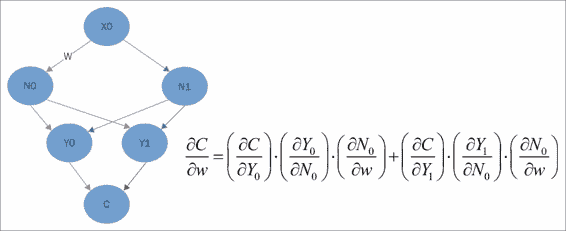

完整的推导超出了本书的范围，但是让我们直观地进行研究。 当您在空中训练逻辑回归之类的模型并且训练集直接来自选择不当的权重时，您可以看到应该调整哪些权重以及应该调整多少权重并相应地更改它们。

从形式上讲，TensorFlow 通过计算空气相对于权重的导数并将权重调整为该数值的一小部分来实现此目的。 反向传播实际上是同一过程的扩展。

您从最底层的输出或成本函数层开始，计算导数，然后使用它们来计算与上一层神经元相关的导数。 通过将从成本到权重的路径上的导数乘积相加，我们可以计算相对于要调整的权重的成本的适当偏导数。 上图中显示的公式仅说明了红色箭头显示的内容。 如果这看起来很复杂，请不要担心。

TensorFlow 使用优化器在后台为您处理。 由于我们使用 TensorFlow 精心指定了模型来训练模型，因此几乎与之前完全相同，因此我们将在此处使用相同的代码：

```py
epochs = 5000
train_acc = np.zeros(epochs//10)
test_acc = np.zeros(epochs//10)
for i in tqdm(range(epochs), ascii=True):
    if i % 10 == 0: # Record summary data, and the accuracy
        # Check accuracy on train set
        A = accuracy.eval(feed_dict={x: train.reshape([-1,1296]), y_: onehot_train})
        train_acc[i//10] = A

        # And now the validation set
        A = accuracy.eval(feed_dict={x: test.reshape([-1,1296]), y_: onehot_test})
        test_acc[i//10] = A
    train_step.run(feed_dict={x: train.reshape([-1,1296]), y_: onehot_train})
```

需要注意的一件事是，因为我们有这些隐藏的神经元，所以有更多的权重可以拟合模型。 这意味着我们的模型将需要更长的运行时间，并且必须花费更多的迭代时间才能进行训练。 这次我们通过`5000`历时运行它：

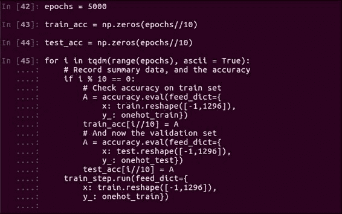

该模型可能比以前的模型花费更长的时间，可能是前一个模型的四倍。 因此，您可能需要几分钟到 10 分钟的时间，具体取决于您的计算机。 现在，通过模型训练，我们将在稍后查看验证准确率。

# 单隐藏层的说明

在本节中，我们将仔细研究构建的模型。 首先，我们将验证模型的整体准确率，然后查看模型出了哪些问题。 最后，我们将可视化与多个神经元相关的权重，以查看它们在寻找什么：

```py
plt.figure(figsize=(6, 6))
plt.plot(train_acc,'bo')
plt.plot(test_acc,'rx')
```

确保您已经按照上一节中的步骤训练了模型，如果没有，您可能要在这里停下来并首先进行操作。 由于我们每隔 10 个训练周期就评估模型的准确率并保存结果，因此现在很容易探索模型的演变方式。

使用 Matplotlib，我们可以在同一张图上绘制训练精度（蓝色点）和测试精度（红色点）：

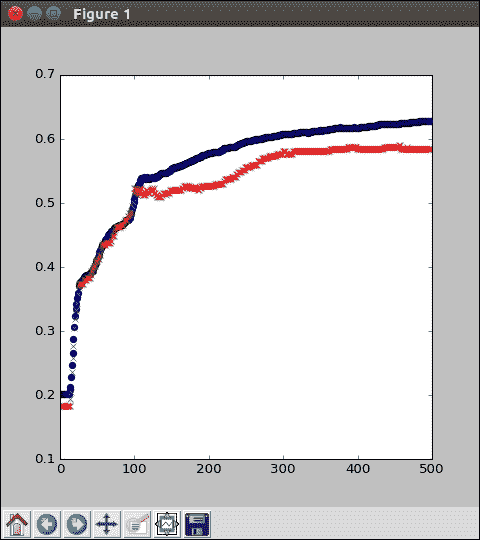

同样，如果您没有 Matplotlib，那就没关系。 您可以只查看数组值本身。 请注意，训练精度（蓝色）通常比测试精度（红色）好一点。 这并不奇怪，因为测试图像对于模型来说是全新的，并且可能包含以前看不见的特征。 另外，观察精度通常会攀升到更多的周期，然后逐渐上升，然后逐渐上升。 我们的模型在这里达到约 60% 的准确率； 并非完美，但对简单逻辑回归进行了改进。

要查看我们的模型在哪里混淆，创建混淆矩阵会很有帮助。 也就是说，我们将寻找一个可以说的实际绘图类别。 该模型将其分类为什么？ 形式上是`5x5`矩阵。 对于每个测试图像，如果图像实际上是类别`i`和模型预测类别`j`，则我们增加值和位置`i j`。 请注意，当模型正确时，则为`i = j`。

一个好的模型在对角线上将具有很大的值，而在其他地方则没有很多。 通过这种类型的分析，很容易看出两个类是否经常彼此混淆，或者模型很少选择某些类。

在以下示例中，我们通过求值`y`（类概率）来创建预测类：

```py
pred = np.argmax(y.eval(feed_dict={x: 
     test.reshape([-1,1296]), y_: onehot_test}), axis = 1)
conf = np.zeros([5,5])
for p,t in zip(pred,np.argmax(onehot_test,axis=1)):
    conf[t,p] += 1

plt.matshow(conf)
plt.colorbar()
```

`np.argmax`函数提取概率最大的位置。 同样，为了确定实际的类别，我们使用`np.argmax`撤消一次热编码。 创建混乱矩阵始于全零数组，然后逐步遍历所有填充的测试数据。Matplotlib 让我们看一下彩色图像，但打印与会者的效果几乎相同：

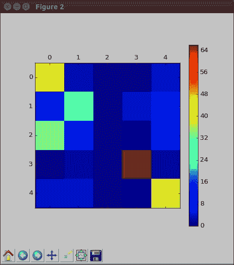

在前面的输出中，我们看到模型通常做得不错，只是它很少预测类`2`。 由于初始的随机性，您的确切结果可能看起来有些不同。

## 了解模型的权重

正如我们查看逻辑回归模型的权重一样，我们可以监视此模型的权重：

```py
plt.figure(figsize=(6, 6))
f, plts = plt.subplots(4,8, sharex=True)
for i in range(32):
    plts[i//8, i%8].pcolormesh(W1.eval()[:,i].reshape([36,36]))
```

但是，现在我们有 128 个神经元，每个神经元的权重都来自输入像素，权重为`36x36`。 让我们看看其中的一些，以了解他们的发现。 同样，如果您没有 Matplotlib，则可以简单地打印出数组以查看相同的行为。 在这里，我们将研究 128 个神经元中的 32 个。 因此，让我们将子图的格式设置为四行八列。 现在，我们逐步求值每个神经元的权重，并将其重塑为图像大小。 双斜杠（`//`）使用整数除法将图像放入适当的行，而百分号（`%`）使用余数（实际上是模块化算术）来选择列。

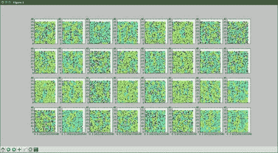

视觉上，在前面的输出中，您可以看到一些形状突出。 与它们的权重模式相比，某些神经元或多或少具有圆形形状。 其他人看起来很随意，但可能会选择我们不容易理解的特征。 我们也可以尝试可视化输出层的权重，但是这些不再直观。 我们称其为神经网络。 现在，输出逻辑回归是 128 个输入值，以及用于计算 5 个分数的权重。 不再有图像结构，因为每个像素都进入了隐藏层的每个神经元。 现在您知道了如何评估和解释神经网络结果。 做得好！

# 多隐藏层模型

在本节中，我们将向您展示如何使用其他隐藏层构建更复杂的模型。 我们将单层隐藏模型改编为称为深度神经网络的多层模型。 然后，我们将讨论选择要使用的神经元和层数。 最后，我们将耐心地训练模型本身，因为这可能需要一段时间才能计算出来。

还记得我们向逻辑回归模型添加神经元的隐藏层吗？ 好了，我们可以再做一次，在我们的单个隐藏层模型中添加另一层。 一旦您拥有一层以上的神经元，我们就将其称为深度神经网络。 但是，您以前所学的一切都可以立即应用。 与本章前面的部分一样，您应该进行一个全新的 Python 会话并执行本部分代码文件中直到`num_hidden1`的代码。 然后，乐趣开始了。

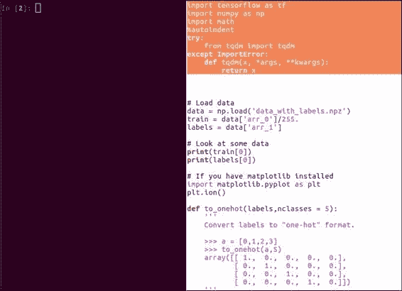

## 探索多隐藏层模型

首先，将旧的`num_hidden`更改为`num_hidden1`，以指示第一个隐藏层上的神经元数量：

```py
# Hidden layer 1
num_hidden1 = 128
```

确保更改变量，同时定义权重和偏差变量。 现在，我们将插入第二个隐藏层：

```py
W1 = tf.Variable(tf.truncated_normal([1296,num_hidden1],
                               stddev=1./math.sqrt(1296)))
b1 = tf.Variable(tf.constant(0.1,shape=[num_hidden1]))
h1 = tf.sigmoid(tf.matmul(x,W1) + b1)
```

这次使用带有`32`神经元的神经元。 请注意，权重的形状必须如何解释来自上一层的 128 个中间输出中的每一个进入当前层的 32 个输入或神经元，但是我们初始化权重和偏差的方式基本上相同：

```py
# Hidden Layer 2
num_hidden2 = 32
W2 = tf.Variable(tf.truncated_normal([num_hidden1,
            num_hidden2],stddev=2./math.sqrt(num_hidden1)))
b2 = tf.Variable(tf.constant(0.2,shape=[num_hidden2]))
h2 = tf.sigmoid(tf.matmul(h1,W2) + b2)
```

如您在前面的代码中所见，我们像以前一样使用`sigmoid`函数创建`h2`输出，并使用矩阵乘法，加法和函数调用。

对于输出逻辑回归层，我们只需要更新变量名称：

```py
# Output Layer
W3 = tf.Variable(tf.truncated_normal([num_hidden2, 5],
                                   stddev=1./math.sqrt(5)))
b3 = tf.Variable(tf.constant(0.1,shape=[5]))
```

现在这是第三组权重，当然，此形状必须与前面的隐藏层的输出匹配，因此`32 x 5`：

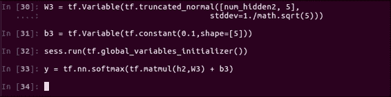

不要忘记使用`h2`，`W3`和`b3`变量更新`y`模型函数。 您不想只使用旧模型就更新所有代码。

您可能想知道我们如何决定第一层的 128 个神经元和第二层的 32 个神经元。 事实是，为网络确定合适的尺寸和形状可能是一个具有挑战性的问题。 尽管计算可能会很昂贵，但是反复试验是开发模型的一种方法。 通常，您可能会从旧模型开始并从那里开始工作。 在这里，我们从 128 个神经元的单个隐藏层开始，然后尝试在其下添加一个新层。 我们要计算一些特征以区分五类，因此在选择神经元数量时应牢记这一点。

通常，最好从小处着手，逐步发展到解释数据的最小模型。 如果在顶层具有 128 个神经元而在下一层具有 8 个神经元的模型的效果较差，则可能表明我们需要为最后一层提供更多特征，并应添加更多而不是更少的神经元。

尝试将最后一层中的神经元数量加倍，当然，最好回到较早的层并调整那里的神经元数量。 同样，您可以更改优化器的学习率，从而改变每一步调整权重的程度，甚至更改用于优化的函数。

### 注意

设置所有这些值称为超参数优化，这是机器学习研究中的热门话题。

请注意，我们实际上是从最简单的模型，逻辑回归开始，然后慢慢添加新的功能和结构。 如果一个简单的模型运行良好，那么甚至没有必要花时间在更高级的东西上。

现在已经指定了我们的模型，让我们实际进行训练：

```py
# Climb on cross-entropy
cross_entropy = tf.reduce_mean(
     tf.nn.softmax_cross_entropy_with_logits(logits= y + 1e-50, labels= y_))

# How we train
train_step = tf.train.GradientDescentOptimizer(0.01).minimize(cross_entropy)

# Define accuracy
correct_prediction = tf.equal(tf.argmax(y,1),tf.argmax(y_,1))
accuracy=tf.reduce_mean(tf.cast(correct_prediction, "float"))
```

同样，我们需要在 T​​ensorFlow 图中重新定义我们的训练节点，但是这些与以前完全相同。 请注意，由于我们的第一个隐藏层现在挂接到神经元的另一层，因此我们需要计算更多的权重。 以下是实际的训练代码：

```py
epochs = 25000
train_acc = np.zeros(epochs//10)
test_acc = np.zeros(epochs//10)
for i in tqdm(range(epochs)):
    # Record summary data, and the accuracy
    if i % 10 == 0:
        # Check accuracy on train set
        A = accuracy.eval(feed_dict={
            x: train.reshape([-1,1296]),
            y_: onehot_train})
        train_acc[i//10] = A
        # And now the validation set
        A = accuracy.eval(feed_dict={
            x: test.reshape([-1,1296]),
            y_: onehot_test})
        test_acc[i//10] = A
    train_step.run(feed_dict={
        x: train.reshape([-1,1296]),
        y_: onehot_train})
```

以前，我们有 128 乘以 5 的权重，但是现在我们有 128 乘以 32 的权重-这是该层的六倍，这是从像素到神经元第一层的初始权重之上。 深度神经网络的一个缺点是它们可能需要一段时间才能训练。 在这里，我们将运行`25000`个周期，以确保权重收敛：

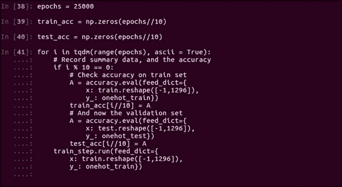

这可能需要一个小时或更长时间，具体取决于您的计算机和 GPU。 尽管这看起来似乎过多，但专业的机器学习研究人员通常会训练模型长达两个星期。 您可能会学得很快，但是计算机需要一些时间。

在本节中，我们使用 TensorFlow 构建并训练了一个真正的深度神经网络。 许多专业的机器学习模型没有您已经编写的复杂。

# 多隐藏层的结果

现在，我们将研究深度神经网络内部的情况。 首先，我们将验证模型的准确率。 然后，我们将可视化并研究像素权重。 最后，我们还将查看输出权重。

训练完您的深度神经网络后，让我们看一下模型的准确率。 我们将以与单隐藏层模型相同的方式进行操作。 这次的唯一区别是，从更多的周期开始，我们保存了更多的训练和测试准确率样本。

和往常一样，如果您没有 Matplotlib，请不要担心。 打印数组的一部分很好。

## 了解多隐藏层的图

执行以下代码以查看结果：

```py
# Plot the accuracy curves
plt.figure(figsize=(6,6))
plt.plot(train_acc,'bo')
plt.plot(test_acc,'rx')
```

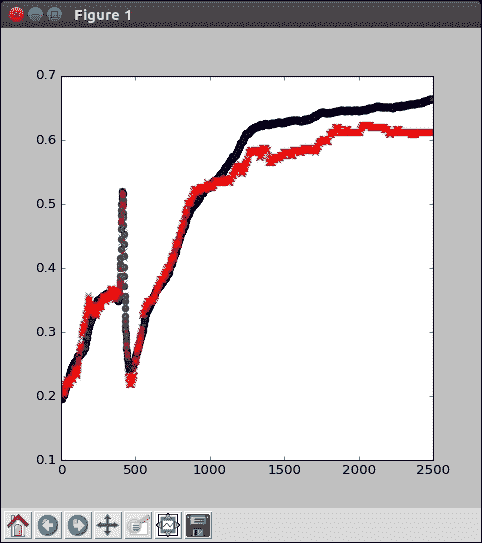

从前面的输出图中，我们可以达到约 68% 的训练精度，也许还有 63% 的验证精度。 这还不错，但是确实留出了一些改进的空间。

让我们花点时间看一下准确率在许多周期如何增长。 当然，它起步非常糟糕，并且存在一些最初的麻烦，但是权重是随机的，并且在那个时候仍在学习，并且在最初的数千个周期中它很快得到了改善。 虽然可能会暂时卡在局部最大值中，但通常会爬出并最终减慢其重音。 请注意，它仍然可以很好地进入训练阶段。 只是到了尽头，模型才可能达到其最大容量。 根据随机初始化，您的曲线可能看起来有些不同，但这没关系； 这是您的模型，非常好。

要查看我们的模型在哪里出现问题，让我们看一下混淆矩阵：

```py
pred = np.argmax(y.eval(feed_dict={x:
    test.reshape([-1,1296]), y_: onehot_test}), axis = 1)
conf = np.zeros([5,5])
for p,t in zip(pred,np.argmax(onehot_test,axis=1)):
    conf[t,p] += 1

plt.matshow(conf)
plt.colorbar()
```

同样，这与我们用于单个隐藏层模型的过程完全相同，只是在更高级的方面：

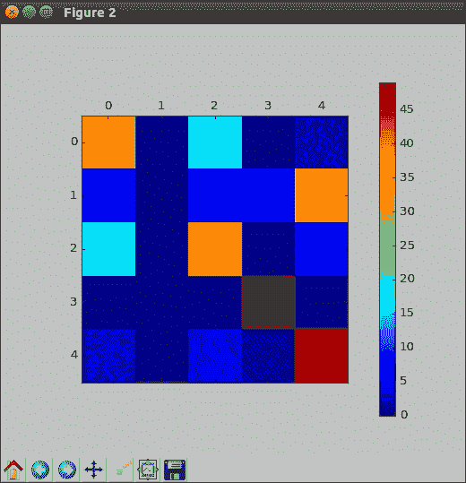

对此进行绘图，就像在前面的输出中一样，我们看到该模型总体上运行良好，但是仍然难以识别其中一个类，这次是`1`。 我们正在逐步取得进展。 验证准确率之后，让我们检查一下我们的第一层神经元，即 128 个人，发现了什么样的现象：

```py
# Let's look at a subplot of some weights
f, plts = plt.subplots(4,8, sharex=True)
for i in range(32):
    plts[i//8, i%8].matshow(W1.eval()[:,i].reshape([36,36]))
```

为了简单起见，我们仅查看前 32 个此类神经元。 使用与先前模型相同的代码，可以轻松地使用 Matplotlib 进行绘制或打印出来：

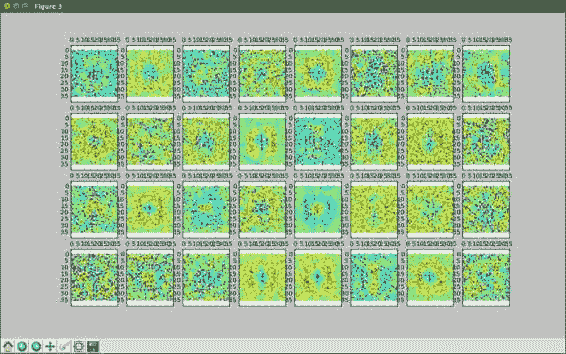

毫不奇怪，我们看到了许多与先前模型相同的函数。 尽管在这里，由于随机初始化，即使它们看起来像是同一类型的特征，它们也会位于不同的位置。 同样，您有一些环形神经元，具有非常条纹状特征的神经元，以及具有宽条纹状特征的另一个神经元。 就我们的神经网络而言，圆形和条纹形状是确定字体类别的良好成分。

尽管我们其他隐藏层中的权重不再具有图像的结构，但查看输出的权重可能会很有帮助。 这将告诉我们每个最终神经元对每个类别的贡献。 我们可以将其绘制为热力图，或使用`W3.eval`任意方式打印单个数组：

```py
# Examine the output weights
plt.matshow(W3.eval())
plt.colorbar()
```

因为我们仔细指定了`W3`，所以每一行将代表一个神经元，每一列将代表一个类：


从前面的输出图中我们可以看到，不同的神经元对某些类别的贡献要大于其他类别，这表明神经元正在计算的某些总体非线性特征与该特定字体类别有关。 也就是说，虽然这些神经元产生的值用于计算每种字体的分数，但非常重要且权重较大的一种字体的神经元可能与另一种字体几乎无关。 例如，对于`2`类，`N1`神经元的权重非常大，而对于所有其他类别，`N1`神经元的权重几乎为零。 该神经元具有什么计算特征，对于`2`类而言非常重要，但对于其他类别而言则没有那么重要。

# 总结

在本章中，我们使用 TensorFlow 进行了深度学习。 尽管我们从一个神经元隐藏层的简单模型开始，但是并不需要花很长时间就可以开发和训练用于字体分类问题的深度神经网络。

您了解了单层和多层隐藏层模型，并对其进行了详细了解。 您还将了解神经网络的不同类型，并使用 TensorFlow 构建和训练了我们的第一个神经网络。

在下一章中，我们将使用卷积神经网络（一种用于图像分类的强大工具）来证明我们的模型。

