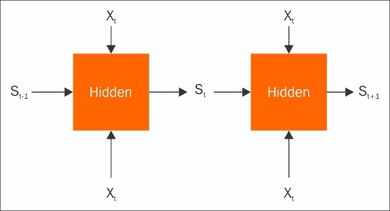
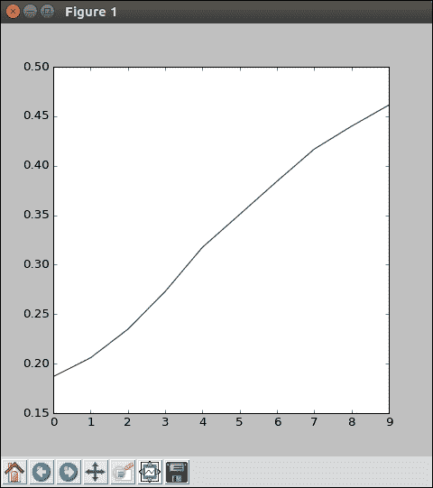

# 四、循环神经网络介绍

在上一章中，您了解了卷积网络。 现在，该介绍一种新型的模型和问题了-循环神经网络（RNN）。 在本章中，我们将解释 RNN 的工作原理，并在 TensorFlow 中实现一个。 我们的示例问题将是具有天气信息的简单季节预报器。 我们还将看一下`skflow`，它是 TensorFlow 的简化接口。 这将使我们能够快速重新实现旧的图像分类模型和新的 RNN。 在本章的最后，您将对以下概念有很好的理解：

*   探索 RNN
*   TensorFlow Learn
*   密集神经网络（DNN）

# 探索 RNN

在本节中，我们将探索 RNN。 一些背景信息将使我们开始工作，然后我们将探讨一个激发性的天气建模问题。 我们还将在 TensorFlow 中实现和训练 RNN。



在典型模型中，您要预测一些`X`输入特征和一些`Y`输出。 我们通常将不同的训练样本视为独立的观察结果。 因此，数据点 1 的特征不应影响数据点 2 的预测。 但是，如果我们的数据点相互关联怎么办？ 最常见的示例是每个数据点`Xt`代表在时间`t`收集的特征。 自然地假设时间`t`和时间`t+1`的特征对于时间`t+1`的预测都将很重要。 换句话说，历史很重要。

现在，在建模时，您可以只包含两倍的输入特征，将前一个时间步长添加到当前特征中，并计算两倍的输入权重。 但是，如果您正在努力构建神经网络来计算变换特征，那么可以在当前时间步网络中使用上一个时间步的中间特征就很好了。

RNN 正是这样做的。 像往常一样考虑您的输入`Xt`，但在某些状态下添加来自上一个时间步的`St-1`作为附加特征。 现在，您可以像往常一样计算权重以预测`Yt`，并产生一个新的内部状态`St`，以供下一步使用。 对于第一步，通常使用默认或零初始状态。 经典的 RNN 实际上就是这么简单，但是当今文学中有更高级的结构，例如门控循环单元和长短期存储电路。 这些不在本书的讨论范围之内，但是它们遵循相同的原理，并且通常适用于相同类型的问题。

## 模型权重

您可能想知道我们如何根据上一个时间步长计算所有这些相关性的权重。 计算梯度确实涉及到时间计算的递归，但不要担心，TensorFlow 处理乏味的东西，让我们进行建模：

```py
# read in data
filename = 'weather.npz'
data = np.load(filename)
daily = data['daily']
weekly = data['weekly']

num_weeks = len(weekly)
dates = np.array([datetime.datetime.strptime(str(int(d)),
                '%Y%m%d') for d in weekly[:,0]])
```

要使用 RNN，我们需要一个带有时间成分的数据建模问题。

字体分类问题在这里并不是很合适。 因此，让我们看一些天气数据。 `weather.npz`文件是几十年来来自美国一个城市的气象站数据的集合。 `daily`数组包含一年中每一天的测量值。 数据有六列，从日期开始。 接下来是降雨量，以英寸为单位测量当日的降雨量。 之后，出现两列降雪-第一列是当前地面上的实测雪，而第二列是当天的降雪，单位是英寸。 最后，我们有一些温度信息，以华氏度为单位的每日最高和最低每日温度。

我们将使用的`weekly`数组是每日信息的每周摘要。 我们将使用中间日期来表示一周，然后，我们将汇总一周中的所有降雨量。 但是，对于降雪，我们将平均降雪量，因为从一个寒冷的天气到第二天坐在地上的积雪都没有意义。 虽然降雪，但我们总共要一周，就像下雨一样。 最后，我们将平均一周的高温和低温。 现在您已经掌握了数据集，我们该如何处理？ 一个有趣的基于时间的建模问题是，尝试使用天气信息和前几周的历史来预测特定一周的季节。

在美国的北半球，6 月至 8 月的气温较高，而 12 月至 2 月的气温较低，两者之间有过渡。 春季通常是多雨的，冬季通常包括雪。 尽管一周的变化很大，但一周的历史应该可以提供一定的预测能力。

## 了解 RNN

首先，让我们从压缩的 NumPy 数组中读取数据。 如果您想探索自己的模型，`weather.npz`文件也包括每日数据。 `np.load`将两个数组都读入字典，并将每周设置为我们感兴趣的数据； `num_weeks`自然就是我们拥有多少个数据点，在这里，几十年的信息的值：

```py
num_weeks = len(weekly)
```

为了格式化星期，我们使用 Python `datetime.datetime`对象以年月日格式读取存储字符串：

```py
dates = np.array([datetime.datetime.strptime(str(int(d)),
                '%Y%m%d') for d in weekly[:,0]])
```

我们可以使用每周的日期来指定其季节。 对于此模型，因为我们正在查看天气数据，所以我们使用气象季节而不是普通的天文季节。 幸运的是，这很容易通过 Python 函数实现。 从`datetime`对象中获取月份，我们可以直接计算出该季节。 春季，零季节是 3 月至 5 月，夏季是 6 月至 8 月，秋天是 9 月至 11 月，最后是冬季 12 月至 2 月。 以下是简单的函数，它仅求值月份并实现该月份：

```py
def assign_season(date):
    ''' Assign season based on meteorological season.
        Spring - from Mar 1 to May 31
        Summer - from Jun 1 to Aug 31
        Autumn - from Sep 1 to Nov 30
        Winter - from Dec 1 to Feb 28 (Feb 29 in a leap year)
    '''
    month = date.month
    # spring = 0
    if 3 <= month < 6:
        season = 0
    # summer = 1
    elif 6 <= month < 9:
        season = 1
    # autumn = 2
    elif 9 <= month < 12:
        season = 2
    # winter = 3
    elif month == 12 or month < 3:
        season = 3
    return season
```

让我们注意一下，我们有四个季节和五个输入变量，例如历史状态中的 11 个值：

```py
# There are 4 seasons
num_classes = 4

# and 5 variables
num_inputs = 5

# And a state of 11 numbers
state_size = 11
```

现在您可以计算标签了：

```py
labels = np.zeros([num_weeks,num_classes])
# read and convert to one-hot
for i,d in enumerate(dates):
    labels[i,assign_season(d)] = 1
```

通过制作全零数组并在分配季节的位置放置一个全零，我们直接以一键式格式执行此操作。

凉！ 您仅用几个命令就总结了几十年的时间。

由于这些输入特征在非常不同的尺度上测量非常不同的事物，即降雨，降雪和温度，因此我们应注意将它们全部置于相同的尺度上。 在下面的代码中，我们抓住了输入特征，当然跳过了日期列，并减去平均值以将所有特征居中为零：

```py
# extract and scale training data
train = weekly[:,1:]
train = train - np.average(train,axis=0)
train = train / train.std(axis=0)
```

然后，我们将每个特征除以其标准偏差来缩放。 这说明温度范围大约为 0 到 100，而降雨量仅在大约 0 到 10 之间变化。数据准备工作不错！ 它并不总是很有趣，但这是机器学习和 TensorFlow 的关键部分。

现在进入 TensorFlow 模型：

```py
# These will be inputs
x = tf.placeholder("float", [None, num_inputs])
# TF likes a funky input to RNN
x_ = tf.reshape(x, [1, num_weeks, num_inputs])
```

我们使用占位符变量正常输入数据，但是随后您会看到将整个数据集奇怪地重塑为一个大张量。 不用担心，这是因为从技术上讲，我们有一个漫长而连续的观测序列。 `y_`变量只是我们的输出：

```py
y_ = tf.placeholder("float", [None,num_classes])
```

我们将计算每个季节每周的概率。

`cell`变量是循环神经网络的关键：

```py
cell = tf.nn.rnn_cell.BasicRNNCell(state_size)
```

这告诉 TensorFlow 当前时间步长如何取决于前一个时间步长。 在这种情况下，我们将使用基本的 RNN 单元。 因此，我们一次只回首一周。 假设它具有状态大小或 11 个值。 随意尝试使用更多奇异的单元和不同的状态大小。

要使用该单元格，我们将使用`tf.nn.dynamic_rnn`：

```py
outputs, states = tf.nn.dynamic_rnn(cell,x_,
            dtype=tf.nn.dtypes.float32, initial_state=None)
```

这可以智能地处理递归，而不是简单地将所有时间步长展开成一个巨大的计算图。 因为我们在一个序列中有成千上万的观测值，所以这对于获得合理的速度至关重要。 在单元格之后，我们指定输入`x_`，然后指定`dtype`以使用 32 位将十进制数字存储在浮点数中，然后指定空的`initial_state`。 我们使用此输出建立一个简单的模型。 从这一点开始，该模型几乎完全符合您对任何神经网络的期望：

我们将 RNN 单元的输出，一些权重相乘，并添加一个偏差以获得该周每个类的分数：

```py
W1 = tf.Variable(tf.truncated_normal([state_size,num_classes],
                          stddev=1./math.sqrt(num_inputs)))
b1 = tf.Variable(tf.constant(0.1,shape=[num_classes]))
# reshape the output for traditional usage
h1 = tf.reshape(outputs,[-1,state_size])
```

### 注意

请注意，由于我们有一个长序列，因此我们确实需要进行此重塑操作以再次获得合适的大小。

您应该非常熟悉我们的分类`cross_entropy`损失函数和训练优化器：

```py
# Climb on cross-entropy
cross_entropy = tf.reduce_mean(
     tf.nn.softmax_cross_entropy_with_logits(y + 1e-50, y_))

# How we train
train_step = tf.train.GradientDescentOptimizer(0.01
                    ).minimize(cross_entropy)

# Define accuracy
correct_prediction = tf.equal(tf.argmax(y,1),tf.argmax(y_,1))
accuracy=tf.reduce_mean(tf.cast(correct_prediction, "float"))
```

搭建 TensorFlow 模型的出色工作！ 为了训练这一点，我们将使用一个熟悉的循环：

```py
# Actually train
epochs = 100
train_acc = np.zeros(epochs//10)
for i in tqdm(range(epochs), ascii=True):
    if i % 10 == 0: 
  # Record summary data, and the accuracy
        # Check accuracy on train set
        A = accuracy.eval(feed_dict={x: train, y_: labels})
        train_acc[i//10] = A
    train_step.run(feed_dict={x: train, y_: labels})
```

由于这是一个虚拟的问题，因此我们不必担心模型的实际准确率。 这里的目的只是看 RNN 的工作原理。 您可以看到它像任何 TensorFlow 模型一样运行：



如果您确实看过准确率，您会发现它做得很好。 比 25% 的随机猜测要好得多，但仍有很多东西需要学习。

# TensorFlowLearn

正如 Scikit-Learn 是传统机器学习算法的便捷接口一样，[`tf.contrib.learn`](https://github.com/tensorflow/tensorflow/tree/master/tensorflow/contrib/learn/python/learn)（以前称为`skflow`），它是构建和训练 DNN 的简化接口。 现在，随 TensorFlow 的每次安装免费提供！

即使您不喜欢该语法，也值得将 TensorFlow Learn 作为 TensorFlow 的高级 API。 这是因为它是当前唯一受官方支持的版本。 但是，您应该知道，有许多替代的高级 API 可能具有更直观的接口。 如果有兴趣，请参阅 [Keras](https://keras.io/)，`tf.slim`（包含在 TF 中）或 [TFLearn](http://tflearn.org/)。为了了解有关 TensorFlow-Slim 的更多信息，请参阅[此链接](https://github.com/tensorflow/tensorflow/tree/master/tensorflow/contrib/slim)。

## 起步

要开始使用 TensorFlow Learn，您只需导入它即可。 我们还将导入`estimators`函数，这将帮助我们制作常规模型：

```py
# TF made EZ
import tensorflow.contrib.learn as learn
from tensorflow.contrib.learn.python.learn.estimators import estimator
```

我们还希望导入一些用于基本操作的库 -- 抓取 NumPy，`math`和 Matplotlib（可选）。 这里值得注意的是`sklearn`，这是一个通用的机器学习库，它试图简化模型的创建，训练和使用。 我们主要将其用于方便的指标，但是您会发现它具有与 Learn 类似的主接口：

```py
# Some basics
import numpy as np
import math
import matplotlib.pyplot as plt
plt.ion()

# Learn more sklearn
# scikit-learn.org
import sklearn
from sklearn import metrics
```

接下来，我们将读取一些数据进行处理。 由于您熟悉字体分类问题，因此让我们继续对其建模。 为了重现性，您可以使用自己喜欢的数字为 NumPy 播种：

```py
# Seed the data
np.random.seed(42)

# Load data
data = np.load('data_with_labels.npz')
train = data['arr_0']/255.
labels = data['arr_1']
```

对于本练习，将您的数据分为训练和验证集； `np.random.permutation`对于为您的输入数据生成随机顺序很有用，所以让我们像在以前的模块中那样使用它：

```py
# Split data into training and validation
indices = np.random.permutation(train.shape[0])
valid_cnt = int(train.shape[0] * 0.1)
test_idx, training_idx = indices[:valid_cnt],\
                         indices[valid_cnt:]
test, train = train[test_idx,:],\
              train[training_idx,:]
test_labels, train_labels = labels[test_idx],\
                        labels[training_idx]
```

在这里，`tf.contrib.learn`可以对其接收的数据类型有所变幻。 为了发挥出色，我们需要重铸数据。 图像输入将是`np.float32`，而不是默认的 64 位。 同样，我们的标签将是`np.int32`而不是`np.uint8`，即使这只会占用更多内存：

```py
train = np.array(train,dtype=np.float32)
test = np.array(test,dtype=np.float32)
train_labels = np.array(train_labels,dtype=np.int32)
test_labels = np.array(test_labels,dtype=np.int32)
```

## 逻辑回归

让我们做一个简单的逻辑回归示例。 这将非常迅速，并显示`learn`如何使简单的模型变得异常简单。 首先，我们必须创建模型期望输入的变量列表。 您可能希望可以使用一个简单的参数来设置它，但实际上是这个不直观的`learn.infer_real_valued_columns_from_input`函数。 基本上，如果将输入数据提供给该函数，它将推断出您拥有多少个特征列以及其应处于的形状。在我们的线性模型中，我们希望将图像展平为一维，因此我们对其执行整形推断函数时：

```py
# Convert features to learn style
feature_columns = learn.infer_real_valued_columns_from_input(train.reshape([-1,36*36]))
```

现在创建一个名为`classifier`的新变量，并为其分配`estimator.SKCompat`结构。 这是一个 Scikit-Learn 兼容性层，允许您在 TensorFlow 模型中使用某些 Scikit-Learn 模块。

无论如何，这仅仅是敷料，真正创建模型的是`learn.LinearClassifier`。 这样就建立了模型，但是没有训练。 因此，它只需要几个参数。 首先是那个时髦的`feature_columns`对象，只是让您的模型知道期望输入什么。 第二个也是最后一个必需的参数是它的反函数，模型应具有多少个输出值？ 我们有五种字体，因此设置`n_classes = 5`。 这就是整个模型规格！

```py
# Logistic Regression
classifier = estimator.SKCompat(learn.LinearClassifier(
            feature_columns = feature_columns,
            n_classes=5))
```

要进行训练，只需要一行。 调用`classifier.fit`并输入数据（当然是经过调整的形状），输出标签（请注意，这些标签不必是一字不漏的格式）以及其他一些参数。 `steps`参数确定模型将查看多少批次，即优化算法要采取的步骤。 `batch_size`参数通常是优化步骤中要使用的数据点数。 因此，您可以将步数乘以批次大小除以训练集中的数据点数来计算周期数。 这似乎有点违反直觉，但至少是一个快速的说明，您可以轻松编写帮助函数以在步骤和周期之间进行转换：

```py
# One line training
# steps is number of total batches
# steps*batch_size/len(train) = num_epochs
classifier.fit(train.reshape([-1,36*36]),
               train_labels,
               steps=1024,
               batch_size=32)
```

为了评估我们的模型，我们将照常使用`sklearn`的`metrics`。 但是，基本学习模型预测的输出现在是字典，其中包含预先计算的类标签以及概率和对数。 要提取类标签，请使用键`classes`：

```py
# sklearn compatible accuracy
test_probs = classifier.predict(test.reshape([-1,36*36]))
sklearn.metrics.accuracy_score(test_labels,
        test_probs['classes'])
```

# DNN

尽管有更好的方法来实现纯线性模型，但 TensorFlow 和`learn`真正的亮点在于简化具有不同层数的 DNN。

我们将使用相同的输入特征，但现在我们将构建一个具有两个隐藏层的 DNN，首先是`10`神经元，然后是`5`。 创建此模型仅需一行 Python 代码； 这再简单不过了。

规格类似于我们的线性模型。 我们仍然需要`SKCompat`，但现在是`learn.DNNClassifier`。 对于参数，还有一个额外的要求：每个隐藏层上的神经元数量，以列表的形式传递。 这个简单的参数真正抓住了 DNN 模型的本质，使深度学习的力量触手可及。

也有一些可选的参数，但是我们只提及`optimizer`。 这样，您就可以在不同的常见优化器例程之间进行选择，例如随机梯度下降（SGD）或 Adam。 很方便！

```py
# Dense neural net
classifier = estimator.SKCompat(learn.DNNClassifier(
            feature_columns = feature_columns,
            hidden_units=[10,5],
            n_classes=5,
            optimizer='Adam'))
```

训练和评估与线性模型完全一样。 仅出于演示目的，我们还可以查看此模型创建的混淆矩阵。 请注意，我们训练不多，因此该模型可能无法与使用纯 TensorFlow 的早期作品竞争：

```py
# Same training call
classifier.fit(train.reshape([-1,36*36]),
               train_labels,
               steps=1024,
               batch_size=32)

# simple accuracy
test_probs = classifier.predict(test.reshape([-1,36*36]))
sklearn.metrics.accuracy_score(test_labels,
        test_probs['classes'])

# confusion is easy
train_probs = classifier.predict(train.reshape([-1,36*36]))
conf = metrics.confusion_matrix(train_labels,
        train_probs['classes'])
print(conf)
```

## TFLearn 中的卷积神经网络（CNN）

CNN 支持一些最成功的机器学习模型，因此我们希望`learn`支持它们。 实际上，该库支持使用任意 TensorFlow 代码！ 您会发现这是一种祝福和诅咒。 拥有任意可用的代码意味着您可以使用`learn`来执行几乎可以使用纯 TensorFlow 进行的所有操作，从而提供最大的灵活性。 但是通用接口往往会使代码更难以读写。

如果您发现自己在`learn`中使用接口使某些复杂的模型起作用，那么可能是时候使用纯 TensorFlow 或切换到另一个 API 了。

为了证明这种通用性，我们将构建一个简单的 CNN 来解决字体分类问题。 它将具有一个带有四个过滤器的卷积层，然后将其展平为具有五个神经元的隐藏密集层，最后以密集连接的输出逻辑回归结束。

首先，让我们再进行几个导入。 我们想要访问通用的 TensorFlow，但是我们还需要`layers`模块以`learn`期望的方式调用 TensorFlow `layers`：

```py
# Access general TF functions
import tensorflow as tf
import tensorflow.contrib.layers as layers
```

通用接口迫使我们编写为模型创建操作的函数。 您可能会发现这很乏味，但这就是灵活性的代价。

用三个参数启动一个名为`conv_learn`的新函数。 `X`将作为输入数据，`y`将作为输出标签（尚未进行一次热编码），`mode`确定您是训练还是预测。 请注意，您永远不会直接与此特征交互； 您只需将其传递给需要这些参数的构造器。 因此，如果您想改变层的数量或类型，则需要编写一个新的模型函数（或另一个会生成这种模型函数的函数）：

```py
def conv_learn(X, y, mode):
```

由于这是卷积模型，因此我们需要确保数据格式正确。 特别是，这意味着将输入重塑为不仅具有正确的二维形状（`36x36`），而且具有 1 个颜色通道（最后一个尺寸）。 这是 TensorFlow 计算图的一部分，因此我们使用`tf.reshape`而不是`np.reshape`。 同样，由于这是通用图，因此我们希望将输出进行一次热编码，`tf.one_hot`提供了该功能。 请注意，我们必须描述有多少类（`5`），应设置的值（`1`）和未设置的值（`0`）：

```py
    # Ensure our images are 2d 
    X = tf.reshape(X, [-1, 36, 36, 1])
    # We'll need these in one-hot format
    y = tf.one_hot(tf.cast(y, tf.int32), 5, 1, 0)
```

现在，真正的乐趣开始了。 为了指定卷积层，让我们初始化一个新的作用域`conv_layer`。 这只会确保我们不会破坏任何变量。 `layers.convolutional`提供了基本的机制。 它接受我们的输入（一个 TensorFlow 张量），多个输出（实际上是内核或过滤器的数量）以及内核的大小，这里是`5x5`的窗口。 对于激活函数，让我们使用整流线性，可以从主 TensorFlow 模块调用它。 这给了我们基本的卷积输出`h1`。

实际上，最大池化的发生与常规 TensorFlow 中的发生完全相同，既不容易也不难。 具有通常的内核大小和步幅的`tf.nn.max_pool`函数可以正常工作。 保存到`p1`中：

```py
    # conv layer will compute 4 kernels for each 5x5 patch
    with tf.variable_scope('conv_layer'):
        # 5x5 convolution, pad with zeros on edges
        h1 = layers.convolution2d(X, num_outputs=4,
                kernel_size=[5, 5], 
                activation_fn=tf.nn.relu)
        # 2x2 Max pooling, no padding on edges
        p1 = tf.nn.max_pool(h1, ksize=[1, 2, 2, 1],
                strides=[1, 2, 2, 1], padding='VALID')
```

现在，要在此时展平张量，我们需要计算将要成为一维张量的元素数量。 一种方法是将所有尺寸值（`batch_size`除外，它占据第一个位置）相乘。 此特定操作可以在计算图之外进行，因此我们使用`np.product`。 一旦提供了总大小，我们就可以将其传递给`tf.reshape`以重新划分图中的中间张量：

```py
    # Need to flatten conv output for use in dense layer
    p1_size = np.product(
              [s.value for s in p1.get_shape()[1:]])
    p1f = tf.reshape(p1, [-1, p1_size ])
```

现在是时候建立紧密连接的层了。 `layers`模块再次出现，这一次具有`fully_connected`函数（致密层的另一个名称）。 这需要上一层，神经元的数量和激活函数，它们又由通用 TensorFlow 提供。

为了演示的目的，我们也在此处添加一个`dropout`对象。 `layers.dropout`提供了接口。 不出所料，它需要上一层以及保持给定节点输出的概率。 但是它也需要我们传递给原始`conv_learn`函数的`mode`参数。 所有这些复杂的接口只不过是在训练期间丢弃节点。 如果您能解决这个问题，那么我们几乎可以遍历整个模型！

```py
     # densely connected layer with 32 neurons and dropout
     h_fc1 = layers.fully_connected(p1f,
             5,
             activation_fn=tf.nn.relu)
     drop = layers.dropout(h_fc1, keep_prob=0.5,
     is_training=mode == tf.contrib.learn.ModeKeys.TRAIN)
```

现在有一些坏消息。 我们需要手动写出最终的线性模型，损失函数和优化参数。 这可能会因版本而异，因为在某些情况下，以前对用户来说更容易，但对后端的维护则更困难。 但是，让我们坚持下去； 确实不是很繁琐。

另一个`layers.fully_connected`层创建最终的逻辑回归。 请注意，此处的激活应为`None`，因为它是线性的。 处理方程逻辑方面的是损失函数。 值得庆幸的是，TensorFlow 提供了`softmax_cross_entropy`函数，因此我们无需手动将其写出。 给定输入，输出和损失函数，我们可以应用优化例程。 同样，`layers.optimize_loss`以及相关函数可以最大程度地减少痛苦。 将您的损失节点，优化器（作为字符串）和学习率传递给它。 此外，为其提供此`get_global_step()`参数，以确保优化程序正确处理衰减。

最后，我们的函数需要返回一些东西。 第一，它应该报告预测的类别。 接下来，它必须自己提供损失节点输出。 最后，训练节点必须可用于外部例程以实际执行所有操作：

```py
    logits = layers.fully_connected(drop, 5, activation_fn=None)
    loss = tf.losses.softmax_cross_entropy(y, logits)
    # Setup the training function manually
    train_op = layers.optimize_loss(
        loss,
        tf.contrib.framework.get_global_step(),
        optimizer='Adam',
        learning_rate=0.01)
    return tf.argmax(logits, 1), loss, train_op
```

虽然指定模型可能很麻烦，但使用它就像以前一样容易。 现在，使用最通用的例程`learn.Estimator`，并将模型函数传递给`model_fn`。 并且不要忘记`SKCompat`！

训练的工作原理与以前完全相同，只是请注意，我们不需要在此处重塑输入内容，因为这是在函数内部处理的。

要使用模型进行预测，您可以简单地调用`classifier.predict`，但是请注意，您会获得函数返回的第一个参数作为输出。 我们选择返回该类，但也可以从`softmax`函数中返回概率。 这就是`tf.contrib.learn`模型的基础！

```py
# Use generic estimator with our function
classifier = estimator.SKCompat(
         learn.Estimator(
         model_fn=conv_learn))

classifier.fit(train,train_labels,
                steps=1024,
                batch_size=32)

# simple accuracy
metrics.accuracy_score(test_labels,classifier.predict(test))
```

## 提取权重

虽然训练和预测是模型的核心用途，但也必须研究模型的内部也很重要。 不幸的是，此 API 使得提取参数权重变得困难。 值得庆幸的是，本节提供了一些文献记载较弱的功能的简单示例，以使权重从`tf.contrib.learn`模型中消失。

为了拉出模型的权重，我们确实需要从基础 TensorFlow 计算图中的某些点获取值。 TensorFlow 提供了许多方法来执行此操作，但是第一个问题只是弄清楚您感兴趣的变量被称为什么。

可以使用`learn`图中的变量名列表，但该变量名已隐藏在`_estimator`隐藏属性下。 调用`classifier._estimator.get_variable_names()`将返回您各种名称的字符串列表。 其中许多将是无趣的，例如`OptimizeLoss`条目。 在我们的情况下，我们正在寻找`conv_layer`和`fully_connected`元素：

```py
# See layer names
print(classifier._estimator.get_variable_names())
['OptimizeLoss/beta1_power',
 'OptimizeLoss/beta2_power',
 'OptimizeLoss/conv_layer/Conv/biases/Adam',
 'OptimizeLoss/conv_layer/Conv/biases/Adam_1',
 'OptimizeLoss/conv_layer/Conv/weights/Adam',
 'OptimizeLoss/conv_layer/Conv/weights/Adam_1',
 'OptimizeLoss/fully_connected/biases/Adam',
 'OptimizeLoss/fully_connected/biases/Adam_1',
 'OptimizeLoss/fully_connected/weights/Adam',
 'OptimizeLoss/fully_connected/weights/Adam_1',
 'OptimizeLoss/fully_connected_1/biases/Adam',
 'OptimizeLoss/fully_connected_1/biases/Adam_1',
 'OptimizeLoss/fully_connected_1/weights/Adam',
 'OptimizeLoss/fully_connected_1/weights/Adam_1',
 'OptimizeLoss/learning_rate',
 'conv_layer/Conv/biases',
 'conv_layer/Conv/weights',
 'fully_connected/biases',
 'fully_connected/weights',
 'fully_connected_1/biases',
 'fully_connected_1/weights',
 'global_step']
```

找出哪个条目是您要查找的层可能是一个挑战。 在这里，`conv_layer`显然来自我们的卷积层。 但是，您看到两个`fully_connected`元素，一个是展平时的密集层，另一个是输出权重。 事实证明，它们是按指定的顺序命名的。 我们首先创建了密集的隐藏层，所以它获得了基本的`fully_connected`名称，而输出层位于最后，因此在其上面加上了`_1`。 如果不确定，可以随时查看权重数组的形状，具体取决于模型的形状。

要真正发挥作用，这是另一个不可思议的要求。 这次，`classifier._estimator.get_variable_value`（带有变量名字符串）提供了具有相关权重的 NumPy 数组。 试用卷积权重和偏差以及密集层：

```py
# Convolutional Layer Weights
print(classifier._estimator.get_variable_value(
        'conv_layer/Conv/weights'))
print(classifier._estimator.get_variable_value(
        'conv_layer/Conv/biases'))

# Dense Layer
print(classifier._estimator.get_variable_value(
        'fully_connected/weights'))

# Logistic weights
print(classifier._estimator.get_variable_value(
        'fully_connected_1/weights'))
```

现在，掌握了如何在`tf.contrib.learn`神经网络内部进行交流的深奥知识，您将可以使用此高级 API 拥有更多的能力。 尽管在许多情况下很方便，但在其他情况下却很麻烦。 永远不要害怕暂停并考虑切换到另一个库； 为正确的机器学习工作使用正确的机器学习工具。

# 总结

从简单理解 RNN 到在新的 TensorFlow 模型中实现它们，您在本章中学到了很多东西。 我们还查看了 TensorFlow 的一个简单接口，称为 TensorFlow Learn。 我们还遍历了 DNN，并了解了 CNN 和详细提取权重。

在下一章中，我们将对 TensorFlow 进行总结，看看我们已经走了多远，以及从这里可以去哪里。

