# 一、元学习导论

元学习是当前人工智能领域最有前途和趋势的研究领域之一。 它被认为是获得**广义人工智能**（**AGI**）的垫脚石。 在本章中，我们将了解什么是元学习以及为什么元学习是当前人工智能中最令人振奋的研究。 我们将了解什么是少拍，单拍和零拍学习，以及如何在元学习中使用它。 我们还将学习不同类型的元学习技术。 然后，我们将探索学习通过梯度下降学习梯度下降的概念，其中我们了解如何使用元学习器来学习梯度下降优化。 继续进行，我们还将学习优化作为几次学习的模型，我们将了解如何在几次学习设置中将元学习器用作优化算法。

在本章中，您将了解以下内容：

*   元学习
*   元学习和几次学习
*   元学习的类型
*   通过梯度下降来元学习梯度下降
*   为几次学习优化模型

# 元学习

目前，元学习是 AI 领域中令人振奋的研究领域。 凭借大量的研究论文和进步，元学习显然在 AI 领域取得了重大突破。 在进行元学习之前，让我们看看我们当前的 AI 模型是如何工作的。

近年来，借助强大的算法（如生成对抗网络和胶囊网络），深度学习取得了飞速的发展。 但是深度神经网络的问题在于，我们需要拥有大量的训练集来训练我们的模型，而当我们只有很少的数据点时，它将突然失败。 假设我们训练了一个深度学习模型来执行任务`A`。 现在，当我们有一个新任务`B`，与`A`密切相关时，我们不能使用相同的模型。 我们需要从头开始为任务`B`训练模型。 因此，对于每项任务，我们都需要从头开始训练模型，尽管它们可能是相关的。

深度学习真的是真正的 AI 吗？ 好吧，不是。 人类如何学习？ 我们将学习概括为多个概念并从中学习。 但是当前的学习算法仅能完成一项任务。 这就是元学习的用武之地。元学习产生了一个通用的 AI 模型，该模型可以学习执行各种任务，而无需从头开始进行训练。 我们使用很少的数据点在各种相关任务上训练我们的元学习模型，因此对于新的相关任务，它可以利用从先前任务中获得的学习知识，而不必从头开始进行训练。 许多研究人员和科学家认为，元学习可以使我们更接近实现 AGI。 在接下来的部分中，我们将确切学习元学习模型如何元学习过程。

# 元学习和少样本

从较少的数据点中学习称为**少样本学习**或 **K 次学习**，其中`k`表示数据集中每个类的数据点的数量。 假设我们正在对猫和狗进行图像分类。 如果我们正好有一只狗和一只猫的图像，那么它被称为**单次学习**，也就是说，我们每个类仅从一个数据点开始学习。 如果我们有 10 张狗的图像和 10 张猫的图像，则称为 10 次学习。 因此， K 次学习中的`k`意味着每个类都有许多数据点。 还有**零次学习**，每个类没有任何数据点。 等待。 什么？ 根本没有数据点时，我们如何学习？ 在这种情况下，我们将没有数据点，但是将获得有关每个类的元信息，并且将从元信息中学习。 由于我们的数据集中有两个类别，即狗和猫，因此可以将其称为双向学习`k`次学习； 因此`n`路表示我们在数据集中拥有的类的数量。

为了使我们的模型从一些数据点中学习，我们将以相同的方式对其进行训练。 因此，当我们有一个数据集`D`时，我们从数据集中存在的每个类中采样一些数据点，并将其称为**支持集**。 同样，我们从每个类中采样一些不同的数据点，并将其称为**查询集**。 因此，我们使用支持集训练模型，并使用查询集进行测试。 我们以**剧集形式**训练模型-也就是说，在每个剧集中，我们从数据集中`D`中采样一些数据点，准备支持集和查询集，然后在支持集上训练，并在查询集上进行测试。 因此，在一系列剧集中，我们的模型将学习如何从较小的数据集中学习。 我们将在接下来的章节中对此进行更详细的探讨。

# 元学习的类型

从找到最佳权重集到学习优化器，可以通过多种方式对元学习进行分类。 我们将元学习分为以下三类：

*   学习度量空间
*   学习初始化
*   学习优化器

# 学习度量空间

在基于度量的元学习设置中，我们将学习适当的度量空间。 假设我们要学习两个图像之间的相似性。 在基于度量的设置中，我们使用一个简单的神经网络从两个图像中提取特征，并通过计算这两个图像的特征之间的距离来找到相似性。 这种方法广泛用于我们没有很多数据点的几次学习设置中。 在接下来的章节中，我们将学习基于度量的学习算法，例如连体网络，原型网络和关系网络。

# 学习初始化

在这种方法中，我们尝试学习最佳的初始参数值。 那是什么意思？ 假设我们正在建立一个神经网络来对图像进行分类。 首先，我们初始化随机权重，计算损失，并通过梯度下降使损失最小化。 因此，我们将通过梯度下降找到最佳权重，并将损失降到最低。 代替随机初始化权重，如果我们可以使用最佳值或接近最佳值来初始化权重，那么我们可以更快地达到收敛，并且可以很快学习。 在接下来的章节中，我们将看到如何使用 MAML，Reptile 和元 SGD 等算法精确找到这些最佳初始权重。

# 学习优化器

在这种方法中，我们尝试学习优化器。 我们通常如何优化神经网络？ 我们通过在大型数据集上进行训练来优化神经网络，并使用梯度下降来最大程度地减少损失。 但是在少数学习设置中，梯度下降失败了，因为我们将拥有较小的数据集。 因此，在这种情况下，我们将学习优化器本身。 我们将有两个网络：一个实际尝试学习的基础网络和一个优化该基础网络的元网络。 在接下来的部分中，我们将探讨其工作原理。

# 通过梯度下降来元学习梯度下降

现在，我们将看到一种有趣的元学习算法，称为“通过梯度下降来元学习梯度下降”。 这个名字不是很令人生畏吗？ 好吧，事实上，它是最简单的元学习算法之一。 我们知道，在元学习中，我们的目标是元学习过程。 通常，我们如何训练神经网络？ 我们通过计算损失并通过梯度下降使损失最小化来训练我们的网络。 因此，我们使用梯度下降来优化模型。 除了使用梯度下降，我们还能自动学习此优化过程吗？

但是我们如何学习呢？ 我们用**循环神经网络**（**RNN**）取代了传统的优化器（梯度下降）。 但这如何工作？ 如何用 RNN 代替梯度下降？ 如果您仔细研究，我们在梯度下降中到底在做什么？ 这基本上是从输出层到输入层的一系列更新，我们将这些更新存储在一个状态中。 因此，我们可以使用 RNN 并将更新存储在 RNN 单元中。

因此，该算法的主要思想是用 RNN 代替梯度下降。 但是问题是 RNN 如何学习？ 我们如何优化 RNN？ 为了优化 RNN，我们使用梯度下降。 **因此，简而言之，我们正在学习通过 RNN 执行梯度下降，并且 RNN 通过梯度下降进行了优化，这就是所谓的通过梯度下降学习梯度下降的名称。**

我们称我们的 RNN 为优化器，而将我们的基础网络称为优化器。 假设我们有一个由某些参数`θ`参数化的模型`f`。 我们需要找到最佳参数`θ`，以使损失最小化。 通常，我们通过梯度下降找到最佳参数，但是现在我们使用 RNN 来找到最佳参数。 因此，RNN（优化器）找到最佳参数，并将其发送到最优化（基础网络）； 优化器使用此参数，计算损失，然后将损失发送到 RNN。 基于损失，RNN 通过梯度下降进行优化，并更新模型参数`θ`。

令人困惑？ 查看下图：通过优化器（RNN）优化了我们的 Optimize（基础网络）。 优化器将更新后的参数（即权重）发送给优化器，优化器使用这些权重，计算损失，然后将损失发送给优化器。 基于损失，优化器通过梯度下降改进自身：

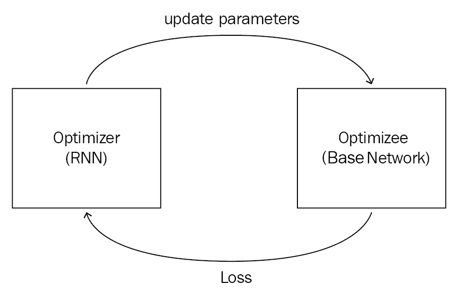

假设我们的基础网络（优化器）由`θ`参数化，而我们的 RNN（优化器）由`φ`参数化。 优化器的损失函数是什么？ 我们知道优化器的作用（RNN）是减少优化器（基础网络）的损失。 因此，优化器的损失是优化器的平均损失，可以表示为：

我们如何最小化这种损失？ 通过找到正确的`φ`，我们可以通过梯度下降使这种损失最小化。 好的，RNN 作为输入是什么，它将返回什么输出？ 我们的优化器，即我们的 RNN，将优化器`ᐁ[t]`的梯度及其先前状态`h[t]`作为输入，并返回输出，即更新`g[t]`，该更新可将优化器的损失降到最低。 让我们用函数`m`表示我们的 RNN：

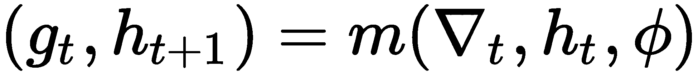

在前面的公式中，适用以下条件：

*   `ᐁ[t]`是我们模型（优化程序）`f`的梯度，即`ᐁ[t] = ᐁ[t](f(θ[t]))`
*   `h[t]`是 RNN 的隐藏状态
*   `φ`是 RNN 的参数
*   输出`g[t]`和`h[t + 1]`分别是 RNN 的更新和下一个状态

因此，我们使用`θ[t + 1] = θ[t] + g[t]`更新了模型参数值。

如下图所示，我们的优化器`m`，将隐藏状态`h[t]`和`θ[t]`的梯度`ᐁ[t]`作为输入，计算`g[t]`并将其发送到我们的优化器，然后在其中添加`θ[t]`，并在接下来的时间步骤中成为`θ[t + 1]`进行更新：

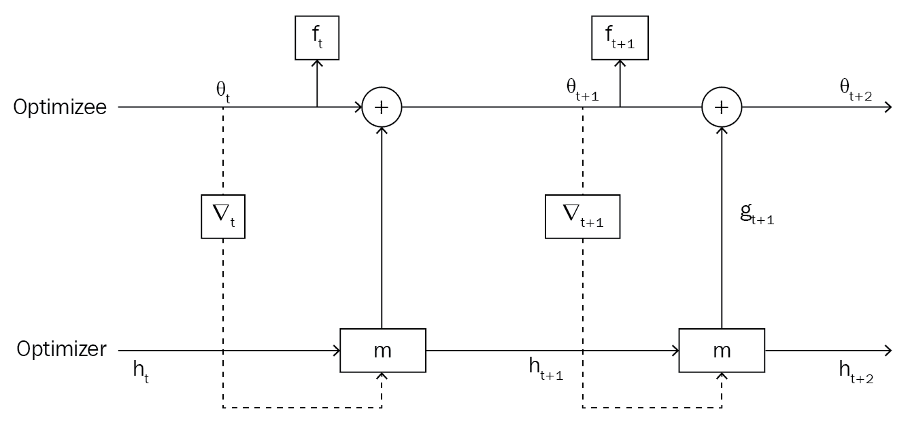

因此，通过这种方式，我们通过梯度下降学习梯度下降优化。

# 为几次学习优化模型

我们知道，在几次学习中，我们从较少的数据点中学习，但是如何在几次学习环境中应用梯度下降呢？ 在几次学习设置中，由于数据点很少，梯度下降突然失败。 梯度下降优化需要更多的数据点才能达到收敛并最大程度地减少损失。 因此，我们需要在少数情况下获得更好的优化技术。 假设我们有一个由某些参数`θ`参数化的`f`模型。 我们使用一些随机值初始化此参数`θ`，并尝试使用梯度下降法找到最佳值。 让我们回想一下梯度下降的更新方程：

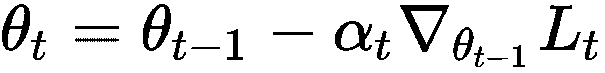

在前面的公式中，适用以下条件：

*   `θ[t]`是更新的参数
*   `θ[t - 1]`是上一个时间步的参数值
*   `α[t]`是学习率
*   `ᐁ[θ[t - 1]]L[t]`是损失函数相对于`θ[t - 1]`的梯度

梯度下降的更新方程看起来不熟悉吗？ 是的，您猜对了：它类似于 LSTM 的单元状态更新方程式，可以这样写：

我们可以将 LSTM 单元更新方程与梯度下降完全相关，例如`f[t] = 1`，则适用以下条件：

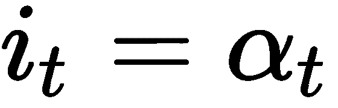

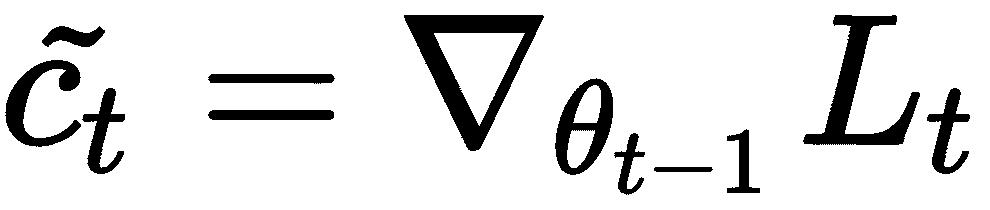

因此，我们可以使用 LSTM 作为优化器，而不是在少数学习机制中使用梯度下降作为优化器。 我们的元学习器是 LSTM，它学习用于训练模型的更新规则。 因此，我们使用两个网络：一个是我们的基础学习器，它学习执行任务，另一个是元学习器，它试图找到最佳参数。 但这如何工作？

我们知道，在 LSTM 中，我们使用了一个“遗忘门”来丢弃内存中不需要的信息，它可以表示为：

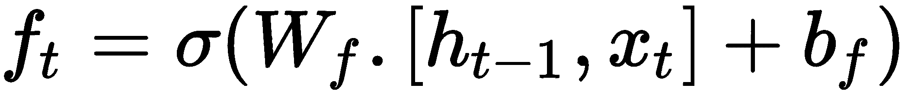

这个遗忘门在我们的优化设置中如何发挥作用？ 假设我们处于损失高的位置，并且梯度接近零。 我们如何摆脱这个位置？ 在这种情况下，我们可以缩小模型的参数，而忽略其先前值的某些部分。 因此，我们可以使用我们的遗忘门做到这一点，它将当前参数值`θ[t - 1]`，当前损失`L[t]`，当前梯度`ᐁ[θ[t - 1]]`和先前的遗忘门作为输入; 它可以表示如下：

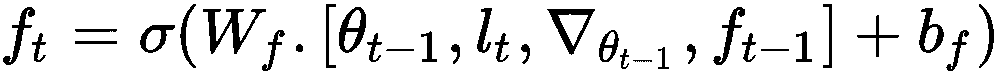

现在让我们进入输入门。 我们知道，LSTM 中的输入门用于确定要更新的值，它可以表示为：

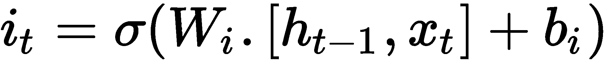

在几次学习设置中，我们可以使用此输入门来调整学习速度，以快速学习，同时防止出现差异：

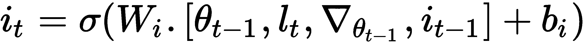

因此，我们的元学习器经过几次更新后即可学习`i[t]`和`f[t]`的最佳值。

但是，这如何工作？

假设我们有一个由`Θ`参数化的基础网络，和`M`参数化的 LSTM 元学习器`R`。 假设我们有一个数据集`D`。 我们将数据集分为`D_train`和`D_test`分别进行训练和测试。 首先，我们随机初始化元学习器参数`φ`。

对于某些`T`迭代次数，我们从`D_train`中随机采样数据点，计算损失，然后相对于模型参数`Θ`计算损失的梯度。 现在，我们将此梯度，损失和元学习器参数`φ`输入到我们的元学习器。 我们的元学习器`R`将返回单元状态`c[t]`，然后我们将时间`t`的基础网络`M`的参数`Θ[t]`更新为`c[t]`。 我们重复`N`次，如下图所示：

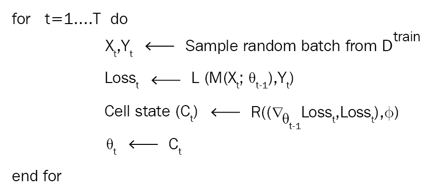

因此，在`T`次迭代之后，我们将获得一个最佳参数`θ[T]`。 但是，我们如何检查`θ[T]`的表现以及如何更新元学习器参数？ 我们采用测试集，并使用参数`θ[T]`计算测试集的损失。 然后，我们根据元学习器参数`φ`计算损失的梯度，然后更新`φ`，如下所示：

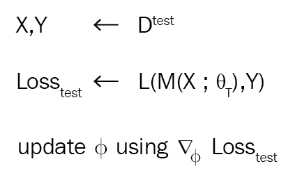

我们对`n`个迭代进行此操作，并更新了元学习器。 总体算法如下所示：

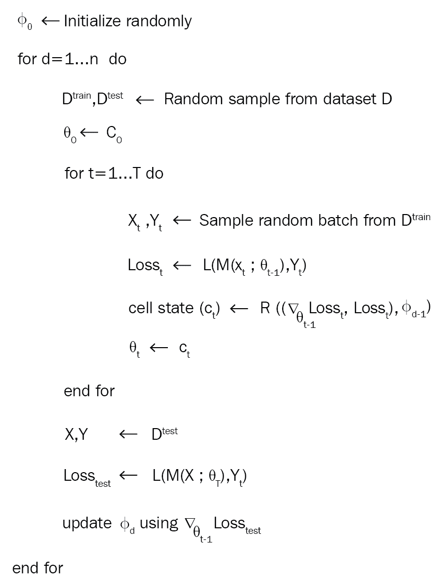

# 总结

我们首先了解了元学习是什么，以及元学习中如何使用单发，少发和零发学习。 我们了解到，支持集和查询集更像是训练集和测试集，但每个类中都有`k`个数据点。 我们还看到了`n`-方式 k 次的含义。 后来，我们了解了不同类型的元学习技术。 然后，我们探索了通过梯度下降学习梯度下降的学习方法，其中我们看到了 RNN 如何用作优化器来优化基础网络。 后来，我们将优化视为快速学习的模型，其中我们使用 LSTM 作为元学习器，以在快速学习环境中进行优化。

在下一章中，我们将学习称为连体网络的基于度量的元学习算法，并且将了解如何使用连体网络执行人脸和音频识别。

# 问题

1.  什么是元学习？
2.  什么是几次学习？
3.  什么是支持集？
4.  什么是查询集？
5.  基于度量的学习称为什么？
6.  我们如何进行元学习训练？

# 进一步阅读

*   [学习通过梯度下降学习梯度下降](https://arxiv.org/pdf/1606.04474.pdf)
*   [优化作为少量学习设置的模型](https://openreview.net/pdf?id=rJY0-Kcll)