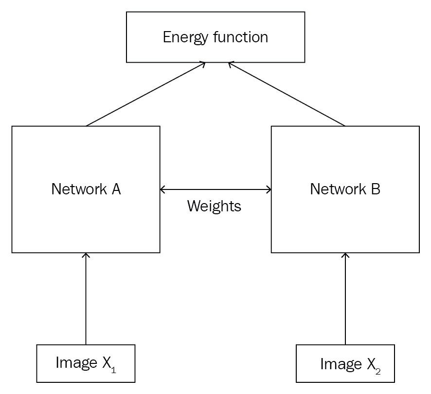
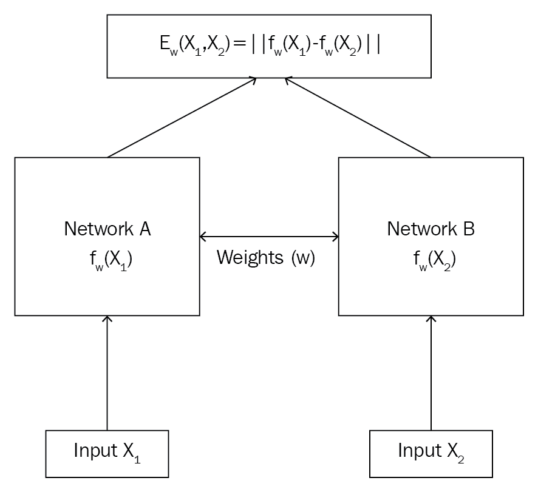
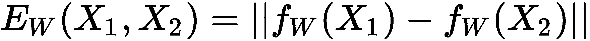
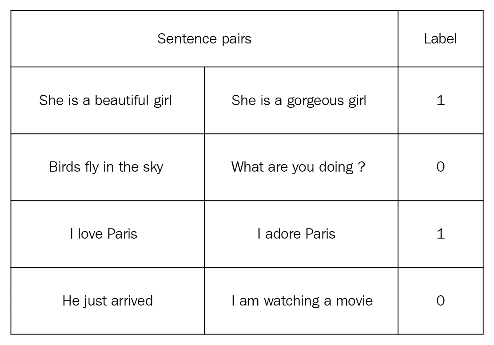
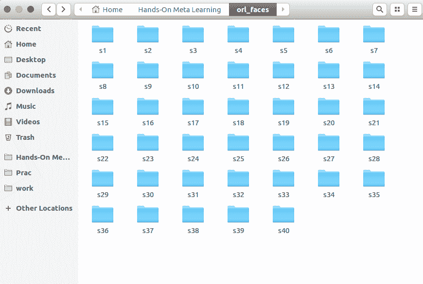
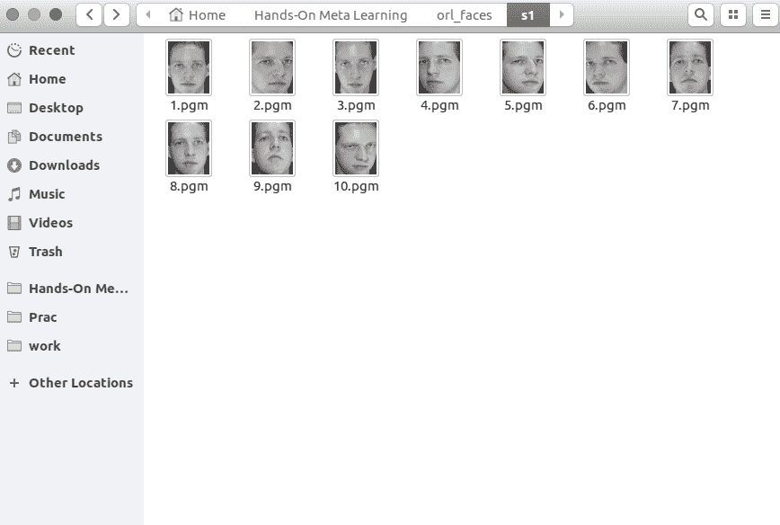
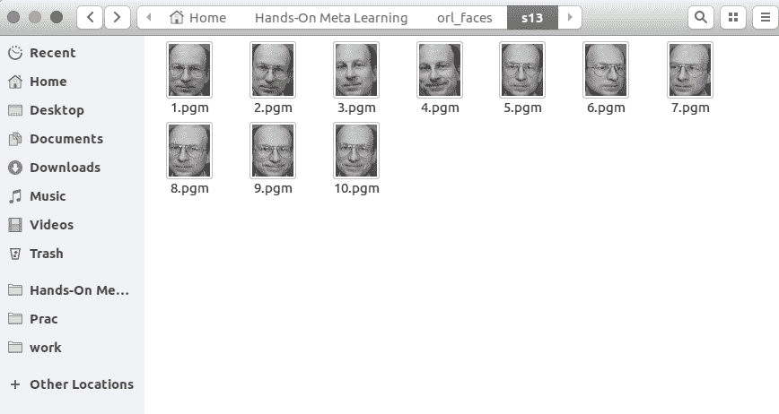
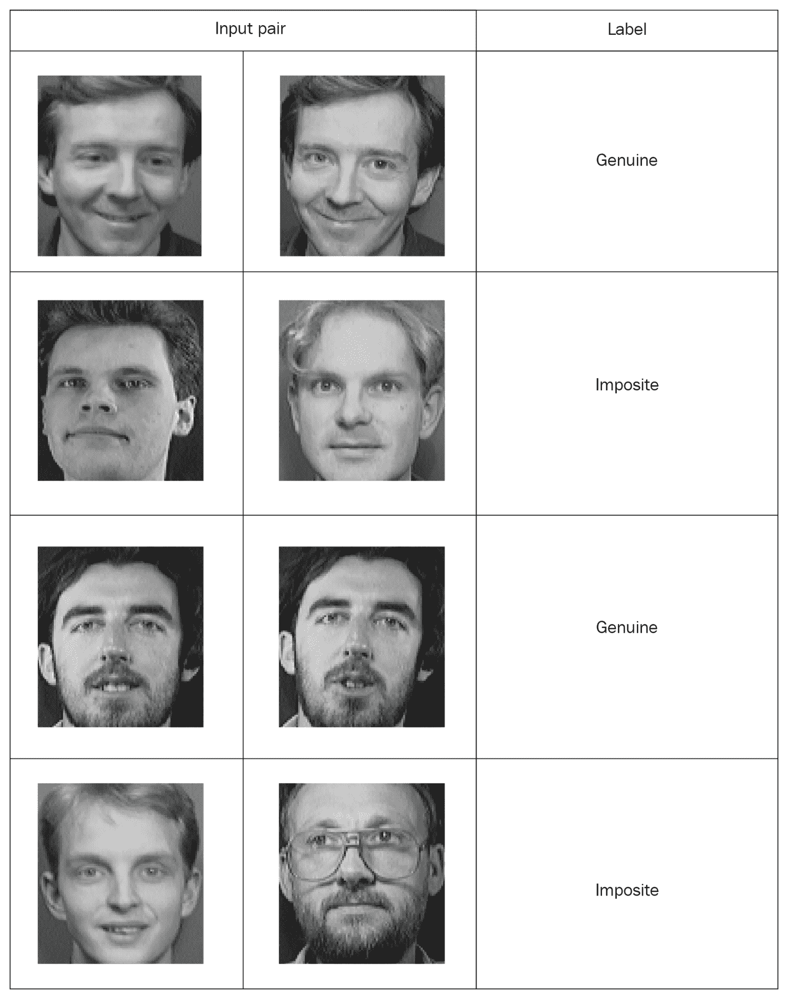

# 二、使用连体网络的人脸和音频识别

在上一章中，我们了解了什么是元学习和不同类型的元学习技术。 我们还看到了如何通过梯度下降和优化来学习梯度下降，这是一次快速学习的模型。 在本章中，我们将学习一种称为**连体网络**的最常用的基于度量的单次学习算法。 我们将看到连体网络如何从很少的数据点学习以及如何将它们用于解决低数据问题。 之后，我们将详细探讨连体网络的架构，并看到连体网络的一些应用。 在本章的最后，我们将学习如何使用连体网络构建人脸和音频识别模型。

在本章中，您将学习以下内容：

*   什么是连体网络？
*   连体网络的架构
*   连体网络的应用
*   将连体网络用于人脸识别
*   使用连体网络构建音频识别模型

# 什么是连体网络？

连体网络是神经网络的一种特殊类型，它是最简单且使用最广泛的单发学习算法之一。 正如我们在上一章中学到的，单次学习是一种技术，其中我们每个类仅从一个训练示例中学习。 因此，在每个类别中没有很多数据点的应用中主要使用连体网络。 例如，假设我们要为我们的组织建立一个人脸识别模型，并且在组织中有大约 500 个人在工作。 如果我们想从头开始使用**卷积神经网络**（**CNN**）建立人脸识别模型，那么我们需要这 500 人中的许多人来训练网络并获得准确率良好的图像。 但是显然，我们不会为这 500 个人提供很多图像，因此除非有足够的数据点，否则使用 CNN 或任何深度学习算法构建模型都是不可行的。 因此，在这种情况下，我们可以求助于复杂的单次学习算法，例如连体网络，该算法可以从更少的数据点进行学习。

但是，连体网络如何工作？ 连体网络基本上由两个对称的神经网络组成，它们共享相同的权重和结构，并且都使用能量函数`E`最终结合在一起。 我们的连体网络的目标是了解两个输入值是相似还是相异。 假设我们有两个图像`X[1]`和`X2`，我们想了解两个图像是相似还是相异。

如下图所示，我们将图像`X[1]`馈送到网络`A`和图像`X[2]`到另一个网络`B`。 这两个网络的作用是为输入图像生成嵌入（特征向量）。 因此，我们可以使用任何可以嵌入我们的网络。 由于我们的输入是图像，因此我们可以使用卷积网络来生成嵌入，即用于提取特征。 请记住，CNN 在这里的作用仅仅是提取特征而不是进行分类。 我们知道这些网络应该具有相同的权重和架构，如果我们的网络`A`是三层 CNN，那么我们的网络`B`也应该是三层 CNN，我们这两个网络必须使用相同的权重集。 因此，网络`A`和网络`B`将为我们提供输入图像`X[1]`和`X[2]`的嵌入。 然后，我们会将这些嵌入信息提供给能量函数，从而告诉我们两个输入的相似程度。 能量函数基本上是任何相似性度量，例如欧几里得距离和余弦相似性。



连体网络不仅用于人脸识别，而且还广泛用于我们没有很多数据点和任务需要学习两个输入之间相似性的应用中。 连体网络的应用包括签名验证，相似问题检索，对象跟踪等。 我们将在下一部分中详细研究连体网络。

# 连体网络的架构

现在，我们对连体网络有了基本的了解，我们将详细探讨它们。 下图显示了连体网络的架构：



如上图所示，连体网络由两个相同的网络组成，它们共享相同的权重和架构。 假设我们有两个输入，`X[1]`和`X[2]`。 我们将输入`X[1]`馈送到网络`A`，即`f[w](X[1])`，然后将输入的`X[2]`馈送到网络`B`，即`f[w](X[2])`。 您会注意到，这两个网络的权重相同`w`，它们将为我们的输入`X[1]`和`X[2]`生成嵌入。 然后，我们将这些嵌入提供给能量函数`E`，这将使我们在两个输入之间具有相似性。

可以表示为：



假设我们使用欧几里得距离作为能量函数，那么如果`X[1]`和`X[2]`相似。 如果输入值不相同，则`E`的值将很大。

假设您有两个句子，句子 1 和句子 2。我们将句子 1 馈送到网络`A`，将句子 2 馈送到网络`B`。 假设我们的网络`A`和网络`B`都是 LSTM 网络，它们共享相同的权重。 因此，网络`A`和网络`B`将分别为句子 1 和句子 2 生成单词嵌入。 然后，我们将这些嵌入提供给能量函数，从而为我们提供两个句子之间的相似度得分。 但是我们如何训练我们的连体网络呢？ 数据应该如何？ 有哪些特征和标签？ 我们的目标函数是什么？

连体网络的输入应该成对出现`(X[1], X[2])`以及它们的二进制标签`Y ∈ (0, 1)`，指出输入对是真对（相同）还是非对（不同）。 正如您在下表中所看到的，我们将句子成对存在，并且标签暗示句子对是真实的（1）还是假的（0）：



那么，我们的连体网络的损失函数是什么？ 由于连体网络的目标不是执行分类任务而是为了了解两个输入值之间的相似性，因此我们使用对比损失函数。

可以表示为：


在前面的公式中，`Y`的值是真实的标签，如果两个输入值相似，则为`1`；如果两个输入值为`0`是不同的，`E`是我们的能量函数，可以是任何距离度量。 术语**边距**用于保持约束，也就是说，当两个输入值互不相同时，并且如果它们的距离大于边距，则不会造成损失。

# 连体网络的应用

如我们所知，连体网络通过使用相同的架构找到两个输入值之间的相似性来学习。 它是涉及两个实体之间的计算相似性的任务中最常用的一次学习算法之一。 它功能强大，可作为低数据问题的解决方案。

在发表连体网络的[第一篇论文](https://papers.nips.cc/paper/769-signature-verification-using-a-siamese-time-delay-neural-network.pdf)中，作者描述了网络对于签名验证任务的重要性。 签名验证任务的目的是识别签名的真实性。 因此，作者用真正的和不正确的签名对训练了连体网络，并使用了卷积网络从签名中提取特征。 提取特征后，他们测量了两个特征向量之间的距离以识别相似性。 因此，当出现新的签名时，我们提取特征并将其与签名者存储的特征向量进行比较。 如果距离小于某个阈值，则我们接受签名为真实签名，否则我们拒绝签名。

连体网络也广泛用于 NLP 任务。 [有一篇有趣的论文](http://www.aclweb.org/anthology/W16-1617)，作者使用连体网络来计算文本相似度。 他们使用连体网络作为双向单元，并使用余弦相似度作为能量函数来计算文本之间的相似度。

连体网络的应用是无止境的。 它们已经堆叠了用于执行各种任务的各种架构，例如人类动作识别，场景更改检测和机器翻译。

# 将连体网络用于人脸识别

我们将通过建立人脸识别模型来了解连体网络。 我们网络的目标是了解两个面孔是相似还是相异。 我们使用 AT&T 人脸数据库，[可以从此处下载](https://www.cl.cam.ac.uk/research/dtg/attarchive/facedatabase.html)。

下载并解压缩存档后，可以看到文件夹`s1`，`s2`，最高到`s40`，如下所示：



这些文件夹中的每一个都有从不同角度拍摄的 10 个人的不同图像。 例如，打开文件夹`s1`。 如您所见，一个人有 10 张不同的图像：



我们打开并检查文件夹`s13`：



我们知道，连体网络需要输入值和标签一起作为一对，因此我们必须以这种方式创建数据。 因此，我们将从同一文件夹中随机获取两张图像，并将它们标记为真正的一对，而我们将从两个不同文件夹中获取单幅图像，并将它们标记为不正确的一对。 以下屏幕快照显示了一个示例； 如您所见，一对真实的人具有相同的人的形象，而一对不真实的人具有不同的人的形象：



一旦我们将数据与它们的标签配对在一起，就可以训练我们的连体网络。 从图像对中，我们将一个图像馈入网络`A`，将另一个图像馈入网络`B`。这两个网络的作用仅仅是提取特征向量。 因此，我们使用具有**整流线性单元**（**ReLU**）激活的两个卷积层来提取特征。 一旦了解了特征，就将来自两个网络的合成特征向量馈入能量函数，以测量相似度。 我们使用欧几里得距离作为我们的能量函数。 因此，我们通过提供图像对来训练我们的网络，以了解它们之间的语义相似性。 现在，我们将逐步看到这一点。

为了更好地理解，您可以检查完整的代码，该代码可以在 Jupyter 笔记本中找到，[并在此处进行解释](https://github.com/sudharsan13296/Hands-On-Meta-Learning-With-Python/blob/master/02.%20Face%20and%20Audio%20Recognition%20using%20Siamese%20Networks/2.4%20Face%20Recognition%20Using%20Siamese%20Network.ipynb)。

首先，我们将导入所需的库：

```py
import re
import numpy as np
from PIL import Image

from sklearn.model_selection import train_test_split
from keras import backend as K
from keras.layers import Activation
from keras.layers import Input, Lambda, Dense, Dropout, Convolution2D, MaxPooling2D, Flatten
from keras.models import Sequential, Model
from keras.optimizers import RMSprop

```

现在，我们定义了一个用于读取输入图像的函数。 `read_image`函数将图像作为输入并返回一个 NumPy 数组：

```py
def read_image(filename, byteorder='>'):

    #first we read the image, as a raw file to the buffer
    with open(filename, 'rb') as f:
        buffer = f.read()

    #using regex, we extract the header, width, height and maxval of the image
    header, width, height, maxval = re.search(
        b"(^P5\s(?:\s*#.*[\r\n])*"
        b"(\d+)\s(?:\s*#.*[\r\n])*"
        b"(\d+)\s(?:\s*#.*[\r\n])*"
        b"(\d+)\s(?:\s*#.*[\r\n]\s)*)", buffer).groups()

    #then we convert the image to numpy array using np.frombuffer which interprets buffer as one dimensional array
    return np.frombuffer(buffer,
                            dtype='u1' if int(maxval) < 256 else byteorder+'u2',
                            count=int(width)*int(height),
                            offset=len(header)
                            ).reshape((int(height), int(width)))

```

例如，我们打开一个图像：

```py
Image.open("data/orl_faces/s1/1.pgm")
```


当我们将此图像提供给`read_image`函数时，它将作为 NumPy 数组返回：

```py
img = read_image('data/orl_faces/s1/1.pgm')
img.shape
(112, 92)
```

现在，我们定义另一个函数`get_data`，用于生成我们的数据。 众所周知，对于连体网络，数据应采用带有二进制标签的成对形式（正版和非正版）。

首先，我们从同一目录中读取（`img1`和`img2`）图像，并将它们存储在`x_genuine_pair`数组中，然后将`y_genuine`分配给`1`。 接下来，我们从不同目录中读取（`img1`，`img2`）图像，并将它们存储在`x_imposite`对中，并将`y_imposite`分配给`0`。

最后，我们将`x_genuine_pair`和`x_imposite`都连接到`X`以及`y_genuine`和`y_imposite`都连接到`Y`：

```py
size = 2
total_sample_size = 10000

def get_data(size, total_sample_size):
    #read the image
    image = read_image('data/orl_faces/s' + str(1) + '/' + str(1) + '.pgm', 'rw+')
    #reduce the size
    image = image[::size, ::size]
    #get the new size
    dim1 = image.shape[0]
    dim2 = image.shape[1]

    count = 0

    #initialize the numpy array with the shape of [total_sample, no_of_pairs, dim1, dim2]
    x_geuine_pair = np.zeros([total_sample_size, 2, 1, dim1, dim2]) # 2 is for pairs
    y_genuine = np.zeros([total_sample_size, 1])

    for i in range(40):
        for j in range(int(total_sample_size/40)):
            ind1 = 0
            ind2 = 0

            #read images from same directory (genuine pair)
            while ind1 == ind2:
                ind1 = np.random.randint(10)
                ind2 = np.random.randint(10)

            # read the two images
            img1 = read_image('data/orl_faces/s' + str(i+1) + '/' + str(ind1 + 1) + '.pgm', 'rw+')
            img2 = read_image('data/orl_faces/s' + str(i+1) + '/' + str(ind2 + 1) + '.pgm', 'rw+')

            #reduce the size
            img1 = img1[::size, ::size]
            img2 = img2[::size, ::size]

            #store the images to the initialized numpy array
            x_geuine_pair[count, 0, 0, :, :] = img1
            x_geuine_pair[count, 1, 0, :, :] = img2

            #as we are drawing images from the same directory we assign label as 1\. (genuine pair)
            y_genuine[count] = 1
            count += 1

    count = 0
    x_imposite_pair = np.zeros([total_sample_size, 2, 1, dim1, dim2])
    y_imposite = np.zeros([total_sample_size, 1])

    for i in range(int(total_sample_size/10)):
        for j in range(10):

            #read images from different directory (imposite pair)
            while True:
                ind1 = np.random.randint(40)
                ind2 = np.random.randint(40)
                if ind1 != ind2:
                    break

            img1 = read_image('data/orl_faces/s' + str(ind1+1) + '/' + str(j + 1) + '.pgm', 'rw+')
            img2 = read_image('data/orl_faces/s' + str(ind2+1) + '/' + str(j + 1) + '.pgm', 'rw+')

            img1 = img1[::size, ::size]
            img2 = img2[::size, ::size]

            x_imposite_pair[count, 0, 0, :, :] = img1
            x_imposite_pair[count, 1, 0, :, :] = img2
            #as we are drawing images from the different directory we assign label as 0\. (imposite pair)
            y_imposite[count] = 0
            count += 1

    #now, concatenate, genuine pairs and imposite pair to get the whole data
    X = np.concatenate([x_geuine_pair, x_imposite_pair], axis=0)/255
    Y = np.concatenate([y_genuine, y_imposite], axis=0)

    return X, Y
```

现在，我们生成数据并检查数据大小。 如您所见，我们有 20,000 个数据点，其中 10,000 个是真实对，而 10,000 个是非对：

```py
X, Y = get_data(size, total_sample_size)

X.shape
(20000, 2, 1, 56, 46)

Y.shape
(20000, 1)
```

接下来，我们将训练和测试的数据划分为 75% 的训练和 25% 的测试比例：

```py
x_train, x_test, y_train, y_test = train_test_split(X, Y, test_size=.25)
```

现在我们已经成功地生成了数据，我们就建立了连体网络。 首先，我们定义基础网络，该网络基本上是用于特征提取的卷积网络。 我们使用 ReLU 激活和最大池化以及一个平坦层来构建两个卷积层：

```py
def build_base_network(input_shape):

    seq = Sequential()

    nb_filter = [6, 12]
    kernel_size = 3

    #convolutional layer 1
    seq.add(Convolution2D(nb_filter[0], kernel_size, kernel_size, input_shape=input_shape,
                          border_mode='valid', dim_ordering='th'))
    seq.add(Activation('relu'))
    seq.add(MaxPooling2D(pool_size=(2, 2))) 
    seq.add(Dropout(.25))

    #convolutional layer 2
    seq.add(Convolution2D(nb_filter[1], kernel_size, kernel_size, border_mode='valid', dim_ordering='th'))
    seq.add(Activation('relu'))
    seq.add(MaxPooling2D(pool_size=(2, 2), dim_ordering='th')) 
    seq.add(Dropout(.25))

    #flatten 
    seq.add(Flatten())
    seq.add(Dense(128, activation='relu'))
    seq.add(Dropout(0.1))
    seq.add(Dense(50, activation='relu'))
    return seq
```

接下来，我们将图像对馈送到基础网络，该基础网络将返回嵌入，即特征向量：

```py
input_dim = x_train.shape[2:]
img_a = Input(shape=input_dim)
img_b = Input(shape=input_dim)

base_network = build_base_network(input_dim)
feat_vecs_a = base_network(img_a)
feat_vecs_b = base_network(img_b)
```

`feat_vecs_a`和`feat_vecs_b`是我们图像对的特征向量。 接下来，我们将这些特征向量馈入能量函数以计算它们之间的距离，然后使用欧几里得距离作为能量函数：

```py
def euclidean_distance(vects):
    x, y = vects
    return K.sqrt(K.sum(K.square(x - y), axis=1, keepdims=True))

def eucl_dist_output_shape(shapes):
    shape1, shape2 = shapes
    return (shape1[0], 1)

distance = Lambda(euclidean_distance, output_shape=eucl_dist_output_shape)([feat_vecs_a, feat_vecs_b]) 
```

现在，我们将周期长度设置为`13`，并使用 RMS 属性进行优化并定义我们的模型：

```py
epochs = 13
rms = RMSprop()

model = Model(input=[input_a, input_b], output=distance)
```

接下来，我们将损失函数定义为`contrastive_loss`函数并编译模型：

```py
def contrastive_loss(y_true, y_pred):
    margin = 1
    return K.mean(y_true * K.square(y_pred) + (1 - y_true) * K.square(K.maximum(margin - y_pred, 0)))

model.compile(loss=contrastive_loss, optimizer=rms)
```

现在，我们训练模型：

```py
img_1 = x_train[:, 0]
img_2 = x_train[:, 1] 

model.fit([img_1, img_2], y_train, validation_split=.25, batch_size=128, verbose=2, nb_epoch=epochs)
```

您会看到损失随着时间的推移而减少：

```py
Train on 11250 samples, validate on 3750 samples
Epoch 1/13
 - 60s - loss: 0.2179 - val_loss: 0.2156
Epoch 2/13
 - 53s - loss: 0.1520 - val_loss: 0.2102
Epoch 3/13
 - 53s - loss: 0.1190 - val_loss: 0.1545
Epoch 4/13
 - 55s - loss: 0.0959 - val_loss: 0.1705
Epoch 5/13
 - 52s - loss: 0.0801 - val_loss: 0.1181
Epoch 6/13
 - 52s - loss: 0.0684 - val_loss: 0.0821
Epoch 7/13
 - 52s - loss: 0.0591 - val_loss: 0.0762
Epoch 8/13
 - 52s - loss: 0.0526 - val_loss: 0.0655
Epoch 9/13
 - 52s - loss: 0.0475 - val_loss: 0.0662
Epoch 10/13
 - 52s - loss: 0.0444 - val_loss: 0.0469
Epoch 11/13
 - 52s - loss: 0.0408 - val_loss: 0.0478
Epoch 12/13
 - 52s - loss: 0.0381 - val_loss: 0.0498
Epoch 13/13
 - 54s - loss: 0.0356 - val_loss: 0.0363
```

现在，我们使用测试数据进行预测：

```py
pred = model.predict([x_test[:, 0], x_test[:, 1]])
```

接下来，我们定义一个用于计算精度的函数：

```py
def compute_accuracy(predictions, labels):
    return labels[predictions.ravel() < 0.5].mean()
```

现在，我们对模型的准确率：

```py
compute_accuracy(pred, y_test)

0.9779092702169625
```

# 使用连体网络构建音频识别模型

在上一教程中，我们了解了如何使用连体网络识别人脸。 现在，我们将看到如何使用连体网络来识别音频。 我们将训练我们的网络，以区分狗的声音和猫的声音。 可以从此处下载[猫和狗音频的数据集](https://www.kaggle.com/mmoreaux/audio-cats-and-dogs#cats_dogs.zip)。

下载数据后，我们将数据分成三个文件夹：`Dogs`，`Sub_dogs`和`Cats`。 在`Dogs`和`Sub_dogs`中，放置狗的吠叫音频，在`Cats`文件夹中，放置猫的音频。 我们网络的目标是识别音频是狗的吠叫还是其他声音。 众所周知，对于连体网络，我们需要成对输入输入。 我们从`Dogs`和`Sub_dogs`文件夹中选择一个音频并将其标记为真正对，并从`Dogs`和`Cats`文件夹中选择一个音频并将它们标记为非对。 即，`(Dogs, Sub_dogs)`是真正的对，`(Dogs, Cats)`是非配对的。

现在，我们将逐步展示如何训练连体网络以识别音频是狗的吠叫声还是其他声音。

为了更好地理解，您可以检查完整的代码，该代码可以在 Jupyter 笔记本中找到，[并在此处进行解释](https://github.com/sudharsan13296/Hands-On-Meta-Learning-With-Python/blob/master/02.%20Face%20and%20Audio%20Recognition%20using%20Siamese%20Networks/2.5%20Audio%20Recognition%20using%20Siamese%20Network.ipynb)。

首先，我们将加载所有必需的库：

```py
#basic imports
import glob
import IPython
from random import randint

#data processing
import librosa
import numpy as np

#modelling
from sklearn.model_selection import train_test_split

from keras import backend as K
from keras.layers import Activation
from keras.layers import Input, Lambda, Dense, Dropout, Flatten
from keras.models import Model
from keras.optimizers import RMSprop
```

在继续之前，我们加载并收听音频片段：

```py
IPython.display.Audio("data/audio/Dogs/dog_barking_0.wav")

IPython.display.Audio("data/audio/Cats/cat_13.wav")
```

那么，如何将这些原始音频馈送到我们的网络？ 我们如何从原始音频中提取有意义的特征？ 众所周知，神经网络仅接受向量化输入，因此我们需要将音频转换为特征向量。 我们该怎么做？ 嗯，我们可以通过几种机制生成音频的嵌入。 这样的流行机制之一是**梅尔频率倒谱系数**（**MFCC**）。 MFCC 使用对数功率谱在频率的非线性梅尔尺度上的线性余弦变换来转换音频的短期功率谱。 要了解有关 MFCC 的更多信息，[请查看此不错的教程](http://practicalcryptography.com/miscellaneous/machine-learning/guide-mel-frequency-cepstral-coefficients-mfccs/)。

我们将使用`librosa`库中的 MFCC 函数来生成音频嵌入。 因此，我们定义了一个名为`audio2vector`的函数，该函数在给定音频文件的情况下返回音频嵌入：

```py
def audio2vector(file_path, max_pad_len=400):

    #read the audio file
    audio, sr = librosa.load(file_path, mono=True)

    #reduce the shape
    audio = audio[::3]

    #extract the audio embeddings using MFCC
    mfcc = librosa.feature.mfcc(audio, sr=sr) 

    #as the audio embeddings length varies for different audio, we keep the maximum length as 400
    #pad them with zeros

    pad_width = max_pad_len - mfcc.shape[1]
    mfcc = np.pad(mfcc, pad_width=((0, 0), (0, pad_width)), mode='constant')

    return mfcc
```

我们将加载一个音频文件并查看嵌入内容：

```py
audio_file = 'data/audio/Dogs/dog_barking_0.wav'
audio2vector(audio_file)
array([[-297.54905127, -288.37618855, -314.92037769, ...,    0\.        ,
           0\.        ,    0\.        ],
       [  23.05969394,    9.55913148,   37.2173831 , ...,    0\.        ,
           0\.        ,    0\.        ],
       [-122.06299523, -115.02627567, -108.18703056, ...,    0\.        ,
           0\.        ,    0\.        ],
       ...,
       [  -6.40930836,   -2.8602708 ,   -2.12551478, ...,    0\.        ,
           0\.        ,    0\.        ],
       [   0.70572914,    4.21777791,    4.62429301, ...,    0\.        ,
           0\.        ,    0\.        ],
       [  -6.08997702,  -11.40687886,  -18.2415214 , ...,    0\.        ,
           0\.        ,    0\.        ]])
```

现在我们已经了解了如何生成音频嵌入，我们需要为我们的连体网络创建数据。 众所周知，连体网络可以成对接受数据，因此我们定义了获取数据的函数。 我们将创建一个真正的对（`Dogs`，`Sub_dogs`），并将标签指定为`1`，将非正当对创建为（`Dogs`，`Cats`），并将标签指定为`0`：

```py
def get_data():

    pairs = []
    labels = []

    Dogs = glob.glob('data/audio/Dogs/*.wav')
    Sub_dogs = glob.glob('data/audio/Sub_dogs/*.wav')
    Cats = glob.glob('data/audio/Cats/*.wav')

    np.random.shuffle(Sub_dogs)
    np.random.shuffle(Cats)

    for i in range(min(len(Cats),len(Sub_dogs))):
        #imposite pair
        if (i % 2) == 0:
            pairs.append([audio2vector(Dogs[randint(0,3)]),audio2vector(Cats[i])])
            labels.append(0)

        #genuine pair
        else:
            pairs.append([audio2vector(Dogs[randint(0,3)]),audio2vector(Sub_dogs[i])])
            labels.append(1)

    return np.array(pairs), np.array(labels)

X, Y = get_data("/home/sudarshan/sudarshan/Experiments/oneshot-audio/data/")
```

接下来，我们将训练和测试的数据划分为 75% 的训练和 25% 的测试比例：

```py
X_train, X_test, y_train, y_test = train_test_split(X, Y, test_size=0.2)
```

现在我们已经成功地生成了数据，我们就建立了连体网络。 我们定义了用于特征提取的基本网络，我们使用了三个密集层，中间有一个丢弃层：

```py
def build_base_network(input_shape):
    input = Input(shape=input_shape)
    x = Flatten()(input)
    x = Dense(128, activation='relu')(x)
    x = Dropout(0.1)(x)
    x = Dense(128, activation='relu')(x)
    x = Dropout(0.1)(x)
    x = Dense(128, activation='relu')(x)
    return Model(input, x)
```

接下来，我们将音频对馈送到基础网络，基础网络将返回特征：

```py
input_dim = X_train.shape[2:]
audio_a = Input(shape=input_dim)
audio_b = Input(shape=input_dim)

base_network = build_base_network(input_dim)
feat_vecs_a = base_network(audio_a)
feat_vecs_b = base_network(audio_b)
```

`feat_vecs_a`和`feat_vecs_b`是我们音频对的特征向量。 接下来，我们将这些特征向量馈入能量函数以计算它们之间的距离，然后使用欧几里得距离作为能量函数：

```py
def euclidean_distance(vects):
    x, y = vects
    return K.sqrt(K.sum(K.square(x - y), axis=1, keepdims=True))

def eucl_dist_output_shape(shapes):
    shape1, shape2 = shapes
    return (shape1[0], 1)

distance = Lambda(euclidean_distance, output_shape=eucl_dist_output_shape)([feat_vecs_a, feat_vecs_b])
```

接下来，我们将周期长度设置为`13`，并使用 RMS 属性进行优化：

```py
epochs = 13
rms = RMSprop()

model = Model(input=[audio_a, audio_b], output=distance)
```

最后，我们将损失函数定义为`contrastive_loss`并编译模型：

```py
def contrastive_loss(y_true, y_pred):
    margin = 1
    return K.mean(y_true * K.square(y_pred) + (1 - y_true) * K.square(K.maximum(margin - y_pred, 0)))

model.compile(loss=contrastive_loss, optimizer=rms)
```

现在，我们训练模型：

```py
audio1 = X_train[:, 0]
audio2 = X_train[:, 1]

model.fit([audio_1, audio_2], y_train, validation_split=.25,
          batch_size=128, verbose=2, nb_epoch=epochs)
```

您可以了解历代的损失：

```py
Train on 8 samples, validate on 3 samples
Epoch 1/13
 - 0s - loss: 23594.8965 - val_loss: 1598.8439
Epoch 2/13
 - 0s - loss: 62360.9570 - val_loss: 816.7302
Epoch 3/13
 - 0s - loss: 17967.6230 - val_loss: 970.0378
Epoch 4/13
 - 0s - loss: 20030.3711 - val_loss: 358.9078
Epoch 5/13
 - 0s - loss: 11196.0547 - val_loss: 339.9991
Epoch 6/13
 - 0s - loss: 3837.2898 - val_loss: 381.9774
Epoch 7/13
 - 0s - loss: 2037.2965 - val_loss: 303.6652
Epoch 8/13
 - 0s - loss: 1434.4321 - val_loss: 229.1388
Epoch 9/13
 - 0s - loss: 2553.0562 - val_loss: 215.1207
Epoch 10/13
 - 0s - loss: 1046.6870 - val_loss: 197.1127
Epoch 11/13
 - 0s - loss: 569.4632 - val_loss: 183.8586
Epoch 12/13
 - 0s - loss: 759.0131 - val_loss: 162.3362
Epoch 13/13
 - 0s - loss: 819.8594 - val_loss: 120.3017
```

# 总结

在本章中，我们学习了什么是连体网络，以及如何使用连体网络构建人脸和音频识别模型。 我们探索了连体网络的架构，该网络基本上由两个相同的神经网络组成，它们具有相同的权重和架构，并且将这些网络的输出插入到一些能量函数中以了解相似性。

在下一章中，我们将学习原型网络及其变种，例如高斯原型网络和半原型网络。 我们还将看到如何使用原型网络进行全方位字符集分类。

# 问题

1.  什么是连体网络？
2.  什么是对比损失函数？
3.  能量函数是什么？
4.  连体网络所需的数据格式是什么？
5.  连体网络有哪些应用？

# 进一步阅读

*   [用于对象跟踪的连体网络](https://arxiv.org/pdf/1606.09549.pdf)
*   [用于图像识别的连体网络](https://www.cs.cmu.edu/~rsalakhu/papers/oneshot1.pdf)