# 四、使用 TensorFlow 的关系和匹配网络

在上一章中，我们了解了原型网络，以及如何将原型网络的变体（例如高斯原型网络和半原型网络）用于一次学习。 我们已经看到原型网络如何利用嵌入来执行分类任务。

在本章中，我们将学习关系网络和匹配网络。 首先，我们将了解什么是关系网络以及如何在单次，几次和零次学习设置中使用它，然后，我们将学习如何使用 TensorFlow 建立关系网络。 在本章的后面，我们将学习匹配网络以及如何在几次学习中使用它们。 我们还将看到在匹配网络中使用的不同类型的嵌入函数。 在本章的最后，我们将看到如何在 Tensorflow 中构建匹配的网络。

在本章中，我们将学习以下内容：

*   关系网络
*   单次，几次和零次设置的关系网络
*   使用 TensorFlow 建立关系网络
*   匹配网络
*   匹配网络的嵌入函数
*   匹配网络的架构
*   TensorFlow 中的匹配网络

# 关系网络

现在，我们将看到另一种有趣的单次学习算法，称为关系网络。 它是最简单，最有效的单发学习算法之一。 我们将探讨在单发，少发和零发学习设置中如何使用关系网络。

# 一次学习中的关系网络

关系网络由两个重要函数组成：以`f[φ]`表示的嵌入函数和以`g[φ]`表示的关系函数。 嵌入函数用于从输入中提取特征。 如果输入是图像，则可以使用卷积网络作为嵌入函数，这将为我们提供图像的特征向量/嵌入。 如果我们的输入是文本，那么我们可以使用 LSTM 网络获取文本的嵌入。

众所周知，在一次学习中，每个类只有一个示例。 例如，假设我们的支持集包含三个类，每个类一个示例。 如下图所示，我们有一个包含三个类别的支持集，`{Lion, Eleph, Dog}`：

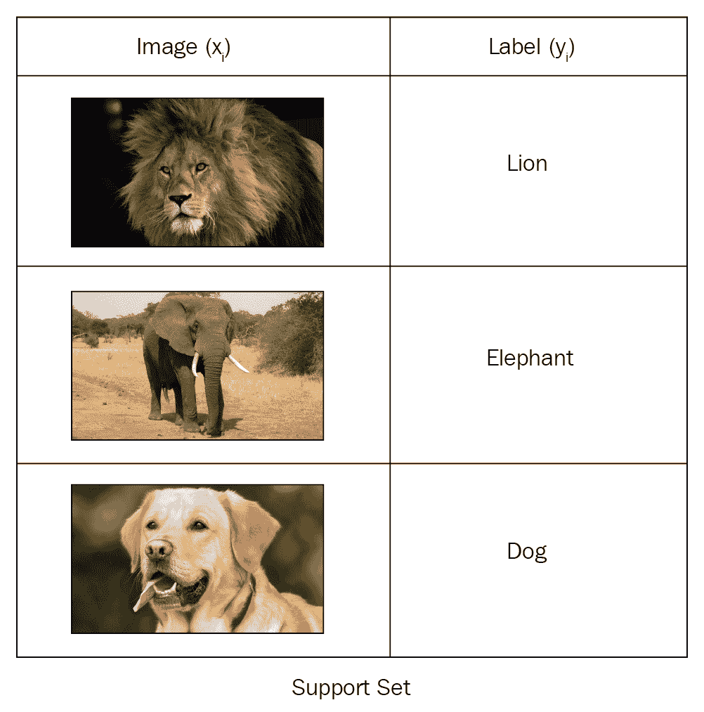

假设我们有一个查询图像`x[j]`，如下图所示，我们希望预测该查询图像的类：

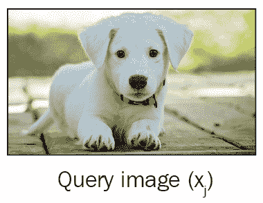

首先，我们从支持集中获取每个图像`x[i]`，并将其传递给嵌入函数`f[φ](x[i])`，以提取特征。 由于我们的支持集包含图像，因此我们可以使用卷积网络作为我们的嵌入函数来学习嵌入。 嵌入函数将为我们提供支持集中每个数据点的特征向量。 类似地，我们将把查询图像`x[j]`传递给嵌入函数`f[φ](x[j])`来学习其嵌入。

因此，一旦有了支持集`f[φ](x[i])`和查询集`f[φ](x[j])`的特征向量，就可以使用运算符`Z`组合它们。 `Z`可以是任何组合运算符； 我们使用连接作为运算符，以合并支持和查询集的特征向量，即`Z(f[φ](x[i]), f[φ](x[j]))`。

如下图所示，我们将合并支持集`f[φ](x[i])`和查询集`f[φ](x[j])`的特征向量。 但是这样的组合有什么用呢？ 这将帮助我们理解支持集中图像的特征向量与查询图像的特征向量之间的关系。 在我们的示例中，它将帮助我们理解狮子，大象和狗的图像的特征向量与查询图像的特征向量之间的关系：

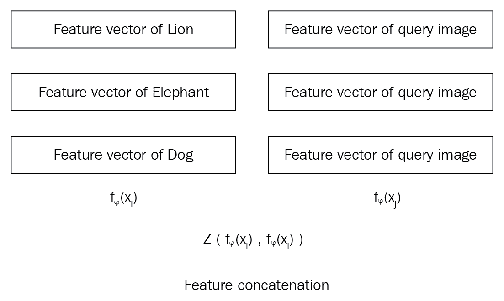

但是我们如何衡量这种关联性呢？ 这就是为什么我们使用关系函数`g[φ]`的原因。 我们将这些组合的特征向量传递给关系函数，该函数将生成从 0 到 1 的关系得分，代表支持集`x[i]`中的样本与查询集`x[j]`中的样本之间的相似性。

以下等式说明了我们如何计算关系网络中的关系得分：

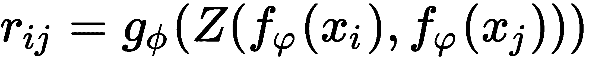

在该等式中，`r[ij]`表示表示在支持集中的每个类别和查询图像之间的相似性的关系分数。 由于我们在支持集中有 3 个类别，在查询集中有 1 个图像，因此我们将获得 3 个分数，表明支持集中的所有 3 个类别与查询图像的相似程度。

下图显示了在一次学习设置中关系网络的整体表示：

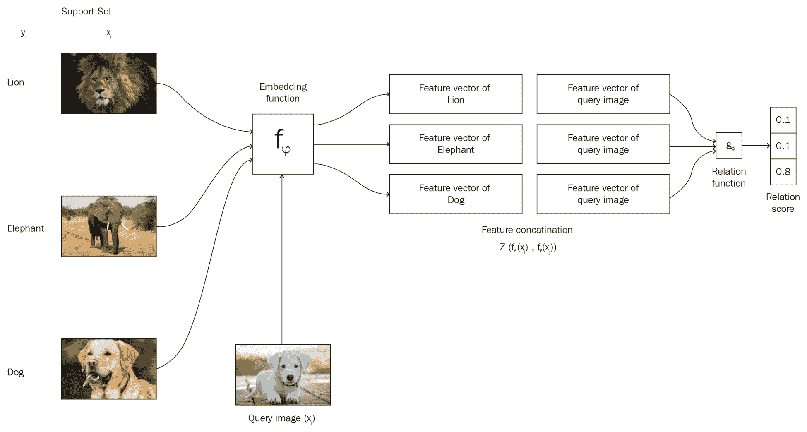

# 几次学习中的关系网络

我们已经看到了如何拍摄属于支持集中每个类别的单个图像，并在关系网络的单次学习设置中将它们与查询集中图像的关系进行比较。 但是，在几次学习设置中，每个类将有多个数据点。 我们如何使用嵌入函数在此处学习特征表示？

假设我们有一个支持集，每个类包含一个以上的图像，如下图所示：

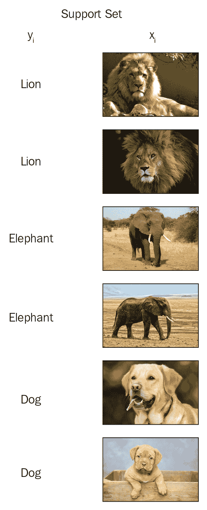

在这种情况下，我们将学习支持集中每个点的嵌入，并对属于每个类的所有数据点进行元素逐级添加。 因此，我们将为每个类都有嵌入，这是该类中所有数据点的逐元素求和的嵌入：

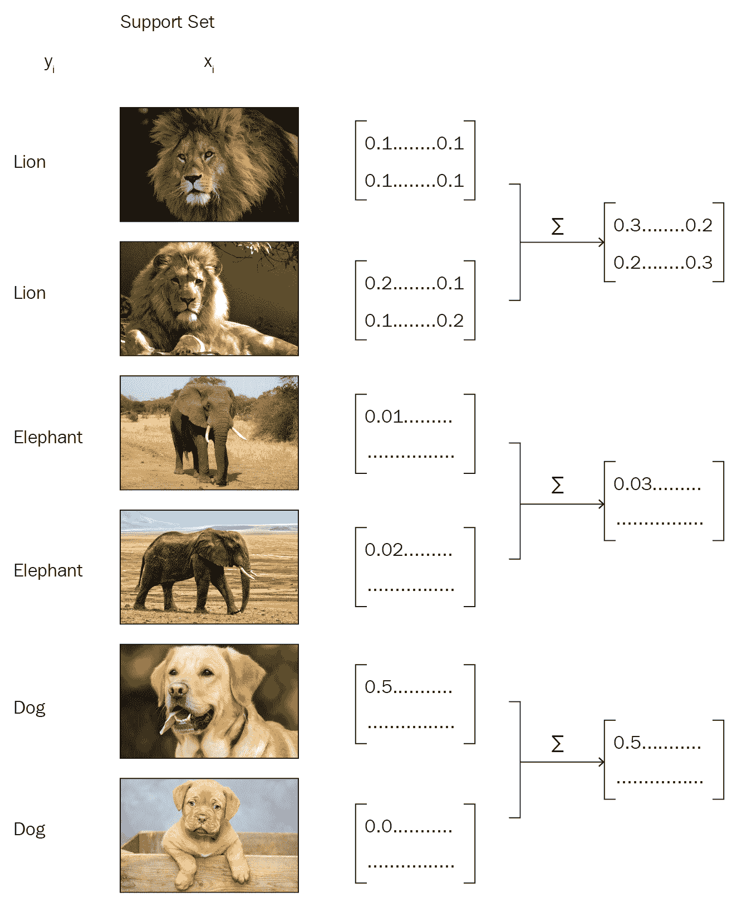

我们可以像往常一样使用嵌入函数来提取查询图像的特征向量。 接下来，我们使用连接运算符`Z`组合支持和查询集的特征向量。 我们执行级联，然后将级联的特征向量输入到关系函数并获得关系得分，该关系得分表示支持集和查询集中每个类之间的相似性。

下图显示了关系网络在几次学习设置中的整体表示：

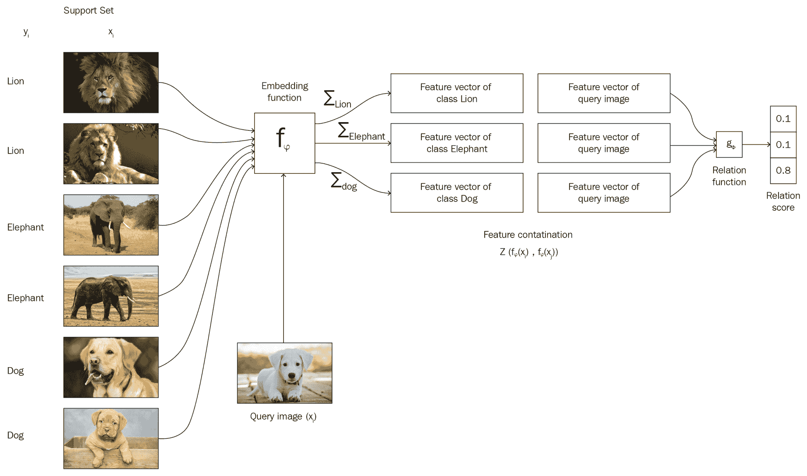

# 零次学习中的关系网络

既然我们已经了解了如何在单发和少发学习任务中使用关系网络，我们将看到如何在零发学习设置中使用关系网络，在这种情况下，每个类别下都没有任何数据点。 但是，在零射击学习中，我们将具有元信息，该元信息是有关每个类的属性的信息，并将被编码到语义向量`v[c]`中，其中下标`c`表示类。

我们没有使用单个嵌入函数来学习支持和查询集的嵌入，而是分别使用了两个不同的嵌入函数`f[φ1]`和`f[φ2]`。 首先，我们将使用`f[φ1]`学习语义向量`v[c]`的嵌入，并使用`f[φ2]`学习查询集`x[j]`的嵌入。 现在，我们将使用连接操作`Z`来连接这些嵌入：

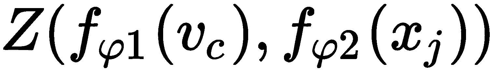

然后，我们将此结果馈入关联函数并计算关联分数，如下所示：

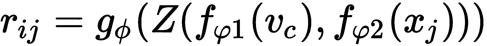

# 损失函数

关系网络的损失函数是什么？ 我们将使用**均方误差**（**MSE**）作为损失函数。 尽管这是一个分类问题，而 MSE 并不是分类问题的标准度量，但关系网络的作者表示，由于我们正在预测关系得分，因此可以将其视为回归问题。 尽管如此，对于基本事实，我们只能自动生成`{0, 1}`目标。

因此，我们的损失函数可以表示为：


其中`φ, φ`分别是我们嵌入函数`f`和关联函数`g`的参数。

# 使用 TensorFlow 建立关系网络

关系函数非常简单，对吧？ 通过在 TensorFlow 中实现一个关系网络，我们将更好地理解关系网络。

[您还可以在此处查看 Jupyter 笔记本中可用的代码并进行解释](https://github.com/sudharsan13296/Hands-On-Meta-Learning-With-Python/blob/master/04.%20Relation%20and%20Matching%20Networks%20Using%20Tensorflow/4.5%20Building%20Relation%20Network%20Using%20Tensorflow.ipynb)。

首先，我们导入所有必需的库：

```py
import tensorflow as tf
import numpy as np
```

我们将随机生成数据点。 假设我们的数据集中有两个类； 我们将为这些类别中的每一个随机生成约 1,000 个数据点：

```py
classA = np.random.rand(1000,18)
ClassB = np.random.rand(1000,18)
```

我们通过结合以下两个类来创建数据集：

```py
data = np.vstack([classA, ClassB])
```

现在，我们设置标签； 我们为`classA`分配`1`标签，为`classB`分配`0`标签：

```py
label = np.vstack([np.ones((len(classA),1)),np.zeros((len(ClassB),1))])
```

因此，我们的数据集将有 2,000 条记录：

```py
data.shape
(2000, 18)
```

现在，我们将为支持和查询集定义占位符：

```py
xi = tf.placeholder(tf.float32, [None, 9])
xj = tf.placeholder(tf.float32, [None, 9])
```

定义`y`标签的占位符，如下所示：

```py
y = tf.placeholder(tf.float32, [None, 1]) 
```

现在，我们将定义我们的嵌入函数，该函数将学习支持和查询集的嵌入。 我们将使用普通的前馈网络作为嵌入函数：

```py
def embedding_function(x):

    weights = tf.Variable(tf.truncated_normal([9,1]))
    bias = tf.Variable(tf.truncated_normal([1]))

    a = (tf.nn.xw_plus_b(x,weights,bias))
    embeddings = tf.nn.relu(a)

    return embeddings
```

我们计算支持集的嵌入量：

```py
f_xi = embedding_function(xi)
```

我们计算查询集的嵌入量：

```py
f_xj = embedding_function(xj)
```

现在我们已经计算了嵌入并有了特征向量，我们将支持集和查询集特征向量结合起来：

```py
Z = tf.concat([f_xi,f_xj],axis=1)
```

我们将关系函数定义为具有 ReLU 激活的三层神经网络：

```py
def relation_function(x):
    w1 = tf.Variable(tf.truncated_normal([2,3]))
    b1 = tf.Variable(tf.truncated_normal([3]))

    w2 = tf.Variable(tf.truncated_normal([3,5]))
    b2 = tf.Variable(tf.truncated_normal([5]))

    w3 = tf.Variable(tf.truncated_normal([5,1]))
    b3 = tf.Variable(tf.truncated_normal([1]))

    #layer1
    z1 = (tf.nn.xw_plus_b(x,w1,b1))
    a1 = tf.nn.relu(z1)

    #layer2
    z2 = tf.nn.xw_plus_b(a1,w2,b2)
    a2 = tf.nn.relu(z2)

    #layer3
    z3 = tf.nn.xw_plus_b(z2,w3,b3)

    #output
    y = tf.nn.sigmoid(z3)

    return y
```

现在，我们将支持集和查询集的连接特征向量传递给关系函数，并获得关系得分：

```py
relation_scores = relation_function(Z)
```

我们将`loss_function`计算为 MSE，即`relation_scores`与实际`y`值之间的`squared_difference`：

```py
loss_function = tf.reduce_mean(tf.squared_difference(relation_scores,y))
```

我们可以使用`AdamOptimizer`将损失降到最低：

```py
optimizer = tf.train.AdamOptimizer(0.1)
train = optimizer.minimize(loss_function)
```

现在，让我们开始 TensorFlow 会话：

```py
sess = tf.InteractiveSession()
sess.run(tf.global_variables_initializer())
```

现在，我们随机抽取支持集`xi`和查询集`xj`的数据点，并训练网络：

```py
for episode in range(1000):
    _, loss_value = sess.run([train, loss_function], 
                             feed_dict={xi:data[:,0:9]+np.random.randn(*np.shape(data[:,0:9]))*0.05,
                                        xj:data[:,9:]+np.random.randn(*np.shape(data[:,9:]))*0.05,
                                        y:label})
    if episode % 100 == 0:
        print("Episode {}: loss {:.3f} ".format(episode, loss_value))
```

我们可以看到如下输出：

```py
Episode 0: loss 0.495 
Episode 100: loss 0.250 
Episode 200: loss 0.250 
Episode 300: loss 0.250 
Episode 400: loss 0.250 
Episode 500: loss 0.250 
Episode 600: loss 0.250 
Episode 700: loss 0.250 
Episode 800: loss 0.250 
Episode 900: loss 0.250 
```

# 匹配网络

匹配网络是 Google 的 DeepMind 团队发布的另一种简单高效的一次学习算法。 它甚至可以为数据集中未观察到的类生成标签。

假设我们有一个支持集`S`，其中包含`K`示例作为`(x1, y1), (x2, y2), ..., (xk, yk)`。 给定查询点（一个新的看不见的示例）`x_hat`时，匹配网络通过将其与支持集进行比较来预测`x_hat`的类别。

我们可以将其定义为`P(y_hat | x_hat, S)`，其中`P`是参数化神经网络，`y_hat`是查询点的预测类，`x_hat`和`S`是支持集。 `P(y_hat | x_hat, S)`将返回`x_hat`属于数据集中每个类别的概率。 然后，我们选择`x_hat`的类别作为可能性最高的类别。 但是，这到底如何工作？ 如何计算此概率？ 让我们现在看看。

查询点`x_hat`的输出`y_hat`可以预测如下：

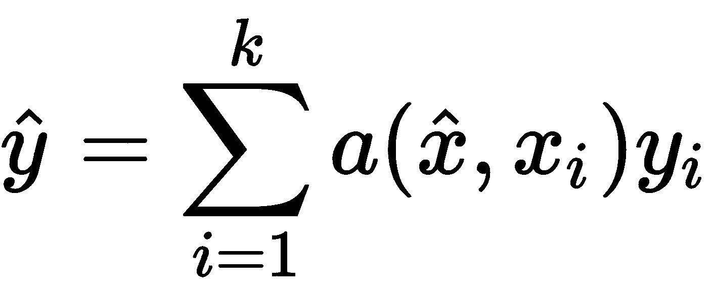

让我们破译这个方程式。 `x[i]`和`y[i]`是支持集的输入和标签。 `x_hat`是查询输入，即我们要预测标签的输入。 `a`是`x_hat`和`x[i]`之间的注意力机制。 但是，我们该如何进行关注呢？ 在这里，我们使用一种简单的注意机制，即`x_hat`和`x[i]`之间的余弦距离上的 softmax 函数（即`a(·, ·) = softmax(cosine(·, ·))`）。

我们无法直接计算原始输入`x_hat`和`x[i]`之间的余弦距离。 因此，首先，我们将学习它们的嵌入并计算嵌入之间的余弦距离。 我们使用两种不同的嵌入`f`和`g`来分别学习查询输入`x_hat`和支持集输入`x[i]`的嵌入。 我们将在接下来的部分中详细了解`f`和`g`这两个嵌入函数。

因此，我们可以如下重写注意力方程：

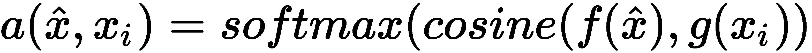

我们可以将前面的等式重写如下：

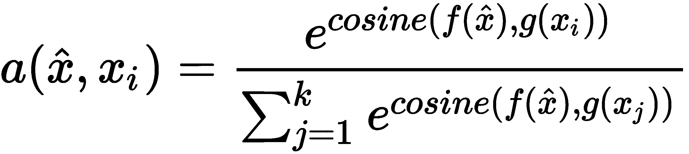

因此，在计算注意力矩阵`a(x_hat, x[i])`之后，我们将注意力矩阵与支持集标签`y[i]`相乘。 但是，如何将支持集标签与注意力矩阵相乘呢？ 首先，我们将支持集标签转换为单热编码值，然后将它们与我们的注意力矩阵相乘，结果，我们获得了`y_hat`属于支持集中每个类的概率。 然后，我们应用 argmax 并选择`y_hat`作为具有最大概率值的那个。

您是否还不清楚匹配网络？ 看下图； 如您所见，我们的支持集中有 3 个类，即`{Lion, Eleph, Dog}`，还有一个新的查询图像`x_hat`。 首先，将支持集提供给嵌入函数`g`，将查询图像提供给嵌入函数`f`，然后学习它们的嵌入并计算它们之间的余弦距离； 然后，我们在这个余弦距离上施加 softmax 注意。 然后，将注意力矩阵与一键编码支持集标签相乘，得到概率，然后选择`y_hat`作为概率最高的那个。 如下图所示，查询集图像是一头大象，我们在索引 1 处的概率很高，因此我们将`y_hat`的类别预测为 1（大象）：

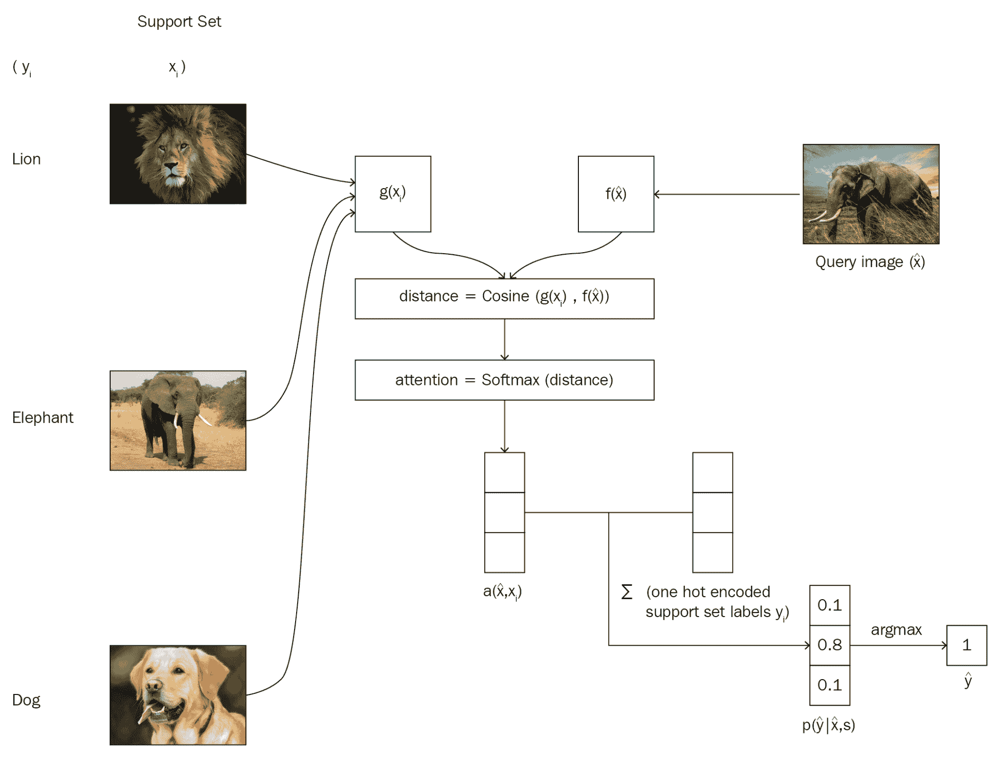

# 嵌入函数

我们了解到，我们使用两个嵌入函数`f`和`g`分别学习`x_hat`和`y_hat`的嵌入。 现在，我们将确切地看到这两个函数如何学习嵌入。

# 支持集嵌入函数（`g`）

我们使用嵌入函数`g`来学习支持集的嵌入。 我们使用双向 LSTM 作为我们的嵌入函数`g`。

我们可以如下定义嵌入函数`g`：

```py
def g(X):

    #forward cell
    forward_cell = rnn.BasicLSTMCell(32)

    #backward cell
    backward_cell = rnn.BasicLSTMCell(32)

    #bidirectional LSTM
    outputs, state_forward, state_backward = rnn.static_bidirectional_rnn(forward_cell, backward_cell, X, dtype=tf.float32)

    return tf.add(tf.stack(X), tf.stack(outputs))
```

# 查询集嵌入函数（`f`）

我们使用嵌入函数`f`来学习查询点`x_hat`的嵌入。 我们使用 LSTM 作为编码函数。 与`x_hat`作为输入一起，我们还将传递支持集嵌入的嵌入`g(x)`，还将传递另一个名为`K`的参数，该参数定义了处理步骤的数量。 让我们逐步了解如何计算查询集嵌入。

首先，我们将初始化 LSTM 单元：

```py
cell = rnn.BasicLSTMCell(64)
previous_state = cell.zero_state(batch_size, tf.float32) 
```

然后，对于处理步骤数，我们执行以下操作：

```py
for step in xrange(K):
```

我们通过将查询集`x_hat`馈送到 LSTM 单元来计算其嵌入：

```py
     output, state = cell(XHat, previous_state) 
     h_k = tf.add(output, XHat)
```

现在，我们对支持集嵌入（即`g_embedings`）执行 softmax 注意。 它可以帮助我们避免不必要的元素：

```py
     content_based_attention = tf.nn.softmax(tf.multiply(previous_state[1], g_embedding)) 
     r_k = tf.reduce_sum(tf.multiply(content_based_attention, g_embedding), axis=0) 
```

我们更新`previous_state`，并在许多处理步骤`K`中重复这些步骤：

```py
    previous_state = rnn.LSTMStateTuple(state[0], tf.add(h_k, r_k))
```

计算`f_embeddings`的完整代码如下：

```py
def f(XHat, g_embedding, K):

    cell = rnn.BasicLSTMCell(64)
    previous_state = cell.zero_state(batch_size, tf.float32) 

    for step in xrange(K):
        output, state = cell(XHat, previous_state) 

        h_k = tf.add(output, XHat) 

        #Soft max attention
        content_based_attention = tf.nn.softmax(tf.multiply(previous_state[1], g_embedding)) 
        r_k = tf.reduce_sum(tf.multiply(content_based_attention, g_embedding), axis=0) 

        previous_state = rnn.LSTMStateTuple(state[0], tf.add(h_k, r_k))

    return output
```

# 匹配网络的架构

下图显示了匹配网络的整体流程，它与我们已经看到的图像不同。 您会注意到如何分别通过嵌入函数`g`和`f`计算支持集`x[i]`和查询集`y[i]`。 如您所见，嵌入函数`f`将查询集以及支持集嵌入作为输入：

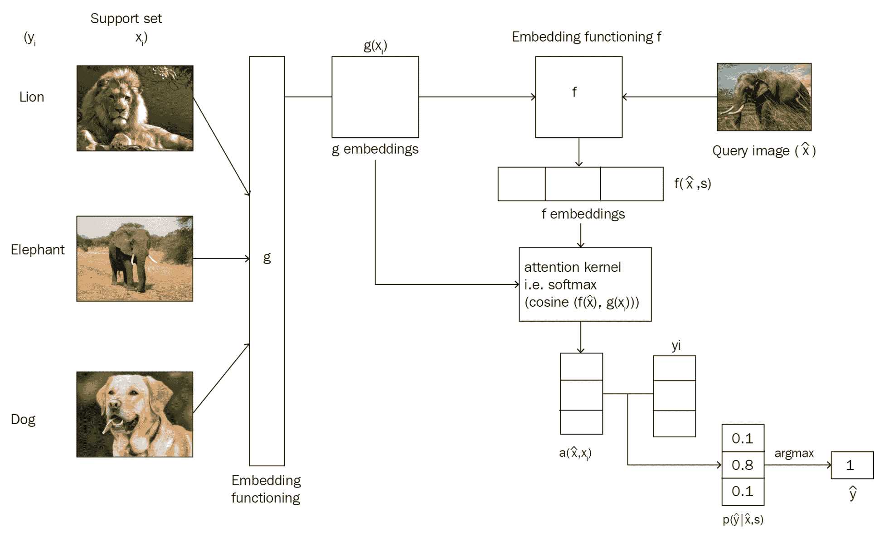

# TensorFlow 中的匹配网络

现在，我们将逐步了解如何在 TensorFlow 中构建匹配的网络。 我们将在最后看到最终代码。

首先，我们导入库：

```py
import tensorflow as tf
slim = tf.contrib.slim
rnn = tf.contrib.rnn
```

现在，我们定义一个名为`Matching_network`的类，在其中定义我们的网络：

```py
class Matching_network():
```

我们定义`__init__`方法，在其中初始化所有变量：

```py

    def __init__(self, lr, n_way, k_shot, batch_size=32):

        #placeholder for support set
        self.support_set_image = tf.placeholder(tf.float32, [None, n_way * k_shot, 28, 28, 1])
        self.support_set_label = tf.placeholder(tf.int32, [None, n_way * k_shot, ])

        #placeholder for query set
        self.query_image = tf.placeholder(tf.float32, [None, 28, 28, 1])
        self.query_label = tf.placeholder(tf.int32, [None, ])
```

假设我们的支持集和查询集包含图片。 在将此原始图像提供给嵌入函数之前，首先，我们将使用卷积网络从图像中提取特征，然后将支持集和查询集的提取特征提供给嵌入函数`g`和`f`。

因此，我们将定义一个名为`image_encoder`的函数，该函数用于对图像中的特征进行编码。 我们使用具有最大池化操作的四层卷积网络作为图像编码器：

```py

   def image_encoder(self, image):

        with slim.arg_scope([slim.conv2d], num_outputs=64, kernel_size=3, normalizer_fn=slim.batch_norm):
            #conv1
            net = slim.conv2d(image)
            net = slim.max_pool2d(net, [2, 2])

            #conv2
            net = slim.conv2d(net)
            net = slim.max_pool2d(net, [2, 2])

            #conv3
            net = slim.conv2d(net)
            net = slim.max_pool2d(net, [2, 2])

            #conv4
            net = slim.conv2d(net)
            net = slim.max_pool2d(net, [2, 2])

        return tf.reshape(net, [-1, 1 * 1 * 64])
```

现在，我们定义嵌入函数； 我们已经看到在“嵌入函数”部分中如何定义嵌入函数`f`和`g`。 因此，我们可以直接定义它们如下：

```py
#embedding function for extracting support set embeddings
    def g(self, x_i):

        forward_cell = rnn.BasicLSTMCell(32)
        backward_cell = rnn.BasicLSTMCell(32)
        outputs, state_forward, state_backward = rnn.static_bidirectional_rnn(forward_cell, backward_cell, x_i, dtype=tf.float32)

        return tf.add(tf.stack(x_i), tf.stack(outputs))

    #embedding function for extracting query set embeddings
    def f(self, XHat, g_embedding):
        cell = rnn.BasicLSTMCell(64)
        prev_state = cell.zero_state(self.batch_size, tf.float32) 

        for step in xrange(self.processing_steps):
            output, state = cell(XHat, prev_state)

            h_k = tf.add(output, XHat) 

            content_based_attention = tf.nn.softmax(tf.multiply(prev_state[1], g_embedding)) 

            r_k = tf.reduce_sum(tf.multiply(content_based_attention, g_embedding), axis=0) 

            prev_state = rnn.LSTMStateTuple(state[0], tf.add(h_k, r_k))

        return output
```

现在，我们定义一个名为`cosine_similarity`的函数，用于学习支持集和查询集嵌入之间的余弦相似度：

```py
    def cosine_similarity(self, target, support_set):
        target_normed = target
        sup_similarity = []
        for i in tf.unstack(support_set):
            i_normed = tf.nn.l2_normalize(i, 1) 
            similarity = tf.matmul(tf.expand_dims(target_normed, 1), tf.expand_dims(i_normed, 2)) 
            sup_similarity.append(similarity)

        return tf.squeeze(tf.stack(sup_similarity, axis=1))
```

最后，我们使用一个名为`train`的函数来执行我们的训练操作-让我们逐步看一下：

```py
 def train(self, support_set_image, support_set_label, query_image):  
```

首先，我们使用图像编码器对支持集图像的特征进行编码：

```py
    support_set_image_encoded = [self.image_encoder(i) for i in tf.unstack(support_set_image, axis=1)]
```

然后，我们还将使用图像编码器对查询集图像的特征进行编码：

```py
    query_image_encoded = self.image_encoder(query_image)
```

接下来，我们将使用嵌入函数`g`了解支持集的嵌入：

```py
     g_embedding = self.g(support_set_image_encoded) 
```

同样，我们还将使用嵌入函数`f`了解查询集的嵌入内容：

```py
    f_embedding = self.f(query_image_encoded, g_embedding) 
```

现在，我们在这两个嵌入之间计算`cosine_similarity`：

```py
    embeddings_similarity = self.cosine_similarity(f_embedding, g_embedding) 
```

然后，我们对这种相似性进行 softmax 注意：

```py
    attention = tf.nn.softmax(embeddings_similarity)
```

我们通过将注意力矩阵乘以一热编码的支持集标签来预测查询集标签：

```py
    y_hat = tf.matmul(tf.expand_dims(attention, 1), tf.one_hot(support_set_label, self.n_way))
```

接下来，我们得到`probabilities`：

```py
    probabilities = tf.squeeze(y_hat)  
```

我们选择概率最高的索引作为查询图像的类别：

```py
    predictions = tf.argmax(self.logits, 1)
```

最后，我们定义损失函数； 我们使用 softmax 交叉熵作为我们的损失函数：

```py
    loss_function = tf.losses.sparse_softmax_cross_entropy(label, self.probabilities)
```

我们使用`AdamOptimizer`最小化损失函数：

```py
    tf.train.AdamOptimizer(self.lr).minimize(self.loss_op)
```

现在，我们将看到整个匹配网络的最终代码：

```py

class Matching_network():

    #initialize all the variables
    def __init__(self, lr, n_way, k_shot, batch_size=32):

        #placeholder for support set
        self.support_set_image = tf.placeholder(tf.float32, [None, n_way * k_shot, 28, 28, 1])
        self.support_set_label = tf.placeholder(tf.int32, [None, n_way * k_shot, ])

        #placeholder for query set
        self.query_image = tf.placeholder(tf.float32, [None, 28, 28, 1])
        self.query_label = tf.placeholder(tf.int32, [None, ])           

    #encoder function for extracting features from the image
    def image_encoder(self, image):

        with slim.arg_scope([slim.conv2d], num_outputs=64, kernel_size=3, normalizer_fn=slim.batch_norm):
            #conv1
            net = slim.conv2d(image)
            net = slim.max_pool2d(net, [2, 2])

            #conv2
            net = slim.conv2d(net)
            net = slim.max_pool2d(net, [2, 2])

            #conv3
            net = slim.conv2d(net)
            net = slim.max_pool2d(net, [2, 2])

            #conv4
            net = slim.conv2d(net)
            net = slim.max_pool2d(net, [2, 2])

        return tf.reshape(net, [-1, 1 * 1 * 64])

    #embedding function for extracting support set embeddings
    def g(self, x_i):

        forward_cell = rnn.BasicLSTMCell(32)
        backward_cell = rnn.BasicLSTMCell(32)
        outputs, state_forward, state_backward = rnn.static_bidirectional_rnn(forward_cell, backward_cell, x_i, dtype=tf.float32)

        return tf.add(tf.stack(x_i), tf.stack(outputs))

    #embedding function for extracting query set embeddings
    def f(self, XHat, g_embedding):
        cell = rnn.BasicLSTMCell(64)
        prev_state = cell.zero_state(self.batch_size, tf.float32) 

        for step in xrange(self.processing_steps):
            output, state = cell(XHat, prev_state)

            h_k = tf.add(output, XHat) 

            content_based_attention = tf.nn.softmax(tf.multiply(prev_state[1], g_embedding)) 

            r_k = tf.reduce_sum(tf.multiply(content_based_attention, g_embedding), axis=0) 

            prev_state = rnn.LSTMStateTuple(state[0], tf.add(h_k, r_k))

        return output

    #cosine similarity function for calculating cosine similarity between support set and query set embeddings
    def cosine_similarity(self, target, support_set):
        target_normed = target
        sup_similarity = []
        for i in tf.unstack(support_set):
            i_normed = tf.nn.l2_normalize(i, 1) 
            similarity = tf.matmul(tf.expand_dims(target_normed, 1), tf.expand_dims(i_normed, 2)) 
            sup_similarity.append(similarity)

        return tf.squeeze(tf.stack(sup_similarity, axis=1)) 

    def train(self, support_set_image, support_set_label, query_image): 

        #encode the features of query set images using our image encoder
        query_image_encoded = self.image_encoder(query_image) 

        #encode the features of support set images using our image encoder
        support_set_image_encoded = [self.image_encoder(i) for i in tf.unstack(support_set_image, axis=1)]

        #generate support set embeddings using our embedding function g
        g_embedding = self.g(support_set_image_encoded) 

        #generate query set embeddings using our embedding function f
        f_embedding = self.f(query_image_encoded, g_embedding) 

        #calculate the cosine similarity between both of these embeddings
        embeddings_similarity = self.cosine_similarity(f_embedding, g_embedding) 

        #perform attention over the embedding similarity
        attention = tf.nn.softmax(embeddings_similarity)

        #now predict query set label by multiplying attention matrix with one hot encoded support set labels
        y_hat = tf.matmul(tf.expand_dims(attention, 1), tf.one_hot(support_set_label, self.n_way))

        #get the probabilities 
        probabilities = tf.squeeze(y_hat) 

        #select the index which has the highest probability as a class of query image
        predictions = tf.argmax(self.probabilities, 1)

        #we use softmax cross entropy loss as our loss function
        loss_function = tf.losses.sparse_softmax_cross_entropy(label, self.probabilities)

        #we minimize the loss using adam optimizer
        tf.train.AdamOptimizer(self.lr).minimize(self.loss_op)
```

# 总结

在本章中，我们学习了在几次学习中如何使用匹配网络和关系网络。 我们看到了一个关系网络如何学习支持和查询集的嵌入，并将这些嵌入进行组合并将其馈送到关系函数以计算关系得分。 我们还看到了匹配的网络如何使用两种不同的嵌入函数来学习我们的支持集和查询集的嵌入，以及它如何预测查询集的类。

在下一章中，我们将通过存储和检索内存中的信息来学习神经图灵机和记忆增强型神经网络的工作方式。

# 问题

1.  关系网络中使用的特征有哪些不同类型？
2.  关系网络中的运算符`Z`是什么？
3.  关系函数是什么？
4.  关系网络的损失函数是什么？
5.  匹配网络中使用哪些不同类型的嵌入函数？
6.  如何在匹配网络中预测查询点的类别？

# 进一步阅读

*   [匹配网络](https://arxiv.org/pdf/1606.04080.pdf)
*   [关系网络](https://arxiv.org/pdf/1711.06025.pdf)