# 五、记忆增强神经网络

到目前为止，在前面的章节中，我们已经学习了几种基于距离的度量学习算法。 我们从连体网络开始，了解了连体网络如何学会区分两个输入，然后我们研究了原型网络以及原型网络的变体，例如高斯原型网络和半原型网络。 展望未来，我们探索了有趣的匹配网络和关系网络。

在本章中，我们将学习用于一次学习的**记忆增强神经网络**（**MANN**）。 在进入 MANN 之前，我们将了解他们的前身**神经图灵机**（**NTM**）。 我们将学习 NTM 如何使用外部存储器来存储和检索信息，并且还将看到如何使用 NTM 执行复制任务。

在本章中，我们将学习以下内容：

*   NTM
*   NTM 中的读写
*   寻址机制
*   使用 NTM 复制任务
*   MANN
*   MANN 中的读写

# NTM

NTM 是一种有趣的算法，能够存储和检索内存中的信息。 NTM 的想法是用外部存储器来增强神经网络-也就是说，它不是使用隐藏状态作为存储器，而是使用外部存储器来存储和检索信息。 NTM 的架构如下图所示：

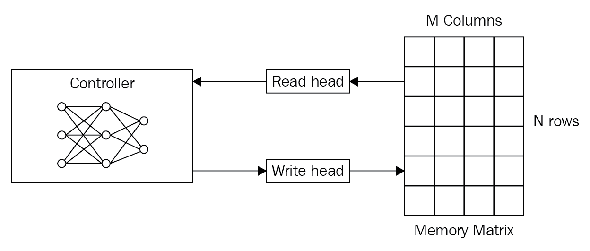

NTM 的重要组成部分如下：

*   **控制器**：这基本上是前馈神经网络或循环神经网络。 它从内存中读取和写入。
*   **内存**：我们将在其中存储信息的存储矩阵或存储库，或简称为存储。 内存基本上是由内存单元组成的二维矩阵。 存储器矩阵包含`N`行和`M`列。 使用控制器，我们可以从内存中访问内容。 因此，控制器从外部环境接收输入，并通过与存储矩阵进行交互来发出响应。
*   **读写头**：读写头是包含必须从其读取和写入的存储器地址的指针。

好的，但是我们如何从内存中访问信息？ 我们是否可以通过指定行索引和列索引来访问内存中的信息？ 我们可以。 但是问题在于，如果我们按索引访问信息，则无法使用梯度下降来训练 NTM，因为我们无法计算索引的梯度。 因此，NTM 的作者定义了使用控制器进行读写的模糊操作。 模糊操作将在某种程度上与内存中的所有元素进行交互。 基本上，它是一种关注机制，主要关注内存中对读/写很重要的特定位置，而忽略了对其他位置的关注。 因此，我们使用特殊的读取和写入操作来确定要聚焦在存储器上的哪个位置。 我们将在接下来的部分中探索更多有关读写操作的信息。

# 在 NTM 中读写

现在，我们将看到如何读取和写入内存矩阵。

# 读取操作

读取操作从内存中读取一个值。 但是，由于我们的存储矩阵中有许多存储块，我们需要选择从存储器中读取哪一个？ 这由权重向量确定。 权重向量指定内存中哪个区域比其他区域更重要。 我们使用一种注意力机制来获得该权重向量。 我们将在接下来的部分中进一步探讨如何精确计算此权重向量。 权重向量已归一化，这意味着其值的范围从零到一，并且值的总和等于一。 下图显示了长度的权重向量`N`：

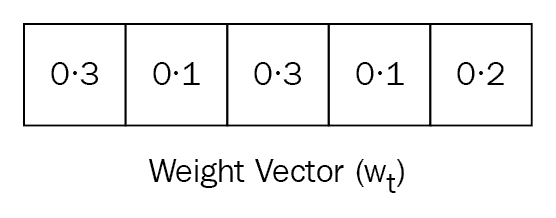

让我们用`w[t]`表示归一化权重向量，其中下标`t`表示时间，`w[t](i)`表示权重向量中的元素，其索引为`i`，和时间`t`：

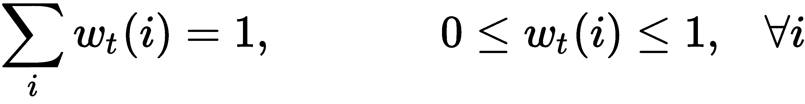

我们的存储矩阵由`N`行和`M`列组成，如下图所示。 让我们将`t`时的存储矩阵表示`M[t]`：

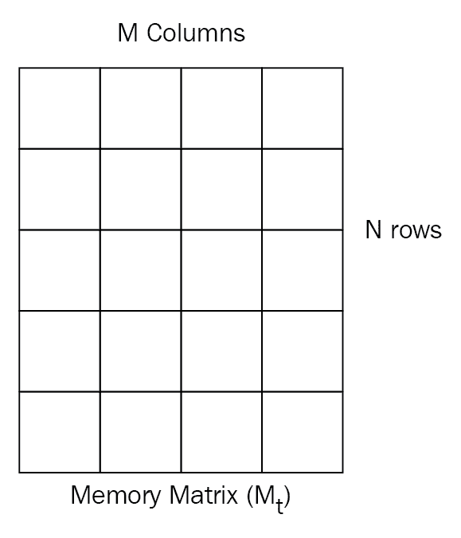

现在我们有了权重向量和存储矩阵，我们执行了存储矩阵`M[t]`和权重向量`w[t]`，以获取读取向量`r[t]`，如下图所示：

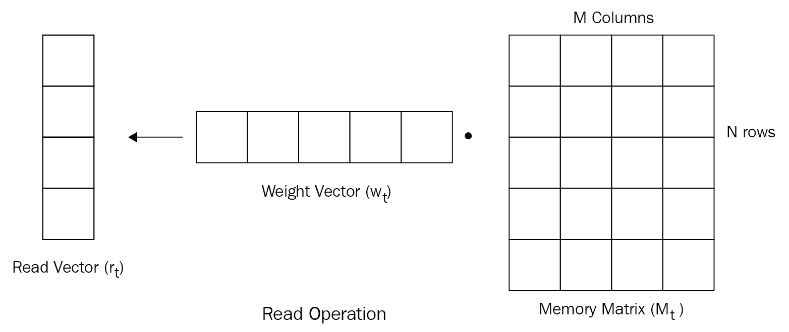

可以表示为以下形式：


如上图所示，我们具有`N`行和`M`列的存储矩阵，大小为`N`的权重向量包含所有`N`个位置。 执行这两个的线性组合，我们得到长度为`M`的读取向量。

# 写入操作

与读取操作不同，写入操作由两个称为擦除和添加操作的子操作组成，这两个子操作分别擦除旧信息并将新信息添加到存储器。

# 擦除操作

我们使用擦除操作来删除内存中不需要的信息。 执行擦除操作后，我们将拥有一个新的更新的存储矩阵，其中的存储器中的某些元素将被擦除。 我们如何擦除存储矩阵中特定单元的值？ 在这里，我们引入了另一种称为擦除向量`e[t]`的向量，其长度与权重向量`w[t]`相同。 擦除向量由 0s 和 1s 组成。

好的。 我们有一个擦除向量。 但是，我们如何擦除值并获取更新的存储矩阵？ 在上一步`M[t - 1]`中，我们将`(1 - w[t]e[t])`与我们的存储矩阵相乘，得到更新后的存储矩阵`M[t]*`。

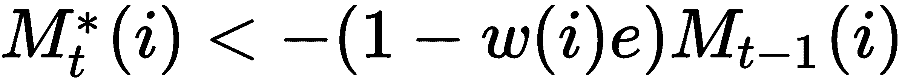

但这如何工作？ 仅当索引为`i`的权重元素和擦除元素都为 1 时，存储器中的特定元素才会被设置为 0，换言之，被擦除； 否则，它将保留自己的值。 例如，查看下图。 首先，我们将权重向量`w[t]`和擦除向量`w[t]`相乘：


然后，我们从中减去 1，即`(1 - w[t](i)e[t])`，然后得到一个新的向量，如下所示：

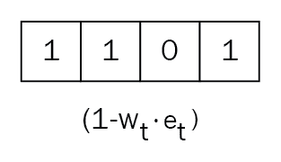

接下来，我们将`(1 - w[t]e[t])`与上一个时间步`M[t - 1]`的存储矩阵相乘，得到更新后的存储矩阵`M[t]*`：

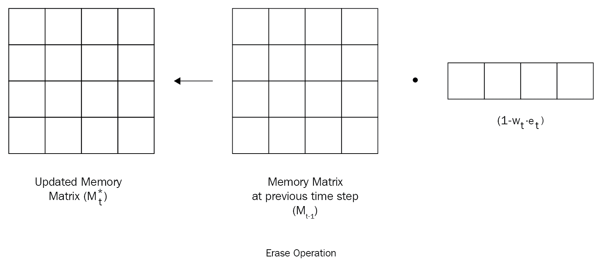

# 添加操作

完成擦除操作后，我们获得了更新的存储矩阵`M[t]*`，其中存储器中的某些元素将被擦除。 现在，我们要向存储矩阵中添加新信息。 我们该怎么做？ 我们引入了另一个向量，称为加法向量`a[t]`，该向量具有要添加到存储器中的值。 我们将权重向量`w[t]`的元素相乘，然后将向量`a[t]`相加，然后将它们添加到内存中，即：

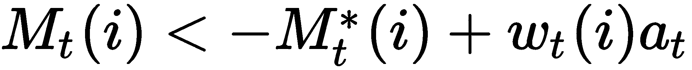

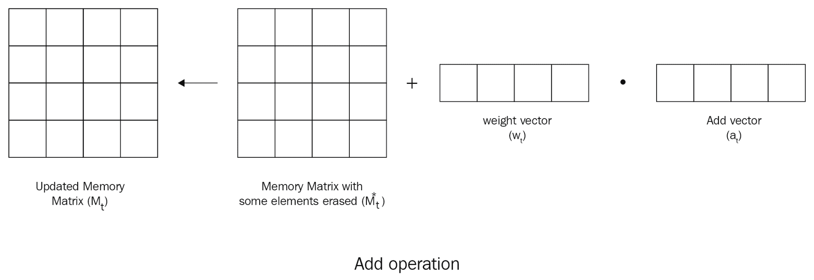

# 寻址机制

到目前为止，我们已经了解了如何执行读写操作，还了解了如何使用权重向量执行这些操作。 但是我们如何计算这个权重向量呢？ 我们使用注意力机制和不同的寻址方案来计算它。 我们使用两种寻址机制来访问内存中的信息：

*   基于内容的寻址
*   基于位置的寻址

# 基于内容的寻址

在基于内容的寻址中，我们基于相似性从内存中选择值。 控制器返回一个称为`k[t]`的键向量。 我们将这个关键向量`k[t]`与存储矩阵`M[t]`中的每一行进行比较，以了解相似性。 我们使用余弦相似度作为检查相似度的相似度度量，可以表示为：

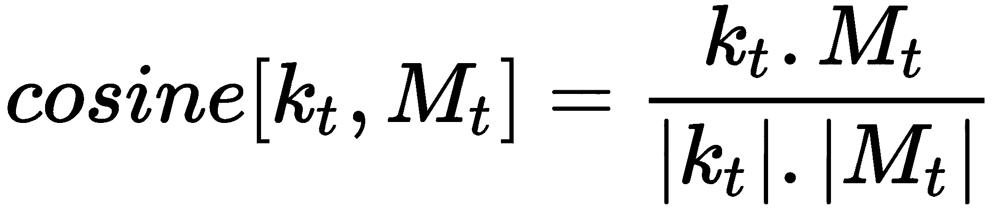

我们引入了一个称为`β`的新参数，称为键强度。 它决定了我们的权重向量应有多集中。 基于`β`的值，我们可以增加或减小焦点-也就是说，我们可以基于按键强度`β`的值将注意力转移到特定位置。 当`β`的值较低时，我们将同等地关注所有位置； 当`β`的值较高时，我们将重点放在特定位置。

因此，我们的权重向量变为：

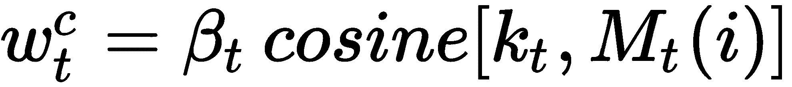

也就是说，键向量`k[t]`和存储矩阵`M[t]`之间的余弦相似度乘以键强度`β`。 `w[t]^c`中的上标`c`表示它们是基于内容的权重。 代替直接使用它，我们对权重应用 softmax。 因此，我们的最终权重如下：

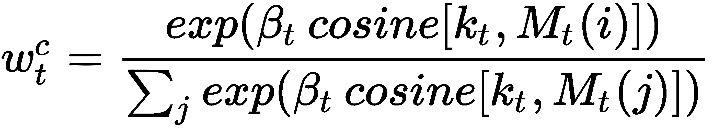

# 基于位置的寻址

与基于内容的寻址不同，在基于位置的寻址中，我们专注于位置而不是内容相似性。 它包括三个步骤：

1.  插值
2.  卷积移位
3.  锐化

# 插值

基于位置的寻址的第一步称为插值。 它用于决定我们应该使用在上一个时间步获得的权重`w[t - 1]`，还是使用通过基于内容的寻址获得的权重`w[t]^c`。 但是我们如何决定呢？ 我们使用一个新的标量参数`g[t]`，该参数用于确定应使用的权重。 `g[t]`的值可以为 0 或 1。

我们可以表示权重向量的计算如下：

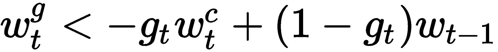

*   当`g[t]`的值为 0 时，我们的方程变为`w[t]^g < - w[t - 1]`，这意味着我们的权重向量是我们在上一个时间步获得的权重向量。
*   当`g[t]`的值为 1 时，我们的方程变为`w[t]^g < -w[t]^c`，这意味着我们的权重向量是我们通过基于内容的寻址获得的权重向量。

因此，`g[t]`的值用作在我们必须使用的权重之间进行切换的门。

# 卷积移位

下一步称为卷积移位。 用于移动头部位置。 即，它用于将焦点从一个位置转移到另一位置。 每个磁头发出一个称为移位权重`s[t]`的参数，该参数为我们提供了一个分布，在该分布上可以执行允许的整数移位。 例如，假设我们在 -1 和 1 之间进行了转换，那么`s[t]`的长度将变为 3，包括`{-1, 0, 1}`。

那么，这些转变究竟意味着什么？ 假设权重向量`w[t]^g`中有三个元素 -- 即`w[i - 1]^g, w[i - 2]^g, w[i - 3]^g`，而移位权重向量中有三个元素`s[t] = [-1, 0, 1]`。

移位 -1 表示我们将`w[t]^g`中的元素从左向右移动。 移位 0 将元素保持在相同位置，而移位+1 意味着我们将元素从右移到左。 在下图中可以看到：

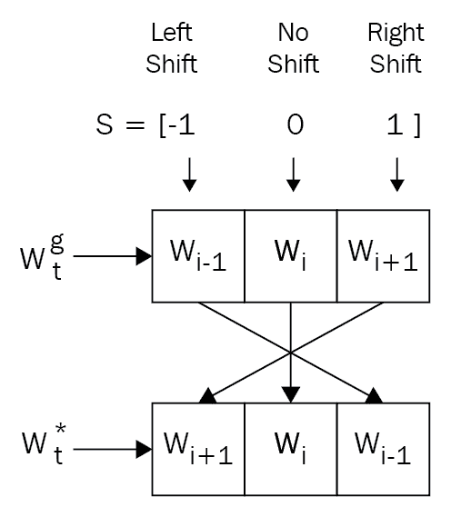

现在，看下面的图，其中我们有移位权重`s[t] = [1, 0, 0]`，这意味着我们执行了左移位，因为在其他位置移位值为 0：

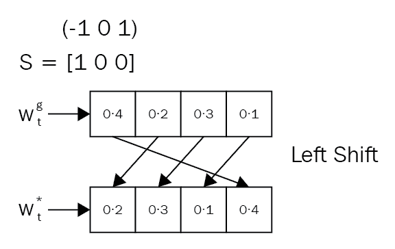

同样，当`s[t] = [0, 0, 1]`时，我们执行右移，因为在其他位置上的移位值为 0，如下图所示：

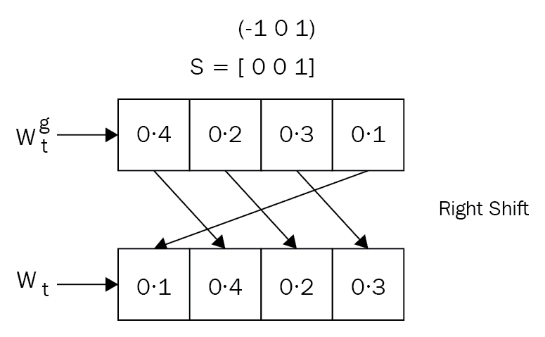

因此，以这种方式，我们对权重矩阵中的元素执行卷积移位。 如果我们将 0 到`N-1`个存储位置，则可以表示卷积移位如下：

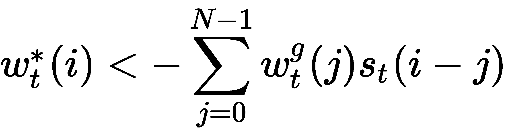

# 锐化

最后一步称为锐化。 卷积移位的结果是，权重`w[t]*`不会很尖锐，换句话说，由于移位，聚焦在单个位置的权重将分散到其他位置。 为了减轻这种影响，我们执行锐化。 我们使用一个称为`γ[t]`的新参数，该参数应大于或等于 1 以进行锐化，并且可以表示为：

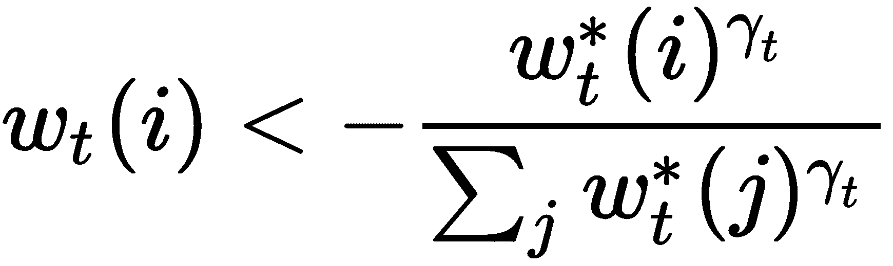

# 使用 NTM 执行复制任务

现在，我们将看到如何使用 NTM 执行复制任务。 复制任务的目的是了解 NTM 如何存储和调用任意长度的序列。 我们将为网络提供一个随机序列，以及一个指示序列结束的标记。 它必须学习输出给定的输入序列。 因此，网络会将输入序列存储在内存中，然后从内存中回读。 现在，我们将逐步了解如何执行复制任务，然后在最后看到整个最终代码。

[您还可以在此处查看 Jupyter 笔记本中提供的代码，并附带说明](https://github.com/sudharsan13296/Hands-On-Meta-Learning-With-Python/blob/master/05.%20Memory%20Augmented%20Networks/5.4%20Copy%20Task%20Using%20NTM.ipynb)。

首先，我们将了解如何实现 NTM 单元。 而不是查看整个代码，我们将逐行查看它。

我们定义`NTMCell`类，在其中实现整个 NTM 单元：

```py
class NTMCell():
```

首先，我们定义`init`函数，在其中初始化所有变量：

```py
    def __init__(self, rnn_size, memory_size, memory_vector_dim, read_head_num, write_head_num,
                 addressing_mode='content_and_location', shift_range=1, reuse=False, output_dim=None):

        #initialize all the variables
        self.rnn_size = rnn_size
        self.memory_size = memory_size
        self.memory_vector_dim = memory_vector_dim
        self.read_head_num = read_head_num
        self.write_head_num = write_head_num
        self.addressing_mode = addressing_mode
        self.reuse = reuse
        self.step = 0
        self.output_dim = output_dim
        self.shift_range = shift_range

        #initialize controller as the basic rnn cell
        self.controller = tf.nn.rnn_cell.BasicRNNCell(self.rnn_size)
```

接下来，我们定义`__call__`方法，在其中实现 NTM 操作：

```py
def __call__(self, x, prev_state):
```

我们通过将`x`输入与先前读取的向量列表组合来获得控制器输入：

```py
prev_read_vector_list = prev_state['read_vector_list'] 
prev_controller_state = prev_state['controller_state'] 

controller_input = tf.concat([x] + prev_read_vector_list, axis=1)
```

我们通过输入`controller_input`和`prev_controller_state`作为输入来构建控制器，即 RNN 单元：

```py
with tf.variable_scope('controller', reuse=self.reuse):
    controller_output, controller_state = self.controller(controller_input, prev_controller_state)
```

现在，我们初始化读写头：

```py
num_parameters_per_head = self.memory_vector_dim + 1 + 1 + (self.shift_range * 2 + 1) + 1
num_heads = self.read_head_num + self.write_head_num
total_parameter_num = num_parameters_per_head * num_heads + self.memory_vector_dim * 2 * self.write_head_num
```

接下来，我们初始化权重矩阵并进行偏置并使用前馈操作计算参数：

```py

with tf.variable_scope("o2p", reuse=(self.step > 0) or self.reuse):
    o2p_w = tf.get_variable('o2p_w', [controller_output.get_shape()[1], total_parameter_num],
                            initializer=tf.random_normal_initializer(mean=0.0, stddev=0.5))
    o2p_b = tf.get_variable('o2p_b', [total_parameter_num],
                            initializer=tf.random_normal_initializer(mean=0.0, stddev=0.5))
    parameters = tf.nn.xw_plus_b(controller_output, o2p_w, o2p_b)
```

```py

head_parameter_list = tf.split(parameters[:, :num_parameters_per_head * num_heads], num_heads, axis=1)
erase_add_list = tf.split(parameters[:, num_parameters_per_head * num_heads:], 2 * self.write_head_num, axis=1)
```

接下来，我们获得先前的权重向量和先前的内存：

```py
#previous weight vector
prev_w_list = prev_state['w_list'] 

#previous memory
prev_M = prev_state['M']

w_list = []
p_list = []
```

现在，我们将初始化一些用于寻址的重要参数：

```py
for i, head_parameter in enumerate(head_parameter_list):

    #key vector
    k = tf.tanh(head_parameter[:, 0:self.memory_vector_dim])

    #key strength(beta)
    beta = tf.sigmoid(head_parameter[:, self.memory_vector_dim]) * 10 

    #interpolation gate
    g = tf.sigmoid(head_parameter[:, self.memory_vector_dim + 1])

    #shift matrix
    s = tf.nn.softmax(
        head_parameter[:, self.memory_vector_dim + 2:self.memory_vector_dim + 2 + (self.shift_range * 2 + 1)]
    )

    #sharpening factor
    gamma = tf.log(tf.exp(head_parameter[:, -1]) + 1) + 1

    with tf.variable_scope('addressing_head_%d' % i):
        w = self.addressing(k, beta, g, s, gamma, prev_M, prev_w_list[i]) 

    w_list.append(w)
    p_list.append({'k': k, 'beta': beta, 'g': g, 's': s, 'gamma': gamma})
```

**读取操作**：

选择读取头，如下所示：

```py
read_w_list = w_list[:self.read_head_num]
```

我们知道`read`操作是权重和内存的线性组合：

```py
read_vector_list = []
for i in range(self.read_head_num): 

    #linear combination of the weights and memory
    read_vector = tf.reduce_sum(tf.expand_dims(read_w_list[i], dim=2) * prev_M, axis=1)
    read_vector_list.append(read_vector)
```

**写入操作**：

与读取操作不同，写入操作涉及擦除和添加两个步骤。

选择要写入的头，如下所示：

```py
write_w_list = w_list[self.read_head_num:]

#update the memory
M = prev_M
```

执行擦除和添加操作：

```py
for i in range(self.write_head_num):

    #the erase vector will be multipled with weight vector to denote which location to erase or keep unchanged
    w = tf.expand_dims(write_w_list[i], axis=2)
    erase_vector = tf.expand_dims(tf.sigmoid(erase_add_list[i * 2]), axis=1)

    #next we perform the add operation
    add_vector = tf.expand_dims(tf.tanh(erase_add_list[i * 2 + 1]), axis=1)
    M = M * (tf.ones(M.get_shape()) - tf.matmul(w, erase_vector)) + tf.matmul(w, add_vector)
```

获取控制器输出：

```py
if not self.output_dim:
    output_dim = x.get_shape()[1]
else:
    output_dim = self.output_dim

with tf.variable_scope("o2o", reuse=(self.step > 0) or self.reuse):
    o2o_w = tf.get_variable('o2o_w', [controller_output.get_shape()[1], output_dim],
                            initializer=tf.random_normal_initializer(mean=0.0, stddev=0.5))
    o2o_b = tf.get_variable('o2o_b', [output_dim],
                            initializer=tf.random_normal_initializer(mean=0.0, stddev=0.5))
    NTM_output = tf.nn.xw_plus_b(controller_output, o2o_w, o2o_b)

state = {
    'controller_state': controller_state,
    'read_vector_list': read_vector_list,
    'w_list': w_list,
    'p_list': p_list,
    'M': M
}

self.step += 1
```

**寻址机制**：

众所周知，我们使用两种寻址方式：基于内容的寻址和基于位置的寻址。

**基于内容的寻址**：

计算关键向量和存储矩阵之间的余弦相似度：

```py
k = tf.expand_dims(k, axis=2)
inner_product = tf.matmul(prev_M, k)

k_norm = tf.sqrt(tf.reduce_sum(tf.square(k), axis=1, keepdims=True))
M_norm = tf.sqrt(tf.reduce_sum(tf.square(prev_M), axis=2, keepdims=True))
norm_product = M_norm * k_norm

K = tf.squeeze(inner_product / (norm_product + 1e-8))   
```

现在，我们根据相似度和关键强度（`beta`）生成归一化的权重向量。 `beta`用于调整头部聚焦的精度：

```py
K_amplified = tf.exp(tf.expand_dims(beta, axis=1) * K)
w_c = K_amplified / tf.reduce_sum(K_amplified, axis=1, keepdims=True) # eq (5)
```

**基于位置的寻址**：

基于位置的寻址涉及其他三个步骤：

1.  插值
2.  卷积移位
3.  锐化

**插值**：

这用于决定我们应该使用在上一个时间步获得的权重`prev_w`还是使用通过基于内容的寻址获得的权重`w_c`。 但是我们如何决定呢？ 我们使用一个新的标量参数`g`，该参数用于确定应使用的权重：

```py
g = tf.expand_dims(g, axis=1)
w_g = g * w_c + (1 - g) * prev_w 
```

**卷积移位**：

插值后，我们执行卷积移位，以便控制器可以专注于其他行：

```py
s = tf.concat([s[:, :self.shift_range + 1],
               tf.zeros([s.get_shape()[0], self.memory_size - (self.shift_range * 2 + 1)]),
               s[:, -self.shift_range:]], axis=1)

t = tf.concat([tf.reverse(s, axis=[1]), tf.reverse(s, axis=[1])], axis=1)

s_matrix = tf.stack(
    [t[:, self.memory_size - i - 1:self.memory_size * 2 - i - 1] for i in range(self.memory_size)],
    axis=1
)

w_ = tf.reduce_sum(tf.expand_dims(w_g, axis=1) * s_matrix, axis=2) # eq (8)

```

**锐化**：

最后，我们执行锐化操作以防止偏移的权重向量模糊：

```py
w_sharpen = tf.pow(w_, tf.expand_dims(gamma, axis=1))
w = w_sharpen / tf.reduce_sum(w_sharpen, axis=1, keepdims=True)
```

接下来，我们定义一个名为`zero_state`的函数，用于初始化控制器的所有状态，读取向量，权重和内存：

```py

    def zero_state(self, batch_size, dtype):
        def expand(x, dim, N):
            return tf.concat([tf.expand_dims(x, dim) for _ in range(N)], axis=dim)

        with tf.variable_scope('init', reuse=self.reuse):
            state = {
                'controller_state': expand(tf.tanh(tf.get_variable('init_state', self.rnn_size,
                                            initializer=tf.random_normal_initializer(mean=0.0, stddev=0.5))),
                                  dim=0, N=batch_size),

                'read_vector_list': [expand(tf.nn.softmax(tf.get_variable('init_r_%d' % i, [self.memory_vector_dim],
                                            initializer=tf.random_normal_initializer(mean=0.0, stddev=0.5))),
                                  dim=0, N=batch_size)
                           for i in range(self.read_head_num)],

                'w_list': [expand(tf.nn.softmax(tf.get_variable('init_w_%d' % i, [self.memory_size],
                                            initializer=tf.random_normal_initializer(mean=0.0, stddev=0.5))),
                                  dim=0, N=batch_size) if self.addressing_mode == 'content_and_loaction'
                           else tf.zeros([batch_size, self.memory_size])
                           for i in range(self.read_head_num + self.write_head_num)],

                'M': expand(tf.tanh(tf.get_variable('init_M', [self.memory_size, self.memory_vector_dim],
                                            initializer=tf.random_normal_initializer(mean=0.0, stddev=0.5))),
                                  dim=0, N=batch_size)
            }
            return state
```

接下来，我们定义一个名为`generate_random_strings`的函数，该函数会生成一个长度为`seq_length`的随机序列，并将这些序列馈送到复制任务的 NTM 输入：

```py
def generate_random_strings(batch_size, seq_length, vector_dim):
    return np.random.randint(0, 2, size=[batch_size, seq_length, vector_dim]).astype(np.float32)
```

现在，我们创建`NTMCopyModel`以执行整个复制任务：

```py
class NTMCopyModel():

    def __init__(self, args, seq_length, reuse=False):

        #input sequence
        self.x = tf.placeholder(name='x', dtype=tf.float32, shape=[args.batch_size, seq_length, args.vector_dim])

        #output sequence
        self.y = self.x

        #end of the sequence
        eof = np.zeros([args.batch_size, args.vector_dim + 1])
        eof[:, args.vector_dim] = np.ones([args.batch_size])
        eof = tf.constant(eof, dtype=tf.float32)
        zero = tf.constant(np.zeros([args.batch_size, args.vector_dim + 1]), dtype=tf.float32)

        if args.model == 'LSTM':
            def rnn_cell(rnn_size):
                return tf.nn.rnn_cell.BasicLSTMCell(rnn_size, reuse=reuse)
            cell = tf.nn.rnn_cell.MultiRNNCell([rnn_cell(args.rnn_size) for _ in range(args.rnn_num_layers)])

        elif args.model == 'NTM':
            cell = NTMCell(args.rnn_size, args.memory_size, args.memory_vector_dim, 1, 1,
                                    addressing_mode='content_and_location',
                                    reuse=reuse,
                                    output_dim=args.vector_dim)

        #initialize all the states
        state = cell.zero_state(args.batch_size, tf.float32)

        self.state_list = [state]

        for t in range(seq_length):
            output, state = cell(tf.concat([self.x[:, t, :], np.zeros([args.batch_size, 1])], axis=1), state)
            self.state_list.append(state)

        #get the output and states
        output, state = cell(eof, state)
        self.state_list.append(state)

        self.o = []

        for t in range(seq_length):
            output, state = cell(zero, state)
            self.o.append(output[:, 0:args.vector_dim])
            self.state_list.append(state)

        self.o = tf.sigmoid(tf.transpose(self.o, perm=[1, 0, 2]))

        eps = 1e-8

        #calculate loss as cross entropy loss
        self.copy_loss = -tf.reduce_mean(self.y * tf.log(self.o + eps) + (1 - self.y) * tf.log(1 - self.o + eps))

        #optimize using RMS prop optimizer
        with tf.variable_scope('optimizer', reuse=reuse):
            self.optimizer = tf.train.RMSPropOptimizer(learning_rate=args.learning_rate, momentum=0.9, decay=0.95)
            gvs = self.optimizer.compute_gradients(self.copy_loss)
            capped_gvs = [(tf.clip_by_value(grad, -10., 10.), var) for grad, var in gvs]
            self.train_op = self.optimizer.apply_gradients(capped_gvs)

        self.copy_loss_summary = tf.summary.scalar('copy_loss_%d' % seq_length, self.copy_loss)
```

我们使用以下命令重置 TensorFlow 图：

```py
tf.reset_default_graph()
```

然后，我们将所有参数定义如下：

```py
parser = argparse.ArgumentParser()
parser.add_argument('--mode', default="train")
parser.add_argument('--restore_training', default=False)
parser.add_argument('--test_seq_length', type=int, default=5)
parser.add_argument('--model', default="NTM")
parser.add_argument('--rnn_size', default=16)
parser.add_argument('--rnn_num_layers', default=3)
parser.add_argument('--max_seq_length', default=5)
parser.add_argument('--memory_size', default=16)
parser.add_argument('--memory_vector_dim', default=5)
parser.add_argument('--batch_size', default=5)
parser.add_argument('--vector_dim', default=8)
parser.add_argument('--shift_range', default=1)
parser.add_argument('--num_epoches', default=100)
parser.add_argument('--learning_rate', default=1e-4)
parser.add_argument('--save_dir', default= os.getcwd())
parser.add_argument('--tensorboard_dir', default=os.getcwd())
args = parser.parse_args(args = [])
```

最后，我们定义`training`函数：

```py
def train(args):
    model_list = [NTMCopyModel(args, 1)]
    for seq_length in range(2, args.max_seq_length + 1):
        model_list.append(NTMCopyModel(args, seq_length, reuse=True))

    with tf.Session() as sess:
        if args.restore_training:
            saver = tf.train.Saver()
            ckpt = tf.train.get_checkpoint_state(args.save_dir + '/' + args.model)
            saver.restore(sess, ckpt.model_checkpoint_path)
        else:
            saver = tf.train.Saver(tf.global_variables())
            tf.global_variables_initializer().run()

        #initialize summary writer for visualizing in tensorboard
        train_writer = tf.summary.FileWriter(args.tensorboard_dir, sess.graph)
        plt.ion()
        plt.show()

        for b in range(args.num_epoches):

            #initialize the sequence length
            seq_length = np.random.randint(1, args.max_seq_length + 1)
            model = model_list[seq_length - 1]

            #generate our random input sequence as an input
            x = generate_random_strings(args.batch_size, seq_length, args.vector_dim)

            #feed our input to the model
            feed_dict = {model.x: x}

            if b % 100 == 0: 
                p = 0 
                print("First training batch sample",x[p, :, :])

                #compute model output
                print("Model output",sess.run(model.o, feed_dict=feed_dict)[p, :, :])
                state_list = sess.run(model.state_list, feed_dict=feed_dict)

                if args.model == 'NTM':
                    w_plot = []
                    M_plot = np.concatenate([state['M'][p, :, :] for state in state_list])
                    for state in state_list:
                        w_plot.append(np.concatenate([state['w_list'][0][p, :], state['w_list'][1][p, :]]))

                    #plot the weight matrix to see the attention
                    plt.imshow(w_plot, interpolation='nearest', cmap='gray')
                    plt.draw()
                    plt.pause(0.001)

                #compute loss
                copy_loss = sess.run(model.copy_loss, feed_dict=feed_dict)

                #write to summary
                merged_summary = sess.run(model.copy_loss_summary, feed_dict=feed_dict)
                train_writer.add_summary(merged_summary, b)

                print('batches %d, loss %g' % (b, copy_loss))
            else: 
                sess.run(model.train_op, feed_dict=feed_dict)

            #save the model
            if b % 5000 == 0 and b > 0:
                saver.save(sess, args.save_dir + '/' + args.model + '/model.tfmodel', global_step=b)
```

然后，我们开始使用以下命令训练 NTM：

```py
train(args)
```

我们可以看到输出如下，其中可以看到注意力集中在权重矩阵上：

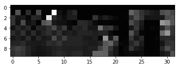

# 记忆增强神经网络（MANN）

现在，我们将看到一个有趣的 NTM 变体，称为 MANN。 它广泛用于一键式学习任务。 MANN 旨在使 NTM 在一次学习任务中表现更好。 我们知道 NTM 可以使用基于内容的寻址或基于位置的寻址。 但是在 MANN 中，我们仅使用基于内容的寻址。

MANN 使用一种称为最少最近访问的新寻址方案。 顾名思义，它写入最近最少使用的内存位置。 等待。 什么？ 我们刚刚了解到 MANN 不是基于位置的，那么为什么我们要写入最近最少使用的位置？ 这是因为最近最少使用的存储位置由读取操作确定，而读取操作由基于内容的寻址执行。 因此，我们基本上执行基于内容的寻址，以读取和写入最近最少使用的位置。

# 读写操作

现在，我们将看到如何在 MANN 中执行读写操作以及它们与 NTM 的区别。

# 读取操作

与 NTM 不同，在 MANN 中，我们使用两个不同的权重向量执行读取和写入操作。 MANN 中的读取操作与 NTM 相同。 因为我们知道，在 MANN 中，我们使用基于内容的相似度执行读取操作，所以我们将控制器发出的键向量`k[t]`与存储矩阵`M[t]`中的每一行进行比较，以了解相似度 。 我们使用余弦相似度作为检查相似度的相似度度量，可以表示为：


因此，我们的权重向量变为：

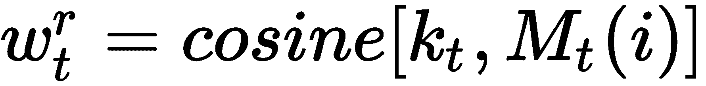

但是，与 NTM 不同，我们在这里不使用键强度`β`。 `w[t]^r`中的上标`r`表示它是读取的权重向量。 我们最终的权重向量是权重上的 softmax，即：

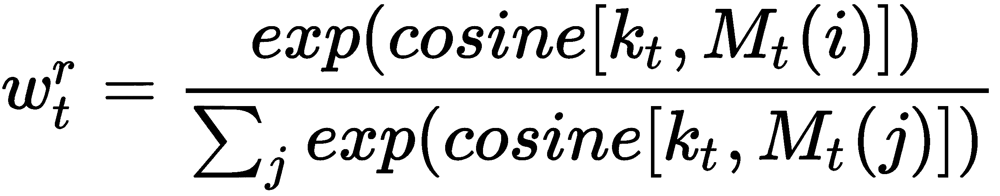

我们的读取向量是权重`w[t]^r`和存储矩阵`M[t]`的线性组合，如下所示：

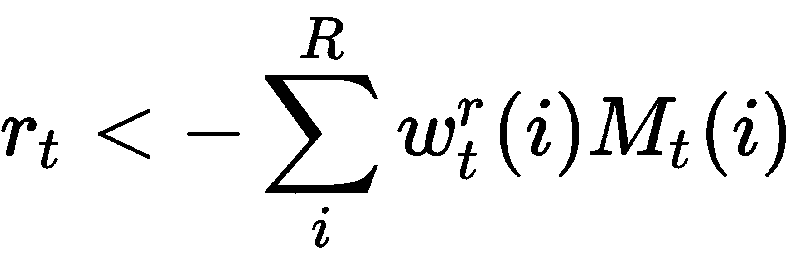

让我们看看如何在 TensorFlow 中构建它。

首先，我们使用基于内容的相似度计算读取权重向量：

```py
    def read_head_addressing(k, prev_M):

        k = tf.expand_dims(k, axis=2)
        inner_product = tf.matmul(prev_M, k)
        k_norm = tf.sqrt(tf.reduce_sum(tf.square(k), axis=1, keep_dims=True))
        M_norm = tf.sqrt(tf.reduce_sum(tf.square(prev_M), axis=2, keep_dims=True))
        norm_product = M_norm * k_norm
        K = tf.squeeze(inner_product / (norm_product + 1e-8)) 

        K_exp = tf.exp(K)
        w = K_exp / tf.reduce_sum(K_exp, axis=1, keep_dims=True) 

        return w
```

然后，我们获得读取的权重向量：

```py
 w_r = read_head_addressing(k, prev_M)
```

我们执行读取操作，这是读取的权重向量和内存的线性组合：

```py
  read_vector_list = []
        with tf.variable_scope('reading'):
            for i in range(self.head_num):
                read_vector = tf.reduce_sum(tf.expand_dims(w_r_list[i], dim=2) * M, axis=1)
                read_vector_list.append(read_vector)
```

# 写入操作

在执行写操作之前，我们要找到最近最少使用的内存位置，因为这是我们必须写的位置。 我们如何找到最近最少使用的内存位置？ 为了找到这一点，我们计算了一个新的向量，称为使用权重向量。 它由`w[t]^u`表示，并将在每个读取和写入步骤之后进行更新。 它只是读取权重向量和写入权重向量的总和，即`w[t]^u < -w[t]^r + w[t]^w`。

除了添加读取和权重向量外，我们还通过添加衰减的先前使用权重向量`w[t - 1]^u`来更新使用权重向量。 我们使用称为`γ`的衰减参数，该参数用于确定以前的使用权重必须如何衰减。 因此，我们最终的使用权重向量是衰减的先前使用权重向量，读取权重向量和写入权重向量的总和：

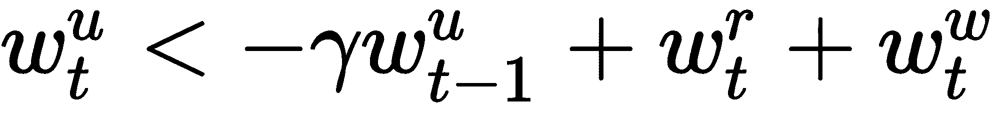

现在我们已经计算了使用权重向量，如何计算最近最少使用的位置？ 为此，我们引入了另一个权重向量，称为最不常用的权重向量`w[t]^(lu)`。

从使用权重向量`w[t]^u`计算最少使用的权重向量`w[t]^(lu)`非常简单。 我们只需将使用权重向量中的最低值的索引设置为 1，将其余值设置为 0，因为使用权重向量中的最低值意味着它最近最少使用：

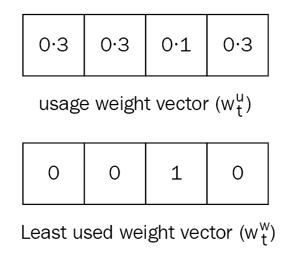

好的，接下来是什么？ 我们已经计算出最少使用的权重向量。 现在，我们如何计算写权重向量`w[t]^w`？ 我们使用 Sigmoid 门计算写入权重向量，它用于计算先前读取的权重向量`w[t - 1]^r`和先前最少使用的权重向量`w[t - 1]^(lu)`的凸组合：

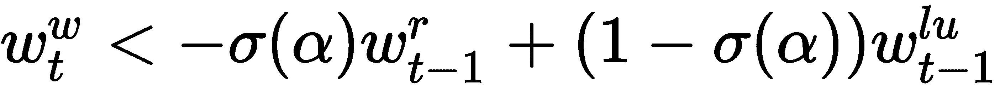

在计算写权重向量之后，我们最终更新我们的存储矩阵：

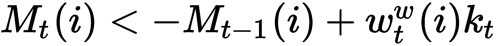

我们将看到如何在 TensorFlow 中构建它。

我们计算使用权重向量：

```py
 w_u = self.gamma * prev_w_u + tf.add_n(w_r_list) + tf.add_n(w_w_list)
```

然后，我们计算最少使用的权重向量：

```py
    def least_used(w_u):
        _, indices = tf.nn.top_k(w_u, k=self.memory_size)
        w_lu = tf.reduce_sum(tf.one_hot(indices[:, -self.head_num:], depth=self.memory_size), axis=1)
        return indices, w_lu
```

我们存储先前的索引和先前最少使用的权重向量：

```py
prev_indices, prev_w_lu =  least_used(prev_w_u)
```

我们计算写权重向量：

```py
    def write_head_addressing(sig_alpha, prev_w_r, prev_w_lu):

        return sig_alpha * prev_w_r + (1\. - sig_alpha) * prev_w_lu 
```

然后，我们更新内存：

```py
M_ = prev_M * tf.expand_dims(1\. - tf.one_hot(prev_indices[:, -1], self.memory_size), dim=2)
```

我们执行写操作：

```py

        M = M_
        with tf.variable_scope('writing'):
            for i in range(self.head_num):

                w = tf.expand_dims(w_w_list[i], axis=2)
                k = tf.expand_dims(k_list[i], axis=1)
                M = M + tf.matmul(w, k)
```

# 总结

我们看到了神经图灵机如何从内存中存储和检索信息，以及它如何使用不同的寻址机制（例如基于位置和基于内容的寻址）来读写信息。 我们还学习了如何使用 TensorFlow 实现 NTM 以执行复制任务。 然后，我们了解了 MANN 以及 MANN 与 NTM 的不同之处。 我们还了解了 MANN 如何使用最近最少使用的访问方法来克服 NTM 的缺点。

在下一章中，我们将学习**模型不可知元学习**（**MAML**）以及如何在监督和强化学习环境中使用它。

# 问题

1.  什么是 NTM？
2.  NTM 中的控制器是什么？
3.  为什么我们使用读写头？
4.  什么叫记忆？
5.  NTM 中使用哪些不同类型的寻址机制？
6.  什么叫插值门？
7.  如何从使用权重向量中计算出最少使用的权重向量？

# 进一步阅读

*   [NTM 论文](https://arxiv.org/pdf/1410.5401.pdf)
*   [使用记忆增强神经网络的一次学习](https://arxiv.org/pdf/1605.06065.pdf)